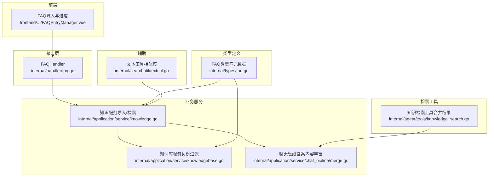
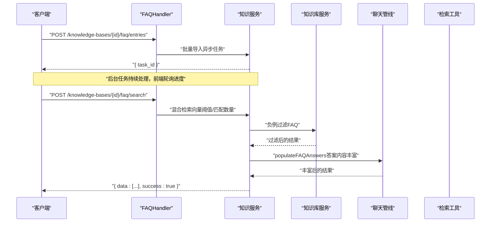
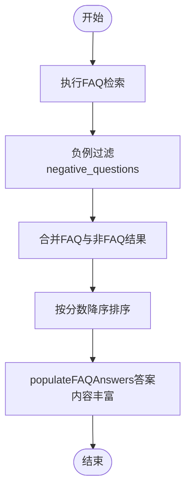
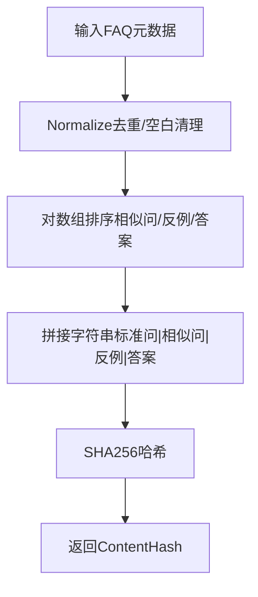
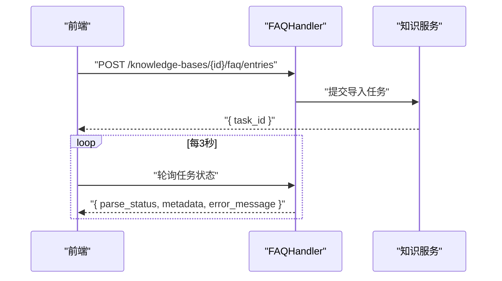
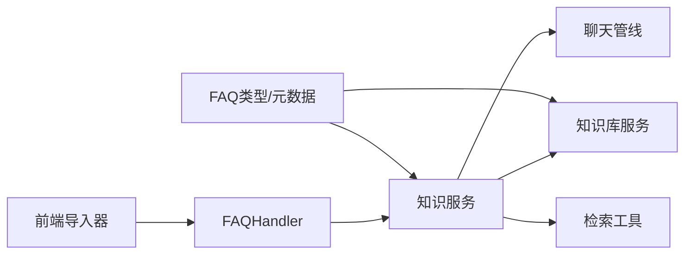

# FAQ管理API

<cite>
**本文引用的文件**
- [internal/handler/faq.go](file://internal/handler/faq.go)
- [internal/types/faq.go](file://internal/types/faq.go)
- [docs/api/faq.md](file://docs/api/faq.md)
- [frontend/src/views/knowledge/components/FAQEntryManager.vue](file://frontend/src/views/knowledge/components/FAQEntryManager.vue)
- [internal/agent/tools/knowledge_search.go](file://internal/agent/tools/knowledge_search.go)
- [internal/application/service/chat_pipline/merge.go](file://internal/application/service/chat_pipline/merge.go)
- [internal/application/service/knowledgebase.go](file://internal/application/service/knowledgebase.go)
- [internal/searchutil/textutil.go](file://internal/searchutil/textutil.go)
- [internal/application/service/knowledge.go](file://internal/application/service/knowledge.go)
</cite>

## 目录
1. [简介](#简介)
2. [项目结构](#项目结构)
3. [核心组件](#核心组件)
4. [架构总览](#架构总览)
5. [详细组件分析](#详细组件分析)
6. [依赖关系分析](#依赖关系分析)
7. [性能考量](#性能考量)
8. [故障排查指南](#故障排查指南)
9. [结论](#结论)
10. [附录](#附录)

## 简介
本文件面向FAQ管理API的使用者与维护者，系统性梳理问答对的批量导入、查询与测试流程，明确/faq端点的请求格式与验证规则，解释FAQ在检索中的优先级处理机制，并说明FAQ与文档知识的融合方式。同时，基于源码实现，阐述模糊匹配与相似问题检测的算法要点，给出构建高质量FAQ知识库的最佳实践建议。

## 项目结构
围绕FAQ管理API的关键模块分布如下：
- 接口层：负责HTTP路由与请求参数绑定、日志与错误处理
- 类型定义：FAQ条目、元数据、请求/响应结构体
- 业务服务：知识库与FAQ导入、检索、融合与优先级处理
- 前端工具：FAQ导入文件解析（JSON/CSV/XLSX）、进度轮询与状态展示
- 检索工具：FAQ与非FAQ结果合并、负例过滤、答案内容丰富

图表来源
- [internal/handler/faq.go](file://internal/handler/faq.go#L1-L227)
- [internal/types/faq.go](file://internal/types/faq.go#L1-L281)
- [internal/application/service/knowledge.go](file://internal/application/service/knowledge.go#L1-L200)
- [internal/application/service/knowledgebase.go](file://internal/application/service/knowledgebase.go#L737-L874)
- [internal/application/service/chat_pipline/merge.go](file://internal/application/service/chat_pipline/merge.go#L217-L337)
- [internal/agent/tools/knowledge_search.go](file://internal/agent/tools/knowledge_search.go#L528-L581)
- [frontend/src/views/knowledge/components/FAQEntryManager.vue](file://frontend/src/views/knowledge/components/FAQEntryManager.vue#L2059-L2266)
- [internal/searchutil/textutil.go](file://internal/searchutil/textutil.go#L1-L70)

章节来源
- [internal/handler/faq.go](file://internal/handler/faq.go#L1-L227)
- [internal/types/faq.go](file://internal/types/faq.go#L1-L281)
- [docs/api/faq.md](file://docs/api/faq.md#L1-L311)

## 核心组件
- FAQHandler：封装/faq相关HTTP接口，包括列表、批量导入、单条创建、更新、批量标签/状态变更、删除、混合检索等。
- FAQ类型与元数据：定义FAQ条目结构、FAQChunkMetadata、FAQContentHash计算、标准化与去重逻辑。
- 知识服务：实现FAQ批量导入（异步任务）、创建/更新/删除、检索（向量阈值、匹配数量限制）。
- 知识库服务：对FAQ检索结果应用负例过滤，提升召回质量。
- 聊天管线：在最终合并阶段，将FAQ元数据的答案内容注入到检索结果中，增强回复质量。
- 前端导入器：支持JSON/CSV/XLSX三类文件，自动解析并预览，提供进度轮询与状态展示。
- 文本工具：提供基础的文本归一化、分词集合、Jaccard相似度计算等通用能力。

章节来源
- [internal/handler/faq.go](file://internal/handler/faq.go#L1-L227)
- [internal/types/faq.go](file://internal/types/faq.go#L1-L281)
- [internal/application/service/knowledge.go](file://internal/application/service/knowledge.go#L1-L200)
- [internal/application/service/knowledgebase.go](file://internal/application/service/knowledgebase.go#L737-L874)
- [internal/application/service/chat_pipline/merge.go](file://internal/application/service/chat_pipline/merge.go#L217-L337)
- [frontend/src/views/knowledge/components/FAQEntryManager.vue](file://frontend/src/views/knowledge/components/FAQEntryManager.vue#L2059-L2266)
- [internal/searchutil/textutil.go](file://internal/searchutil/textutil.go#L1-L70)

## 架构总览
FAQ管理API采用“接口层-服务层-检索/融合”的分层设计。接口层负责参数绑定与错误处理；服务层承担业务逻辑（导入、检索、融合）；检索工具与聊天管线负责结果合并与答案内容丰富；前端负责文件解析与进度轮询。

图表来源
- [internal/handler/faq.go](file://internal/handler/faq.go#L199-L227)
- [internal/application/service/knowledge.go](file://internal/application/service/knowledge.go#L1-L200)
- [internal/application/service/knowledgebase.go](file://internal/application/service/knowledgebase.go#L737-L874)
- [internal/application/service/chat_pipline/merge.go](file://internal/application/service/chat_pipline/merge.go#L217-L337)
- [internal/agent/tools/knowledge_search.go](file://internal/agent/tools/knowledge_search.go#L528-L581)

## 详细组件分析

### 1) /faq端点与CSV导入格式
- 端点与用途
  - 列表：GET /knowledge-bases/:id/faq/entries（分页、标签筛选、关键字）
  - 批量导入：POST /knowledge-bases/:id/faq/entries（mode=append/replace，entries[]）
  - 单条创建：POST /knowledge-bases/:id/faq/entry（同步，含重复检测）
  - 更新/批量更新：PUT /knowledge-bases/:id/faq/entries/:entry_id、PUT /knowledge-bases/:id/faq/entries/status、PUT /knowledge-bases/:id/faq/entries/tags
  - 删除：DELETE /knowledge-bases/:id/faq/entries（ids[]）
  - 检索：POST /knowledge-bases/:id/faq/search（query_text/vector_threshold/match_count）

- CSV导入格式与验证规则（前端解析）
  - 支持字段映射：问题/standard_question、机器人回答/answers、相似问题/similar_questions、反例问题/negative_questions、分类/tag_id、是否停用/is_enabled
  - 字段解析策略
    - answers：默认以“##”为分隔符拆分；若不含“##”，整列作为单个答案
    - similar_questions/negative_questions：按“##”拆分并去空
    - is_enabled：支持TRUE/FALSE、true/false、是/否、1/0等，否则保持未指定
    - tag_id：直接取值
  - 文件类型：JSON/CSV/XLSX
  - 预览：解析成功后在前端预览entries[]
  - 错误处理：解析失败或格式不合法时提示并清空预览

- 请求参数绑定与校验（接口层）
  - 列表：分页参数绑定，tag_id/keyword安全清洗
  - 批量导入：mode必须为append或replace，entries必填
  - 单条创建：standard_question与answers必填，similar_questions/negative_questions可选
  - 检索：query_text必填，match_count有默认与上限约束

章节来源
- [docs/api/faq.md](file://docs/api/faq.md#L1-L311)
- [internal/handler/faq.go](file://internal/handler/faq.go#L25-L119)
- [internal/handler/faq.go](file://internal/handler/faq.go#L121-L197)
- [internal/handler/faq.go](file://internal/handler/faq.go#L199-L227)
- [frontend/src/views/knowledge/components/FAQEntryManager.vue](file://frontend/src/views/knowledge/components/FAQEntryManager.vue#L2059-L2266)

### 2) FAQ在检索中的优先级与融合机制
- 结果合并与优先级
  - 检索工具将FAQ结果与非FAQ结果合并，先放FAQ，再放重排后的非FAQ结果，最后按分数降序排序
  - FAQ结果保留原有顺序，非FAQ结果按复合评分重排

- 答案内容丰富
  - 聊天管线根据ChunkID拉取FAQ元数据，将标准问与答案拼接为统一内容，覆盖检索结果的Content，提升回复质量

- 负例过滤
  - 对FAQ检索结果，系统会基于negative_questions进行过滤，排除与查询完全匹配的负例问题，降低误召回

图表来源
- [internal/agent/tools/knowledge_search.go](file://internal/agent/tools/knowledge_search.go#L528-L581)
- [internal/application/service/chat_pipline/merge.go](file://internal/application/service/chat_pipline/merge.go#L217-L337)
- [internal/application/service/knowledgebase.go](file://internal/application/service/knowledgebase.go#L737-L874)

章节来源
- [internal/agent/tools/knowledge_search.go](file://internal/agent/tools/knowledge_search.go#L528-L581)
- [internal/application/service/chat_pipline/merge.go](file://internal/application/service/chat_pipline/merge.go#L217-L337)
- [internal/application/service/knowledgebase.go](file://internal/application/service/knowledgebase.go#L737-L874)

### 3) 模糊匹配与相似问题检测
- 内容哈希与去重
  - FAQContentHash由标准问、相似问（排序后）、反例（排序后）、答案（排序后）拼接后计算SHA256，用于快速匹配与去重
  - FAQChunkMetadata.Normalize负责空白清理与去重，确保相同内容产生一致哈希

- 相似度工具
  - 提供TokenizeSimple与Jaccard相似度计算，可用于通用文本相似度评估（例如在导入前做相似度预检）

- 检索阈值
  - 检索接口支持vector_threshold（0-1），用于控制向量相似度阈值；match_count限制返回数量（默认10，最大200）

图表来源
- [internal/types/faq.go](file://internal/types/faq.go#L125-L163)
- [internal/searchutil/textutil.go](file://internal/searchutil/textutil.go#L1-L70)

章节来源
- [internal/types/faq.go](file://internal/types/faq.go#L125-L163)
- [internal/searchutil/textutil.go](file://internal/searchutil/textutil.go#L1-L70)
- [internal/handler/faq.go](file://internal/handler/faq.go#L199-L227)

### 4) 批量导入流程与任务状态
- 异步导入
  - 批量导入返回task_id，后台任务以固定批次大小（默认50条/批）处理，持续更新导入进度与统计
- 前端轮询
  - 通过localStorage持久化task_id，定时轮询获取parse_status、metadata（import_progress/import_total/import_processed）与error_message，动态更新进度条与状态

图表来源
- [internal/handler/faq.go](file://internal/handler/faq.go#L51-L74)
- [internal/application/service/knowledge.go](file://internal/application/service/knowledge.go#L2959-L2981)
- [frontend/src/views/knowledge/components/FAQEntryManager.vue](file://frontend/src/views/knowledge/components/FAQEntryManager.vue#L2194-L2266)

章节来源
- [internal/handler/faq.go](file://internal/handler/faq.go#L51-L74)
- [internal/application/service/knowledge.go](file://internal/application/service/knowledge.go#L2959-L2981)
- [frontend/src/views/knowledge/components/FAQEntryManager.vue](file://frontend/src/views/knowledge/components/FAQEntryManager.vue#L2194-L2266)

### 5) FAQ索引与分别索引模式
- 索引模式
  - 支持“问题+答案”联合索引与“分别索引”两种模式，分别索引模式下为每个问题单独建立索引项，提升召回粒度
- 索引内容构建
  - 根据FAQ配置选择索引模式与问题索引模式，构建IndexInfo列表，用于后续检索

章节来源
- [internal/application/service/knowledge.go](file://internal/application/service/knowledge.go#L4007-L4048)

## 依赖关系分析
- 组件耦合
  - FAQHandler依赖知识服务接口，实现列表、导入、创建、更新、删除、检索等操作
  - 知识服务依赖知识库服务（负例过滤）、聊天管线（答案内容丰富）、检索引擎等
  - 前端导入器与接口层解耦，通过task_id与metadata交互

图表来源
- [internal/handler/faq.go](file://internal/handler/faq.go#L1-L227)
- [internal/types/faq.go](file://internal/types/faq.go#L1-L281)
- [internal/application/service/knowledge.go](file://internal/application/service/knowledge.go#L1-L200)
- [internal/application/service/knowledgebase.go](file://internal/application/service/knowledgebase.go#L737-L874)
- [internal/application/service/chat_pipline/merge.go](file://internal/application/service/chat_pipline/merge.go#L217-L337)
- [frontend/src/views/knowledge/components/FAQEntryManager.vue](file://frontend/src/views/knowledge/components/FAQEntryManager.vue#L2059-L2266)

## 性能考量
- 批量导入批次大小：默认50条/批，减少单次处理压力，提升吞吐
- 检索阈值与数量限制：vector_threshold与match_count可调，平衡召回与性能
- 负例过滤：在FAQ检索阶段剔除明显无关的负例，减少下游处理成本
- 答案内容丰富：仅对FAQ类型的Chunk进行答案内容拼接，避免对非FAQ内容的无效处理

[本节为通用指导，无需列出具体文件来源]

## 故障排查指南
- 常见错误
  - 参数不合法：分页参数、批量导入mode、entries、单条创建必填字段缺失
  - 重复检测：标准问或相似问与现有FAQ重复导致创建失败
  - 负例命中：查询与negative_questions完全匹配，被过滤掉
- 前端轮询
  - 若parse_status为failed，查看error_message定位问题；成功后自动刷新列表
- 日志与追踪
  - 接口层与服务层均输出错误日志，便于定位异常

章节来源
- [internal/handler/faq.go](file://internal/handler/faq.go#L25-L119)
- [docs/api/faq.md](file://docs/api/faq.md#L157-L167)
- [frontend/src/views/knowledge/components/FAQEntryManager.vue](file://frontend/src/views/knowledge/components/FAQEntryManager.vue#L2237-L2266)

## 结论
FAQ管理API提供了完善的问答对管理能力，涵盖批量导入、查询与测试。通过内容哈希去重、负例过滤与答案内容丰富，系统在保证召回质量的同时提升了检索效率与回复一致性。前端侧的文件解析与进度轮询进一步优化了用户体验。建议在实际使用中遵循字段规范、合理设置阈值与数量，并结合负例与相似问题策略构建高质量FAQ知识库。

[本节为总结性内容，无需列出具体文件来源]

## 附录

### A. FAQ端点一览与参数说明
- GET /knowledge-bases/:id/faq/entries
  - 查询参数：page/page_size/tag_id(keyword)
- POST /knowledge-bases/:id/faq/entries
  - 请求体：mode（append/replace）、entries[]、knowledge_id（可选）
- POST /knowledge-bases/:id/faq/entry
  - 请求体：standard_question（必填）、similar_questions、negative_questions、answers（必填）、tag_id、is_enabled
- PUT /knowledge-bases/:id/faq/entries/:entry_id
  - 请求体：同上（部分字段可选）
- PUT /knowledge-bases/:id/faq/entries/status
  - 请求体：updates（entry_id->enable）
- PUT /knowledge-bases/:id/faq/entries/tags
  - 请求体：updates（entry_id->tag_id或null）
- DELETE /knowledge-bases/:id/faq/entries
  - 请求体：ids[]
- POST /knowledge-bases/:id/faq/search
  - 请求体：query_text（必填）、vector_threshold（0-1）、match_count（默认10，最大200）

章节来源
- [docs/api/faq.md](file://docs/api/faq.md#L1-L311)
- [internal/handler/faq.go](file://internal/handler/faq.go#L25-L227)

### B. 最佳实践
- 数据质量
  - 标准问清晰、唯一；相似问尽量覆盖常见变体；答案简洁、可操作
  - 使用negative_questions明确排除与主题无关的查询
- 导入策略
  - 大规模导入使用append模式，先预估总量，关注导入进度与错误
  - 导入前可对CSV进行去重与规范化处理
- 检索优化
  - 合理设置vector_threshold与match_count，平衡召回与相关性
  - 为高频问题补充相似问，提升模糊匹配效果
- 融合与优先级
  - FAQ优先展示，随后是非FAQ结果；通过负例过滤减少误召回
  - 使用答案内容丰富，提升回复的一致性与可读性

[本节为通用指导，无需列出具体文件来源]