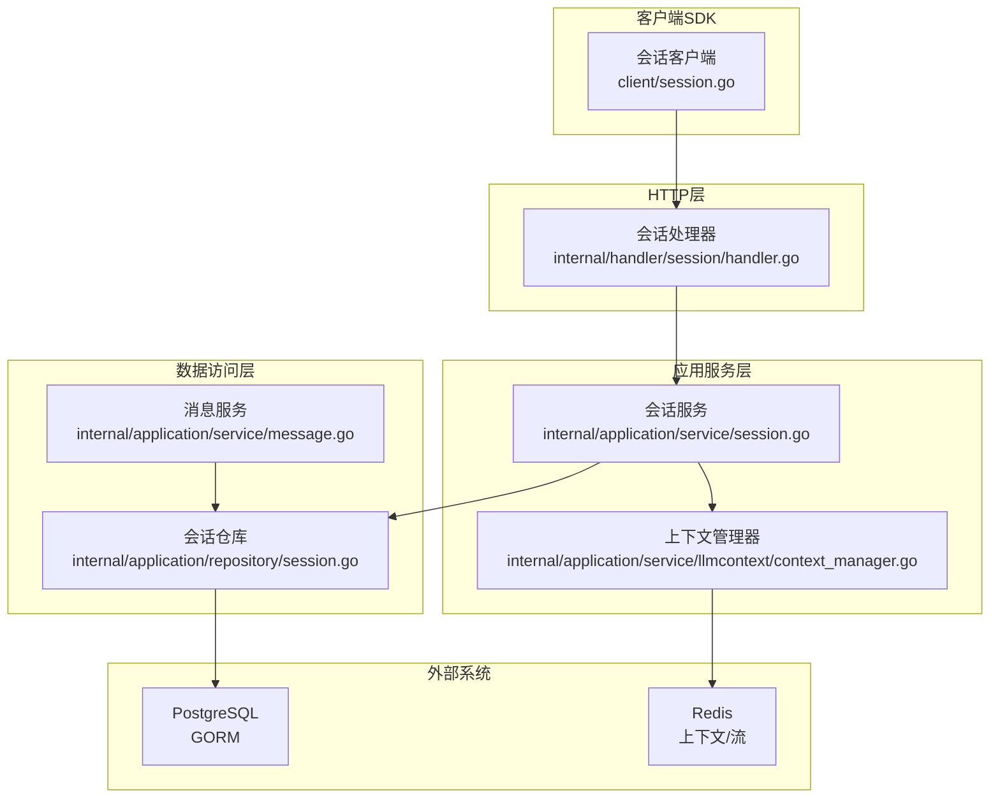
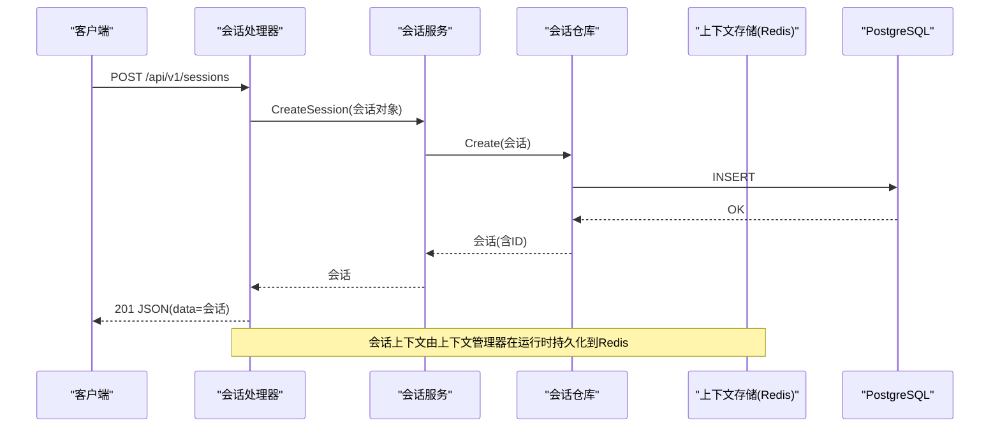
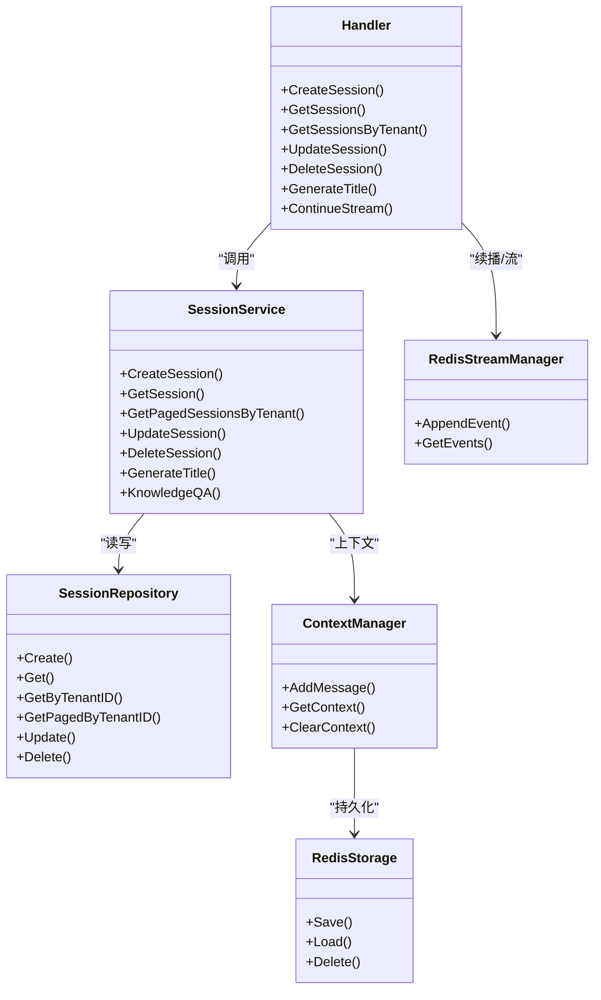

# 会话管理API

<cite>
**本文引用的文件**
- [internal/handler/session/handler.go](file://internal/handler/session/handler.go)
- [client/session.go](file://client/session.go)
- [internal/application/service/session.go](file://internal/application/service/session.go)
- [internal/application/repository/session.go](file://internal/application/repository/session.go)
- [docs/api/session.md](file://docs/api/session.md)
- [internal/types/session.go](file://internal/types/session.go)
- [internal/application/service/llmcontext/redis_storage.go](file://internal/application/service/llmcontext/redis_storage.go)
- [internal/application/service/llmcontext/context_manager.go](file://internal/application/service/llmcontext/context_manager.go)
- [internal/container/container.go](file://internal/container/container.go)
- [internal/config/config.go](file://internal/config/config.go)
- [internal/stream/redis_manager.go](file://internal/stream/redis_manager.go)
- [internal/application/service/message.go](file://internal/application/service/message.go)
- [client/message.go](file://client/message.go)
</cite>

## 目录
1. [简介](#简介)
2. [项目结构](#项目结构)
3. [核心组件](#核心组件)
4. [架构总览](#架构总览)
5. [详细组件分析](#详细组件分析)
6. [依赖关系分析](#依赖关系分析)
7. [性能考量](#性能考量)
8. [故障排查指南](#故障排查指南)
9. [结论](#结论)
10. [附录](#附录)

## 简介
本文件为“会话管理API”的权威技术文档，聚焦于会话的创建、查询与历史记录管理。文档详细说明了 /sessions 端点的会话上下文持久化机制，包括与Redis或数据库的交互；解释会话元数据（名称、模型配置等）的存储结构；参考 internal/handler/session/handler.go 中的实现，描述会话过期策略与清理机制；并提供使用 client/session.go 进行会话批量操作的示例，以及与聊天API的关联关系。

## 项目结构
围绕会话管理的关键模块如下：
- HTTP层：会话路由与处理器，负责接收请求、鉴权、参数校验与错误处理
- 应用服务层：会话业务逻辑，包含会话生命周期管理、标题生成、知识问答流程编排
- 数据访问层：会话与消息的仓库接口与实现，支持GORM PostgreSQL持久化
- 上下文与流：基于Redis的会话上下文存储与事件流管理，含TTL过期策略
- 客户端SDK：提供会话与消息的批量操作能力，便于集成与自动化

图表来源
- [internal/handler/session/handler.go](file://internal/handler/session/handler.go#L1-L337)
- [internal/application/service/session.go](file://internal/application/service/session.go#L1-L220)
- [internal/application/repository/session.go](file://internal/application/repository/session.go#L1-L90)
- [internal/application/service/llmcontext/context_manager.go](file://internal/application/service/llmcontext/context_manager.go#L1-L169)
- [internal/application/service/llmcontext/redis_storage.go](file://internal/application/service/llmcontext/redis_storage.go#L1-L113)
- [client/session.go](file://client/session.go#L1-L200)

章节来源
- [internal/handler/session/handler.go](file://internal/handler/session/handler.go#L1-L337)
- [internal/application/service/session.go](file://internal/application/service/session.go#L1-L220)
- [internal/application/repository/session.go](file://internal/application/repository/session.go#L1-L90)
- [internal/application/service/llmcontext/context_manager.go](file://internal/application/service/llmcontext/context_manager.go#L1-L169)
- [internal/application/service/llmcontext/redis_storage.go](file://internal/application/service/llmcontext/redis_storage.go#L1-L113)
- [client/session.go](file://client/session.go#L1-L200)

## 核心组件
- 会话处理器（Handler）：负责 /sessions 的增删改查、生成标题、继续流式会话等入口
- 会话服务（Service）：封装会话业务规则，协调仓库、消息、模型、事件总线等
- 会话仓库（Repository）：通过GORM对PostgreSQL进行会话的增删改查与分页
- 上下文存储（ContextStorage）：默认Redis实现，保存会话上下文消息，带TTL过期
- 上下文管理器（ContextManager）：在添加消息时执行压缩与落盘，统一上下文生命周期
- 流管理器（StreamManager）：基于Redis的事件流，支持续播与TTL过期
- 客户端SDK：提供会话批量查询、标题生成、流式问答等便捷方法

章节来源
- [internal/handler/session/handler.go](file://internal/handler/session/handler.go#L1-L337)
- [internal/application/service/session.go](file://internal/application/service/session.go#L1-L220)
- [internal/application/repository/session.go](file://internal/application/repository/session.go#L1-L90)
- [internal/application/service/llmcontext/context_manager.go](file://internal/application/service/llmcontext/context_manager.go#L1-L169)
- [internal/application/service/llmcontext/redis_storage.go](file://internal/application/service/llmcontext/redis_storage.go#L1-L113)
- [internal/stream/redis_manager.go](file://internal/stream/redis_manager.go#L1-L95)
- [client/session.go](file://client/session.go#L1-L200)

## 架构总览
会话管理API采用清晰的分层架构：
- HTTP层：接收REST请求，解析参数，调用服务层
- 服务层：执行业务逻辑，读写仓库与外部系统
- 数据层：PostgreSQL持久化会话与消息；Redis持久化会话上下文与事件流
- 客户端SDK：封装常用操作，简化集成

图表来源
- [internal/handler/session/handler.go](file://internal/handler/session/handler.go#L42-L149)
- [internal/application/service/session.go](file://internal/application/service/session.go#L77-L98)
- [internal/application/repository/session.go](file://internal/application/repository/session.go#L22-L31)
- [internal/application/service/llmcontext/context_manager.go](file://internal/application/service/llmcontext/context_manager.go#L45-L103)
- [internal/application/service/llmcontext/redis_storage.go](file://internal/application/service/llmcontext/redis_storage.go#L49-L70)

## 详细组件分析

### 会话处理器（HTTP层）
- 负责创建、查询、分页查询、更新、删除会话
- 生成会话标题、继续未完成的流式会话
- 参数校验、鉴权（从上下文提取租户ID）、错误处理
- 与消息服务、知识库服务、流管理器协作

关键流程要点
- 创建会话：解析请求体，设置默认策略与摘要参数，调用服务层创建
- 查询会话：按ID获取，支持租户隔离
- 分页查询：支持页码与页大小
- 更新/删除：鉴权后调用服务层
- 生成标题：从消息仓库取首条用户消息，调用模型生成标题并回写
- 继续流式会话：通过流管理器续播事件

章节来源
- [internal/handler/session/handler.go](file://internal/handler/session/handler.go#L42-L337)

### 会话服务（应用服务层）
- 会话生命周期管理：创建、查询、分页、更新、删除
- 标题生成：选择可用模型，构造提示词，调用模型生成并持久化
- 知识问答：根据会话策略与租户配置，选择模型与检索参数，触发事件流水线
- 临时知识库状态清理：删除会话相关的临时KB状态（Redis）

章节来源
- [internal/application/service/session.go](file://internal/application/service/session.go#L77-L218)
- [internal/application/service/session.go](file://internal/application/service/session.go#L220-L388)
- [internal/application/service/session.go](file://internal/application/service/session.go#L390-L582)

### 会话仓库（数据访问层）
- 基于GORM的PostgreSQL实现
- 提供创建、按ID获取、按租户获取、分页、更新、删除
- 自动维护创建/更新时间戳

章节来源
- [internal/application/repository/session.go](file://internal/application/repository/session.go#L1-L90)

### 会话元数据与存储结构
- 会话结构包含：ID、标题、描述、租户ID、知识库ID、多轮策略、兜底策略、检索阈值、重排模型、摘要模型、摘要参数、Agent配置、上下文配置、创建/更新时间等
- 摘要参数与上下文配置以JSON/JSONB形式存储，支持复杂结构
- 会话消息不直接存储在会话表中，而是独立的消息表，会话与消息通过外键关联

章节来源
- [internal/types/session.go](file://internal/types/session.go#L72-L106)
- [internal/types/session.go](file://internal/types/session.go#L133-L166)

### 会话上下文持久化机制（Redis）
- 默认使用Redis作为上下文存储后端，键前缀与TTL可在容器初始化时配置
- 上下文管理器在添加消息时加载、压缩、落盘，确保上下文不超过最大token限制
- Redis键结构：以会话ID为后缀，保存序列化的消息数组
- TTL过期：默认24小时，过期后上下文自动失效

章节来源
- [internal/container/container.go](file://internal/container/container.go#L217-L223)
- [internal/application/service/llmcontext/context_manager.go](file://internal/application/service/llmcontext/context_manager.go#L45-L103)
- [internal/application/service/llmcontext/redis_storage.go](file://internal/application/service/llmcontext/redis_storage.go#L1-L113)

### 会话过期策略与清理机制
- 会话实体本身在数据库中无显式过期字段；会话记录的生命周期由业务决定（创建、更新、删除）
- 会话上下文（Redis）具备TTL过期策略，默认24小时；过期后自动清理
- 会话删除时，服务层会清理该会话相关的临时KB状态（Redis）
- 事件流（Redis）同样具备TTL过期策略，默认1小时；续播接口按偏移量拉取

章节来源
- [internal/application/service/llmcontext/redis_storage.go](file://internal/application/service/llmcontext/redis_storage.go#L21-L42)
- [internal/application/service/session.go](file://internal/application/service/session.go#L191-L218)
- [internal/stream/redis_manager.go](file://internal/stream/redis_manager.go#L1-L95)
- [internal/config/config.go](file://internal/config/config.go#L120-L133)

### 与聊天API的关联关系
- 会话与知识问答API紧密关联：会话服务在知识问答流程中读取会话策略与租户配置，选择合适的模型与检索参数
- 流式问答通过事件流水线与流管理器实现，支持续播与停止
- 客户端SDK提供流式问答与续播接口，便于前端实时展示

章节来源
- [internal/application/service/session.go](file://internal/application/service/session.go#L390-L582)
- [client/session.go](file://client/session.go#L250-L331)
- [client/session.go](file://client/session.go#L333-L397)

### 使用客户端SDK进行会话批量操作
- 创建会话：POST /api/v1/sessions
- 获取单个会话：GET /api/v1/sessions/{id}
- 获取租户会话列表：GET /api/v1/sessions?page=&page_size=
- 更新会话：PUT /api/v1/sessions/{id}
- 删除会话：DELETE /api/v1/sessions/{id}
- 生成会话标题：POST /api/v1/sessions/{session_id}/generate_title
- 继续未完成的会话：GET /api/v1/sessions/continue-stream/{session_id}?message_id={message_id}

章节来源
- [docs/api/session.md](file://docs/api/session.md#L1-L362)
- [client/session.go](file://client/session.go#L115-L195)
- [client/session.go](file://client/session.go#L212-L227)
- [client/session.go](file://client/session.go#L333-L397)

## 依赖关系分析
- 会话处理器依赖会话服务、消息服务、知识库服务、流管理器与配置
- 会话服务依赖会话仓库、消息仓库、模型服务、租户服务、事件总线、代理服务、上下文存储与Redis客户端
- 会话仓库依赖GORM与PostgreSQL
- 上下文存储与流管理器依赖Redis

图表来源
- [internal/handler/session/handler.go](file://internal/handler/session/handler.go#L42-L337)
- [internal/application/service/session.go](file://internal/application/service/session.go#L77-L218)
- [internal/application/repository/session.go](file://internal/application/repository/session.go#L1-L90)
- [internal/application/service/llmcontext/context_manager.go](file://internal/application/service/llmcontext/context_manager.go#L1-L169)
- [internal/application/service/llmcontext/redis_storage.go](file://internal/application/service/llmcontext/redis_storage.go#L1-L113)
- [internal/stream/redis_manager.go](file://internal/stream/redis_manager.go#L1-L95)

## 性能考量
- 上下文压缩：当消息总数超过最大token阈值时，上下文管理器会执行压缩策略，减少后续推理成本
- Redis TTL：上下文与事件流均设置TTL，避免无限增长导致内存压力
- 分页查询：会话列表采用分页查询，降低单次响应负载
- 并发池：全局并发池用于控制任务并发度，避免资源争用

章节来源
- [internal/application/service/llmcontext/context_manager.go](file://internal/application/service/llmcontext/context_manager.go#L70-L103)
- [internal/application/service/llmcontext/redis_storage.go](file://internal/application/service/llmcontext/redis_storage.go#L21-L42)
- [internal/container/container.go](file://internal/container/container.go#L477-L509)

## 故障排查指南
- 会话创建失败：检查请求体参数、租户ID、默认策略与摘要参数是否正确
- 会话查询失败：确认会话ID有效且属于当前租户
- 标题生成失败：确认存在可用的摘要模型或提供模型ID
- 流式续播异常：确认message_id有效，Redis连接正常，TTL未过期
- 会话删除后残留：检查Redis中临时KB状态是否清理成功

章节来源
- [internal/handler/session/handler.go](file://internal/handler/session/handler.go#L190-L337)
- [internal/application/service/session.go](file://internal/application/service/session.go#L220-L218)
- [internal/application/service/llmcontext/redis_storage.go](file://internal/application/service/llmcontext/redis_storage.go#L99-L113)
- [internal/stream/redis_manager.go](file://internal/stream/redis_manager.go#L56-L95)

## 结论
本文件系统性梳理了会话管理API的实现与交互，明确了会话上下文的Redis持久化机制、会话元数据的存储结构、过期策略与清理机制，并提供了客户端SDK的批量操作示例与与聊天API的关联关系。通过上下文压缩、TTL过期与分页查询等手段，系统在保证功能完整性的同时兼顾了性能与可维护性。

## 附录
- 会话API参考：见文档目录下的会话API说明
- 客户端SDK方法：创建、查询、分页、更新、删除、生成标题、流式问答与续播

章节来源
- [docs/api/session.md](file://docs/api/session.md#L1-L362)
- [client/session.go](file://client/session.go#L115-L397)