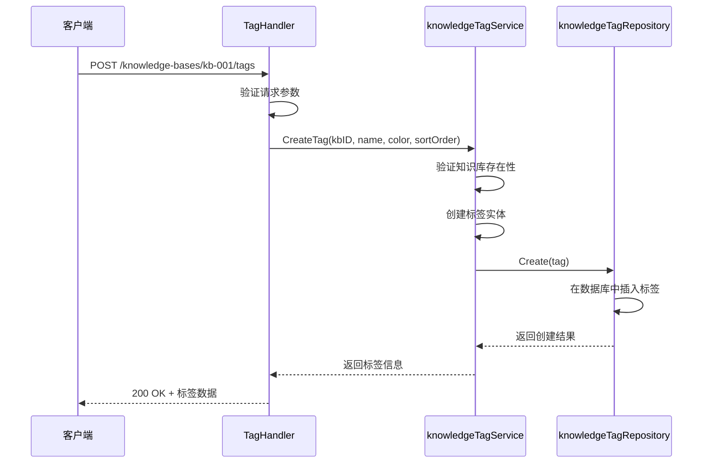
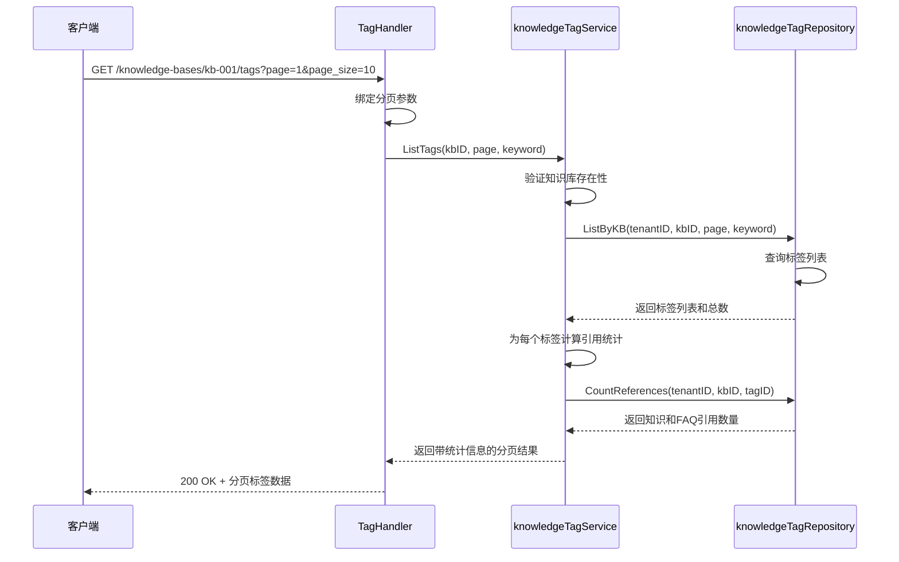
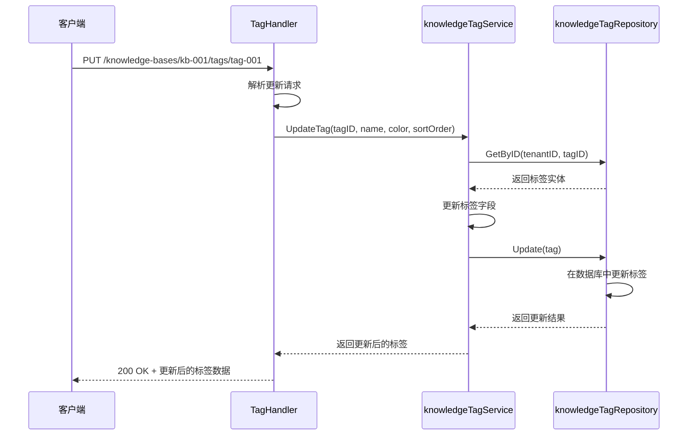
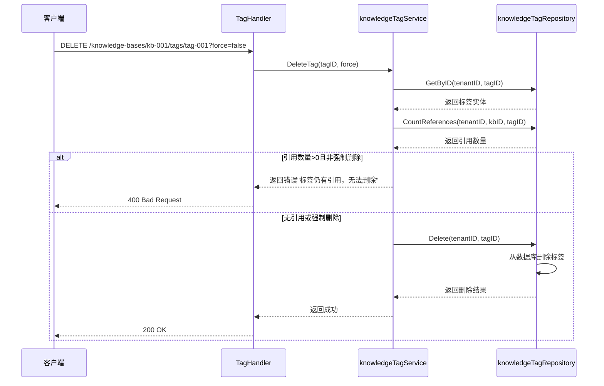
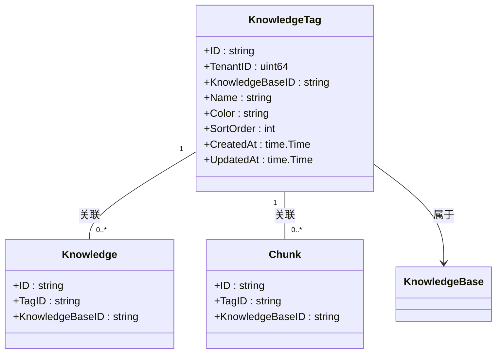
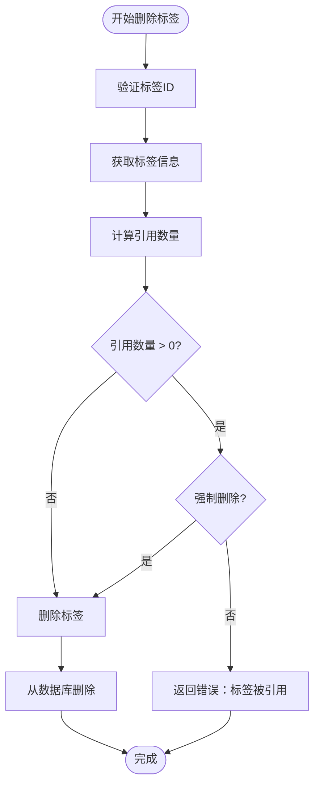
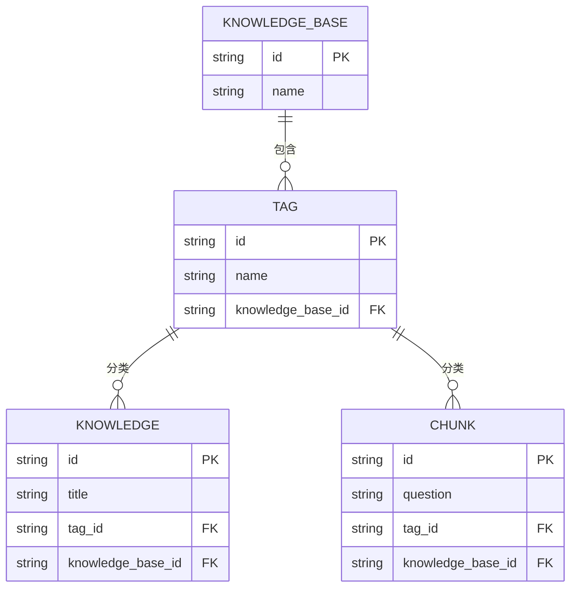
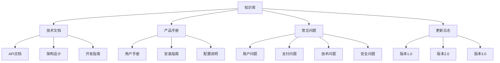

# 标签管理API

<cite>
**本文档引用的文件**
- [tag.go](file://internal/handler/tag.go)
- [tag.go](file://internal/application/service/tag.go)
- [tag.go](file://internal/application/repository/tag.go)
- [tag.go](file://internal/types/tag.go)
- [tag.go](file://internal/types/interfaces/tag.go)
- [tag.md](file://docs/api/tag.md)
- [index.ts](file://frontend/src/api/knowledge-base/index.ts)
- [knowledge.go](file://internal/types/knowledge.go)
- [chunk.go](file://internal/types/chunk.go)
</cite>

## 目录
1. [简介](#简介)
2. [标签端点操作](#标签端点操作)
3. [标签唯一性与级联删除](#标签唯一性与级联删除)
4. [知识检索中的标签过滤](#知识检索中的标签过滤)
5. [标签化知识库实践](#标签化知识库实践)
6. [API调用示例](#api调用示例)

## 简介

标签管理API为知识库系统提供了强大的分类和组织功能。通过标签，用户可以对知识文档和FAQ条目进行分类管理，实现更高效的知识检索和内容组织。标签系统支持创建、更新、查询和删除操作，并提供了详细的使用统计信息。

标签在系统中具有明确的作用域，每个标签都归属于特定的知识库（和租户），用于对知识（文档）和FAQ条目进行分类。系统通过标签ID与知识和FAQ条目的关联，实现了灵活的内容组织和过滤机制。

**Section sources**
- [tag.go](file://internal/types/tag.go#L5-L7)

## 标签端点操作

标签管理API提供了完整的CRUD（创建、读取、更新、删除）操作，通过`/knowledge-bases/:id/tags`端点进行访问。这些操作允许用户对知识库中的标签进行全生命周期管理。

### 创建标签

`POST /knowledge-bases/:id/tags`端点用于创建新的标签。请求体需要包含标签名称（必填）、颜色和排序顺序等信息。系统会验证知识库ID和标签名称的有效性，并确保标签名称在同一个知识库内唯一。



**Diagram sources**
- [tag.go](file://internal/handler/tag.go#L58-L84)
- [tag.go](file://internal/application/service/tag.go#L80-L111)
- [tag.go](file://internal/application/repository/tag.go#L22-L25)

### 查询标签

`GET /knowledge-bases/:id/tags`端点用于获取知识库中的所有标签。该操作支持分页和关键字搜索功能，同时返回每个标签的使用统计信息，包括关联的知识文档数量和FAQ条目数量。



**Diagram sources**
- [tag.go](file://internal/handler/tag.go#L25-L50)
- [tag.go](file://internal/application/service/tag.go#L32-L78)
- [tag.go](file://internal/application/repository/tag.go#L43-L83)

### 更新标签

`PUT /knowledge-bases/:id/tags/:tag_id`端点用于更新现有标签的信息。该操作支持部分更新，客户端可以只提供需要修改的字段（名称、颜色或排序顺序）。



**Diagram sources**
- [tag.go](file://internal/handler/tag.go#L92-L117)
- [tag.go](file://internal/application/service/tag.go#L113-L148)
- [tag.go](file://internal/application/repository/tag.go#L27-L30)

### 删除标签

`DELETE /knowledge-bases/:id/tags/:tag_id`端点用于删除标签。系统实现了安全删除机制，当标签仍被知识文档或FAQ条目引用时，默认情况下不允许删除，除非通过`force=true`查询参数强制删除。



**Diagram sources**
- [tag.go](file://internal/handler/tag.go#L119-L137)
- [tag.go](file://internal/application/service/tag.go#L150-L168)
- [tag.go](file://internal/application/repository/tag.go#L85-L90)

**Section sources**
- [tag.go](file://internal/handler/tag.go#L15-L140)
- [tag.md](file://docs/api/tag.md#L1-L151)

## 标签唯一性与级联删除

标签系统在设计上实现了严格的唯一性约束和安全的删除逻辑，确保数据的一致性和完整性。

### 唯一性约束

标签的唯一性约束主要体现在两个层面：标识符唯一性和业务逻辑唯一性。

1. **标识符唯一性**：每个标签都有一个全局唯一的UUID作为ID，这是数据库层面的主键约束，确保了标签实体的唯一性。
2. **业务逻辑唯一性**：在同一个知识库内，标签名称必须唯一。这一约束通过业务逻辑层的验证实现，防止用户创建同名标签。



**Diagram sources**
- [tag.go](file://internal/types/tag.go#L8-L25)
- [knowledge.go](file://internal/types/knowledge.go#L57-L106)
- [chunk.go](file://internal/types/chunk.go#L1-L50)

### 级联删除逻辑

标签的删除操作采用了保护性级联删除策略，与传统的数据库级联删除不同，系统通过引用计数机制来确保数据安全。

删除流程如下：
1. 首先检查标签是否存在
2. 计算标签被知识文档和FAQ条目的引用数量
3. 如果引用数量大于0且未指定强制删除，则返回错误
4. 如果无引用或指定强制删除，则执行删除操作

这种设计避免了意外删除导致的数据丢失，同时通过`force`参数提供了紧急情况下的删除能力。



**Diagram sources**
- [tag.go](file://internal/application/service/tag.go#L150-L168)
- [tag.go](file://internal/application/repository/tag.go#L92-L112)

**Section sources**
- [tag.go](file://internal/application/service/tag.go#L150-L168)
- [tag.go](file://internal/application/repository/tag.go#L92-L112)

## 知识检索中的标签过滤

标签在知识检索中扮演着关键的过滤角色，通过标签可以精确地缩小搜索范围，提高检索效率和准确性。

### 标签过滤机制

系统通过`tag_id`字段在知识和FAQ条目中建立与标签的关联。在检索时，可以通过指定标签ID来过滤结果，实现基于分类的精准检索。



**Diagram sources**
- [tag.go](file://internal/types/tag.go#L8-L25)
- [knowledge.go](file://internal/types/knowledge.go#L57-L106)
- [chunk.go](file://internal/types/chunk.go#L1-L50)

### 检索流程

当用户进行基于标签的检索时，系统执行以下流程：

1. 验证用户权限和知识库访问权限
2. 根据标签ID过滤知识文档或FAQ条目
3. 执行全文搜索或向量搜索
4. 返回过滤后的结果

这种过滤机制不仅提高了检索速度，还确保了结果的相关性，用户可以快速找到特定分类下的内容。

**Section sources**
- [tag.go](file://internal/types/tag.go#L5-L7)
- [knowledge.go](file://internal/types/knowledge.go#L64-L65)

## 标签化知识库实践

通过合理的标签化策略，可以显著提升知识库的组织效率和使用体验。以下是几种常见的实践示例。

### 知识文档分类

对于技术文档知识库，可以创建以下标签体系：
- **技术文档**：用于分类技术规格、API文档等
- **产品手册**：用于分类用户指南、操作手册等
- **常见问题**：用于分类FAQ文档
- **更新日志**：用于分类版本更新说明

这种分类方式使用户能够快速定位所需类型的文档，提高信息获取效率。

### FAQ条目管理

在FAQ管理中，标签可以帮助组织不同主题的问答对：
- **账户问题**：包含注册、登录、密码重置等相关问答
- **支付问题**：包含订阅、付款、发票等相关问答
- **技术问题**：包含功能使用、错误排查等相关问答
- **安全问题**：包含隐私、数据安全等相关问答

前端界面通过标签面板展示这些分类，用户可以点击不同标签快速浏览相关FAQ。



**Diagram sources**
- [tag.md](file://docs/api/tag.md#L1-L151)
- [index.ts](file://frontend/src/api/knowledge-base/index.ts#L109-L130)

### 标签统计与优化

系统提供的标签统计功能（知识数量、FAQ数量）可以帮助管理员了解各分类的使用情况，从而优化标签体系：
- 识别使用频率高的标签，考虑进一步细分
- 识别长期未使用的标签，考虑合并或删除
- 根据使用数据调整标签排序，将常用标签置顶

这些数据驱动的优化策略有助于持续改进知识库的组织结构。

**Section sources**
- [tag.go](file://internal/types/tag.go#L27-L32)
- [tag.go](file://internal/application/service/tag.go#L58-L78)

## API调用示例

以下是标签管理API的典型调用示例，展示了如何通过HTTP请求进行标签操作。

### 创建标签

```bash
curl --location 'http://localhost:8080/api/v1/knowledge-bases/kb-00000001/tags' \
--header 'X-API-Key: your-api-key' \
--header 'Content-Type: application/json' \
--data '{
    "name": "产品手册",
    "color": "#faad14",
    "sort_order": 3
}'
```

### 查询标签

```bash
curl --location 'http://localhost:8080/api/v1/knowledge-bases/kb-00000001/tags?page=1&page_size=10&keyword=技术' \
--header 'X-API-Key: your-api-key' \
--header 'Content-Type: application/json'
```

### 更新标签

```bash
curl --location --request PUT 'http://localhost:8080/api/v1/knowledge-bases/kb-00000001/tags/tag-00000003' \
--header 'X-API-Key: your-api-key' \
--header 'Content-Type: application/json' \
--data '{
    "name": "产品手册更新",
    "color": "#ff4d4f"
}'
```

### 删除标签

```bash
curl --location --request DELETE 'http://localhost:8080/api/v1/knowledge-bases/kb-00000001/tags/tag-00000003?force=true' \
--header 'X-API-Key: your-api-key' \
--header 'Content-Type: application/json'
```

**Section sources**
- [tag.md](file://docs/api/tag.md#L1-L151)