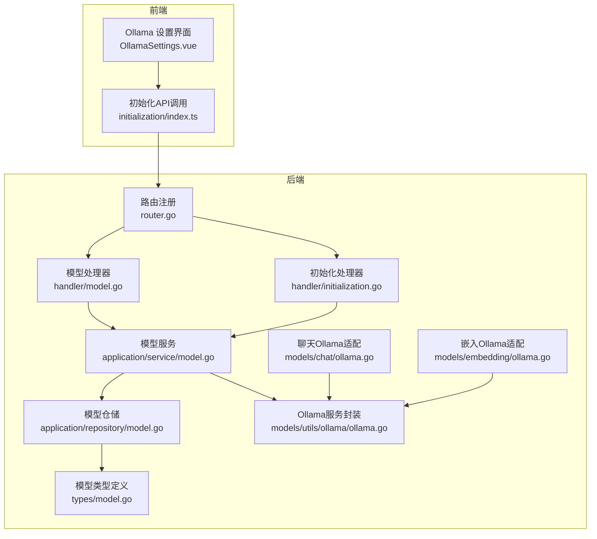
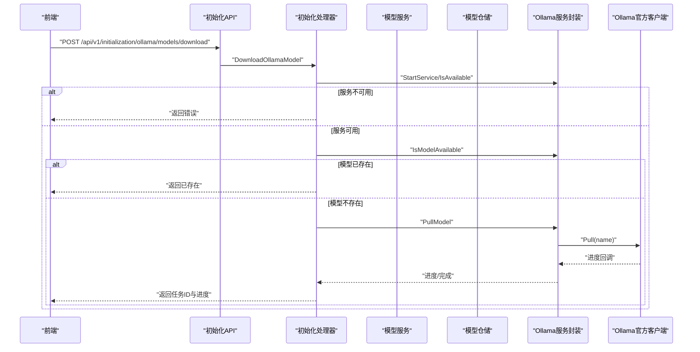
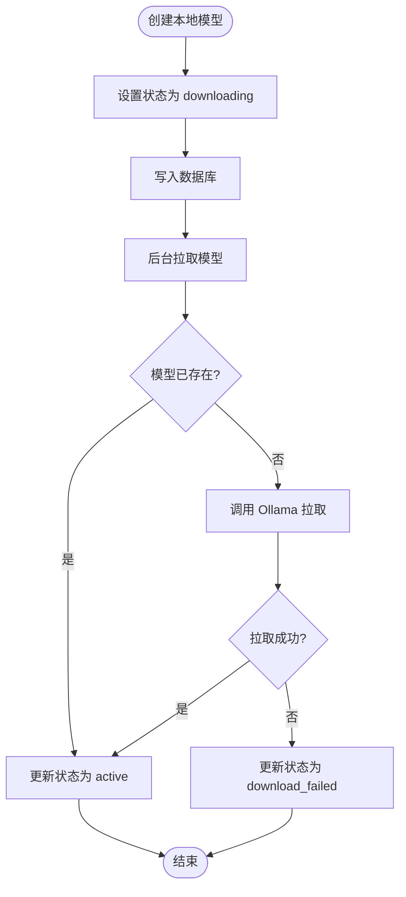
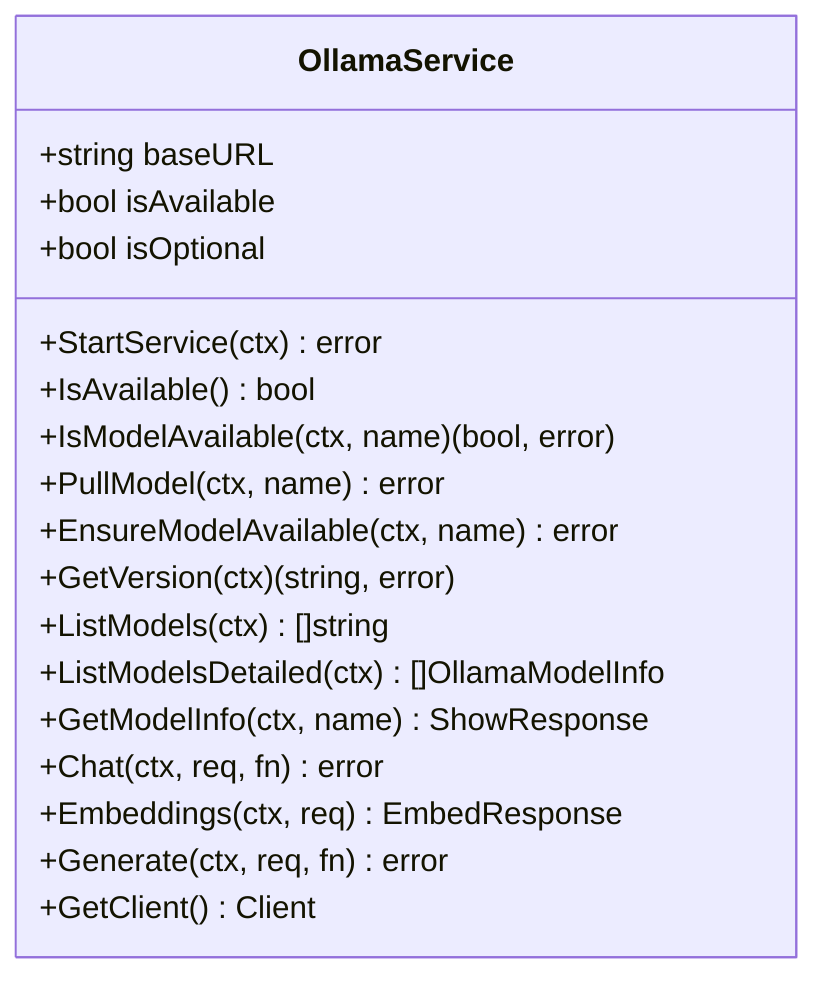
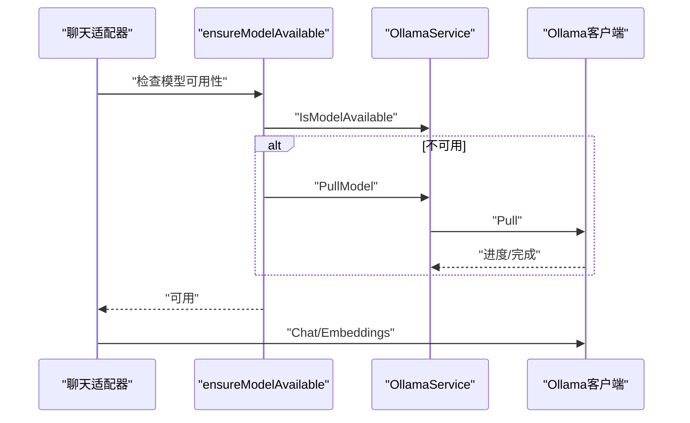
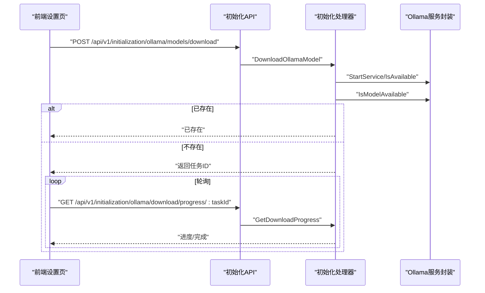
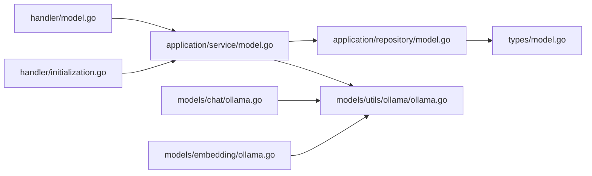

# 本地模型API

<cite>
**本文引用的文件**
- [internal/models/chat/ollama.go](file://internal/models/chat/ollama.go)
- [internal/models/embedding/ollama.go](file://internal/models/embedding/ollama.go)
- [internal/models/utils/ollama/ollama.go](file://internal/models/utils/ollama/ollama.go)
- [internal/handler/model.go](file://internal/handler/model.go)
- [internal/application/service/model.go](file://internal/application/service/model.go)
- [internal/router/router.go](file://internal/router/router.go)
- [internal/handler/initialization.go](file://internal/handler/initialization.go)
- [frontend/src/views/settings/OllamaSettings.vue](file://frontend/src/views/settings/OllamaSettings.vue)
- [frontend/src/api/initialization/index.ts](file://frontend/src/api/initialization/index.ts)
- [internal/types/model.go](file://internal/types/model.go)
- [internal/application/repository/model.go](file://internal/application/repository/model.go)
</cite>

## 目录
1. [简介](#简介)
2. [项目结构](#项目结构)
3. [核心组件](#核心组件)
4. [架构总览](#架构总览)
5. [详细组件分析](#详细组件分析)
6. [依赖分析](#依赖分析)
7. [性能考虑](#性能考虑)
8. [故障排查指南](#故障排查指南)
9. [结论](#结论)
10. [附录](#附录)

## 简介
本文件面向“本地模型API”的使用与集成，聚焦于与 Ollama 服务的对接机制。文档将解释如何通过 POST /models 接口创建本地模型（source: local），并详述模型拉取、加载与状态管理（如 downloading、active）的实现流程；同时基于 internal/models/chat/ollama.go 与 internal/models/embedding/ollama.go，阐述与 Ollama API 的交互细节，包括 base_url 配置与健康检查。最后给出模型管理的最佳实践，涵盖资源消耗监控与模型缓存策略，并结合代码路径说明如何通过 API 触发模型下载。

## 项目结构
围绕本地模型与 Ollama 的关键模块分布如下：
- 路由层：注册 /api/v1/models 与 /api/v1/initialization/ollama 系列接口
- 处理器层：负责请求解析、鉴权、调用服务层与返回结果
- 服务层：封装业务逻辑，协调仓库与 Ollama 服务
- 模型适配层：面向聊天与嵌入的 Ollama 适配器
- Ollama 工具层：统一管理 Ollama 客户端、健康检查、模型拉取与状态查询
- 类型与仓储：模型元数据、参数、状态与持久化

图表来源
- [internal/router/router.go](file://internal/router/router.go#L282-L298)
- [internal/handler/model.go](file://internal/handler/model.go#L1-L126)
- [internal/handler/initialization.go](file://internal/handler/initialization.go#L863-L962)
- [internal/application/service/model.go](file://internal/application/service/model.go#L33-L93)
- [internal/models/utils/ollama/ollama.go](file://internal/models/utils/ollama/ollama.go#L1-L124)
- [internal/models/chat/ollama.go](file://internal/models/chat/ollama.go#L1-L120)
- [internal/models/embedding/ollama.go](file://internal/models/embedding/ollama.go#L1-L126)
- [internal/types/model.go](file://internal/types/model.go#L1-L112)
- [internal/application/repository/model.go](file://internal/application/repository/model.go#L1-L100)

章节来源
- [internal/router/router.go](file://internal/router/router.go#L282-L298)

## 核心组件
- 模型处理器（/api/v1/models）：提供创建、查询、更新、删除模型的接口，其中创建本地模型会进入后台拉取流程并维护状态
- 初始化处理器（/api/v1/initialization/ollama/*）：提供 Ollama 服务状态检查、模型列表、模型下载与进度查询
- 模型服务：根据模型来源（local/remote）决定行为；本地模型创建时设置状态为 downloading，并异步拉取
- Ollama 服务封装：统一管理 Ollama 客户端、健康检查、模型拉取、可用性判断与版本查询
- 聊天/嵌入适配器：在调用 Ollama API 前确保模型可用，必要时触发拉取

章节来源
- [internal/handler/model.go](file://internal/handler/model.go#L61-L126)
- [internal/handler/initialization.go](file://internal/handler/initialization.go#L863-L962)
- [internal/application/service/model.go](file://internal/application/service/model.go#L33-L93)
- [internal/models/utils/ollama/ollama.go](file://internal/models/utils/ollama/ollama.go#L62-L124)
- [internal/models/chat/ollama.go](file://internal/models/chat/ollama.go#L177-L192)
- [internal/models/embedding/ollama.go](file://internal/models/embedding/ollama.go#L62-L86)

## 架构总览
下图展示从前端到后端再到 Ollama 的端到端调用链路，以及本地模型创建与拉取的关键步骤。

图表来源
- [internal/handler/initialization.go](file://internal/handler/initialization.go#L863-L962)
- [internal/models/utils/ollama/ollama.go](file://internal/models/utils/ollama/ollama.go#L126-L176)

## 详细组件分析

### 本地模型创建与状态管理（POST /models）
- 请求体字段要点
  - name、type、source、description、parameters
  - parameters.base_url、api_key、embedding_parameters、parameter_size 等
- 业务流程
  - 当 source 为 local 时，服务层将模型状态设为 downloading 并持久化
  - 启动 goroutine 异步调用 Ollama 服务进行模型拉取
  - 拉取成功后更新状态为 active；失败则更新为 download_failed
- 状态约束
  - 查询模型时若状态为 downloading 或 download_failed，将返回相应错误提示

图表来源
- [internal/application/service/model.go](file://internal/application/service/model.go#L33-L93)
- [internal/application/repository/model.go](file://internal/application/repository/model.go#L22-L71)

章节来源
- [internal/handler/model.go](file://internal/handler/model.go#L61-L126)
- [internal/application/service/model.go](file://internal/application/service/model.go#L33-L93)
- [internal/types/model.go](file://internal/types/model.go#L22-L30)
- [internal/application/repository/model.go](file://internal/application/repository/model.go#L22-L71)

### 与 Ollama API 的交互细节（base_url 与健康检查）
- base_url 配置来源
  - 优先读取环境变量 OLLAMA_BASE_URL；若为空，使用默认 http://localhost:11434
  - 在多模态场景中，当 interface_type 为 ollama 时，会自动拼接 /v1 作为 Ollama 的 OpenAI 兼容接口前缀
- 健康检查
  - 通过 Heartbeat 调用判断服务可用性
  - 支持可选模式（OLLAMA_OPTIONAL=true）：服务不可用时不中断应用，仅记录警告
- 模型可用性与拉取
  - 列表查询：List/ListModelsDetailed
  - 拉取：Pull，支持进度回调
  - 版本查询：Version
  - 显示模型详情：Show

图表来源
- [internal/models/utils/ollama/ollama.go](file://internal/models/utils/ollama/ollama.go#L1-L124)
- [internal/models/utils/ollama/ollama.go](file://internal/models/utils/ollama/ollama.go#L126-L201)
- [internal/models/utils/ollama/ollama.go](file://internal/models/utils/ollama/ollama.go#L203-L235)
- [internal/models/utils/ollama/ollama.go](file://internal/models/utils/ollama/ollama.go#L237-L297)
- [internal/models/utils/ollama/ollama.go](file://internal/models/utils/ollama/ollama.go#L299-L355)

章节来源
- [internal/models/utils/ollama/ollama.go](file://internal/models/utils/ollama/ollama.go#L1-L124)
- [internal/handler/initialization.go](file://internal/handler/initialization.go#L473-L479)

### 聊天与嵌入调用中的模型可用性保障
- 聊天适配器
  - 在 Chat/ChatStream 前调用 ensureModelAvailable，确保模型存在或触发拉取
  - 将内部消息格式转换为 Ollama API 所需格式
- 嵌入适配器
  - 在 BatchEmbed/BatchEmbed 前调用 ensureModelAvailable
  - 支持截断参数 truncate_prompt_tokens 传递给 Ollama

图表来源
- [internal/models/chat/ollama.go](file://internal/models/chat/ollama.go#L75-L120)
- [internal/models/chat/ollama.go](file://internal/models/chat/ollama.go#L122-L175)
- [internal/models/embedding/ollama.go](file://internal/models/embedding/ollama.go#L68-L110)
- [internal/models/utils/ollama/ollama.go](file://internal/models/utils/ollama/ollama.go#L178-L201)
- [internal/models/utils/ollama/ollama.go](file://internal/models/utils/ollama/ollama.go#L126-L176)

章节来源
- [internal/models/chat/ollama.go](file://internal/models/chat/ollama.go#L75-L120)
- [internal/models/chat/ollama.go](file://internal/models/chat/ollama.go#L122-L175)
- [internal/models/embedding/ollama.go](file://internal/models/embedding/ollama.go#L68-L110)
- [internal/models/utils/ollama/ollama.go](file://internal/models/utils/ollama/ollama.go#L178-L201)

### 前端集成与模型下载触发
- 前端设置页面
  - 展示 Ollama 服务状态、列出已安装模型、输入模型名触发下载
  - 下载进度轮询与任务列表
- API 调用
  - 检查状态：GET /api/v1/initialization/ollama/status
  - 列出模型：GET /api/v1/initialization/ollama/models
  - 检查模型：POST /api/v1/initialization/ollama/models/check
  - 下载模型：POST /api/v1/initialization/ollama/models/download
  - 查询进度：GET /api/v1/initialization/ollama/download/progress/:taskId
  - 列出任务：GET /api/v1/initialization/ollama/download/tasks

图表来源
- [frontend/src/views/settings/OllamaSettings.vue](file://frontend/src/views/settings/OllamaSettings.vue#L190-L321)
- [frontend/src/api/initialization/index.ts](file://frontend/src/api/initialization/index.ts#L147-L237)
- [internal/handler/initialization.go](file://internal/handler/initialization.go#L863-L962)
- [internal/handler/initialization.go](file://internal/handler/initialization.go#L964-L1001)

章节来源
- [frontend/src/views/settings/OllamaSettings.vue](file://frontend/src/views/settings/OllamaSettings.vue#L1-L168)
- [frontend/src/api/initialization/index.ts](file://frontend/src/api/initialization/index.ts#L147-L237)
- [internal/handler/initialization.go](file://internal/handler/initialization.go#L863-L1001)

## 依赖分析
- 组件耦合
  - 处理器依赖服务层；服务层依赖仓储与 Ollama 服务封装
  - 聊天/嵌入适配器依赖 Ollama 服务封装
- 关键外部依赖
  - Ollama 官方 Go 客户端（api.Client）
  - Gin 路由与中间件
  - GORM 数据库 ORM
- 可能的循环依赖
  - 未发现直接循环依赖；各层职责清晰

图表来源
- [internal/handler/model.go](file://internal/handler/model.go#L1-L126)
- [internal/handler/initialization.go](file://internal/handler/initialization.go#L1-L120)
- [internal/application/service/model.go](file://internal/application/service/model.go#L1-L32)
- [internal/application/repository/model.go](file://internal/application/repository/model.go#L1-L21)
- [internal/models/utils/ollama/ollama.go](file://internal/models/utils/ollama/ollama.go#L1-L25)
- [internal/models/chat/ollama.go](file://internal/models/chat/ollama.go#L1-L29)
- [internal/models/embedding/ollama.go](file://internal/models/embedding/ollama.go#L1-L23)
- [internal/types/model.go](file://internal/types/model.go#L1-L40)

章节来源
- [internal/handler/model.go](file://internal/handler/model.go#L1-L126)
- [internal/handler/initialization.go](file://internal/handler/initialization.go#L1-L120)
- [internal/application/service/model.go](file://internal/application/service/model.go#L1-L32)
- [internal/application/repository/model.go](file://internal/application/repository/model.go#L1-L21)
- [internal/models/utils/ollama/ollama.go](file://internal/models/utils/ollama/ollama.go#L1-L25)
- [internal/models/chat/ollama.go](file://internal/models/chat/ollama.go#L1-L29)
- [internal/models/embedding/ollama.go](file://internal/models/embedding/ollama.go#L1-L23)
- [internal/types/model.go](file://internal/types/model.go#L1-L40)

## 性能考虑
- 模型拉取
  - 使用进度回调实时更新前端进度，避免长时间阻塞
  - 对于大模型，建议在低峰时段触发拉取，减少对系统资源的瞬时冲击
- 资源监控
  - 建议结合系统监控工具观察 CPU、内存、磁盘 IO 与网络带宽
  - 对频繁调用的聊天/嵌入接口，可在网关或服务层增加限流与超时控制
- 缓存策略
  - 对常用模型的元数据与版本信息进行短期缓存，降低 Ollama 列表查询频率
  - 对嵌入结果按输入内容哈希进行缓存，避免重复计算
- 并发与异步
  - 本地模型创建采用 goroutine 异步拉取，避免阻塞主流程
  - 下载任务采用全局字典管理，支持并发查询与去重

[本节为通用指导，无需具体文件引用]

## 故障排查指南
- Ollama 服务不可用
  - 检查 OLLAMA_BASE_URL 是否正确；若为空，确认默认地址 http://localhost:11434 是否可达
  - 若设置 OLLAMA_OPTIONAL=true，服务不可用不会导致致命错误，但仍会影响模型可用性
- 模型拉取失败
  - 查看下载任务状态与进度，确认网络连通性与镜像仓库可用性
  - 若模型已存在，仍会返回任务已存在，确认是否需要重新拉取
- 查询状态异常
  - 使用 GET /api/v1/initialization/ollama/status 获取服务可用性与版本
  - 使用 GET /api/v1/initialization/ollama/models 检查已安装模型列表

章节来源
- [internal/models/utils/ollama/ollama.go](file://internal/models/utils/ollama/ollama.go#L62-L124)
- [internal/handler/initialization.go](file://internal/handler/initialization.go#L768-L810)
- [internal/handler/initialization.go](file://internal/handler/initialization.go#L1003-L1032)

## 结论
本地模型API通过统一的处理器与服务层，实现了与 Ollama 的深度集成：创建本地模型时自动进入 downloading 状态并异步拉取；在聊天与嵌入调用前确保模型可用；前端提供完善的健康检查、模型列表与下载进度可视化。配合可选的 Ollama 服务模式与进度回调，系统在稳定性与用户体验之间取得良好平衡。建议在生产环境中结合资源监控与缓存策略，进一步优化性能与可靠性。

[本节为总结性内容，无需具体文件引用]

## 附录

### API 一览（与 Ollama 相关）
- 模型管理
  - POST /api/v1/models：创建模型（含本地模型）
  - GET /api/v1/models：查询模型列表
  - GET /api/v1/models/:id：查询单个模型
  - PUT /api/v1/models/:id：更新模型
  - DELETE /api/v1/models/:id：删除模型
- 初始化与 Ollama
  - GET /api/v1/initialization/ollama/status：检查 Ollama 服务状态
  - GET /api/v1/initialization/ollama/models：列出已安装模型
  - POST /api/v1/initialization/ollama/models/check：批量检查模型是否存在
  - POST /api/v1/initialization/ollama/models/download：异步下载模型
  - GET /api/v1/initialization/ollama/download/progress/:taskId：查询下载进度
  - GET /api/v1/initialization/ollama/download/tasks：列出下载任务

章节来源
- [internal/router/router.go](file://internal/router/router.go#L282-L298)
- [internal/handler/initialization.go](file://internal/handler/initialization.go#L768-L1032)
- [internal/handler/model.go](file://internal/handler/model.go#L61-L126)