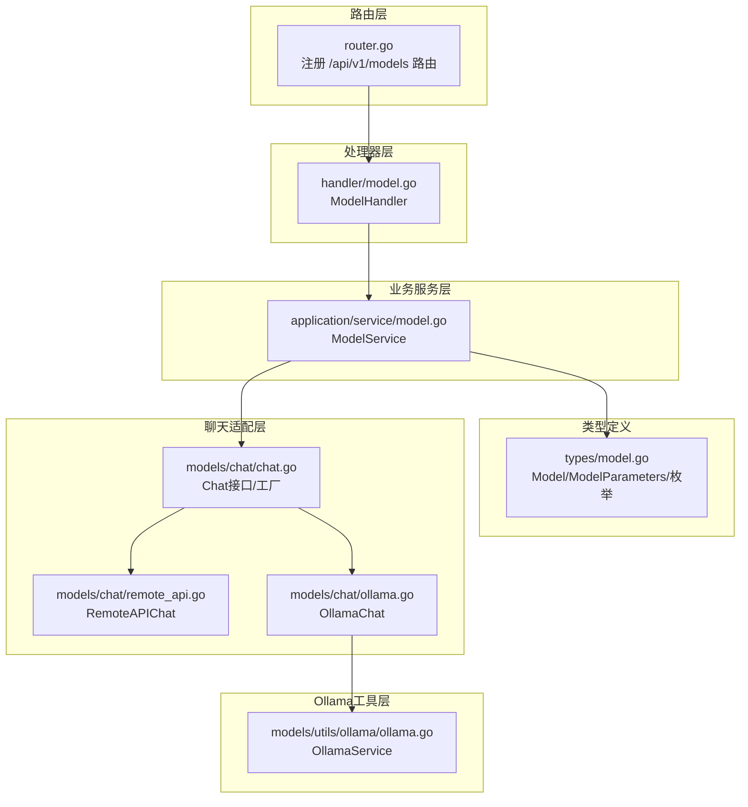
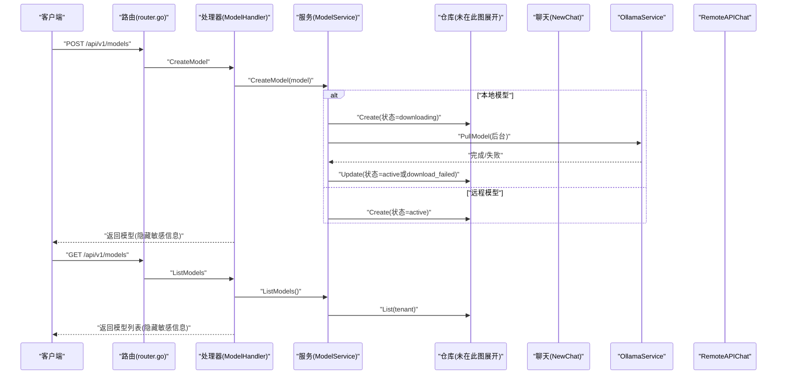
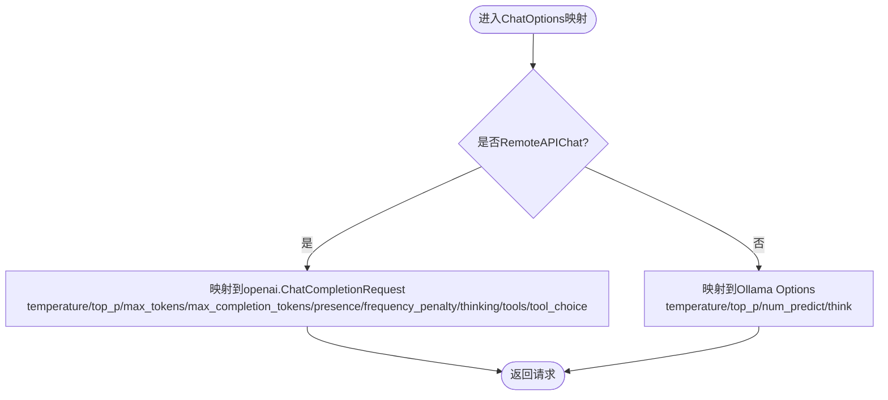
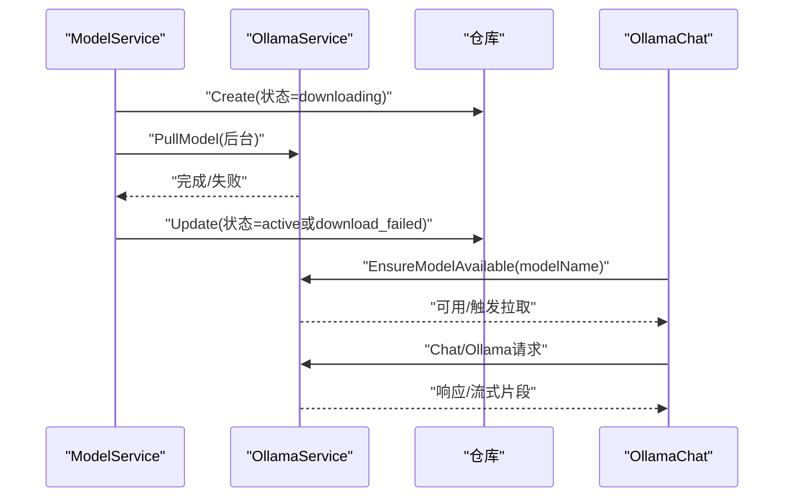
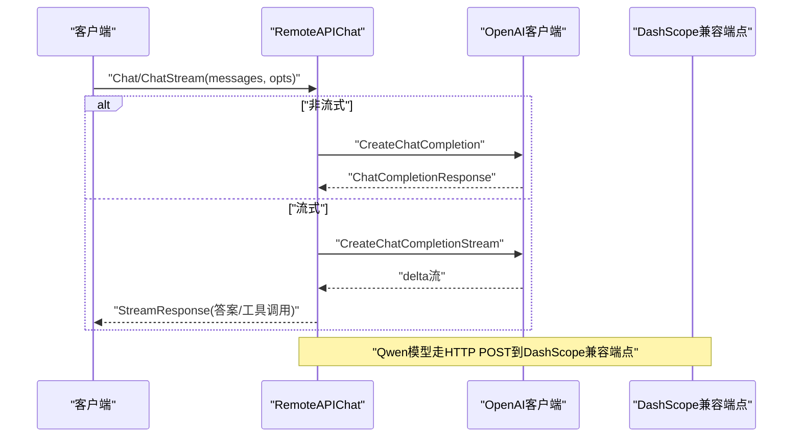
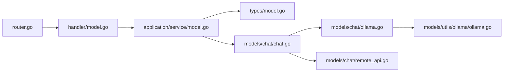

# 模型管理API

<cite>
**本文引用的文件**
- [internal/router/router.go](file://internal/router/router.go)
- [internal/handler/model.go](file://internal/handler/model.go)
- [internal/application/service/model.go](file://internal/application/service/model.go)
- [internal/types/model.go](file://internal/types/model.go)
- [internal/models/chat/chat.go](file://internal/models/chat/chat.go)
- [internal/models/chat/remote_api.go](file://internal/models/chat/remote_api.go)
- [internal/models/chat/ollama.go](file://internal/models/chat/ollama.go)
- [internal/models/utils/ollama/ollama.go](file://internal/models/utils/ollama/ollama.go)
- [docs/api/model.md](file://docs/api/model.md)
- [internal/handler/initialization.go](file://internal/handler/initialization.go)
</cite>

## 目录
1. [简介](#简介)
2. [项目结构](#项目结构)
3. [核心组件](#核心组件)
4. [架构总览](#架构总览)
5. [/model端点详解](#model端点详解)
6. [模型配置参数与温度/Top-P设置](#模型配置参数与温度top-p设置)
7. [与Ollama服务集成](#与ollama服务集成)
8. [远程API模型与OpenAI兼容代理](#远程api模型与openai兼容代理)
9. [依赖关系分析](#依赖关系分析)
10. [性能与可靠性考虑](#性能与可靠性考虑)
11. [故障排查指南](#故障排查指南)
12. [安全配置建议](#安全配置建议)
13. [结论](#结论)

## 简介
本文件面向开发者与运维人员，系统性梳理WeKnora的模型管理API，覆盖本地模型（Ollama）与远程API模型（OpenAI兼容）的配置、创建、枚举、状态管理与调用路径。重点说明：
- /models端点如何创建、列出、查询、更新、删除模型；
- 模型配置参数（如temperature、top_p、max_tokens等）如何传递与生效；
- 与Ollama服务的集成方式，包括模型拉取、可用性检测与加载状态查询；
- 基于internal/models/chat/remote_api.go的OpenAI兼容代理机制；
- 安全配置建议，尤其是API密钥的加密存储策略。

## 项目结构
围绕模型管理API的关键模块如下：
- 路由层：注册/模型相关HTTP路由
- 处理器层：ModelHandler负责模型的CRUD与敏感信息隐藏
- 业务服务层：ModelService封装模型生命周期与状态控制
- 类型定义：Model、ModelParameters、ModelSource、ModelStatus等
- 聊天适配层：chat接口及Ollama/Remote实现
- Ollama工具层：OllamaService封装与Ollama服务交互
- 初始化处理器：提供Ollama状态、模型列表、拉取进度等辅助接口

图表来源
- [internal/router/router.go](file://internal/router/router.go#L282-L298)
- [internal/handler/model.go](file://internal/handler/model.go#L1-L323)
- [internal/application/service/model.go](file://internal/application/service/model.go#L1-L351)
- [internal/types/model.go](file://internal/types/model.go#L1-L112)
- [internal/models/chat/chat.go](file://internal/models/chat/chat.go#L1-L104)
- [internal/models/chat/remote_api.go](file://internal/models/chat/remote_api.go#L1-L505)
- [internal/models/chat/ollama.go](file://internal/models/chat/ollama.go#L1-L192)
- [internal/models/utils/ollama/ollama.go](file://internal/models/utils/ollama/ollama.go#L1-L355)

章节来源
- [internal/router/router.go](file://internal/router/router.go#L282-L298)
- [internal/handler/model.go](file://internal/handler/model.go#L1-L323)
- [internal/application/service/model.go](file://internal/application/service/model.go#L1-L351)
- [internal/types/model.go](file://internal/types/model.go#L1-L112)
- [internal/models/chat/chat.go](file://internal/models/chat/chat.go#L1-L104)
- [internal/models/chat/remote_api.go](file://internal/models/chat/remote_api.go#L1-L505)
- [internal/models/chat/ollama.go](file://internal/models/chat/ollama.go#L1-L192)
- [internal/models/utils/ollama/ollama.go](file://internal/models/utils/ollama/ollama.go#L1-L355)

## 核心组件
- 路由注册：在router.go中注册/api/v1/models的CRUD路由。
- 处理器：ModelHandler对请求进行参数绑定、鉴权上下文提取、调用服务层并返回标准化响应；对内置模型隐藏敏感字段（如BaseURL、APIKey）。
- 业务服务：ModelService根据Model.Source区分本地/远程模型，执行不同流程（本地异步拉取、远程立即激活），并提供GetModelByID/ListModels等能力。
- 类型定义：Model/ModelParameters/ModelSource/ModelStatus等，统一模型元数据与参数结构。
- 聊天适配：Chat接口抽象出Chat/ChatStream/GetModelName/GetModelID；NewChat按Source选择Ollama或Remote实现。
- Ollama工具：OllamaService封装心跳、模型可用性检测、拉取、列表、删除、版本查询等。

章节来源
- [internal/router/router.go](file://internal/router/router.go#L282-L298)
- [internal/handler/model.go](file://internal/handler/model.go#L1-L323)
- [internal/application/service/model.go](file://internal/application/service/model.go#L1-L351)
- [internal/types/model.go](file://internal/types/model.go#L1-L112)
- [internal/models/chat/chat.go](file://internal/models/chat/chat.go#L1-L104)
- [internal/models/utils/ollama/ollama.go](file://internal/models/utils/ollama/ollama.go#L1-L355)

## 架构总览
下面的序列图展示了从HTTP请求到模型调用的整体链路，以及本地与远程模型的不同路径。

图表来源
- [internal/router/router.go](file://internal/router/router.go#L282-L298)
- [internal/handler/model.go](file://internal/handler/model.go#L172-L210)
- [internal/application/service/model.go](file://internal/application/service/model.go#L33-L93)
- [internal/models/utils/ollama/ollama.go](file://internal/models/utils/ollama/ollama.go#L126-L176)

## /model端点详解
- 路由注册：/api/v1/models的POST/GET/GET/:id/PUT/:id/DELETE/:id均在router.go中注册。
- 处理器职责：
  - CreateModel：解析请求体，填充TenantID，调用服务创建；成功后隐藏内置模型的敏感信息再返回。
  - ListModels：按租户过滤，调用服务获取列表，隐藏内置模型敏感信息。
  - GetModel：按ID获取模型，隐藏内置模型敏感信息。
  - UpdateModel/DeleteModel：更新/删除模型，内置模型不可更新/删除。
- 敏感信息隐藏：对内置模型，返回的Model对象中BaseURL与APIKey字段被清空，避免泄露。

章节来源
- [internal/router/router.go](file://internal/router/router.go#L282-L298)
- [internal/handler/model.go](file://internal/handler/model.go#L61-L126)
- [internal/handler/model.go](file://internal/handler/model.go#L172-L210)
- [internal/handler/model.go](file://internal/handler/model.go#L212-L323)

## 模型配置参数与温度/Top-P设置
- ChatOptions定义了聊天参数，包括temperature、top_p、max_tokens、max_completion_tokens、frequency_penalty、presence_penalty、thinking、tools、tool_choice等。
- RemoteAPIChat在构建OpenAI请求时，将这些参数映射到openai.ChatCompletionRequest；OllamaChat在构建Ollama请求时，将temperature、top_p、num_predict等映射到Options。
- temperature与top_p在两种实现中均有体现，分别对应OpenAI与Ollama的参数语义。

图表来源
- [internal/models/chat/chat.go](file://internal/models/chat/chat.go#L26-L38)
- [internal/models/chat/remote_api.go](file://internal/models/chat/remote_api.go#L113-L209)
- [internal/models/chat/ollama.go](file://internal/models/chat/ollama.go#L41-L73)

章节来源
- [internal/models/chat/chat.go](file://internal/models/chat/chat.go#L26-L38)
- [internal/models/chat/remote_api.go](file://internal/models/chat/remote_api.go#L113-L209)
- [internal/models/chat/ollama.go](file://internal/models/chat/ollama.go#L41-L73)

## 与Ollama服务集成
- OllamaService提供：
  - StartService/IsAvailable：心跳检测与可用性缓存；
  - IsModelAvailable/PullModel/EnsureModelAvailable：模型可用性检测与拉取；
  - ListModels/ListModelsDetailed/GetModelInfo/DeleteModel：模型列表、详细信息、删除；
  - Chat/Embeddings/Generate：聊天、嵌入、生成等底层调用。
- ModelService在创建本地模型时，将状态置为downloading并启动后台拉取；拉取完成后更新状态为active或download_failed。
- OllamaChat在每次聊天前调用ensureModelAvailable，确保模型已就绪。

图表来源
- [internal/application/service/model.go](file://internal/application/service/model.go#L33-L93)
- [internal/models/utils/ollama/ollama.go](file://internal/models/utils/ollama/ollama.go#L126-L201)
- [internal/models/chat/ollama.go](file://internal/models/chat/ollama.go#L177-L191)

章节来源
- [internal/models/utils/ollama/ollama.go](file://internal/models/utils/ollama/ollama.go#L1-L355)
- [internal/application/service/model.go](file://internal/application/service/model.go#L33-L93)
- [internal/models/chat/ollama.go](file://internal/models/chat/ollama.go#L177-L191)

## 远程API模型与OpenAI兼容代理
- RemoteAPIChat实现Chat接口，支持非流式与流式两种调用：
  - 非流式：构造openai.ChatCompletionRequest，调用client.CreateChatCompletion；
  - 流式：构造openai.ChatCompletionRequest，调用client.CreateChatCompletionStream，后台协程聚合delta并输出有序的StreamResponse。
- 特殊处理：
  - 阿里云Qwen模型：使用自定义请求结构体QwenChatCompletionRequest并通过HTTP POST调用DashScope兼容端点；
  - DeepSeek模型：跳过tool_choice设置，避免不支持该参数导致的错误。
- ChatOptions中的thinking参数通过ChatTemplateKwargs传递，用于开启/关闭“思考”逻辑。

图表来源
- [internal/models/chat/remote_api.go](file://internal/models/chat/remote_api.go#L212-L347)
- [internal/models/chat/remote_api.go](file://internal/models/chat/remote_api.go#L349-L494)

章节来源
- [internal/models/chat/remote_api.go](file://internal/models/chat/remote_api.go#L1-L505)

## 依赖关系分析
- 路由到处理器：router.go注册模型路由，交由ModelHandler处理；
- 处理器到服务：ModelHandler调用ModelService执行业务逻辑；
- 服务到仓库：ModelService通过ModelRepository读写模型；
- 服务到聊天适配：ModelService.GetChatModel通过chat.NewChat按Source选择Ollama或Remote实现；
- OllamaChat依赖OllamaService进行模型可用性与拉取；
- RemoteAPIChat依赖第三方OpenAI客户端库。

图表来源
- [internal/router/router.go](file://internal/router/router.go#L282-L298)
- [internal/handler/model.go](file://internal/handler/model.go#L1-L323)
- [internal/application/service/model.go](file://internal/application/service/model.go#L302-L347)
- [internal/models/chat/chat.go](file://internal/models/chat/chat.go#L85-L104)
- [internal/models/chat/ollama.go](file://internal/models/chat/ollama.go#L1-L192)
- [internal/models/chat/remote_api.go](file://internal/models/chat/remote_api.go#L1-L505)
- [internal/models/utils/ollama/ollama.go](file://internal/models/utils/ollama/ollama.go#L1-L355)

章节来源
- [internal/router/router.go](file://internal/router/router.go#L282-L298)
- [internal/handler/model.go](file://internal/handler/model.go#L1-L323)
- [internal/application/service/model.go](file://internal/application/service/model.go#L302-L347)
- [internal/models/chat/chat.go](file://internal/models/chat/chat.go#L85-L104)
- [internal/models/chat/ollama.go](file://internal/models/chat/ollama.go#L1-L192)
- [internal/models/chat/remote_api.go](file://internal/models/chat/remote_api.go#L1-L505)
- [internal/models/utils/ollama/ollama.go](file://internal/models/utils/ollama/ollama.go#L1-L355)

## 性能与可靠性考虑
- 流式输出：RemoteAPIChat的流式响应通过后台goroutine聚合delta，减少前端等待时间；OllamaChat同样提供流式输出，便于实时反馈。
- 异常处理：RemoteAPIChat在HTTP请求失败时返回明确错误；OllamaService在拉取过程中记录进度与状态，便于监控与重试。
- 并发与可用性：OllamaService内部使用互斥锁保护可用性状态，避免竞态；支持可选模式（OLLAMA_OPTIONAL=true）在服务不可用时仍允许应用运行。

章节来源
- [internal/models/chat/remote_api.go](file://internal/models/chat/remote_api.go#L349-L494)
- [internal/models/chat/ollama.go](file://internal/models/chat/ollama.go#L122-L175)
- [internal/models/utils/ollama/ollama.go](file://internal/models/utils/ollama/ollama.go#L62-L91)

## 故障排查指南
- 模型状态异常：
  - GetModelByID在状态为downloading或download_failed时会返回错误，需确认Ollama服务可用性与拉取任务状态。
- Ollama服务不可用：
  - 使用初始化接口检查Ollama状态与模型列表；若配置OLLAMA_OPTIONAL=true，服务不可用时不会阻断应用，但本地模型无法使用。
- 远程模型调用失败：
  - 检查BaseURL与APIKey是否正确；对于Qwen模型，确认DashScope兼容端点与请求体字段；DeepSeek模型不支持tool_choice，需避免设置该参数。
- 流式输出中断：
  - RemoteAPIChat在流式响应结束时会发送一次Done=true的响应，确保前端正确收尾；若出现工具调用分片，注意聚合逻辑。

章节来源
- [internal/application/service/model.go](file://internal/application/service/model.go#L95-L142)
- [internal/handler/initialization.go](file://internal/handler/initialization.go#L1-L200)
- [internal/models/utils/ollama/ollama.go](file://internal/models/utils/ollama/ollama.go#L62-L91)
- [internal/models/chat/remote_api.go](file://internal/models/chat/remote_api.go#L349-L494)

## 安全配置建议
- API密钥加密存储：
  - 建议在数据库中对ModelParameters.APIKey进行加密存储，采用对称加密算法（如AES-GCM）并妥善管理密钥材料。
  - 在传输过程中使用HTTPS/TLS，避免明文泄露。
- 敏感信息隐藏：
  - 处理器在返回内置模型时会隐藏BaseURL与APIKey，避免泄露至前端或日志。
- 环境变量与可选模式：
  - OLLAMA_BASE_URL可通过环境变量配置；OLLAMA_OPTIONAL可设置为true以容忍服务不可用。
- 最小权限原则：
  - 为不同租户隔离模型访问权限，限制对内置模型的更新/删除操作。

章节来源
- [internal/handler/model.go](file://internal/handler/model.go#L31-L59)
- [internal/models/utils/ollama/ollama.go](file://internal/models/utils/ollama/ollama.go#L27-L60)

## 结论
本文档系统梳理了WeKnora的模型管理API，覆盖本地Ollama与远程OpenAI兼容模型的配置、创建、枚举与调用路径。通过清晰的路由-处理器-服务-适配层架构，结合OllamaService与RemoteAPIChat的实现细节，开发者可以稳定地集成与扩展模型管理能力。同时，建议在生产环境中强化密钥加密、最小权限与可观测性，确保系统的安全性与可靠性。