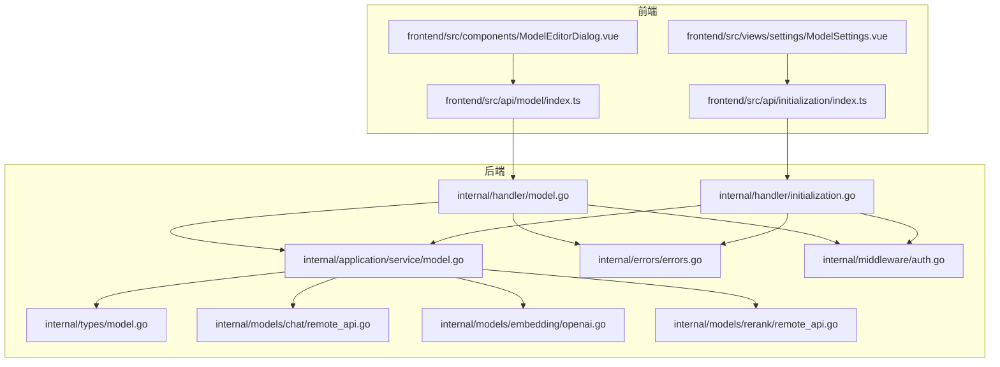
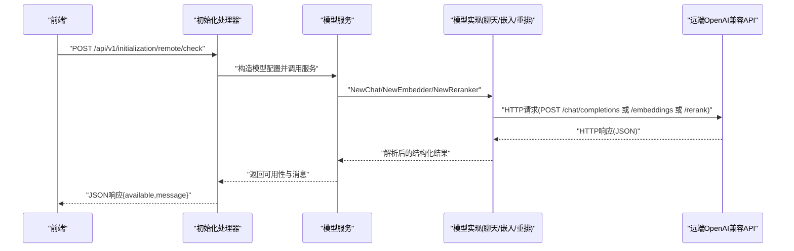
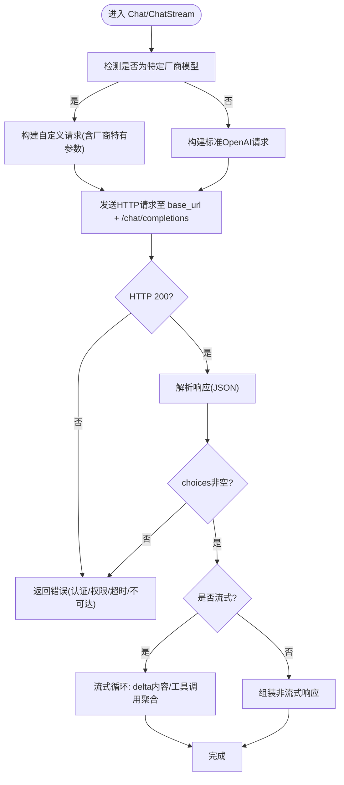
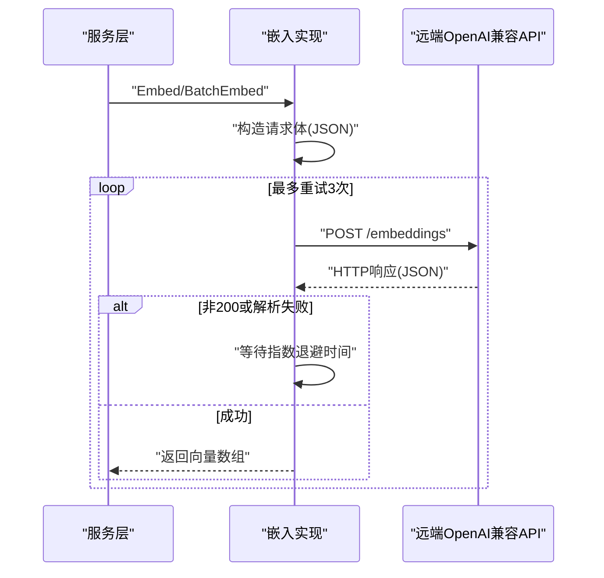
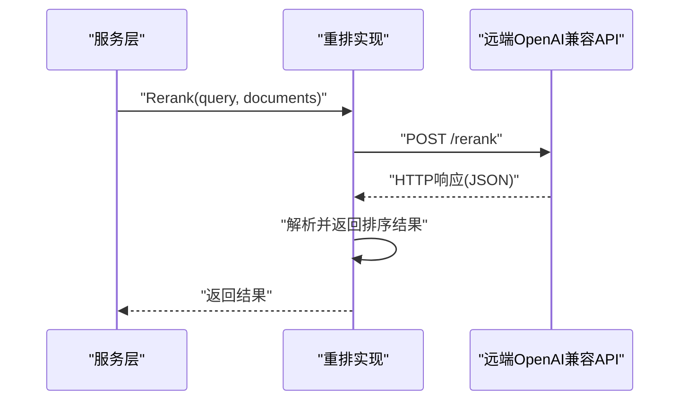
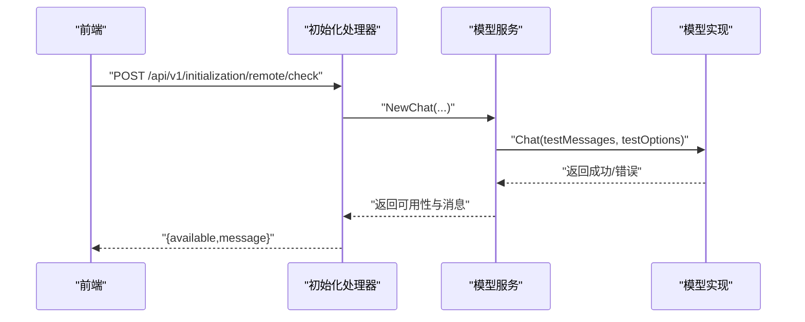
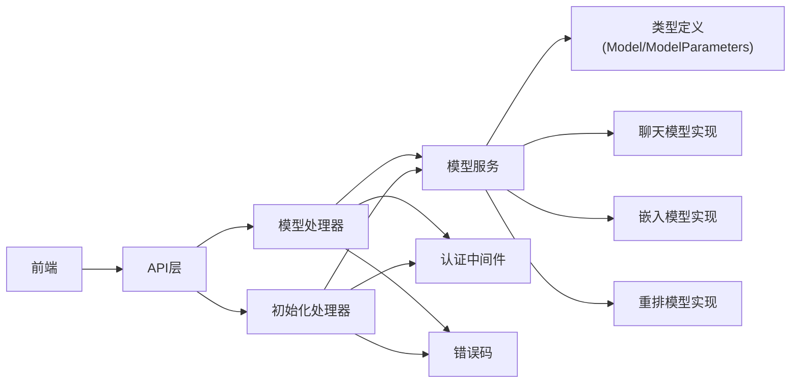

# 远程模型API

<cite>
**本文引用的文件**
- [internal/models/chat/remote_api.go](file://internal/models/chat/remote_api.go)
- [internal/models/rerank/remote_api.go](file://internal/models/rerank/remote_api.go)
- [internal/models/embedding/openai.go](file://internal/models/embedding/openai.go)
- [internal/types/model.go](file://internal/types/model.go)
- [internal/handler/model.go](file://internal/handler/model.go)
- [internal/handler/initialization.go](file://internal/handler/initialization.go)
- [internal/application/service/model.go](file://internal/application/service/model.go)
- [frontend/src/api/model/index.ts](file://frontend/src/api/model/index.ts)
- [frontend/src/api/initialization/index.ts](file://frontend/src/api/initialization/index.ts)
- [frontend/src/components/ModelEditorDialog.vue](file://frontend/src/components/ModelEditorDialog.vue)
- [frontend/src/views/settings/ModelSettings.vue](file://frontend/src/views/settings/ModelSettings.vue)
- [internal/errors/errors.go](file://internal/errors/errors.go)
- [internal/middleware/auth.go](file://internal/middleware/auth.go)
- [internal/utils/security.go](file://internal/utils/security.go)
</cite>

## 目录
1. [简介](#简介)
2. [项目结构](#项目结构)
3. [核心组件](#核心组件)
4. [架构总览](#架构总览)
5. [详细组件分析](#详细组件分析)
6. [依赖关系分析](#依赖关系分析)
7. [性能考量](#性能考量)
8. [故障排除指南](#故障排除指南)
9. [结论](#结论)
10. [附录](#附录)

## 简介
本文件面向开发者与运维人员，系统性阐述 WeKnora 中“远程模型API”的设计与实现，重点覆盖：
- 基于 OpenAI 兼容接口的代理机制与请求转发流程
- 通过 POST /models 接口配置远程模型（source: remote）时，base_url 与 api_key 参数的存储与使用方式
- 不同类型模型（KnowledgeQA、Embedding、Rerank）的配置要点与参数说明
- 安全与错误处理策略，包括网络超时、API 密钥失效、响应格式不兼容等常见问题的排查思路

## 项目结构
围绕远程模型API的关键目录与文件如下：
- 后端模型层：聊天、嵌入、重排的远程实现
- 类型与持久化：模型结构、参数序列化/反序列化
- 控制器与服务：模型创建、列表、更新、初始化检查
- 前端交互：模型编辑、连接性测试、初始化检查

图表来源
- [internal/handler/model.go](file://internal/handler/model.go#L71-L110)
- [internal/handler/initialization.go](file://internal/handler/initialization.go#L1320-L1519)
- [internal/application/service/model.go](file://internal/application/service/model.go#L33-L93)
- [internal/types/model.go](file://internal/types/model.go#L40-L70)
- [internal/models/chat/remote_api.go](file://internal/models/chat/remote_api.go#L1-L120)
- [internal/models/embedding/openai.go](file://internal/models/embedding/openai.go#L1-L120)
- [internal/models/rerank/remote_api.go](file://internal/models/rerank/remote_api.go#L1-L60)
- [internal/errors/errors.go](file://internal/errors/errors.go#L1-L60)
- [internal/middleware/auth.go](file://internal/middleware/auth.go#L119-L206)

章节来源
- [internal/handler/model.go](file://internal/handler/model.go#L71-L110)
- [internal/handler/initialization.go](file://internal/handler/initialization.go#L1320-L1519)
- [internal/application/service/model.go](file://internal/application/service/model.go#L33-L93)
- [internal/types/model.go](file://internal/types/model.go#L40-L70)

## 核心组件
- 远程聊天模型（KnowledgeQA）
  - 通过 OpenAI 兼容接口进行请求构建与转发，支持流式与非流式两种模式
  - 针对特定厂商（如阿里 DashScope）的特殊参数与兼容处理
- 远程嵌入模型（Embedding）
  - 基于 OpenAI 兼容接口的向量化服务，内置超时与重试策略
- 远程重排模型（Rerank）
  - 基于 OpenAI 兼容接口的重排服务，支持自定义请求体与响应解析
- 模型类型与参数
  - 统一的模型结构与参数序列化/反序列化，便于持久化与传输
- 初始化与连接检查
  - 提供远程模型连通性测试、嵌入模型可用性测试、重排模型可用性测试

章节来源
- [internal/models/chat/remote_api.go](file://internal/models/chat/remote_api.go#L1-L120)
- [internal/models/embedding/openai.go](file://internal/models/embedding/openai.go#L1-L120)
- [internal/models/rerank/remote_api.go](file://internal/models/rerank/remote_api.go#L1-L60)
- [internal/types/model.go](file://internal/types/model.go#L40-L70)

## 架构总览
远程模型API采用“控制器-服务-模型实现”三层结构：
- 控制器负责接收请求、参数校验、调用服务层
- 服务层负责业务编排、模型实例化与调用
- 模型层负责与远端 OpenAI 兼容接口交互，封装请求与响应

图表来源
- [internal/handler/initialization.go](file://internal/handler/initialization.go#L1335-L1493)
- [internal/application/service/model.go](file://internal/application/service/model.go#L302-L347)
- [internal/models/chat/remote_api.go](file://internal/models/chat/remote_api.go#L212-L347)
- [internal/models/embedding/openai.go](file://internal/models/embedding/openai.go#L120-L186)
- [internal/models/rerank/remote_api.go](file://internal/models/rerank/remote_api.go#L62-L112)

## 详细组件分析

### 远程聊天模型（KnowledgeQA）
- 关键职责
  - 构建 OpenAI 兼容的聊天请求，支持温度、TopP、最大生成长度、工具函数等参数
  - 针对特定厂商（如阿里 DashScope）的特殊参数（例如 enable_thinking）与兼容处理
  - 支持非流式与流式两种调用路径，流式过程中聚合工具调用与增量内容
- 认证与代理
  - 通过 Authorization: Bearer 方式传递 API Key
  - 支持自定义 base_url，兼容不同厂商的兼容模式端点
- 错误处理
  - 对远端错误码进行分类（401/403/404/超时等），返回可读提示
  - 对响应体解析失败、无 choices 等异常进行兜底

图表来源
- [internal/models/chat/remote_api.go](file://internal/models/chat/remote_api.go#L212-L494)

章节来源
- [internal/models/chat/remote_api.go](file://internal/models/chat/remote_api.go#L1-L120)
- [internal/models/chat/remote_api.go](file://internal/models/chat/remote_api.go#L212-L347)
- [internal/models/chat/remote_api.go](file://internal/models/chat/remote_api.go#L349-L494)

### 远程嵌入模型（Embedding）
- 关键职责
  - 将文本向量化为浮点向量，支持批量与单条调用
  - 内置超时与指数退避重试，提升网络不稳定环境下的成功率
- 认证与代理
  - 通过 Authorization: Bearer 方式传递 API Key
  - 默认 base_url 指向 OpenAI 兼容端点，支持自定义
- 错误处理
  - 对请求序列化、网络错误、HTTP 非 200、响应解析失败等进行统一错误包装

图表来源
- [internal/models/embedding/openai.go](file://internal/models/embedding/openai.go#L95-L186)

章节来源
- [internal/models/embedding/openai.go](file://internal/models/embedding/openai.go#L1-L120)
- [internal/models/embedding/openai.go](file://internal/models/embedding/openai.go#L120-L186)

### 远程重排模型（Rerank）
- 关键职责
  - 输入查询与候选文档列表，输出按相关性排序的结果
  - 支持 TruncatePromptTokens 等参数，便于控制上下文长度
- 认证与代理
  - 通过 Authorization: Bearer 方式传递 API Key
  - 默认 base_url 指向 OpenAI 兼容端点，支持自定义
- 错误处理
  - 对请求序列化、网络错误、HTTP 非 200、响应解析失败等进行统一错误包装

图表来源
- [internal/models/rerank/remote_api.go](file://internal/models/rerank/remote_api.go#L62-L112)

章节来源
- [internal/models/rerank/remote_api.go](file://internal/models/rerank/remote_api.go#L1-L60)
- [internal/models/rerank/remote_api.go](file://internal/models/rerank/remote_api.go#L62-L112)

### 模型类型与参数（Model/ModelParameters）
- 模型类型
  - KnowledgeQA、Embedding、Rerank、VLLM 等
- 模型来源
  - local、remote、aliyun 等
- 参数结构
  - base_url、api_key、interface_type、embedding_parameters、parameter_size 等
- 数据库序列化
  - ModelParameters 实现了 Value/Scan，确保 JSON 存储与读取

章节来源
- [internal/types/model.go](file://internal/types/model.go#L12-L39)
- [internal/types/model.go](file://internal/types/model.go#L40-L70)
- [internal/types/model.go](file://internal/types/model.go#L84-L112)

### 初始化与连接检查（POST /models 与初始化接口）
- 创建远程模型
  - 前端通过 POST /api/v1/models 传入 name、type、source、parameters
  - 后端将 source 设为 remote 的模型直接标记为 active 并入库
- 连接性测试
  - 远程模型检查：构造最小化聊天请求，依据错误码与关键字返回可读提示
  - 嵌入模型测试：构造最小化向量化请求，返回可用性与维度
  - 重排模型测试：构造最小化重排请求，返回可用性与结果数量

图表来源
- [frontend/src/api/model/index.ts](file://frontend/src/api/model/index.ts#L30-L45)
- [frontend/src/api/initialization/index.ts](file://frontend/src/api/initialization/index.ts#L253-L292)
- [internal/handler/model.go](file://internal/handler/model.go#L71-L110)
- [internal/handler/initialization.go](file://internal/handler/initialization.go#L1335-L1493)
- [internal/application/service/model.go](file://internal/application/service/model.go#L302-L347)

章节来源
- [frontend/src/api/model/index.ts](file://frontend/src/api/model/index.ts#L1-L45)
- [frontend/src/api/initialization/index.ts](file://frontend/src/api/initialization/index.ts#L253-L292)
- [internal/handler/model.go](file://internal/handler/model.go#L71-L110)
- [internal/handler/initialization.go](file://internal/handler/initialization.go#L1335-L1493)
- [internal/application/service/model.go](file://internal/application/service/model.go#L33-L93)

## 依赖关系分析
- 控制器依赖服务层，服务层依赖模型实现与类型定义
- 模型实现依赖 HTTP 客户端与 OpenAI 兼容接口
- 前端通过 API 层与控制器交互，控制器通过中间件进行认证

图表来源
- [internal/handler/model.go](file://internal/handler/model.go#L71-L110)
- [internal/handler/initialization.go](file://internal/handler/initialization.go#L1335-L1493)
- [internal/application/service/model.go](file://internal/application/service/model.go#L33-L93)
- [internal/types/model.go](file://internal/types/model.go#L40-L70)
- [internal/middleware/auth.go](file://internal/middleware/auth.go#L119-L206)
- [internal/errors/errors.go](file://internal/errors/errors.go#L1-L60)

章节来源
- [internal/handler/model.go](file://internal/handler/model.go#L71-L110)
- [internal/handler/initialization.go](file://internal/handler/initialization.go#L1335-L1493)
- [internal/application/service/model.go](file://internal/application/service/model.go#L33-L93)
- [internal/types/model.go](file://internal/types/model.go#L40-L70)
- [internal/middleware/auth.go](file://internal/middleware/auth.go#L119-L206)
- [internal/errors/errors.go](file://internal/errors/errors.go#L1-L60)

## 性能考量
- 超时与重试
  - 嵌入模型实现内置超时与指数退避重试，有助于在网络抖动环境下提升成功率
- 流式响应
  - 聊天模型支持流式输出，前端可逐步渲染，降低首屏延迟
- 参数裁剪
  - 嵌入与重排均支持 TruncatePromptTokens，减少上下文长度，提高吞吐与降低成本

章节来源
- [internal/models/embedding/openai.go](file://internal/models/embedding/openai.go#L60-L120)
- [internal/models/embedding/openai.go](file://internal/models/embedding/openai.go#L95-L186)
- [internal/models/chat/remote_api.go](file://internal/models/chat/remote_api.go#L349-L494)

## 故障排除指南
- 网络超时
  - 现象：初始化检查返回“连接超时”
  - 排查：确认 base_url 可达、网络连通性、防火墙策略；必要时增加超时或重试策略
- API 密钥失效/认证失败
  - 现象：初始化检查返回“认证失败/权限不足”
  - 排查：核对 api_key 是否正确、是否具备相应权限、是否被平台限流
- 响应格式不兼容
  - 现象：解析响应失败或 choices 为空
  - 排查：确认远端端点与路径是否正确、返回 JSON 结构是否符合预期
- 嵌入/重排接口不可用
  - 现象：初始化测试返回“连接成功但未返回结果”
  - 排查：确认模型名、维度、TruncatePromptTokens 等参数是否正确

章节来源
- [internal/handler/initialization.go](file://internal/handler/initialization.go#L1440-L1493)
- [internal/handler/initialization.go](file://internal/handler/initialization.go#L1495-L1531)
- [internal/models/embedding/openai.go](file://internal/models/embedding/openai.go#L120-L186)
- [internal/models/rerank/remote_api.go](file://internal/models/rerank/remote_api.go#L91-L112)

## 结论
本远程模型API以 OpenAI 兼容接口为核心，通过清晰的三层架构实现了对聊天、嵌入与重排三类模型的统一代理与管理。前端通过标准化的模型编辑与初始化检查流程，配合后端严格的参数校验与错误分类，能够快速定位并解决常见的网络与认证问题。对于不同厂商的兼容差异，代码层面提供了针对性的适配点，便于扩展与维护。

## 附录

### 通过 POST /models 配置远程模型（source: remote）
- 前端提交字段
  - name、type、source、parameters（包含 base_url、api_key 等）
- 后端处理
  - source 为 remote 的模型直接标记为 active 并入库
- 初始化检查
  - 远程模型检查：最小化聊天请求，依据错误码与关键字返回提示
  - 嵌入模型测试：最小化向量化请求，返回可用性与维度
  - 重排模型测试：最小化重排请求，返回可用性与结果数量

章节来源
- [frontend/src/api/model/index.ts](file://frontend/src/api/model/index.ts#L1-L45)
- [frontend/src/api/initialization/index.ts](file://frontend/src/api/initialization/index.ts#L253-L292)
- [internal/handler/model.go](file://internal/handler/model.go#L71-L110)
- [internal/handler/initialization.go](file://internal/handler/initialization.go#L1335-L1519)
- [internal/application/service/model.go](file://internal/application/service/model.go#L33-L93)

### 不同类型模型的配置要点与参数说明
- KnowledgeQA（聊天）
  - base_url：远端兼容端点（如 DashScope 兼容模式）
  - api_key：认证凭据
  - 其他：温度、TopP、最大生成长度、工具函数等参数由模型实现按需透传
- Embedding（嵌入）
  - base_url：远端兼容端点
  - api_key：认证凭据
  - embedding_parameters：dimension、truncate_prompt_tokens
- Rerank（重排）
  - base_url：远端兼容端点
  - api_key：认证凭据
  - 其他：TruncatePromptTokens 等

章节来源
- [internal/types/model.go](file://internal/types/model.go#L40-L70)
- [internal/models/embedding/openai.go](file://internal/models/embedding/openai.go#L1-L120)
- [internal/models/rerank/remote_api.go](file://internal/models/rerank/remote_api.go#L1-L60)
- [internal/models/chat/remote_api.go](file://internal/models/chat/remote_api.go#L113-L209)

### 安全与认证
- 认证中间件
  - 支持 X-API-Key 头部认证，从密钥中提取租户ID并校验有效性
- 输入与日志安全
  - 提供多种输入清洗与日志转义工具，防止 XSS 与日志注入
- 错误码
  - 统一的错误码体系，便于前端与运维识别与处理

章节来源
- [internal/middleware/auth.go](file://internal/middleware/auth.go#L119-L206)
- [internal/utils/security.go](file://internal/utils/security.go#L1-L120)
- [internal/errors/errors.go](file://internal/errors/errors.go#L1-L60)