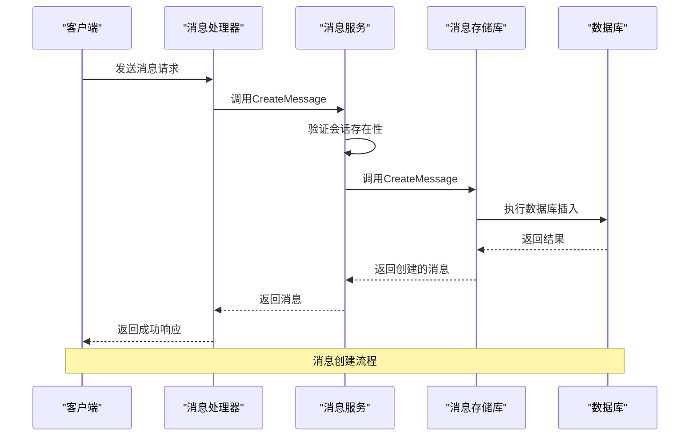
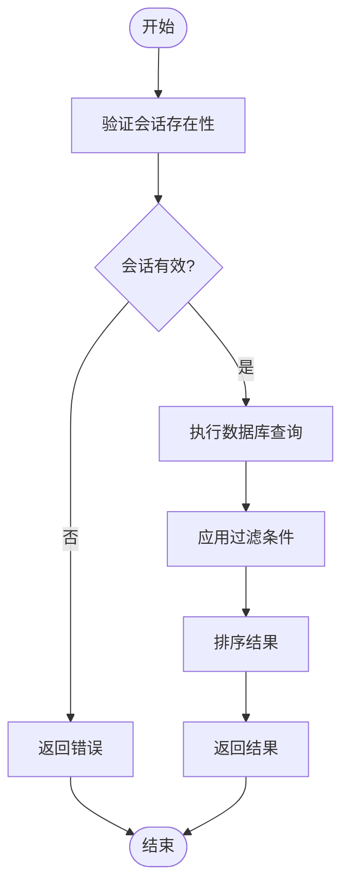
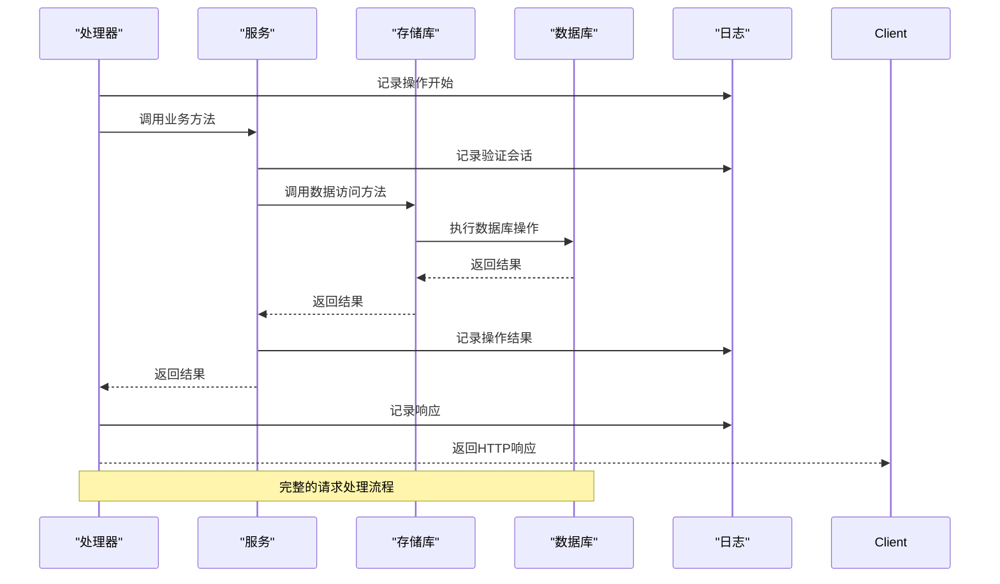
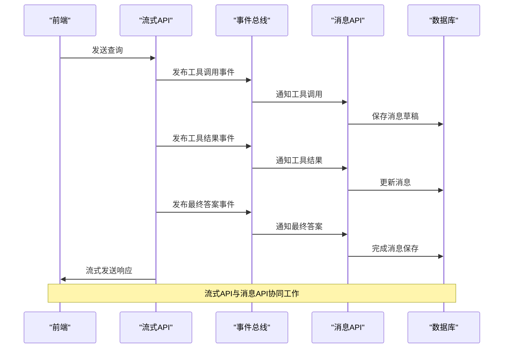

# 消息管理API

<cite>
**本文档中引用的文件**   
- [message.go](file://internal/types/message.go#L1-L96)
- [agent.go](file://internal/types/agent.go#L1-L157)
- [message.go](file://internal/handler/message.go#L1-L137)
- [message.go](file://internal/application/service/message.go#L1-L288)
- [message.go](file://internal/application/repository/message.go#L1-L154)
- [chat.go](file://internal/types/chat.go#L39-L63)
</cite>

## 目录
1. [消息管理API](#消息管理api)
2. [消息增删改查操作](#消息增删改查操作)
3. [分页查询与过滤功能](#分页查询与过滤功能)
4. [消息内容结构](#消息内容结构)
5. [消息持久化策略与审计日志](#消息持久化策略与审计日志)
6. [与聊天流式API协同使用](#与聊天流式api协同使用)

## 消息管理API

消息管理API提供了对会话消息的完整生命周期管理功能，包括创建、读取、更新和删除（CRUD）操作。该API通过RESTful端点暴露功能，支持对会话消息的分页查询、按角色和时间范围过滤等高级功能。API设计遵循分层架构，包含处理层（handler）、服务层（service）和存储层（repository），确保了业务逻辑与数据访问的分离。

## 消息增删改查操作

消息管理API提供了完整的增删改查（CRUD）操作，允许客户端对会话消息进行全生命周期管理。

**创建消息**：通过服务层的`CreateMessage`方法实现，首先验证会话存在性，然后将消息持久化到数据库。创建时会自动生成UUID作为消息ID，并初始化知识引用和代理步骤字段。

**读取消息**：支持多种读取方式，包括获取单个消息、获取会话的所有消息、获取最近消息以及按时间范围获取消息。所有读取操作都会先验证会话存在性，确保消息属于有效会话。

**更新消息**：通过`UpdateMessage`方法实现，允许修改消息内容或元数据。更新前会验证会话存在性，然后执行数据库更新操作。

**删除消息**：通过`DeleteMessage`方法实现，需要提供会话ID和消息ID来定位特定消息。删除前会验证会话存在性，然后从数据库中删除指定消息。



**操作来源**
- [message.go](file://internal/handler/message.go#L33-L137)
- [message.go](file://internal/application/service/message.go#L34-L287)
- [message.go](file://internal/application/repository/message.go#L26-L122)

## 分页查询与过滤功能

消息管理API提供了强大的分页查询和过滤功能，支持按角色和时间范围筛选消息。

**分页查询**：通过`GetMessagesBySession`方法实现，接受页码和页面大小参数，使用SQL的OFFSET和LIMIT子句实现分页。查询结果按创建时间升序排列，确保消息按时间顺序返回。

**最近消息查询**：通过`GetRecentMessagesBySession`方法实现，用于获取会话的最新消息。查询结果按创建时间降序排列，然后在内存中重新排序，确保用户消息在助手消息之前。

**按时间范围查询**：通过`GetMessagesBySessionBeforeTime`方法实现，用于实现滚动加载历史消息的功能。该方法获取指定时间之前的消息，支持无限滚动的聊天界面。

**按角色过滤**：虽然API端点本身不直接支持角色过滤，但通过在内存中对查询结果进行排序实现。在`GetRecentMessagesBySession`和`GetMessagesBySessionBeforeTime`方法中，使用`slices.SortFunc`对结果进行排序，确保用户消息（user）在助手消息（assistant）之前。



**功能来源**
- [message.go](file://internal/application/service/message.go#L103-L218)
- [message.go](file://internal/application/repository/message.go#L49-L108)

## 消息内容结构

消息内容结构设计复杂，包含多个关键字段，特别是工具调用（tool_calls）和引用片段（references）的JSON格式。

**消息基本结构**：每个消息包含唯一ID、会话ID、请求ID、内容、角色、创建时间、更新时间和删除时间等字段。角色字段可以是"user"、"assistant"或"system"。

**工具调用结构**：通过`AgentSteps`字段存储，包含一系列`AgentStep`对象。每个`AgentStep`代表一次ReAct循环迭代，包含思考过程（thought）、工具调用列表（tool_calls）和时间戳。每个`ToolCall`包含ID、名称、参数、结果和执行时长。

**引用片段结构**：通过`KnowledgeReferences`字段存储，类型为`References`，实际上是`[]*SearchResult`的别名。每个引用包含ID、内容、知识库ID、块索引、标题、位置信息、分数、匹配类型、子块ID、元数据、块类型、父块ID、图片信息、文件名和来源等详细信息。

```mermaid
classDiagram
class Message {
+string ID
+string SessionID
+string RequestID
+string Content
+string Role
+References KnowledgeReferences
+AgentSteps AgentSteps
+bool IsCompleted
+time.Time CreatedAt
+time.Time UpdatedAt
+gorm.DeletedAt DeletedAt
}
class References {
<<type>>
[]*SearchResult
}
class AgentSteps {
<<type>>
[]AgentStep
}
class AgentStep {
+int Iteration
+string Thought
+[]ToolCall ToolCalls
+time.Time Timestamp
}
class ToolCall {
+string ID
+string Name
+map[string]interface{} Args
+*ToolResult Result
+string Reflection
+int64 Duration
}
class ToolResult {
+bool Success
+string Output
+map[string]interface{} Data
+string Error
}
Message --> References : "包含"
Message --> AgentSteps : "包含"
AgentSteps --> AgentStep : "元素"
AgentStep --> ToolCall : "包含"
ToolCall --> ToolResult : "包含"
```

**结构来源**
- [message.go](file://internal/types/message.go#L26-L51)
- [agent.go](file://internal/types/agent.go#L109-L125)
- [chat.go](file://internal/types/chat.go#L87)

## 消息持久化策略与审计日志

消息持久化策略基于GORM ORM框架实现，确保数据的一致性和完整性。审计日志机制通过在关键操作中添加日志记录实现，提供了完整的操作追踪能力。

**持久化策略**：使用GORM作为ORM框架，通过`messageRepository`结构体实现数据访问。所有数据库操作都使用事务上下文，确保操作的原子性。在创建消息时，通过`BeforeCreate`钩子自动生成UUID并初始化引用和代理步骤字段。

**审计日志**：在处理层、服务层和存储层的每个关键操作中都添加了详细的日志记录。日志包含操作类型、会话ID、消息ID、执行时间和结果等信息。对于错误情况，记录详细的错误信息和堆栈跟踪。

**事务管理**：所有数据库操作都在请求上下文（context）中执行，确保跨服务调用的一致性。在创建、更新和删除操作中，先验证会话存在性，然后执行相应的数据库操作。



**策略来源**
- [message.go](file://internal/handler/message.go#L36-L137)
- [message.go](file://internal/application/service/message.go#L41-L287)
- [message.go](file://internal/application/repository/message.go#L26-L122)
- [message.go](file://internal/types/message.go#L86-L95)

## 与聊天流式API协同使用

消息管理API与聊天流式API协同工作，提供完整的聊天体验。流式API负责实时消息推送，而消息管理API负责消息的持久化和历史查询。

**协同流程**：当用户发送消息时，聊天流式API接收请求并开始流式响应。在生成响应的过程中，通过事件总线（event bus）发布工具调用、工具结果和最终答案等事件。消息管理API监听这些事件，将生成的消息持久化到数据库。

**事件驱动架构**：系统使用事件驱动架构实现组件间的解耦。当代理执行工具调用时，发布`EventAgentToolCall`事件；当工具执行完成时，发布`EventAgentToolResult`事件；当生成最终答案时，发布`EventAgentFinalAnswer`事件。消息管理API订阅这些事件，将相关信息保存到消息对象中。

**前端集成**：前端通过WebSocket连接到聊天流式API，实时接收消息流。同时，使用消息管理API的分页查询功能加载历史消息。当需要删除消息时，调用消息管理API的删除端点。



**集成来源**
- [message.go](file://internal/handler/message.go#L36-L137)
- [agent.go](file://internal/agent/engine.go#L316-L868)
- [event_data.go](file://internal/event/event_data.go#L158-L188)