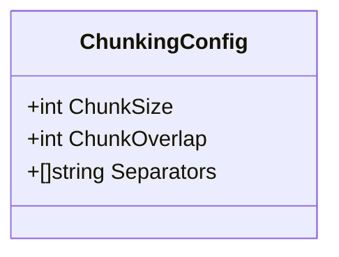
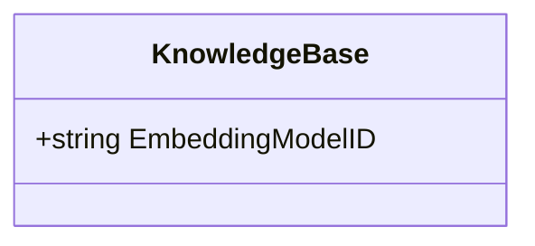
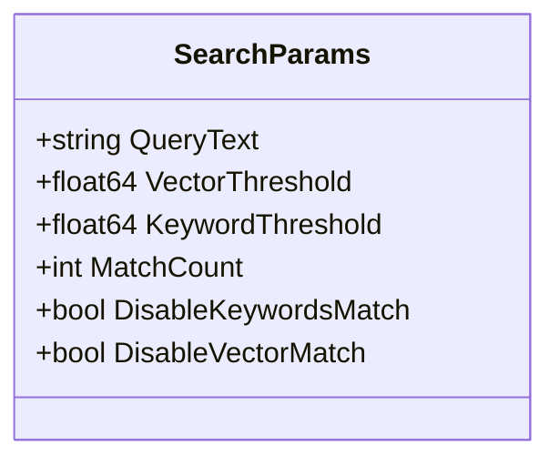
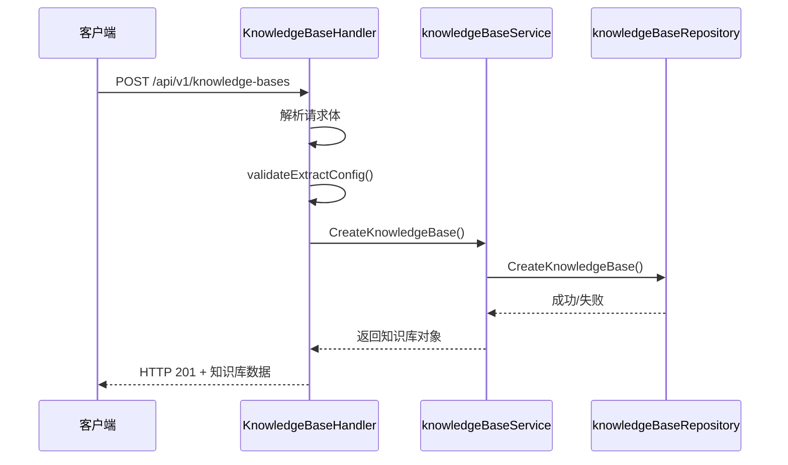

# 知识库API

<cite>
**本文档引用的文件**   
- [internal/handler/knowledgebase.go](file://internal/handler/knowledgebase.go)
- [internal/types/knowledgebase.go](file://internal/types/knowledgebase.go)
- [internal/application/service/knowledgebase.go](file://internal/application/service/knowledgebase.go)
- [client/knowledgebase.go](file://client/knowledgebase.go)
- [docs/api/knowledge-base.md](file://docs/api/knowledge-base.md)
- [frontend/src/views/knowledge/settings/KBChunkingSettings.vue](file://frontend/src/views/knowledge/settings/KBChunkingSettings.vue)
- [frontend/src/views/knowledge/settings/KBModelConfig.vue](file://frontend/src/views/knowledge/settings/KBModelConfig.vue)
- [frontend/src/views/knowledge/settings/KBAdvancedSettings.vue](file://frontend/src/views/knowledge/settings/KBAdvancedSettings.vue)
- [frontend/src/views/knowledge/KnowledgeBaseEditorModal.vue](file://frontend/src/views/knowledge/KnowledgeBaseEditorModal.vue)
</cite>

## 目录
1. [知识库全生命周期管理](#知识库全生命周期管理)
2. [配置选项详解](#配置选项详解)
3. [创建知识库的异步处理流程](#创建知识库的异步处理流程)
4. [批量导入示例](#批量导入示例)
5. [前端配置界面](#前端配置界面)

## 知识库全生命周期管理

知识库API提供了对知识库从创建到删除的完整生命周期管理。核心的`/knowledge-bases`端点支持创建、读取、更新和删除（CRUD）操作，允许用户全面管理其知识库资源。

**Section sources**
- [docs/api/knowledge-base.md](file://docs/api/knowledge-base.md#L1-L371)

## 配置选项详解

知识库的配置选项主要通过`KnowledgeBaseConfig`结构体进行定义，该结构体包含了分块策略、模型配置和高级设置等关键参数。

### 分块策略 (Chunking Strategy)

分块策略通过`ChunkingConfig`结构体进行配置，用于控制文档如何被分割成更小的片段，以便于后续的向量化和检索。



**Diagram sources**
- [internal/types/knowledgebase.go](file://internal/types/knowledgebase.go#L96-L106)

**Section sources**
- [internal/types/knowledgebase.go](file://internal/types/knowledgebase.go#L96-L106)
- [frontend/src/views/knowledge/settings/KBChunkingSettings.vue](file://frontend/src/views/knowledge/settings/KBChunkingSettings.vue#L1-L230)

### 嵌入模型选择 (Embedding Model Selection)

嵌入模型的选择是知识库配置的核心，它决定了文本如何被转换为向量表示。模型ID通过`embedding_model_id`字段指定。



**Diagram sources**
- [internal/types/knowledgebase.go](file://internal/types/knowledgebase.go#L57-L58)

**Section sources**
- [internal/types/knowledgebase.go](file://internal/types/knowledgebase.go#L57-L58)
- [frontend/src/views/knowledge/settings/KBModelConfig.vue](file://frontend/src/views/knowledge/settings/KBModelConfig.vue#L1-L190)

### 检索设置 (Retrieval Settings)

检索设置主要通过`SearchParams`结构体在混合搜索请求中进行配置，影响搜索结果的召回和排序。



**Diagram sources**
- [client/knowledgebase.go](file://client/knowledgebase.go#L231-L239)

**Section sources**
- [client/knowledgebase.go](file://client/knowledgebase.go#L231-L239)
- [internal/application/service/knowledgebase.go](file://internal/application/service/knowledgebase.go#L432-L654)

## 创建知识库的异步处理流程

当通过`CreateKnowledgeBase`端点创建知识库时，其业务逻辑在`internal/handler/knowledgebase.go`中实现。该流程是同步的，但创建后的知识导入和处理是异步的。

1.  **请求处理**: `CreateKnowledgeBase`方法接收HTTP请求，解析请求体中的`KnowledgeBase`对象。
2.  **参数验证**: 调用`validateExtractConfig`方法验证提取配置（如知识图谱配置）的有效性。
3.  **服务调用**: 将验证后的`KnowledgeBase`对象传递给`knowledgeBaseService`的服务层。
4.  **持久化**: 服务层调用`repository`将知识库信息持久化到数据库。
5.  **响应返回**: 创建成功后，立即返回包含新知识库信息的HTTP 201响应。



**Diagram sources**
- [internal/handler/knowledgebase.go](file://internal/handler/knowledgebase.go#L71-L105)
- [internal/application/service/knowledgebase.go](file://internal/application/service/knowledgebase.go#L66-L91)

**Section sources**
- [internal/handler/knowledgebase.go](file://internal/handler/knowledgebase.go#L71-L105)
- [internal/application/service/knowledgebase.go](file://internal/application/service/knowledgebase.go#L66-L91)

## 批量导入示例

虽然`client/knowledgebase.go`中没有直接提供批量导入知识库的函数，但可以通过`CreateKnowledgeBase`函数创建知识库，然后使用其他客户端函数（如`CreateKnowledgeFromFile`）来批量导入知识。

```go
// 创建知识库
kb := &client.KnowledgeBase{
    Name: "My Batch Knowledge Base",
    ChunkingConfig: client.ChunkingConfig{
        ChunkSize:    1000,
        ChunkOverlap: 200,
        Separators:   []string{"\n\n", "\n", "."},
    },
    EmbeddingModelID: "your-embedding-model-id",
}
createdKB, err := client.CreateKnowledgeBase(ctx, kb)
if err != nil {
    log.Fatal(err)
}

// 假设有一个文件列表需要导入
files := []string{"file1.pdf", "file2.txt", "file3.docx"}
for _, filePath := range files {
    // 从文件创建知识
    knowledge, err := client.CreateKnowledgeFromFile(ctx, createdKB.ID, filePath, nil, nil, "")
    if err != nil {
        log.Printf("Failed to upload %s: %v", filePath, err)
        continue
    }
    log.Printf("Uploaded: %s", knowledge.Title)
}
```

**Section sources**
- [client/knowledgebase.go](file://client/knowledgebase.go#L143-L156)
- [client/example.go](file://client/example.go#L54-L73)

## 前端配置界面

前端知识库配置界面由多个Vue组件构成，与API的配置选项一一对应。

### 分块设置界面

`KBChunkingSettings.vue`组件提供了对`ChunkingConfig`的图形化配置，包括滑块控制的分块大小和重叠大小，以及多选的分隔符。

**Section sources**
- [frontend/src/views/knowledge/settings/KBChunkingSettings.vue](file://frontend/src/views/knowledge/settings/KBChunkingSettings.vue#L1-L230)

### 模型配置界面

`KBModelConfig.vue`组件允许用户选择LLM和嵌入模型。当知识库中已有文件时，嵌入模型的选择会被禁用，以防止不一致。

**Section sources**
- [frontend/src/views/knowledge/settings/KBModelConfig.vue](file://frontend/src/views/knowledge/settings/KBModelConfig.vue#L1-L190)

### 高级设置界面

`KBAdvancedSettings.vue`组件处理更复杂的配置，如多模态设置和问题生成。它通过`v-model`和`@update`事件与父组件进行双向数据绑定。

**Section sources**
- [frontend/src/views/knowledge/settings/KBAdvancedSettings.vue](file://frontend/src/views/knowledge/settings/KBAdvancedSettings.vue#L1-L566)

### 知识库编辑器

`KnowledgeBaseEditorModal.vue`是主配置界面，它组合了上述所有设置组件，并根据知识库类型（文档或FAQ）动态显示不同的配置选项。

**Section sources**
- [frontend/src/views/knowledge/KnowledgeBaseEditorModal.vue](file://frontend/src/views/knowledge/KnowledgeBaseEditorModal.vue#L1-L800)