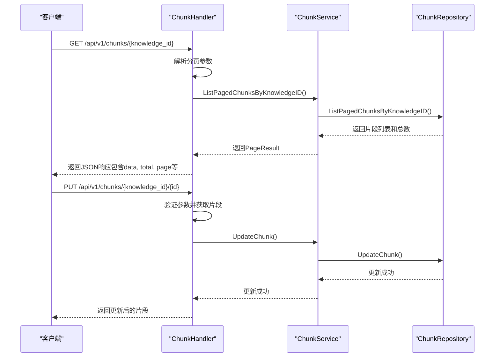
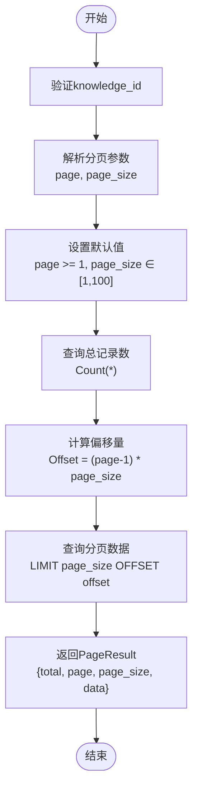
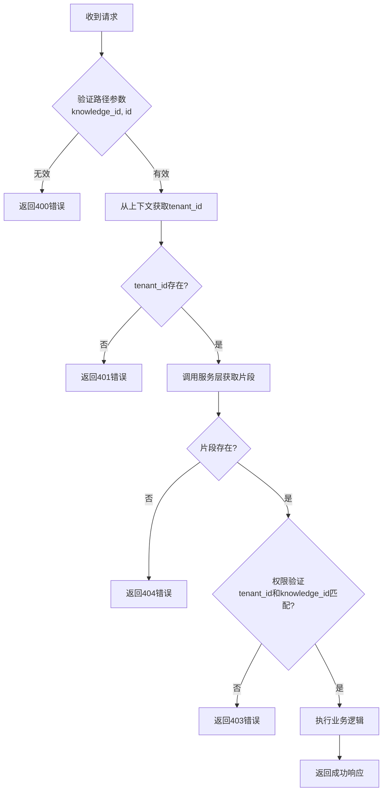
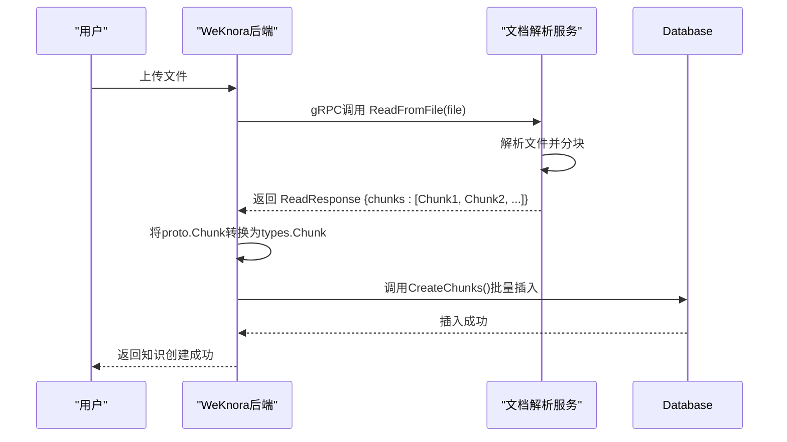

# 知识片段API

<cite>
**本文档中引用的文件**   
- [chunk.go](file://client/chunk.go)
- [chunk.go](file://internal/handler/chunk.go)
- [chunk.go](file://internal/application/service/chunk.go)
- [chunk.go](file://internal/application/repository/chunk.go)
- [chunk.md](file://docs/api/chunk.md)
- [router.go](file://internal/router/router.go)
- [search.go](file://internal/types/search.go)
- [chunk.go](file://internal/types/chunk.go)
- [interfaces/chunk.go](file://internal/types/interfaces/chunk.go)
- [client.go](file://docreader/client/client.go)
- [knowledge.go](file://internal/application/service/knowledge.go)
</cite>

## 目录
1. [简介](#简介)
2. [核心操作](#核心操作)
3. [过滤与分页机制](#过滤与分页机制)
4. [数据验证与权限控制](#数据验证与权限控制)
5. [批量操作示例](#批量操作示例)
6. [与文档解析服务的数据同步](#与文档解析服务的数据同步)
7. [混合检索中的作用](#混合检索中的作用)

## 简介
知识片段API是WeKnora系统中用于管理文档片段的核心接口。该API允许用户对知识库中的文档片段进行创建、查询、更新和删除操作。每个知识片段（Chunk）代表从原始文档中提取的有意义的文本段落，是知识库检索的基本单元。片段与知识库和知识文档建立关联，支持向量嵌入和精确的内容定位。

**Section sources**
- [chunk.md](file://docs/api/chunk.md#L1-L96)

## 核心操作
知识片段API提供了对片段的完整CRUD操作，主要通过`/api/v1/chunks`端点实现。核心操作包括：

- **查询片段列表**：通过`GET /api/v1/chunks/{knowledge_id}`获取特定知识文档下的所有片段。
- **更新片段**：通过`PUT /api/v1/chunks/{knowledge_id}/{id}`更新特定片段的属性。
- **删除片段**：通过`DELETE /api/v1/chunks/{knowledge_id}/{id}`删除单个片段，或通过`DELETE /api/v1/chunks/{knowledge_id}`删除知识文档下的所有片段。



**Diagram sources**
- [chunk.go](file://internal/handler/chunk.go#L82-L135)
- [chunk.go](file://internal/application/service/chunk.go#L132-L165)
- [chunk.go](file://internal/application/repository/chunk.go#L71-L119)

## 过滤与分页机制
`/chunks`端点支持强大的过滤和分页功能，以处理大规模数据集。

### 过滤参数
在`ListPagedChunksByKnowledgeID`方法中，除了`knowledge_id`外，还支持以下过滤参数：
- **knowledge_base_id**: 通过`Chunk`结构体中的`KnowledgeBaseID`字段，可以将片段与特定的知识库关联。
- **keywords**: 在`ListPagedChunksByKnowledgeID`的仓库实现中，支持通过`keyword`参数对`content`或`metadata`字段进行模糊搜索。

### 分页机制
API使用`Pagination`结构体实现分页：
- **page**: 页码，从1开始。
- **page_size**: 每页大小，范围为1-100，默认为10。

分页逻辑在`ListPagedChunksByKnowledgeID`服务和仓库方法中实现，首先查询总数，然后根据偏移量（Offset）和限制（Limit）获取当前页的数据。



**Diagram sources**
- [chunk.go](file://internal/handler/chunk.go#L94-L110)
- [chunk.go](file://internal/application/service/chunk.go#L132-L165)
- [chunk.go](file://internal/application/repository/chunk.go#L71-L119)
- [search.go](file://internal/types/search.go#L81-L116)

## 数据验证与权限控制
基于`internal/handler/chunk.go`的实现，API在处理请求时执行严格的数据验证和权限控制。

### 数据验证规则
- **路径参数验证**：确保`knowledge_id`和`chunk_id`不为空。
- **分页参数验证**：使用`ShouldBindQuery`绑定并验证`Pagination`结构体，确保`page`和`page_size`在有效范围内。
- **请求体验证**：对于更新操作，使用`ShouldBindJSON`绑定`UpdateChunkRequest`结构体。

### 权限控制逻辑
权限控制是通过多层验证实现的：
1. **租户上下文**：从Gin上下文中获取`tenant_id`。
2. **所有权验证**：在`validateAndGetChunk`方法中，不仅验证`chunk_id`和`knowledge_id`，还检查请求的`tenant_id`是否与片段的`tenant_id`匹配，以及`chunk.KnowledgeID`是否与请求的`knowledge_id`一致。
3. **错误处理**：如果验证失败，返回相应的错误码（如400 Bad Request, 403 Forbidden, 404 Not Found）。



**Section sources**
- [chunk.go](file://internal/handler/chunk.go#L148-L201)
- [chunk.go](file://internal/handler/chunk.go#L208-L213)

## 批量操作示例
客户端`client/chunk.go`提供了用于批量操作的便捷方法。

### 批量删除示例
以下代码展示了如何使用Go客户端批量删除知识文档下的所有片段：

```go
// 创建客户端实例
client := NewClient("http://localhost:8080", "your-api-key")

// 定义上下文
ctx := context.Background()

// 要删除所有片段的知识文档ID
knowledgeID := "your-knowledge-id"

// 调用批量删除方法
err := client.DeleteChunksByKnowledgeID(ctx, knowledgeID)
if err != nil {
    log.Fatalf("删除片段失败: %v", err)
}

fmt.Println("所有片段删除成功")
```

此操作对应于`DELETE /api/v1/chunks/{knowledge_id}`端点，会删除指定知识文档下的所有片段。

**Section sources**
- [chunk.go](file://client/chunk.go#L156-L177)

## 与文档解析服务的数据同步
知识片段的创建与文档解析服务（docreader）紧密集成，数据同步机制如下：

1. **文件上传**：当用户上传文件时，`CreateKnowledgeFromFile`服务方法被调用。
2. **调用DocReader**：该服务通过gRPC客户端（`docReaderClient`）调用`ReadFromFile`或`ReadFromURL`方法，将文件发送给文档解析服务。
3. **解析与分块**：文档解析服务（位于`docreader/`目录）解析文件内容，并将其分割成多个`Chunk`。
4. **数据转换**：解析服务返回的`ReadResponse`包含一个`Chunk`列表。WeKnora后端将这些`proto.Chunk`对象转换为内部的`types.Chunk`对象。
5. **持久化**：转换后的片段通过`chunkService.CreateChunks`方法批量保存到数据库中。



**Diagram sources**
- [knowledge.go](file://internal/application/service/knowledge.go#L136-L200)
- [client.go](file://docreader/client/client.go#L89-L113)
- [docreader.pb.go](file://docreader/proto/docreader.pb.go#L551-L625)

## 混合检索中的作用
知识片段是混合检索（Hybrid Search）的核心组成部分。在混合检索中，系统结合了关键词搜索和向量相似度搜索：
- **关键词搜索**：利用数据库的全文检索功能，根据`keywords`参数在`content`和`metadata`字段中进行匹配。
- **向量搜索**：每个知识片段在创建时会被其关联知识库的嵌入模型（Embedding Model）转换为向量，并存储在向量数据库中。当进行语义搜索时，查询文本也会被转换为向量，并与片段向量进行相似度计算。

`ListPagedChunksByKnowledgeID`方法中的`keyword`过滤是关键词搜索的基础，而片段的向量化和索引由`retriever`模块在后台处理。最终，混合检索结果会将两种搜索方式的结果进行融合和重排序，提供更准确的检索体验。

**Section sources**
- [chunk.go](file://internal/application/repository/chunk.go#L91-L94)
- [chunk.go](file://internal/types/chunk.go#L78-L102)