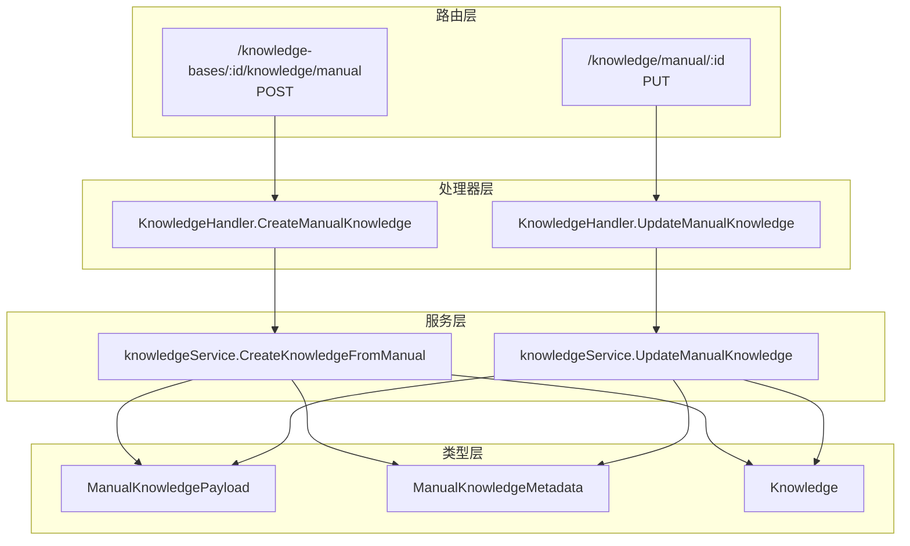
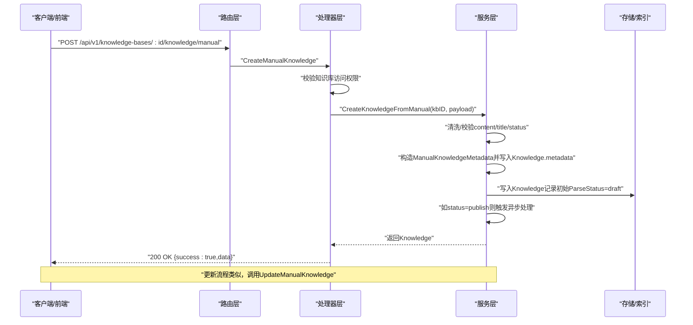
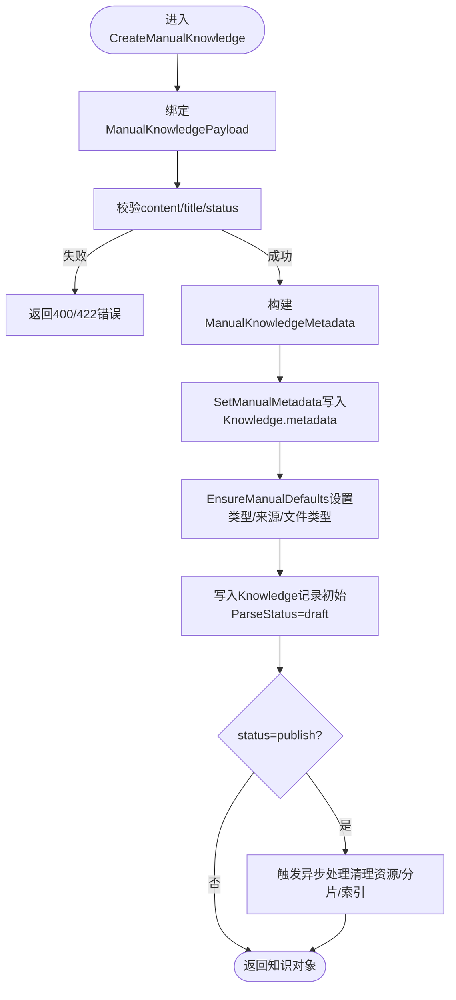
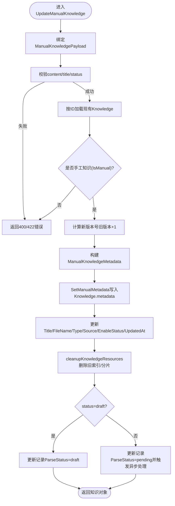
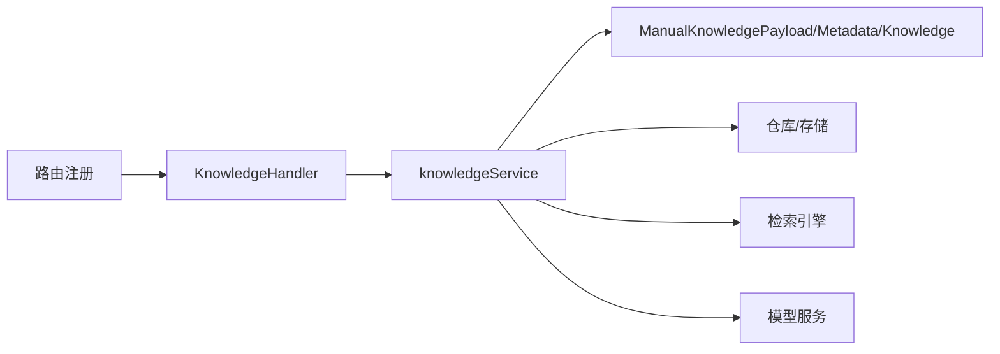

# FAQ管理API

<cite>
**本文引用的文件**
- [internal/handler/knowledge.go](file://internal/handler/knowledge.go)
- [internal/router/router.go](file://internal/router/router.go)
- [internal/types/knowledge.go](file://internal/types/knowledge.go)
- [internal/application/service/knowledge.go](file://internal/application/service/knowledge.go)
- [client/knowledge.go](file://client/knowledge.go)
- [docs/api/knowledge.md](file://docs/api/knowledge.md)
- [frontend/src/api/knowledge-base/index.ts](file://frontend/src/api/knowledge-base/index.ts)
</cite>

## 目录
1. [简介](#简介)
2. [项目结构](#项目结构)
3. [核心组件](#核心组件)
4. [架构总览](#架构总览)
5. [详细组件分析](#详细组件分析)
6. [依赖关系分析](#依赖关系分析)
7. [性能考量](#性能考量)
8. [故障排查指南](#故障排查指南)
9. [结论](#结论)
10. [附录](#附录)

## 简介
本文件面向开发者与集成者，系统化梳理 WeKnora 中“手工Markdown知识（FAQ）”的管理API，重点覆盖以下端点与流程：
- 创建手工Markdown知识：POST /api/v1/knowledge-bases/:id/knowledge/manual
- 更新手工Markdown知识：PUT /api/v1/knowledge/manual/:id
- 请求体结构：title、content、status
- 响应格式：success、data（知识对象）
- 后端实现链路：handler -> service -> repository/存储
- 前端与客户端调用参考：前端API封装、客户端方法

同时，文档提供可视化流程图与错误处理策略，帮助快速定位问题并优化性能。

## 项目结构
围绕FAQ管理API的关键文件组织如下：
- 路由层：定义 /knowledge/manual 与 /knowledge-bases/:id/knowledge/manual 的REST端点
- 处理器层：解析请求、校验权限、调用服务层
- 类型层：定义 ManualKnowledgePayload、ManualKnowledgeMetadata、Knowledge 结构
- 服务层：执行业务规则（校验、清理、状态机、触发异步处理）
- 客户端层：提供 CreateKnowledgeFromManual 等方法，便于在程序中集成

图表来源
- [internal/router/router.go](file://internal/router/router.go#L130-L155)
- [internal/handler/knowledge.go](file://internal/handler/knowledge.go#L226-L263)
- [internal/handler/knowledge.go](file://internal/handler/knowledge.go#L522-L559)
- [internal/types/knowledge.go](file://internal/types/knowledge.go#L129-L176)
- [internal/application/service/knowledge.go](file://internal/application/service/knowledge.go#L487-L553)
- [internal/application/service/knowledge.go](file://internal/application/service/knowledge.go#L2004-L2098)

章节来源
- [internal/router/router.go](file://internal/router/router.go#L130-L155)
- [internal/handler/knowledge.go](file://internal/handler/knowledge.go#L226-L263)
- [internal/handler/knowledge.go](file://internal/handler/knowledge.go#L522-L559)
- [internal/types/knowledge.go](file://internal/types/knowledge.go#L129-L176)
- [internal/application/service/knowledge.go](file://internal/application/service/knowledge.go#L487-L553)
- [internal/application/service/knowledge.go](file://internal/application/service/knowledge.go#L2004-L2098)

## 核心组件
- ManualKnowledgePayload：创建/更新手工知识的请求体载体，包含 title、content、status
- ManualKnowledgeMetadata：知识的元数据，保存 content、format、status、version、updated_at
- Knowledge：知识实体，包含元数据字段 metadata（JSON），以及类型、状态、文件名等
- Handler：负责参数绑定、权限校验、错误处理与响应
- Service：执行输入清洗、长度/字符校验、状态转换、版本递增、触发异步处理

章节来源
- [internal/types/knowledge.go](file://internal/types/knowledge.go#L129-L176)
- [internal/types/knowledge.go](file://internal/types/knowledge.go#L54-L106)
- [internal/handler/knowledge.go](file://internal/handler/knowledge.go#L226-L263)
- [internal/handler/knowledge.go](file://internal/handler/knowledge.go#L522-L559)
- [internal/application/service/knowledge.go](file://internal/application/service/knowledge.go#L487-L553)
- [internal/application/service/knowledge.go](file://internal/application/service/knowledge.go#L2004-L2098)

## 架构总览
下图展示从HTTP请求到持久化与异步处理的整体流程。

图表来源
- [internal/router/router.go](file://internal/router/router.go#L130-L155)
- [internal/handler/knowledge.go](file://internal/handler/knowledge.go#L226-L263)
- [internal/application/service/knowledge.go](file://internal/application/service/knowledge.go#L487-L553)
- [internal/application/service/knowledge.go](file://internal/application/service/knowledge.go#L4263-L4346)

## 详细组件分析

### 端点：创建手工Markdown知识
- 路径：POST /api/v1/knowledge-bases/:id/knowledge/manual
- 功能：在指定知识库下创建手工Markdown知识，支持草稿与发布两种状态
- 请求体字段
  - title：知识标题（可选，为空时自动生成）
  - content：Markdown内容（必填，长度限制）
  - status：状态，支持 draft/publish（可选，默认draft）
- 响应
  - success：布尔值
  - data：知识对象（包含ID、标题、状态、元数据等）

请求体与响应结构参考
- 请求体结构：ManualKnowledgePayload
- 响应结构：Knowledge（包含metadata字段，其中包含ManualKnowledgeMetadata）

章节来源
- [docs/api/knowledge.md](file://docs/api/knowledge.md#L1-L18)
- [internal/types/knowledge.go](file://internal/types/knowledge.go#L129-L176)
- [internal/handler/knowledge.go](file://internal/handler/knowledge.go#L226-L263)
- [internal/application/service/knowledge.go](file://internal/application/service/knowledge.go#L487-L553)

### 端点：更新手工Markdown知识
- 路径：PUT /api/v1/knowledge/manual/:id
- 功能：对已有手工知识进行内容更新，支持草稿与发布两种状态
- 请求体字段
  - title：知识标题（可选）
  - content：Markdown内容（必填，长度限制）
  - status：状态，支持 draft/publish（可选）
- 响应
  - success：布尔值
  - data：更新后的知识对象

章节来源
- [docs/api/knowledge.md](file://docs/api/knowledge.md#L1-L18)
- [internal/router/router.go](file://internal/router/router.go#L130-L155)
- [internal/handler/knowledge.go](file://internal/handler/knowledge.go#L522-L559)
- [internal/application/service/knowledge.go](file://internal/application/service/knowledge.go#L2004-L2098)

### 请求体与响应格式详解
- ManualKnowledgePayload
  - 字段：title、content、status
  - 校验：content非空且长度限制；status仅允许 draft/publish；title合法性校验
- ManualKnowledgeMetadata
  - 字段：content、format、status、version、updated_at
  - 默认值：format默认markdown；status默认draft；version默认1；updated_at默认当前时间
- Knowledge
  - 字段：id、tenant_id、knowledge_base_id、type、title、description、source、parse_status、enable_status、embedding_model_id、file_name、file_type、file_size、file_hash、file_path、storage_size、metadata、created_at、updated_at、processed_at、error_message、deleted_at
  - metadata：JSON字段，存储ManualKnowledgeMetadata

章节来源
- [internal/types/knowledge.go](file://internal/types/knowledge.go#L54-L106)
- [internal/types/knowledge.go](file://internal/types/knowledge.go#L129-L176)
- [internal/types/knowledge.go](file://internal/types/knowledge.go#L177-L213)

### 后端处理流程（创建）

图表来源
- [internal/handler/knowledge.go](file://internal/handler/knowledge.go#L226-L263)
- [internal/application/service/knowledge.go](file://internal/application/service/knowledge.go#L487-L553)
- [internal/application/service/knowledge.go](file://internal/application/service/knowledge.go#L4263-L4346)

### 后端处理流程（更新）

图表来源
- [internal/handler/knowledge.go](file://internal/handler/knowledge.go#L522-L559)
- [internal/application/service/knowledge.go](file://internal/application/service/knowledge.go#L2004-L2098)
- [internal/application/service/knowledge.go](file://internal/application/service/knowledge.go#L4347-L4383)
- [internal/application/service/knowledge.go](file://internal/application/service/knowledge.go#L4263-L4346)

### 错误处理与状态码
- 400：请求体格式错误、参数非法（如content为空、title非法、status非法）
- 401/403：无权限访问知识库或未授权
- 404：知识不存在
- 409：重复知识（服务层抛出重复错误时，处理器返回冲突响应）
- 500：内部服务器错误

章节来源
- [internal/handler/knowledge.go](file://internal/handler/knowledge.go#L32-L63)
- [internal/handler/knowledge.go](file://internal/handler/knowledge.go#L66-L83)
- [internal/handler/knowledge.go](file://internal/handler/knowledge.go#L226-L263)
- [internal/handler/knowledge.go](file://internal/handler/knowledge.go#L522-L559)

### 在程序中使用客户端方法
- 客户端提供 CreateKnowledgeFromManual 方法，用于在程序中创建手工知识
- 前端API封装示例
  - 创建：post /api/v1/knowledge-bases/:kbId/knowledge/manual
  - 更新：put /api/v1/knowledge/manual/:id

章节来源
- [client/knowledge.go](file://client/knowledge.go#L1-L120)
- [frontend/src/api/knowledge-base/index.ts](file://frontend/src/api/knowledge-base/index.ts#L47-L81)

## 依赖关系分析
- 路由注册
  - /knowledge-bases/:id/knowledge/manual -> POST -> CreateManualKnowledge
  - /knowledge/manual/:id -> PUT -> UpdateManualKnowledge
- 处理器依赖服务接口 KnowledgeService
- 服务层依赖知识库服务、存储、检索引擎、模型服务等
- 类型层提供ManualPayload/Metadata/Knowledge三类核心结构

图表来源
- [internal/router/router.go](file://internal/router/router.go#L130-L155)
- [internal/handler/knowledge.go](file://internal/handler/knowledge.go#L226-L263)
- [internal/handler/knowledge.go](file://internal/handler/knowledge.go#L522-L559)
- [internal/types/knowledge.go](file://internal/types/knowledge.go#L129-L176)
- [internal/application/service/knowledge.go](file://internal/application/service/knowledge.go#L487-L553)
- [internal/application/service/knowledge.go](file://internal/application/service/knowledge.go#L2004-L2098)

## 性能考量
- 异步处理：当status=publish时，服务层会触发异步处理（清理旧资源、分片、索引），避免阻塞请求
- 版本控制：每次更新都会递增version，便于追踪变更历史
- 清洗与校验：服务层对content进行Markdown清洗与长度限制，减少无效负载
- 索引清理：更新前清理旧索引/分片，防止冗余数据占用空间

章节来源
- [internal/application/service/knowledge.go](file://internal/application/service/knowledge.go#L4263-L4346)
- [internal/application/service/knowledge.go](file://internal/application/service/knowledge.go#L4347-L4383)
- [internal/application/service/knowledge.go](file://internal/application/service/knowledge.go#L2004-L2098)

## 故障排查指南
- 400错误
  - content为空或超过长度限制
  - title非法或过长
  - status不在允许范围
- 401/403错误
  - 知识库ID为空或租户权限不匹配
- 409错误
  - 重复知识（服务层抛出重复错误）
- 500错误
  - 服务层内部异常，查看日志定位具体原因

章节来源
- [internal/handler/knowledge.go](file://internal/handler/knowledge.go#L32-L63)
- [internal/handler/knowledge.go](file://internal/handler/knowledge.go#L66-L83)
- [internal/handler/knowledge.go](file://internal/handler/knowledge.go#L226-L263)
- [internal/handler/knowledge.go](file://internal/handler/knowledge.go#L522-L559)

## 结论
- 手工Markdown知识（FAQ）的创建与更新通过两个核心端点完成，请求体简洁明确，响应统一
- 服务层承担了严格的输入校验、状态机转换与异步处理，保证数据一致性与性能
- 建议在客户端/前端侧配合校验与版本提示，提升用户体验与稳定性

## 附录

### API端点一览（与FAQ相关）
- POST /api/v1/knowledge-bases/:id/knowledge/manual
  - 作用：在指定知识库下创建手工Markdown知识
  - 请求体：title、content、status
  - 响应：success、data（知识对象）
- PUT /api/v1/knowledge/manual/:id
  - 作用：更新手工Markdown知识
  - 请求体：title、content、status
  - 响应：success、data（知识对象）

章节来源
- [docs/api/knowledge.md](file://docs/api/knowledge.md#L1-L18)
- [internal/router/router.go](file://internal/router/router.go#L130-L155)