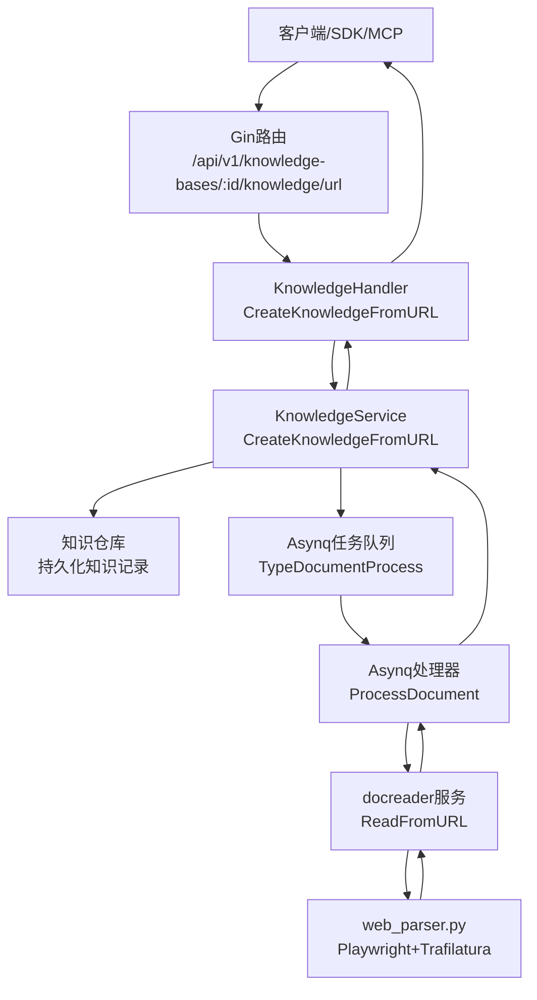
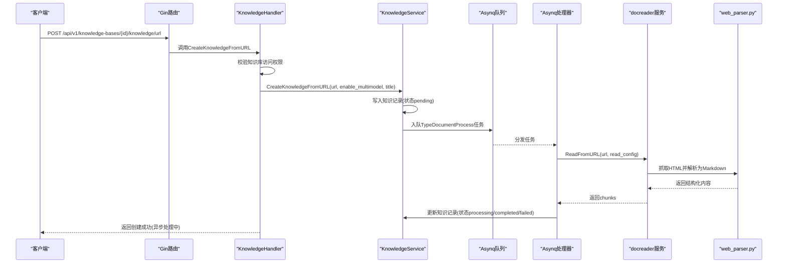
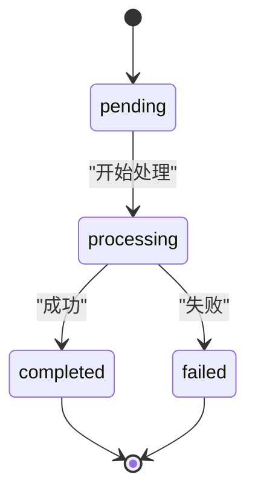
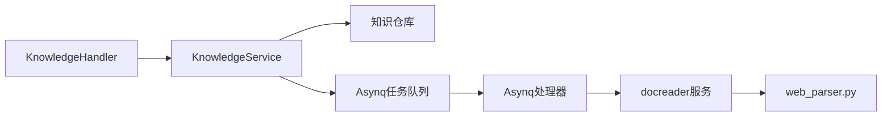

# URL处理API

<cite>
**本文引用的文件**
- [internal/handler/knowledge.go](file://internal/handler/knowledge.go)
- [internal/router/router.go](file://internal/router/router.go)
- [internal/application/service/knowledge.go](file://internal/application/service/knowledge.go)
- [internal/types/knowledge.go](file://internal/types/knowledge.go)
- [internal/types/interfaces/knowledge.go](file://internal/types/interfaces/knowledge.go)
- [internal/router/task.go](file://internal/router/task.go)
- [docreader/parser/web_parser.py](file://docreader/parser/web_parser.py)
- [docreader/proto/docreader.pb.go](file://docreader/proto/docreader.pb.go)
- [docreader/proto/docreader_grpc.pb.go](file://docreader/proto/docreader_grpc.pb.go)
- [docreader/main.py](file://docreader/main.py)
- [client/knowledge.go](file://client/knowledge.go)
- [mcp-server/weknora_mcp_server.py](file://mcp-server/weknora_mcp_server.py)
</cite>

## 目录
1. [简介](#简介)
2. [项目结构](#项目结构)
3. [核心组件](#核心组件)
4. [架构总览](#架构总览)
5. [详细组件分析](#详细组件分析)
6. [依赖关系分析](#依赖关系分析)
7. [性能考量](#性能考量)
8. [故障排查指南](#故障排查指南)
9. [结论](#结论)

## 简介
本文档围绕/knowledge-bases/:id/knowledge/url端点进行系统化说明，覆盖请求参数、URL内容抓取流程、网络超时与内容类型校验、HTML/文本内容提取、enable_multimodel参数在网页截图与视觉理解中的作用、异步任务处理机制、知识条目状态追踪与错误处理，以及与docreader服务中web_parser.py的集成细节（页面渲染、结构化内容提取与元数据生成）。

## 项目结构
该API属于后端知识管理模块，采用HTTP路由+服务层+异步任务队列的分层设计：
- 路由层：注册/knowledge-bases/:id/knowledge/url为POST端点
- 控制器层：解析请求体、鉴权与访问控制、调用服务层
- 服务层：创建知识记录、入队URL处理任务、幂等性与状态机管理
- 异步任务：Asynq消费“文档处理”任务，调用docreader服务完成抓取与解析
- docreader服务：基于Playwright+Trafilatura抓取网页并输出结构化Markdown

图表来源
- [internal/router/router.go](file://internal/router/router.go#L121-L134)
- [internal/handler/knowledge.go](file://internal/handler/knowledge.go#L170-L224)
- [internal/application/service/knowledge.go](file://internal/application/service/knowledge.go#L348-L471)
- [internal/router/task.go](file://internal/router/task.go#L58-L62)
- [docreader/parser/web_parser.py](file://docreader/parser/web_parser.py#L38-L116)
- [docreader/proto/docreader.pb.go](file://docreader/proto/docreader.pb.go#L398-L406)

章节来源
- [internal/router/router.go](file://internal/router/router.go#L121-L134)
- [internal/handler/knowledge.go](file://internal/handler/knowledge.go#L170-L224)

## 核心组件
- HTTP端点与路由
  - 路由：/api/v1/knowledge-bases/:id/knowledge/url（POST）
  - 控制器：KnowledgeHandler.CreateKnowledgeFromURL
- 请求参数
  - url：必填，目标网页URL
  - enable_multimodel：可选，布尔值；若未提供则回退到知识库配置
  - title：可选，知识标题
- 服务层
  - KnowledgeService.CreateKnowledgeFromURL：创建知识记录并入队URL处理任务
- 异步任务
  - Asynq任务类型：TypeDocumentProcess
  - 处理器：ProcessDocument
- docreader服务
  - gRPC服务：DocReader.ReadFromURL
  - 解析器：web_parser.py（Playwright+Trafilatura）

章节来源
- [internal/router/router.go](file://internal/router/router.go#L121-L134)
- [internal/handler/knowledge.go](file://internal/handler/knowledge.go#L170-L224)
- [internal/types/interfaces/knowledge.go](file://internal/types/interfaces/knowledge.go#L12-L31)
- [internal/router/task.go](file://internal/router/task.go#L58-L62)
- [docreader/proto/docreader.pb.go](file://docreader/proto/docreader.pb.go#L398-L406)

## 架构总览
/knowledge-bases/:id/knowledge/url端点的工作流如下：

图表来源
- [internal/handler/knowledge.go](file://internal/handler/knowledge.go#L170-L224)
- [internal/application/service/knowledge.go](file://internal/application/service/knowledge.go#L348-L471)
- [internal/router/task.go](file://internal/router/task.go#L58-L62)
- [docreader/proto/docreader.pb.go](file://docreader/proto/docreader.pb.go#L398-L406)
- [docreader/parser/web_parser.py](file://docreader/parser/web_parser.py#L38-L116)

## 详细组件分析

### 1) 端点定义与请求参数
- 端点路径：/api/v1/knowledge-bases/:id/knowledge/url（POST）
- 参数绑定
  - url：必填
  - enable_multimodel：可选布尔值
  - title：可选字符串
- 访问控制
  - 校验知识库ID存在且租户匹配
- 返回
  - 成功：201 Created，返回新建的知识对象（状态为pending）
  - 重复：409 Conflict，返回现有知识对象
  - 其他错误：500 InternalServerError

章节来源
- [internal/router/router.go](file://internal/router/router.go#L121-L134)
- [internal/handler/knowledge.go](file://internal/handler/knowledge.go#L170-L224)

### 2) URL内容抓取流程与超时设置
- 抓取引擎
  - web_parser.py使用Playwright启动WebKit浏览器，导航至目标URL
  - 导航超时：30秒
  - 页面内容获取后，使用Trafilatura提取结构化内容（含元数据、图片、表格、链接），去重
- 内容类型与校验
  - 服务层通过gRPC调用docreader.ReadFromURL，不直接在HTTP层做MIME校验
  - 若抓取失败或解析为空，docreader会返回错误，服务层将其映射为知识记录失败状态
- HTML/文本提取
  - 返回Markdown格式，包含标题、正文、元数据、图片、表格、链接等

章节来源
- [docreader/parser/web_parser.py](file://docreader/parser/web_parser.py#L38-L116)
- [docreader/proto/docreader.pb.go](file://docreader/proto/docreader.pb.go#L398-L406)
- [docreader/main.py](file://docreader/main.py#L201-L232)

### 3) enable_multimodel参数的作用
- 语义
  - 控制是否启用多模态（网页截图、视觉理解、OCR等）
- 生效范围
  - 服务层：当enable_multimodel为true时，构建VLM配置并传递给docreader
  - 知识库回退：若请求未提供，则使用知识库配置（VLMConfig或旧版chunking配置）
- 注意
  - 该参数主要影响docreader侧的多模态处理链路，而非HTTP层

章节来源
- [internal/application/service/knowledge.go](file://internal/application/service/knowledge.go#L4533-L4544)
- [internal/types/knowledgebase.go](file://internal/types/knowledgebase.go#L331-L347)
- [mcp-server/weknora_mcp_server.py](file://mcp-server/weknora_mcp_server.py#L148-L158)

### 4) 异步处理机制与状态追踪
- 入队
  - 服务层创建知识记录后，将DocumentProcess任务入队，默认队列“default”
- 幂等性
  - 处理器在开始前查询知识记录，若状态为completed则跳过；若状态为deleting则终止
- 状态机
  - pending -> processing -> completed 或 failed
  - 失败原因写入ErrorMessage字段
- 结果
  - 处理完成后，服务层更新知识记录状态与时间戳

图表来源
- [internal/types/knowledge.go](file://internal/types/knowledge.go#L19-L31)
- [internal/application/service/knowledge.go](file://internal/application/service/knowledge.go#L4470-L4512)

章节来源
- [internal/application/service/knowledge.go](file://internal/application/service/knowledge.go#L348-L471)
- [internal/types/knowledge.go](file://internal/types/knowledge.go#L19-L31)

### 5) 错误处理
- 请求阶段
  - 参数校验失败：400 Bad Request
  - 权限不足或知识库不存在：403 Forbidden 或 500 InternalServerError
  - 重复知识：409 Conflict（返回现有知识对象）
- 处理阶段
  - 入队失败：记录日志，仍返回知识对象（保证幂等）
  - 抓取/解析失败：知识记录置为failed，写入ErrorMessage
  - 客户端SDK：遇到409时识别为重复URL并返回ErrDuplicateURL

章节来源
- [internal/handler/knowledge.go](file://internal/handler/knowledge.go#L170-L224)
- [internal/application/service/knowledge.go](file://internal/application/service/knowledge.go#L322-L345)
- [client/knowledge.go](file://client/knowledge.go#L210-L226)

### 6) 与docreader服务的集成细节
- gRPC接口
  - 服务名：docreader.DocReader
  - 方法：ReadFromURL（输入ReadFromURLRequest，输出ReadResponse）
- 请求载荷
  - url、title、read_config（包含chunking、enable_multimodal、存储配置、VLM配置）
- 处理流程
  - docreader.main.py接收请求，创建chunking配置，调用parser.parse_url，返回chunks
  - web_parser.py执行Playwright抓取与Trafilatura解析
- 错误传播
  - 任一环节失败，服务端将错误写入知识记录的ErrorMessage字段

章节来源
- [docreader/proto/docreader.pb.go](file://docreader/proto/docreader.pb.go#L398-L406)
- [docreader/proto/docreader_grpc.pb.go](file://docreader/proto/docreader_grpc.pb.go#L131-L167)
- [docreader/main.py](file://docreader/main.py#L201-L232)
- [docreader/parser/web_parser.py](file://docreader/parser/web_parser.py#L38-L116)

### 7) 请求参数详解与使用建议
- url
  - 必填，必须为有效可访问的网页地址
  - 建议：确保目标站点可被Playwright访问，避免反爬策略导致超时
- enable_multimodel
  - 可选，true/false
  - 若未提供：回退到知识库配置（VLM开启优先，否则回退到旧版chunking配置）
  - 建议：启用多模态时需确保VLM可用且配置正确
- title
  - 可选，作为知识标题与文件名前缀使用
  - 建议：提供有意义的标题便于后续检索与展示

章节来源
- [internal/handler/knowledge.go](file://internal/handler/knowledge.go#L170-L224)
- [internal/types/interfaces/knowledge.go](file://internal/types/interfaces/knowledge.go#L12-L31)
- [internal/types/knowledgebase.go](file://internal/types/knowledgebase.go#L331-L347)

## 依赖关系分析

图表来源
- [internal/handler/knowledge.go](file://internal/handler/knowledge.go#L170-L224)
- [internal/application/service/knowledge.go](file://internal/application/service/knowledge.go#L348-L471)
- [internal/router/task.go](file://internal/router/task.go#L58-L62)
- [docreader/parser/web_parser.py](file://docreader/parser/web_parser.py#L38-L116)

章节来源
- [internal/handler/knowledge.go](file://internal/handler/knowledge.go#L170-L224)
- [internal/application/service/knowledge.go](file://internal/application/service/knowledge.go#L348-L471)
- [internal/router/task.go](file://internal/router/task.go#L58-L62)

## 性能考量
- 抓取超时
  - Playwright导航超时30秒，建议合理设置代理与网络环境以减少超时
- 解析开销
  - Trafilatura解析HTML并生成Markdown，大体量页面可能耗时较长
- 多模态成本
  - 启用enable_multimodel会触发截图/OCR等视觉处理，增加CPU与I/O开销
- 队列并发
  - Asynq默认队列优先级与并发度可按业务需求调整

## 故障排查指南
- 400参数错误
  - 检查请求体是否包含url字段，enable_multimodel与title是否为期望类型
- 403权限错误
  - 确认当前租户与知识库ID匹配
- 409重复知识
  - SDK/客户端已处理重复场景；可在前端提示用户查看已有知识
- 500内部错误
  - 查看服务日志，定位入队失败或任务处理异常
- 抓取失败
  - 检查URL可达性、网络代理、目标站点反爬策略
  - 关注docreader日志与ErrorMessage字段

章节来源
- [internal/handler/knowledge.go](file://internal/handler/knowledge.go#L170-L224)
- [client/knowledge.go](file://client/knowledge.go#L210-L226)
- [internal/application/service/knowledge.go](file://internal/application/service/knowledge.go#L4580-L4590)

## 结论
/knowledge-bases/:id/knowledge/url端点通过HTTP层快速创建知识记录并异步处理URL抓取与解析，结合docreader服务实现稳定的网页内容抽取与结构化输出。enable_multimodel参数贯穿请求与服务层，最终影响docreader侧的多模态处理链路。通过幂等性与状态机管理，系统能够稳健地处理超时、网络不可达与内容为空等异常情况，并将错误信息反馈到知识记录中，便于后续诊断与重试。