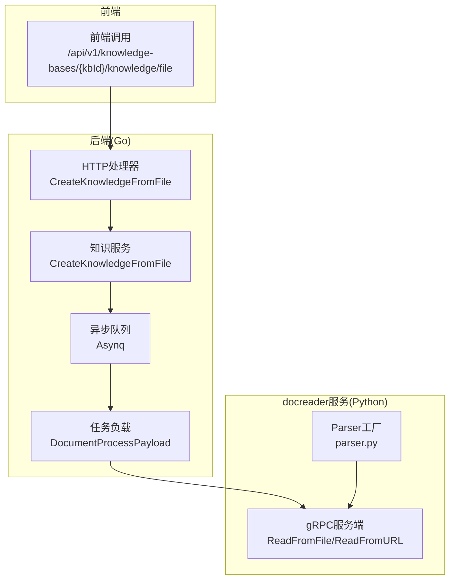
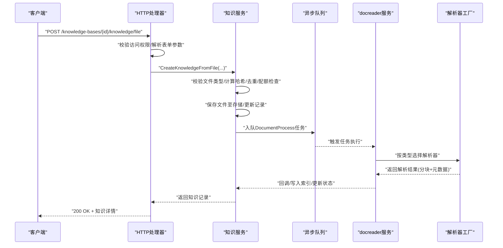
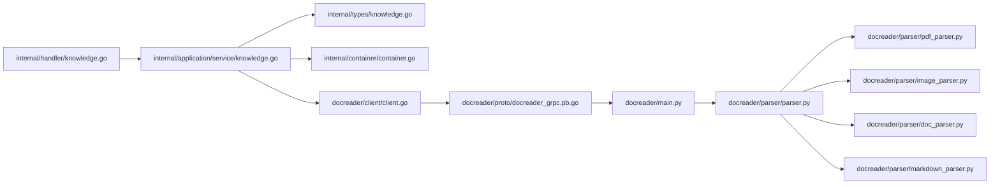

# 文件上传API

<cite>
**本文引用的文件**
- [docs/api/knowledge.md](file://docs/api/knowledge.md)
- [frontend/src/api/knowledge-base/index.ts](file://frontend/src/api/knowledge-base/index.ts)
- [internal/handler/knowledge.go](file://internal/handler/knowledge.go)
- [internal/application/service/knowledge.go](file://internal/application/service/knowledge.go)
- [internal/types/knowledge.go](file://internal/types/knowledge.go)
- [docreader/parser/parser.py](file://docreader/parser/parser.py)
- [docreader/parser/pdf_parser.py](file://docreader/parser/pdf_parser.py)
- [docreader/parser/image_parser.py](file://docreader/parser/image_parser.py)
- [docreader/parser/doc_parser.py](file://docreader/parser/doc_parser.py)
- [docreader/parser/markdown_parser.py](file://docreader/parser/markdown_parser.py)
- [docreader/client/client.go](file://docreader/client/client.go)
- [docreader/proto/docreader_grpc.pb.go](file://docreader/proto/docreader_grpc.pb.go)
- [docreader/proto/docreader.pb.go](file://docreader/proto/docreader.pb.go)
- [docreader/proto/docreader_pb2_grpc.py](file://docreader/proto/docreader_pb2_grpc.py)
- [docreader/main.py](file://docreader/main.py)
- [docreader/utils/tempfile.py](file://docreader/utils/tempfile.py)
- [docreader/parser/storage.py](file://docreader/parser/storage.py)
- [internal/container/container.go](file://internal/container/container.go)
</cite>

## 目录
1. [简介](#简介)
2. [项目结构](#项目结构)
3. [核心组件](#核心组件)
4. [架构总览](#架构总览)
5. [详细组件分析](#详细组件分析)
6. [依赖关系分析](#依赖关系分析)
7. [性能与容量考虑](#性能与容量考虑)
8. [故障排查指南](#故障排查指南)
9. [结论](#结论)

## 简介
本文档围绕“/knowledge-bases/:id/knowledge/file”文件上传API进行深入说明，覆盖表单参数、支持的文件类型与对应解析器、文件大小限制、临时文件处理机制、多模态处理选项（enable_multimodel）对OCR与图像理解的影响，并基于后端内部实现（internal/handler/knowledge.go 中的 CreateKnowledgeFromFile 方法）阐述文件预处理流程、唯一性校验（基于文件哈希）、状态管理（pending/processing/failed/completed）以及错误处理机制（重复文件、解析失败等）。同时记录与 docreader 服务的 gRPC 集成过程，包括任务提交、状态轮询与结果回调。

## 项目结构
该API位于后端Go服务中，前端通过表单上传文件，后端接收并校验参数，随后将任务投递到异步队列，由后台任务驱动docreader服务完成解析与分块，最终写回索引与状态。

图表来源
- [internal/handler/knowledge.go](file://internal/handler/knowledge.go#L85-L168)
- [internal/application/service/knowledge.go](file://internal/application/service/knowledge.go#L135-L346)
- [docreader/parser/parser.py](file://docreader/parser/parser.py#L26-L176)
- [docreader/main.py](file://docreader/main.py#L130-L162)
- [docreader/proto/docreader_grpc.pb.go](file://docreader/proto/docreader_grpc.pb.go#L102-L167)

章节来源
- [docs/api/knowledge.md](file://docs/api/knowledge.md#L20-L68)
- [frontend/src/api/knowledge-base/index.ts](file://frontend/src/api/knowledge-base/index.ts#L43-L45)

## 核心组件
- HTTP处理器：负责参数解析、权限校验、错误处理与响应。
- 知识服务：负责文件类型校验、去重（基于文件哈希）、存储配额检查、持久化、临时文件处理、任务入队。
- docreader解析器：根据文件类型选择解析器，执行解析、分块与多模态处理（OCR、图像理解）。
- gRPC客户端/服务端：后端通过gRPC调用docreader服务，传递解析配置与文件内容；docreader服务返回分块结果。

章节来源
- [internal/handler/knowledge.go](file://internal/handler/knowledge.go#L85-L168)
- [internal/application/service/knowledge.go](file://internal/application/service/knowledge.go#L135-L346)
- [docreader/parser/parser.py](file://docreader/parser/parser.py#L26-L176)
- [docreader/client/client.go](file://docreader/client/client.go#L1-L114)

## 架构总览
下图展示从文件上传到解析完成的端到端流程。

图表来源
- [internal/handler/knowledge.go](file://internal/handler/knowledge.go#L85-L168)
- [internal/application/service/knowledge.go](file://internal/application/service/knowledge.go#L135-L346)
- [docreader/main.py](file://docreader/main.py#L130-L162)
- [docreader/parser/parser.py](file://docreader/parser/parser.py#L26-L176)

## 详细组件分析

### 表单参数与用途
- file：必填，上传的文件对象。
- metadata：可选，JSON字符串形式的元数据，将被序列化后存入知识记录。
- enable_multimodel：可选，布尔值，控制是否启用多模态处理（OCR、图像理解）。
- fileName：可选，自定义文件名，用于文件夹上传时保留路径信息。

章节来源
- [docs/api/knowledge.md](file://docs/api/knowledge.md#L22-L36)
- [internal/handler/knowledge.go](file://internal/handler/knowledge.go#L97-L141)

### 支持的文件类型与解析器映射
- 文档类：PDF、DOC、DOCX、TXT、MD/Markdown
- 图片类：JPG/JPEG、PNG、GIF、BMP、TIFF、WEBP
- 电子表格类：CSV、XLS、XLSX
- 对应解析器：
  - PDF：PDFParser（链式责任链，优先MinerUParser，失败回退MarkitdownParser）
  - DOC/DOCX：DocParser/Docx2Parser（DOC可能转换为DOCX后复用Docx2Parser）
  - Markdown：MarkdownParser（管道式处理，含表格与图片处理）
  - 图片：ImageParser（上传至存储、生成描述、OCR、返回Markdown引用）
  - 文本/CSV/Excel：TextParser/CSVParser/ExcelParser

章节来源
- [docreader/parser/parser.py](file://docreader/parser/parser.py#L26-L49)
- [docreader/parser/pdf_parser.py](file://docreader/parser/pdf_parser.py#L1-L17)
- [docreader/parser/doc_parser.py](file://docreader/parser/doc_parser.py#L1-L62)
- [docreader/parser/image_parser.py](file://docreader/parser/image_parser.py#L1-L45)
- [internal/application/service/knowledge.go](file://internal/application/service/knowledge.go#L2110-L2118)

### 文件大小限制与临时文件处理
- 后端未显式设置上传大小限制，但存在以下约束：
  - 存储配额检查：当租户配额>0且已用空间>=配额时拒绝创建。
  - gRPC调用设置了最大消息大小（发送/接收均为50MB），超出可能导致调用失败。
- 临时文件处理：
  - doc解析器在需要时使用TempFileContext将字节内容写入临时文件，确保antiword/textract等外部工具可用。
  - 解析完成后自动清理临时文件。

章节来源
- [internal/application/service/knowledge.go](file://internal/application/service/knowledge.go#L226-L231)
- [docreader/client/client.go](file://docreader/client/client.go#L15-L21)
- [docreader/utils/tempfile.py](file://docreader/utils/tempfile.py#L8-L42)

### 多模态处理选项（enable_multimodel）
- 当文件为图片类型时，若启用多模态：
  - 需要完整的对象存储配置（COS/MinIO）与VLM模型配置，否则拒绝处理。
  - 解析器会上传图片至存储、生成描述、执行OCR，并将图片以Markdown形式嵌入结果。
- 对非图片文件，即使传入enable_multimodel也会跳过存储/VLM校验。

章节来源
- [internal/application/service/knowledge.go](file://internal/application/service/knowledge.go#L158-L186)
- [docreader/parser/image_parser.py](file://docreader/parser/image_parser.py#L12-L45)
- [docreader/parser/storage.py](file://docreader/parser/storage.py#L160-L195)

### 文件预处理流程与唯一性校验
- 步骤概览：
  1) 校验文件类型（仅允许白名单扩展名）。
  2) 计算文件MD5哈希，结合文件名、大小进行去重判断。
  3) 若重复，返回现有知识记录并标记重复错误。
  4) 校验存储配额。
  5) 保存文件至存储，更新知识记录。
  6) 组装任务负载，入队DocumentProcess任务。
- 唯一性校验：基于文件哈希、文件名、文件大小三要素组合判断。

章节来源
- [internal/application/service/knowledge.go](file://internal/application/service/knowledge.go#L188-L224)
- [internal/application/service/knowledge.go](file://internal/application/service/knowledge.go#L2148-L2167)
- [internal/handler/knowledge.go](file://internal/handler/knowledge.go#L142-L156)

### 状态管理与错误处理
- 状态常量：pending/processing/completed/failed/deleting。
- 错误处理：
  - 重复文件：返回冲突响应，携带现有知识记录。
  - 参数错误：返回400。
  - 存储配额超限：返回错误。
  - 解析失败：知识记录ParseStatus置为failed，错误信息写入。
  - 入队失败：仍返回知识记录，保证文件已保存。
- 前端交互：前端通过postUpload封装上传，支持进度回调。

章节来源
- [internal/types/knowledge.go](file://internal/types/knowledge.go#L19-L31)
- [internal/handler/knowledge.go](file://internal/handler/knowledge.go#L66-L83)
- [internal/handler/knowledge.go](file://internal/handler/knowledge.go#L142-L156)
- [internal/application/service/knowledge.go](file://internal/application/service/knowledge.go#L322-L346)
- [frontend/src/api/knowledge-base/index.ts](file://frontend/src/api/knowledge-base/index.ts#L43-L45)

### 与docreader服务的gRPC集成
- 后端通过gRPC客户端连接docreader服务，调用ReadFromFile或ReadFromURL。
- 请求体包含文件内容、文件名、解析配置（chunk大小/重叠/分隔符、enable_multimodal、存储配置、VLM配置等）。
- docreader服务端解析器根据文件类型选择具体解析器，返回分块结果；后端据此写入索引并更新状态。
- gRPC方法：ReadFromFile、ReadFromURL。

章节来源
- [docreader/client/client.go](file://docreader/client/client.go#L1-L114)
- [docreader/proto/docreader_grpc.pb.go](file://docreader/proto/docreader_grpc.pb.go#L102-L167)
- [docreader/proto/docreader.pb.go](file://docreader/proto/docreader.pb.go#L339-L395)
- [docreader/proto/docreader_pb2_grpc.py](file://docreader/proto/docreader_pb2_grpc.py#L69-L145)
- [docreader/main.py](file://docreader/main.py#L130-L162)
- [internal/application/service/knowledge.go](file://internal/application/service/knowledge.go#L4557-L4635)

## 依赖关系分析

图表来源
- [internal/handler/knowledge.go](file://internal/handler/knowledge.go#L85-L168)
- [internal/application/service/knowledge.go](file://internal/application/service/knowledge.go#L135-L346)
- [internal/types/knowledge.go](file://internal/types/knowledge.go#L54-L106)
- [internal/container/container.go](file://internal/container/container.go#L309-L356)
- [docreader/client/client.go](file://docreader/client/client.go#L1-L114)
- [docreader/proto/docreader_grpc.pb.go](file://docreader/proto/docreader_grpc.pb.go#L102-L167)
- [docreader/main.py](file://docreader/main.py#L130-L162)
- [docreader/parser/parser.py](file://docreader/parser/parser.py#L26-L176)
- [docreader/parser/pdf_parser.py](file://docreader/parser/pdf_parser.py#L1-L17)
- [docreader/parser/image_parser.py](file://docreader/parser/image_parser.py#L1-L45)
- [docreader/parser/doc_parser.py](file://docreader/parser/doc_parser.py#L1-L62)
- [docreader/parser/markdown_parser.py](file://docreader/parser/markdown_parser.py#L407-L440)

## 性能与容量考虑
- 并发与资源限制：
  - 解析器在构造时限制并发任务数与最大图片尺寸，避免资源耗尽。
  - gRPC调用设置最大消息大小，建议大文件拆分或优化存储策略。
- 存储与配额：
  - 后端在创建前检查租户配额，避免超出。
  - 多模态图片需对象存储与VLM配置，缺失将直接拒绝。
- 临时文件：
  - DOC解析器使用临时文件，注意磁盘空间与I/O开销。

章节来源
- [docreader/parser/parser.py](file://docreader/parser/parser.py#L100-L114)
- [docreader/client/client.go](file://docreader/client/client.go#L15-L21)
- [internal/application/service/knowledge.go](file://internal/application/service/knowledge.go#L226-L231)
- [docreader/parser/doc_parser.py](file://docreader/parser/doc_parser.py#L1-L62)

## 故障排查指南
- 400错误（参数/格式问题）
  - metadata格式不正确。
  - enable_multimodel格式不正确。
  - 文件类型不在白名单。
- 403错误（权限不足）
  - 知识库ID为空或租户不匹配。
- 409错误（重复文件）
  - 同名、同大小、同哈希的文件已存在。
- 413/500错误（存储/网络）
  - gRPC消息过大或docreader服务不可达。
  - 存储配额超限。
- 处理状态异常
  - ParseStatus为failed时，查看ErrorMessage字段定位原因。
  - 入队失败不会阻断文件保存，但后续解析不会触发。

章节来源
- [internal/handler/knowledge.go](file://internal/handler/knowledge.go#L97-L156)
- [internal/application/service/knowledge.go](file://internal/application/service/knowledge.go#L188-L224)
- [internal/application/service/knowledge.go](file://internal/application/service/knowledge.go#L322-L346)
- [internal/types/knowledge.go](file://internal/types/knowledge.go#L19-L31)

## 结论
/knowledge-bases/:id/knowledge/file端点提供了从文件创建知识的完整能力。后端通过严格的类型校验、哈希去重、配额检查与异步任务编排，确保可靠性与可扩展性。docreader服务通过gRPC提供统一解析接口，支持多种文件类型与多模态处理。建议在生产环境中：
- 明确对象存储与VLM配置，保障图片多模态能力。
- 控制文件大小与并发，避免资源瓶颈。
- 关注状态与错误信息，及时定位解析失败原因。