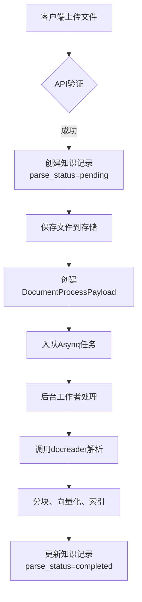
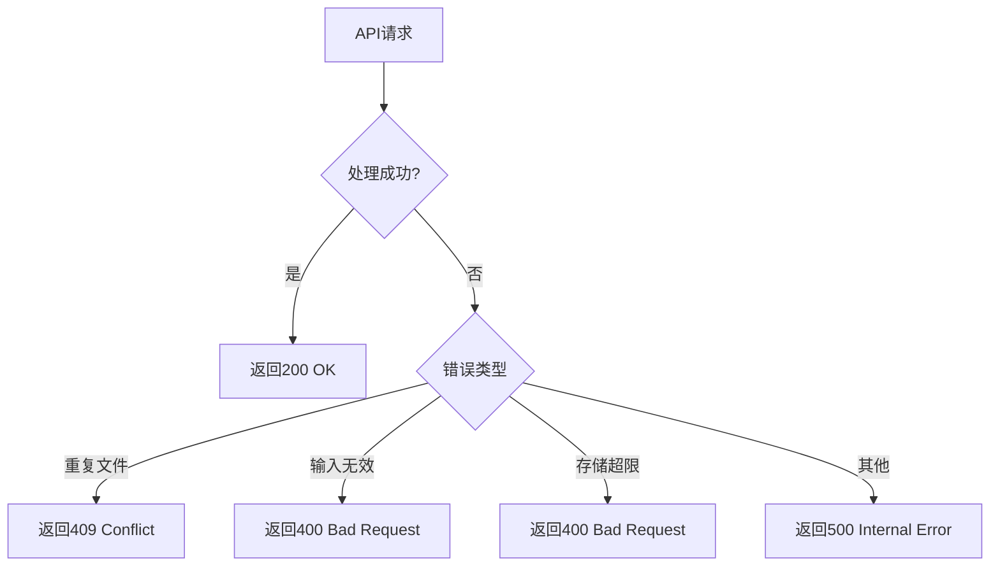
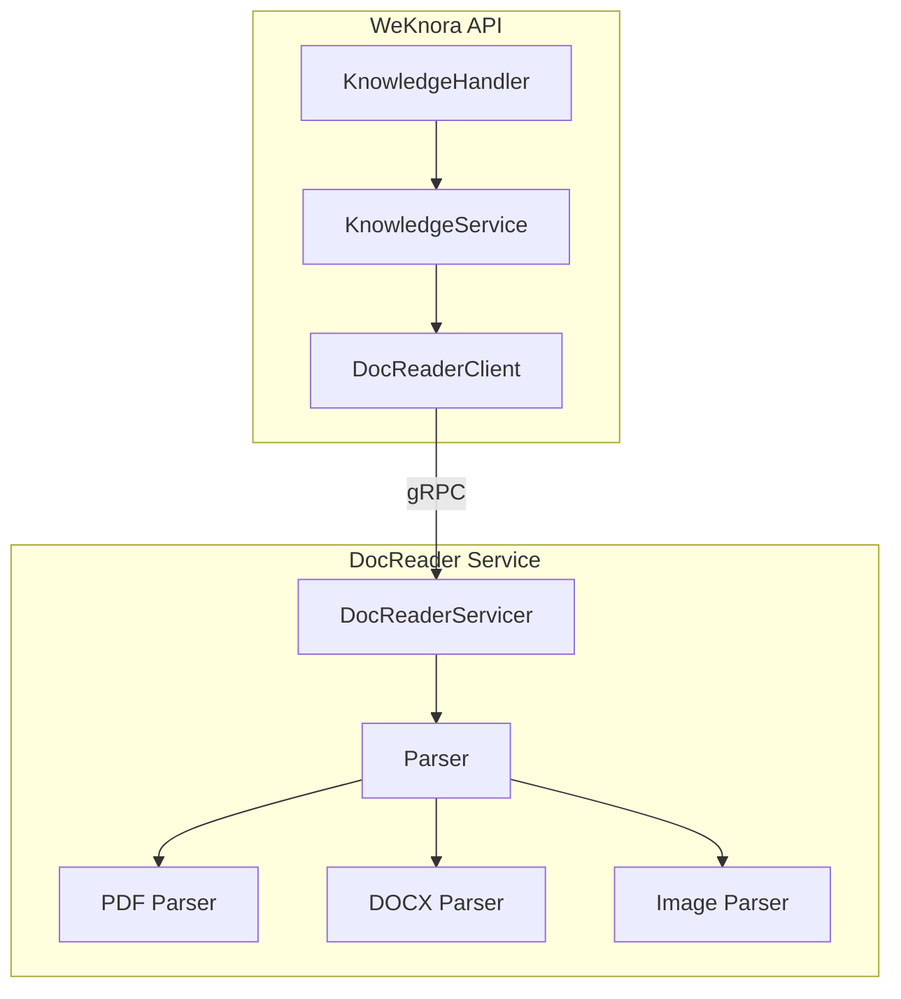

# 文档处理API

<cite>
**本文档引用的文件**   
- [knowledge.go](file://internal/handler/knowledge.go)
- [knowledge.go](file://internal/application/service/knowledge.go)
- [knowledge.go](file://internal/types/knowledge.go)
- [client.go](file://docreader/client/client.go)
- [main.py](file://docreader/main.py)
</cite>

## 目录
1. [简介](#简介)
2. [核心端点](#核心端点)
3. [文件上传参数](#文件上传参数)
4. [URL创建参数](#url创建参数)
5. [文件类型与大小限制](#文件类型与大小限制)
6. [文件预处理流程](#文件预处理流程)
7. [多模态处理](#多模态处理)
8. [错误处理机制](#错误处理机制)
9. [与docreader服务集成](#与docreader服务集成)
10. [状态查询与监控](#状态查询与监控)

## 简介
文档处理API是WeKnora系统的核心功能之一，负责将各种格式的文档和网页内容转化为可检索的知识。该API提供了两个主要端点：`/knowledge-bases/:id/knowledge/file`用于上传本地文件，`/knowledge-bases/:id/knowledge/url`用于从URL创建知识。API通过异步任务处理文档，支持多模态内容解析，并与docreader服务深度集成，实现高效的文档解析和知识提取。

## 核心端点
文档处理API提供两个核心端点来创建知识条目：

1.  **创建知识从文件** (`POST /api/v1/knowledge-bases/:id/knowledge/file`)
    该端点用于上传本地文件并创建知识条目。它接受一个multipart/form-data请求，包含文件本身和其他元数据。

2.  **创建知识从URL** (`POST /api/v1/knowledge-bases/:id/knowledge/url`)
    该端点用于从指定的URL创建知识条目。它接受一个JSON格式的请求体，包含目标URL和其他配置参数。

这两个端点都首先验证用户对指定知识库的访问权限，然后创建知识记录并将其处理任务加入异步队列。

**Section sources**
- [knowledge.go](file://internal/handler/knowledge.go#L86-L224)

## 文件上传参数
当调用`/knowledge-bases/:id/knowledge/file`端点时，需要在multipart/form-data请求中提供以下表单参数：

-   **file**: (必需) 要上传的文件。这是`multipart.FileHeader`类型，包含文件的二进制内容和原始文件名。
-   **metadata**: (可选) 一个JSON字符串，包含与文件关联的自定义元数据。例如，`{"author": "John Doe", "department": "Engineering"}`。该参数在服务端被解析为`map[string]string`。
-   **enable_multimodel**: (可选) 一个布尔值，用于显式启用或禁用多模态处理。如果未提供此参数，将使用知识库的默认配置。
-   **fileName**: (可选) 自定义文件名。当上传文件夹中的文件时，此参数可用于保留文件的路径信息。

**Section sources**
- [knowledge.go](file://internal/handler/knowledge.go#L98-L140)
- [knowledge.go](file://internal/application/service/knowledge.go#L136-L149)

## URL创建参数
当调用`/knowledge-bases/:id/knowledge/url`端点时，需要在JSON请求体中提供以下参数：

-   **url**: (必需) 要抓取和解析的网页URL。该URL会经过格式和安全性验证。
-   **enable_multimodel**: (可选) 一个布尔值，用于显式启用或禁用多模态处理。如果未提供此参数，将使用知识库的默认配置。
-   **title**: (可选) 为创建的知识条目指定的标题。如果未提供，系统将使用URL作为标题。

**Section sources**
- [knowledge.go](file://internal/handler/knowledge.go#L183-L186)
- [knowledge.go](file://internal/application/service/knowledge.go#L349-L351)

## 文件类型与大小限制
系统支持多种文件格式，并对上传文件实施了安全和存储限制。

### 支持的文件类型
系统支持以下文件类型：
-   **文本与文档**: PDF, DOCX, DOC, TXT, Markdown (.md)
-   **电子表格**: Excel (.xlsx, .xls), CSV
-   **网页**: HTML
-   **图片**: JPG, JPEG, PNG, GIF, BMP, WebP (需启用多模态处理)

文件类型在服务端通过`isValidFileType`函数进行验证。前端也实现了类似的过滤逻辑，例如，在未启用VLM（视觉语言模型）时，会自动过滤掉图片文件。

### 大小与存储限制
-   **文件哈希校验**: 系统通过计算文件的MD5哈希值来检测重复文件。如果发现内容完全相同的文件，API将返回一个`409 Conflict`错误，并返回已存在的知识条目。
-   **存储配额**: 用户的上传行为受其租户（tenant）的存储配额限制。在创建知识条目前，系统会检查当前存储使用量是否超过配额。如果超出，将返回`400 Bad Request`错误。

**Section sources**
- [knowledge.go](file://internal/application/service/knowledge.go#L189-L192)
- [knowledge.go](file://internal/application/service/knowledge.go#L196-L201)
- [knowledge.go](file://internal/application/service/knowledge.go#L226-L231)

## 文件预处理流程
文件的预处理是一个异步过程，确保了API的快速响应和系统的可扩展性。其核心流程如下：

1.  **接收与验证**: API接收到文件后，首先进行访问权限、文件类型和存储配额的验证。
2.  **创建知识记录**: 在数据库中创建一条新的知识记录，其`parse_status`初始为`pending`。
3.  **保存文件**: 将上传的文件物理保存到配置的存储后端（如MinIO、COS或本地文件系统）。
4.  **入队处理任务**: 将一个包含知识ID、文件路径等信息的`DocumentProcessPayload`任务加入Asynq任务队列。
5.  **异步处理**: 一个后台工作者（worker）从队列中取出任务，调用docreader服务进行文档解析，并将结果分块、向量化和索引。

**Diagram sources **
- [knowledge.go](file://internal/application/service/knowledge.go#L136-L346)

**Section sources**
- [knowledge.go](file://internal/application/service/knowledge.go#L136-L346)

## 多模态处理
多模态处理允许系统从文档中提取图像、OCR文本和图片描述（caption），极大地丰富了知识内容。

-   **启用条件**: 对于图片文件，必须在知识库配置中启用VLM（视觉语言模型）并指定一个有效的模型ID。否则，上传将失败。
-   **配置验证**: 在处理图片文件时，系统会检查知识库的`VLMConfig`和`StorageConfig`是否完整。对于COS或MinIO存储，需要相应的密钥和桶名。
-   **处理流程**: 当`enable_multimodel`为`true`时，docreader服务会调用OCR引擎和VLM模型来分析图片内容，并将结果作为额外的文本块（chunk）存储。

**Section sources**
- [knowledge.go](file://internal/application/service/knowledge.go#L158-L183)

## 错误处理机制
API实现了全面的错误处理机制，以确保系统的健壮性和用户体验。

-   **文件哈希冲突**: 当上传的文件与现有知识条目具有相同的哈希值时，系统会抛出`DuplicateFileError`。API处理器`handleDuplicateKnowledgeError`会捕获此错误，并返回`409 Conflict`状态码，同时在响应中包含已存在的知识条目信息。
-   **输入验证错误**: 对于无效的文件类型、URL格式或元数据，API会返回`400 Bad Request`错误。
-   **存储配额超限**: 如果用户的存储空间不足，API会返回`400 Bad Request`错误。
-   **内部服务器错误**: 对于未预期的错误，API会返回`500 Internal Server Error`。

**Diagram sources **
- [knowledge.go](file://internal/handler/knowledge.go#L68-L82)

**Section sources**
- [knowledge.go](file://internal/handler/knowledge.go#L68-L82)
- [knowledge.go](file://internal/handler/knowledge.go#L145-L155)

## 与docreader服务集成
文档处理API与`docreader`服务紧密集成，后者是一个独立的gRPC服务，专门负责文档的解析。

-   **服务调用**: `knowledgeService`通过`docReaderClient`（一个gRPC客户端）与`docreader`服务通信。
-   **解析流程**: `docreader`服务接收文件内容和配置，使用相应的解析器（如`pdf_parser.py`, `docx_parser.py`）提取文本和元数据，并根据配置进行分块。
-   **gRPC接口**: `docreader`暴露了`ReadFromFile`和`ReadFromURL`等gRPC方法，API服务通过这些方法发起解析请求。

**Diagram sources **
- [client.go](file://docreader/client/client.go)
- [main.py](file://docreader/main.py)

**Section sources**
- [knowledge.go](file://internal/application/service/knowledge.go#L61)
- [main.py](file://docreader/main.py#L130-L162)

## 状态查询与监控
知识条目的处理状态可以通过其`parse_status`字段进行监控。

-   **状态枚举**: 系统定义了多种状态，包括：
    -   `pending`: 知识条目已创建，等待处理。
    -   `processing`: 正在解析和处理文档。
    -   `completed`: 处理成功完成。
    -   `failed`: 处理过程中发生错误。
    -   `deleting`: 知识条目正在被删除。
-   **查询方式**: 用户可以通过`GET /api/v1/knowledge-bases/:id/knowledge/:id`端点来获取特定知识条目的详细信息，其中就包含了`parse_status`字段。通过轮询此端点，可以监控文档处理的进度。

**Section sources**
- [knowledge.go](file://internal/types/knowledge.go#L20-L31)
- [knowledge.go](file://internal/handler/knowledge.go#L265-L297)