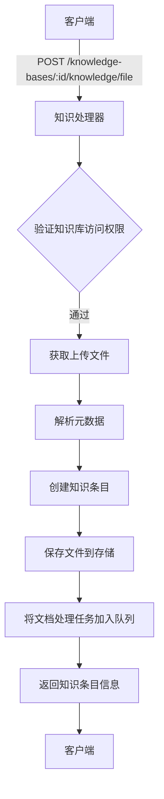
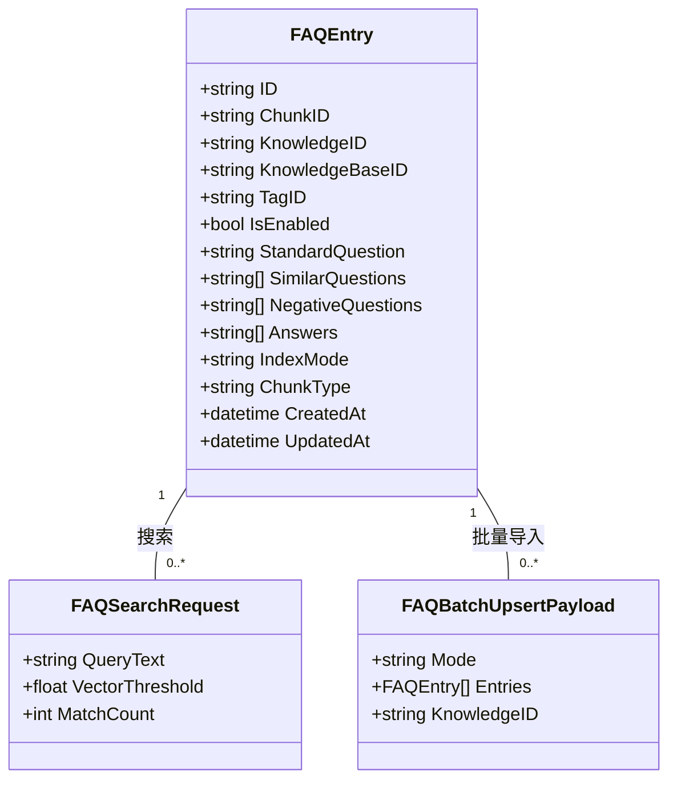
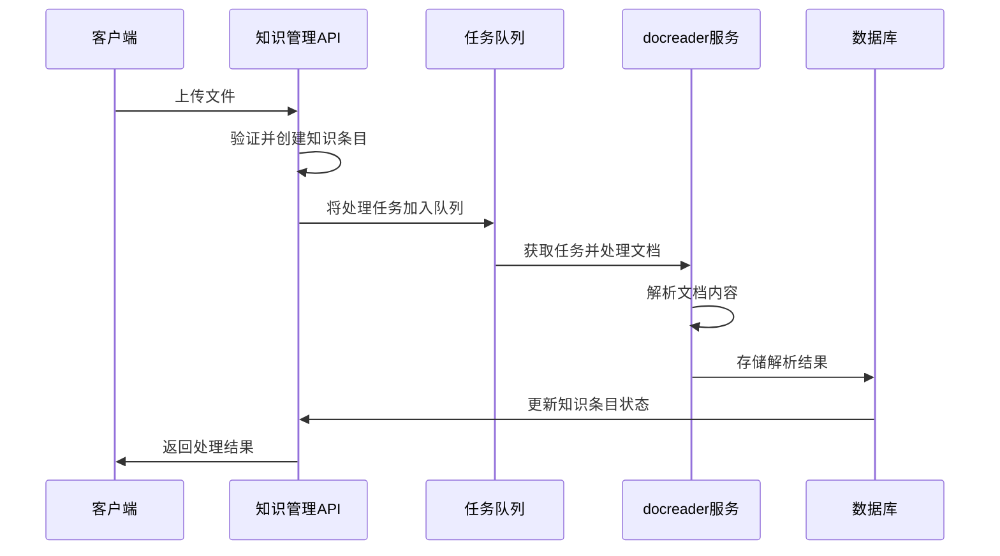

# 知识管理API

<cite>
**本文档引用的文件**   
- [knowledge.go](file://internal/handler/knowledge.go)
- [knowledge.md](file://docs/api/knowledge.md)
- [faq.md](file://docs/api/faq.md)
- [knowledge.go](file://client/knowledge.go)
- [knowledge.go](file://internal/application/service/knowledge.go)
- [interfaces.go](file://internal/types/interfaces/knowledge.go)
- [faq.go](file://internal/handler/faq.go)
- [docreader.md](file://docreader/CLAUDE.md)
</cite>

## 目录
1. [简介](#简介)
2. [文档上传与解析](#文档上传与解析)
3. [FAQ管理](#faq管理)
4. [文件预处理与错误处理](#文件预处理与错误处理)
5. [与docreader服务的集成](#与docreader服务的集成)

## 简介
知识管理API是WeKnora系统的核心组件，负责文档的上传、解析、状态查询和FAQ管理。该API提供了丰富的端点来管理知识库中的内容，支持多种文件格式的上传和处理。系统通过异步任务队列处理文档解析，确保高效和可扩展性。API设计遵循REST原则，提供清晰的请求响应模式，便于集成和使用。

**Section sources**
- [knowledge.md](file://docs/api/knowledge.md#L1-L314)
- [faq.md](file://docs/api/faq.md#L1-L311)

## 文档上传与解析
知识管理API支持通过`/knowledge-bases/:id/knowledge/file`端点上传文件。该端点接受multipart/form-data格式的请求，包含文件、元数据、多模态处理标志和自定义文件名等参数。上传的文件类型包括PDF、DOCX、图片等多种格式，系统会根据文件类型选择相应的解析器进行处理。

**Diagram sources**
- [knowledge.go](file://internal/handler/knowledge.go#L85-L167)

### 支持的文件类型与大小限制
系统支持多种文件格式的解析，包括文档、电子表格、演示文稿、PDF和图像等。每种文件类型都有相应的解析器负责内容提取和结构化处理。

| 文件类型 | 支持格式 | 备注 |
|---------|--------|------|
| 文档 | DOC, DOCX, TXT, MD | 支持文本和格式提取 |
| 电子表格 | CSV, XLS, XLSX | 支持表格数据解析 |
| 演示文稿 | PPT, PPTX | 支持幻灯片内容提取 |
| PDF | PDF | 支持文本、表格和图像提取 |
| 图像 | JPG, JPEG, PNG, GIF, BMP, TIFF, WebP | 需启用多模态处理 |

文件大小限制由系统配置决定，上传时会检查租户的存储配额。当存储配额达到上限时，系统会拒绝新的文件上传请求。

**Section sources**
- [docreader.md](file://docreader/CLAUDE.md#L17-L40)
- [knowledge.go](file://internal/application/service/knowledge.go#L189-L193)

## FAQ管理
知识管理API提供了完整的FAQ管理功能，包括FAQ条目的创建、更新、删除和搜索。通过`/knowledge-bases/:id/faq`系列端点，用户可以构建和维护FAQ知识库。

### FAQ相关端点操作
FAQ管理API提供了多个端点来操作FAQ条目：

- `GET /knowledge-bases/:id/faq/entries`：获取FAQ条目列表，支持分页、标签过滤和关键字搜索
- `POST /knowledge-bases/:id/faq/entries`：批量导入FAQ条目，支持追加或替换模式
- `POST /knowledge-bases/:id/faq/entry`：创建单个FAQ条目，同步返回结果
- `PUT /knowledge-bases/:id/faq/entries/:entry_id`：更新单个FAQ条目
- `PUT /knowledge-bases/:id/faq/entries/status`：批量更新FAQ条目的启用状态
- `PUT /knowledge-bases/:id/faq/entries/tags`：批量更新FAQ条目的标签
- `DELETE /knowledge-bases/:id/faq/entries`：批量删除FAQ条目
- `POST /knowledge-bases/:id/faq/search`：混合搜索FAQ条目，结合向量相似度和关键词匹配

**Diagram sources**
- [faq.go](file://internal/handler/faq.go#L25-L227)
- [interfaces.go](file://internal/types/interfaces/knowledge.go#L75-L97)

## 文件预处理与错误处理
文件预处理流程包括文件类型验证、哈希计算、重复性检查、存储配额验证和任务队列入队等步骤。系统在处理文件时会进行严格的安全检查，防止恶意文件上传。

### 错误处理机制
系统实现了完善的错误处理机制，针对不同类型的错误返回相应的HTTP状态码和错误信息：

- `400 Bad Request`：请求参数不合法，如缺少必填字段、格式错误等
- `401 Unauthorized`：认证失败，API密钥无效或缺失
- `403 Forbidden`：权限不足，无法访问指定资源
- `404 Not Found`：请求的资源不存在
- `409 Conflict`：资源冲突，如文件已存在
- `500 Internal Server Error`：服务器内部错误

对于OCR失败等特定错误，系统会在知识条目的`error_message`字段中记录详细的错误信息，并将`parse_status`设置为`failed`。

**Section sources**
- [knowledge.go](file://internal/application/service/knowledge.go#L136-L346)
- [knowledge.go](file://internal/handler/knowledge.go#L143-L155)

## 与docreader服务的集成
知识管理API通过gRPC协议与docreader服务集成，实现文档的解析和内容提取。docreader服务是一个独立的微服务，支持多种文档格式的解析，包括PDF、DOCX、图像等。

### 任务队列与状态同步
系统使用Asynq作为任务队列，将文档处理任务异步执行。当文件上传后，系统会创建一个`DocumentProcessPayload`并将其加入队列。任务处理器从队列中获取任务，调用docreader服务进行文档解析，然后将解析结果存储到数据库并更新知识条目的状态。

状态同步通过知识条目的`parse_status`字段实现，其可能的值包括：
- `pending`：等待处理
- `processing`：正在处理
- `completed`：处理完成
- `failed`：处理失败
- `deleting`：正在删除

**Diagram sources**
- [knowledge.go](file://internal/application/service/knowledge.go#L291-L343)
- [docreader.md](file://docreader/CLAUDE.md#L135-L142)