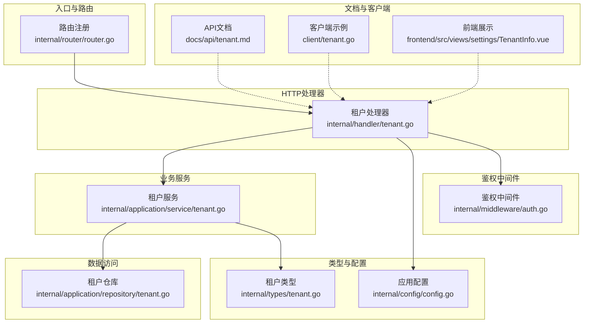
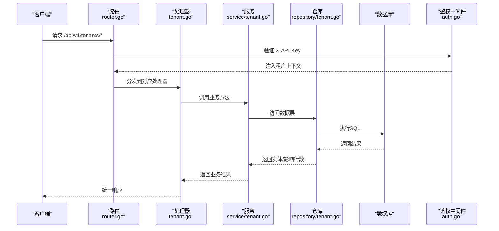
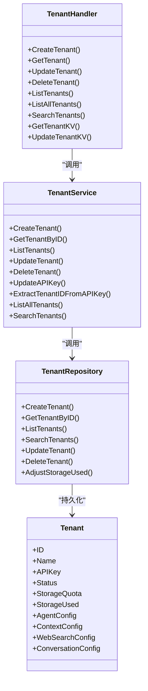

# 租户管理API

<cite>
**本文引用的文件**
- [internal/handler/tenant.go](file://internal/handler/tenant.go)
- [internal/application/service/tenant.go](file://internal/application/service/tenant.go)
- [internal/application/repository/tenant.go](file://internal/application/repository/tenant.go)
- [internal/types/tenant.go](file://internal/types/tenant.go)
- [internal/types/interfaces/tenant.go](file://internal/types/interfaces/tenant.go)
- [internal/router/router.go](file://internal/router/router.go)
- [internal/config/config.go](file://internal/config/config.go)
- [internal/middleware/auth.go](file://internal/middleware/auth.go)
- [docs/api/tenant.md](file://docs/api/tenant.md)
- [client/tenant.go](file://client/tenant.go)
- [frontend/src/views/settings/TenantInfo.vue](file://frontend/src/views/settings/TenantInfo.vue)
- [migrations/versioned/000001_agent.up.sql](file://migrations/versioned/000001_agent.up.sql)
</cite>

## 目录
1. [简介](#简介)
2. [项目结构](#项目结构)
3. [核心组件](#核心组件)
4. [架构总览](#架构总览)
5. [详细组件分析](#详细组件分析)
6. [依赖分析](#依赖分析)
7. [性能考虑](#性能考虑)
8. [故障排查指南](#故障排查指南)
9. [结论](#结论)
10. [附录：企业级部署使用示例](#附录企业级部署使用示例)

## 简介
本文件面向多租户场景下的资源隔离与配额管理，系统性梳理 /tenants 端点的创建、更新、删除与查询能力，并深入解析租户级别的配置继承机制（代理配置、对话配置、网络搜索配置）。文档以 internal/handler/tenant.go 的实现为依据，结合 service 层的初始化流程与资源配额校验逻辑，帮助读者快速理解租户生命周期、权限控制与企业级部署实践。

## 项目结构
- 路由注册位于 internal/router/router.go，/tenants 相关路由统一挂载在 /api/v1/tenants 下，包含基础 CRUD、KV 配置读写、跨租户访问受限的列表与搜索。
- 处理器位于 internal/handler/tenant.go，负责参数解析、鉴权上下文注入、调用 service 并返回标准响应。
- 业务服务位于 internal/application/service/tenant.go，封装租户创建、更新、删除、API Key 生成与提取、搜索等核心逻辑。
- 数据访问层位于 internal/application/repository/tenant.go，提供租户持久化、搜索与存储用量调整。
- 类型定义位于 internal/types/tenant.go，包含 Tenant 结构及 ConversationConfig、AgentConfig 等字段。
- 权限与租户上下文注入位于 internal/middleware/auth.go，基于 X-API-Key 提取租户信息并写入上下文。
- 文档与客户端示例位于 docs/api/tenant.md 与 client/tenant.go，前端展示位于 frontend/src/views/settings/TenantInfo.vue。
- 数据库迁移脚本包含 tenants 表新增 agent_config、context_config、conversation_config 字段。

图表来源
- [internal/router/router.go](file://internal/router/router.go#L260-L280)
- [internal/handler/tenant.go](file://internal/handler/tenant.go#L1-L120)
- [internal/application/service/tenant.go](file://internal/application/service/tenant.go#L1-L120)
- [internal/application/repository/tenant.go](file://internal/application/repository/tenant.go#L1-L60)
- [internal/types/tenant.go](file://internal/types/tenant.go#L1-L60)
- [internal/config/config.go](file://internal/config/config.go#L102-L110)
- [internal/middleware/auth.go](file://internal/middleware/auth.go#L161-L196)
- [docs/api/tenant.md](file://docs/api/tenant.md#L1-L70)
- [client/tenant.go](file://client/tenant.go#L64-L140)
- [frontend/src/views/settings/TenantInfo.vue](file://frontend/src/views/settings/TenantInfo.vue#L1-L84)

章节来源
- [internal/router/router.go](file://internal/router/router.go#L260-L280)
- [internal/handler/tenant.go](file://internal/handler/tenant.go#L1-L120)
- [internal/application/service/tenant.go](file://internal/application/service/tenant.go#L1-L120)
- [internal/application/repository/tenant.go](file://internal/application/repository/tenant.go#L1-L60)
- [internal/types/tenant.go](file://internal/types/tenant.go#L1-L60)
- [internal/config/config.go](file://internal/config/config.go#L102-L110)
- [internal/middleware/auth.go](file://internal/middleware/auth.go#L161-L196)
- [docs/api/tenant.md](file://docs/api/tenant.md#L1-L70)
- [client/tenant.go](file://client/tenant.go#L64-L140)
- [frontend/src/views/settings/TenantInfo.vue](file://frontend/src/views/settings/TenantInfo.vue#L1-L84)

## 核心组件
- 路由与端点
  - /api/v1/tenants: POST/GET/PUT/DELETE/GET(/)
  - /api/v1/tenants/all: GET（需跨租户权限）
  - /api/v1/tenants/search: GET（需跨租户权限，支持 keyword、tenant_id、page、page_size）
  - /api/v1/tenants/kv/:key: GET/PUT（tenant-level KV配置，tenant ID来自鉴权上下文）
- 处理器职责
  - 参数绑定与校验、错误处理、调用服务层、返回统一结构
  - 跨租户访问受配置与用户权限双重限制
- 服务层职责
  - 租户创建：初始化状态、生成临时 API Key，入库后生成正式 API Key
  - 租户更新：空 API Key 自动补发；更新时间戳
  - 租户删除：存在性检查与日志记录
  - API Key 生成与解密：AES-GCM 加密，前缀 sk-
  - 搜索与列表：分页、过滤、总数统计
- 仓库层职责
  - 基础 CRUD、搜索、存储用量调整（事务+悲观锁）
- 类型与配置
  - Tenant：包含存储配额、已用空间、代理/对话/网络搜索配置
  - 配置项 EnableCrossTenantAccess 控制跨租户访问开关
- 鉴权与上下文
  - X-API-Key 解析为租户ID与租户对象，写入上下文供处理器使用

章节来源
- [internal/router/router.go](file://internal/router/router.go#L260-L280)
- [internal/handler/tenant.go](file://internal/handler/tenant.go#L43-L210)
- [internal/application/service/tenant.go](file://internal/application/service/tenant.go#L43-L177)
- [internal/application/repository/tenant.go](file://internal/application/repository/tenant.go#L94-L122)
- [internal/types/tenant.go](file://internal/types/tenant.go#L1-L60)
- [internal/config/config.go](file://internal/config/config.go#L102-L110)
- [internal/middleware/auth.go](file://internal/middleware/auth.go#L161-L196)

## 架构总览
下图展示了从路由到处理器、服务、仓库与数据库的完整调用链路，以及鉴权中间件如何注入租户上下文。

图表来源
- [internal/router/router.go](file://internal/router/router.go#L260-L280)
- [internal/handler/tenant.go](file://internal/handler/tenant.go#L43-L120)
- [internal/application/service/tenant.go](file://internal/application/service/tenant.go#L43-L120)
- [internal/application/repository/tenant.go](file://internal/application/repository/tenant.go#L29-L60)
- [internal/middleware/auth.go](file://internal/middleware/auth.go#L161-L196)

## 详细组件分析

### 路由与端点
- 基础端点
  - POST /api/v1/tenants：创建租户
  - GET /api/v1/tenants/:id：按ID获取租户
  - PUT /api/v1/tenants/:id：更新租户
  - DELETE /api/v1/tenants/:id：删除租户
  - GET /api/v1/tenants：获取租户列表
- 跨租户端点
  - GET /api/v1/tenants/all：列出所有租户（需启用跨租户访问且用户具备权限）
  - GET /api/v1/tenants/search：搜索租户（keyword、tenant_id、page、page_size）
- KV配置端点
  - GET /api/v1/tenants/kv/:key：读取租户级配置（agent-config、web-search-config、conversation-config）
  - PUT /api/v1/tenants/kv/:key：更新租户级配置

章节来源
- [internal/router/router.go](file://internal/router/router.go#L260-L280)
- [docs/api/tenant.md](file://docs/api/tenant.md#L1-L70)

### 处理器：租户管理与配置KV
- CreateTenant
  - 绑定请求体为 Tenant，失败返回参数校验错误
  - 调用服务层创建租户，返回 201 成功响应
- GetTenant
  - 解析ID并校验，调用服务层获取租户
- UpdateTenant
  - 解析ID与请求体，设置ID后调用服务层更新
- DeleteTenant
  - 解析ID并调用服务层删除
- ListTenants
  - 列出当前租户上下文可见的所有租户
- ListAllTenants / SearchTenants
  - 受配置 EnableCrossTenantAccess 与用户 CanAccessAllTenants 双重限制
  - 支持分页与关键词过滤
- KV配置读取/更新
  - GET /tenants/kv/:key：根据 key 返回 agent-config、web-search-config、conversation-config
  - PUT /tenants/kv/:key：更新对应配置，内部进行参数范围校验

章节来源
- [internal/handler/tenant.go](file://internal/handler/tenant.go#L43-L210)
- [internal/handler/tenant.go](file://internal/handler/tenant.go#L240-L371)
- [internal/handler/tenant.go](file://internal/handler/tenant.go#L531-L621)
- [internal/handler/tenant.go](file://internal/handler/tenant.go#L623-L800)

### 服务层：租户初始化与资源配额
- CreateTenant
  - 校验租户名称非空
  - 初始化状态为 active，设置创建/更新时间
  - 先入库（临时 API Key），再生成正式 API Key 并更新
- UpdateTenant
  - 校验ID非0
  - 若 API Key 为空则生成新 Key
  - 更新时间戳并持久化
- DeleteTenant
  - 校验ID非0
  - 存在性检查与日志记录
- API Key 生成与提取
  - 生成：AES-GCM 加密租户ID，拼接前缀 sk-
  - 提取：校验格式、解码、解密还原租户ID
- 搜索与列表
  - SearchTenants：支持 keyword、tenant_id、page、page_size
  - ListAllTenants：返回全部租户（跨租户访问）
- 资源配额与并发安全
  - AdjustStorageUsed：事务内悲观锁更新存储用量，避免负值

章节来源
- [internal/application/service/tenant.go](file://internal/application/service/tenant.go#L43-L177)
- [internal/application/service/tenant.go](file://internal/application/service/tenant.go#L210-L282)
- [internal/application/repository/tenant.go](file://internal/application/repository/tenant.go#L104-L122)

### 数据模型与配置继承
- Tenant
  - 字段包含存储配额与已用空间、代理配置、对话配置、网络搜索配置等
  - ConversationConfig：包含提示词、温度、最大令牌、检索阈值、重排参数、回退策略等
- KV配置继承
  - GET /tenants/kv/agent-config：若租户未设置，则返回默认值（来自全局配置与默认值）
  - GET /tenants/kv/conversation-config：若租户未设置，则合并默认配置，保证字段完整性
  - GET /tenants/kv/web-search-config：返回租户的网络搜索配置（如最大结果数等）

章节来源
- [internal/types/tenant.go](file://internal/types/tenant.go#L1-L60)
- [internal/types/tenant.go](file://internal/types/tenant.go#L77-L133)
- [internal/handler/tenant.go](file://internal/handler/tenant.go#L623-L800)
- [migrations/versioned/000001_agent.up.sql](file://migrations/versioned/000001_agent.up.sql#L100-L140)

### 权限控制与租户上下文
- 鉴权中间件
  - 从 Authorization/X-API-Key 提取租户ID与租户对象
  - 校验数据库中 API Key 一致性
  - 将租户ID与租户对象写入上下文
- 跨租户访问
  - 通过配置 EnableCrossTenantAccess 与用户 CanAccessAllTenants 控制
  - ListAllTenants/SearchTenants 在未开启或无权限时拒绝

章节来源
- [internal/middleware/auth.go](file://internal/middleware/auth.go#L161-L196)
- [internal/config/config.go](file://internal/config/config.go#L102-L110)
- [internal/handler/tenant.go](file://internal/handler/tenant.go#L240-L371)

### 客户端与前端集成
- 客户端
  - 提供 CreateTenant/GetTenant/UpdateTenant/DeleteTenant/ListTenants 方法
- 前端
  - 展示租户基本信息、存储配额与使用率

章节来源
- [client/tenant.go](file://client/tenant.go#L64-L140)
- [frontend/src/views/settings/TenantInfo.vue](file://frontend/src/views/settings/TenantInfo.vue#L1-L84)

## 依赖分析
- 处理器依赖
  - TenantHandler 依赖 TenantService、UserService、Config
  - KV配置读写依赖 AgentConfig、WebSearchConfig、ConversationConfig
- 服务层依赖
  - TenantService 依赖 TenantRepository
  - API Key 生成依赖环境变量 TENANT_AES_KEY
- 仓库层依赖
  - GORM 操作 tenants 表，提供 CRUD、搜索与存储用量调整
- 类型与配置
  - Tenant 包含 JSON/JSONB 字段，迁移脚本确保列存在并注释完整

图表来源
- [internal/handler/tenant.go](file://internal/handler/tenant.go#L1-L120)
- [internal/application/service/tenant.go](file://internal/application/service/tenant.go#L1-L120)
- [internal/application/repository/tenant.go](file://internal/application/repository/tenant.go#L1-L60)
- [internal/types/tenant.go](file://internal/types/tenant.go#L1-L60)

章节来源
- [internal/types/interfaces/tenant.go](file://internal/types/interfaces/tenant.go#L9-L31)
- [internal/application/service/tenant.go](file://internal/application/service/tenant.go#L1-L120)
- [internal/application/repository/tenant.go](file://internal/application/repository/tenant.go#L1-L60)
- [internal/types/tenant.go](file://internal/types/tenant.go#L1-L60)

## 性能考虑
- 路由与中间件
  - 跨租户访问仅在必要端点启用，减少不必要的权限检查开销
- 服务层
  - API Key 生成采用对称加密，建议在高并发下关注密钥材料的安全存储与缓存
- 仓库层
  - AdjustStorageUsed 使用悲观锁，避免并发更新导致的负值与竞态
- 建议
  - 对搜索端点增加索引优化（name、description LIKE）与分页上限
  - 对 KV 配置读取使用缓存（如租户配置变更频率较低）

[本节为通用指导，无需特定文件来源]

## 故障排查指南
- 常见错误与定位
  - 参数校验失败：请求体绑定错误，返回参数校验错误
  - 未授权/无效 API Key：鉴权中间件校验失败
  - 跨租户访问被禁用或权限不足：ListAllTenants/SearchTenants 返回禁止访问
  - 记录不存在：GetTenantByID 返回未找到
  - API Key 生成异常：检查 TENANT_AES_KEY 环境变量
- 日志与追踪
  - 处理器与服务层均输出结构化日志，便于定位问题
- 建议排查步骤
  - 确认 X-API-Key 是否正确且未过期
  - 检查 EnableCrossTenantAccess 与用户 CanAccessAllTenants 配置
  - 核对 TenantService 的 API Key 生成与提取逻辑是否正常
  - 检查数据库连接与迁移脚本是否完成

章节来源
- [internal/handler/tenant.go](file://internal/handler/tenant.go#L43-L120)
- [internal/handler/tenant.go](file://internal/handler/tenant.go#L240-L371)
- [internal/application/service/tenant.go](file://internal/application/service/tenant.go#L210-L282)
- [internal/application/repository/tenant.go](file://internal/application/repository/tenant.go#L1-L20)

## 结论
本租户管理API围绕多租户资源隔离与配额管理构建，通过严格的鉴权上下文注入、跨租户访问控制、KV配置继承机制与事务化的存储用量调整，实现了企业级部署所需的可审计、可扩展与可维护能力。配合统一的响应结构与完善的端点覆盖，开发者可快速集成并落地生产环境。

[本节为总结性内容，无需特定文件来源]

## 附录：企业级部署使用示例
- 创建租户
  - 使用客户端或 curl 调用 POST /api/v1/tenants，携带租户名称、描述、业务信息与检索引擎配置
  - 返回包含正式 API Key 的租户对象
- 获取租户信息
  - 使用 X-API-Key 访问 GET /api/v1/tenants/:id
- 更新租户
  - PUT /api/v1/tenants/:id，若未提供 API Key 将自动生成新 Key
- 删除租户
  - DELETE /api/v1/tenants/:id
- 列出租户
  - GET /api/v1/tenants
- 跨租户访问
  - 在配置中启用 EnableCrossTenantAccess，并授予用户 CanAccessAllTenants 权限后，方可访问 /tenants/all 与 /tenants/search
- KV配置管理
  - GET /tenants/kv/agent-config：读取代理配置（默认值来自全局配置）
  - PUT /tenants/kv/agent-config：更新代理配置（含参数范围校验）
  - GET /tenants/kv/conversation-config：读取对话配置（默认值来自全局配置）
  - PUT /tenants/kv/web-search-config：更新网络搜索配置（含 max_results 范围校验）

章节来源
- [docs/api/tenant.md](file://docs/api/tenant.md#L1-L244)
- [client/tenant.go](file://client/tenant.go#L64-L140)
- [internal/handler/tenant.go](file://internal/handler/tenant.go#L531-L800)
- [internal/config/config.go](file://internal/config/config.go#L102-L110)