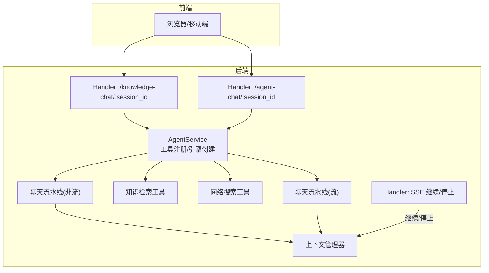
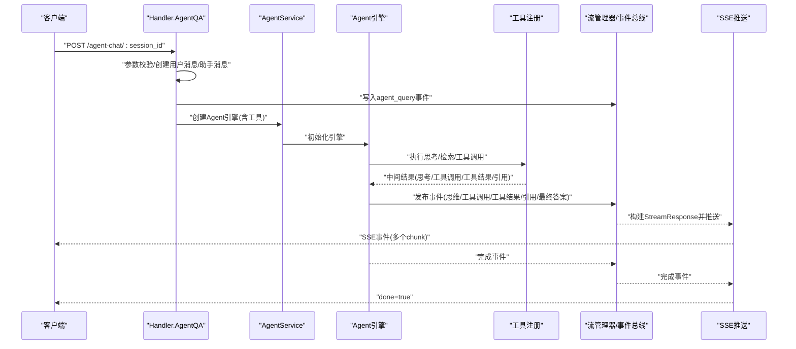
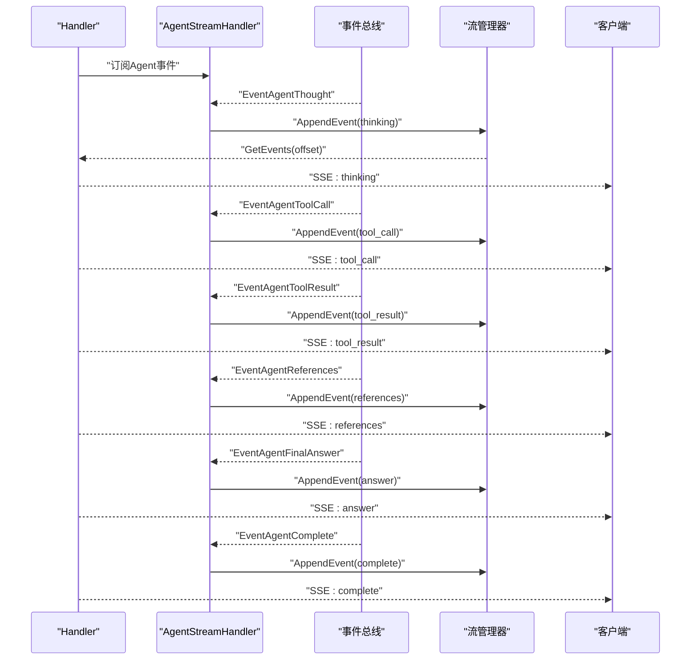
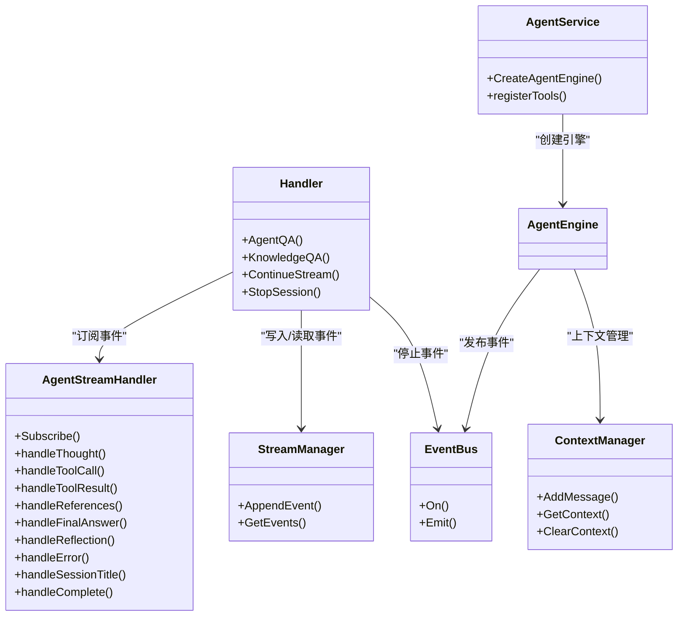

# 聊天API

<cite>
**本文引用的文件**
- [internal/handler/session/qa.go](file://internal/handler/session/qa.go)
- [internal/handler/session/stream.go](file://internal/handler/session/stream.go)
- [internal/handler/session/agent_stream_handler.go](file://internal/handler/session/agent_stream_handler.go)
- [internal/handler/session/helpers.go](file://internal/handler/session/helpers.go)
- [client/session.go](file://client/session.go)
- [docs/api/chat.md](file://docs/api/chat.md)
- [internal/types/chat.go](file://internal/types/chat.go)
- [internal/application/service/chat_pipline/chat_completion.go](file://internal/application/service/chat_pipline/chat_completion.go)
- [internal/application/service/chat_pipline/chat_completion_stream.go](file://internal/application/service/chat_pipline/chat_completion_stream.go)
- [internal/application/service/agent_service.go](file://internal/application/service/agent_service.go)
- [internal/agent/tools/web_search.go](file://internal/agent/tools/web_search.go)
- [internal/agent/tools/knowledge_search.go](file://internal/agent/tools/knowledge_search.go)
- [internal/application/service/llmcontext/context_manager.go](file://internal/application/service/llmcontext/context_manager.go)
- [internal/middleware/error_handler.go](file://internal/middleware/error_handler.go)
</cite>

## 目录
1. [简介](#简介)
2. [项目结构](#项目结构)
3. [核心组件](#核心组件)
4. [架构总览](#架构总览)
5. [详细组件分析](#详细组件分析)
6. [依赖关系分析](#依赖关系分析)
7. [性能考虑](#性能考虑)
8. [故障排查指南](#故障排查指南)
9. [结论](#结论)
10. [附录](#附录)

## 简介
本文件面向WeKnora聊天API，聚焦于会话创建、消息发送与流式响应（SSE）处理。文档覆盖以下要点：
- /chat/completions风格的请求结构（model、messages、stream等参数），以及与Agent模式的集成方式
- 流式响应（SSE）格式与客户端处理流程
- 工具调用（如web_search、knowledge_search）的中间结果与最终答案的事件序列
- 错误处理策略与性能优化建议（上下文长度管理）

## 项目结构
WeKnora后端采用分层架构：
- Handler层：接收HTTP请求，解析参数，触发业务流程，并以SSE推送事件
- Service层：封装Agent引擎、工具注册、检索与重排、上下文管理等
- Types层：统一的事件类型、流式响应结构、工具调用结构等
- Client层：Go客户端示例，展示如何发起知识问答流式请求与处理SSE

图表来源
- [internal/handler/session/qa.go](file://internal/handler/session/qa.go#L1-L561)
- [internal/handler/session/stream.go](file://internal/handler/session/stream.go#L1-L369)
- [internal/application/service/agent_service.go](file://internal/application/service/agent_service.go#L1-L375)
- [internal/application/service/chat_pipline/chat_completion.go](file://internal/application/service/chat_pipline/chat_completion.go#L1-L77)
- [internal/application/service/chat_pipline/chat_completion_stream.go](file://internal/application/service/chat_pipline/chat_completion_stream.go#L1-L131)
- [internal/application/service/llmcontext/context_manager.go](file://internal/application/service/llmcontext/context_manager.go#L1-L169)

章节来源
- [internal/handler/session/qa.go](file://internal/handler/session/qa.go#L1-L561)
- [internal/handler/session/stream.go](file://internal/handler/session/stream.go#L1-L369)
- [internal/application/service/agent_service.go](file://internal/application/service/agent_service.go#L1-L375)
- [internal/application/service/chat_pipline/chat_completion.go](file://internal/application/service/chat_pipline/chat_completion.go#L1-L77)
- [internal/application/service/chat_pipline/chat_completion_stream.go](file://internal/application/service/chat_pipline/chat_completion_stream.go#L1-L131)
- [internal/application/service/llmcontext/context_manager.go](file://internal/application/service/llmcontext/context_manager.go#L1-L169)

## 核心组件
- Handler层
  - 知识问答与Agent问答入口：负责参数校验、消息创建、SSE头设置、事件总线与流管理器交互
  - SSE继续/停止：支持断线重连与中途停止生成
- Service层
  - AgentService：注册工具、构建Agent引擎、加载知识库信息
  - 工具：知识检索、网络搜索、网页抓取等
  - 聊天流水线：非流与流式两种路径，分别用于一次性回答与增量输出
  - 上下文管理：按最大tokens压缩对话历史，避免超出模型上下文
- Types层
  - 事件类型与流式响应结构：统一的response_type与数据载体
  - LLM工具调用结构：tool_calls、finish_reason、usage等

章节来源
- [internal/handler/session/qa.go](file://internal/handler/session/qa.go#L1-L561)
- [internal/handler/session/stream.go](file://internal/handler/session/stream.go#L1-L369)
- [internal/application/service/agent_service.go](file://internal/application/service/agent_service.go#L1-L375)
- [internal/types/chat.go](file://internal/types/chat.go#L1-L106)

## 架构总览
下面的序列图展示了Agent问答的端到端流程，包括工具调用与中间事件的SSE推送。

图表来源
- [internal/handler/session/qa.go](file://internal/handler/session/qa.go#L139-L427)
- [internal/handler/session/agent_stream_handler.go](file://internal/handler/session/agent_stream_handler.go#L1-L452)
- [internal/application/service/agent_service.go](file://internal/application/service/agent_service.go#L1-L375)
- [internal/handler/session/stream.go](file://internal/handler/session/stream.go#L272-L369)

## 详细组件分析

### 1) 端点与请求结构
- /knowledge-chat/:session_id
  - 功能：基于知识库的问答（SSE）
  - 请求体：包含query字段
  - 响应：SSE事件流，事件类型为message，数据为StreamResponse
- /agent-chat/:session_id
  - 功能：Agent智能问答（SSE）
  - 请求体：包含query、knowledge_base_ids、agent_enabled、web_search_enabled、summary_model_id、mcp_service_ids等
  - 响应：SSE事件流，事件类型为message，数据为StreamResponse，包含多种response_type（thinking、tool_call、tool_result、references、answer、reflection、error、complete等）

章节来源
- [docs/api/chat.md](file://docs/api/chat.md#L1-L105)
- [internal/handler/session/qa.go](file://internal/handler/session/qa.go#L1-L561)

### 2) 流式响应（SSE）格式与客户端处理
- 服务端事件头
  - Content-Type: text/event-stream
  - Cache-Control: no-cache
  - Connection: keep-alive
  - X-Accel-Buffering: no
- 事件结构
  - event: message
  - data: JSON字符串，对应StreamResponse
- StreamResponse字段
  - id: 请求ID
  - response_type: 事件类型（answer、references、thinking、tool_call、tool_result、error、reflection、session_title、agent_query、complete等）
  - content: 当前片段内容
  - done: 是否结束
  - knowledge_references: 引用列表（当response_type为references时）
  - session_id/assistant_message_id: agent_query事件携带
  - tool_calls: 部分工具调用信息
  - data: 元数据（如工具调用ID、耗时、成功与否等）
- 客户端处理
  - Go客户端使用bufio按行读取SSE，遇到空行表示一个事件结束，解析data中的JSON为StreamResponse
  - 前端示例使用EventSource逐条onmessage处理，累积content并监听done=true

章节来源
- [internal/handler/session/helpers.go](file://internal/handler/session/helpers.go#L1-L51)
- [internal/types/chat.go](file://internal/types/chat.go#L1-L106)
- [client/session.go](file://client/session.go#L240-L331)
- [frontend/src/api/chat/streame.ts](file://frontend/src/api/chat/streame.ts#L116-L170)

### 3) Agent模式与工具调用中间结果
- AgentService负责：
  - 注册工具（如knowledge_search、web_search、web_fetch、grep_chunks等）
  - 构建Agent引擎，注入事件总线、上下文管理器、知识库信息
- Agent引擎执行流程：
  - 思考阶段：发出thinking事件
  - 工具调用：发出tool_call事件，携带工具名与参数
  - 工具结果：发出tool_result或error事件，携带输出/错误与元数据
  - 引用：发出references事件，携带检索到的知识片段
  - 最终答案：发出answer事件，done=true
  - 完成：发出complete事件，携带统计信息
- SSE推送：
  - Handler通过StreamManager收集事件，构建StreamResponse并推送
  - 客户端按事件类型渲染UI，逐步拼接answer内容

图表来源
- [internal/handler/session/agent_stream_handler.go](file://internal/handler/session/agent_stream_handler.go#L1-L452)
- [internal/handler/session/stream.go](file://internal/handler/session/stream.go#L272-L369)
- [internal/application/service/agent_service.go](file://internal/application/service/agent_service.go#L1-L375)

章节来源
- [internal/application/service/agent_service.go](file://internal/application/service/agent_service.go#L1-L375)
- [internal/handler/session/agent_stream_handler.go](file://internal/handler/session/agent_stream_handler.go#L1-L452)

### 4) 知识检索与网络搜索工具
- 知识检索工具（knowledge_search）
  - 支持向量与关键词混合检索，支持并发搜索、去重、重排（rerank）、MMR多样性控制
  - 输出包含引用列表，供references事件推送
- 网络搜索工具（web_search）
  - 基于租户配置的搜索引擎，支持RAG压缩与会话级临时知识库缓存
  - 输出包含结果列表与下一步建议

章节来源
- [internal/agent/tools/knowledge_search.go](file://internal/agent/tools/knowledge_search.go#L1-L800)
- [internal/agent/tools/web_search.go](file://internal/agent/tools/web_search.go#L1-L280)

### 5) 聊天流水线（非流与流式）
- 非流式聊天流水线
  - 准备模型与消息，调用Chat生成完整回答，填充usage与finish_reason
- 流式聊天流水线
  - 通过ChatStream通道逐片产出answer事件，最终聚合为最终答案

章节来源
- [internal/application/service/chat_pipline/chat_completion.go](file://internal/application/service/chat_pipline/chat_completion.go#L1-L77)
- [internal/application/service/chat_pipline/chat_completion_stream.go](file://internal/application/service/chat_pipline/chat_completion_stream.go#L1-L131)

### 6) 会话创建与消息发送
- 会话创建
  - 客户端通过POST /api/v1/sessions创建会话，可设置知识库ID、Agent配置、上下文配置等
- 消息发送
  - 知识问答：POST /api/v1/knowledge-chat/{session_id}，请求体包含query
  - Agent问答：POST /api/v1/agent-chat/{session_id}，请求体包含query、agent_enabled、web_search_enabled、knowledge_base_ids等
- 断线重连与停止
  - 继续流：GET /api/v1/sessions/continue-stream/{session_id}?message_id={message_id}
  - 停止生成：POST /api/v1/sessions/{session_id}/stop，请求体包含message_id

章节来源
- [client/session.go](file://client/session.go#L115-L195)
- [client/session.go](file://client/session.go#L240-L331)
- [client/session.go](file://client/session.go#L333-L423)
- [internal/handler/session/stream.go](file://internal/handler/session/stream.go#L1-L174)

## 依赖关系分析
- Handler依赖
  - 事件总线：用于Agent事件的发布与订阅
  - 流管理器：持久化事件并支持offset拉取
  - 会话/消息服务：创建用户消息、助手消息、更新消息状态
- Service依赖
  - AgentService依赖工具注册表、知识库服务、重排模型、聊天模型、MCP管理器
  - 聊天流水线依赖模型服务与消息准备
- 类型与事件
  - 统一的StreamResponse与ResponseType，便于前后端契约稳定

图表来源
- [internal/handler/session/qa.go](file://internal/handler/session/qa.go#L1-L561)
- [internal/handler/session/agent_stream_handler.go](file://internal/handler/session/agent_stream_handler.go#L1-L452)
- [internal/application/service/agent_service.go](file://internal/application/service/agent_service.go#L1-L375)
- [internal/handler/session/stream.go](file://internal/handler/session/stream.go#L1-L369)
- [internal/application/service/llmcontext/context_manager.go](file://internal/application/service/llmcontext/context_manager.go#L1-L169)

章节来源
- [internal/handler/session/qa.go](file://internal/handler/session/qa.go#L1-L561)
- [internal/handler/session/agent_stream_handler.go](file://internal/handler/session/agent_stream_handler.go#L1-L452)
- [internal/application/service/agent_service.go](file://internal/application/service/agent_service.go#L1-L375)
- [internal/handler/session/stream.go](file://internal/handler/session/stream.go#L1-L369)
- [internal/application/service/llmcontext/context_manager.go](file://internal/application/service/llmcontext/context_manager.go#L1-L169)

## 性能考虑
- 上下文长度管理
  - 使用上下文管理器估算token并按阈值压缩对话历史，避免超出模型上下文
  - 支持滑动窗口与智能压缩策略，结合最近消息计数与摘要阈值
- 并发与重排
  - 知识检索采用并发搜索与去重、重排（rerank）与MMR，平衡质量与多样性
- 流式输出
  - SSE采用pull模式，客户端断线可继续拉取；服务端按offset推送，避免重复
- 工具调用
  - 网络搜索支持RAG压缩与会话级临时知识库缓存，减少重复索引成本

章节来源
- [internal/application/service/llmcontext/context_manager.go](file://internal/application/service/llmcontext/context_manager.go#L1-L169)
- [internal/agent/tools/knowledge_search.go](file://internal/agent/tools/knowledge_search.go#L1-L800)
- [internal/agent/tools/web_search.go](file://internal/agent/tools/web_search.go#L1-L280)
- [internal/handler/session/stream.go](file://internal/handler/session/stream.go#L1-L174)

## 故障排查指南
- 常见错误
  - 参数缺失或非法：Handler进行参数校验并返回400错误
  - 会话不存在：返回404
  - 权限不足：返回403
  - 服务器内部错误：返回500
- 错误处理中间件
  - 应用错误统一包装为标准错误响应，包含code、message、details
- 停止生成
  - 客户端可发送停止请求，服务端写入stop事件并通知前端
- 断线重连
  - 使用继续流接口，按message_id与offset拉取未消费事件

章节来源
- [internal/handler/session/stream.go](file://internal/handler/session/stream.go#L166-L271)
- [internal/middleware/error_handler.go](file://internal/middleware/error_handler.go#L1-L47)
- [client/session.go](file://client/session.go#L333-L423)

## 结论
WeKnora聊天API通过Handler+Service+Types三层架构，提供了稳定的知识问答与Agent智能问答能力。SSE事件驱动的流式响应使前端能够实时渲染中间结果与最终答案，配合工具调用与上下文管理，既保证了交互体验，也兼顾了性能与可扩展性。建议在生产环境中：
- 合理配置上下文长度与压缩策略
- 在Agent模式下谨慎开启网络搜索与工具调用
- 使用继续流与停止接口提升用户体验与资源控制

## 附录

### A. 请求/响应示例（路径引用）
- 知识问答（SSE）
  - 请求：POST /api/v1/knowledge-chat/{session_id}
  - 示例请求体：参见文档API说明
  - 响应：SSE事件流，事件类型为message，数据为StreamResponse
  - 参考：[docs/api/chat.md](file://docs/api/chat.md#L1-L105)
- Agent问答（SSE）
  - 请求：POST /api/v1/agent-chat/{session_id}
  - 示例请求体：参见文档API说明
  - 响应：SSE事件流，包含thinking、tool_call、tool_result、references、answer、complete等
  - 参考：[docs/api/chat.md](file://docs/api/chat.md#L46-L105)
- Go客户端知识问答流式调用
  - 参考：[client/session.go](file://client/session.go#L240-L331)
- Go客户端继续流与停止
  - 参考：[client/session.go](file://client/session.go#L333-L423)

### B. 关键数据结构（路径引用）
- StreamResponse与ResponseType
  - 参考：[internal/types/chat.go](file://internal/types/chat.go#L1-L106)
- SSE辅助函数
  - 参考：[internal/handler/session/helpers.go](file://internal/handler/session/helpers.go#L1-L51)