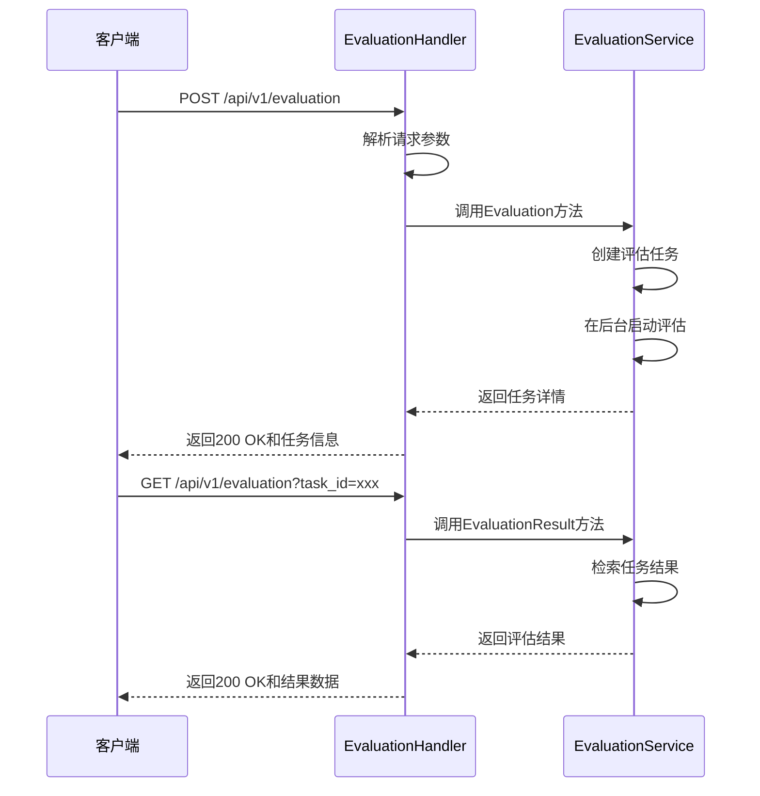
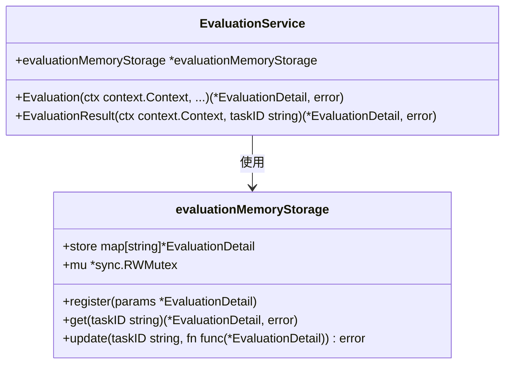
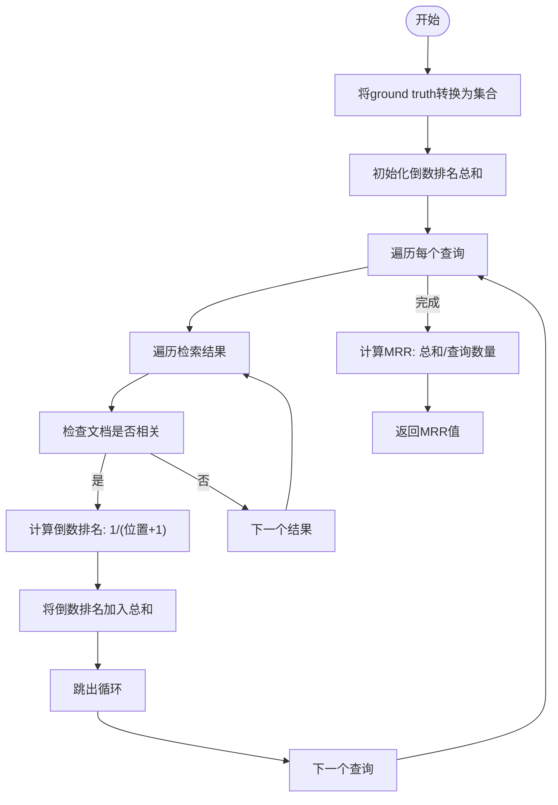
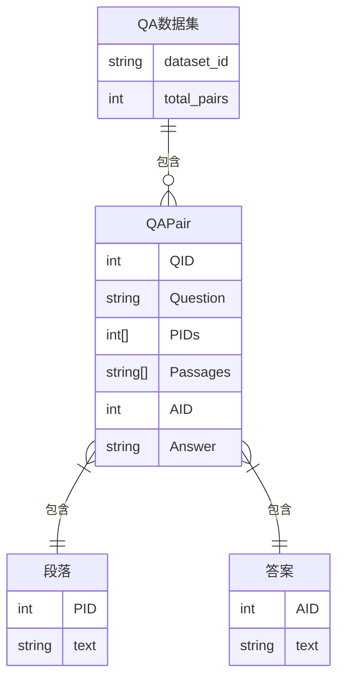
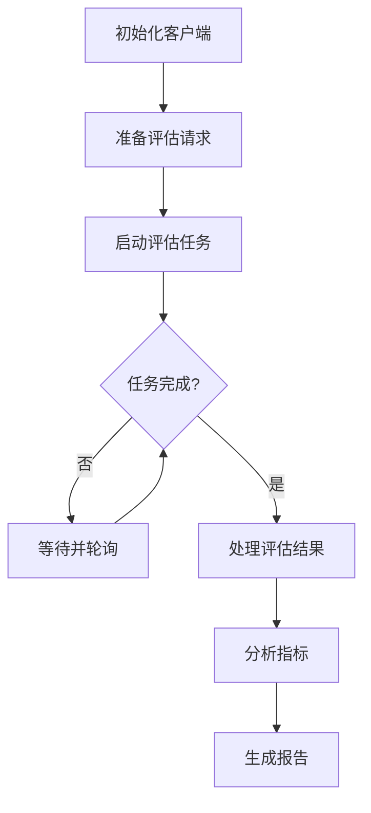

# 评估API

<cite>
**本文档中引用的文件**  
- [evaluation.go](file://internal/handler/evaluation.go)
- [evaluation.go](file://internal/application/service/evaluation.go)
- [metric/bleu.go](file://internal/application/service/metric/bleu.go)
- [metric/rouge.go](file://internal/application/service/metric/rouge.go)
- [metric/mrr.go](file://internal/application/service/metric/mrr.go)
- [metric/map.go](file://internal/application/service/metric/map.go)
- [metric_hook.go](file://internal/application/service/metric_hook.go)
- [evaluation.go](file://client/evaluation.go)
- [evaluation.go](file://internal/types/evaluation.go)
- [dataset.go](file://internal/types/dataset.go)
- [router.go](file://internal/router/router.go)
</cite>

## 目录
1. [简介](#简介)
2. [评估API端点](#评估api端点)
3. [评估任务异步执行机制](#评估任务异步执行机制)
4. [评估指标算法原理](#评估指标算法原理)
5. [输入数据集格式要求](#输入数据集格式要求)
6. [结果查询方式](#结果查询方式)
7. [评估流水线构建示例](#评估流水线构建示例)
8. [性能考虑](#性能考虑)
9. [结论](#结论)

## 简介

WeKnora系统的评估API提供了一套完整的RAG（检索增强生成）系统性能评估功能。该API允许用户对知识库问答系统的各个组件进行系统性评估，包括嵌入模型、聊天模型和重排模型的性能。评估系统通过计算多种标准指标（如BLEU、ROUGE、MRR等）来量化系统性能，为模型选择和优化提供数据支持。

评估API的设计遵循异步任务处理模式，用户提交评估请求后，系统在后台执行耗时的评估任务，用户可以通过任务ID轮询获取评估结果。这种设计模式确保了API的响应性，即使面对大规模数据集的评估任务也能保持良好的用户体验。

**Section sources**
- [evaluation.go](file://internal/handler/evaluation.go#L1-L110)
- [evaluation.go](file://internal/application/service/evaluation.go#L1-L467)

## 评估API端点

评估API提供了两个主要端点：一个用于启动评估任务，另一个用于查询评估结果。这些端点通过HTTP协议暴露，支持JSON格式的请求和响应。

### 启动评估任务

`/api/v1/evaluation` 端点（HTTP POST方法）用于启动新的评估任务。客户端需要提供评估所需的参数，包括数据集ID、知识库ID、聊天模型ID和重排模型ID。

请求体包含以下字段：
- **dataset_id**: 要评估的数据集ID
- **knowledge_base_id**: 要使用的知识库ID（可选）
- **chat_id**: 要评估的聊天模型ID
- **rerank_id**: 要评估的重排模型ID

当知识库ID未提供时，系统会自动创建一个新的评估专用知识库。如果未指定模型ID，系统会使用默认模型。

成功响应返回一个包含任务详细信息的JSON对象，其中最重要的字段是任务ID，后续用于查询评估结果。

### 查询评估结果

`/api/v1/evaluation` 端点（HTTP GET方法）用于查询评估任务的结果。客户端需要通过查询参数提供任务ID。

请求参数：
- **task_id**: 评估任务的唯一标识符

响应包含评估任务的完整状态信息，包括任务状态、进度和最终的评估指标。如果任务仍在运行，响应会包含当前进度；如果任务已完成，响应会包含详细的评估结果。

**Diagram sources**
- [evaluation.go](file://internal/handler/evaluation.go#L32-L77)
- [evaluation.go](file://internal/application/service/evaluation.go#L133-L327)

**Section sources**
- [evaluation.go](file://internal/handler/evaluation.go#L24-L77)
- [evaluation.go](file://internal/handler/evaluation.go#L79-L109)

## 评估任务异步执行机制

评估系统的异步执行机制是其核心设计之一，确保了系统的可扩展性和响应性。当用户提交评估请求时，系统不会阻塞等待评估完成，而是立即返回一个任务ID，然后在后台线程中执行实际的评估工作。

### 任务生命周期

评估任务的生命周期包括以下几个状态：
- **待处理 (Pending)**: 任务已创建但尚未开始执行
- **运行中 (Running)**: 任务正在执行评估
- **成功 (Success)**: 任务已完成并生成结果
- **失败 (Failed)**: 任务执行过程中发生错误

这些状态在`EvaluationStatue`枚举类型中定义，为任务状态管理提供了清晰的语义。

### 内存存储实现

评估任务的状态和结果存储在内存中，通过`evaluationMemoryStorage`结构体实现。该结构体使用读写锁（sync.RWMutex）确保多线程环境下的数据安全访问。

**Diagram sources**
- [evaluation.go](file://internal/application/service/evaluation.go#L59-L100)
- [evaluation.go](file://internal/types/evaluation.go#L13-L35)

**Section sources**
- [evaluation.go](file://internal/application/service/evaluation.go#L59-L100)
- [evaluation.go](file://internal/application/service/evaluation.go#L102-L126)

## 评估指标算法原理

评估系统实现了多种标准的评估指标，分为检索性能指标和生成质量指标两大类。这些指标的实现位于`internal/application/service/metric/`目录下，每个指标都有独立的实现文件。

### 检索性能指标

#### MRR（平均倒数排名）

MRRMetric计算检索结果中第一个相关文档的排名倒数的平均值。该指标特别关注第一个相关结果的位置，值越高表示系统越能将相关文档排在前面。

**Diagram sources**
- [mrr.go](file://internal/application/service/metric/mrr.go#L7-L49)

#### MAP（平均平均精度）

MAPMetric计算每个查询的平均精度（AP）的平均值。平均精度考虑了所有相关文档在结果列表中的位置，对排名靠前的相关文档给予更高权重。

### 生成质量指标

#### BLEU（双语评估替补）

BLEUMetric实现BLEU评分算法，通过比较生成文本和参考文本之间的n-gram重叠来评估机器翻译或文本生成的质量。系统实现了BLEU-1、BLEU-2和BLEU-4等变体。

BLEU评分包含两个主要组件：修改后的n-gram精度和简短惩罚。修改后的精度通过计算生成文本中出现在参考文本中的n-gram数量来衡量，而简短惩罚则对过短的生成文本进行惩罚。

#### ROUGE（召回导向的摘要评估）

RougeMetric实现ROUGE评分系列，主要用于评估文本摘要质量。系统支持ROUGE-1、ROUGE-2和ROUGE-L等变体，分别基于unigram、bigram和最长公共子序列进行评估。

ROUGE指标更关注召回率，即参考文本中有多少内容在生成文本中出现，这使其特别适合评估摘要的完整性。

**Section sources**
- [bleu.go](file://internal/application/service/metric/bleu.go#L27-L166)
- [rouge.go](file://internal/application/service/metric/rouge.go#L9-L73)
- [mrr.go](file://internal/application/service/metric/mrr.go#L8-L49)
- [map.go](file://internal/application/service/metric/map.go#L8-L71)

## 输入数据集格式要求

评估系统使用结构化的QA数据集来评估RAG系统的性能。数据集的基本单位是`QAPair`（问题-答案对），包含问题、相关段落和答案等信息。

### QAPair结构

`QAPair`结构体定义了单个评估样本的格式：

- **QID**: 问题ID，整数类型
- **Question**: 问题文本，字符串类型
- **PIDs**: 相关段落ID列表，整数数组
- **Passages**: 段落文本列表，字符串数组
- **AID**: 答案ID，整数类型
- **Answer**: 答案文本，字符串类型

这种结构设计允许系统评估检索组件（通过PIDs和Passages）和生成组件（通过Question和Answer）的性能。

### 数据集加载

评估服务通过`DatasetService`接口的`GetDatasetByID`方法加载数据集。系统支持多种数据集格式，并能根据ID从存储中检索相应的QA对列表。

在评估执行过程中，系统会从QA对中提取段落文本，创建临时的知识库用于评估。评估完成后，这些临时资源会被自动清理，确保系统的整洁性。

**Diagram sources**
- [dataset.go](file://internal/types/dataset.go#L4-L12)
- [evaluation.go](file://internal/application/service/evaluation.go#L336-L367)

**Section sources**
- [dataset.go](file://internal/types/dataset.go#L4-L12)
- [evaluation.go](file://internal/application/service/evaluation.go#L336-L367)

## 结果查询方式

评估结果的查询通过`/api/v1/evaluation`端点的GET方法实现。客户端需要提供任务ID作为查询参数来获取特定评估任务的结果。

### 结果结构

评估结果包含丰富的信息，主要包括：

- **任务信息**: 任务ID、状态、进度、开始和结束时间
- **评估指标**: 包括检索性能指标和生成质量指标
- **详细统计**: 每个查询的详细评估统计

在Go服务端，结果通过`EvaluationDetail`结构体表示，包含任务信息、参数和指标结果。在客户端，结果被映射为`EvaluationResult`结构体，便于应用程序使用。

### 轮询模式

由于评估任务是异步执行的，客户端通常采用轮询模式来获取结果。典型的使用模式是：

1. 调用POST端点启动评估任务，获取任务ID
2. 等待一段时间（如5秒）
3. 调用GET端点查询任务状态
4. 如果任务仍在运行，重复步骤2-3
5. 如果任务已完成，处理评估结果

这种模式简单可靠，适用于大多数应用场景。

**Section sources**
- [evaluation.go](file://internal/handler/evaluation.go#L79-L109)
- [evaluation.go](file://internal/application/service/evaluation.go#L102-L126)
- [evaluation.go](file://client/evaluation.go#L89-L113)

## 评估流水线构建示例

以下是一个使用Go客户端构建评估流水线的代码示例：

**Diagram sources**
- [evaluation.go](file://client/evaluation.go#L66-L113)

**Section sources**
- [evaluation.go](file://client/evaluation.go#L66-L113)

## 性能考虑

评估系统的性能设计考虑了多个方面：

1. **并行处理**: 系统使用`errgroup`包并行处理数据集中的各个QA对，充分利用多核CPU的计算能力。
2. **内存效率**: 评估任务的状态存储在内存中，避免了频繁的数据库访问。
3. **资源清理**: 系统在评估完成后自动清理临时创建的知识库和知识，防止资源泄漏。
4. **限流控制**: 并行度根据CPU核心数动态调整，避免系统过载。

这些设计确保了评估系统能够高效处理大规模数据集的评估任务。

**Section sources**
- [evaluation.go](file://internal/application/service/evaluation.go#L385-L387)
- [evaluation.go](file://internal/application/service/evaluation.go#L363-L377)

## 结论

WeKnora的评估API提供了一套强大而灵活的RAG系统性能评估解决方案。通过异步任务处理模式、多种标准评估指标和清晰的API设计，该系统能够有效支持模型开发和优化过程。

评估系统的核心优势在于其模块化设计，将评估任务的管理、指标计算和结果查询分离，使得系统易于维护和扩展。未来可以考虑增加更多评估指标、支持更复杂的数据集格式以及提供可视化结果展示功能。