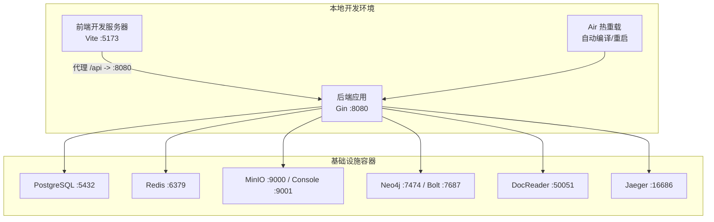
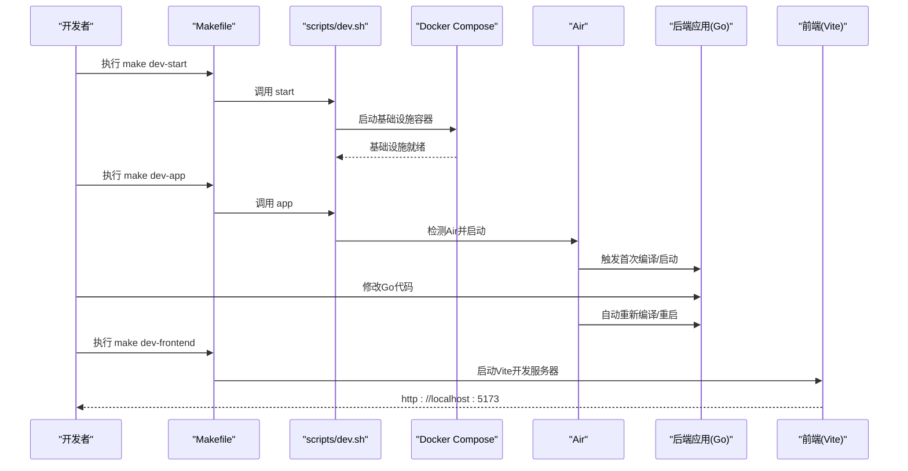
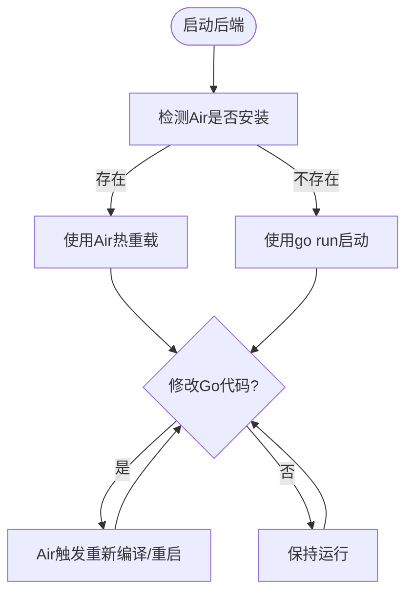
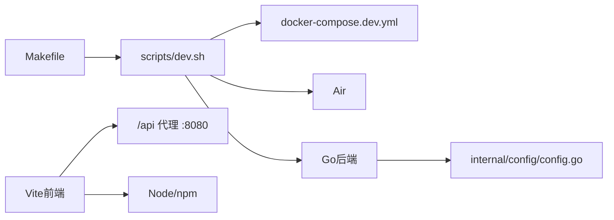

# 开发指南

<cite>
**本文引用的文件列表**
- [Makefile](file://Makefile)
- [scripts/dev.sh](file://scripts/dev.sh)
- [scripts/quick-dev.sh](file://scripts/quick-dev.sh)
- [docker-compose.dev.yml](file://docker-compose.dev.yml)
- [frontend/package.json](file://frontend/package.json)
- [frontend/vite.config.ts](file://frontend/vite.config.ts)
- [cmd/server/main.go](file://cmd/server/main.go)
- [.air.toml](file://.air.toml)
- [internal/config/config.go](file://internal/config/config.go)
- [scripts/start_all.sh](file://scripts/start_all.sh)
- [.env.example](file://.env.example)
- [README.md](file://README.md)
- [docs/快速开发模式说明.md](file://docs/快速开发模式说明.md)
- [scripts/check-env.sh](file://scripts/check-env.sh)
</cite>

## 目录
1. [简介](#简介)
2. [项目结构](#项目结构)
3. [核心组件](#核心组件)
4. [架构总览](#架构总览)
5. [详细组件分析](#详细组件分析)
6. [依赖关系分析](#依赖关系分析)
7. [性能与效率考量](#性能与效率考量)
8. [故障排查指南](#故障排查指南)
9. [结论](#结论)
10. [附录](#附录)

## 简介
本开发指南面向WeKnora贡献者，聚焦“快速开发模式”的本地工作流，目标是帮助你在不重建Docker镜像的前提下，快速启动基础设施、后端与前端服务，并通过Air实现Go后端热重载，显著提升迭代效率。文档同时对比旧的“构建镜像”流程与新的“快速开发模式”，给出清晰的环境搭建、访问地址与调试方法（含VS Code调试建议），并提供常见问题排查与最佳实践。

## 项目结构
WeKnora采用多模块分层组织：
- 后端：Go语言，入口位于cmd/server/main.go，通过依赖注入容器启动HTTP服务。
- 前端：Vue 3 + Vite，开发服务器默认监听5173端口，通过代理转发/api到后端8080端口。
- 基础设施：通过docker-compose.dev.yml启动PostgreSQL、Redis、MinIO、Neo4j、DocReader、Jaeger等服务。
- 开发脚本：Makefile提供统一命令入口；scripts/dev.sh负责快速开发模式的启动/停止/日志/状态管理；scripts/quick-dev.sh提供一键启动（交互式）。
- 配置：.env.example提供环境变量模板；internal/config/config.go负责加载配置与环境变量替换。

图表来源
- [frontend/vite.config.ts](file://frontend/vite.config.ts#L16-L27)
- [cmd/server/main.go](file://cmd/server/main.go#L59-L96)
- [docker-compose.dev.yml](file://docker-compose.dev.yml#L1-L147)

章节来源
- [Makefile](file://Makefile#L1-L120)
- [scripts/dev.sh](file://scripts/dev.sh#L93-L172)
- [docker-compose.dev.yml](file://docker-compose.dev.yml#L1-L147)
- [frontend/package.json](file://frontend/package.json#L1-L30)
- [frontend/vite.config.ts](file://frontend/vite.config.ts#L16-L27)
- [cmd/server/main.go](file://cmd/server/main.go#L59-L96)

## 核心组件
- 快速开发模式入口
  - Makefile提供dev-start、dev-app、dev-frontend等命令，对应scripts/dev.sh的start、app、frontend子命令。
  - scripts/quick-dev.sh提供一键启动（交互式），自动在当前终端或后台启动后端/前端。
- 基础设施编排
  - docker-compose.dev.yml定义开发环境所需的核心服务（PostgreSQL、Redis、MinIO、Neo4j、DocReader、Jaeger），并映射端口、挂载卷与健康检查。
- 后端启动与热重载
  - scripts/dev.sh在本地运行后端，优先检测Air，若存在则使用Air热重载；否则使用go run启动。
  - .air.toml定义Air的构建规则、排除目录与延迟策略，确保只监控后端变更。
- 前端开发服务器
  - frontend/vite.config.ts配置开发服务器端口与代理，将/api转发至后端8080端口。
- 配置加载
  - internal/config/config.go支持从多个位置加载配置文件，并启用环境变量替换，便于本地与容器环境切换。

章节来源
- [Makefile](file://Makefile#L251-L273)
- [scripts/dev.sh](file://scripts/dev.sh#L174-L251)
- [scripts/quick-dev.sh](file://scripts/quick-dev.sh#L1-L125)
- [docker-compose.dev.yml](file://docker-compose.dev.yml#L1-L147)
- [.air.toml](file://.air.toml#L1-L47)
- [frontend/vite.config.ts](file://frontend/vite.config.ts#L16-L27)
- [internal/config/config.go](file://internal/config/config.go#L148-L196)

## 架构总览
快速开发模式的架构由“本地运行的后端/前端 + Docker编排的基础设施”组成，后端通过Air实现热重载，前端通过Vite实现热更新，避免频繁构建镜像带来的等待。

图表来源
- [Makefile](file://Makefile#L251-L273)
- [scripts/dev.sh](file://scripts/dev.sh#L174-L251)
- [docker-compose.dev.yml](file://docker-compose.dev.yml#L1-L147)
- [.air.toml](file://.air.toml#L1-L47)
- [frontend/vite.config.ts](file://frontend/vite.config.ts#L16-L27)

## 详细组件分析

### 快速开发模式命令与脚本
- Makefile中的dev-*命令
  - dev-start：启动基础设施（依赖docker-compose.dev.yml）
  - dev-app：在本地启动后端（优先Air，否则go run）
  - dev-frontend：在本地启动前端（Vite）
- scripts/dev.sh
  - start：检查Docker与.env，启动基础设施并打印访问地址
  - app：加载.env并设置本地开发环境变量，检测Air并启动后端
  - frontend：检查npm，安装依赖并启动Vite开发服务器
- scripts/quick-dev.sh
  - 一键启动：先启动基础设施，再交互式决定是否在当前终端启动后端/前端，支持后台启动并记录PID与日志文件

章节来源
- [Makefile](file://Makefile#L251-L273)
- [scripts/dev.sh](file://scripts/dev.sh#L93-L172)
- [scripts/dev.sh](file://scripts/dev.sh#L174-L251)
- [scripts/quick-dev.sh](file://scripts/quick-dev.sh#L1-L125)

### 基础设施编排与访问地址
- docker-compose.dev.yml启动的服务与端口映射如下：
  - PostgreSQL: 5432
  - Redis: 6379
  - MinIO: 9000 (Console: 9001)
  - Neo4j: 7474 (Bolt: 7687)
  - DocReader: 50051
  - Jaeger: 16686
- 访问地址（本地）：
  - 前端: http://localhost:5173
  - 后端API: http://localhost:8080
  - MinIO Console: http://localhost:9001
  - Jaeger UI: http://localhost:16686

章节来源
- [scripts/dev.sh](file://scripts/dev.sh#L116-L123)
- [docker-compose.dev.yml](file://docker-compose.dev.yml#L1-L147)
- [frontend/vite.config.ts](file://frontend/vite.config.ts#L16-L27)

### 后端热重载与Air配置
- Air检测与启动
  - scripts/dev.sh在本地启动后端时检测Air，若存在则使用Air热重载；否则使用go run。
  - Air自动编译并重启，减少手动重启等待。
- Air配置
  - .air.toml定义构建命令、排除目录（如frontend、docs、migrations等）、排除测试文件、延迟与日志等，确保后端热重载高效稳定。

图表来源
- [scripts/dev.sh](file://scripts/dev.sh#L214-L226)
- [.air.toml](file://.air.toml#L1-L47)

章节来源
- [scripts/dev.sh](file://scripts/dev.sh#L214-L226)
- [.air.toml](file://.air.toml#L1-L47)

### 前端开发服务器与代理
- Vite开发服务器默认端口5173，通过proxy将/api请求转发至后端8080。
- 前端依赖通过package.json管理，首次运行会自动安装node_modules（若缺失）。

章节来源
- [frontend/vite.config.ts](file://frontend/vite.config.ts#L16-L27)
- [frontend/package.json](file://frontend/package.json#L1-L30)
- [scripts/dev.sh](file://scripts/dev.sh#L228-L251)

### 配置加载与环境变量
- internal/config/config.go支持从多个路径加载配置文件，并启用环境变量替换，便于本地与容器环境切换。
- .env.example提供完整的环境变量模板，包括数据库、存储、流管理、Ollama、MinIO、Neo4j等关键配置项。

章节来源
- [internal/config/config.go](file://internal/config/config.go#L148-L196)
- [.env.example](file://.env.example#L1-L150)

### 与传统“构建镜像”流程的对比
- 旧流程（构建镜像）
  - 每次修改后端/前端代码均需重新构建镜像，耗时较长，不适合高频迭代。
- 新流程（快速开发模式）
  - 基础设施通过Docker Compose启动；后端在本地使用Air热重载；前端在本地使用Vite热更新；无需频繁构建镜像。
  - 效率优势：后端热重载（Air）+ 前端热更新（Vite），IDE断点调试更便捷，整体迭代速度大幅提升。

章节来源
- [docs/快速开发模式说明.md](file://docs/快速开发模式说明.md#L1-L106)
- [README.md](file://README.md#L321-L349)

## 依赖关系分析
- Makefile依赖scripts/dev.sh与scripts/quick-dev.sh，统一暴露dev-*命令。
- scripts/dev.sh依赖docker-compose.dev.yml进行基础设施编排。
- 后端依赖Air（可选）与Go运行时；Air依赖Go工具链。
- 前端依赖Node.js与npm；Vite代理依赖后端8080端口。
- 配置加载依赖internal/config/config.go与.env环境变量。

图表来源
- [Makefile](file://Makefile#L251-L273)
- [scripts/dev.sh](file://scripts/dev.sh#L93-L172)
- [docker-compose.dev.yml](file://docker-compose.dev.yml#L1-L147)
- [.air.toml](file://.air.toml#L1-L47)
- [frontend/vite.config.ts](file://frontend/vite.config.ts#L16-L27)
- [internal/config/config.go](file://internal/config/config.go#L148-L196)

## 性能与效率考量
- 快速开发模式显著降低镜像构建与部署等待，适合高频迭代。
- Air热重载仅监控后端代码变更，排除前端、文档、迁移等目录，减少无效重启。
- Vite热更新在前端侧提供即时反馈，配合Air后端热重载形成完整闭环。
- 建议在本地开发时关闭不必要的容器（如Neo4j、MinIO等），仅保留必要服务，以减少资源占用。

章节来源
- [.air.toml](file://.air.toml#L1-L47)
- [docker-compose.dev.yml](file://docker-compose.dev.yml#L1-L147)

## 故障排查指南
- 环境变量缺失
  - 使用scripts/check-env.sh检查.env是否存在及关键变量是否配置正确。
- Docker与Compose不可用
  - 确认Docker服务运行，Compose命令可用（优先docker compose，回退docker-compose）。
- Air未安装
  - 若未安装Air，后端将以go run启动；建议安装Air以获得热重载体验。
- 前端代理无效
  - 确认Vite代理配置指向后端8080端口，后端已启动。
- 基础设施端口冲突
  - 修改docker-compose.dev.yml中的端口映射或释放冲突端口。
- 配置加载异常
  - 确认internal/config/config.go已正确加载配置文件并启用环境变量替换。

章节来源
- [scripts/check-env.sh](file://scripts/check-env.sh#L1-L195)
- [scripts/dev.sh](file://scripts/dev.sh#L36-L91)
- [frontend/vite.config.ts](file://frontend/vite.config.ts#L16-L27)
- [internal/config/config.go](file://internal/config/config.go#L148-L196)

## 结论
WeKnora的快速开发模式通过“本地运行后端/前端 + Docker编排基础设施”的组合，结合Air热重载与Vite热更新，实现了高效的本地开发闭环。相比旧的“构建镜像”流程，新流程显著缩短了迭代周期，提升了开发体验。建议贡献者优先采用快速开发模式，并配合IDE断点调试与环境检查脚本，确保开发过程顺畅高效。

## 附录

### 开发环境搭建与访问地址
- 环境准备
  - 安装Docker与Docker Compose，确保Docker服务运行。
  - 复制.env.example为.env并按需填写关键配置。
- 启动步骤
  - 启动基础设施：make dev-start 或 ./scripts/dev.sh start
  - 启动后端：make dev-app 或 ./scripts/dev.sh app
  - 启动前端：make dev-frontend 或 ./scripts/dev.sh frontend
- 访问地址
  - 前端: http://localhost:5173
  - 后端API: http://localhost:8080
  - MinIO Console: http://localhost:9001
  - Jaeger UI: http://localhost:16686

章节来源
- [scripts/dev.sh](file://scripts/dev.sh#L93-L123)
- [frontend/vite.config.ts](file://frontend/vite.config.ts#L16-L27)
- [docker-compose.dev.yml](file://docker-compose.dev.yml#L1-L147)

### VS Code调试建议
- 后端调试
  - 在Go后端入口处设置断点（cmd/server/main.go），使用Air热重载时仍可保持断点有效。
  - 确保环境变量（.env）正确加载，以便后端连接本地基础设施。
- 前端调试
  - 在浏览器开发者工具中设置断点，利用Vite热更新即时看到效果。
- 基础设施调试
  - 通过docker-compose.dev.yml查看各服务日志与状态，必要时调整端口与卷挂载。

章节来源
- [cmd/server/main.go](file://cmd/server/main.go#L59-L96)
- [scripts/dev.sh](file://scripts/dev.sh#L174-L226)
- [docker-compose.dev.yml](file://docker-compose.dev.yml#L1-L147)

### 一键启动（可选）
- 使用scripts/quick-dev.sh在单个终端内启动基础设施，并交互式决定是否在当前终端启动后端/前端，支持后台启动并记录PID与日志文件。

章节来源
- [scripts/quick-dev.sh](file://scripts/quick-dev.sh#L1-L125)