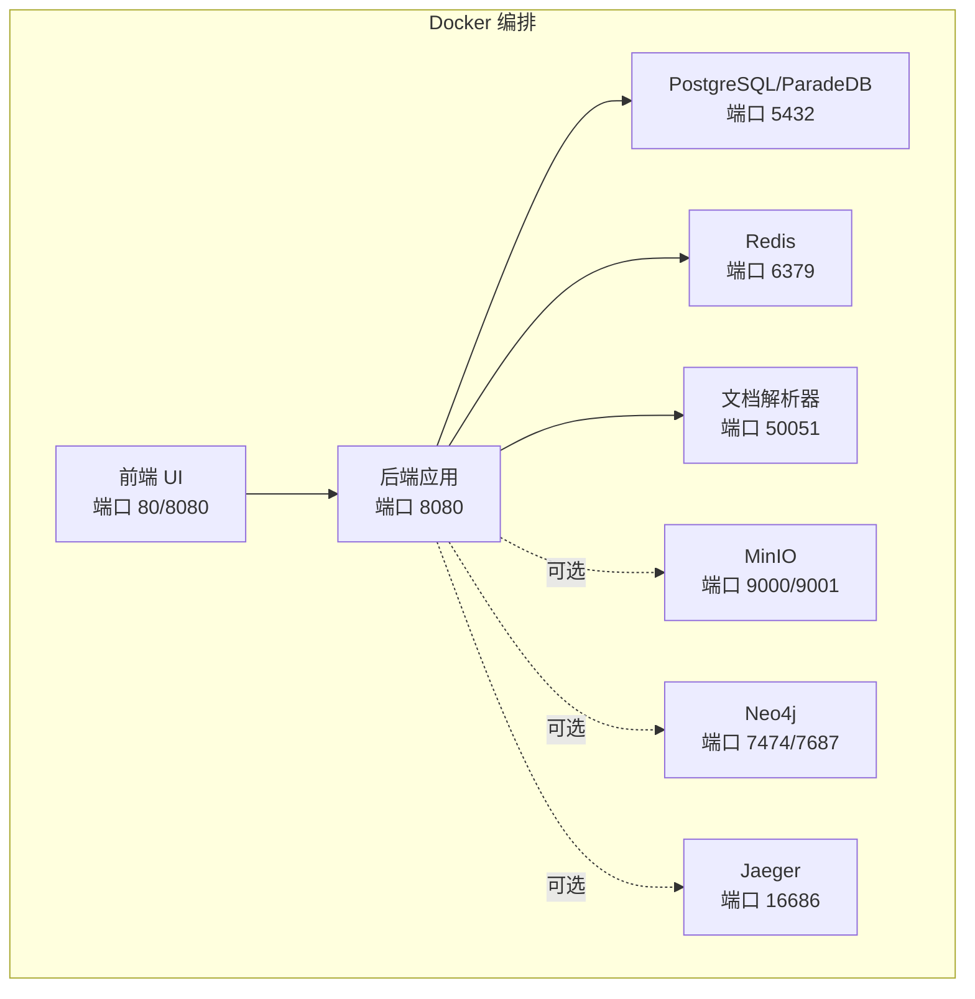
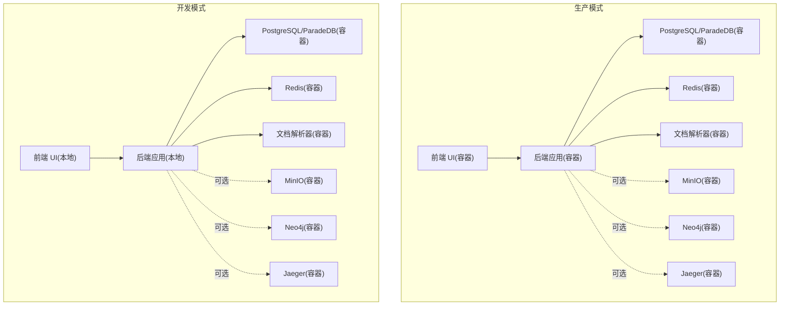
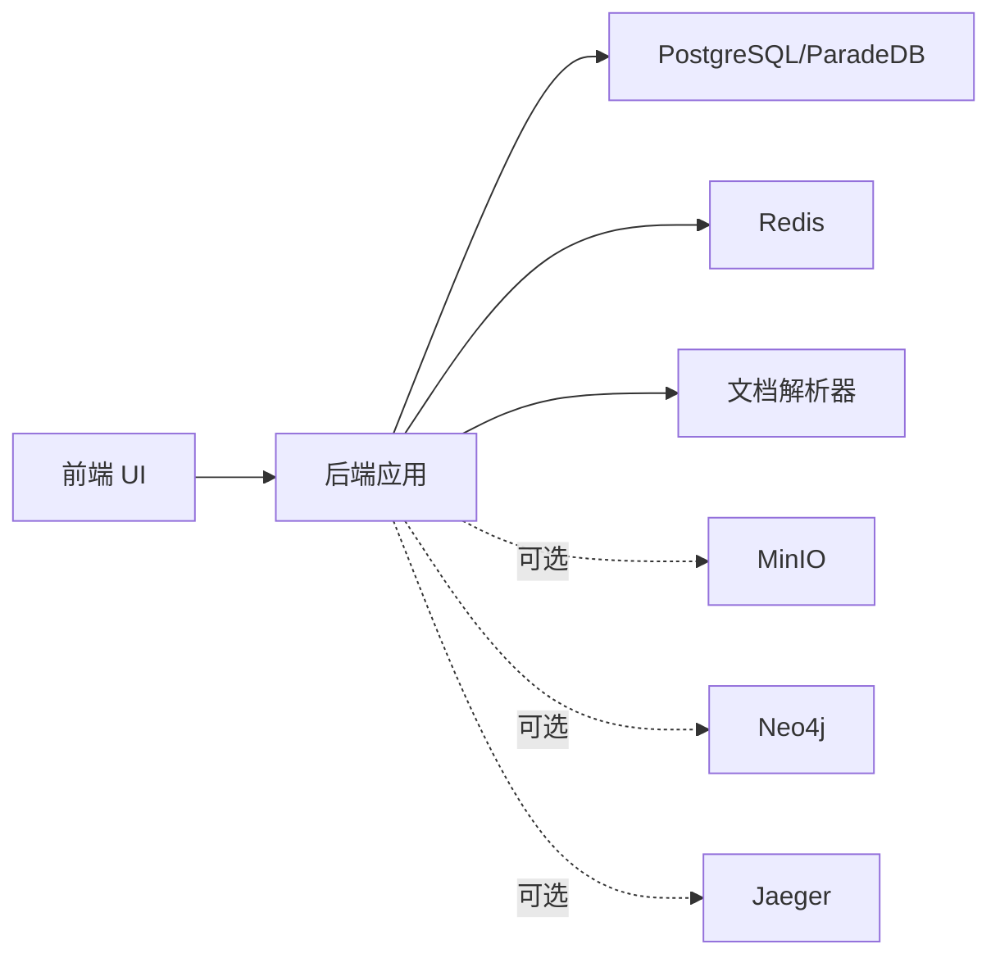

# 快速开始

<cite>
**本文引用的文件**
- [README.md](file://README.md)
- [docker-compose.yml](file://docker-compose.yml)
- [.env.example](file://.env.example)
- [scripts/start_all.sh](file://scripts/start_all.sh)
- [scripts/dev.sh](file://scripts/dev.sh)
- [docker-compose.dev.yml](file://docker-compose.dev.yml)
- [Makefile](file://Makefile)
- [docs/快速开发模式说明.md](file://docs/快速开发模式说明.md)
- [docs/开发指南.md](file://docs/开发指南.md)
- [scripts/quick-dev.sh](file://scripts/quick-dev.sh)
- [config/config.yaml](file://config/config.yaml)
</cite>

## 目录
1. [简介](#简介)
2. [项目结构](#项目结构)
3. [核心组件](#核心组件)
4. [架构总览](#架构总览)
5. [详细组件分析](#详细组件分析)
6. [依赖分析](#依赖分析)
7. [性能注意事项](#性能注意事项)
8. [故障排查指南](#故障排查指南)
9. [结论](#结论)
10. [附录](#附录)

## 简介
本指南面向零基础用户与开发者，帮助你在最短时间内完成 WeKnora 的安装与初始使用。WeKnora 是一个基于大语言模型的文档理解与语义检索框架，支持多模态解析、向量检索、知识图谱、Agent 智能体、网页搜索与 MCP 工具扩展等能力。通过 Docker Compose 一键启动核心服务，随后通过 Web UI 与 API 快速体验问答与知识管理。

## 项目结构
- 顶层使用 Docker Compose 编排多个服务：前端 UI、后端应用、文档解析器、数据库、缓存、对象存储、图数据库、链路追踪等。
- 开发模式下，可使用 Make 命令或脚本启动基础设施，后端与前端在本地运行，实现热重载与调试。
- 配置文件位于根目录，包含环境变量模板与后端 YAML 配置。

图表来源
- [docker-compose.yml](file://docker-compose.yml#L1-L254)

章节来源
- [README.md](file://README.md#L116-L215)
- [docker-compose.yml](file://docker-compose.yml#L1-L254)

## 核心组件
- 前端 UI：提供知识库管理、对话设置、Agent 模式、工具调用过程展示等界面。
- 后端应用：提供 REST API、会话管理、检索管线、消息处理、模型与嵌入配置、MCP 服务等。
- 文档解析器：负责 PDF、Word、图片等多模态文档的结构化抽取与向量化。
- 数据库：默认使用 PostgreSQL/ParadeDB，支持迁移脚本初始化。
- 缓存：Redis 用于流式管理与会话状态。
- 对象存储：MinIO 可选，用于文件上传与持久化。
- 图数据库：Neo4j 可选，用于知识图谱构建与检索。
- 链路追踪：Jaeger 可选，用于分布式链路观测。

章节来源
- [docker-compose.yml](file://docker-compose.yml#L1-L254)
- [config/config.yaml](file://config/config.yaml#L1-L649)

## 架构总览
下图展示了生产与开发两种模式的差异：生产模式容器化运行；开发模式后端与前端在本地运行，基础设施通过 Docker Compose 提供。

图表来源
- [docs/快速开发模式说明.md](file://docs/快速开发模式说明.md#L58-L106)
- [docker-compose.yml](file://docker-compose.yml#L1-L254)

## 详细组件分析

### 1. 环境准备与前置条件
- 必须安装：
  - Docker
  - Docker Compose
  - Git
- 建议准备：
  - 本地 Ollama（可选，用于本地推理）

章节来源
- [README.md](file://README.md#L118-L125)

### 2. 克隆仓库与环境变量配置
- 克隆仓库并进入目录
- 复制示例环境变量文件并编辑
  - 关键项包括：数据库驱动、向量存储驱动、存储类型、流管理后端、应用端口、前端端口、文档解析器端口、数据库凭据、Redis 凭据、MinIO 凭据、JWT 密钥、是否启用知识图谱、Ollama 基准地址等
- 也可在首次启动时由启动脚本自动创建 .env 并进行检查

章节来源
- [README.md](file://README.md#L126-L145)
- [.env.example](file://.env.example#L1-L150)
- [scripts/start_all.sh](file://scripts/start_all.sh#L86-L111)

### 3. 启动服务（推荐方式）
- 一键启动（包含 Ollama 与 Docker Compose）
  - 使用脚本：./scripts/start_all.sh
  - 或使用 Make：make start-all
- 仅启动 Ollama（可选）
  - ./scripts/start_all.sh --ollama
  - 或 make start-ollama
- 仅启动 Docker 容器（可选）
  - ./scripts/start_all.sh --docker
  - 或 make start-docker
- 停止服务
  - ./scripts/start_all.sh --stop
  - 或 make stop-all

章节来源
- [README.md](file://README.md#L146-L205)
- [scripts/start_all.sh](file://scripts/start_all.sh#L568-L729)
- [Makefile](file://Makefile#L120-L141)

### 4. 使用 Docker Compose Profiles 激活功能组合
- 最小核心服务：docker compose up -d
- 全部功能：docker-compose --profile full up -d
- 需要链路追踪：docker-compose --profile jaeger up -d
- 需要知识图谱：docker-compose --profile neo4j up -d
- 需要对象存储：docker-compose --profile minio up -d
- 多功能组合：docker-compose --profile neo4j --profile minio up -d

章节来源
- [README.md](file://README.md#L166-L197)
- [docker-compose.yml](file://docker-compose.yml#L195-L243)

### 5. 访问 Web UI 与 API
- Web UI：http://localhost
- 后端 API：http://localhost:8080
- Jaeger 链路追踪：http://localhost:16686

章节来源
- [README.md](file://README.md#L206-L213)

### 6. 初始化与首次配置
- 首次访问 Web UI 会引导注册/登录
- 创建知识库并完成配置页面设置
- 可通过清理数据库卷进行全新初始化（谨慎使用）

章节来源
- [README.md](file://README.md#L256-L284)
- [Makefile](file://Makefile#L222-L233)

### 7. 开发模式（零技术门槛与开发者友好）
- 快速开发模式（推荐）
  - 使用 Make 命令：make dev-start、make dev-app、make dev-frontend
  - 或使用脚本：./scripts/dev.sh start、./scripts/dev.sh app、./scripts/dev.sh frontend
  - 或一键脚本：./scripts/quick-dev.sh
- 开发模式架构
  - 前端与后端在本地运行，基础设施通过 Docker Compose 提供
  - 支持前端热重载、后端热重载（Air）
- 访问地址（开发模式）
  - 前端开发服务器：http://localhost:5173
  - 后端 API：http://localhost:8080
  - MinIO 控制台：http://localhost:9001
  - Neo4j 浏览器：http://localhost:7474
  - Jaeger UI：http://localhost:16686

章节来源
- [docs/快速开发模式说明.md](file://docs/快速开发模式说明.md#L1-L106)
- [docs/开发指南.md](file://docs/开发指南.md#L1-L284)
- [scripts/dev.sh](file://scripts/dev.sh#L1-L288)
- [scripts/quick-dev.sh](file://scripts/quick-dev.sh#L1-L125)
- [docker-compose.dev.yml](file://docker-compose.dev.yml#L1-L147)

### 8. 后端配置概览（config.yaml）
- 服务器端口与主机
- 对话策略：最大轮次、阈值、重写与重排开关、重写提示、关键词提取提示、摘要生成提示、会话标题生成提示等
- 知识库切分：块大小、重叠、分隔符、图像处理开关
- Web 搜索：提供商、默认配置、超时
- 租户：跨租户访问开关

章节来源
- [config/config.yaml](file://config/config.yaml#L1-L649)

## 依赖分析
- 组件耦合
  - 前端依赖后端 API；后端依赖数据库、缓存、文档解析器、对象存储（可选）、图数据库（可选）、链路追踪（可选）
- 外部依赖
  - Docker 与 Docker Compose
  - 可选：Ollama（本地推理）
  - 可选：MinIO、Neo4j、Jaeger
- 环境变量依赖
  - .env 中的数据库、存储、流管理、模型与嵌入、MCP、图谱开关等

图表来源
- [docker-compose.yml](file://docker-compose.yml#L1-L254)

章节来源
- [docker-compose.yml](file://docker-compose.yml#L1-L254)
- [.env.example](file://.env.example#L1-L150)

## 性能注意事项
- 首次启动可能需要拉取镜像与初始化数据库，耐心等待健康检查通过
- 启用知识图谱与多模态解析会增加计算开销，建议在资源充足的机器上运行
- 使用 MinIO 与 Neo4j 时，注意磁盘与内存占用
- 开发模式下，前端热重载与后端热重载可显著提升迭代效率

## 故障排查指南
- 环境检查
  - 使用脚本检查：./scripts/start_all.sh --check
  - 使用 Make：make check-env
- 列出运行中的容器
  - ./scripts/start_all.sh --list
  - make list-containers
- 拉取最新镜像
  - ./scripts/start_all.sh --pull
  - make pull-images
- 清理数据库卷（全新初始化）
  - make clean-db
- 开发模式常见问题
  - 启动 dev-app 报数据库连接失败：先执行 make dev-start，等待服务健康
  - 前端跨域：检查前端代理配置
  - DocReader 需要重新构建：使用脚本构建镜像并重启开发环境

章节来源
- [scripts/start_all.sh](file://scripts/start_all.sh#L496-L729)
- [Makefile](file://Makefile#L234-L249)
- [docs/开发指南.md](file://docs/开发指南.md#L243-L284)

## 结论
通过本快速开始指南，你可以：
- 在本地完成 WeKnora 的安装与启动
- 使用 Web UI 与 API 进行初次体验
- 根据需要启用 MinIO、Neo4j、Jaeger 等可选功能
- 在开发模式下实现前后端热重载与调试
- 为进一步的功能扩展与二次开发打下基础

## 附录

### A. 常用命令清单
- 克隆与进入目录
- 复制并编辑 .env
- 启动服务：./scripts/start_all.sh 或 make start-all
- 停止服务：./scripts/start_all.sh --stop 或 make stop-all
- 开发模式：make dev-start / dev-app / dev-frontend
- 一键开发：./scripts/quick-dev.sh
- 访问地址：Web UI http://localhost；API http://localhost:8080；Jaeger http://localhost:16686

章节来源
- [README.md](file://README.md#L126-L213)
- [scripts/start_all.sh](file://scripts/start_all.sh#L568-L729)
- [scripts/dev.sh](file://scripts/dev.sh#L1-L288)
- [scripts/quick-dev.sh](file://scripts/quick-dev.sh#L1-L125)
- [Makefile](file://Makefile#L120-L141)