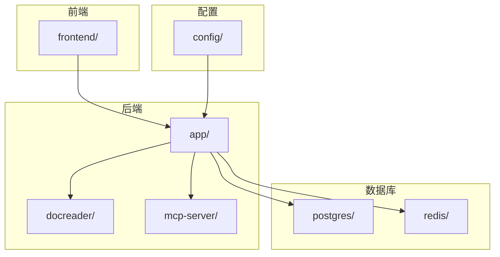
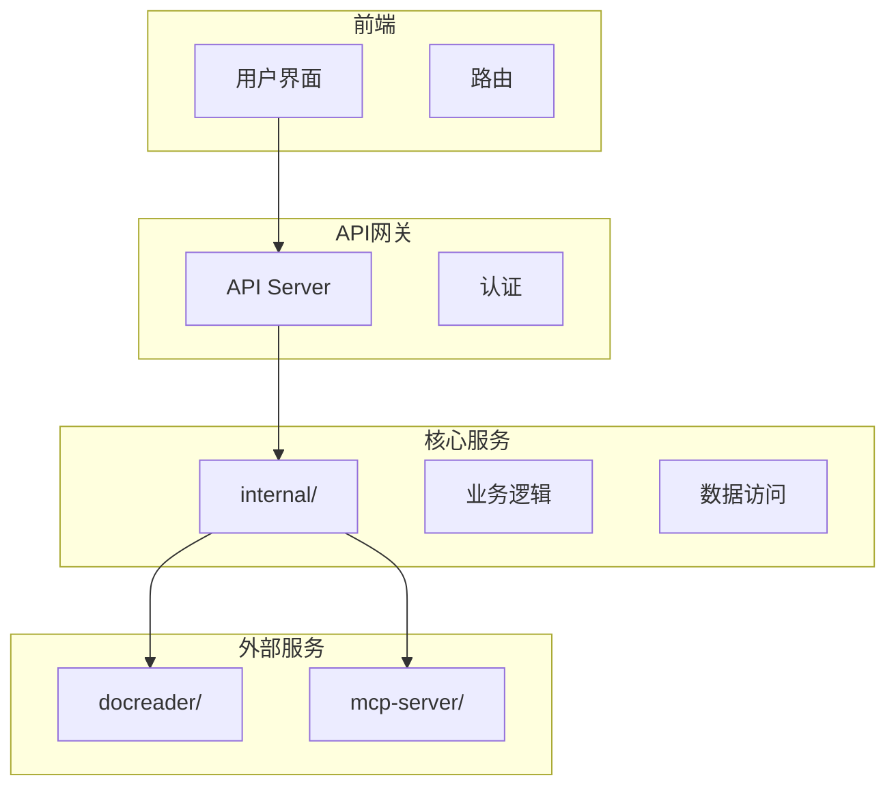
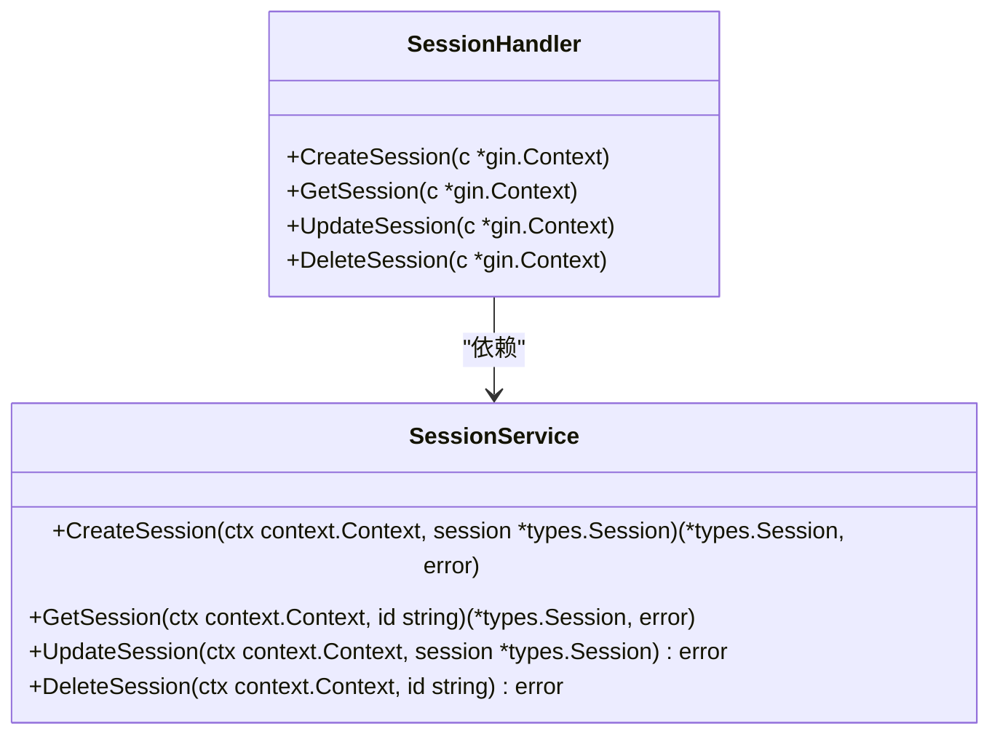
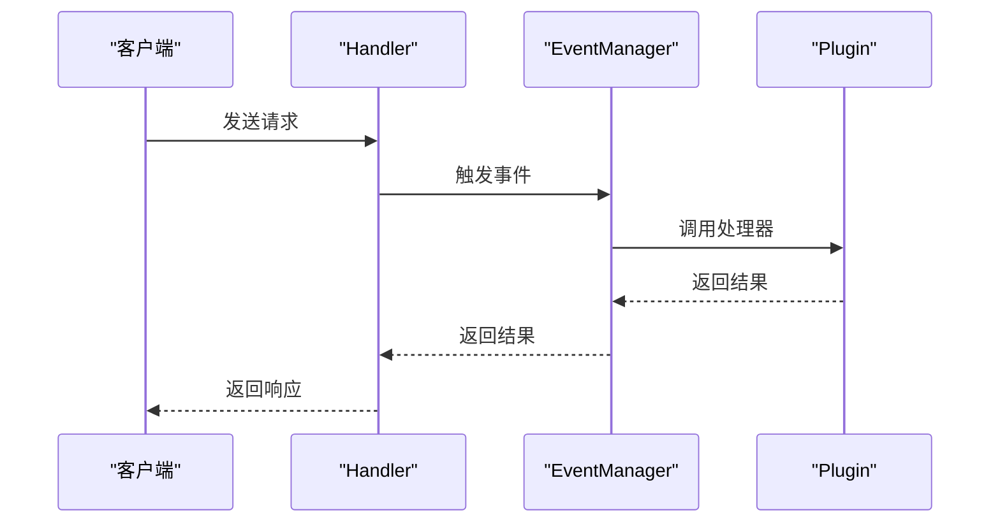
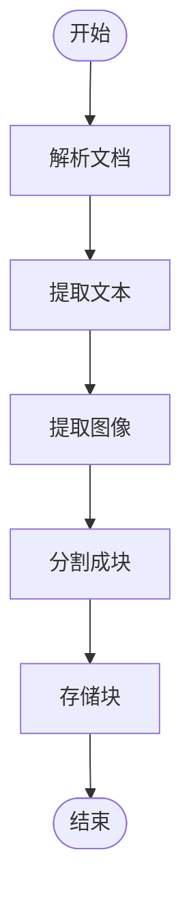
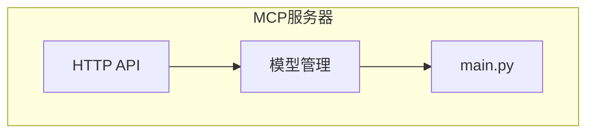
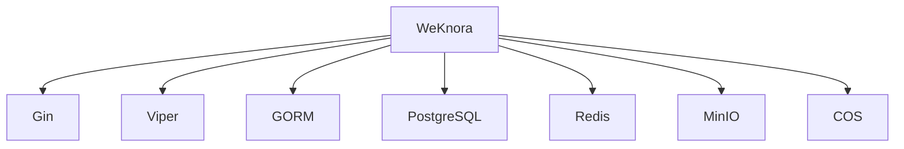

# 技术架构

<cite>
**本文档引用的文件**
- [config.yaml](file://config/config.yaml)
- [config.go](file://internal/config/config.go)
- [router.go](file://internal/router/router.go)
- [handler.go](file://internal/handler/session/handler.go)
- [chat_pipline.go](file://internal/application/service/chat_pipline/chat_pipline.go)
- [event.go](file://internal/event/event.go)
- [main.py](file://docreader/main.py)
- [main.py](file://mcp-server/main.py)
- [Dockerfile.docreader](file://docker/Dockerfile.docreader)
- [docker-compose.yml](file://docker-compose.yml)
- [package.json](file://frontend/package.json)
- [main.ts](file://frontend/src/main.ts)
</cite>

## 目录
1. [简介](#简介)
2. [项目结构](#项目结构)
3. [核心组件](#核心组件)
4. [架构概述](#架构概述)
5. [详细组件分析](#详细组件分析)
6. [依赖分析](#依赖分析)
7. [性能考虑](#性能考虑)
8. [故障排除指南](#故障排除指南)
9. [结论](#结论)

## 简介
WeKnora 是一个基于微服务架构的智能知识问答系统，旨在通过整合多种技术栈和组件，提供高效、可扩展的知识检索和对话服务。该系统采用Go语言作为主要后端开发语言，结合Python和Vue 3技术，构建了一个多层次、模块化的架构。WeKnora的核心设计理念是将前端、API网关（Gin）、核心业务逻辑（internal/）、文档解析服务（docreader/）和MCP服务器（mcp-server/）等组件分离，以实现高内聚、低耦合的系统设计。

系统通过HTTP和gRPC协议实现各组件之间的交互，并利用事件驱动架构（通过EventManager）来处理复杂的业务流程。WeKnora支持多种向量数据库（如Elasticsearch、Qdrant）和文件存储服务（如MinIO、COS），并通过配置文件（config.yaml）实现系统的可配置性和扩展性。此外，系统还集成了OpenTelemetry进行分布式追踪，确保系统的可观测性。

**Section sources**
- [config.yaml](file://config/config.yaml)
- [docker-compose.yml](file://docker-compose.yml)

## 项目结构
WeKnora项目的目录结构清晰地反映了其微服务架构的设计。项目根目录下包含多个关键子目录，每个子目录对应一个独立的组件或服务。`client/`目录包含了客户端相关的代码，`cmd/`目录用于存放命令行工具，`config/`目录存放配置文件，`dataset/`目录用于管理数据集，`docker/`目录包含Docker相关配置，`docreader/`目录实现了文档解析服务，`docs/`目录存放文档，`frontend/`目录是前端应用，`internal/`目录包含了核心业务逻辑，`mcp-server/`目录实现了MCP服务器，`migrations/`目录用于数据库迁移，`scripts/`目录存放脚本文件。

这种分层的目录结构不仅有助于代码的组织和维护，还便于团队协作和持续集成。每个组件都有明确的职责边界，使得系统易于扩展和维护。

**Diagram sources**
- [docker-compose.yml](file://docker-compose.yml)

**Section sources**
- [docker-compose.yml](file://docker-compose.yml)

## 核心组件
WeKnora的核心组件包括前端、API网关（Gin）、核心业务逻辑（internal/）、文档解析服务（docreader/）和MCP服务器（mcp-server/）。这些组件通过HTTP和gRPC协议进行交互，形成了一个完整的知识问答系统。

前端使用Vue 3框架构建，提供了用户友好的界面，支持多语言和响应式设计。API网关基于Gin框架，负责路由请求、认证和日志记录。核心业务逻辑位于`internal/`目录下，实现了会话管理、知识库操作、模型服务等功能。文档解析服务（docreader/）使用Python编写，能够解析多种格式的文档（如PDF、DOCX、HTML等），并提取其中的文本和图像信息。MCP服务器（mcp-server/）则负责处理模型上下文协议（MCP）相关的请求，支持与外部模型服务的集成。

**Section sources**
- [package.json](file://frontend/package.json)
- [main.ts](file://frontend/src/main.ts)
- [router.go](file://internal/router/router.go)
- [main.py](file://docreader/main.py)
- [main.py](file://mcp-server/main.py)

## 架构概述
WeKnora的系统架构是一个典型的微服务架构，由多个独立的服务组成，这些服务通过API网关进行通信。架构的核心是API网关（Gin），它接收来自前端的HTTP请求，并将其路由到相应的后端服务。后端服务包括核心业务逻辑服务、文档解析服务和MCP服务器，它们分别处理不同的业务需求。

系统采用分层架构，分为handler层、service层和repository层。handler层负责处理HTTP请求和响应，service层实现业务逻辑，repository层负责数据访问。这种分层设计使得代码结构清晰，易于维护和测试。

**Diagram sources**
- [router.go](file://internal/router/router.go)
- [handler.go](file://internal/handler/session/handler.go)

## 详细组件分析

### 核心业务逻辑分析
WeKnora的核心业务逻辑位于`internal/`目录下，主要包括会话管理、知识库操作、模型服务等模块。这些模块通过依赖注入容器（container）进行管理，确保了组件之间的松耦合。

#### 会话管理
会话管理模块负责创建、更新和删除会话。它通过`session.Handler`处理HTTP请求，并调用`sessionService`执行具体的业务逻辑。会话管理支持多种会话策略，如最大轮次、重写查询、回退策略等，这些策略可以通过配置文件进行调整。

**Diagram sources**
- [handler.go](file://internal/handler/session/handler.go)
- [agent_service.go](file://internal/application/service/agent_service.go)

#### 事件驱动架构
WeKnora采用了事件驱动架构，通过`EventManager`来处理各种事件。`EventManager`允许插件注册特定的事件处理器，当事件发生时，相应的处理器会被调用。这种设计使得系统具有高度的灵活性和可扩展性。

**Diagram sources**
- [chat_pipline.go](file://internal/application/service/chat_pipline/chat_pipline.go)
- [event.go](file://internal/event/event.go)

### 文档解析服务分析
文档解析服务（docreader/）是一个独立的Python服务，通过gRPC协议与主应用通信。它能够解析多种格式的文档，包括PDF、DOCX、HTML等，并提取其中的文本和图像信息。解析后的数据被分割成块（chunks），并存储在向量数据库中，以便后续的检索和搜索。

**Diagram sources**
- [main.py](file://docreader/main.py)
- [Dockerfile.docreader](file://docker/Dockerfile.docreader)

### MCP服务器分析
MCP服务器（mcp-server/）是一个独立的Python服务，负责处理模型上下文协议（MCP）相关的请求。它通过HTTP协议与主应用通信，支持与外部模型服务的集成。MCP服务器可以动态加载和卸载模型，提供了灵活的模型管理能力。

**Diagram sources**
- [main.py](file://mcp-server/main.py)

**Section sources**
- [main.py](file://docreader/main.py)
- [main.py](file://mcp-server/main.py)

## 依赖分析
WeKnora的依赖关系复杂但有序，主要依赖包括Go语言的标准库、第三方库（如Gin、Viper、GORM等）以及外部服务（如PostgreSQL、Redis、MinIO等）。这些依赖通过`go.mod`文件进行管理，确保了版本的一致性和可重复构建。

系统还依赖于多种外部服务，如PostgreSQL用于持久化存储，Redis用于缓存和会话管理，MinIO或COS用于文件存储。这些服务通过环境变量进行配置，使得系统可以在不同的环境中灵活部署。

**Diagram sources**
- [go.mod](file://go.mod)
- [docker-compose.yml](file://docker-compose.yml)

**Section sources**
- [go.mod](file://go.mod)
- [docker-compose.yml](file://docker-compose.yml)

## 性能考虑
WeKnora在设计时充分考虑了性能问题。系统通过使用高效的数据库查询、缓存机制和并发处理来提高响应速度。例如，使用Redis缓存频繁访问的数据，减少数据库的压力；使用goroutine池（ants）来管理并发任务，避免资源耗尽。

此外，系统还支持多种向量数据库（如Elasticsearch、Qdrant），这些数据库专为高维向量搜索优化，能够快速检索相似的内容。通过配置文件中的参数（如`embedding_top_k`、`rerank_top_k`等），可以调整搜索的精度和速度，以满足不同场景的需求。

## 故障排除指南
在使用WeKnora时，可能会遇到一些常见问题，如服务启动失败、数据库连接错误、模型加载失败等。以下是一些常见的故障排除步骤：

1. **检查环境变量**：确保所有必要的环境变量都已正确设置，特别是数据库连接信息、存储服务配置等。
2. **查看日志**：通过查看应用日志（通常位于`/var/log/weknora/`目录下）来定位问题。日志中会记录详细的错误信息和堆栈跟踪。
3. **验证服务状态**：使用`docker-compose ps`命令检查各个服务的状态，确保它们都在运行。
4. **测试网络连接**：使用`curl`或`ping`命令测试服务之间的网络连接，确保没有网络问题。
5. **检查配置文件**：确认`config.yaml`文件中的配置项是否正确，特别是端口号、地址等。

**Section sources**
- [config.yaml](file://config/config.yaml)
- [docker-compose.yml](file://docker-compose.yml)

## 结论
WeKnora是一个功能强大、架构清晰的智能知识问答系统。通过采用微服务架构和事件驱动设计，系统实现了高内聚、低耦合的模块化结构，便于扩展和维护。系统支持多种技术栈和外部服务，具有良好的可配置性和灵活性。未来，WeKnora可以通过引入更多的AI模型和优化算法，进一步提升其性能和用户体验。