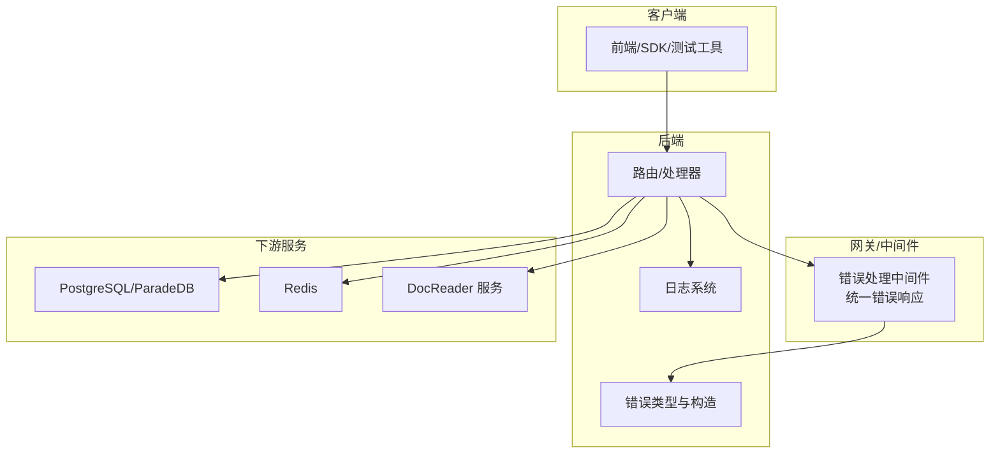
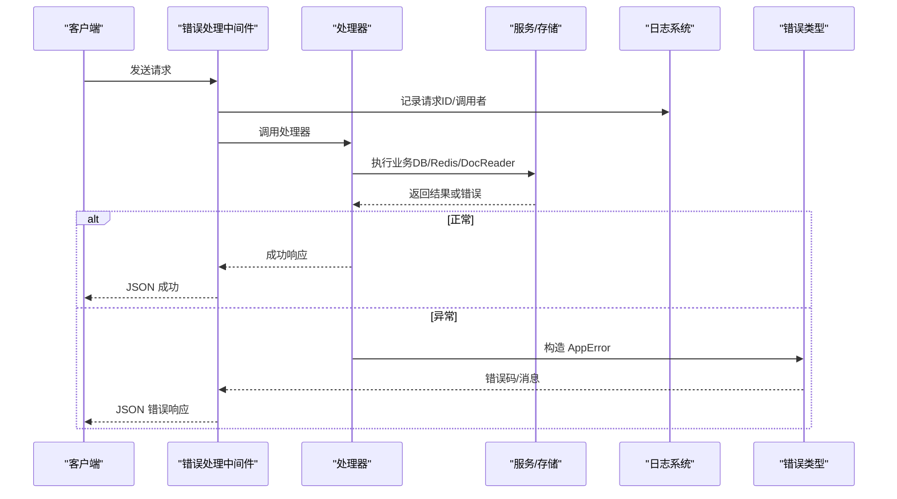
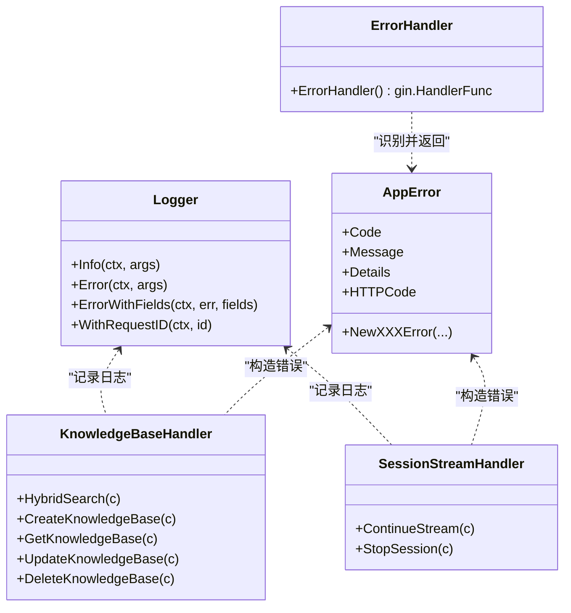

# 故障排除

<cite>
**本文引用的文件**
- [QA.md](file://docs/QA.md)
- [start_all.sh](file://scripts/start_all.sh)
- [docker-compose.yml](file://docker-compose.yml)
- [logger.go](file://internal/logger/logger.go)
- [errors.go](file://internal/errors/errors.go)
- [error_handler.go](file://internal/middleware/error_handler.go)
- [knowledgebase.go](file://internal/handler/knowledgebase.go)
- [stream.go](file://internal/handler/session/stream.go)
- [parser.py](file://docreader/parser/parser.py)
- [docx_parser.py](file://docreader/parser/docx_parser.py)
- [image_parser.py](file://docreader/parser/image_parser.py)
- [base_parser.py](file://docreader/parser/base_parser.py)
- [README.md](file://docs/api/README.md)
- [request.ts](file://frontend/src/utils/request.ts)
</cite>

## 目录
1. [简介](#简介)
2. [项目结构与定位](#项目结构与定位)
3. [核心组件与排障入口](#核心组件与排障入口)
4. [架构总览与排障路径](#架构总览与排障路径)
5. [常见问题与逐项排查](#常见问题与逐项排查)
6. [依赖关系与日志/错误映射](#依赖关系与日志错误映射)
7. [性能与稳定性建议](#性能与稳定性建议)
8. [故障排除清单](#故障排除清单)
9. [结论](#结论)

## 简介
本指南面向使用 WeKnora 的用户与开发者，聚焦服务启动失败、API 调用错误、文档解析异常等常见问题，结合 internal/logger/ 生成的日志与 internal/errors/ 定义的错误类型，提供可操作的诊断步骤与解决方案。目标是帮助你在最短时间内定位问题、恢复服务。

## 项目结构与定位
- 后端服务通过 Gin 路由与中间件处理请求，统一错误响应格式。
- 日志通过自定义 Logger 提供结构化输出，支持请求 ID、调用者信息等。
- 错误体系以 AppError 为核心，配合中间件统一返回。
- 文档解析模块位于 docreader，提供多种格式解析与 OCR/Caption 能力。
- 启动脚本与 docker-compose 负责服务编排与健康检查。

图表来源
- [docker-compose.yml](file://docker-compose.yml#L1-L254)
- [error_handler.go](file://internal/middleware/error_handler.go#L1-L46)
- [logger.go](file://internal/logger/logger.go#L1-L281)
- [errors.go](file://internal/errors/errors.go#L1-L192)

章节来源
- [docker-compose.yml](file://docker-compose.yml#L1-L254)

## 核心组件与排障入口
- 日志系统：提供结构化日志、请求 ID、调用者信息，便于串联一次请求的全链路。
- 错误体系：统一错误码与 HTTP 状态映射，便于前端与 SDK 快速识别。
- 中间件：统一捕获并转换错误，保证对外一致的错误响应。
- 文档解析：多格式解析、OCR/Caption、日志告警，便于定位解析失败原因。
- 启动脚本：一键启动/停止、环境检查、日志跟踪，适合快速复现与回溯。

章节来源
- [logger.go](file://internal/logger/logger.go#L1-L281)
- [errors.go](file://internal/errors/errors.go#L1-L192)
- [error_handler.go](file://internal/middleware/error_handler.go#L1-L46)
- [parser.py](file://docreader/parser/parser.py#L120-L147)
- [docx_parser.py](file://docreader/parser/docx_parser.py#L165-L248)
- [image_parser.py](file://docreader/parser/image_parser.py#L1-L44)
- [base_parser.py](file://docreader/parser/base_parser.py#L108-L147)
- [start_all.sh](file://scripts/start_all.sh#L645-L729)

## 架构总览与排障路径
- 请求进入后端，经中间件记录日志、鉴权、追踪；处理器执行业务逻辑；错误通过中间件统一返回。
- 文档解析由 DocReader 服务负责，解析失败会在日志中记录详细信息与堆栈。
- 启动脚本提供健康检查与日志输出，便于快速定位容器/服务异常。

图表来源
- [error_handler.go](file://internal/middleware/error_handler.go#L1-L46)
- [errors.go](file://internal/errors/errors.go#L1-L192)
- [logger.go](file://internal/logger/logger.go#L1-L281)

## 常见问题与逐项排查

### 1. 服务启动失败/容器无法健康
- 现象
  - docker-compose 启动后容器很快退出或健康检查失败。
  - 前端/后端无法访问，或健康探针报错。
- 诊断步骤
  - 使用启动脚本查看容器状态与日志：参考“如何查看日志？”与“如何启动和停止服务？”。
  - 关注关键服务健康检查：app、docreader、postgres、redis、neo4j、jaeger。
  - 检查环境变量与卷挂载是否正确。
- 解决方案
  - 若健康检查失败，先拉取最新镜像或使用 --no-pull 仅使用本地镜像进行对比。
  - 确认数据库初始化 SQL 已执行，必要时清理数据卷后重试。
  - 若本地 Ollama 为远程服务，确认地址可达；若为本地服务，确认端口占用与服务状态。
- 参考
  - [QA.md](file://docs/QA.md#L1-L18)
  - [docker-compose.yml](file://docker-compose.yml#L1-L254)
  - [start_all.sh](file://scripts/start_all.sh#L313-L383)

章节来源
- [QA.md](file://docs/QA.md#L1-L18)
- [docker-compose.yml](file://docker-compose.yml#L1-L254)
- [start_all.sh](file://scripts/start_all.sh#L313-L383)

### 2. 上传文档后无法解析/解析为空
- 现象
  - 文档上传成功，但解析结果为空或只有少量内容。
- 诊断步骤
  - 查看 DocReader 日志，关注解析器返回空内容、空块、首块长度等告警。
  - 对图片类文档，确认 OCR/Caption 是否启用，以及多模态配置是否正确。
  - 确认存储（COS/MinIO）权限为“公有读”，否则解析模块无法访问文件。
- 解决方案
  - 启用多模态并正确配置 VLM 模型相关环境变量。
  - 确保存储权限开放，或更换可访问的存储后重试。
  - 对 DOCX 等复杂文档，观察简化解析失败时的回退日志与堆栈。
- 参考
  - [QA.md](file://docs/QA.md#L20-L98)
  - [parser.py](file://docreader/parser/parser.py#L120-L147)
  - [docx_parser.py](file://docreader/parser/docx_parser.py#L165-L248)
  - [image_parser.py](file://docreader/parser/image_parser.py#L1-L44)
  - [base_parser.py](file://docreader/parser/base_parser.py#L108-L147)

章节来源
- [QA.md](file://docs/QA.md#L20-L98)
- [parser.py](file://docreader/parser/parser.py#L120-L147)
- [docx_parser.py](file://docreader/parser/docx_parser.py#L165-L248)
- [image_parser.py](file://docreader/parser/image_parser.py#L1-L44)
- [base_parser.py](file://docreader/parser/base_parser.py#L108-L147)

### 3. API 调用错误（400/401/403/404/500）
- 现象
  - 前端/SDK 收到统一错误响应，包含 code/message/details。
- 诊断步骤
  - 检查请求头是否包含 X-API-Key 与可选 X-Request-ID。
  - 查看后端日志中的请求 ID，定位对应请求的完整链路。
  - 根据错误码判断是参数错误、未授权、权限不足还是服务内部错误。
- 解决方案
  - 400：修正请求参数或必填字段，查看 details 获取更细粒度提示。
  - 401：确认 API Key 有效且未过期。
  - 403：确认租户权限与资源归属。
  - 404：确认资源 ID 存在。
  - 500：查看后端日志堆栈，定位具体服务/存储异常。
- 参考
  - [README.md](file://docs/api/README.md#L1-L55)
  - [error_handler.go](file://internal/middleware/error_handler.go#L1-L46)
  - [errors.go](file://internal/errors/errors.go#L1-L192)
  - [request.ts](file://frontend/src/utils/request.ts#L157-L182)

章节来源
- [README.md](file://docs/api/README.md#L1-L55)
- [error_handler.go](file://internal/middleware/error_handler.go#L1-L46)
- [errors.go](file://internal/errors/errors.go#L1-L192)
- [request.ts](file://frontend/src/utils/request.ts#L157-L182)

### 4. 知识库/搜索相关错误
- 现象
  - 创建/更新/删除知识库失败；混合检索无结果或报错。
- 诊断步骤
  - 检查处理器对知识库 ID 的校验、租户权限校验与参数绑定。
  - 观察日志中“执行混合检索”“结果数量”等关键信息。
- 解决方案
  - 确认知识库 ID 与租户匹配；修正必填字段与配置。
  - 若检索无结果，检查向量化/关键词索引是否建立成功。
- 参考
  - [knowledgebase.go](file://internal/handler/knowledgebase.go#L30-L105)
  - [knowledgebase.go](file://internal/handler/knowledgebase.go#L147-L253)

章节来源
- [knowledgebase.go](file://internal/handler/knowledgebase.go#L30-L105)
- [knowledgebase.go](file://internal/handler/knowledgebase.go#L147-L253)

### 5. 流式会话（SSE）异常
- 现象
  - 继续流式响应时报“找不到不完整消息”“无流事件”或连接提前断开。
- 诊断步骤
  - 检查 ContinueStream 的会话/消息 ID 校验、消息存在性与租户归属。
  - 观察事件拉取偏移量与完成事件标记，确认是否已结束。
- 解决方案
  - 确保传入正确的 session_id 与 message_id；确认消息属于当前租户。
  - 若已完成，前端应接收完成事件；若未完成，检查事件管理器与存储一致性。
- 参考
  - [stream.go](file://internal/handler/session/stream.go#L1-L164)
  - [stream.go](file://internal/handler/session/stream.go#L166-L270)

章节来源
- [stream.go](file://internal/handler/session/stream.go#L1-L164)
- [stream.go](file://internal/handler/session/stream.go#L166-L270)

## 依赖关系与日志/错误映射

图表来源
- [logger.go](file://internal/logger/logger.go#L1-L281)
- [errors.go](file://internal/errors/errors.go#L1-L192)
- [error_handler.go](file://internal/middleware/error_handler.go#L1-L46)
- [knowledgebase.go](file://internal/handler/knowledgebase.go#L30-L105)
- [stream.go](file://internal/handler/session/stream.go#L1-L164)

章节来源
- [logger.go](file://internal/logger/logger.go#L1-L281)
- [errors.go](file://internal/errors/errors.go#L1-L192)
- [error_handler.go](file://internal/middleware/error_handler.go#L1-L46)
- [knowledgebase.go](file://internal/handler/knowledgebase.go#L30-L105)
- [stream.go](file://internal/handler/session/stream.go#L1-L164)

## 性能与稳定性建议
- 日志级别与输出：生产环境建议 Info 级别，问题排查时临时提升至 Debug。
- 请求追踪：为每次请求设置 X-Request-ID，便于跨服务串联日志。
- 资源隔离：合理设置并发池大小、超时与重试策略，避免上游压力传导。
- 存储与网络：确保 DocReader 与存储（COS/MinIO）网络连通与权限正确，减少重试与失败。
- 健康检查：关注 docker-compose 中各服务健康检查配置，及时发现慢启动或异常。

[本节为通用建议，不直接分析具体文件]

## 故障排除清单
- 启动阶段
  - 使用启动脚本检查 Docker/Compose 环境与容器状态。
  - 关注 app/docreader/postgres 健康检查与最近日志。
- 文档解析
  - 查看 DocReader 日志中“空内容/空块/首块长度”的告警。
  - 确认多模态配置与存储权限。
- API 调用
  - 确认请求头包含 X-API-Key 与 X-Request-ID。
  - 根据错误响应中的 code/message/details 快速定位。
- 知识库/搜索
  - 校验知识库 ID、租户归属与必填参数。
  - 检查向量化/关键词索引状态。
- 流式会话
  - 确认 session_id/message_id 正确且属于当前租户。
  - 关注完成事件与事件偏移量。

章节来源
- [start_all.sh](file://scripts/start_all.sh#L645-L729)
- [docker-compose.yml](file://docker-compose.yml#L1-L254)
- [parser.py](file://docreader/parser/parser.py#L120-L147)
- [README.md](file://docs/api/README.md#L1-L55)
- [knowledgebase.go](file://internal/handler/knowledgebase.go#L30-L105)
- [stream.go](file://internal/handler/session/stream.go#L1-L164)

## 结论
通过“启动脚本 + 健康检查 + 结构化日志 + 统一错误响应”的组合，WeKnora 能够快速定位服务、API、解析与会话等环节的问题。建议在日常运维中固定使用 X-Request-ID 进行请求追踪，并结合错误码与日志字段进行闭环排查，从而缩短故障恢复时间。