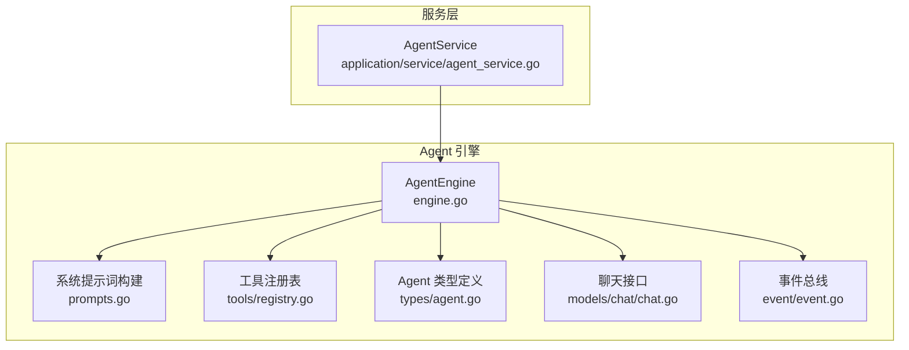
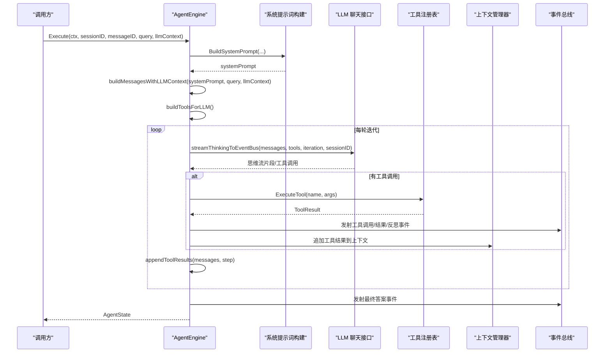
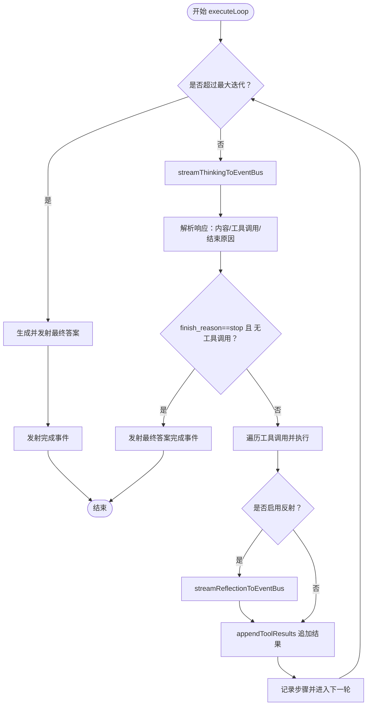
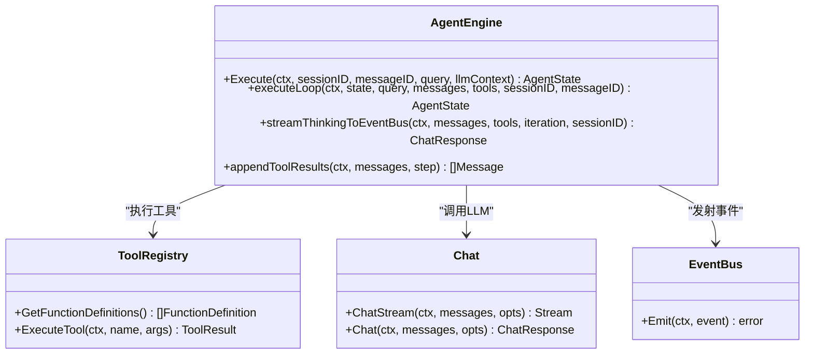
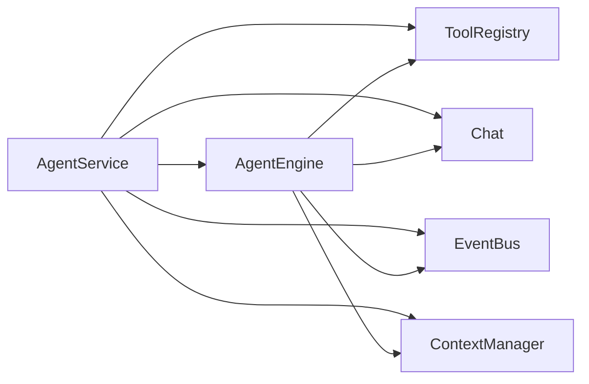

# Agent引擎

<cite>
**本文引用的文件**
- [engine.go](file://internal/agent/engine.go)
- [const.go](file://internal/agent/const.go)
- [prompts.go](file://internal/agent/prompts.go)
- [registry.go](file://internal/agent/tools/registry.go)
- [agent.go](file://internal/types/agent.go)
- [chat.go](file://internal/models/chat/chat.go)
- [event.go](file://internal/event/event.go)
- [agent_service.go](file://internal/application/service/agent_service.go)
- [sequentialthinking.go](file://internal/agent/tools/sequentialthinking.go)
</cite>

## 目录
1. [简介](#简介)
2. [项目结构](#项目结构)
3. [核心组件](#核心组件)
4. [架构总览](#架构总览)
5. [详细组件分析](#详细组件分析)
6. [依赖关系分析](#依赖关系分析)
7. [性能考量](#性能考量)
8. [故障排查指南](#故障排查指南)
9. [结论](#结论)
10. [附录](#附录)

## 简介
本技术文档围绕 Agent 引擎的核心实现，聚焦于 internal/agent/engine.go 中的 AgentEngine 结构体与 Execute 方法，系统阐述 ReAct 代理“思考-行动-观察”循环的工作机制。文档将详细说明：
- 初始化系统提示词（BuildSystemPrompt）
- 构建 LLM 消息上下文
- 调用 executeLoop 主循环
- executeLoop 的执行流程：通过 streamThinkingToEventBus 调用 LLM 进行思考、解析并执行工具调用（toolRegistry.ExecuteTool）、通过 appendToolResults 将工具结果和观察结果追加回对话历史
- 默认配置（DefaultAgentMaxIterations）与提示词模板（ProgressiveRAGSystemPromptWithWeb）的可配置性
- 引擎集成指南：通过 NewAgentEngine 创建实例并与聊天管道集成
- 常见问题：执行超时、循环调用、上下文管理错误的定位与解决

## 项目结构
Agent 引擎位于 internal/agent 目录，核心文件如下：
- engine.go：AgentEngine 结构体、Execute、executeLoop、工具调用与上下文管理等
- prompts.go：系统提示词构建与占位符渲染
- const.go：默认配置常量
- tools/registry.go：工具注册与执行
- types/agent.go：Agent 配置、状态、工具调用与结果的数据结构
- models/chat/chat.go：LLM 聊天接口与消息结构
- event/event.go：事件总线与事件类型
- application/service/agent_service.go：服务层创建 AgentEngine 并注册工具
- agent/tools/sequentialthinking.go：思维工具实现（作为思考阶段的工具）

图表来源
- [engine.go](file://internal/agent/engine.go#L1-L120)
- [prompts.go](file://internal/agent/prompts.go#L242-L410)
- [registry.go](file://internal/agent/tools/registry.go#L1-L115)
- [agent.go](file://internal/types/agent.go#L1-L157)
- [chat.go](file://internal/models/chat/chat.go#L1-L104)
- [event.go](file://internal/event/event.go#L1-L120)
- [agent_service.go](file://internal/application/service/agent_service.go#L64-L162)

章节来源
- [engine.go](file://internal/agent/engine.go#L1-L120)
- [prompts.go](file://internal/agent/prompts.go#L242-L410)
- [registry.go](file://internal/agent/tools/registry.go#L1-L115)
- [agent.go](file://internal/types/agent.go#L1-L157)
- [chat.go](file://internal/models/chat/chat.go#L1-L104)
- [event.go](file://internal/event/event.go#L1-L120)
- [agent_service.go](file://internal/application/service/agent_service.go#L64-L162)

## 核心组件
- AgentEngine：封装 Agent 执行所需的配置、工具注册表、LLM 模型、事件总线、上下文管理器、会话 ID、系统提示词模板等，提供 Execute 与 executeLoop 等关键方法。
- AgentConfig：运行期 Agent 配置，包含最大迭代次数、温度、允许工具、Web 搜索开关、自定义系统提示模板等。
- AgentState/AgentStep/ToolCall：记录每轮思考、工具调用、反射与最终答案等状态。
- ToolRegistry：统一注册与执行工具，暴露 GetFunctionDefinitions、ExecuteTool 等能力。
- Chat 接口：抽象 LLM 聊天能力，支持非流式与流式调用。
- EventBus：事件发布订阅，用于实时反馈思考、工具调用、工具结果、反思与最终答案等。

章节来源
- [engine.go](file://internal/agent/engine.go#L25-L70)
- [agent.go](file://internal/types/agent.go#L10-L85)
- [agent.go](file://internal/types/agent.go#L101-L157)
- [registry.go](file://internal/agent/tools/registry.go#L1-L115)
- [chat.go](file://internal/models/chat/chat.go#L62-L104)
- [event.go](file://internal/event/event.go#L1-L120)

## 架构总览
Agent 引擎以 ReAct 循环为核心：每轮迭代依次进行“思考（LLM 思维流）→ 行动（工具调用）→ 观察（将工具结果追加到上下文）”。引擎通过 BuildSystemPrompt 构建系统提示词，通过 buildMessagesWithLLMContext 组装消息，通过 streamThinkingToEventBus 流式获取 LLM 思维与工具调用，通过 toolRegistry.ExecuteTool 执行工具，再通过 appendToolResults 将工具结果与观察写入上下文并持久化。

图表来源
- [engine.go](file://internal/agent/engine.go#L72-L148)
- [engine.go](file://internal/agent/engine.go#L150-L487)
- [engine.go](file://internal/agent/engine.go#L489-L578)
- [engine.go](file://internal/agent/engine.go#L676-L753)
- [registry.go](file://internal/agent/tools/registry.go#L71-L115)
- [prompts.go](file://internal/agent/prompts.go#L242-L327)
- [chat.go](file://internal/models/chat/chat.go#L62-L104)
- [event.go](file://internal/event/event.go#L42-L66)

## 详细组件分析

### AgentEngine 结构体与初始化
- 字段含义
  - config：Agent 配置（温度、最大迭代、允许工具、Web 搜索开关、自定义系统提示模板等）
  - toolRegistry：工具注册表，负责工具定义与执行
  - chatModel：LLM 聊天接口，支持流式与非流式
  - eventBus：事件总线，用于发射思考、工具调用、工具结果、反思、最终答案等事件
  - knowledgeBasesInfo：知识库信息，用于系统提示词渲染
  - contextManager：上下文管理器，负责将对话历史写入持久化存储
  - sessionID：会话标识，用于上下文隔离
  - systemPromptTemplate：自定义系统提示模板（可选）
- NewAgentEngine：创建 AgentEngine 实例，默认事件总线为空则自动创建

章节来源
- [engine.go](file://internal/agent/engine.go#L25-L70)
- [agent_service.go](file://internal/application/service/agent_service.go#L149-L161)

### Execute 方法：驱动 ReAct 循环
- 初始化日志与 Pipeline 信息
- 构建系统提示词（BuildSystemPrompt）
- 构建消息上下文（buildMessagesWithLLMContext）
- 构建工具定义（buildToolsForLLM）
- 调用 executeLoop 主循环
- 失败时通过 EventBus 发射错误事件

章节来源
- [engine.go](file://internal/agent/engine.go#L72-L148)

### executeLoop：主循环执行流程
- 控制最大迭代次数（DefaultAgentMaxIterations）
- 每轮：
  - 通过 streamThinkingToEventBus 流式获取 LLM 思维与工具调用
  - 若 finish_reason 为 stop 且无工具调用，则标记完成并发射最终答案事件
  - 解析工具调用：逐个执行 toolRegistry.ExecuteTool，发射工具调用/结果/内部工具事件；可选反射（Reflection）
  - 将工具结果与观察写入消息历史并持久化（appendToolResults）
  - 记录 AgentStep，进入下一轮
- 达到最大迭代仍未完成：通过 streamFinalAnswerToEventBus 生成最终答案并发射事件

图表来源
- [engine.go](file://internal/agent/engine.go#L150-L487)
- [engine.go](file://internal/agent/engine.go#L489-L578)
- [engine.go](file://internal/agent/engine.go#L580-L753)
- [engine.go](file://internal/agent/engine.go#L755-L859)

章节来源
- [engine.go](file://internal/agent/engine.go#L150-L487)

### BuildSystemPrompt：系统提示词构建
- 根据 webSearchEnabled 选择带/不带 Web 搜索的提示词模板
- 支持自定义模板（ResolveSystemPrompt）
- 占位符渲染：{{knowledge_bases}}、{{web_search_status}}、{{current_time}}

章节来源
- [prompts.go](file://internal/agent/prompts.go#L242-L327)
- [prompts.go](file://internal/agent/prompts.go#L329-L410)
- [agent.go](file://internal/types/agent.go#L67-L85)

### 构建消息上下文与工具定义
- buildMessagesWithLLMContext：组装 system + 历史消息 + 当前用户查询
- buildToolsForLLM：从工具注册表提取函数定义供 LLM 函数调用

章节来源
- [engine.go](file://internal/agent/engine.go#L870-L898)
- [engine.go](file://internal/agent/engine.go#L489-L505)

### 工具调用与结果追加
- streamThinkingToEventBus：流式发射思考片段与工具调用事件
- toolRegistry.ExecuteTool：按名称执行工具，返回 ToolResult
- appendToolResults：将工具调用与工具结果（role=tool）追加到消息历史，并写入上下文管理器

图表来源
- [engine.go](file://internal/agent/engine.go#L489-L578)
- [registry.go](file://internal/agent/tools/registry.go#L71-L115)
- [chat.go](file://internal/models/chat/chat.go#L62-L104)
- [event.go](file://internal/event/event.go#L120-L203)

章节来源
- [engine.go](file://internal/agent/engine.go#L489-L578)
- [registry.go](file://internal/agent/tools/registry.go#L71-L115)

### 可配置性与默认值
- 默认配置（const.go）：DefaultAgentMaxIterations=20、DefaultAgentTemperature=0.7、ReflectionEnabled=false、UseCustomSystemPrompt=false
- AgentConfig：MaxIterations、Temperature、AllowedTools、WebSearchEnabled、SystemPromptWebEnabled/SystemPromptWebDisabled、UseCustomSystemPrompt、WebSearchMaxResults
- 服务层根据配置动态注册工具（含 Web 搜索工具），并可选择自定义系统提示模板

章节来源
- [const.go](file://internal/agent/const.go#L1-L13)
- [agent.go](file://internal/types/agent.go#L10-L31)
- [agent_service.go](file://internal/application/service/agent_service.go#L164-L251)

### 引擎集成指南
- 通过 agent_service.CreateAgentEngine 创建 AgentEngine：
  - 注册工具（默认工具集，若开启 Web 搜索则额外注册 web_search/web_fetch）
  - 获取知识库详情用于系统提示词渲染
  - 可选使用自定义系统提示模板
  - 提供 chat.Chat、ContextManager、EventBus、sessionID
- 在聊天管道中订阅 Agent 事件（thought、tool_call、tool_result、reflection、final_answer、complete），并将其转换为前端流式展示

章节来源
- [agent_service.go](file://internal/application/service/agent_service.go#L64-L162)

### 思维工具（SequentialThinking）的作用
- 作为思考阶段的工具之一，提供链式思维与分支/修订能力
- 参数校验与历史记录，便于在多轮思考中保持上下文一致性

章节来源
- [sequentialthinking.go](file://internal/agent/tools/sequentialthinking.go#L1-L311)

## 依赖关系分析
- AgentEngine 依赖：
  - ToolRegistry：工具定义与执行
  - Chat 接口：LLM 聊天能力
  - EventBus：事件发射
  - ContextManager：上下文持久化
  - AgentConfig/AgentState/ToolCall：状态与配置
- 服务层 AgentService 负责：
  - 注册工具（含 MCP 工具）
  - 构建知识库信息
  - 选择系统提示模板
  - 创建 AgentEngine

图表来源
- [agent_service.go](file://internal/application/service/agent_service.go#L64-L162)
- [engine.go](file://internal/agent/engine.go#L25-L70)

章节来源
- [agent_service.go](file://internal/application/service/agent_service.go#L64-L162)
- [engine.go](file://internal/agent/engine.go#L25-L70)

## 性能考量
- 流式输出：通过 streamThinkingToEventBus 与 streamLLMToEventBus 分片发射，降低首屏延迟
- 上下文管理：appendToolResults 同步写入上下文管理器，注意在高并发场景下的持久化开销
- 工具执行：toolRegistry.ExecuteTool 对每个工具调用进行独立计时与日志，便于定位慢工具
- 最大迭代限制：DefaultAgentMaxIterations=20，避免长时间循环导致资源占用过高

[本节为通用建议，无需特定文件来源]

## 故障排查指南
- 执行超时
  - 检查 LLM 调用链路（ChatStream）是否正常返回；关注 streamThinkingToEventBus 的错误路径
  - 调整 Temperature 与 Tools 数量，减少模型推理负担
- 循环调用
  - 确认 MaxIterations 设置合理；检查工具返回是否导致反复触发同一工具
  - 在 Reflection 启用时，确认反射逻辑不会无限生成新思考
- 上下文管理错误
  - appendToolResults 写入失败时会记录警告；检查 ContextManager 的 AddMessage 实现与权限
  - 确保 sessionID 正确传递，避免跨会话写入
- 工具参数解析失败
  - 工具调用参数 JSON 解析失败时会跳过该工具；检查工具参数 Schema 与调用端传参
- 事件未被消费
  - 确认 EventBus 已注册对应事件处理器；检查 asyncMode 与同步/异步处理策略

章节来源
- [engine.go](file://internal/agent/engine.go#L260-L378)
- [engine.go](file://internal/agent/engine.go#L507-L578)
- [event.go](file://internal/event/event.go#L120-L203)

## 结论
Agent 引擎以清晰的 ReAct 循环与事件驱动架构实现了可控、可观测、可扩展的智能代理执行。通过 BuildSystemPrompt 与工具注册表，引擎具备良好的可配置性；通过流式事件与上下文持久化，能够支撑前端实时反馈与会话续写。建议在生产环境中合理设置 MaxIterations、优化工具执行链路，并完善事件订阅与错误处理，以获得稳定高效的用户体验。

[本节为总结，无需特定文件来源]

## 附录
- 常用事件类型（Agent 相关）
  - thought、tool_call、tool_result、reflection、final_answer、complete
- 常用提示词模板
  - ProgressiveRAGSystemPromptWithWeb / WithoutWeb
- 默认配置
  - DefaultAgentMaxIterations、DefaultAgentTemperature、DefaultAgentReflectionEnabled、DefaultUseCustomSystemPrompt

章节来源
- [event.go](file://internal/event/event.go#L42-L66)
- [prompts.go](file://internal/agent/prompts.go#L255-L410)
- [const.go](file://internal/agent/const.go#L1-L13)