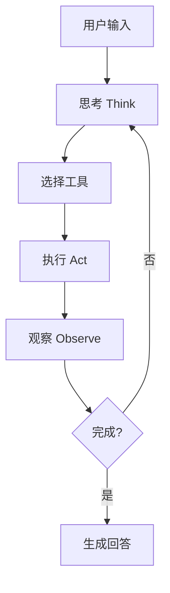
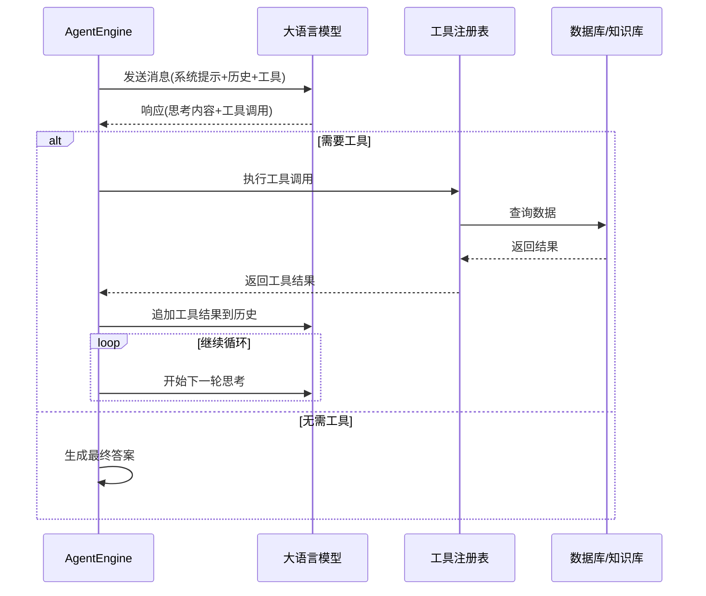
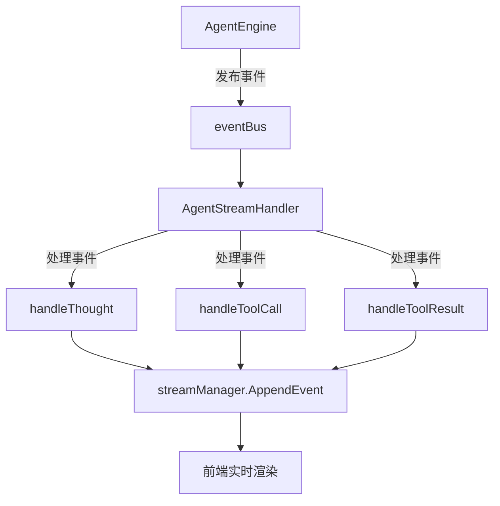

# Agent模式

<cite>
**本文档引用文件**   
- [engine.go](file://internal/agent/engine.go)
- [prompts.go](file://internal/agent/prompts.go)
- [registry.go](file://internal/agent/tools/registry.go)
- [chat_pipline.go](file://internal/application/service/chat_pipline/chat_pipline.go)
- [MCP功能使用说明.md](file://docs/MCP功能使用说明.md)
- [tool.go](file://internal/agent/tools/tool.go)
- [knowledge_search.go](file://internal/agent/tools/knowledge_search.go)
- [web_search.go](file://internal/agent/tools/web_search.go)
- [mcp_tool.go](file://internal/agent/tools/mcp_tool.go)
- [agent.go](file://internal/types/agent.go)
- [definitions.go](file://internal/agent/tools/definitions.go)
- [const.go](file://internal/agent/const.go)
- [McpSettings.vue](file://frontend/src/views/settings/McpSettings.vue)
- [agent_service.go](file://internal/application/service/agent_service.go)
</cite>

## 目录
1. [简介](#简介)
2. [ReACT Agent架构](#react-agent架构)
3. [执行循环：思考-行动-观察](#执行循环思考-行动-观察)
4. [系统提示词与工具调用](#系统提示词与工具调用)
5. [工具注册与调用机制](#工具注册与调用机制)
6. [与聊天管道的集成](#与聊天管道的集成)
7. [Agent模式配置指南](#agent模式配置指南)
8. [调试与常见问题](#调试与常见问题)
9. [MCP服务开发与集成](#mcp服务开发与集成)
10. [结论](#结论)

## 简介
Agent模式是WeKnora系统中的核心智能推理功能，它基于ReACT（Reasoning-Acting-Criticism-Tool use）架构实现多轮推理。该模式通过模拟人类的思考过程，将复杂问题分解为一系列可执行的步骤，利用内置工具和外部MCP服务进行信息检索和处理，最终生成准确、可追溯的答案。本技术文档深入解析Agent模式的实现细节，涵盖从执行循环、提示词工程到工具集成的完整技术栈。

**Section sources**
- [engine.go](file://internal/agent/engine.go#L1-L898)
- [prompts.go](file://internal/agent/prompts.go#L1-L410)

## ReACT Agent架构
ReACT Agent架构是WeKnora智能推理的核心，它通过“思考-行动-观察”的循环实现多步推理。AgentEngine作为核心引擎，协调整个推理过程。它接收用户查询和对话历史，通过系统提示词引导大语言模型（LLM）进行思考，选择合适的工具执行操作，并将结果作为新的观察输入，形成闭环。这种架构允许Agent处理复杂、需要多步检索和验证的问题，而不仅仅是简单的问答。



**Diagram sources **
- [engine.go](file://internal/agent/engine.go#L25-L487)
- [CLAUDE.md](file://internal/agent/CLAUDE.md#L52-L64)

**Section sources**
- [engine.go](file://internal/agent/engine.go#L25-L487)
- [const.go](file://internal/agent/const.go#L1-L13)

## 执行循环：思考-行动-观察
Agent的执行循环是其智能推理的核心机制，由`AgentEngine.executeLoop`方法驱动。该循环在`AgentConfig.MaxIterations`限制下反复执行，直到LLM决定停止或达到最大迭代次数。

1.  **思考 (Think)**: AgentEngine调用LLM，传入包含系统提示、对话历史和可用工具列表的消息。LLM根据其“思考”能力，分析当前信息，规划下一步行动。如果LLM认为问题已解决，它会返回一个`finish_reason="stop"`且无工具调用的响应，循环结束。
2.  **行动 (Act)**: 如果LLM返回了工具调用指令（`tool_calls`），AgentEngine会遍历这些调用，通过`ToolRegistry`找到对应的工具实现并执行。执行结果（成功、失败、输出）会被记录。
3.  **观察 (Observe)**: 将上一步的工具调用结果（包括成功输出和错误信息）格式化为LLM可理解的“tool”角色消息，并追加到对话历史中。这为下一轮的“思考”提供了新的上下文。

此循环确保了Agent能够基于最新的信息进行迭代推理，逐步逼近最终答案。



**Diagram sources **
- [engine.go](file://internal/agent/engine.go#L150-L487)

**Section sources**
- [engine.go](file://internal/agent/engine.go#L150-L487)

## 系统提示词与工具调用
系统提示词（System Prompt）是指导Agent行为的“宪法”。在`prompts.go`中定义了两个核心模板：`ProgressiveRAGSystemPromptWithWeb`和`ProgressiveRAGSystemPromptWithoutWeb`。AgentEngine根据`AgentConfig.WebSearchEnabled`配置选择相应的模板。

提示词模板通过`{{knowledge_bases}}`、`{{web_search_status}}`等占位符，动态注入当前可用的知识库列表和网络搜索状态，确保Agent始终拥有最新的上下文。提示词中明确的“绝对规则”和“工作流程”（如“先知识库，后网络搜索”、“必须深度阅读”）直接决定了Agent的工具选择策略。

当LLM需要调用工具时，它会生成符合OpenAI工具调用格式的`tool_calls`。AgentEngine通过`buildToolsForLLM()`方法，将`ToolRegistry`中注册的所有工具转换为LLM可识别的函数定义列表，确保LLM知道有哪些能力可用。

**Section sources**
- [prompts.go](file://internal/agent/prompts.go#L212-L327)
- [engine.go](file://internal/agent/engine.go#L489-L505)

## 工具注册与调用机制
工具是Agent能力的载体。WeKnora通过`ToolRegistry`（位于`registry.go`）实现工具的集中管理。

1.  **工具接口**: 所有工具都必须实现`types.Tool`接口，提供`Name()`、`Description()`、`Parameters()`和`Execute()`方法。
2.  **注册过程**: 在创建`AgentEngine`时，`agentService.registerTools`方法会根据配置，将内置工具（如`knowledge_search`, `web_search`）和MCP扩展工具注册到`ToolRegistry`中。
3.  **调用流程**: 当执行循环需要调用工具时，`AgentEngine`会调用`ToolRegistry.ExecuteTool()`。该方法首先通过`GetTool()`查找工具，然后执行其`Execute()`方法，并处理可能的错误。

内置工具如`knowledge_search`和`web_search`封装了复杂的业务逻辑（如混合搜索、RAG压缩），而MCP工具则通过`MCPTool`包装器，将外部服务的能力无缝集成进来。

```mermaid
classDiagram
class ToolRegistry {
+tools map[string]Tool
+RegisterTool(tool Tool)
+GetTool(name string) Tool
+ExecuteTool(name string, args) ToolResult
}
class Tool {
<<interface>>
+Name() string
+Description() string
+Parameters() map[string]interface{}
+Execute(ctx, args) ToolResult
}
class KnowledgeSearchTool {
-knowledgeBaseService KnowledgeBaseService
-chunkService ChunkService
+Execute(ctx, args) ToolResult
}
class WebSearchTool {
-webSearchService WebSearchService
+Execute(ctx, args) ToolResult
}
class MCPTool {
-service MCPService
-mcpTool MCPTool
-mcpManager MCPManager
+Execute(ctx, args) ToolResult
}
ToolRegistry --> Tool : "注册"
KnowledgeSearchTool ..|> Tool
WebSearchTool ..|> Tool
MCPTool ..|> Tool
```

**Diagram sources **
- [registry.go](file://internal/agent/tools/registry.go#L14-L115)
- [tool.go](file://internal/agent/tools/tool.go#L9-L78)
- [types/agent.go](file://internal/types/agent.go#L86-L107)

**Section sources**
- [registry.go](file://internal/agent/tools/registry.go#L14-L115)
- [agent_service.go](file://internal/application/service/agent_service.go#L164-L251)
- [mcp_tool.go](file://internal/agent/tools/mcp_tool.go#L15-L122)

## 与聊天管道的集成
Agent模式通过`chat_pipline`与聊天系统集成。`chat_pipline.go`中的`EventManager`负责事件驱动的处理流程。

当`AgentEngine`执行时，它通过`eventBus`发布各种事件（如`EventAgentThought`, `EventAgentToolResult`）。`AgentStreamHandler`订阅这些事件，并将其转换为前端可消费的流式响应（SSE）。例如，`handleThought`方法将LLM的思考过程实时推送到前端，实现“深度思考”的可视化。



**Diagram sources **
- [chat_pipline.go](file://internal/application/service/chat_pipline/chat_pipline.go#L1-L141)
- [agent_stream_handler.go](file://internal/handler/session/agent_stream_handler.go#L56-L406)

**Section sources**
- [chat_pipline.go](file://internal/application/service/chat_pipline/chat_pipline.go#L1-L141)
- [agent_stream_handler.go](file://internal/handler/session/agent_stream_handler.go#L56-L406)

## Agent模式配置指南
启用和配置Agent模式主要通过会话（Session）和租户（Tenant）级别的配置。

1.  **启用Agent模式**: 在前端“设置”->“Agent设置”中，开启“Agent模式”开关。这会设置`SessionAgentConfig.AgentModeEnabled`为`true`。
2.  **配置工具**: 在“Agent设置”中，可以选择启用的工具。例如，勾选“网络搜索”会将`SessionAgentConfig.WebSearchEnabled`设为`true`，并在创建Agent时注册`web_search`和`web_fetch`工具。
3.  **知识库选择**: 用户可以在会话中选择Agent可访问的知识库，这些ID会被传入`AgentEngine`。
4.  **高级配置**: 租户管理员可以在后台配置`AgentConfig`，如`MaxIterations`、`Temperature`和自定义系统提示词，以微调Agent的行为。

**Section sources**
- [agent.go](file://internal/types/agent.go#L11-L31)
- [agent.go](file://internal/types/agent.go#L13-L23)

## 调试与常见问题
调试Agent模式主要依赖日志和事件流。

*   **工具选择错误**: 检查系统提示词是否清晰，确保LLM理解工具的用途。例如，`knowledge_search`用于语义搜索，而`grep_chunks`用于关键词搜索。
*   **循环调用**: 这通常由LLM未能正确判断任务完成导致。检查`MaxIterations`配置，并确保提示词中有关于“何时停止”的明确指导。
*   **工具执行失败**: 查看`eventBus`发布的`EventError`事件和日志中的错误信息，定位是参数错误、服务不可用还是权限问题。

**Section sources**
- [engine.go](file://internal/agent/engine.go#L122-L136)
- [agent_stream_handler.go](file://internal/handler/session/agent_stream_handler.go#L348-L374)

## MCP服务开发与集成
MCP（Model Context Protocol）服务允许WeKnora安全地连接外部工具。

1.  **管理界面**: 在前端“设置”->“MCP服务”中，可以集中管理所有MCP服务，进行启停、测试和编辑。
2.  **服务配置**: 添加服务时，需提供名称、传输方式（SSE/HTTP/Stdio）、连接地址或命令、认证信息和超时重试策略。
3.  **连接测试**: “测试”功能会调用MCP服务的`ListTools`方法，展示其提供的工具清单和输入Schema，方便验证连接。
4.  **开发集成**: 开发者可以按照MCP规范开发自己的服务。WeKnora通过`mcpManager`和`MCPTool`包装器，自动将MCP服务的工具注册到Agent的工具列表中，使其对LLM透明可用。

**Section sources**
- [MCP功能使用说明.md](file://docs/MCP功能使用说明.md#L1-L30)
- [McpSettings.vue](file://frontend/src/views/settings/McpSettings.vue#L1-L200)
- [mcp_tool.go](file://internal/agent/tools/mcp_tool.go#L179-L244)

## 结论
WeKnora的Agent模式通过精心设计的ReACT架构、灵活的工具系统和强大的集成能力，实现了复杂的多步推理。其核心在于将大语言模型的“思考”能力与精确的“工具执行”相结合，通过“观察”形成闭环，从而解决传统问答系统无法处理的复杂问题。通过深入理解其执行循环、提示词工程和工具机制，开发者和管理员可以更好地配置、调试和扩展Agent的能力，以满足多样化的业务需求。