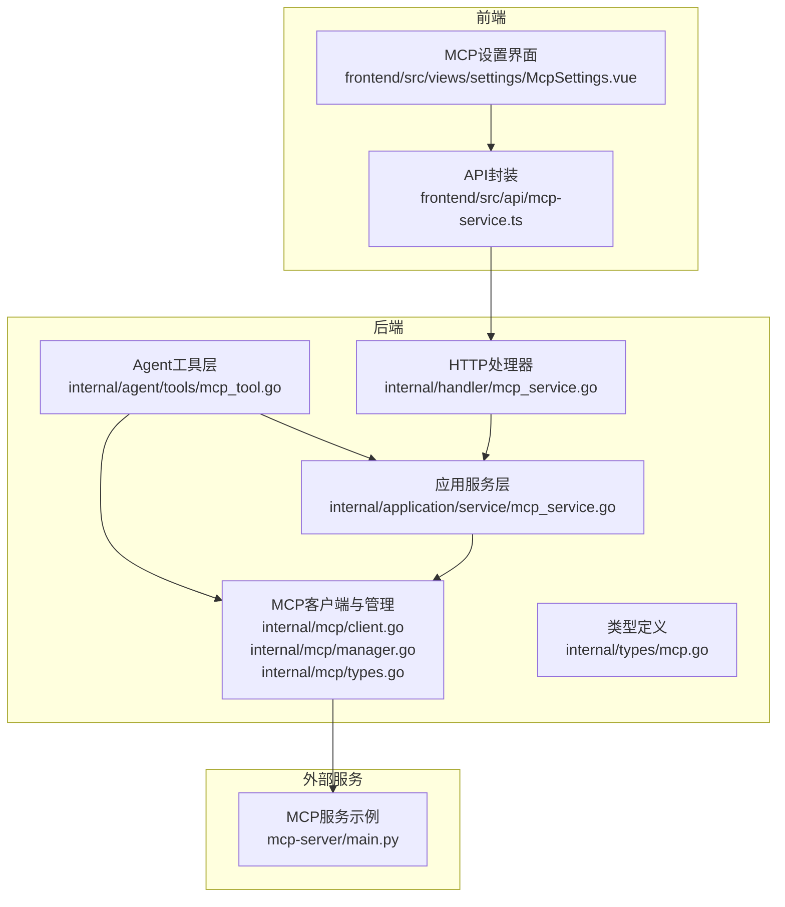
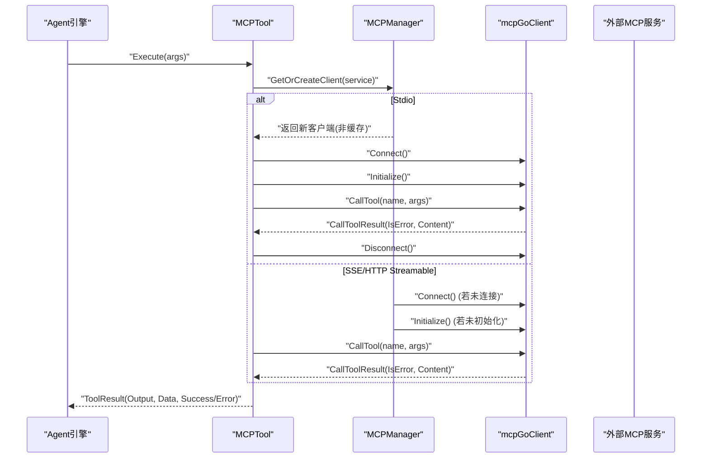
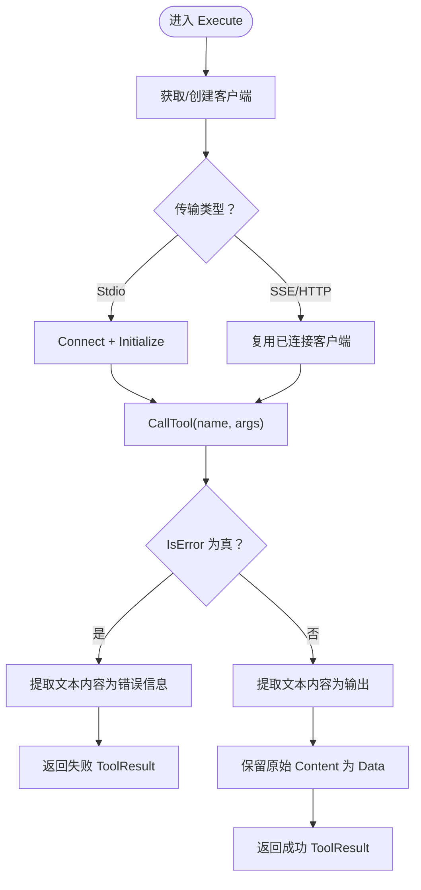
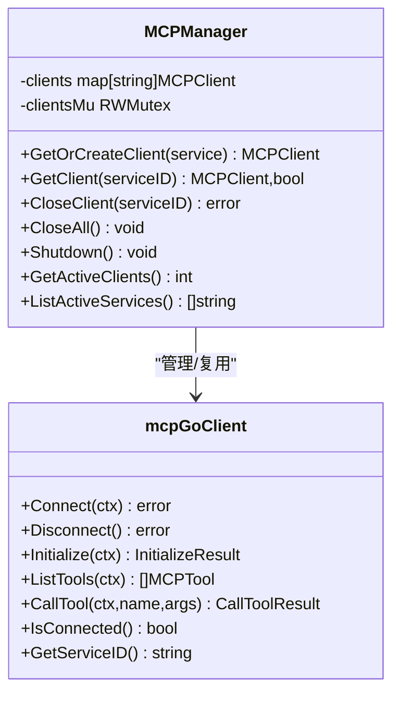
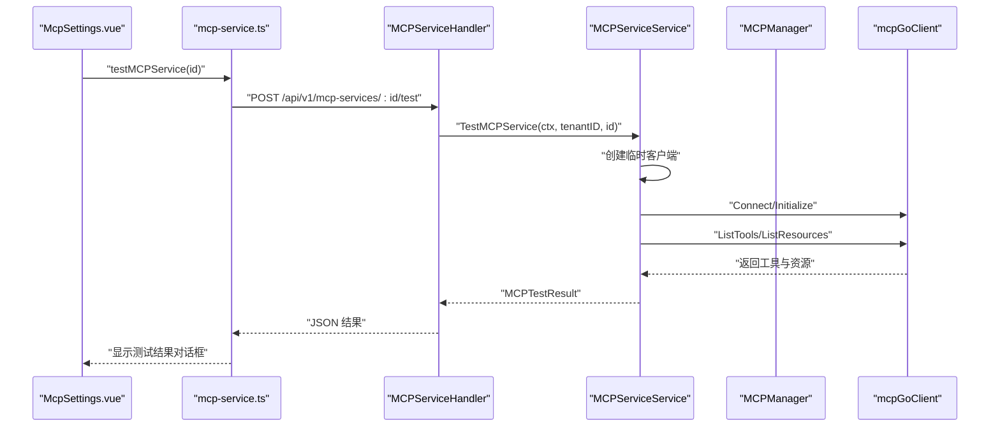
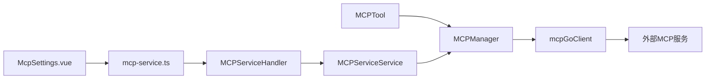

# MCP工具集成

<cite>
**本文引用的文件**
- [mcp_tool.go](file://internal/agent/tools/mcp_tool.go)
- [manager.go](file://internal/mcp/manager.go)
- [client.go](file://internal/mcp/client.go)
- [types.go](file://internal/mcp/types.go)
- [mcp.go](file://internal/types/mcp.go)
- [mcp_service.go](file://internal/application/service/mcp_service.go)
- [mcp_service.go](file://internal/handler/mcp_service.go)
- [MCP功能使用说明.md](file://docs/MCP功能使用说明.md)
- [McpSettings.vue](file://frontend/src/views/settings/McpSettings.vue)
- [mcp-service.ts](file://frontend/src/api/mcp-service.ts)
- [main.py](file://mcp-server/main.py)
</cite>

## 目录
1. [简介](#简介)
2. [项目结构](#项目结构)
3. [核心组件](#核心组件)
4. [架构总览](#架构总览)
5. [详细组件分析](#详细组件分析)
6. [依赖关系分析](#依赖关系分析)
7. [性能考量](#性能考量)
8. [故障排查指南](#故障排查指南)
9. [结论](#结论)
10. [附录](#附录)

## 简介
本技术文档围绕 WeKnora 的 MCP 工具集成展开，重点剖析 internal/agent/tools/mcp_tool.go 中的 MCPTool 实现，说明其如何通过 mcpManager.GetOrCreateClient 获取 MCP 客户端，并调用 client.CallTool 与外部 MCP 服务通信。文档还阐述了对不同传输方式（SSE、HTTP Streamable、Stdio）的支持，尤其是 Stdio 模式下的连接管理（defer client.Disconnect()），以及如何处理 MCP 调用的响应（错误标志 IsError 和结构化数据提取）。结合 internal/mcp/manager.go 中的 MCPManager，说明 MCP 服务的生命周期管理。最后，结合 docs/MCP功能使用说明.md 的前端管理界面，展示 MCP 服务的配置、测试与启停流程，并提供从开发到部署的完整指南，包括如何使用 mcp-server/ 创建自定义 MCP 服务、在前端注册服务，以及在 Agent 提示词中调用 MCP 工具。同时给出常见问题的定位与解决思路，如连接超时、认证失败与协议不兼容等。

## 项目结构
与 MCP 工具集成相关的关键模块分布如下：
- 后端工具层：internal/agent/tools/mcp_tool.go
- MCP 客户端与管理：internal/mcp/client.go、internal/mcp/manager.go、internal/mcp/types.go
- 类型定义：internal/types/mcp.go
- 应用服务层：internal/application/service/mcp_service.go
- HTTP 处理器：internal/handler/mcp_service.go
- 前端管理界面：frontend/src/views/settings/McpSettings.vue、frontend/src/api/mcp-service.ts
- MCP 服务示例：mcp-server/main.py
- 文档说明：docs/MCP功能使用说明.md

图表来源
- [mcp_tool.go](file://internal/agent/tools/mcp_tool.go#L62-L122)
- [client.go](file://internal/mcp/client.go#L151-L323)
- [manager.go](file://internal/mcp/manager.go#L37-L96)
- [mcp_service.go](file://internal/application/service/mcp_service.go#L231-L304)
- [mcp_service.go](file://internal/handler/mcp_service.go#L256-L289)
- [McpSettings.vue](file://frontend/src/views/settings/McpSettings.vue#L116-L222)
- [mcp-service.ts](file://frontend/src/api/mcp-service.ts#L52-L61)
- [main.py](file://mcp-server/main.py#L1-L145)

章节来源
- [mcp_tool.go](file://internal/agent/tools/mcp_tool.go#L62-L122)
- [client.go](file://internal/mcp/client.go#L151-L323)
- [manager.go](file://internal/mcp/manager.go#L37-L96)
- [mcp_service.go](file://internal/application/service/mcp_service.go#L231-L304)
- [mcp_service.go](file://internal/handler/mcp_service.go#L256-L289)
- [McpSettings.vue](file://frontend/src/views/settings/McpSettings.vue#L116-L222)
- [mcp-service.ts](file://frontend/src/api/mcp-service.ts#L52-L61)
- [main.py](file://mcp-server/main.py#L1-L145)

## 核心组件
- MCPTool：封装单个 MCP 服务工具，实现 Tool 接口，负责执行工具调用、错误处理与结果序列化。
- MCPManager：管理 MCP 客户端生命周期，支持 SSE/HTTP Streamable 的缓存复用与 Stdio 的一次性连接。
- mcpGoClient：基于 mark3labs/mcp-go 的客户端实现，支持三种传输方式，提供 Connect/Disconnect/Initialize/ListTools/CallTool 等能力。
- 类型系统：types.MCPService、types.MCPTool、types.MCPResource、types.MCPTestResult 等，定义服务配置、工具与资源模型。
- 应用服务与处理器：提供服务的增删改查、测试、工具与资源查询，以及前端交互的 HTTP 接口。
- 前端界面：McpSettings.vue 提供 MCP 服务的配置、测试与启停，配合 mcp-service.ts 的 API 封装。

章节来源
- [mcp_tool.go](file://internal/agent/tools/mcp_tool.go#L15-L122)
- [manager.go](file://internal/mcp/manager.go#L13-L96)
- [client.go](file://internal/mcp/client.go#L17-L149)
- [mcp.go](file://internal/types/mcp.go#L12-L87)
- [mcp_service.go](file://internal/application/service/mcp_service.go#L231-L304)
- [mcp_service.go](file://internal/handler/mcp_service.go#L256-L289)
- [McpSettings.vue](file://frontend/src/views/settings/McpSettings.vue#L116-L222)
- [mcp-service.ts](file://frontend/src/api/mcp-service.ts#L52-L61)

## 架构总览
下图展示了 MCP 工具从 Agent 调用到外部 MCP 服务的端到端流程，包括客户端创建、初始化、工具调用与结果处理。

图表来源
- [mcp_tool.go](file://internal/agent/tools/mcp_tool.go#L62-L122)
- [manager.go](file://internal/mcp/manager.go#L37-L96)
- [client.go](file://internal/mcp/client.go#L151-L323)

## 详细组件分析

### MCPTool 执行流程与响应处理
- 客户端获取与连接
  - 通过 mcpManager.GetOrCreateClient 获取或创建客户端。
  - 对于 Stdio 传输，每次调用都会创建新客户端并在调用结束后断开连接，确保资源释放。
- 工具调用
  - 调用 client.CallTool 执行指定工具名与参数。
- 响应处理
  - 若 result.IsError 为真，提取文本内容作为错误信息并返回失败的 ToolResult。
  - 否则提取 Content 中的文本内容作为 Output，并将原始 Content 作为 Data 字段保留，便于后续渲染或结构化展示。
- 错误处理
  - 连接失败或调用失败时，构造失败的 ToolResult，避免中断 Agent 流程。

图表来源
- [mcp_tool.go](file://internal/agent/tools/mcp_tool.go#L62-L122)
- [client.go](file://internal/mcp/client.go#L284-L323)

章节来源
- [mcp_tool.go](file://internal/agent/tools/mcp_tool.go#L62-L122)

### MCPManager 生命周期管理
- 客户端获取策略
  - Stdio：总是创建新客户端（不缓存），调用后由调用方负责断开。
  - SSE/HTTP Streamable：按服务 ID 缓存客户端，若连接存在且已初始化则直接复用。
- 初始化与超时
  - initializeClient 统一执行 Initialize，并在 AdvancedConfig.Timeout 或默认 30 秒内完成。
- 连接清理
  - 提供 CloseClient/CloseAll/Shutdown，周期性清理断开的客户端。
  - cleanupIdleConnections 每 5 分钟扫描一次，移除断开的客户端。
- 查询活跃客户端
  - GetActiveClients/ListActiveServices 便于监控与运维。

图表来源
- [manager.go](file://internal/mcp/manager.go#L13-L96)
- [client.go](file://internal/mcp/client.go#L17-L149)

章节来源
- [manager.go](file://internal/mcp/manager.go#L37-L96)
- [manager.go](file://internal/mcp/manager.go#L148-L252)

### 传输方式支持与 Stdio 连接管理
- SSE/HTTP Streamable
  - 通过 NewSSEMCPClient/NewStreamableHttpClient 创建客户端。
  - 连接建立后持久化，Manager 负责复用与断开。
- Stdio
  - 通过 NewStdioMCPClientWithOptions 创建子进程客户端。
  - Manager 不缓存 Stdio 客户端；调用方在每次调用后显式断开，避免资源泄漏。
- 认证与头部
  - 支持 API Key、Bearer Token 与自定义头部，统一注入到 HTTP 客户端。
- 超时控制
  - HTTP 客户端超时由 AdvancedConfig.Timeout 控制，默认 30 秒；初始化与工具调用均受上下文超时约束。

章节来源
- [client.go](file://internal/mcp/client.go#L93-L149)
- [client.go](file://internal/mcp/client.go#L151-L323)
- [mcp.go](file://internal/types/mcp.go#L40-L65)

### 前端管理界面与测试流程
- 界面入口
  - 设置 -> MCP 服务，支持列出、启停、测试、编辑、删除。
- 常用操作
  - 新建服务：选择传输方式（SSE/HTTP Streamable/Stdio），填写 URL 或 stdio 命令与参数，配置认证与高级超时。
  - 启停服务：切换开关，后端即时更新并回滚失败状态。
  - 连接测试：调用 /api/v1/mcp-services/{id}/test，展示工具清单与资源列表或错误信息。
- API 封装
  - listMCPServices/getMCPService 等接口由前端 mcp-service.ts 提供。

图表来源
- [McpSettings.vue](file://frontend/src/views/settings/McpSettings.vue#L166-L222)
- [mcp-service.ts](file://frontend/src/api/mcp-service.ts#L52-L61)
- [mcp_service.go](file://internal/handler/mcp_service.go#L256-L289)
- [mcp_service.go](file://internal/application/service/mcp_service.go#L231-L304)

章节来源
- [MCP功能使用说明.md](file://docs/MCP功能使用说明.md#L1-L30)
- [McpSettings.vue](file://frontend/src/views/settings/McpSettings.vue#L116-L222)
- [mcp-service.ts](file://frontend/src/api/mcp-service.ts#L52-L61)
- [mcp_service.go](file://internal/handler/mcp_service.go#L256-L289)
- [mcp_service.go](file://internal/application/service/mcp_service.go#L231-L304)

### 自定义 MCP 服务开发与部署
- 使用 mcp-server/
  - 提供统一入口 main.py，支持检查环境、打印环境变量、详细日志与版本信息。
  - 通过环境变量 WEKNORA_BASE_URL、WEKNORA_API_KEY 配置后端 API 地址与密钥。
- 部署与运行
  - 可直接运行 python main.py 或通过安装后的入口 weknora-mcp-server 启动。
  - 建议在 Stdio 模式下本地调试，或在公网部署 SSE/HTTP Streamable 服务供远端 Agent 调用。
- 在前端注册服务
  - 在设置 -> MCP 服务 添加新服务，选择传输方式与必要配置，保存后即可在 Agent 中使用。

章节来源
- [main.py](file://mcp-server/main.py#L1-L145)
- [MCP功能使用说明.md](file://docs/MCP功能使用说明.md#L1-L30)

## 依赖关系分析
- MCPTool 依赖 MCPManager 与 mcpGoClient，负责工具执行与结果序列化。
- MCPManager 依赖 mcpGoClient，负责客户端生命周期与缓存。
- 应用服务层封装业务逻辑，调用 MCPManager 与存储层。
- HTTP 处理器提供对外接口，调用应用服务层。
- 前端通过 API 封装调用后端接口，驱动界面交互。

图表来源
- [mcp_tool.go](file://internal/agent/tools/mcp_tool.go#L62-L122)
- [manager.go](file://internal/mcp/manager.go#L37-L96)
- [client.go](file://internal/mcp/client.go#L151-L323)
- [mcp_service.go](file://internal/application/service/mcp_service.go#L231-L304)
- [mcp_service.go](file://internal/handler/mcp_service.go#L256-L289)
- [McpSettings.vue](file://frontend/src/views/settings/McpSettings.vue#L116-L222)
- [mcp-service.ts](file://frontend/src/api/mcp-service.ts#L52-L61)

章节来源
- [mcp_tool.go](file://internal/agent/tools/mcp_tool.go#L62-L122)
- [manager.go](file://internal/mcp/manager.go#L37-L96)
- [client.go](file://internal/mcp/client.go#L151-L323)
- [mcp_service.go](file://internal/application/service/mcp_service.go#L231-L304)
- [mcp_service.go](file://internal/handler/mcp_service.go#L256-L289)
- [McpSettings.vue](file://frontend/src/views/settings/McpSettings.vue#L116-L222)
- [mcp-service.ts](file://frontend/src/api/mcp-service.ts#L52-L61)

## 性能考量
- 连接复用
  - SSE/HTTP Streamable 通过 Manager 缓存客户端，减少重复握手成本。
- 超时与重试
  - HTTP 客户端超时由 AdvancedConfig.Timeout 控制；初始化与工具调用使用上下文超时，避免阻塞。
  - 建议对公网或第三方服务适当提高 retry_count 与 retry_delay，降低间歇性超时影响。
- Stdio 资源释放
  - 每次调用后断开连接，避免子进程长期占用资源。
- 日志与监控
  - Manager 提供清理与统计接口，便于发现异常连接与资源泄漏。

[本节为通用指导，不直接分析具体文件]

## 故障排查指南
- 连接超时
  - 检查 AdvancedConfig.Timeout 是否过小；SSE/HTTP Streamable 服务可达性与网络延迟。
  - 前端测试接口会返回明确的错误信息，便于定位。
- 认证失败
  - 确认 API Key/Bearer Token 与自定义头部配置正确；Stdio 模式下注意环境变量传递。
- 协议不兼容
  - 确认外部 MCP 服务支持的协议版本；初始化阶段会返回 ServerInfo，可用于核对。
- 服务启停异常
  - 前端启停会调用后端接口，失败时会回滚状态并提示；检查后端日志与 Manager 的连接状态。

章节来源
- [mcp_service.go](file://internal/application/service/mcp_service.go#L231-L304)
- [mcp_service.go](file://internal/handler/mcp_service.go#L256-L289)
- [MCP功能使用说明.md](file://docs/MCP功能使用说明.md#L1-L30)

## 结论
MCP 工具集成为 WeKnora 的 Agent 能力扩展提供了标准化通道。MCPTool 通过 MCPManager 与 mcpGoClient 实现了对 SSE/HTTP Streamable/Stdio 三种传输方式的统一支持，并在 Stdio 模式下严格遵循“按需创建、用后断开”的连接管理策略。前端管理界面提供了完整的配置、测试与启停流程，配合应用服务层与 HTTP 处理器，形成从 UI 到后端再到外部 MCP 服务的闭环。通过合理的超时与重试策略、严格的资源释放与日志监控，系统在复杂网络环境下仍能保持稳定与可观测性。

[本节为总结性内容，不直接分析具体文件]

## 附录
- 在 Agent 提示词中调用 MCP 工具
  - 通过前端“MCP 服务”页面注册服务后，系统会自动拉取工具清单并注册到工具库，Agent 可在推理过程中按需调用。
- 常见配置要点
  - 传输方式选择：优先使用 SSE；需要标准 HTTP Streamable 兼容时再切换；本地调试或离线环境适合 Stdio。
  - 鉴权管理：将 API Key/Token 保存在“认证配置”中，生产环境建议单独创建最小权限 Key 并定期轮换。
  - 重试策略：对公网或第三方服务适当提高 retry_count 与 retry_delay，避免间歇性超时导致 Agent 中断。

章节来源
- [MCP功能使用说明.md](file://docs/MCP功能使用说明.md#L1-L30)
- [mcp_tool.go](file://internal/agent/tools/mcp_tool.go#L180-L244)
- [manager.go](file://internal/mcp/manager.go#L148-L252)