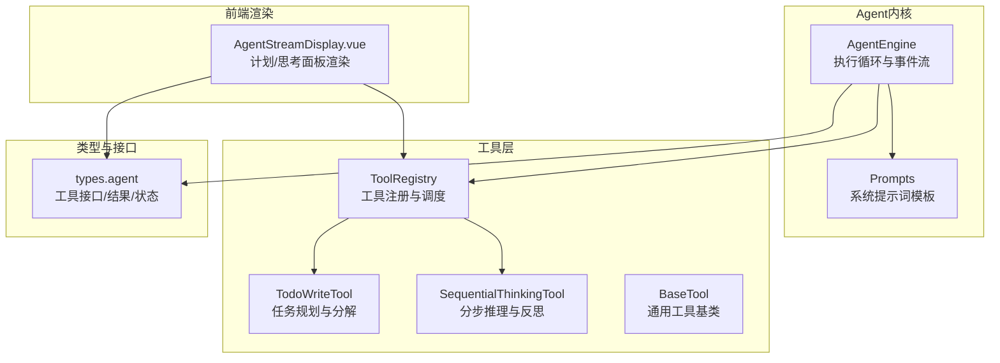
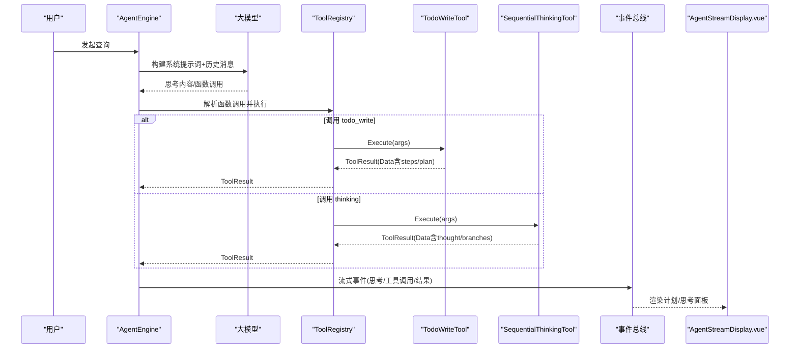
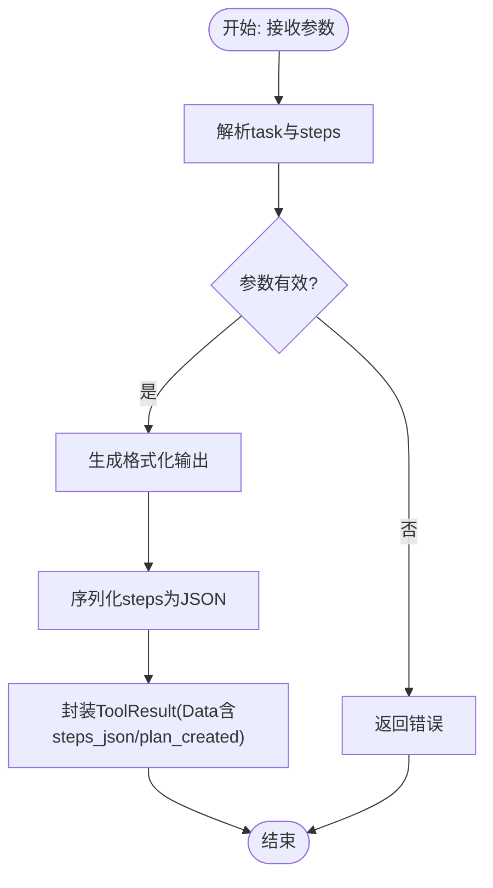
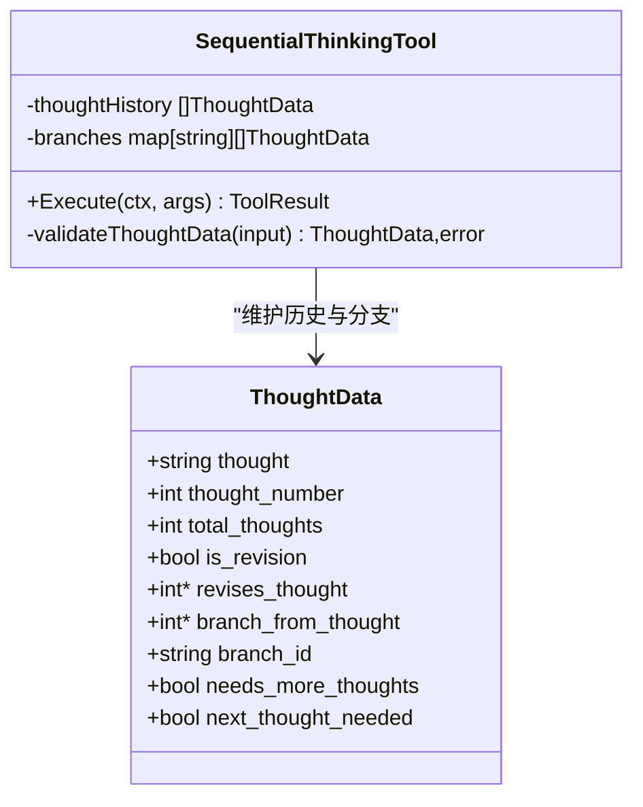
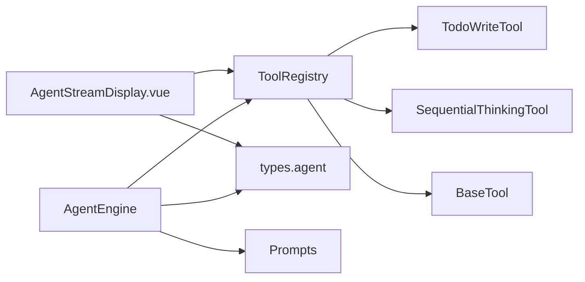

# 任务管理工具

<cite>
**本文引用的文件**
- [todo_write.go](file://internal/agent/tools/todo_write.go)
- [sequentialthinking.go](file://internal/agent/tools/sequentialthinking.go)
- [prompts.go](file://internal/agent/prompts.go)
- [engine.go](file://internal/agent/engine.go)
- [agent.go](file://internal/types/agent.go)
- [tool.go](file://internal/agent/tools/tool.go)
- [registry.go](file://internal/agent/tools/registry.go)
- [AgentStreamDisplay.vue](file://frontend/src/views/chat/components/AgentStreamDisplay.vue)
</cite>

## 目录
1. [引言](#引言)
2. [项目结构](#项目结构)
3. [核心组件](#核心组件)
4. [架构总览](#架构总览)
5. [详细组件分析](#详细组件分析)
6. [依赖分析](#依赖分析)
7. [性能考虑](#性能考虑)
8. [故障排查指南](#故障排查指南)
9. [结论](#结论)
10. [附录](#附录)

## 引言
本技术文档围绕系统化任务规划与执行类Agent工具展开，重点解析两个核心模块：
- 任务规划与分解工具：todo_write.go
- 分步推理与反思工具：sequentialthinking.go

文档将从系统架构、数据流、处理逻辑、集成点、错误处理与性能特征等方面进行深入剖析，并结合内部提示词模板与前端渲染组件，给出任务状态管理、进度追踪与错误恢复的实现细节，以及典型对话案例的应用效果说明。

## 项目结构
本仓库采用“按领域/包”组织方式，Agent相关能力集中在 internal/agent 目录下，工具实现位于 internal/agent/tools，系统提示词位于 internal/agent/prompts.go，Agent引擎位于 internal/agent/engine.go，类型定义位于 internal/types/agent.go，前端渲染组件位于 frontend/src/views/chat/components/AgentStreamDisplay.vue。

图表来源
- [engine.go](file://internal/agent/engine.go#L1-L120)
- [prompts.go](file://internal/agent/prompts.go#L242-L410)
- [todo_write.go](file://internal/agent/tools/todo_write.go#L1-L120)
- [sequentialthinking.go](file://internal/agent/tools/sequentialthinking.go#L1-L120)
- [registry.go](file://internal/agent/tools/registry.go#L1-L115)
- [tool.go](file://internal/agent/tools/tool.go#L1-L78)
- [agent.go](file://internal/types/agent.go#L86-L157)
- [AgentStreamDisplay.vue](file://frontend/src/views/chat/components/AgentStreamDisplay.vue#L1171-L1270)

章节来源
- [engine.go](file://internal/agent/engine.go#L1-L120)
- [prompts.go](file://internal/agent/prompts.go#L242-L410)

## 核心组件
- TodoWriteTool：面向检索与研究任务的多步骤计划工具，负责任务分解、状态跟踪与输出格式化，支持“待处理/进行中/已完成”的状态管理。
- SequentialThinkingTool：面向复杂问题的动态、可修订的分步推理工具，支持分支、回溯、修订与迭代，最终产出可验证的假设与结论。
- AgentEngine：ReAct循环驱动器，负责构建系统提示词、组装消息上下文、函数调用、事件流式输出、工具执行与反思。
- ToolRegistry：工具注册中心，统一暴露工具函数定义、参数Schema与执行入口。
- 前端AgentStreamDisplay：根据工具返回的结构化数据渲染“计划”和“思考”面板，提供进度统计与图标标识。

章节来源
- [todo_write.go](file://internal/agent/tools/todo_write.go#L1-L120)
- [sequentialthinking.go](file://internal/agent/tools/sequentialthinking.go#L1-L120)
- [engine.go](file://internal/agent/engine.go#L1-L120)
- [registry.go](file://internal/agent/tools/registry.go#L1-L115)
- [agent.go](file://internal/types/agent.go#L86-L157)
- [AgentStreamDisplay.vue](file://frontend/src/views/chat/components/AgentStreamDisplay.vue#L1171-L1270)

## 架构总览
Agent引擎在每次迭代中，先通过系统提示词与历史消息生成“思考”内容，随后根据LLM的函数调用选择工具执行；工具执行结果通过事件总线回传到前端进行流式渲染。todo_write负责任务分解与状态追踪，sequentialthinking负责推理过程的记录与分支管理。

图表来源
- [engine.go](file://internal/agent/engine.go#L150-L487)
- [registry.go](file://internal/agent/tools/registry.go#L71-L115)
- [todo_write.go](file://internal/agent/tools/todo_write.go#L198-L239)
- [sequentialthinking.go](file://internal/agent/tools/sequentialthinking.go#L161-L230)
- [AgentStreamDisplay.vue](file://frontend/src/views/chat/components/AgentStreamDisplay.vue#L1171-L1270)

## 详细组件分析

### TodoWriteTool：任务规划与分解
- 角色与职责
  - 为检索与研究型任务生成结构化的多步骤计划，明确每一步的描述与状态。
  - 严格区分“检索任务”与“总结/合成任务”，前者由todo_write负责，后者由thinking工具负责。
- 参数Schema
  - task：复杂任务或问题描述。
  - steps：数组对象，包含id、description、status字段，status枚举为pending、in_progress、completed。
- 执行流程
  - 解析输入参数，构造PlanStep切片。
  - 生成格式化输出文本，包含任务概览、步骤清单与进度摘要。
  - 将结构化数据封装为ToolResult，包含steps、steps_json、total_steps、plan_created等键。
- 输出与持久化
  - 输出文本用于前端展示；结构化数据通过ToolResult.Data传递给前端渲染组件。
  - 前端根据Data.steps计算进行中/待处理/已完成的数量并渲染状态徽章。
- 状态管理与约束
  - 仅允许单一任务处于in_progress状态；完成时立即标记为completed。
  - 未完成的任务不得标记为completed；遇到阻塞应保持in_progress并新增解决任务。
  - 任务分解需具体、可执行，避免总结/合成类任务进入todo_write。

图表来源
- [todo_write.go](file://internal/agent/tools/todo_write.go#L154-L239)

章节来源
- [todo_write.go](file://internal/agent/tools/todo_write.go#L1-L360)
- [agent.go](file://internal/types/agent.go#L101-L118)
- [AgentStreamDisplay.vue](file://frontend/src/views/chat/components/AgentStreamDisplay.vue#L1185-L1247)

### SequentialThinkingTool：分步推理与反思
- 角色与职责
  - 面向复杂问题的动态推理，支持修订(previous thought)、分支(branch)、回溯(backtrack)与迭代。
  - 通过thought_number与total_thoughts控制推理节奏，支持“需要更多思考”的动态调整。
- 参数Schema
  - thought：当前思考内容（用户友好语言，禁止提及具体工具名）。
  - nextThoughtNeeded：是否还需要进一步思考。
  - thoughtNumber：当前思考序号（≥1）。
  - totalThoughts：预估总思考次数（≥5），可随进展上调或下调。
  - isRevision/revisesThought：修订标志与修订目标思考编号。
  - branchFromThought/branchId：分支起点与分支标识。
  - needsMoreThoughts：到达终点但意识到仍需更多思考。
- 执行流程
  - 校验输入参数，确保thought非空、数字范围合法。
  - 若thoughtNumber超过totalThoughts则自动上调totalThoughts。
  - 记录到thoughtHistory；若存在分支起点与分支ID，则写入对应分支。
  - 返回ToolResult，包含当前thought、分支列表、历史长度、是否仍有未完成步骤等。
- 错误处理
  - 参数校验失败时返回失败的ToolResult并记录日志。

图表来源
- [sequentialthinking.go](file://internal/agent/tools/sequentialthinking.go#L1-L230)

章节来源
- [sequentialthinking.go](file://internal/agent/tools/sequentialthinking.go#L1-L311)
- [agent.go](file://internal/types/agent.go#L101-L118)

### 提示词模板与系统约束
- 系统提示词模板强调“证据优先”“深读优先”“KB-first、Web-second”“严格遵循计划”等原则。
- 对todo_write与thinking的分工有明确约束：todo_write只做检索任务，thinking只做总结与合成。
- 强调“近邻引用规则”，要求在使用事实时即时标注引用位置。

章节来源
- [prompts.go](file://internal/agent/prompts.go#L242-L410)

### 前端渲染与状态展示
- 前端根据ToolResult.Data中的display_type与结构化数据渲染“计划”和“思考”面板。
- 对于todo_write，前端统计steps中各状态数量并显示进度徽章；对于thinking，前端根据thought字段触发渲染。
- 工具图标映射：todo_write使用文件添加图标，thinking使用思考图标，其他检索工具使用知识库/网页搜索图标。

章节来源
- [AgentStreamDisplay.vue](file://frontend/src/views/chat/components/AgentStreamDisplay.vue#L1171-L1270)

## 依赖分析
- AgentEngine依赖ToolRegistry进行工具函数定义与执行；通过事件总线将思考、工具调用与结果流式传输至前端。
- ToolRegistry统一管理工具注册、参数Schema与执行；对工具执行进行管道级日志记录。
- TodoWriteTool与SequentialThinkingTool共享BaseTool通用能力（名称与描述），并各自实现参数Schema与执行逻辑。
- 类型系统types.agent定义了Tool接口、ToolResult、AgentStep、AgentState等核心结构，贯穿前后端交互。

图表来源
- [engine.go](file://internal/agent/engine.go#L1-L120)
- [registry.go](file://internal/agent/tools/registry.go#L1-L115)
- [tool.go](file://internal/agent/tools/tool.go#L1-L78)
- [agent.go](file://internal/types/agent.go#L86-L157)

章节来源
- [engine.go](file://internal/agent/engine.go#L1-L120)
- [registry.go](file://internal/agent/tools/registry.go#L1-L115)
- [tool.go](file://internal/agent/tools/tool.go#L1-L78)
- [agent.go](file://internal/types/agent.go#L86-L157)

## 性能考虑
- 工具执行耗时记录：AgentEngine在执行工具时记录毫秒级耗时，便于监控与优化。
- 事件流式传输：通过事件总线将思考与工具结果分块推送，降低前端等待时间。
- 参数校验与早失败：sequentialthinking在执行前严格校验输入，避免无效调用导致的资源浪费。
- 建议
  - 控制totalThoughts初始估计，避免过度迭代。
  - 在todo_write中尽量将任务拆分为最小可行单元，减少重复检索与深读成本。
  - 前端按需渲染，避免一次性加载过多历史数据。

[本节为通用指导，无需列出章节来源]

## 故障排查指南
- todo_write执行失败
  - 检查参数task与steps是否存在且格式正确。
  - 确认status枚举值合法（pending/in_progress/completed）。
  - 关注输出文本中的“未完成任务数”提示，确保所有任务完成后才进行总结。
- sequentialthinking执行失败
  - 检查thought是否为空字符串；thought_number与total_thoughts是否为正整数。
  - 若出现分支场景，确认branchFromThought与branchId配对正确。
- 前端渲染异常
  - 确认ToolResult.Data中display_type为plan或thinking。
  - 检查前端getPlanStatusParts与getPlanStatusItems逻辑是否正确解析steps数组。

章节来源
- [todo_write.go](file://internal/agent/tools/todo_write.go#L198-L239)
- [sequentialthinking.go](file://internal/agent/tools/sequentialthinking.go#L232-L311)
- [AgentStreamDisplay.vue](file://frontend/src/views/chat/components/AgentStreamDisplay.vue#L1185-L1247)

## 结论
todo_write与sequentialthinking共同构成了Agent在复杂任务场景下的“计划-执行-反思”闭环：
- todo_write负责将检索任务结构化、可视化与状态化，确保任务边界清晰、进度可控。
- sequentialthinking负责推理过程的动态演进，支持修订、分支与迭代，最终形成可验证的结论。
- 系统提示词模板明确了检索策略与输出规范，保障答案的溯源与严谨性。
- 前端通过事件总线与结构化数据实现高效渲染，提升用户体验与可观测性。

[本节为总结性内容，无需列出章节来源]

## 附录

### 实际对话案例（概念性说明）
- 场景一：框架对比研究
  - 用户提出比较WeKnora与其他RAG框架的需求。
  - Agent先进行初步检索与深读，随后使用todo_write生成检索计划（分别针对WeKnora、LangChain、LlamaIndex）。
  - 每完成一个子任务，更新状态为completed；全部完成后，使用thinking工具进行综合分析与总结。
- 场景二：复杂问题的多阶段推理
  - 用户提出一个涉及多个维度的问题，Agent使用thinking工具逐步拆解、修订与分支探索，直到达到满意答案。
  - 前端实时展示“思考”面板与分支树，帮助用户理解推理路径。

[本节为概念性说明，无需列出章节来源]