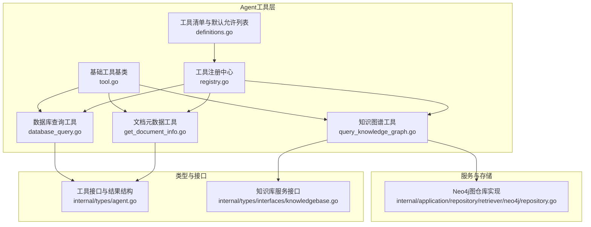
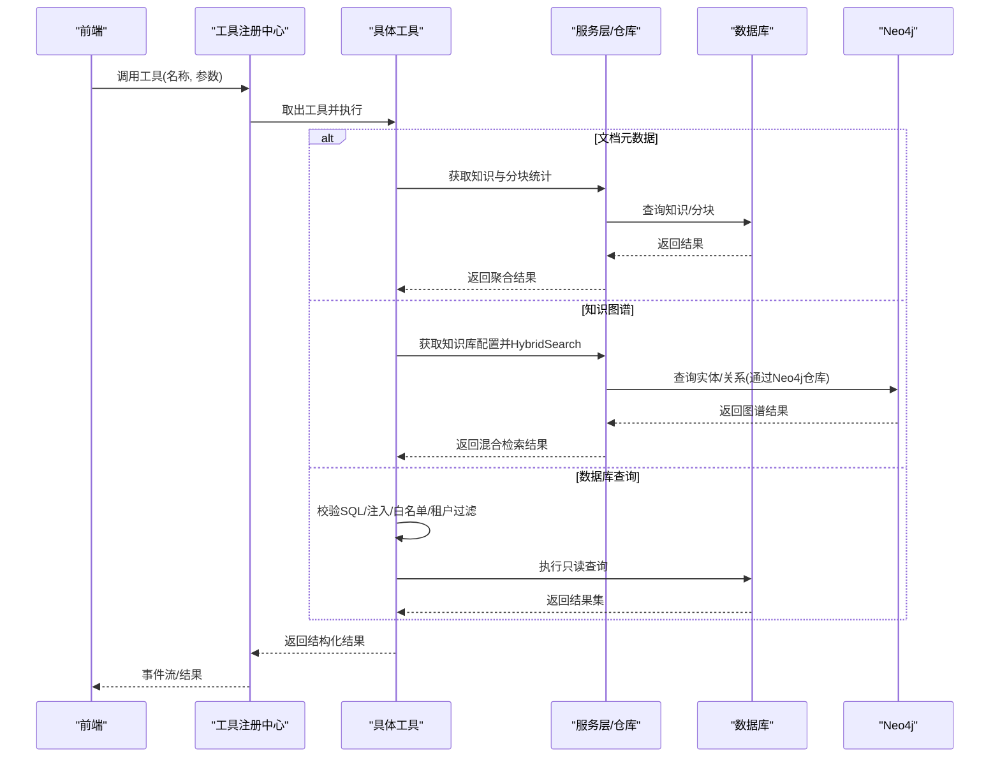
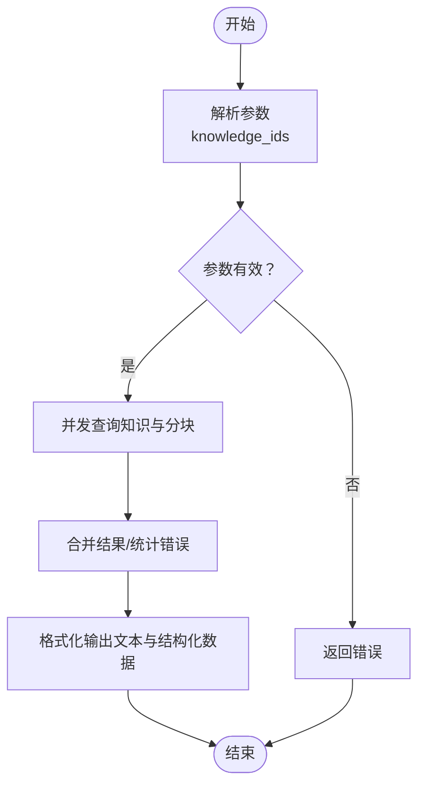
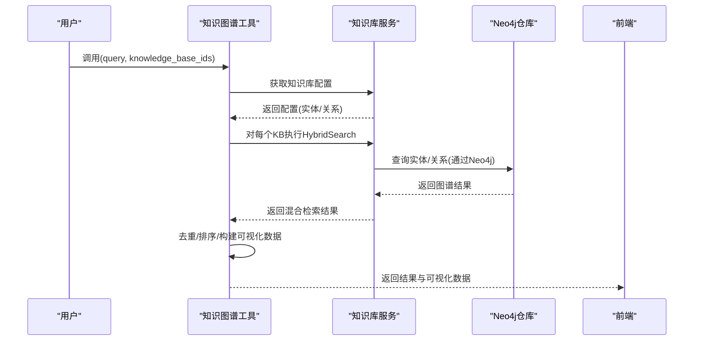
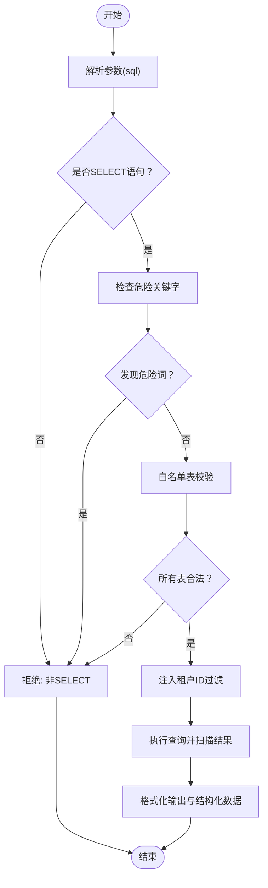
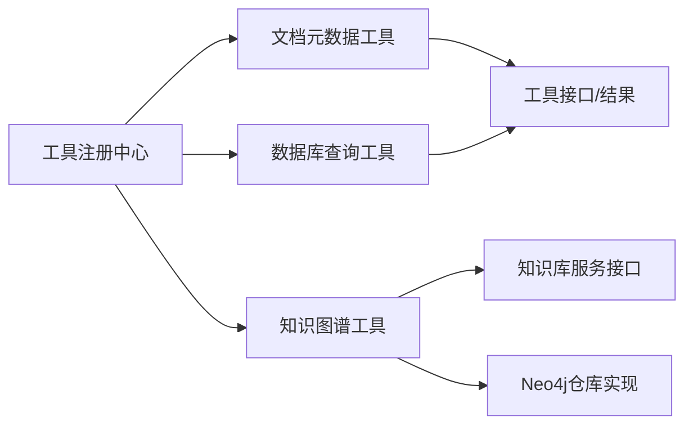

# 信息查询工具

<cite>
**本文引用的文件列表**
- [get_document_info.go](file://internal/agent/tools/get_document_info.go)
- [query_knowledge_graph.go](file://internal/agent/tools/query_knowledge_graph.go)
- [database_query.go](file://internal/agent/tools/database_query.go)
- [registry.go](file://internal/agent/tools/registry.go)
- [tool.go](file://internal/agent/tools/tool.go)
- [definitions.go](file://internal/agent/tools/definitions.go)
- [knowledgebase.go](file://internal/types/interfaces/knowledgebase.go)
- [tool.go](file://internal/types/agent.go)
- [开启知识图谱功能.md](file://docs/开启知识图谱功能.md)
- [repository.go](file://internal/application/repository/retriever/neo4j/repository.go)
- [index.vue](file://frontend/src/views/chat/index.vue)
</cite>

## 目录
1. [简介](#简介)
2. [项目结构](#项目结构)
3. [核心组件](#核心组件)
4. [架构总览](#架构总览)
5. [详细组件分析](#详细组件分析)
6. [依赖分析](#依赖分析)
7. [性能考虑](#性能考虑)
8. [故障排查指南](#故障排查指南)
9. [结论](#结论)
10. [附录](#附录)

## 简介
本技术文档围绕信息查询类Agent工具展开，重点覆盖三大能力：
- 文档元数据查询：通过工具获取文档的基本信息（标题、来源、文件信息、处理状态、分块数量、自定义元数据等），并支持批量并发查询。
- 知识图谱查询：基于HybridSearch对已配置实体/关系抽取的知识库进行实体关系探索与图谱遍历，返回跨知识库去重后的结果，并提供前端可视化所需的数据结构。
- 数据库查询：以只读方式安全执行SQL查询，内置参数化校验、白名单表限制与租户隔离过滤，避免注入风险并保障数据安全。

同时，文档结合“开启知识图谱功能”说明文件，解释图谱功能的启用条件、配置流程与验证方法，并给出各工具的查询语法示例、权限控制策略与性能优化建议。

## 项目结构
信息查询工具位于后端Agent工具包内，采用“工具注册中心 + 工具实现”的分层设计：
- 工具注册中心负责工具的注册、函数定义导出与统一执行调度。
- 工具实现分别封装文档元数据、知识图谱与数据库查询的具体逻辑。
- 类型与接口定义贯穿工具与服务层，保证解耦与可测试性。

图表来源
- [registry.go](file://internal/agent/tools/registry.go#L1-L115)
- [tool.go](file://internal/agent/tools/tool.go#L1-L77)
- [get_document_info.go](file://internal/agent/tools/get_document_info.go#L1-L308)
- [query_knowledge_graph.go](file://internal/agent/tools/query_knowledge_graph.go#L1-L404)
- [database_query.go](file://internal/agent/tools/database_query.go#L1-L427)
- [definitions.go](file://internal/agent/tools/definitions.go#L1-L37)
- [knowledgebase.go](file://internal/types/interfaces/knowledgebase.go#L1-L147)
- [repository.go](file://internal/application/repository/retriever/neo4j/repository.go#L1-L236)

章节来源
- [registry.go](file://internal/agent/tools/registry.go#L1-L115)
- [definitions.go](file://internal/agent/tools/definitions.go#L1-L37)

## 核心组件
- 工具注册中心：提供工具注册、函数定义导出、统一执行与事件记录。
- 基础工具基类：提供工具名称、描述与通用输出格式化辅助函数。
- 文档元数据工具：并发查询文档基本信息与分块数量，汇总输出与结构化数据。
- 知识图谱工具：并发查询多个知识库，自动校验图谱配置，跨库去重并排序，构建前端可视化数据。
- 数据库查询工具：只读SQL校验、白名单表限制、租户ID注入、结果脱敏与格式化输出。

章节来源
- [registry.go](file://internal/agent/tools/registry.go#L1-L115)
- [tool.go](file://internal/agent/tools/tool.go#L1-L77)
- [get_document_info.go](file://internal/agent/tools/get_document_info.go#L1-L308)
- [query_knowledge_graph.go](file://internal/agent/tools/query_knowledge_graph.go#L1-L404)
- [database_query.go](file://internal/agent/tools/database_query.go#L1-L427)

## 架构总览
Agent工具通过注册中心统一调度，工具实现依赖类型与接口定义，知识图谱工具进一步依赖Neo4j图仓库实现。前端通过事件流接收工具调用与结果。

图表来源
- [registry.go](file://internal/agent/tools/registry.go#L71-L114)
- [get_document_info.go](file://internal/agent/tools/get_document_info.go#L82-L263)
- [query_knowledge_graph.go](file://internal/agent/tools/query_knowledge_graph.go#L88-L369)
- [database_query.go](file://internal/agent/tools/database_query.go#L124-L246)
- [repository.go](file://internal/application/repository/retriever/neo4j/repository.go#L164-L228)
- [index.vue](file://frontend/src/views/chat/index.vue#L612-L643)

## 详细组件分析

### 文档元数据查询工具（get_document_info）
- 功能概述
  - 支持批量查询文档元数据，包括标题、描述、来源类型、文件名/类型/大小、处理状态、分块数量与自定义元数据。
  - 并发拉取多个文档信息，汇总成功与失败情况，输出人类可读摘要与结构化数据。
- 输入参数
  - knowledge_ids：字符串数组，长度限制为1-10，元素必须非空。
- 处理流程
  - 参数校验与清洗，转换为有效ID集合。
  - 并发请求知识服务获取文档元数据，同时并发请求分块服务统计分块数量。
  - 汇总结果，构造输出文本与结构化数据（包含文档列表、总数、请求总数、错误列表与显示类型）。
- 输出
  - 人类可读文本摘要与结构化数据，供前端渲染“文档信息”视图。
- 性能与并发
  - 通过goroutine并发查询多个文档，显著降低总延迟。
  - 对共享资源使用互斥锁保护，避免竞态。
- 错误处理
  - 对无效参数、空ID、查询失败等情况返回明确错误信息与部分失败汇总。

图表来源
- [get_document_info.go](file://internal/agent/tools/get_document_info.go#L82-L263)

章节来源
- [get_document_info.go](file://internal/agent/tools/get_document_info.go#L1-L308)

### 知识图谱查询工具（query_knowledge_graph）
- 功能概述
  - 针对已配置实体/关系抽取的知识库，执行HybridSearch以探索实体关系与知识网络。
  - 自动校验知识库是否配置图谱抽取，未配置则回退为常规搜索。
  - 并发查询多个知识库，跨库去重并按相关度排序，输出可视化所需数据。
- 输入参数
  - knowledge_base_ids：字符串数组（1-10），仅对已配置图谱抽取的知识库有效。
  - query：查询内容（实体名、关系或概念搜索）。
- 处理流程
  - 参数校验与清洗，提取有效KB ID。
  - 并发获取知识库配置，判断是否存在实体/关系抽取配置。
  - 对每个知识库执行HybridSearch，收集结果并跨库去重、排序。
  - 构建前端图谱可视化数据（节点、边、统计信息）。
- 输出
  - 人类可读文本摘要与结构化数据（含结果列表、KB覆盖统计、图谱配置、错误列表与显示类型）。
- 图谱启用与限制
  - 需在后端启用Neo4j并配置知识库实体/关系抽取；未配置时工具会回退为常规搜索。
  - Cypher查询能力处于开发中，当前通过HybridSearch返回相关文档片段。

图表来源
- [query_knowledge_graph.go](file://internal/agent/tools/query_knowledge_graph.go#L88-L369)
- [repository.go](file://internal/application/repository/retriever/neo4j/repository.go#L164-L228)

章节来源
- [query_knowledge_graph.go](file://internal/agent/tools/query_knowledge_graph.go#L1-L404)
- [repository.go](file://internal/application/repository/retriever/neo4j/repository.go#L1-L236)
- [开启知识图谱功能.md](file://docs/开启知识图谱功能.md#L1-L86)

### 数据库查询工具（database_query）
- 功能概述
  - 以只读方式执行SQL查询，自动注入租户ID过滤，限制危险关键字与白名单表，支持结果脱敏与格式化输出。
- 输入参数
  - sql：只允许SELECT语句，禁止包含tenant_id条件（工具自动注入）。
- 安全机制
  - 仅允许SELECT语句。
  - 禁止危险关键字（DROP、DELETE、INSERT、UPDATE、ALTER、CREATE、TRUNCATE、REPLACE、EXECUTE、EXEC、GRANT、REVOKE等）。
  - 白名单表校验（tenants、knowledge_bases、knowledges、sessions、messages、chunks、embeddings、models）。
  - 自动注入租户ID过滤（对含tenant_id字段的表追加WHERE条件；tenants表使用id字段）。
- 处理流程
  - 解析与校验SQL，构建安全查询。
  - 执行查询并扫描结果，转为结构化数据。
  - 格式化输出文本摘要与结构化数据（列名、行数、查询语句、租户ID、显示类型）。
- 输出
  - 人类可读文本与结构化数据，供前端“数据库查询”视图渲染。

图表来源
- [database_query.go](file://internal/agent/tools/database_query.go#L124-L246)
- [database_query.go](file://internal/agent/tools/database_query.go#L248-L427)

章节来源
- [database_query.go](file://internal/agent/tools/database_query.go#L1-L427)

## 依赖分析
- 工具注册中心
  - 维护工具映射，统一导出函数定义，执行工具并记录流水事件。
- 工具基类
  - 提供工具名称、描述与通用格式化辅助函数（相关度等级、匹配类型格式化）。
- 知识图谱工具
  - 依赖知识库服务接口（HybridSearch、获取知识库配置），内部通过Neo4j仓库实现图查询。
- 文档元数据工具
  - 依赖知识服务与分块服务，分别获取知识元数据与分块计数。
- 数据库查询工具
  - 依赖GORM数据库连接，执行原生SQL并进行安全校验与结果脱敏。

图表来源
- [registry.go](file://internal/agent/tools/registry.go#L1-L115)
- [tool.go](file://internal/agent/tools/tool.go#L1-L77)
- [get_document_info.go](file://internal/agent/tools/get_document_info.go#L1-L308)
- [query_knowledge_graph.go](file://internal/agent/tools/query_knowledge_graph.go#L1-L404)
- [database_query.go](file://internal/agent/tools/database_query.go#L1-L427)
- [knowledgebase.go](file://internal/types/interfaces/knowledgebase.go#L1-L147)
- [repository.go](file://internal/application/repository/retriever/neo4j/repository.go#L1-L236)

章节来源
- [registry.go](file://internal/agent/tools/registry.go#L1-L115)
- [tool.go](file://internal/agent/tools/tool.go#L1-L77)
- [knowledgebase.go](file://internal/types/interfaces/knowledgebase.go#L1-L147)

## 性能考虑
- 并发查询
  - 文档元数据与知识图谱工具均采用并发拉取多个目标，显著降低整体等待时间；注意合理设置并发上限，避免对下游服务造成压力。
- 结果去重与排序
  - 知识图谱工具对跨库结果进行去重与相关度排序，减少重复信息，提高检索质量。
- SQL执行优化
  - 数据库查询工具建议使用LIMIT限制结果数量，避免一次性返回大量数据；对大表查询建议添加合适的WHERE条件与索引。
- 日志与可观测性
  - 工具执行过程包含详细日志记录，便于定位性能瓶颈与异常。

[本节为通用指导，不直接分析具体文件]

## 故障排查指南
- 知识图谱工具
  - 若返回“未配置知识图谱抽取”，需在知识库设置中开启实体/关系抽取，并确保文档已完成解析与入库。
  - 若Neo4j连接失败，检查环境变量配置与容器运行状态。
- 数据库查询工具
  - 若提示“仅允许SELECT查询”或“发现危险关键字”，请修正SQL语句，移除危险操作与非法关键字。
  - 若提示“表不在白名单中”，请确认查询表名是否在允许列表范围内。
  - 若查询无结果，检查WHERE条件与租户ID过滤是否导致结果为空。
- 文档元数据工具
  - 若返回部分失败，检查knowledge_ids是否有效、文档是否存在以及服务可用性。

章节来源
- [开启知识图谱功能.md](file://docs/开启知识图谱功能.md#L1-L86)
- [query_knowledge_graph.go](file://internal/agent/tools/query_knowledge_graph.go#L122-L204)
- [database_query.go](file://internal/agent/tools/database_query.go#L248-L373)
- [get_document_info.go](file://internal/agent/tools/get_document_info.go#L120-L175)

## 结论
信息查询类Agent工具通过模块化设计实现了文档元数据、知识图谱与数据库查询三大核心能力。工具注册中心统一调度，工具实现遵循严格的参数校验与安全策略，知识图谱工具与Neo4j仓库协同工作，数据库查询工具提供只读安全查询能力。结合“开启知识图谱功能”说明文档，可顺利完成图谱功能的部署与验证。

[本节为总结性内容，不直接分析具体文件]

## 附录

### 工具参数与调用规范
- 文档元数据工具
  - 参数：knowledge_ids（字符串数组，1-10）
  - 返回：结构化文档列表、总数、请求总数、错误列表与显示类型
- 知识图谱工具
  - 参数：knowledge_base_ids（字符串数组，1-10）、query（字符串）
  - 返回：结果列表、KB覆盖统计、图谱配置、错误列表、可视化数据与显示类型
- 数据库查询工具
  - 参数：sql（只读SELECT语句，禁止包含tenant_id）
  - 返回：列名、行数、查询语句、租户ID、显示类型

章节来源
- [get_document_info.go](file://internal/agent/tools/get_document_info.go#L63-L80)
- [query_knowledge_graph.go](file://internal/agent/tools/query_knowledge_graph.go#L65-L86)
- [database_query.go](file://internal/agent/tools/database_query.go#L110-L122)

### 查询语法示例（数据库查询工具）
- 查询知识库信息
  - 示例：SELECT id, name, description FROM knowledge_bases ORDER BY created_at DESC LIMIT 10
- 统计文档状态分布
  - 示例：SELECT parse_status, COUNT(*) as count FROM knowledges GROUP BY parse_status
- 最近会话
  - 示例：SELECT id, title, created_at FROM sessions ORDER BY created_at DESC LIMIT 5
- 存储用量
  - 示例：SELECT SUM(storage_size) as total_storage FROM knowledges
- 跨表联接统计
  - 示例：SELECT kb.name as kb_name, COUNT(k.id) as doc_count FROM knowledge_bases kb LEFT JOIN knowledges k ON kb.id = k.knowledge_base_id GROUP BY kb.id, kb.name

章节来源
- [database_query.go](file://internal/agent/tools/database_query.go#L71-L95)

### 权限控制策略
- 租户隔离
  - 数据库查询工具自动注入租户ID过滤，避免越权访问。
- 只读与白名单
  - 仅允许SELECT语句；对表名进行白名单校验，防止误操作。
- 知识图谱启用
  - 需在后端启用Neo4j并配置知识库实体/关系抽取；未配置时工具回退为常规搜索。

章节来源
- [database_query.go](file://internal/agent/tools/database_query.go#L248-L373)
- [开启知识图谱功能.md](file://docs/开启知识图谱功能.md#L1-L86)

### 前端集成要点
- 事件流
  - 前端监听工具调用与结果事件，更新UI与工具调用状态。
- 视图渲染
  - 文档信息、图谱查询结果与数据库查询结果分别由对应视图组件渲染。

章节来源
- [index.vue](file://frontend/src/views/chat/index.vue#L612-L643)