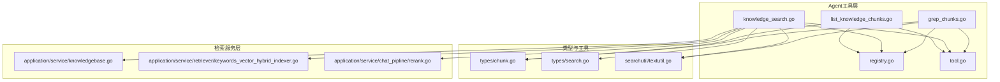
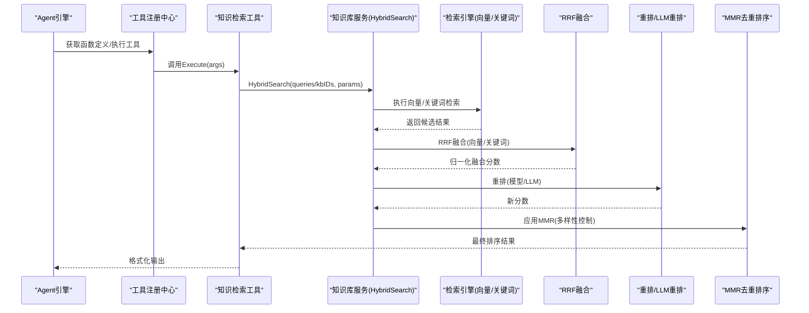
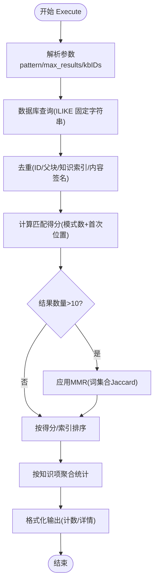
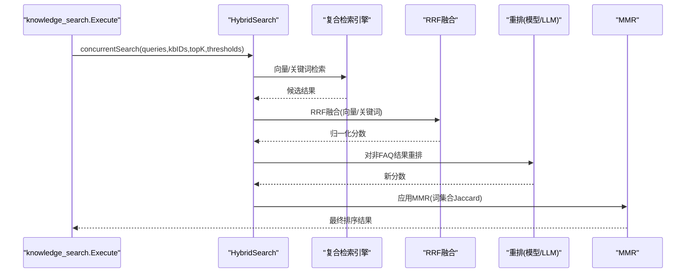
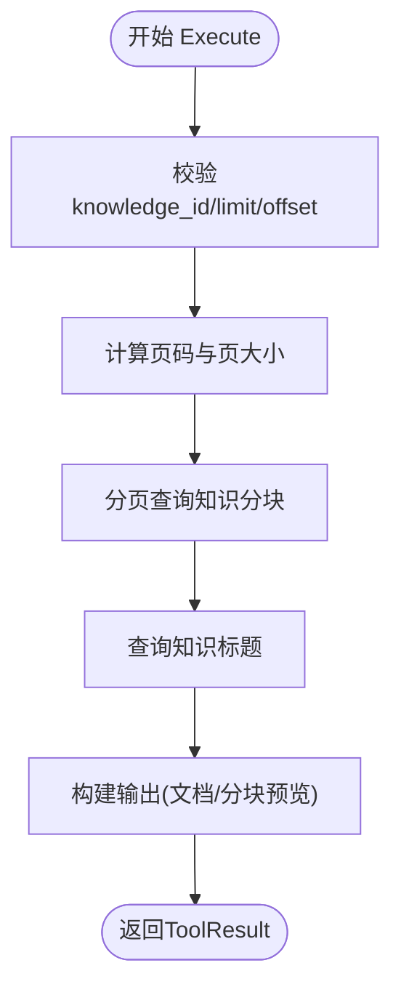
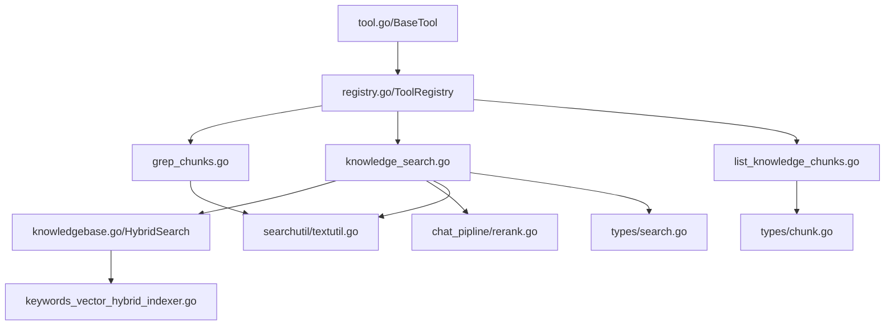

# 知识检索工具

<cite>
**本文引用的文件列表**
- [grep_chunks.go](file://internal/agent/tools/grep_chunks.go)
- [knowledge_search.go](file://internal/agent/tools/knowledge_search.go)
- [list_knowledge_chunks.go](file://internal/agent/tools/list_knowledge_chunks.go)
- [chunk.go](file://internal/types/chunk.go)
- [search.go](file://internal/types/search.go)
- [textutil.go](file://internal/searchutil/textutil.go)
- [keywords_vector_hybrid_indexer.go](file://internal/application/service/retriever/keywords_vector_hybrid_indexer.go)
- [knowledgebase.go](file://internal/application/service/knowledgebase.go)
- [rerank.go](file://internal/application/service/chat_pipline/rerank.go)
- [tool.go](file://internal/agent/tools/tool.go)
- [registry.go](file://internal/agent/tools/registry.go)
</cite>

## 目录
1. [简介](#简介)
2. [项目结构](#项目结构)
3. [核心组件](#核心组件)
4. [架构总览](#架构总览)
5. [详细组件分析](#详细组件分析)
6. [依赖关系分析](#依赖关系分析)
7. [性能考量](#性能考量)
8. [故障排查指南](#故障排查指南)
9. [结论](#结论)
10. [附录](#附录)

## 简介
本技术文档聚焦于知识检索类Agent工具，深入解析以下三个工具的实现机制与集成方式：
- grep_chunks：基于关键词的严格文本匹配与片段检索，支持去重、评分与MMR排序。
- knowledge_search：语义/向量检索与关键词权重混合检索，结合重排与MMR，提升相关性与多样性。
- list_knowledge_chunks：深度阅读核心工具，强制加载完整文档内容，支持分页与上下文查看，与chunking策略协同工作。

文档还结合internal/types/chunk.go与internal/application/service/retriever/模块，说明这些工具在整体检索流程中的角色与协作方式。

## 项目结构
围绕知识检索工具的关键目录与文件：
- internal/agent/tools：Agent工具实现（含上述三个工具）
- internal/types：共享数据结构（Chunk、SearchResult、SearchParams等）
- internal/searchutil：文本工具（签名、分词、Jaccard相似度等）
- internal/application/service/retriever：检索引擎与混合检索实现
- internal/application/service/knowledgebase.go：HybridSearch与RRF融合
- internal/application/service/chat_pipline/rerank.go：重排与MMR实现
- internal/agent/tools/tool.go、registry.go：工具基类与注册中心

图表来源
- [grep_chunks.go](file://internal/agent/tools/grep_chunks.go#L1-L200)
- [knowledge_search.go](file://internal/agent/tools/knowledge_search.go#L1-L200)
- [list_knowledge_chunks.go](file://internal/agent/tools/list_knowledge_chunks.go#L1-L120)
- [chunk.go](file://internal/types/chunk.go#L1-L114)
- [search.go](file://internal/types/search.go#L1-L135)
- [textutil.go](file://internal/searchutil/textutil.go#L1-L71)
- [keywords_vector_hybrid_indexer.go](file://internal/application/service/retriever/keywords_vector_hybrid_indexer.go#L1-L120)
- [knowledgebase.go](file://internal/application/service/knowledgebase.go#L430-L700)
- [rerank.go](file://internal/application/service/chat_pipline/rerank.go#L262-L347)
- [registry.go](file://internal/agent/tools/registry.go#L1-L115)
- [tool.go](file://internal/agent/tools/tool.go#L1-L78)

章节来源
- [grep_chunks.go](file://internal/agent/tools/grep_chunks.go#L1-L200)
- [knowledge_search.go](file://internal/agent/tools/knowledge_search.go#L1-L200)
- [list_knowledge_chunks.go](file://internal/agent/tools/list_knowledge_chunks.go#L1-L120)
- [chunk.go](file://internal/types/chunk.go#L1-L114)
- [search.go](file://internal/types/search.go#L1-L135)
- [textutil.go](file://internal/searchutil/textutil.go#L1-L71)
- [keywords_vector_hybrid_indexer.go](file://internal/application/service/retriever/keywords_vector_hybrid_indexer.go#L1-L120)
- [knowledgebase.go](file://internal/application/service/knowledgebase.go#L430-L700)
- [rerank.go](file://internal/application/service/chat_pipline/rerank.go#L262-L347)
- [registry.go](file://internal/agent/tools/registry.go#L1-L115)
- [tool.go](file://internal/agent/tools/tool.go#L1-L78)

## 核心组件
- grep_chunks工具：面向确定性文本匹配，支持多关键词OR逻辑、去重、评分与MMR，适合快速定位与预筛选。
- knowledge_search工具：语义检索与关键词权重混合，采用RRF融合、重排与MMR，适合深度理解与综合检索。
- list_knowledge_chunks工具：按知识ID列出分块，强制加载完整内容，便于长文本分析与上下文查看。

章节来源
- [grep_chunks.go](file://internal/agent/tools/grep_chunks.go#L1-L200)
- [knowledge_search.go](file://internal/agent/tools/knowledge_search.go#L1-L200)
- [list_knowledge_chunks.go](file://internal/agent/tools/list_knowledge_chunks.go#L1-L120)

## 架构总览
检索流程概览（从Agent工具到服务层）：

图表来源
- [knowledge_search.go](file://internal/agent/tools/knowledge_search.go#L150-L387)
- [knowledgebase.go](file://internal/application/service/knowledgebase.go#L430-L700)
- [rerank.go](file://internal/application/service/chat_pipline/rerank.go#L262-L347)

## 详细组件分析

### grep_chunks 工具
- 功能定位：严格文本匹配，支持多关键词OR逻辑；适用于精确关键字定位、快速预筛选。
- 关键实现要点：
  - 参数校验与默认值：支持pattern数组、max_results上限、知识库过滤。
  - 数据库查询：基于ILIKE的大小写不敏感固定字符串匹配，支持多模式OR。
  - 去重：基于ID、父块ID、知识ID+索引组合键，以及内容签名（MD5归一化）。
  - 评分：基于匹配模式数量与首次出现位置，给予轻微位置奖励。
  - MMR：基于Jaccard相似度（词集合）平衡相关性与多样性。
  - 输出聚合：按知识项聚合统计，展示命中模式计数与总体统计。
- 正则表达式处理：未使用正则，采用固定字符串匹配与ILIKE模糊匹配。
- 上下文提取：通过聚合统计与排序字段体现上下文线索（chunk索引、总数等）。

图表来源
- [grep_chunks.go](file://internal/agent/tools/grep_chunks.go#L114-L257)
- [grep_chunks.go](file://internal/agent/tools/grep_chunks.go#L267-L315)
- [grep_chunks.go](file://internal/agent/tools/grep_chunks.go#L317-L365)
- [grep_chunks.go](file://internal/agent/tools/grep_chunks.go#L378-L454)
- [grep_chunks.go](file://internal/agent/tools/grep_chunks.go#L490-L546)
- [grep_chunks.go](file://internal/agent/tools/grep_chunks.go#L553-L605)
- [grep_chunks.go](file://internal/agent/tools/grep_chunks.go#L607-L694)
- [textutil.go](file://internal/searchutil/textutil.go#L1-L71)

章节来源
- [grep_chunks.go](file://internal/agent/tools/grep_chunks.go#L114-L257)
- [grep_chunks.go](file://internal/agent/tools/grep_chunks.go#L267-L315)
- [grep_chunks.go](file://internal/agent/tools/grep_chunks.go#L317-L365)
- [grep_chunks.go](file://internal/agent/tools/grep_chunks.go#L378-L454)
- [grep_chunks.go](file://internal/agent/tools/grep_chunks.go#L490-L546)
- [grep_chunks.go](file://internal/agent/tools/grep_chunks.go#L553-L605)
- [grep_chunks.go](file://internal/agent/tools/grep_chunks.go#L607-L694)
- [textutil.go](file://internal/searchutil/textutil.go#L1-L71)

典型使用场景
- 快速定位：提供短关键词列表，快速筛选相关知识项。
- 预处理：先用grep_chunks缩小范围，再用knowledge_search做语义检索。
- 精确核对：对特定实体或版本号进行严格匹配。

输入参数
- pattern: 字符串数组（必填），支持单个或多个关键词（OR逻辑）
- knowledge_base_ids: 字符串数组（可选），限制知识库范围
- max_results: 整数（可选，默认50，上限200）

返回结构
- ToolResult：包含成功标志、输出文本、数据对象（patterns、knowledge_results、result_count、total_matches、knowledge_base_ids、max_results、display_type）

性能考量
- 查询路径：ILIKE全表扫描，建议配合知识库过滤与索引优化。
- 去重成本：内容签名与多键去重，适合中等规模结果集。
- MMR阈值：仅在结果较多时启用，避免小样本过度重排。

### knowledge_search 工具
- 功能定位：语义/向量检索与关键词权重混合，结合重排与MMR，提升相关性与多样性。
- 关键实现要点：
  - 并行混合检索：对每个查询与知识库组合并发执行HybridSearch。
  - RRF融合：Reciprocal Rank Fusion，统一向量与关键词的分数尺度。
  - 重排：优先使用LLM重排（可回退到专用重排模型），对FAQ与非FAQ分别处理。
  - 复合评分：在重排后应用复合评分，进一步平衡相关性与多样性。
  - MMR：基于Jaccard相似度选择多样化候选，控制冗余。
  - 结果排序：按最终分数降序，必要时按知识ID稳定排序。
- 与检索服务的集成：
  - HybridSearch：创建复合检索引擎，分别执行向量与关键词检索，随后RRF融合。
  - Rerank：对非FAQ结果进行批量LLM评分，必要时回退至专用重排模型。
  - MMR：在重排后再次应用MMR，保证多样性。

图表来源
- [knowledge_search.go](file://internal/agent/tools/knowledge_search.go#L263-L387)
- [knowledgebase.go](file://internal/application/service/knowledgebase.go#L430-L700)
- [rerank.go](file://internal/application/service/chat_pipline/rerank.go#L262-L347)

章节来源
- [knowledge_search.go](file://internal/agent/tools/knowledge_search.go#L150-L387)
- [knowledgebase.go](file://internal/application/service/knowledgebase.go#L430-L700)
- [rerank.go](file://internal/application/service/chat_pipline/rerank.go#L262-L347)

典型使用场景
- 概念理解：对抽象主题、机制、最佳实践等进行语义检索。
- 综合问答：结合向量相似度与关键词覆盖，提高召回与相关性。
- 多查询融合：支持1-5个语义查询，自动融合与重排。

输入参数
- queries: 字符串数组（必填，1-5条语义查询）
- knowledge_base_ids: 字符串数组（可选，限制知识库范围）

返回结构
- ToolResult：包含成功标志、输出文本、数据对象（最终排序结果、查询、知识库ID等）

性能考量
- 并行度：对每个查询与知识库组合并发检索，注意资源占用。
- 重排成本：LLM重排采用批处理（默认每批15），控制token消耗。
- RRF与阈值：HybridSearch阶段已做阈值过滤，后续无需重复阈值处理。

### list_knowledge_chunks 工具
- 功能定位：深度阅读核心工具，按知识ID列出分块，强制加载完整内容，支持分页与上下文查看。
- 关键实现要点：
  - 参数校验：knowledge_id必填，limit默认20、上限100，offset默认0。
  - 分页：根据limit与offset计算页码与页大小，调用仓库接口分页查询。
  - 内容加载：返回每个分块的完整内容、类型、索引、位置信息等。
  - 输出构建：汇总文档标题、总分块数、本次拉取数量与范围，提供分块内容预览。
- 与chunking策略协同：
  - 支持文本与FAQ类型分块，便于长文本分析与上下文定位。
  - 通过chunk_index与start_at/end_at定位原文位置，辅助溯源。

图表来源
- [list_knowledge_chunks.go](file://internal/agent/tools/list_knowledge_chunks.go#L80-L169)
- [list_knowledge_chunks.go](file://internal/agent/tools/list_knowledge_chunks.go#L171-L240)

章节来源
- [list_knowledge_chunks.go](file://internal/agent/tools/list_knowledge_chunks.go#L1-L169)
- [list_knowledge_chunks.go](file://internal/agent/tools/list_knowledge_chunks.go#L171-L240)

典型使用场景
- 长文本分析：在已知知识ID的情况下，查看完整分块内容与上下文。
- 上下文定位：通过chunk_index与位置信息定位原文片段。
- 分页浏览：对超长文档进行分页读取与对比。

输入参数
- knowledge_id: 字符串（必填）
- limit: 整数（可选，默认20，上限100）
- offset: 整数（可选，默认0）

返回结构
- ToolResult：包含成功标志、输出文本、数据对象（知识ID、标题、总数、分页信息、分块列表）

性能考量
- 分页查询：避免一次性加载过多分块，降低内存与网络压力。
- 内容长度：对预览内容进行截断，避免过长文本影响显示与传输。

## 依赖关系分析
- 工具基类与注册中心：
  - BaseTool提供名称、描述与通用格式化工具。
  - ToolRegistry负责工具注册、函数定义导出与执行调度。
- 检索服务与引擎：
  - knowledgebase.HybridSearch：创建复合检索引擎，执行向量与关键词检索，RRF融合，迭代检索与负向问题过滤。
  - keywords_vector_hybrid_indexer：封装向量/关键词混合检索引擎服务。
- 文本工具：
  - searchutil：内容签名、分词、Jaccard相似度等，供去重、MMR与评分使用。
- 重排与MMR：
  - chat_pipline.rerank：LLM重排与MMR实现，使用Jaccard相似度与token集合。

图表来源
- [tool.go](file://internal/agent/tools/tool.go#L1-L78)
- [registry.go](file://internal/agent/tools/registry.go#L1-L115)
- [grep_chunks.go](file://internal/agent/tools/grep_chunks.go#L1-L200)
- [knowledge_search.go](file://internal/agent/tools/knowledge_search.go#L1-L200)
- [list_knowledge_chunks.go](file://internal/agent/tools/list_knowledge_chunks.go#L1-L120)
- [knowledgebase.go](file://internal/application/service/knowledgebase.go#L430-L700)
- [keywords_vector_hybrid_indexer.go](file://internal/application/service/retriever/keywords_vector_hybrid_indexer.go#L1-L120)
- [rerank.go](file://internal/application/service/chat_pipline/rerank.go#L262-L347)
- [textutil.go](file://internal/searchutil/textutil.go#L1-L71)
- [chunk.go](file://internal/types/chunk.go#L1-L114)
- [search.go](file://internal/types/search.go#L1-L135)

章节来源
- [tool.go](file://internal/agent/tools/tool.go#L1-L78)
- [registry.go](file://internal/agent/tools/registry.go#L1-L115)
- [grep_chunks.go](file://internal/agent/tools/grep_chunks.go#L1-L200)
- [knowledge_search.go](file://internal/agent/tools/knowledge_search.go#L1-L200)
- [list_knowledge_chunks.go](file://internal/agent/tools/list_knowledge_chunks.go#L1-L120)
- [knowledgebase.go](file://internal/application/service/knowledgebase.go#L430-L700)
- [keywords_vector_hybrid_indexer.go](file://internal/application/service/retriever/keywords_vector_hybrid_indexer.go#L1-L120)
- [rerank.go](file://internal/application/service/chat_pipline/rerank.go#L262-L347)
- [textutil.go](file://internal/searchutil/textutil.go#L1-L71)
- [chunk.go](file://internal/types/chunk.go#L1-L114)
- [search.go](file://internal/types/search.go#L1-L135)

## 性能考量
- grep_chunks
  - ILIKE匹配可能触发全表扫描，建议在知识库ID与chunk索引上建立合适索引。
  - MMR仅在结果较多时启用，避免小样本过度重排。
  - 去重采用内容签名与多键组合，适合中等规模结果集。
- knowledge_search
  - 并行度高，注意并发连接与资源限制；合理设置topK与阈值。
  - LLM重排采用批处理（默认每批15），控制token使用；失败时回退至专用重排模型。
  - RRF融合后无需重复阈值过滤，减少额外计算。
- list_knowledge_chunks
  - 分页查询避免一次性加载过多分块；对预览内容进行截断，降低传输与渲染压力。

## 故障排查指南
- 参数错误
  - grep_chunks：缺少pattern或pattern为空，返回错误并记录日志。
  - knowledge_search：queries为空或知识库不可用，返回错误。
  - list_knowledge_chunks：knowledge_id缺失或查询无数据，返回错误。
- 检索无结果
  - 检查knowledge_base_ids与租户配置，确认KB可用且已索引。
  - 调整阈值（vector_threshold、keyword_threshold）或增加topK。
- 重排失败
  - LLM重排失败时自动回退至专用重排模型；若仍失败，使用原始分数。
- MMR无效
  - 当结果为空或k<=0时，MMR直接返回空；检查输入与阈值设置。

章节来源
- [grep_chunks.go](file://internal/agent/tools/grep_chunks.go#L132-L187)
- [knowledge_search.go](file://internal/agent/tools/knowledge_search.go#L170-L206)
- [knowledge_search.go](file://internal/agent/tools/knowledge_search.go#L289-L318)
- [list_knowledge_chunks.go](file://internal/agent/tools/list_knowledge_chunks.go#L80-L131)

## 结论
- grep_chunks：适合确定性文本匹配与快速预筛选，具备完善的去重、评分与MMR机制。
- knowledge_search：通过向量与关键词混合、RRF融合、重排与MMR，实现高相关性与多样性的综合检索。
- list_knowledge_chunks：为深度阅读与长文本分析提供基础能力，与chunking策略紧密协同。
- 三者在Agent工具体系中分工明确，配合工具注册中心与检索服务层，形成高效、可扩展的知识检索链路。

## 附录
- 数据模型参考
  - Chunk：文档分块的核心数据结构，包含内容、索引、类型、父子关系等。
  - SearchResult/SearchParams：检索结果与参数的数据结构，支撑HybridSearch与RRF融合。
- 文本工具参考
  - BuildContentSignature、TokenizeSimple、Jaccard：用于去重、MMR与评分的基础工具。

章节来源
- [chunk.go](file://internal/types/chunk.go#L1-L114)
- [search.go](file://internal/types/search.go#L1-L135)
- [textutil.go](file://internal/searchutil/textutil.go#L1-L71)