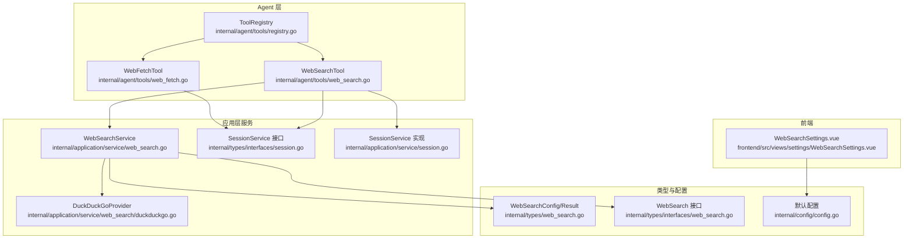
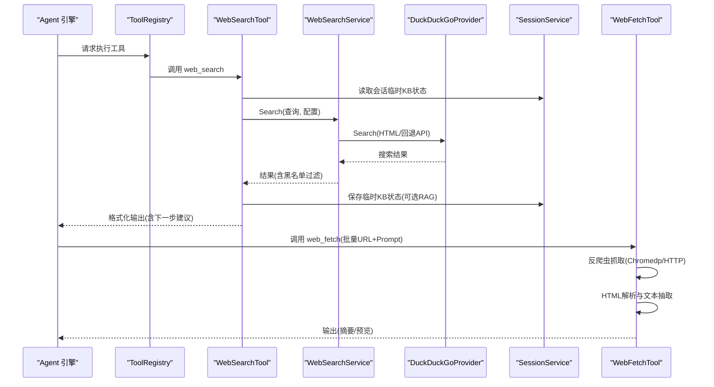
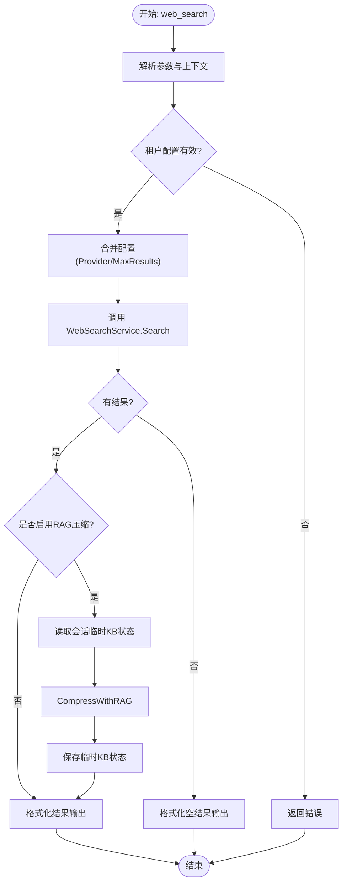
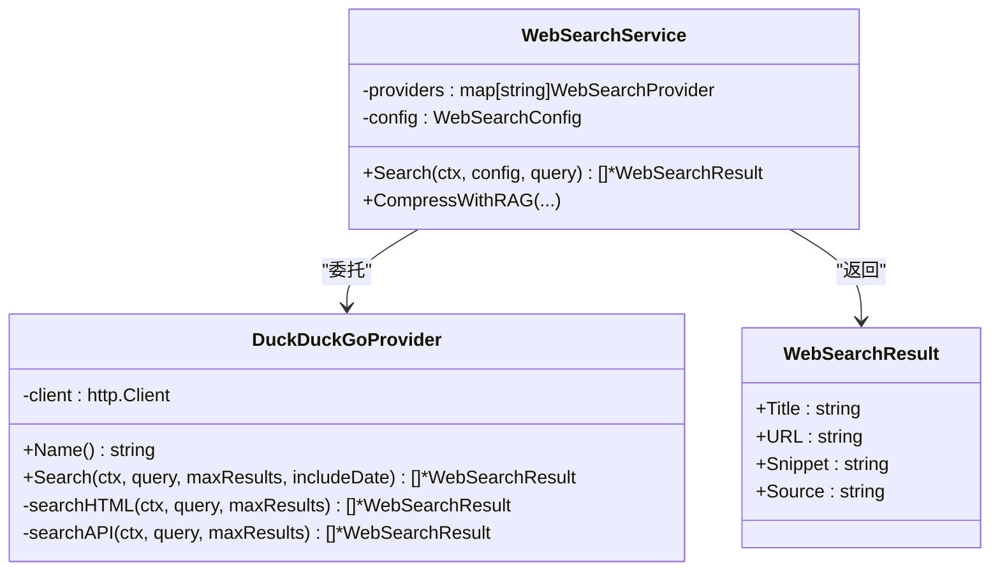
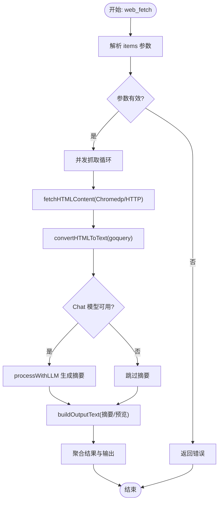
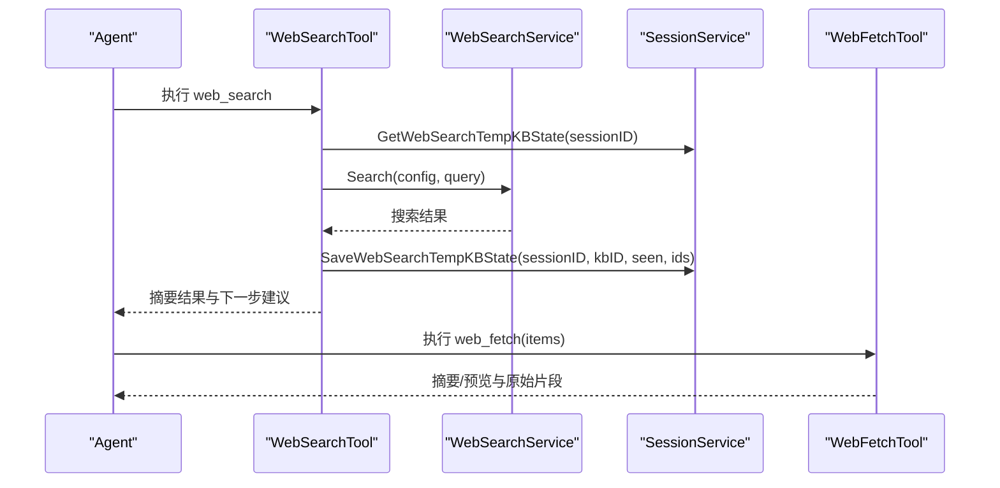
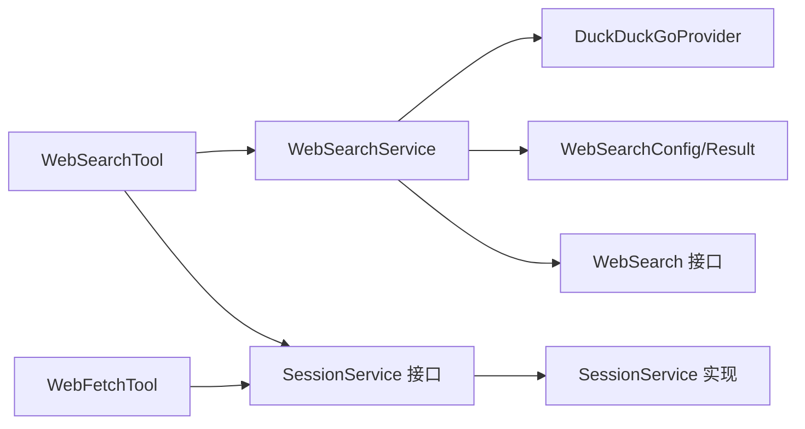

# 网络工具

<cite>
**本文引用的文件**
- [web_search.go](file://internal/agent/tools/web_search.go)
- [web_fetch.go](file://internal/agent/tools/web_fetch.go)
- [web_search.go](file://internal/application/service/web_search.go)
- [duckduckgo.go](file://internal/application/service/web_search/duckduckgo.go)
- [web_search.go](file://internal/types/web_search.go)
- [web_search.go](file://internal/types/interfaces/web_search.go)
- [session.go](file://internal/types/interfaces/session.go)
- [session.go](file://internal/application/service/session.go)
- [search.go](file://internal/application/service/chat_pipline/search.go)
- [registry.go](file://internal/agent/tools/registry.go)
- [WebSearchSettings.vue](file://frontend/src/views/settings/WebSearchSettings.vue)
- [config.go](file://internal/config/config.go)
</cite>

## 目录
1. [简介](#简介)
2. [项目结构](#项目结构)
3. [核心组件](#核心组件)
4. [架构总览](#架构总览)
5. [详细组件分析](#详细组件分析)
6. [依赖分析](#依赖分析)
7. [性能考虑](#性能考虑)
8. [故障排查指南](#故障排查指南)
9. [结论](#结论)
10. [附录](#附录)

## 简介
本技术文档聚焦于网络操作类Agent工具，系统性阐述“网络搜索”与“网页抓取”的设计模式与协同工作机制。重点覆盖：
- web_search.go 如何调用 DuckDuckGo 等搜索引擎API获取摘要结果，包括查询构造、结果过滤与安全校验机制；
- web_fetch.go 如何根据 URL 获取完整网页内容，处理 HTML 解析、文本提取与编码转换，并通过 docreader/parser 服务进行结构化处理；
- 两个工具在 Agent 工作流中的调用顺序：先通过搜索获取线索，再通过抓取获取详情；
- 超时配置、重试策略、反爬虫规避措施及返回数据格式说明；
- 内部 application/service/web_search 模块的服务依赖关系。

## 项目结构
围绕网络工具的关键代码分布如下：
- Agent 层工具实现：internal/agent/tools/web_search.go、internal/agent/tools/web_fetch.go
- 应用层服务：internal/application/service/web_search.go、duckduckgo.go
- 类型与接口：internal/types/web_search.go、internal/types/interfaces/web_search.go、internal/types/interfaces/session.go
- 会话与缓存：internal/application/service/session.go、internal/types/interfaces/session.go
- Agent 注册与执行：internal/agent/tools/registry.go
- 前端配置界面：frontend/src/views/settings/WebSearchSettings.vue
- 默认配置：internal/config/config.go

图表来源
- [web_search.go](file://internal/agent/tools/web_search.go#L1-L280)
- [web_fetch.go](file://internal/agent/tools/web_fetch.go#L1-L602)
- [web_search.go](file://internal/application/service/web_search.go#L1-L381)
- [duckduckgo.go](file://internal/application/service/web_search/duckduckgo.go#L1-L259)
- [web_search.go](file://internal/types/web_search.go#L1-L60)
- [web_search.go](file://internal/types/interfaces/web_search.go#L1-L29)
- [session.go](file://internal/types/interfaces/session.go#L1-L86)
- [session.go](file://internal/application/service/session.go#L1096-L1144)
- [registry.go](file://internal/agent/tools/registry.go#L1-L115)
- [WebSearchSettings.vue](file://frontend/src/views/settings/WebSearchSettings.vue#L143-L332)
- [config.go](file://internal/config/config.go#L205-L222)

章节来源
- [web_search.go](file://internal/agent/tools/web_search.go#L1-L280)
- [web_fetch.go](file://internal/agent/tools/web_fetch.go#L1-L602)
- [web_search.go](file://internal/application/service/web_search.go#L1-L381)
- [duckduckgo.go](file://internal/application/service/web_search/duckduckgo.go#L1-L259)
- [web_search.go](file://internal/types/web_search.go#L1-L60)
- [web_search.go](file://internal/types/interfaces/web_search.go#L1-L29)
- [session.go](file://internal/types/interfaces/session.go#L1-L86)
- [session.go](file://internal/application/service/session.go#L1096-L1144)
- [registry.go](file://internal/agent/tools/registry.go#L1-L115)
- [WebSearchSettings.vue](file://frontend/src/views/settings/WebSearchSettings.vue#L143-L332)
- [config.go](file://internal/config/config.go#L205-L222)

## 核心组件
- WebSearchTool：面向 Agent 的工具入口，负责参数校验、租户配置读取、调用 WebSearchService 执行搜索、可选的 RAG 压缩、输出格式化与下一步建议。
- WebFetchTool：面向 Agent 的工具入口，负责批量抓取 URL、反爬虫规避、HTML 解析与文本抽取、LLM 分析摘要、聚合输出。
- WebSearchService：应用层服务，封装具体搜索引擎 Provider（当前支持 DuckDuckGo），统一超时控制、黑名单过滤、RAG 压缩协调。
- DuckDuckGoProvider：具体搜索引擎实现，优先使用 HTML 抓取，失败后回退到 API；对 URL 进行清洗与标题提取。
- SessionService：会话级缓存接口，提供临时知识库状态的读写，支撑 WebSearchTool 的 RAG 压缩去重与增量复用。
- 类型与接口：WebSearchConfig/Result、WebSearch 接口、Session 接口，确保跨层解耦与扩展性。

章节来源
- [web_search.go](file://internal/agent/tools/web_search.go#L1-L280)
- [web_fetch.go](file://internal/agent/tools/web_fetch.go#L1-L602)
- [web_search.go](file://internal/application/service/web_search.go#L1-L381)
- [duckduckgo.go](file://internal/application/service/web_search/duckduckgo.go#L1-L259)
- [web_search.go](file://internal/types/web_search.go#L1-L60)
- [web_search.go](file://internal/types/interfaces/web_search.go#L1-L29)
- [session.go](file://internal/types/interfaces/session.go#L1-L86)

## 架构总览
Agent 工具通过 ToolRegistry 统一注册与调度，WebSearchTool 与 WebFetchTool 分别对接应用层服务与外部搜索引擎。WebSearchService 负责选择 Provider 并执行搜索，同时在 Agent 工作流中与 SessionService 协作，利用会话级临时知识库实现 RAG 压缩与去重。

图表来源
- [registry.go](file://internal/agent/tools/registry.go#L71-L115)
- [web_search.go](file://internal/agent/tools/web_search.go#L116-L279)
- [web_search.go](file://internal/application/service/web_search.go#L245-L286)
- [duckduckgo.go](file://internal/application/service/web_search/duckduckgo.go#L40-L64)
- [session.go](file://internal/application/service/session.go#L1096-L1144)
- [web_fetch.go](file://internal/agent/tools/web_fetch.go#L99-L229)

## 详细组件分析

### WebSearchTool 设计与协作
- 角色定位：Agent 工具，负责从搜索引擎获取摘要结果，并在必要时进行 RAG 压缩以提升相关性与去重。
- 关键流程：
  - 参数校验与上下文读取（租户ID、租户 WebSearchConfig）；
  - 构造搜索配置（合并 Agent 配置与租户配置）；
  - 调用 WebSearchService.Search；
  - 可选 RAG 压缩：读取会话临时 KB 状态，构建问题，调用 CompressWithRAG，持久化临时 KB 状态；
  - 输出格式化：标题、URL、摘要、内容片段（截断）、发布时间、下一步建议。
- 安全与合规：
  - 租户配置校验与 Provider 选择；
  - 黑名单过滤由 WebSearchService 在应用层统一处理；
  - 严格要求先完成知识库检索（grep_chunks/knowledge_search）再使用 web_search。
- 数据格式：
  - 返回结构包含 query、results（每条含 title/url/snippet/content/source/published_at）、count、display_type。

图表来源
- [web_search.go](file://internal/agent/tools/web_search.go#L116-L279)
- [web_search.go](file://internal/application/service/web_search.go#L245-L286)
- [session.go](file://internal/application/service/session.go#L1096-L1144)

章节来源
- [web_search.go](file://internal/agent/tools/web_search.go#L1-L280)
- [web_search.go](file://internal/application/service/web_search.go#L1-L381)
- [session.go](file://internal/application/service/session.go#L1096-L1144)

### DuckDuckGo 搜索实现（WebSearchProvider）
- 设计要点：
  - 优先使用 HTML 抓取（更稳定），失败后回退到 DuckDuckGo Instant Answer API；
  - 清洗 URL（去除 DuckDuckGo 中转链接），提取标题与摘要；
  - 统一返回 WebSearchResult 列表。
- 查询构造与安全：
  - HTML 模式设置区域偏好（如 cn-zh）；
  - 设置 User-Agent 降低被封风险；
  - API 模式设置 JSON 输出与跳过消歧。
- 黑名单过滤：
  - WebSearchService 在应用层统一执行，避免将无效结果带入下游。

图表来源
- [duckduckgo.go](file://internal/application/service/web_search/duckduckgo.go#L1-L259)
- [web_search.go](file://internal/application/service/web_search.go#L1-L381)
- [web_search.go](file://internal/types/web_search.go#L41-L60)

章节来源
- [duckduckgo.go](file://internal/application/service/web_search/duckduckgo.go#L1-L259)
- [web_search.go](file://internal/application/service/web_search.go#L1-L381)
- [web_search.go](file://internal/types/web_search.go#L1-L60)

### WebFetchTool 抓取与解析
- 角色定位：Agent 工具，负责将 web_search 返回的 URL 转换为可读文本并可选地生成摘要。
- 关键流程：
  - 参数解析与校验（items 数组、每项 url/prompt）；
  - 并发抓取：每个 URL 启动 goroutine；
  - 反爬虫规避：优先使用 Chromedp（Headless Chrome）渲染，失败则回退 HTTP 直连；
  - HTML 解析与文本抽取：使用 goquery 清洗脚本/style/nav/footer/header 等非正文元素，递归节点生成 Markdown；
  - LLM 分析摘要：若可用，调用 Chat 模型生成摘要；
  - 输出聚合：汇总各 URL 的摘要/预览与原始内容片段长度、方法来源等。
- 超时与限流：
  - 全局抓取超时常量；
  - HTTP 读取限制最大字节数；
  - Chromedp 上下文超时控制；
  - 并发抓取通过 WaitGroup 控制。
- 返回数据格式：
  - results（每条含 url/prompt/raw_content/content_length/method/summary/error）、count、display_type。

图表来源
- [web_fetch.go](file://internal/agent/tools/web_fetch.go#L99-L229)
- [web_fetch.go](file://internal/agent/tools/web_fetch.go#L260-L363)
- [web_fetch.go](file://internal/agent/tools/web_fetch.go#L365-L464)
- [web_fetch.go](file://internal/agent/tools/web_fetch.go#L466-L602)

章节来源
- [web_fetch.go](file://internal/agent/tools/web_fetch.go#L1-L602)

### Agent 工作流中的调用顺序与协同
- 先知识库检索：grep_chunks 与 knowledge_search；
- 若不足或无结果，再调用 web_search 获取摘要线索；
- 当摘要内容不足或需要完整细节时，使用 web_fetch 抓取完整页面并生成摘要；
- RAG 压缩与会话缓存：WebSearchTool 在 Agent 工具层调用 WebSearchService 的 CompressWithRAG，并通过 SessionService 在 Redis 中维护临时知识库状态，避免重复索引。

图表来源
- [web_search.go](file://internal/agent/tools/web_search.go#L116-L279)
- [web_search.go](file://internal/application/service/web_search.go#L245-L286)
- [session.go](file://internal/application/service/session.go#L1096-L1144)
- [web_fetch.go](file://internal/agent/tools/web_fetch.go#L99-L229)

章节来源
- [web_search.go](file://internal/agent/tools/web_search.go#L1-L280)
- [web_search.go](file://internal/application/service/web_search.go#L1-L381)
- [session.go](file://internal/application/service/session.go#L1096-L1144)
- [web_fetch.go](file://internal/agent/tools/web_fetch.go#L1-L602)

## 依赖分析
- 组件耦合与内聚：
  - WebSearchTool 与 WebSearchService 通过接口解耦，便于替换 Provider；
  - WebSearchService 与 DuckDuckGoProvider 通过接口解耦，便于扩展其他 Provider；
  - WebSearchTool 与 SessionService 通过接口解耦，临时 KB 状态通过 Redis 存储，避免强耦合。
- 外部依赖与集成点：
  - DuckDuckGo HTML/API；
  - Headless Chrome（chromedp）；
  - goquery；
  - Redis（会话临时 KB 状态）。
- 循环依赖：
  - 未发现循环依赖迹象；接口分层清晰。

图表来源
- [web_search.go](file://internal/agent/tools/web_search.go#L1-L280)
- [web_search.go](file://internal/application/service/web_search.go#L1-L381)
- [duckduckgo.go](file://internal/application/service/web_search/duckduckgo.go#L1-L259)
- [web_search.go](file://internal/types/web_search.go#L1-L60)
- [web_search.go](file://internal/types/interfaces/web_search.go#L1-L29)
- [session.go](file://internal/types/interfaces/session.go#L1-L86)
- [session.go](file://internal/application/service/session.go#L1096-L1144)
- [web_fetch.go](file://internal/agent/tools/web_fetch.go#L1-L602)

章节来源
- [web_search.go](file://internal/agent/tools/web_search.go#L1-L280)
- [web_search.go](file://internal/application/service/web_search.go#L1-L381)
- [duckduckgo.go](file://internal/application/service/web_search/duckduckgo.go#L1-L259)
- [web_search.go](file://internal/types/web_search.go#L1-L60)
- [web_search.go](file://internal/types/interfaces/web_search.go#L1-L29)
- [session.go](file://internal/types/interfaces/session.go#L1-L86)
- [session.go](file://internal/application/service/session.go#L1096-L1144)
- [web_fetch.go](file://internal/agent/tools/web_fetch.go#L1-L602)

## 性能考虑
- 搜索阶段：
  - WebSearchService 对外设置超时，避免长时间阻塞；
  - 黑名单过滤在应用层一次性完成，减少下游无效处理；
  - RAG 压缩按会话临时 KB 去重，避免重复索引与检索。
- 抓取阶段：
  - 并发抓取提升吞吐，WaitGroup 控制资源；
  - Chromedp 渲染优先，失败回退 HTTP，兼顾稳定性；
  - HTTP 读取限制最大字节数，防止内存膨胀；
  - HTML 解析采用 goquery，节点遍历与正则清理减少冗余空白。
- 缓存与复用：
  - 会话级临时 KB 状态持久化至 Redis，跨请求复用，降低重复检索成本。

[本节为通用性能讨论，无需列出具体文件来源]

## 故障排查指南
- web_search 参数缺失或无效：
  - 确认 query 字段存在且非空；
  - 检查租户 WebSearchConfig 是否配置 Provider、MaxResults、CompressionMethod 等。
- 搜索失败：
  - 查看 WebSearchService 的超时与 Provider 回退日志；
  - 检查黑名单规则是否误判；
  - 确认租户配置与默认配置一致。
- RAG 压缩失败：
  - 临时 KB 创建失败或检索异常会被降级为原始结果；
  - 检查嵌入模型ID、文档片段数量等配置。
- web_fetch 抓取失败：
  - Chromedp 失败时会回退 HTTP，检查 HTTP 状态码与响应体；
  - URL 格式校验失败（必须以 http/https 开头）；
  - 超时或读取限制导致内容截断，适当增大超时或减少 MaxResults。
- 会话缓存异常：
  - Redis 读取/写入失败不会影响主流程，但会丢失临时 KB 状态；
  - 清理会话时确认 Redis 键是否存在。

章节来源
- [web_search.go](file://internal/agent/tools/web_search.go#L116-L279)
- [web_search.go](file://internal/application/service/web_search.go#L245-L286)
- [duckduckgo.go](file://internal/application/service/web_search/duckduckgo.go#L40-L64)
- [web_fetch.go](file://internal/agent/tools/web_fetch.go#L99-L229)
- [session.go](file://internal/application/service/session.go#L1096-L1144)

## 结论
WebSearchTool 与 WebFetchTool 通过清晰的职责划分与接口解耦，在 Agent 工作流中形成“线索获取—详情抓取”的闭环。WebSearchService 将 DuckDuckGo 等 Provider 的差异屏蔽在应用层，配合 SessionService 的会话级缓存，实现了高效、稳定的实时信息检索与补充。前端配置界面支持租户级 WebSearch 配置管理，便于按需调整 Provider、结果数量、压缩策略与黑名单规则。

[本节为总结性内容，无需列出具体文件来源]

## 附录

### 超时配置与重试策略
- WebSearchService 搜索超时：基于全局配置设置，未显式重试逻辑，失败即返回错误；
- DuckDuckGoProvider：
  - HTML 抓取超时固定；
  - API 抓取超时固定；
- WebFetchTool：
  - 全局抓取超时常量；
  - Chromedp 上下文超时；
  - HTTP 读取限制最大字节数；
  - 并发抓取，无显式重试，失败项单独记录错误。

章节来源
- [web_search.go](file://internal/application/service/web_search.go#L261-L269)
- [duckduckgo.go](file://internal/application/service/web_search/duckduckgo.go#L27-L33)
- [web_fetch.go](file://internal/agent/tools/web_fetch.go#L21-L24)

### 反爬虫规避措施
- DuckDuckGo HTML 抓取：
  - 设置真实 User-Agent；
  - 优先使用 HTML 抓取，必要时回退 API；
- WebFetchTool：
  - Chromedp 启用 headless、禁用 GPU、禁用 setuid sandbox 等参数；
  - 设置合理的 User-Agent；
  - 失败回退 HTTP 直连；
  - GitHub blob URL 自动规范化为 raw 地址。

章节来源
- [duckduckgo.go](file://internal/application/service/web_search/duckduckgo.go#L83-L94)
- [web_fetch.go](file://internal/agent/tools/web_fetch.go#L388-L425)
- [web_fetch.go](file://internal/agent/tools/web_fetch.go#L302-L309)

### 返回数据格式说明
- web_search：
  - results：每条包含 title/url/snippet/content/source/published_at；
  - count：结果数量；
  - display_type：web_search_results；
- web_fetch：
  - results：每条包含 url/prompt/raw_content/content_length/method/summary/error；
  - count：成功抓取数量；
  - display_type：web_fetch_results。

章节来源
- [web_search.go](file://internal/agent/tools/web_search.go#L202-L279)
- [web_fetch.go](file://internal/agent/tools/web_fetch.go#L210-L229)

### 租户配置与前端设置
- 租户 WebSearchConfig 支持 Provider、MaxResults、IncludeDate、CompressionMethod、Blacklist、嵌入与重排模型等；
- 前端 WebSearchSettings.vue 提供可视化配置与保存。

章节来源
- [web_search.go](file://internal/types/web_search.go#L9-L22)
- [WebSearchSettings.vue](file://frontend/src/views/settings/WebSearchSettings.vue#L143-L332)
- [config.go](file://internal/config/config.go#L205-L222)