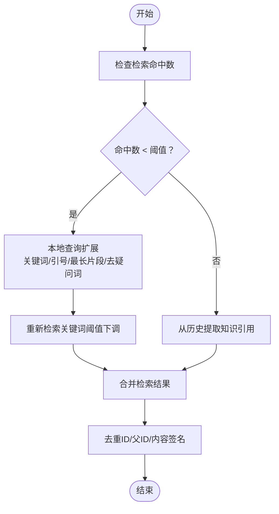

# 对话策略配置

<cite>
**本文引用的文件**
- [config/config.yaml](file://config/config.yaml)
- [internal/config/config.go](file://internal/config/config.go)
- [internal/application/service/chat_pipline/common.go](file://internal/application/service/chat_pipline/common.go)
- [internal/types/chat_manage.go](file://internal/types/chat_manage.go)
- [internal/application/service/chat_pipline/search.go](file://internal/application/service/chat_pipline/search.go)
- [internal/application/service/chat_pipline/rerank.go](file://internal/application/service/chat_pipline/rerank.go)
- [internal/application/service/model.go](file://internal/application/service/model.go)
- [internal/handler/tenant.go](file://internal/handler/tenant.go)
- [docs/BUILTIN_MODELS.md](file://docs/BUILTIN_MODELS.md)
</cite>

## 目录
1. [简介](#简介)
2. [项目结构](#项目结构)
3. [核心组件](#核心组件)
4. [架构总览](#架构总览)
5. [详细组件分析](#详细组件分析)
6. [依赖分析](#依赖分析)
7. [性能考量](#性能考量)
8. [故障排查指南](#故障排查指南)
9. [结论](#结论)
10. [附录](#附录)

## 简介
本指南面向系统管理员与平台开发者，聚焦于“对话策略配置”的权威解读与最佳实践。基于 config.yaml 中的对话相关配置项，结合 chat_pipline 的策略逻辑与模型选择机制，系统阐述温度参数、检索阈值、上下文长度、兜底策略等关键参数的含义、影响与调优方向，并提供高级配置示例（如多模型路由、动态阈值调整）以满足不同业务场景需求。

## 项目结构
对话策略配置主要分布在以下模块：
- 配置层：config/config.yaml 定义全局对话策略；internal/config/config.go 将 YAML 映射为结构体，供运行时读取。
- 管道层：chat_pipline 中的搜索、重排、合并、消息组装、模型调用等插件，依据配置驱动行为。
- 类型与服务：types.ChatManage 作为会话状态载体，model.go 提供模型选择与初始化能力。
- 管理接口：tenant.go 对租户维度的对话配置进行校验与合并。

图表来源
- [config/config.yaml](file://config/config.yaml#L1-L250)
- [internal/config/config.go](file://internal/config/config.go#L15-L120)
- [internal/types/chat_manage.go](file://internal/types/chat_manage.go#L1-L142)
- [internal/application/service/chat_pipline/search.go](file://internal/application/service/chat_pipline/search.go#L1-L120)
- [internal/application/service/chat_pipline/rerank.go](file://internal/application/service/chat_pipline/rerank.go#L1-L120)
- [internal/application/service/chat_pipline/common.go](file://internal/application/service/chat_pipline/common.go#L28-L74)
- [internal/application/service/model.go](file://internal/application/service/model.go#L302-L347)
- [internal/handler/tenant.go](file://internal/handler/tenant.go#L666-L740)

章节来源
- [config/config.yaml](file://config/config.yaml#L1-L250)
- [internal/config/config.go](file://internal/config/config.go#L15-L120)

## 核心组件
- 对话配置结构（ConversationConfig）：承载检索阈值、TopK、重排阈值、重排TopK、重写开关、查询扩展、摘要生成参数、兜底策略等。
- 会话状态（ChatManage）：承载当前会话的查询、重写查询、历史、阈值、TopK、模型ID、摘要配置、兜底策略等。
- 搜索插件（PluginSearch）：执行知识库与网页检索，支持并发、去重、低召回时的本地查询扩展。
- 重排插件（PluginRerank）：调用重排模型，计算复合分数，应用 MMR 去冗，支持阈值降级。
- 模型准备（prepareChatModel）：从模型服务获取聊天模型实例，并将摘要配置中的温度、TopP、种子、最大生成令牌等注入到 ChatOptions。
- 模型服务（ModelService）：负责聊天/嵌入/重排模型的获取与初始化。

章节来源
- [internal/config/config.go](file://internal/config/config.go#L37-L118)
- [internal/types/chat_manage.go](file://internal/types/chat_manage.go#L1-L96)
- [internal/application/service/chat_pipline/search.go](file://internal/application/service/chat_pipline/search.go#L1-L120)
- [internal/application/service/chat_pipline/rerank.go](file://internal/application/service/chat_pipline/rerank.go#L1-L120)
- [internal/application/service/chat_pipline/common.go](file://internal/application/service/chat_pipline/common.go#L28-L74)
- [internal/application/service/model.go](file://internal/application/service/model.go#L302-L347)

## 架构总览
对话策略在“检索增强生成（RAG）”流水线中起决定性作用，贯穿“重写查询、检索、重排、合并、消息组装、模型调用”等阶段。配置项通过 ChatManage 传递至各插件，插件据此调整召回策略、重排阈值、TopK、以及兜底策略。

图表来源
- [internal/types/chat_manage.go](file://internal/types/chat_manage.go#L98-L142)
- [internal/application/service/chat_pipline/search.go](file://internal/application/service/chat_pipline/search.go#L1-L120)
- [internal/application/service/chat_pipline/rerank.go](file://internal/application/service/chat_pipline/rerank.go#L1-L120)
- [internal/application/service/chat_pipline/common.go](file://internal/application/service/chat_pipline/common.go#L28-L74)

## 详细组件分析

### 1) 配置项详解与行为影响
- max_rounds：控制重写与上下文截断的历史轮数，默认5，影响重写阶段的历史上下文长度。
- keyword_threshold：关键词检索的最小相似度阈值，默认0.3，越小召回越多但噪音更大。
- embedding_top_k：向量检索返回候选数量，默认10，直接影响后续重排与合并的输入规模。
- vector_threshold：向量检索阈值，默认0.5，越小召回越多。
- rerank_threshold：重排阶段的阈值，默认0.5，越小召回越多；当无结果时会进行阈值降级（例如降至0.3）。
- rerank_top_k：重排后保留的TopK，默认5，影响最终上下文规模与生成成本。
- fallback_strategy：兜底策略，支持“fixed（固定回复）”和“model（模型兜底）”，默认“fixed”。
- fallback_response：固定兜底回复内容。
- fallback_prompt：模型兜底提示词，仅在 fallback_strategy=model 时生效。
- enable_rewrite：是否启用查询重写（指代消解、省略补全）。
- enable_query_expansion：低召回时是否进行本地查询扩展（关键词、引号短语、最长片段、去疑问词等）。
- enable_rerank：是否启用重排阶段。
- summary.temperature、summary.top_p、summary.max_completion_tokens、summary.prompt、summary.context_template 等：摘要/生成阶段的温度、TopP、最大生成令牌、系统提示与上下文模板。

章节来源
- [config/config.yaml](file://config/config.yaml#L1-L250)
- [internal/config/config.go](file://internal/config/config.go#L37-L118)
- [internal/types/chat_manage.go](file://internal/types/chat_manage.go#L1-L96)

### 2) 检索阶段（PluginSearch）
- 并发检索：知识库与网页检索并发执行，结果汇总后去重。
- 低召回扩展：当检索命中数过少（低于阈值）时，触发本地查询扩展（移除停用词、抽取关键词、引号短语、最长片段、去除疑问词等），并以更低的关键词阈值再次检索。
- 历史引用：从最近历史中提取知识引用作为补充。
- 去重策略：基于 chunk ID、父 chunk ID、内容签名等综合去重。

图表来源
- [internal/application/service/chat_pipline/search.go](file://internal/application/service/chat_pipline/search.go#L120-L210)
- [internal/application/service/chat_pipline/search.go](file://internal/application/service/chat_pipline/search.go#L410-L562)

章节来源
- [internal/application/service/chat_pipline/search.go](file://internal/application/service/chat_pipline/search.go#L1-L210)
- [internal/application/service/chat_pipline/search.go](file://internal/application/service/chat_pipline/search.go#L410-L562)

### 3) 重排阶段（PluginRerank）
- 模型调用：调用重排模型对候选段落进行重排，记录输入分数与阈值。
- 阈值降级：若无结果且原始阈值较高，自动降级阈值（例如降至0.3）再试一次，然后恢复原始阈值。
- 复合评分：结合基础分数、模型分数与来源权重、位置优先因子，计算最终得分。
- MMR 去冗：在重排后按 Jaccard 相似度进行去冗，保留多样性与相关性平衡。

图表来源
- [internal/application/service/chat_pipline/rerank.go](file://internal/application/service/chat_pipline/rerank.go#L1-L180)
- [internal/application/service/chat_pipline/rerank.go](file://internal/application/service/chat_pipline/rerank.go#L180-L320)

章节来源
- [internal/application/service/chat_pipline/rerank.go](file://internal/application/service/chat_pipline/rerank.go#L1-L200)
- [internal/application/service/chat_pipline/rerank.go](file://internal/application/service/chat_pipline/rerank.go#L200-L320)

### 4) 模型选择与温度参数
- prepareChatModel：从模型服务获取聊天模型实例，并将摘要配置中的温度、TopP、种子、最大生成令牌、频率惩罚、存在惩罚等注入 ChatOptions。
- 模型服务：根据模型ID获取聊天/嵌入/重排模型，支持远端与本地（如 Ollama）两种来源。

图表来源
- [internal/application/service/chat_pipline/common.go](file://internal/application/service/chat_pipline/common.go#L28-L74)
- [internal/application/service/model.go](file://internal/application/service/model.go#L302-L347)
- [internal/types/chat_manage.go](file://internal/types/chat_manage.go#L1-L96)

章节来源
- [internal/application/service/chat_pipline/common.go](file://internal/application/service/chat_pipline/common.go#L28-L74)
- [internal/application/service/model.go](file://internal/application/service/model.go#L302-L347)

### 5) 兜底策略（Fallback）
- fixed：直接返回固定兜底回复。
- model：使用 fallback_prompt 渲染模板后，通过模型生成兜底回复（需要 EventBus 支持流式输出）。

章节来源
- [config/config.yaml](file://config/config.yaml#L1-L100)
- [internal/handler/tenant.go](file://internal/handler/tenant.go#L666-L740)
- [internal/application/service/session.go](file://internal/application/service/session.go#L1209-L1238)

### 6) 上下文长度与系统提示
- 上下文长度：由 summary.max_completion_tokens 控制模型最大生成长度；prepareMessagesWithHistory 会截断历史以控制上下文长度。
- 系统提示与上下文模板：summary.prompt 与 summary.context_template 决定检索结果的组织与输出风格。

章节来源
- [internal/application/service/chat_pipline/common.go](file://internal/application/service/chat_pipline/common.go#L52-L74)
- [internal/config/config.go](file://internal/config/config.go#L64-L118)

### 7) 模型选择与内置模型
- 内置模型：系统级别模型，对所有租户可见，不可编辑或删除，适合统一默认模型。
- 添加内置模型：通过数据库插入内置模型记录，设置 is_builtin=true，并在前端隐藏敏感信息。
- 模型来源：remote（远端）与 local（本地，如 Ollama）。

章节来源
- [docs/BUILTIN_MODELS.md](file://docs/BUILTIN_MODELS.md#L1-L174)
- [internal/application/service/model.go](file://internal/application/service/model.go#L302-L347)

## 依赖分析
- 配置到运行时：config/config.yaml 通过 viper 解析为 Config 结构体，内部 ConversationConfig 与 SummaryConfig 作为运行时配置。
- 会话状态：ChatManage 作为流水线状态载体，承载阈值、TopK、模型ID、摘要配置、兜底策略等。
- 插件链路：事件管理器按顺序注册插件，依次执行重写、检索、重排、合并、消息组装、模型调用。
- 模型依赖：模型服务负责模型获取与初始化，聊天模型参数来自摘要配置。

图表来源
- [internal/config/config.go](file://internal/config/config.go#L148-L196)
- [internal/types/chat_manage.go](file://internal/types/chat_manage.go#L1-L96)
- [internal/application/service/model.go](file://internal/application/service/model.go#L302-L347)

章节来源
- [internal/config/config.go](file://internal/config/config.go#L148-L196)
- [internal/types/chat_manage.go](file://internal/types/chat_manage.go#L1-L96)
- [internal/application/service/model.go](file://internal/application/service/model.go#L302-L347)

## 性能考量
- 检索并发与去重：并发检索与去重可显著提升吞吐，但需注意内存与 CPU 开销。
- 低召回扩展：本地扩展会增加检索作业数，建议结合 embedding_top_k 与关键词阈值进行权衡。
- 阈值降级：重排阶段的阈值降级可提升召回率，但可能引入噪声，建议配合 MMR 去冗。
- 生成长度与温度：max_completion_tokens 与 temperature 影响生成成本与稳定性，建议在测试环境中逐步调优。

[本节为通用指导，不直接分析具体文件]

## 故障排查指南
- 温度过高/过低：可能导致输出不稳定或缺乏创造性，建议在 0~1 范围内调整。
- 阈值设置不当：keyword_threshold/vector_threshold/rerank_threshold 过高导致召回不足，过低导致噪音增多。
- 兜底策略无效：fallback_strategy=model 时需确保 fallback_prompt 已配置且 EventBus 可用。
- 模型不可用：确认模型状态为 active，且模型ID正确；内置模型不可编辑或删除。

章节来源
- [internal/handler/tenant.go](file://internal/handler/tenant.go#L666-L740)
- [internal/application/service/session.go](file://internal/application/service/session.go#L1209-L1238)
- [internal/application/service/model.go](file://internal/application/service/model.go#L95-L142)

## 结论
对话策略配置是 RAG 管道的“方向盘”。通过合理设置阈值、TopK、温度与兜底策略，并结合本地查询扩展与阈值降级，可在准确性与召回之间取得良好平衡。模型选择与初始化由模型服务统一管理，建议结合内置模型与租户自定义模型，实现“统一默认 + 场景定制”的双轨策略。

[本节为总结性内容，不直接分析具体文件]

## 附录

### A. 高级配置示例（概念性说明）
- 多模型路由
  - 方案：根据问题类型或领域选择不同聊天模型（如法律/技术/通用），在会话开始时解析问题并设置 ChatModelID。
  - 注意：需在模型服务中为不同模型配置参数，并在 UI 或后端逻辑中实现路由决策。
- 动态阈值调整
  - 方案：基于历史命中率与质量指标（如平均重排分数、去重比例、MMR 平均冗余）动态调整 keyword_threshold/vector_threshold/rerank_threshold。
  - 注意：调整策略需与重排阈值降级协同，避免过度降级导致噪声上升。
- 多知识库并行检索
  - 方案：在 ChatManage 中设置多个 KnowledgeBaseIDs，PluginSearch 会并发检索并合并结果，再进行重排与去重。
  - 注意：合理设置 embedding_top_k 与 rerank_top_k，避免结果规模过大导致重排开销过高。

[本节为概念性说明，不直接分析具体文件]