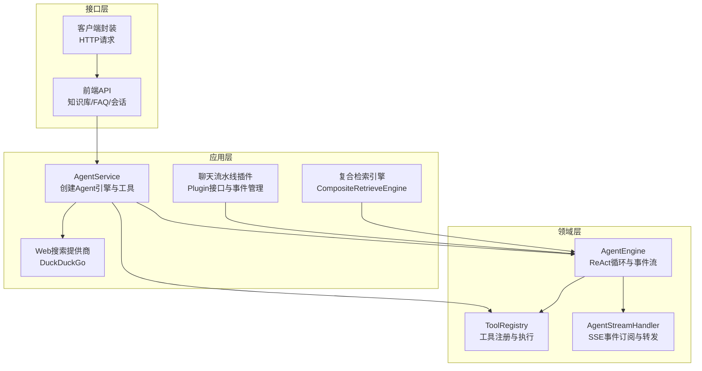
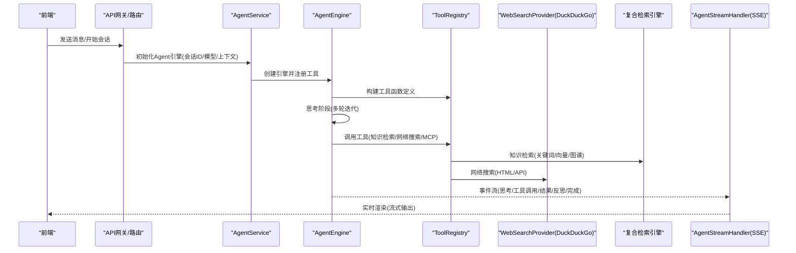
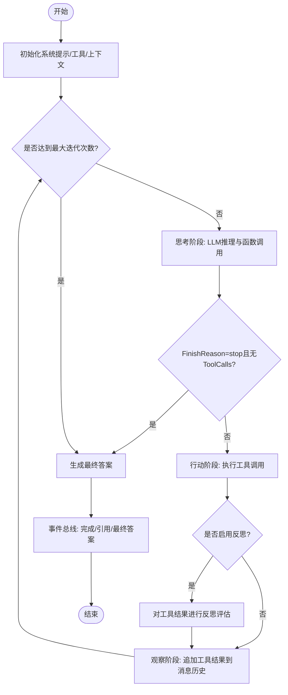
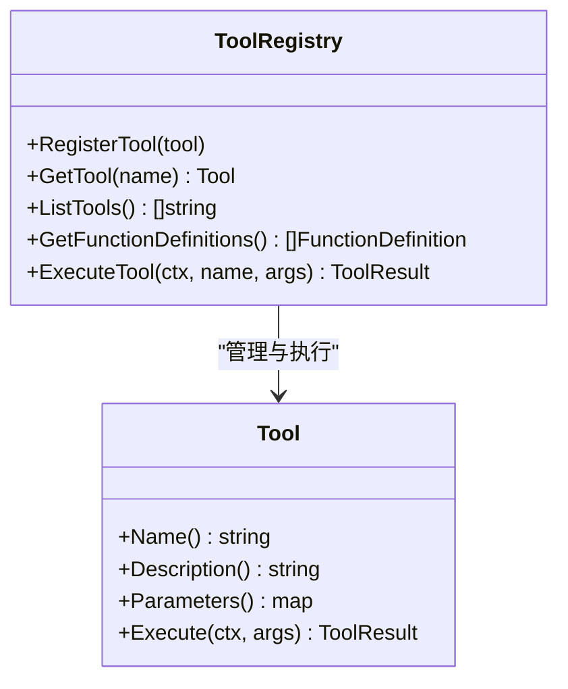
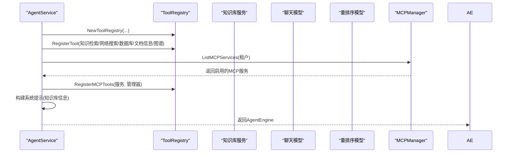
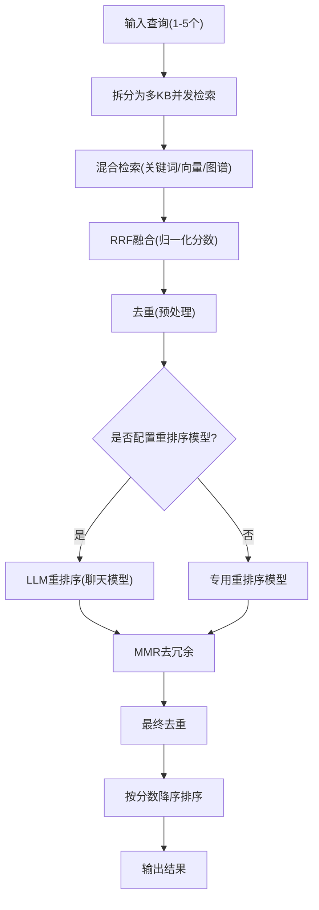
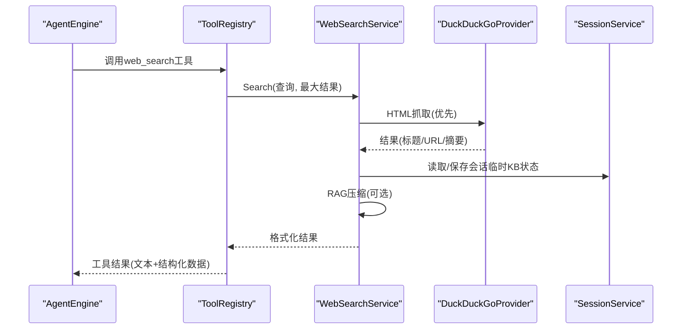
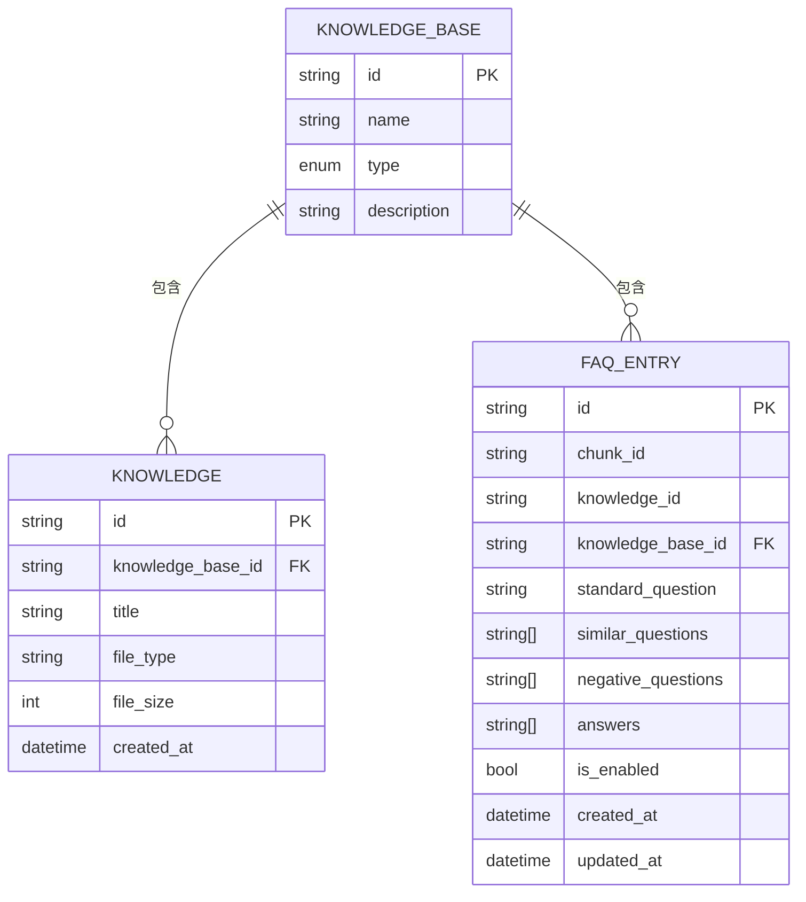
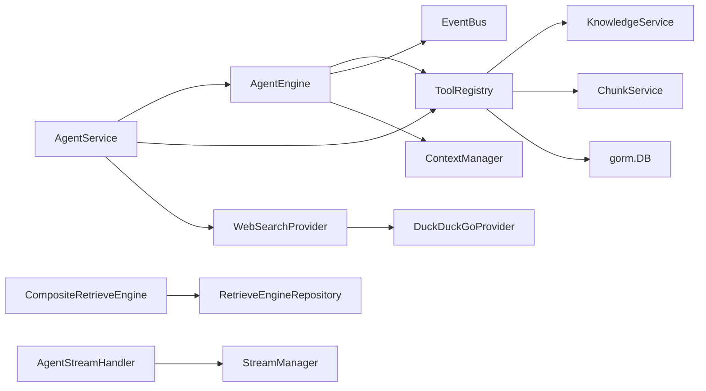

# 核心功能

<cite>
**本文引用的文件**
- [agent/engine.go](file://internal/agent/engine.go)
- [agent/tools/registry.go](file://internal/agent/tools/registry.go)
- [agent/tools/knowledge_search.go](file://internal/agent/tools/knowledge_search.go)
- [agent/tools/web_search.go](file://internal/agent/tools/web_search.go)
- [agent/tools/mcp_tool.go](file://internal/agent/tools/mcp_tool.go)
- [application/service/agent_service.go](file://internal/application/service/agent_service.go)
- [application/service/chat_pipline/chat_pipline.go](file://internal/application/service/chat_pipline/chat_pipline.go)
- [application/service/retriever/composite.go](file://internal/application/service/retriever/composite.go)
- [application/service/retriever/keywords_vector_hybrid_indexer.go](file://internal/application/service/retriever/keywords_vector_hybrid_indexer.go)
- [application/service/web_search/duckduckgo.go](file://internal/application/service/web_search/duckduckgo.go)
- [handler/session/agent_stream_handler.go](file://internal/handler/session/agent_stream_handler.go)
- [types/agent.go](file://internal/types/agent.go)
- [client/client.go](file://client/client.go)
- [docs/api/faq.md](file://docs/api/faq.md)
- [frontend/src/api/knowledge-base/index.ts](file://frontend/src/api/knowledge-base/index.ts)
</cite>

## 目录
1. [简介](#简介)
2. [项目结构](#项目结构)
3. [核心组件](#核心组件)
4. [架构总览](#架构总览)
5. [详细组件分析](#详细组件分析)
6. [依赖关系分析](#依赖关系分析)
7. [性能考量](#性能考量)
8. [故障排查指南](#故障排查指南)
9. [结论](#结论)
10. [附录](#附录)

## 简介
本文件聚焦WeKnora的核心能力，围绕ReAct Agent工作流、内置工具链（知识库检索、网络搜索、MCP工具）、多类型知识库（FAQ与文档）的创建与管理、混合检索策略（关键词、向量、知识图谱）以及网络搜索的可扩展性与对话策略配置进行系统化说明。文档以代码库中的实际实现为依据，通过类图、序列图与流程图帮助读者理解技术细节与用户交互模式。

## 项目结构
WeKnora采用分层架构：
- 应用层：服务编排（AgentService、聊天流水线、检索器、Web搜索等）
- 领域层：Agent引擎与工具注册表、事件总线、流式处理
- 接口层：前端API与客户端封装
- 外部集成：MCP服务、Web搜索提供商（DuckDuckGo）

图表来源
- [application/service/agent_service.go](file://internal/application/service/agent_service.go#L64-L162)
- [internal/agent/engine.go](file://internal/agent/engine.go#L72-L148)
- [internal/agent/tools/registry.go](file://internal/agent/tools/registry.go#L13-L115)
- [handler/session/agent_stream_handler.go](file://internal/handler/session/agent_stream_handler.go#L15-L70)
- [application/service/chat_pipline/chat_pipline.go](file://internal/application/service/chat_pipline/chat_pipline.go#L9-L22)
- [application/service/retriever/composite.go](file://internal/application/service/retriever/composite.go#L20-L62)
- [application/service/web_search/duckduckgo.go](file://internal/application/service/web_search/duckduckgo.go#L21-L64)

章节来源
- [application/service/agent_service.go](file://internal/application/service/agent_service.go#L64-L162)
- [internal/agent/engine.go](file://internal/agent/engine.go#L72-L148)
- [internal/agent/tools/registry.go](file://internal/agent/tools/registry.go#L13-L115)
- [handler/session/agent_stream_handler.go](file://internal/handler/session/agent_stream_handler.go#L15-L70)
- [application/service/chat_pipline/chat_pipline.go](file://internal/application/service/chat_pipline/chat_pipline.go#L9-L22)
- [application/service/retriever/composite.go](file://internal/application/service/retriever/composite.go#L20-L62)
- [application/service/web_search/duckduckgo.go](file://internal/application/service/web_search/duckduckgo.go#L21-L64)

## 核心组件
- ReAct Agent引擎：负责多轮迭代的“思考-行动-观察”循环，支持工具调用、反思与最终答案生成。
- 工具注册表：集中管理工具定义、参数Schema与执行结果。
- Agent服务：根据租户配置与会话上下文创建Agent引擎，注册内置工具与MCP工具。
- 聊天流水线插件：事件驱动的插件机制，支持搜索、重写、合并、过滤、流式过滤等。
- 复合检索引擎：统一调度多个检索后端（关键词/向量/知识图谱），并发执行并聚合结果。
- Web搜索：基于DuckDuckGo的HTML与API双通道，支持RAG压缩与会话缓存。
- 流式事件处理器：将Agent事件转换为SSE流，供前端实时渲染。

章节来源
- [internal/agent/engine.go](file://internal/agent/engine.go#L72-L148)
- [internal/agent/tools/registry.go](file://internal/agent/tools/registry.go#L13-L115)
- [application/service/agent_service.go](file://internal/application/service/agent_service.go#L64-L162)
- [application/service/chat_pipline/chat_pipline.go](file://internal/application/service/chat_pipline/chat_pipline.go#L9-L22)
- [application/service/retriever/composite.go](file://internal/application/service/retriever/composite.go#L20-L62)
- [application/service/web_search/duckduckgo.go](file://internal/application/service/web_search/duckduckgo.go#L21-L64)
- [handler/session/agent_stream_handler.go](file://internal/handler/session/agent_stream_handler.go#L15-L70)

## 架构总览
下图展示从会话到Agent执行、工具调用与事件流的端到端路径。

图表来源
- [application/service/agent_service.go](file://internal/application/service/agent_service.go#L64-L162)
- [internal/agent/engine.go](file://internal/agent/engine.go#L150-L487)
- [internal/agent/tools/registry.go](file://internal/agent/tools/registry.go#L58-L115)
- [application/service/web_search/duckduckgo.go](file://internal/application/service/web_search/duckduckgo.go#L40-L64)
- [application/service/retriever/composite.go](file://internal/application/service/retriever/composite.go#L32-L62)
- [handler/session/agent_stream_handler.go](file://internal/handler/session/agent_stream_handler.go#L56-L117)

## 详细组件分析

### ReAct Agent引擎与多轮迭代
- 循环控制：最大迭代次数、温度、工具列表、系统提示构建。
- 思考阶段：调用大模型进行函数调用与流式思考输出；记录FinishReason与ToolCalls。
- 行动阶段：按顺序执行工具，收集结果并写入消息历史与上下文管理器。
- 观察阶段：将工具结果以“tool”角色消息加入历史，触发后续思考。
- 反思机制：可选地对每次工具结果进行二次评估与决策建议。
- 最终答案：若未在迭代内结束，生成最终答案并通过事件总线广播。

图表来源
- [internal/agent/engine.go](file://internal/agent/engine.go#L150-L487)

章节来源
- [internal/agent/engine.go](file://internal/agent/engine.go#L72-L148)
- [internal/agent/engine.go](file://internal/agent/engine.go#L150-L487)

### 工具注册表与工具调用
- 注册与发现：按名称注册工具，导出函数定义给LLM；执行时按名称查找并调用。
- 参数Schema：每个工具提供JSON Schema，便于LLM正确构造参数。
- 结果标准化：统一返回ToolResult，包含Success、Output、Data、Error字段。

图表来源
- [internal/agent/tools/registry.go](file://internal/agent/tools/registry.go#L13-L115)

章节来源
- [internal/agent/tools/registry.go](file://internal/agent/tools/registry.go#L13-L115)

### Agent服务与工具装配
- 配置校验：限制最大迭代次数，确保模型与重排序模型可用。
- 工具装配：根据配置启用知识检索、关键词/向量/图谱检索、网络搜索、数据库查询、文档信息、MCP工具等。
- MCP工具：动态发现并注册外部MCP服务工具，支持stdio传输与断开释放。
- 知识库信息：为系统提示注入最近文档与统计信息，提升检索上下文质量。

图表来源
- [application/service/agent_service.go](file://internal/application/service/agent_service.go#L64-L162)
- [application/service/agent_service.go](file://internal/application/service/agent_service.go#L164-L251)
- [application/service/agent_service.go](file://internal/application/service/agent_service.go#L270-L375)
- [internal/agent/tools/mcp_tool.go](file://internal/agent/tools/mcp_tool.go#L179-L244)

章节来源
- [application/service/agent_service.go](file://internal/application/service/agent_service.go#L64-L162)
- [application/service/agent_service.go](file://internal/application/service/agent_service.go#L164-L251)
- [application/service/agent_service.go](file://internal/application/service/agent_service.go#L270-L375)
- [internal/agent/tools/mcp_tool.go](file://internal/agent/tools/mcp_tool.go#L179-L244)

### 知识库检索与混合策略
- 检索入口：知识搜索工具支持向量、关键词与图谱混合检索，支持多查询并发执行。
- 重排序：优先使用聊天模型进行语义重排序，回退至专用重排序模型；随后应用MMR去冗余。
- 去重与排序：先去重再重排序，最后按分数降序输出。
- 复合检索引擎：统一调度多个检索后端，支持并发检索与批量索引、复制与删除。

图表来源
- [internal/agent/tools/knowledge_search.go](file://internal/agent/tools/knowledge_search.go#L150-L387)
- [internal/application/service/retriever/composite.go](file://internal/application/service/retriever/composite.go#L32-L62)
- [internal/application/service/retriever/keywords_vector_hybrid_indexer.go](file://internal/application/service/retriever/keywords_vector_hybrid_indexer.go#L35-L61)

章节来源
- [internal/agent/tools/knowledge_search.go](file://internal/agent/tools/knowledge_search.go#L150-L387)
- [internal/application/service/retriever/composite.go](file://internal/application/service/retriever/composite.go#L32-L62)
- [internal/application/service/retriever/keywords_vector_hybrid_indexer.go](file://internal/application/service/retriever/keywords_vector_hybrid_indexer.go#L35-L61)

### 网络搜索与可扩展性
- 提供商：DuckDuckGo HTML抓取优先，失败时回退API；支持中文区域偏好与User-Agent伪装。
- 会话缓存：通过会话服务维护临时知识库状态，避免重复索引；支持RAG压缩抽取相关片段。
- 输出格式：统一标题、URL、摘要、内容与发布时间；提供下一步建议（如使用web_fetch获取全文）。

图表来源
- [internal/agent/tools/web_search.go](file://internal/agent/tools/web_search.go#L116-L280)
- [application/service/web_search/duckduckgo.go](file://internal/application/service/web_search/duckduckgo.go#L40-L64)
- [application/service/web_search/duckduckgo.go](file://internal/application/service/web_search/duckduckgo.go#L66-L136)
- [application/service/web_search/duckduckgo.go](file://internal/application/service/web_search/duckduckgo.go#L138-L223)

章节来源
- [internal/agent/tools/web_search.go](file://internal/agent/tools/web_search.go#L116-L280)
- [application/service/web_search/duckduckgo.go](file://internal/application/service/web_search/duckduckgo.go#L40-L64)
- [application/service/web_search/duckduckgo.go](file://internal/application/service/web_search/duckduckgo.go#L66-L136)
- [application/service/web_search/duckduckgo.go](file://internal/application/service/web_search/duckduckgo.go#L138-L223)

### 多类型知识库：FAQ与文档
- 文档型知识库：支持分页列出知识、统计文档数量、展示最近添加文档。
- FAQ知识库：支持标准问、相似问、负例问、答案集合；提供批量导入、单条创建、状态更新、标签更新、删除与混合搜索。
- 前端API：提供创建、更新、批量状态更新、删除与搜索接口。
- 客户端封装：提供FAQ批量导入与单条创建方法。

图表来源
- [docs/api/faq.md](file://docs/api/faq.md#L1-L169)
- [frontend/src/api/knowledge-base/index.ts](file://frontend/src/api/knowledge-base/index.ts#L168-L193)
- [client/faq.go](file://client/faq.go#L166-L205)

章节来源
- [docs/api/faq.md](file://docs/api/faq.md#L1-L169)
- [frontend/src/api/knowledge-base/index.ts](file://frontend/src/api/knowledge-base/index.ts#L168-L193)
- [client/faq.go](file://client/faq.go#L166-L205)

### 对话策略与系统提示
- 温度与迭代：AgentConfig控制温度与最大迭代次数；系统提示模板可按是否启用网络搜索切换。
- 系统提示注入：将知识库名称、类型、文档计数与最近文档注入系统提示，增强检索上下文。
- 聊天流水线：插件化事件处理，支持搜索、重写、合并、过滤、流式过滤等，便于扩展与定制。

章节来源
- [internal/types/agent.go](file://internal/types/agent.go#L10-L48)
- [internal/types/agent.go](file://internal/types/agent.go#L67-L84)
- [internal/agent/prompts.go](file://internal/agent/prompts.go#L122-L151)
- [application/service/chat_pipline/chat_pipline.go](file://internal/application/service/chat_pipline/chat_pipline.go#L9-L22)

### 流式事件与前端渲染
- 事件订阅：AgentStreamHandler订阅思考、工具调用、工具结果、引用、最终答案、反思、错误、会话标题、完成等事件。
- SSE推送：将事件按类型与元数据推送到StreamManager，前端按事件ID累积显示。
- 元数据：包含持续时间、工具调用ID、成功/错误标志、结构化数据等，便于前端渲染。

章节来源
- [handler/session/agent_stream_handler.go](file://internal/handler/session/agent_stream_handler.go#L56-L117)
- [handler/session/agent_stream_handler.go](file://internal/handler/session/agent_stream_handler.go#L119-L211)
- [handler/session/agent_stream_handler.go](file://internal/handler/session/agent_stream_handler.go#L213-L276)
- [handler/session/agent_stream_handler.go](file://internal/handler/session/agent_stream_handler.go#L278-L346)
- [handler/session/agent_stream_handler.go](file://internal/handler/session/agent_stream_handler.go#L348-L452)

## 依赖关系分析
- 组件耦合：AgentEngine依赖ToolRegistry、聊天模型、上下文管理器与事件总线；ToolRegistry依赖知识/块服务与数据库；AgentService负责装配与租户配置。
- 并发与一致性：复合检索引擎与知识搜索工具均采用并发执行与互斥收集，保证高吞吐与结果一致性。
- 外部依赖：Web搜索依赖DuckDuckGo提供商；MCP工具依赖MCPManager与外部服务生命周期管理。

图表来源
- [internal/agent/engine.go](file://internal/agent/engine.go#L25-L69)
- [internal/agent/tools/registry.go](file://internal/agent/tools/registry.go#L13-L33)
- [application/service/agent_service.go](file://internal/application/service/agent_service.go#L64-L162)
- [application/service/retriever/composite.go](file://internal/application/service/retriever/composite.go#L20-L31)
- [application/service/web_search/duckduckgo.go](file://internal/application/service/web_search/duckduckgo.go#L21-L33)
- [handler/session/agent_stream_handler.go](file://internal/handler/session/agent_stream_handler.go#L15-L34)

章节来源
- [internal/agent/engine.go](file://internal/agent/engine.go#L25-L69)
- [internal/agent/tools/registry.go](file://internal/agent/tools/registry.go#L13-L33)
- [application/service/agent_service.go](file://internal/application/service/agent_service.go#L64-L162)
- [application/service/retriever/composite.go](file://internal/application/service/retriever/composite.go#L20-L31)
- [application/service/web_search/duckduckgo.go](file://internal/application/service/web_search/duckduckgo.go#L21-L33)
- [handler/session/agent_stream_handler.go](file://internal/handler/session/agent_stream_handler.go#L15-L34)

## 性能考量
- 并发检索：复合检索与知识搜索工具均采用goroutine并发执行，显著降低整体延迟。
- 批量嵌入：向量化索引支持批处理与池化重试，提高吞吐与稳定性。
- 重排序与去冗余：先去重再重排序，减少后续处理成本；MMR平衡相关性与多样性。
- 流式输出：事件驱动的SSE推送，前端按事件ID累积，避免一次性大块渲染。
- 缓存与复用：会话级临时知识库状态复用，避免重复索引与网络请求。

章节来源
- [application/service/retriever/composite.go](file://internal/application/service/retriever/composite.go#L118-L184)
- [internal/agent/tools/knowledge_search.go](file://internal/agent/tools/knowledge_search.go#L413-L465)
- [application/service/web_search/duckduckgo.go](file://internal/application/service/web_search/duckduckgo.go#L66-L136)
- [handler/session/agent_stream_handler.go](file://internal/handler/session/agent_stream_handler.go#L104-L117)

## 故障排查指南
- Agent执行失败：检查事件总线错误事件，定位阶段与错误信息；查看工具执行日志与结果。
- 工具未找到：确认工具已注册且名称一致；核对参数Schema与必填项。
- 检索无结果：调整阈值与TopK；确认知识库类型与索引状态；检查图谱/关键词/向量三者配置。
- 网络搜索异常：检查提供商配置与超时设置；确认HTML抓取与API回退逻辑；查看会话缓存状态。
- SSE渲染异常：确认事件ID与元数据完整性；检查前端累积逻辑与事件类型映射。

章节来源
- [internal/agent/engine.go](file://internal/agent/engine.go#L122-L147)
- [internal/agent/tools/registry.go](file://internal/agent/tools/registry.go#L71-L115)
- [application/service/web_search/duckduckgo.go](file://internal/application/service/web_search/duckduckgo.go#L138-L223)
- [handler/session/agent_stream_handler.go](file://internal/handler/session/agent_stream_handler.go#L348-L374)

## 结论
WeKnora通过ReAct Agent实现了强大的多轮对话与工具编排能力，结合混合检索策略、网络搜索与MCP工具扩展，形成“知识优先、实时补充”的检索增强问答体系。系统以事件驱动与插件化设计实现高可扩展性，配合流式SSE输出提供良好的用户体验。知识库管理（FAQ与文档）与对话策略（温度、阈值、提示模板）共同构成可配置、可演进的智能问答平台。

## 附录
- 客户端封装示例：HTTP请求封装、解析响应、设置超时与鉴权头。
- 前端API示例：知识库、FAQ、会话相关接口调用方式。

章节来源
- [client/client.go](file://client/client.go#L16-L105)
- [frontend/src/api/knowledge-base/index.ts](file://frontend/src/api/knowledge-base/index.ts#L168-L193)