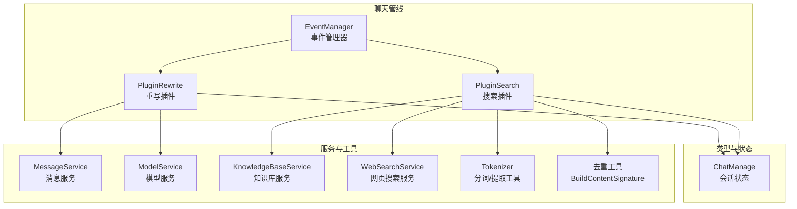
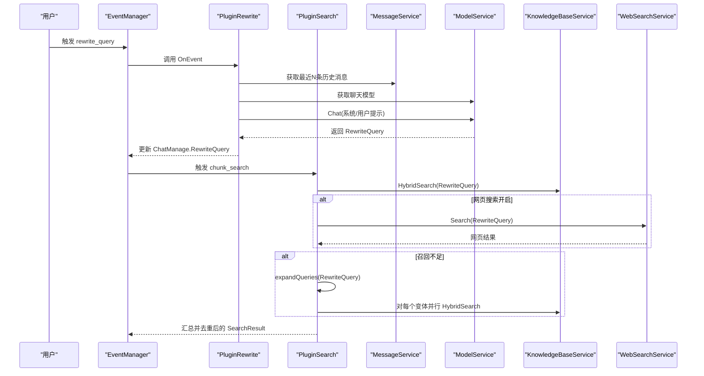
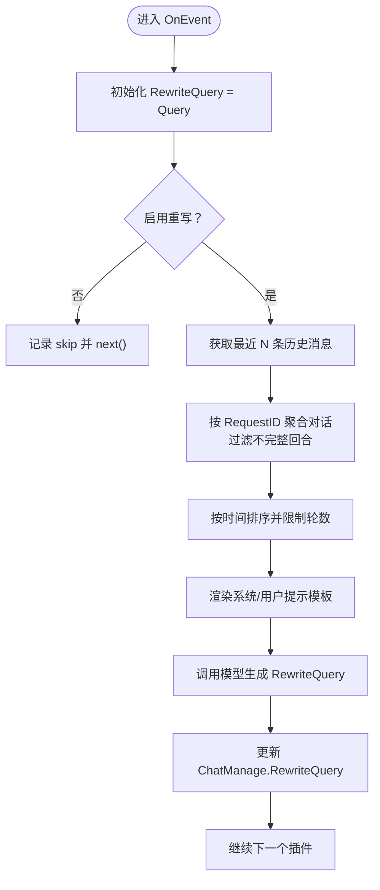
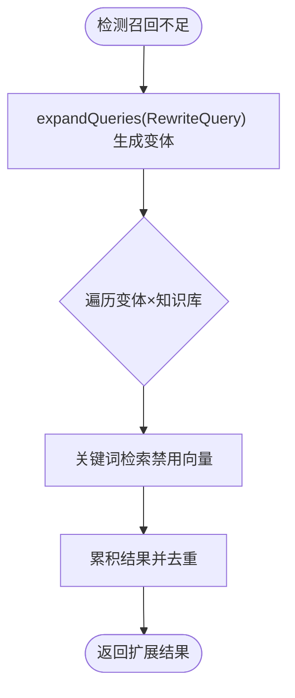
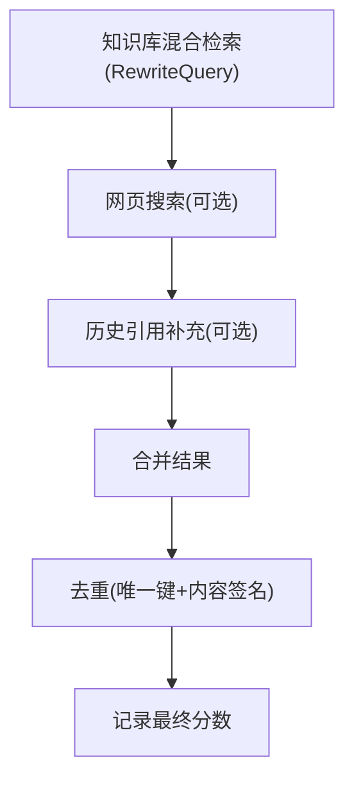
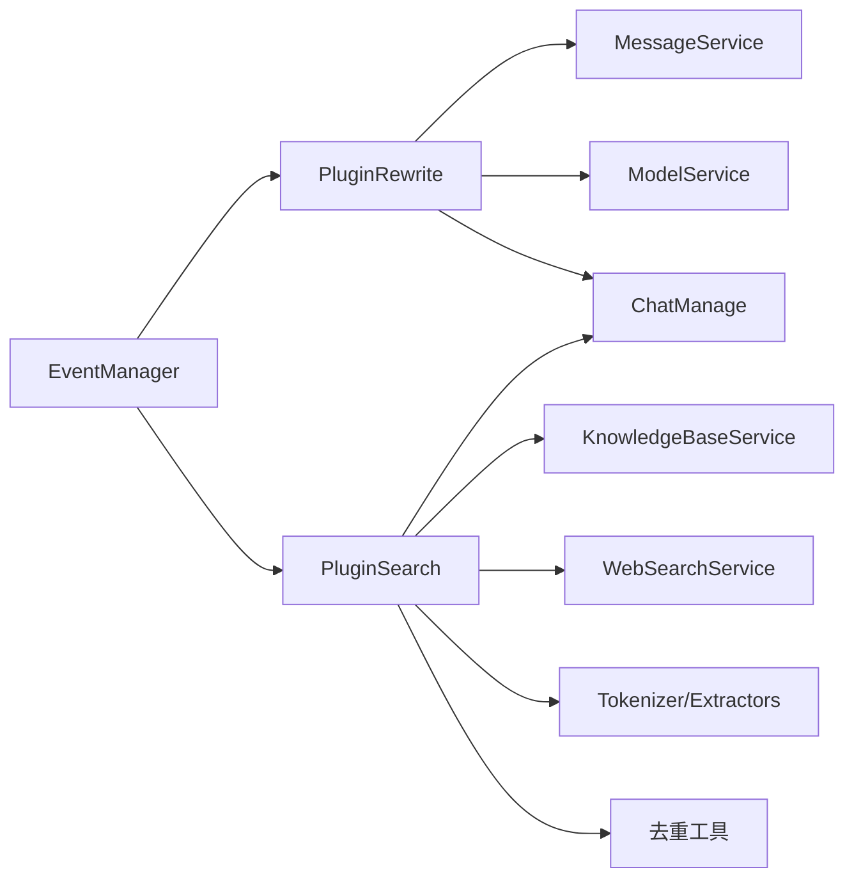

# 查询处理

<cite>
**本文引用的文件**
- [rewrite.go](file://internal/application/service/chat_pipline/rewrite.go)
- [search.go](file://internal/application/service/chat_pipline/search.go)
- [chat_manage.go](file://internal/types/chat_manage.go)
- [chat_pipline.go](file://internal/application/service/chat_pipline/chat_pipline.go)
- [textutil.go](file://internal/searchutil/textutil.go)
- [WeKnora.md](file://docs/Weknora.md)
</cite>

## 目录
1. [简介](#简介)
2. [项目结构](#项目结构)
3. [核心组件](#核心组件)
4. [架构总览](#架构总览)
5. [详细组件分析](#详细组件分析)
6. [依赖分析](#依赖分析)
7. [性能考虑](#性能考虑)
8. [故障排查指南](#故障排查指南)
9. [结论](#结论)
10. [附录](#附录)

## 简介
本文件围绕查询处理流程，系统性阐述从用户原始问题到最终用于检索的完整链路。重点覆盖两部分：
- PluginRewrite 如何利用对话历史与大语言模型（LLM）将 Query 重写为更精确、上下文相关的 RewriteQuery；
- PluginSearch 的 preprocess_query 阶段如何对重写后的查询进行分词与关键词提取，为关键词检索做准备；并在召回不足时，通过本地查询扩展（expandQueries）提升关键词检索召回率。

同时，结合 WeKnora.md 中的日志证据，对比 rewrite_query 与 preprocess_query 两种不同形式的查询输入，解释其在混合检索中的作用与差异。

## 项目结构
查询处理位于聊天管线（chat pipeline）中，采用插件化事件驱动架构。核心文件如下：
- 插件重写：rewrite.go
- 插件搜索与扩展：search.go
- 管线事件与状态：chat_pipline.go、chat_manage.go
- 文本工具与去重：textutil.go
- 日志与示例：WeKnora.md

图表来源
- [rewrite.go](file://internal/application/service/chat_pipline/rewrite.go#L1-L239)
- [search.go](file://internal/application/service/chat_pipline/search.go#L1-L562)
- [chat_pipline.go](file://internal/application/service/chat_pipline/chat_pipline.go#L1-L141)
- [chat_manage.go](file://internal/types/chat_manage.go#L1-L142)
- [textutil.go](file://internal/searchutil/textutil.go#L1-L71)

章节来源
- [rewrite.go](file://internal/application/service/chat_pipline/rewrite.go#L1-L239)
- [search.go](file://internal/application/service/chat_pipline/search.go#L1-L562)
- [chat_pipline.go](file://internal/application/service/chat_pipline/chat_pipline.go#L1-L141)
- [chat_manage.go](file://internal/types/chat_manage.go#L1-L142)

## 核心组件
- PluginRewrite：基于历史对话与 LLM 重写 Query，生成 RewriteQuery，供后续检索使用。
- PluginSearch：执行知识库与网页搜索，支持并发与去重；在召回不足时，使用本地扩展策略（expandQueries）提升关键词检索召回。
- ChatManage：承载会话状态、阈值、TopK、启用开关等配置，贯穿整个管线。
- EventManager：事件驱动的插件调度器，构建插件链并触发事件。

章节来源
- [rewrite.go](file://internal/application/service/chat_pipline/rewrite.go#L1-L239)
- [search.go](file://internal/application/service/chat_pipline/search.go#L1-L562)
- [chat_manage.go](file://internal/types/chat_manage.go#L1-L142)
- [chat_pipline.go](file://internal/application/service/chat_pipline/chat_pipline.go#L1-L141)

## 架构总览
查询处理的完整链路如下：
- 事件序列：rewrite_query → chunk_search（或 parallel 搜索）→ chunk_rerank → chunk_merge → filter_top_k → into_chat_message → chat_completion_stream → stream_filter
- 重写阶段：PluginRewrite 读取历史消息，构造系统/用户提示，调用模型生成 RewriteQuery
- 检索阶段：PluginSearch 使用 RewriteQuery 执行知识库与网页搜索；若命中不足，则本地扩展关键词变体并二次检索
- 去重与输出：合并结果、去重、记录分数、输出最终候选

图表来源
- [rewrite.go](file://internal/application/service/chat_pipline/rewrite.go#L52-L238)
- [search.go](file://internal/application/service/chat_pipline/search.go#L53-L249)
- [chat_pipline.go](file://internal/application/service/chat_pipline/chat_pipline.go#L39-L87)

## 详细组件分析

### PluginRewrite：基于历史与 LLM 的查询重写
- 功能要点
  - 读取会话历史，按请求 ID 聚合对话，过滤不完整回合，按时间排序并限制轮数
  - 渲染系统/用户提示模板，调用模型生成 RewriteQuery
  - 若未启用重写或历史为空，跳过重写并继续后续流程
- 关键行为
  - 历史清洗：去除思考标记，保留用户问题与系统回答
  - 模板渲染：注入当前时间、昨日日期、历史对话
  - 模型调用：固定温度与最大补全长度，避免冗长输出
- 输出
  - 更新 ChatManage.RewriteQuery，供后续检索阶段使用

图表来源
- [rewrite.go](file://internal/application/service/chat_pipline/rewrite.go#L52-L238)

章节来源
- [rewrite.go](file://internal/application/service/chat_pipline/rewrite.go#L52-L238)

### preprocess_query 阶段：分词与关键词提取
- 说明
  - WeKnora.md 明确列出事件序列包含 preprocess_query，且日志展示了“预处理后的关键词序列”作为第二次混合检索的输入
  - 在本仓库中，preprocess_query 并未直接实现为独立函数，但其效果由 PluginSearch 的本地扩展策略体现：
    - 使用 tokenize、extractKeywords、extractPhrases、splitByDelimiters、removeQuestionWords 等工具，将 RewriteQuery 转换为关键词序列
    - 该关键词序列用于后续的关键词检索（disable 向量匹配，启用关键词匹配）
- 作用
  - 通过关键词检索补充语义检索的广度，提升召回率
  - 与重写后的完整问句形成互补，实现“语义深度 + 关键词广度”的双重保障

章节来源
- [WeKnora.md](file://docs/Weknora.md#L24-L90)
- [WeKnora.md](file://docs/Weknora.md#L200-L231)
- [search.go](file://internal/application/service/chat_pipline/search.go#L410-L561)

### expandQueries：本地查询扩展以提升召回
- 触发条件
  - 当启用查询扩展且检索结果数量小于阈值（EmbeddingTopK/2）时触发
- 扩展策略
  - 停用词移除，仅保留关键词
  - 提取引号内短语或关键片段
  - 按常见分隔符拆分，取较长片段
  - 移除疑问词前缀
  - 去重并限制最多 5 个变体
- 执行方式
  - 对每个变体与每个知识库并行执行关键词检索（禁用向量匹配，降低开销）
  - 合并扩展结果并追加到主检索结果集
- 效果
  - 在召回不足时，显著提升关键词检索命中率，减少漏检

图表来源
- [search.go](file://internal/application/service/chat_pipline/search.go#L131-L206)
- [search.go](file://internal/application/service/chat_pipline/search.go#L410-L561)

章节来源
- [search.go](file://internal/application/service/chat_pipline/search.go#L131-L206)
- [search.go](file://internal/application/service/chat_pipline/search.go#L410-L561)

### 混合检索与结果去重
- 检索策略
  - 使用 RewriteQuery 执行知识库混合检索（向量 + 关键词）
  - 可选：网页搜索（按租户配置）
  - 可选：从历史中补充引用结果
- 去重策略
  - 基于唯一键与内容签名（MD5）去重，避免重复块与内容重复
- 输出
  - 记录各阶段分数，最终输出候选集合

图表来源
- [search.go](file://internal/application/service/chat_pipline/search.go#L53-L249)
- [textutil.go](file://internal/searchutil/textutil.go#L1-L21)

章节来源
- [search.go](file://internal/application/service/chat_pipline/search.go#L53-L249)
- [textutil.go](file://internal/searchutil/textutil.go#L1-L21)

## 依赖分析
- 插件耦合
  - PluginRewrite 依赖 MessageService（历史）、ModelService（LLM）
  - PluginSearch 依赖 KnowledgeBaseService（混合检索）、WebSearchService（网页搜索）、TenantService（租户配置）、SessionService（会话缓存）
- 状态依赖
  - ChatManage 持有 Query、RewriteQuery、History、阈值、TopK、启用开关等，贯穿事件链
- 工具依赖
  - 分词与关键词提取：tokenize、extractKeywords、extractPhrases、splitByDelimiters、removeQuestionWords
  - 去重：BuildContentSignature

图表来源
- [rewrite.go](file://internal/application/service/chat_pipline/rewrite.go#L1-L239)
- [search.go](file://internal/application/service/chat_pipline/search.go#L1-L562)
- [chat_pipline.go](file://internal/application/service/chat_pipline/chat_pipline.go#L1-L141)
- [chat_manage.go](file://internal/types/chat_manage.go#L1-L142)

章节来源
- [rewrite.go](file://internal/application/service/chat_pipline/rewrite.go#L1-L239)
- [search.go](file://internal/application/service/chat_pipline/search.go#L1-L562)
- [chat_pipline.go](file://internal/application/service/chat_pipline/chat_pipline.go#L1-L141)
- [chat_manage.go](file://internal/types/chat_manage.go#L1-L142)

## 性能考虑
- 并发控制
  - 搜索阶段对知识库与扩展变体采用 goroutine 并发，使用信号量限制并发度，避免资源争用
- 代价权衡
  - expandQueries 仅在召回不足时触发，避免不必要的扩展成本
  - 关键词检索禁用向量匹配，降低计算开销
- 去重优化
  - 唯一键与内容签名双重去重，减少重复块带来的下游负担

章节来源
- [search.go](file://internal/application/service/chat_pipline/search.go#L131-L206)
- [search.go](file://internal/application/service/chat_pipline/search.go#L218-L249)
- [textutil.go](file://internal/searchutil/textutil.go#L1-L21)

## 故障排查指南
- 重写失败
  - 历史拉取失败：检查 MessageService 配置与权限
  - 模板解析失败：检查系统/用户提示模板字段
  - 模型调用失败：检查模型服务可用性与鉴权
- 检索无结果
  - 检查知识库是否存在、租户配置是否正确
  - 调整阈值与 TopK，确认是否因阈值过高导致命中过少
- 扩展无效
  - 确认 EnableQueryExpansion 已启用
  - 检查扩展变体生成是否过少（如关键词不足、短语缺失）

章节来源
- [rewrite.go](file://internal/application/service/chat_pipline/rewrite.go#L74-L117)
- [rewrite.go](file://internal/application/service/chat_pipline/rewrite.go#L143-L203)
- [search.go](file://internal/application/service/chat_pipline/search.go#L131-L206)
- [chat_pipline.go](file://internal/application/service/chat_pipline/chat_pipline.go#L80-L141)

## 结论
- PluginRewrite 通过上下文与 LLM 将 Query 重写为 RewriteQuery，显著提升检索的准确性与相关性
- preprocess_query 的效果在本仓库中通过本地扩展策略体现：将重写后的查询进行分词与关键词提取，配合关键词检索增强召回
- expandQueries 在召回不足时进行本地扩展，避免昂贵的 LLM 扩展，兼顾性能与效果
- 整体流程以事件驱动的插件化架构实现，具备良好的可扩展性与可观测性

## 附录

### 事件序列与日志证据对照
- 事件序列：rewrite_query → chunk_search → chunk_rerank → chunk_merge → filter_top_k → into_chat_message → chat_completion_stream → stream_filter
- 日志证据
  - rewrite_query：将原始问题“入住的房型是什么”改写为“Liwx本次入住的房型是什么”
  - preprocess_query：将改写后的完整问句转换为关键词序列，用于第二次混合检索
  - 混合检索：分别使用“改写后的完整问句”和“关键词序列”进行检索，最终去重合并

章节来源
- [WeKnora.md](file://docs/Weknora.md#L24-L90)
- [WeKnora.md](file://docs/Weknora.md#L200-L231)