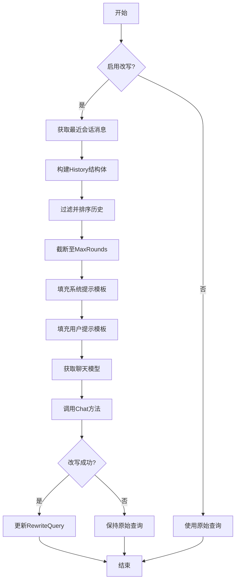
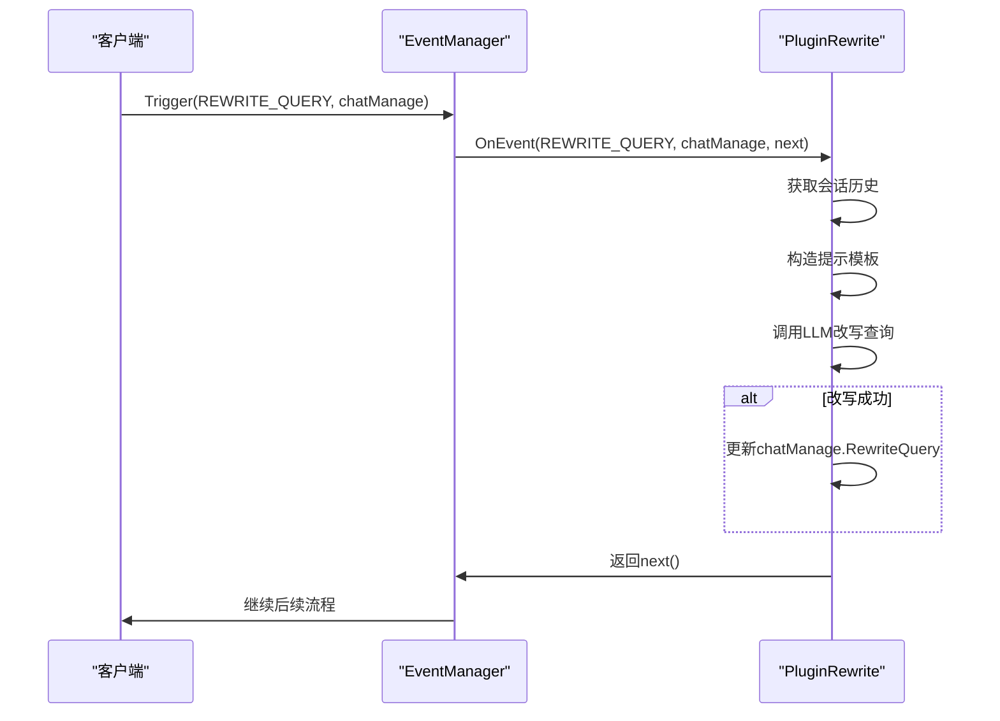

# 查询改写

<cite>
**本文档中引用的文件**  
- [rewrite.go](file://internal/application/service/chat_pipline/rewrite.go)
- [config.go](file://internal/config/config.go)
- [chat_manage.go](file://internal/types/chat_manage.go)
- [message.go](file://internal/types/message.go)
- [Weknora.md](file://docs/Weknora.md)
</cite>

## 目录
1. [引言](#引言)
2. [核心机制](#核心机制)
3. [实现流程](#实现流程)
4. [事件驱动架构](#事件驱动架构)
5. [日志分析与实例](#日志分析与实例)
6. [配置与模板](#配置与模板)
7. [总结](#总结)

## 引言
查询改写（Query Rewriting）是WeKnora系统中检索增强生成（RAG）流程的关键环节。该功能通过`PluginRewrite`插件实现，旨在提升用户查询的精确性和上下文相关性。插件利用对话历史和大语言模型（LLM）将用户原始问题（`Query`）转化为更明确、更易检索的`RewriteQuery`。此过程不仅增强了后续知识检索的准确性，还显著提升了最终生成答案的质量。本文档将深入剖析`PluginRewrite`插件的内部实现机制、工作流程及其在系统事件驱动架构中的角色。

## 核心机制
`PluginRewrite`插件的核心机制是通过结合对话上下文和大语言模型的推理能力，对用户查询进行语义上的优化和补充。其主要目标是解决原始查询可能存在的模糊性、指代不明或信息缺失等问题。例如，一个简单的“入住的房型是什么”在缺乏上下文的情况下，系统无法确定“入住”指的是谁。通过查询改写，系统能够结合历史对话，将问题明确为“Liwx本次入住的房型是什么”，从而极大地提高了检索的针对性。

该机制依赖于三个关键组件：
1.  **对话历史获取**：通过`GetRecentMessagesBySession`方法从数据库中提取与当前会话相关的最近消息。
2.  **上下文结构化**：将获取到的原始消息转换为`History`结构体，形成清晰的问答对序列。
3.  **大语言模型调用**：利用LLM的自然语言理解能力，根据系统和用户提示模板，生成改写后的查询。

**Section sources**
- [rewrite.go](file://internal/application/service/chat_pipline/rewrite.go#L52-L238)
- [Weknora.md](file://docs/Weknora.md#L30-L38)

## 实现流程
`PluginRewrite`插件的实现流程是一个严谨的、多步骤的处理过程，确保了查询改写的准确性和鲁棒性。

### 1. 事件触发与初始化
插件的执行始于`REWRITE_QUERY`事件的触发。当`EventManager`检测到该事件时，会调用`PluginRewrite.OnEvent`方法。方法首先检查`chatManage.EnableRewrite`标志位，若为`false`则跳过改写流程，直接返回原始查询。

### 2. 对话历史获取与处理
插件通过`messageService.GetRecentMessagesBySession`接口获取指定会话ID的最近20条消息。获取到的原始消息列表随后被处理：
- **分组**：消息按`requestID`进行分组，确保一次用户提问和系统回答被视为一个完整的对话轮次。
- **构建History结构**：遍历每条消息，将`role`为`user`的消息内容作为`History.Query`，将`role`为`assistant`的消息内容（并移除`<think>`标签内的思考过程）作为`History.Answer`。
- **过滤与排序**：过滤掉不完整的对话轮次（即只有提问或只有回答），然后按时间倒序排列，确保最新的对话在前。
- **截断**：根据配置的`MaxRounds`参数，保留最近的N轮对话，以控制上下文长度。

### 3. 提示模板构造
系统使用Go语言的`text/template`包来动态生成发送给LLM的提示。提示由两部分构成：
- **系统提示（System Prompt）**：由`config.Conversation.RewritePromptSystem`配置项定义，用于指导LLM如何进行改写，例如“你是一个查询改写助手，请根据以下对话历史...”。
- **用户提示（User Prompt）**：由`config.Conversation.RewritePromptUser`配置项定义，它包含了具体的改写任务，如“原始查询：{{.Query}}，对话历史：{{.Conversation}}”。

这两个模板通过`template.Execute`方法，将`chatManage.Query`、`currentTime`和处理好的`historyList`等数据填充进去，生成最终的提示文本。

### 4. 调用LLM执行改写
插件通过`modelService.GetChatModel`获取用于改写的聊天模型实例。随后，调用该模型的`Chat`方法，传入由系统提示和用户提示构成的消息列表。调用时设置了较低的`Temperature`（0.3）和`MaxCompletionTokens`（50），以确保输出简洁、确定且符合预期格式。如果LLM返回了非空的响应内容，则将其作为`chatManage.RewriteQuery`，完成查询改写。

**Diagram sources**
- [rewrite.go](file://internal/application/service/chat_pipline/rewrite.go#L75-L232)

**Section sources**
- [rewrite.go](file://internal/application/service/chat_pipline/rewrite.go#L75-L232)
- [message.go](file://internal/types/message.go#L13-L21)
- [config.go](file://internal/config/config.go#L54-L55)

## 事件驱动架构
`PluginRewrite`插件是WeKnora系统事件驱动架构中的一个典型组件。该架构通过`EventManager`实现了组件间的松耦合和高内聚。

### 插件注册
在系统初始化时，`NewPluginRewrite`函数被调用。该函数不仅创建了`PluginRewrite`实例，更重要的是，它通过`eventManager.Register(res)`将自身注册到`EventManager`中。注册过程会调用插件的`ActivationEvents()`方法，获取其监听的事件类型（即`[]types.EventType{types.REWRITE_QUERY}`），并将插件实例添加到`EventManager`内部的监听器列表中。

### 事件处理
`EventManager`维护着一个从`EventType`到`Plugin`列表的映射。当`Trigger`方法被调用时，它会根据传入的`eventType`查找所有注册的插件，并通过`buildHandler`方法构建一个处理链。这个处理链是一个函数，它会按顺序（或逆序）调用每个插件的`OnEvent`方法。`PluginRewrite`的`OnEvent`方法作为处理链的一环，接收`chatManage`对象，执行改写逻辑，并通过`next()`函数将控制权传递给下一个插件，从而实现了管道式的处理流程。

**Diagram sources**
- [rewrite.go](file://internal/application/service/chat_pipline/rewrite.go#L31-L43)
- [chat_pipline.go](file://internal/application/service/chat_pipline/chat_pipline.go#L23-L78)

**Section sources**
- [rewrite.go](file://internal/application/service/chat_pipline/rewrite.go#L31-L43)
- [chat_pipline.go](file://internal/application/service/chat_pipline/chat_pipline.go#L23-L78)

## 日志分析与实例
`Weknora.md`文档中的日志证据清晰地展示了查询改写的实际效果。

在一次处理住宿流水单PDF的请求中，用户的原始问题是“**入住的房型是什么**”。系统在执行`rewrite_query`事件时，执行了以下操作：
1.  **获取历史**：系统检索了当前会话的最近8条历史消息。
2.  **调用模型**：系统调用名为`deepseek-r1:7b`的本地大语言模型。
3.  **执行改写**：模型分析历史对话，识别出提问者是“Liwx”，并结合“Liwx选择的房型是双床房”这一信息，对原始问题进行了补充和明确。

最终，问题被成功改写为“**Liwx本次入住的房型是什么**”。这一改写结果直接体现在后续的`chunk_search`步骤中，使得检索系统能够精准地定位到包含“Liwx”和“双床房”信息的知识区块，从而为生成准确答案奠定了坚实的基础。

**Section sources**
- [Weknora.md](file://docs/Weknora.md#L30-L38)

## 配置与模板
查询改写的行为高度依赖于系统配置和提示模板。

### 配置项
在`config.yaml`文件中，`conversation`部分定义了查询改写的相关配置：
- `enable_rewrite`: 全局开关，控制是否启用查询改写功能。
- `max_rounds`: 控制在改写时最多使用多少轮对话历史。
- `rewrite_prompt_system`: 定义系统提示模板。
- `rewrite_prompt_user`: 定义用户提示模板。

这些配置项允许管理员在不修改代码的情况下，灵活调整改写逻辑。

### 模板设计
提示模板的设计至关重要。一个设计良好的`rewrite_prompt_user`模板会明确指示LLM：
- 输入：原始查询和对话历史。
- 任务：基于历史信息，使查询更具体、更完整。
- 输出：一个语法正确、意图明确的改写后查询。

这种基于模板的提示工程（Prompt Engineering）是确保LLM稳定、可靠输出的关键。

**Section sources**
- [config.go](file://internal/config/config.go#L48-L55)
- [Weknora.md](file://docs/Weknora.md#L30-L38)

## 总结
`PluginRewrite`插件是WeKnora系统实现高质量问答的核心组件之一。它通过一个精心设计的事件驱动流程，将对话历史、配置模板和大语言模型的能力有机结合，实现了对用户查询的智能改写。从`REWRITE_QUERY`事件的触发，到历史消息的获取与结构化，再到提示模板的动态生成和LLM的调用，整个流程环环相扣，逻辑清晰。正如`Weknora.md`中的实例所示，将“入住的房型是什么”改写为“Liwx本次入住的房型是什么”，这一看似简单的操作，极大地提升了后续检索的精确度，是RAG系统从“能回答”迈向“答得准”的关键一步。该插件的设计体现了模块化、可配置和可扩展的优秀工程实践。