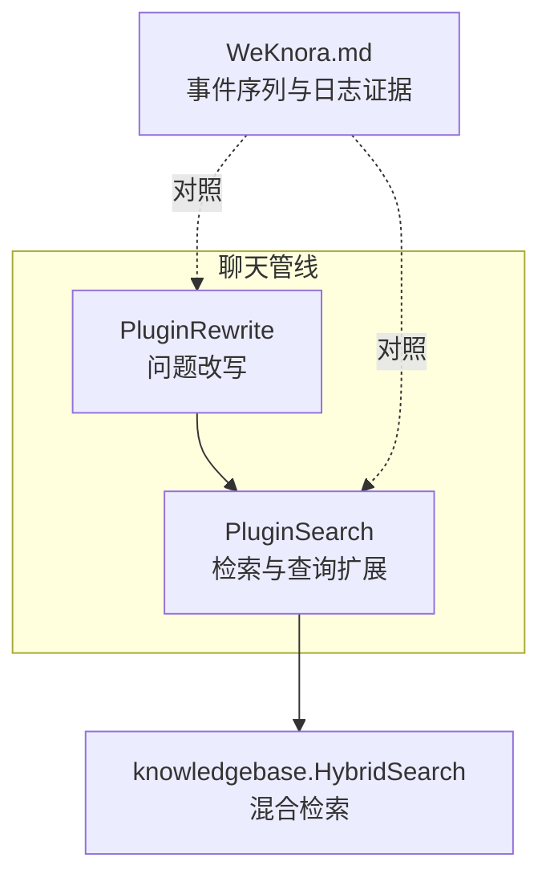
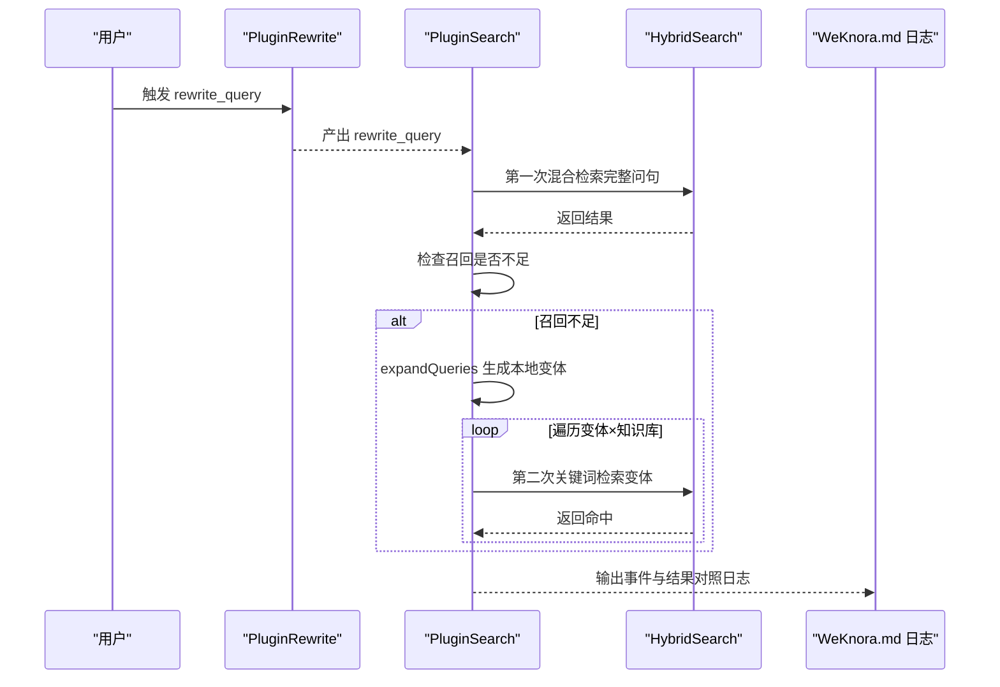
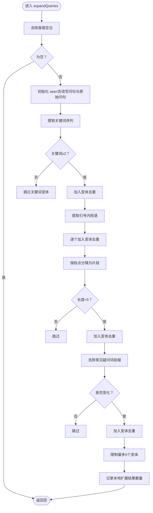
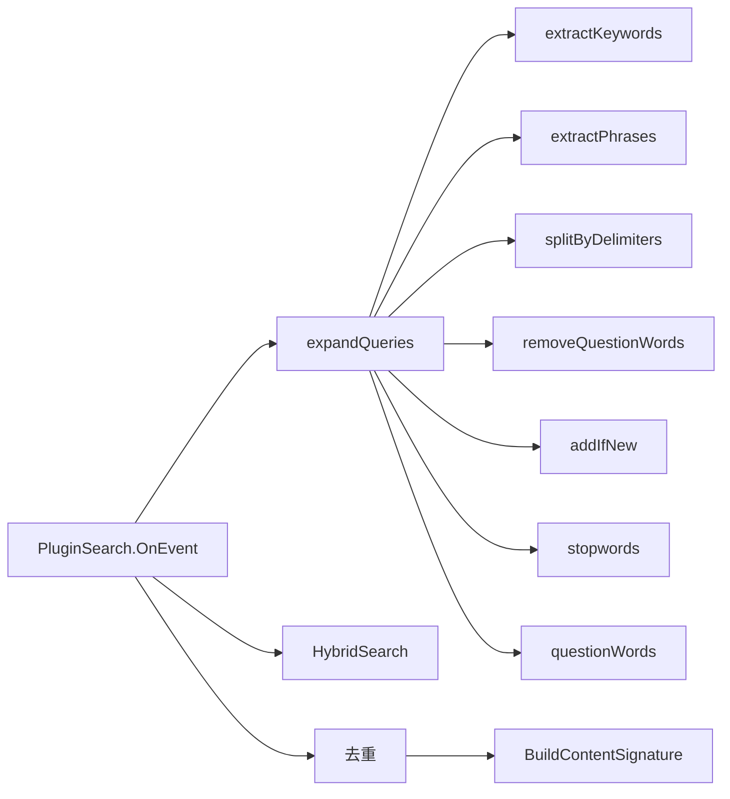

# 查询预处理

<cite>
**本文引用的文件**
- [search.go](file://internal/application/service/chat_pipline/search.go)
- [rewrite.go](file://internal/application/service/chat_pipline/rewrite.go)
- [WeKnora.md](file://docs/Weknora.md)
- [textutil.go](file://internal/searchutil/textutil.go)
- [knowledgebase.go](file://internal/application/service/knowledgebase.go)
- [common.go](file://internal/application/service/chat_pipline/common.go)
- [chat_manage.go](file://internal/types/chat_manage.go)
</cite>

## 目录
1. [简介](#简介)
2. [项目结构](#项目结构)
3. [核心组件](#核心组件)
4. [架构总览](#架构总览)
5. [详细组件分析](#详细组件分析)
6. [依赖分析](#依赖分析)
7. [性能考量](#性能考量)
8. [故障排查指南](#故障排查指南)
9. [结论](#结论)

## 简介
本技术文档聚焦于查询预处理（Query Preprocessing）在检索召回率低时的本地查询扩展机制，围绕 expandQueries 函数展开，系统性解析其在混合检索（向量+关键词）中的作用与实现策略。文档将详细说明以下四个关键步骤：
1) 调用 extractKeywords 移除停用词（如“的”“是”）并提取核心关键词；
2) 使用 extractPhrases 提取引号内的关键短语；
3) 通过 splitByDelimiters 按标点符号分割长句获取关键片段；
4) 调用 removeQuestionWords 移除“什么是”“如何”等疑问词前缀。
并解释 addIfNew 去重与唯一性保障机制，结合 WeKnora.md 中的日志证据，对比 rewrite_query 与 preprocess_query 两种不同形式的查询，阐明该过程为混合检索中的关键词匹配阶段提供优化输入。

## 项目结构
查询预处理位于聊天管线（chat pipeline）中，涉及事件驱动的插件化组件，其中：
- PluginSearch 负责检索与查询扩展；
- PluginRewrite 负责问题改写（rewrite_query）；
- WeKnora.md 提供了完整的事件序列与日志证据；
- searchutil 提供内容签名与简单分词工具；
- knowledgebase.go 提供混合检索（向量+关键词）的实现入口。

图表来源
- [search.go](file://internal/application/service/chat_pipline/search.go#L1-L120)
- [rewrite.go](file://internal/application/service/chat_pipline/rewrite.go#L1-L120)
- [knowledgebase.go](file://internal/application/service/knowledgebase.go#L431-L463)
- [WeKnora.md](file://docs/Weknora.md#L30-L42)

章节来源
- [search.go](file://internal/application/service/chat_pipline/search.go#L1-L120)
- [rewrite.go](file://internal/application/service/chat_pipline/rewrite.go#L1-L120)
- [WeKnora.md](file://docs/Weknora.md#L30-L42)

## 核心组件
- expandQueries：在召回不足时生成本地查询变体，增强关键词检索召回。
- extractKeywords：移除停用词并提取关键词序列。
- extractPhrases：提取引号内关键短语。
- splitByDelimiters：按常见标点分隔长句，抽取关键片段。
- removeQuestionWords：去除常见疑问词前缀。
- addIfNew：去重与唯一性控制。
- Pipeline 事件：rewrite_query、preprocess_query、chunk_search 等。

章节来源
- [search.go](file://internal/application/service/chat_pipline/search.go#L410-L561)
- [WeKnora.md](file://docs/Weknora.md#L30-L42)
- [chat_manage.go](file://internal/types/chat_manage.go#L98-L141)

## 架构总览
查询预处理在混合检索流程中的位置如下：
- 首先执行 rewrite_query（问题改写），得到更具体的完整问句；
- 然后执行 chunk_search（混合检索），分别使用改写后的完整问句与预处理后的关键词序列进行检索；
- 若召回不足，则触发 expandQueries 生成本地查询变体，再次以关键词检索方式扩大召回；
- 最终合并、去重并进入后续重排序与生成阶段。

图表来源
- [search.go](file://internal/application/service/chat_pipline/search.go#L131-L206)
- [knowledgebase.go](file://internal/application/service/knowledgebase.go#L431-L463)
- [WeKnora.md](file://docs/Weknora.md#L30-L42)

## 详细组件分析

### expandQueries：本地查询扩展
- 输入：chatManage.RewriteQuery（经改写后的完整问句），以及 chatManage.Query（原始问题）。
- 去重策略：使用 seen 映射记录小写标准化后的查询，避免重复。
- 变体生成策略：
  1) 关键词变体：移除停用词后以空格连接；
  2) 短语变体：提取引号内关键短语；
  3) 片段变体：按标点分隔后筛选较长片段；
  4) 去除疑问词前缀的变体。
- 输出：最多 5 个本地查询变体，供关键词检索使用。

图表来源
- [search.go](file://internal/application/service/chat_pipline/search.go#L410-L473)

章节来源
- [search.go](file://internal/application/service/chat_pipline/search.go#L410-L473)

### 关键词提取：extractKeywords
- 步骤：先对输入进行分词（tokenize），再过滤停用词（stopwords），最后保留长度大于 1 的词。
- 停用词覆盖中文常用虚词与英文冠词/介词等。
- 输出：关键词序列，用于生成“纯关键词”变体。

章节来源
- [search.go](file://internal/application/service/chat_pipline/search.go#L475-L501)

### 短语提取：extractPhrases
- 步骤：使用正则匹配引号内的内容（支持多种引号形态），并过滤长度小于等于 2 的片段。
- 输出：关键短语列表，作为变体来源之一。

章节来源
- [search.go](file://internal/application/service/chat_pipline/search.go#L503-L514)

### 片段提取：splitByDelimiters
- 步骤：按常见中文/英文标点与空白进行分割，去除空片段，保留非空片段。
- 输出：长片段列表（长度阈值>5），作为变体来源之一。

章节来源
- [search.go](file://internal/application/service/chat_pipline/search.go#L516-L528)

### 去除疑问词前缀：removeQuestionWords
- 步骤：使用正则匹配常见中文疑问词前缀并去除。
- 输出：去除疑问词前缀后的文本，作为变体来源之一。

章节来源
- [search.go](file://internal/application/service/chat_pipline/search.go#L530-L532)

### 分词与令牌化：tokenize
- 步骤：逐字符扫描，区分字母/数字、汉字与标点，汉字单独作为 token，其他字符作为分隔符。
- 输出：按字符与标点拆分的 token 序列，供关键词提取使用。

章节来源
- [search.go](file://internal/application/service/chat_pipline/search.go#L534-L561)

### 去重与唯一性：addIfNew
- 步骤：去除空白与长度小于 3 的候选；小写标准化后检查 seen；若未见过则加入 expansions 并记录。
- 作用：确保变体唯一、避免重复检索，控制扩展规模。

章节来源
- [search.go](file://internal/application/service/chat_pipline/search.go#L425-L436)

### 与日志证据的对照：rewrite_query 与 preprocess_query
- 日志显示事件序列包含 rewrite_query 与 preprocess_query，分别对应“问题改写”与“问题预处理”两个阶段。
- 日志证据表明：
  - 改写后的完整问句：“Liwx本次入住的房型是什么”
  - 预处理后的关键词序列（空格分隔）：“需要 改写 用户 问题 入住 房型 根据 提供 信息 入住 人 Liwx 选择 房型 双床 房 因此 改写 后 完整 问题 为 Liwx 本次 入住 房型”
- 这两类输入分别用于两次混合检索，以最大化召回与准确性。

章节来源
- [WeKnora.md](file://docs/Weknora.md#L30-L42)
- [WeKnora.md](file://docs/Weknora.md#L214-L229)

### 混合检索与扩展检索的衔接
- PluginSearch 在第一次混合检索后，若命中数低于阈值，则触发 expandQueries 生成本地变体，并以关键词检索方式进行扩展。
- 扩展检索参数调整：禁用向量匹配、降低关键词阈值、扩大 TopK，以提升召回。

章节来源
- [search.go](file://internal/application/service/chat_pipline/search.go#L131-L206)
- [knowledgebase.go](file://internal/application/service/knowledgebase.go#L431-L463)

## 依赖分析
- expandQueries 依赖：
  - extractKeywords、extractPhrases、splitByDelimiters、removeQuestionWords
  - addIfNew 去重闭包
  - 停用词表 stopwords、疑问词正则 questionWords
- 混合检索依赖：
  - knowledgebase.HybridSearch 提供向量与关键词的联合检索
  - searchutil.BuildContentSignature 用于内容去重

图表来源
- [search.go](file://internal/application/service/chat_pipline/search.go#L410-L561)
- [knowledgebase.go](file://internal/application/service/knowledgebase.go#L431-L463)
- [textutil.go](file://internal/searchutil/textutil.go#L1-L21)

章节来源
- [search.go](file://internal/application/service/chat_pipline/search.go#L410-L561)
- [knowledgebase.go](file://internal/application/service/knowledgebase.go#L431-L463)
- [textutil.go](file://internal/searchutil/textutil.go#L1-L21)

## 性能考量
- 并发扩展检索：expandQueries 生成的变体与知识库组合形成多路检索任务，使用 goroutine 与信号量控制并发，避免资源争用。
- 扩展阈值与 TopK：通过降低关键词阈值与扩大匹配数量，提升召回，同时限制扩展数量上限，避免过度检索。
- 去重与合并：在扩展检索后仍进行全局去重，减少重复命中带来的冗余。

章节来源
- [search.go](file://internal/application/service/chat_pipline/search.go#L131-L206)
- [search.go](file://internal/application/service/chat_pipline/search.go#L218-L235)

## 故障排查指南
- 召回不足：检查 EnableQueryExpansion 是否开启，以及 EmbeddingTopK/Threshold 配置是否合理。
- 扩展无效：确认 expandQueries 生成的变体数量与内容，关注 addIfNew 的去重逻辑与长度阈值。
- 混合检索异常：查看 HybridSearch 的参数与错误日志，确认向量/关键词引擎可用性。
- 去重误删：若发现命中被误删，检查 BuildContentSignature 的规范化规则与去重键策略。

章节来源
- [search.go](file://internal/application/service/chat_pipline/search.go#L131-L206)
- [search.go](file://internal/application/service/chat_pipline/search.go#L218-L235)
- [textutil.go](file://internal/searchutil/textutil.go#L1-L21)

## 结论
expandQueries 通过本地规则化策略（停用词过滤、短语提取、片段拆分、疑问词去除）生成高质量查询变体，显著提升关键词检索召回，配合混合检索与扩展检索，在召回不足时有效弥补向量检索的短板。结合 WeKnora.md 的事件序列与日志证据，可以清晰看到 rewrite_query 与 preprocess_query 两种输入在混合检索中的互补作用，为后续重排序与生成阶段提供更稳健的候选集。