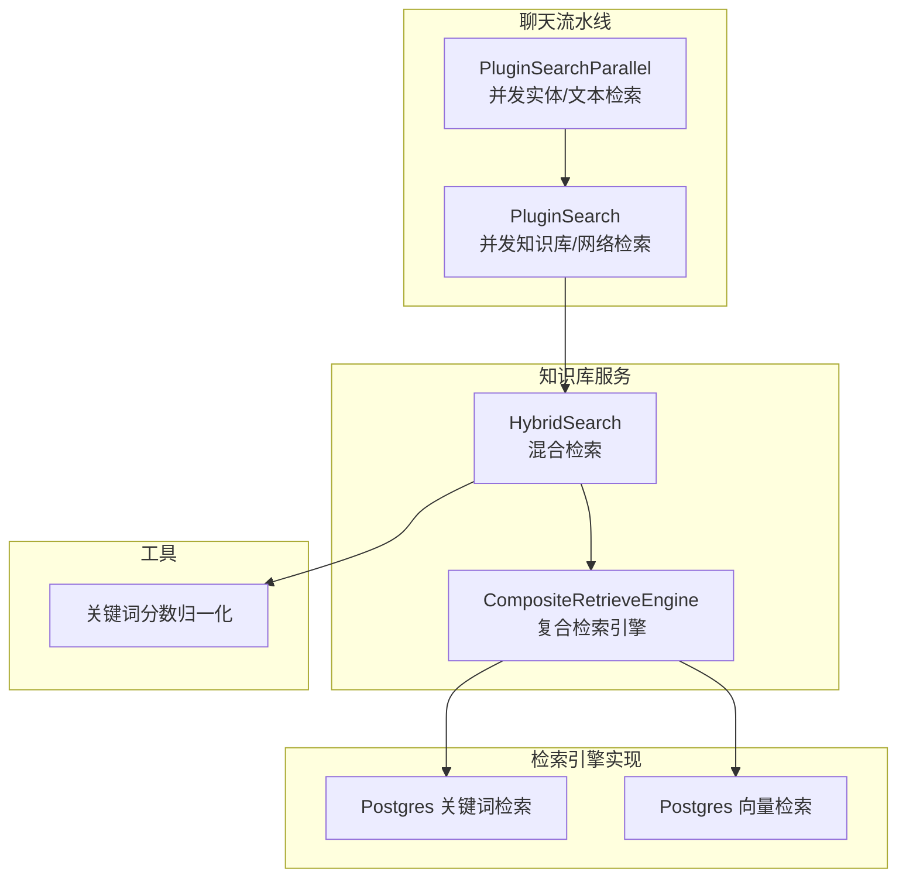
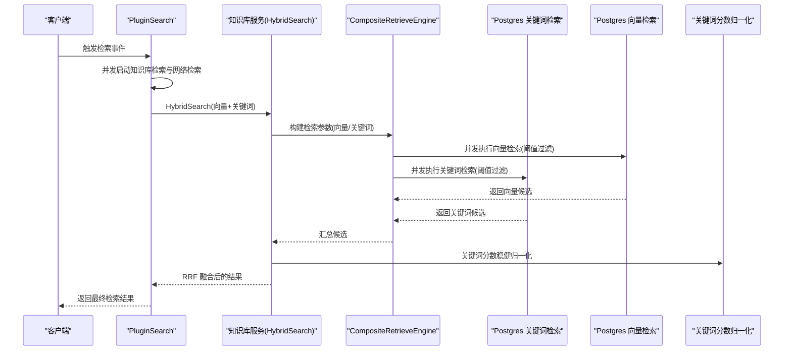
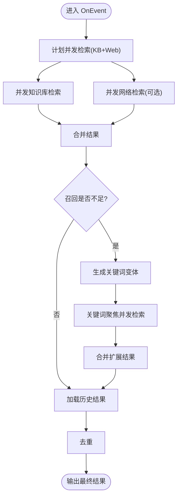
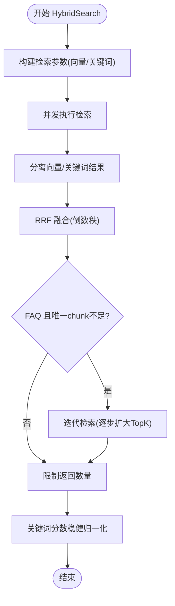
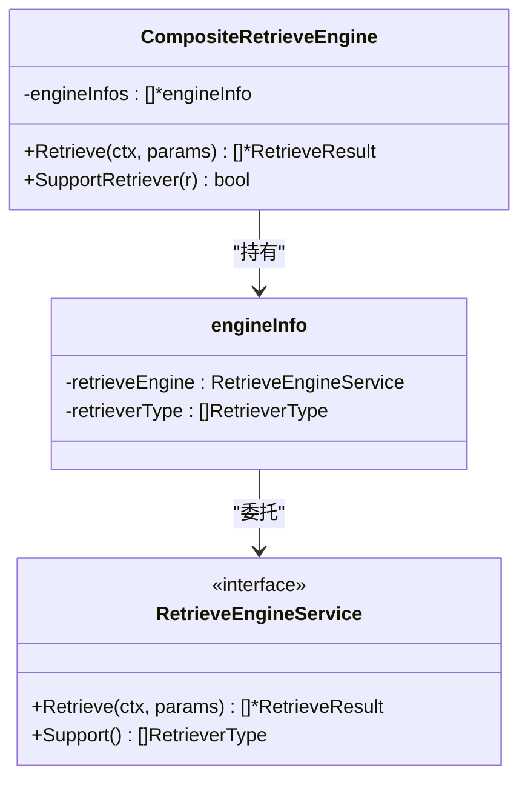
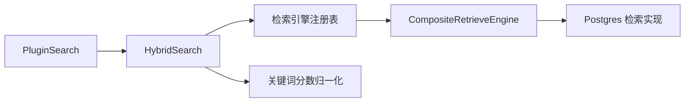

# 多路召回

<cite>
**本文引用的文件列表**
- [search.go](file://internal/application/service/chat_pipline/search.go)
- [knowledgebase.go](file://internal/application/service/knowledgebase.go)
- [search.go](file://internal/types/search.go)
- [composite.go](file://internal/application/service/retriever/composite.go)
- [repository.go](file://internal/application/repository/retriever/postgres/repository.go)
- [normalize.go](file://internal/searchutil/normalize.go)
- [search_parallel.go](file://internal/application/service/chat_pipline/search_parallel.go)
</cite>

## 目录
1. [简介](#简介)
2. [项目结构](#项目结构)
3. [核心组件](#核心组件)
4. [架构总览](#架构总览)
5. [详细组件分析](#详细组件分析)
6. [依赖关系分析](#依赖关系分析)
7. [性能考量](#性能考量)
8. [故障排查指南](#故障排查指南)
9. [结论](#结论)

## 简介
本文件围绕多路召回机制展开，重点解析以下两个实现：
- 聊天流水线中的并发检索插件：PluginSearch（并发执行知识库检索与网络检索）
- 知识库服务中的混合检索：HybridSearch（并发执行向量检索与关键词检索，并通过RRF融合）

文档将深入说明：
- 如何通过并发模式（sync.WaitGroup、sync.Mutex、带容量信号量）保障线程安全与吞吐
- SearchParams 中 VectorThreshold 与 KeywordThreshold 的作用与过滤逻辑
- CompositeRetrieveEngine 如何协调不同检索器
- 查询扩展与迭代检索策略
- 性能优化建议（并发度、TopK 扩展、阈值调优）

## 项目结构
与多路召回直接相关的模块分布如下：
- 聊天流水线检索插件：负责并发执行知识库与网络检索，并在召回不足时进行查询扩展
- 知识库混合检索：负责构建复合检索引擎、并发执行向量与关键词检索、RRF 融合与迭代检索
- 检索引擎实现：Postgres 关键词检索与向量检索
- 结果归一化工具：对关键词匹配分数进行稳健百分位归一化
- 并发工具：通用并发辅助函数与信号量

图表来源
- [search.go](file://internal/application/service/chat_pipline/search.go#L83-L120)
- [knowledgebase.go](file://internal/application/service/knowledgebase.go#L431-L654)
- [composite.go](file://internal/application/service/retriever/composite.go#L32-L62)
- [repository.go](file://internal/application/repository/retriever/postgres/repository.go#L162-L228)
- [normalize.go](file://internal/searchutil/normalize.go#L1-L109)

章节来源
- [search.go](file://internal/application/service/chat_pipline/search.go#L83-L120)
- [knowledgebase.go](file://internal/application/service/knowledgebase.go#L431-L654)
- [composite.go](file://internal/application/service/retriever/composite.go#L32-L62)
- [repository.go](file://internal/application/repository/retriever/postgres/repository.go#L162-L228)
- [normalize.go](file://internal/searchutil/normalize.go#L1-L109)

## 核心组件
- PluginSearch：在聊天流水线中并发执行知识库检索与网络检索，支持查询扩展与历史结果补充，最后去重
- HybridSearch：在知识库维度并发执行向量检索与关键词检索，使用 RRF 融合，必要时进行迭代检索
- CompositeRetrieveEngine：按检索器类型分派到具体检索引擎，统一并发执行与结果收集
- Postgres 检索实现：关键词检索与向量检索均在 Postgres 上完成，向量检索支持阈值过滤与 TopK 扩展
- 关键词分数归一化：对关键词匹配分数进行稳健百分位归一化，避免极端值影响

章节来源
- [search.go](file://internal/application/service/chat_pipline/search.go#L83-L120)
- [knowledgebase.go](file://internal/application/service/knowledgebase.go#L431-L654)
- [composite.go](file://internal/application/service/retriever/composite.go#L32-L62)
- [repository.go](file://internal/application/repository/retriever/postgres/repository.go#L162-L228)
- [normalize.go](file://internal/searchutil/normalize.go#L1-L109)

## 架构总览
下图展示了多路召回的整体流程：聊天流水线并发触发知识库与网络检索，知识库侧再并发触发向量与关键词检索，最终通过 RRF 融合与阈值过滤输出结果。

图表来源
- [search.go](file://internal/application/service/chat_pipline/search.go#L83-L120)
- [knowledgebase.go](file://internal/application/service/knowledgebase.go#L431-L654)
- [composite.go](file://internal/application/service/retriever/composite.go#L32-L62)
- [repository.go](file://internal/application/repository/retriever/postgres/repository.go#L162-L228)
- [normalize.go](file://internal/searchutil/normalize.go#L1-L109)

## 详细组件分析

### PluginSearch：并发知识库与网络检索
- 并发模式
  - 使用 sync.WaitGroup 等待两个 goroutine 完成
  - 使用 sync.Mutex 保护共享结果切片的追加
  - 在查询召回不足时，启用查询扩展（关键词聚焦），并使用带容量信号量的并发通道限制并发度
- 关键参数
  - VectorThreshold 与 KeywordThreshold 由上层传入，用于 HybridSearch 的阈值过滤
  - EmbeddingTopK 控制向量检索 TopK 扩展倍数
- 处理流程
  - 先并发执行知识库检索（对每个 KB 并发执行）
  - 再并发执行网络检索（可选）
  - 若召回过少，进行本地查询扩展（关键词变体），再次并发检索
  - 合并历史结果与去重
  - 输出前记录各候选的分数与匹配类型

图表来源
- [search.go](file://internal/application/service/chat_pipline/search.go#L83-L120)
- [search.go](file://internal/application/service/chat_pipline/search.go#L131-L206)
- [search.go](file://internal/application/service/chat_pipline/search.go#L311-L359)

章节来源
- [search.go](file://internal/application/service/chat_pipline/search.go#L83-L120)
- [search.go](file://internal/application/service/chat_pipline/search.go#L131-L206)
- [search.go](file://internal/application/service/chat_pipline/search.go#L311-L359)

### HybridSearch：向量与关键词并发检索与 RRF 融合
- 并发模式
  - CompositeRetrieveEngine 对检索参数按检索器类型分派，统一并发执行
  - 使用 sync.WaitGroup 与 sync.Mutex 保证结果收集的并发安全
- 检索参数
  - VectorThreshold：向量检索的距离阈值（转换为距离上限后过滤）
  - KeywordThreshold：关键词检索的阈值（由具体检索实现决定）
  - MatchCount：期望返回数量
  - DisableVectorMatch/DisableKeywordsMatch：可禁用某类检索
- 执行流程
  - 构建检索参数（向量/关键词），必要时扩展 TopK
  - 并发执行检索，分离向量与关键词结果
  - RRF 融合：对同一 chunk 的 rank 取倒数求和，k 常量取 60
  - FAQ 场景：若唯一 chunk 数不足且达到最大候选数，采用迭代检索逐步增加 TopK 并负向问题过滤
  - 限制返回数量至 MatchCount
  - 关键词分数稳健归一化（降低极端值影响）

图表来源
- [knowledgebase.go](file://internal/application/service/knowledgebase.go#L431-L654)
- [composite.go](file://internal/application/service/retriever/composite.go#L32-L62)
- [normalize.go](file://internal/searchutil/normalize.go#L1-L109)

章节来源
- [knowledgebase.go](file://internal/application/service/knowledgebase.go#L431-L654)
- [composite.go](file://internal/application/service/retriever/composite.go#L32-L62)
- [normalize.go](file://internal/searchutil/normalize.go#L1-L109)

### CompositeRetrieveEngine：检索器编排与并发
- 组合模式
  - 将多种检索引擎聚合，按检索器类型分派到对应引擎
  - 支持并发执行与错误收集
- 关键方法
  - NewCompositeRetrieveEngine：根据配置注册检索引擎与类型
  - Retrieve：并发调度，收集结果并合并
  - concurrentRetrieve：通用并发执行与错误通道收集
  - SupportRetriever：查询是否支持某检索器类型

图表来源
- [composite.go](file://internal/application/service/retriever/composite.go#L20-L103)
- [composite.go](file://internal/application/service/retriever/composite.go#L118-L152)

章节来源
- [composite.go](file://internal/application/service/retriever/composite.go#L20-L103)
- [composite.go](file://internal/application/service/retriever/composite.go#L118-L152)

### Postgres 检索实现：关键词与向量
- 关键词检索（KeywordsRetrieve）
  - 使用全文检索与排序，按 is_enabled 过滤
  - 支持按知识库 ID 过滤
- 向量检索（VectorRetrieve）
  - 使用 HNSW 索引，先排序再阈值过滤
  - 通过子查询与阈值参数控制候选数量，避免重复计算距离
  - 支持按知识库 ID 与 is_enabled 过滤

章节来源
- [repository.go](file://internal/application/repository/retriever/postgres/repository.go#L162-L228)
- [repository.go](file://internal/application/repository/retriever/postgres/repository.go#L230-L351)

### 关键字分数归一化：稳健百分位
- 归一化策略
  - 仅对关键词匹配结果进行归一化
  - 当样本数≥10时，使用 5%/95% 百分位裁剪，避免极端值影响
  - 若方差为 0 或范围为 0，统一置为 1.0
- 用途
  - 与向量分数共同参与 RRF 融合，提升融合稳定性

章节来源
- [normalize.go](file://internal/searchutil/normalize.go#L1-L109)

### PluginSearchParallel：并发实体/文本检索
- 与 PluginSearch 的关系
  - PluginSearchParallel 在聊天流水线中并行运行文本检索与实体检索
  - 两者完成后合并结果并去重
- 并发安全
  - 使用独立的 ChatManage 副本避免并发写冲突
  - 使用 WaitGroup 与互斥锁收集错误与结果

章节来源
- [search_parallel.go](file://internal/application/service/chat_pipline/search_parallel.go#L79-L181)

## 依赖关系分析
- PluginSearch 依赖知识库服务接口与网络搜索服务接口
- HybridSearch 依赖检索引擎注册表与检索引擎服务
- CompositeRetrieveEngine 依赖检索引擎服务接口
- Postgres 实现依赖嵌入模型服务与数据库访问层
- 关键词分数归一化工具独立于检索实现

图表来源
- [search.go](file://internal/application/service/chat_pipline/search.go#L83-L120)
- [knowledgebase.go](file://internal/application/service/knowledgebase.go#L431-L654)
- [composite.go](file://internal/application/service/retriever/composite.go#L64-L90)
- [repository.go](file://internal/application/repository/retriever/postgres/repository.go#L162-L228)
- [normalize.go](file://internal/searchutil/normalize.go#L1-L109)

章节来源
- [search.go](file://internal/application/service/chat_pipline/search.go#L83-L120)
- [knowledgebase.go](file://internal/application/service/knowledgebase.go#L431-L654)
- [composite.go](file://internal/application/service/retriever/composite.go#L64-L90)
- [repository.go](file://internal/application/repository/retriever/postgres/repository.go#L162-L228)
- [normalize.go](file://internal/searchutil/normalize.go#L1-L109)

## 性能考量
- 并发度与吞吐
  - PluginSearch 在查询扩展阶段使用带容量信号量的并发通道，避免瞬时高并发导致下游压力过大
  - HybridSearch 通过并发执行向量与关键词检索，充分利用多引擎能力
- TopK 扩展与阈值
  - Postgres 向量检索在阈值过滤前扩大 TopK，减少因阈值过严导致的漏检
  - VectorThreshold 与 KeywordThreshold 应结合数据规模与召回需求动态调整
- RRF 融合与归一化
  - RRF 常量 k=60 适用于多数场景；关键词分数稳健归一化可降低极端值影响
- FAQ 场景的迭代检索
  - 当唯一 chunk 不足且达到最大候选数时，采用迭代检索逐步扩大 TopK 并负向问题过滤，提高覆盖率

章节来源
- [search.go](file://internal/application/service/chat_pipline/search.go#L131-L206)
- [knowledgebase.go](file://internal/application/service/knowledgebase.go#L431-L654)
- [repository.go](file://internal/application/repository/retriever/postgres/repository.go#L230-L351)
- [normalize.go](file://internal/searchutil/normalize.go#L1-L109)

## 故障排查指南
- 并发安全问题
  - 确认所有对共享结果切片的写操作均使用互斥锁保护
  - 确保 WaitGroup 的 Add/Done 成对出现，避免死锁
- 检索无结果
  - 检查 VectorThreshold 与 KeywordThreshold 是否过高
  - 检查知识库 ID 过滤条件与 is_enabled 状态
  - 对 FAQ 场景确认是否触发迭代检索
- 性能瓶颈
  - 观察并发通道容量设置是否合理
  - 检查 Postgres 索引与查询计划，确认 HNSW 使用情况
- 结果质量
  - 关注关键词分数归一化是否生效
  - 检查 RRF 融合权重与 k 值是否合适

章节来源
- [search.go](file://internal/application/service/chat_pipline/search.go#L83-L120)
- [knowledgebase.go](file://internal/application/service/knowledgebase.go#L431-L654)
- [repository.go](file://internal/application/repository/retriever/postgres/repository.go#L162-L228)
- [normalize.go](file://internal/searchutil/normalize.go#L1-L109)

## 结论
本系统通过 PluginSearch 与 HybridSearch 的双层并发设计，实现了高效的多路召回：上层并发执行知识库与网络检索，下层并发执行向量与关键词检索，并以 RRF 融合与稳健归一化提升结果质量。配合阈值过滤、TopK 扩展与迭代检索策略，能够在不同规模与场景下取得良好的召回与重排效果。实际部署中应结合数据规模与业务需求，动态调整并发度、阈值与 TopK 扩展策略，以获得最佳性能与质量平衡。