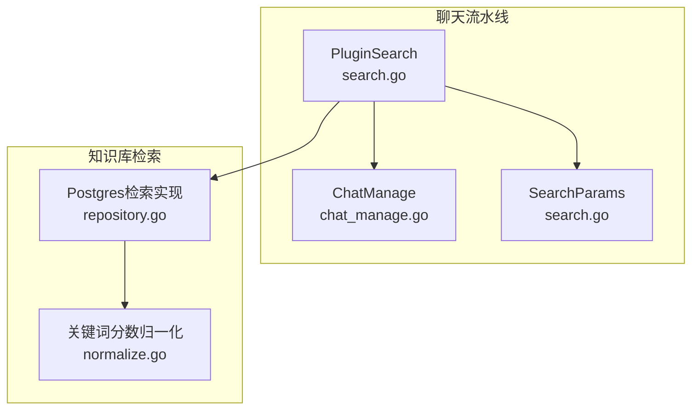
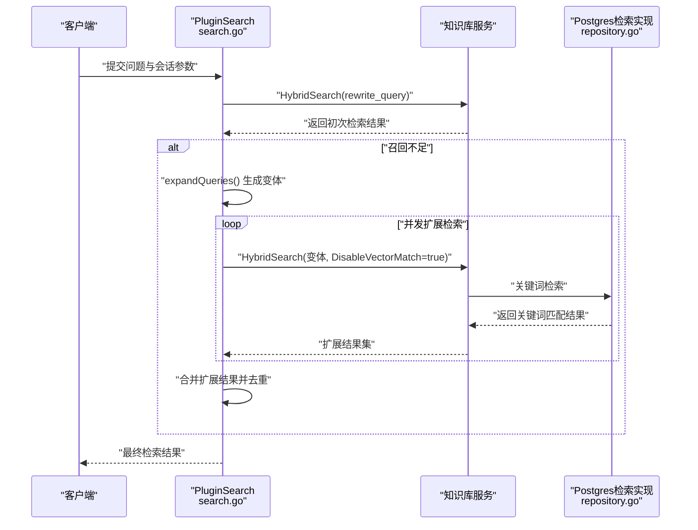
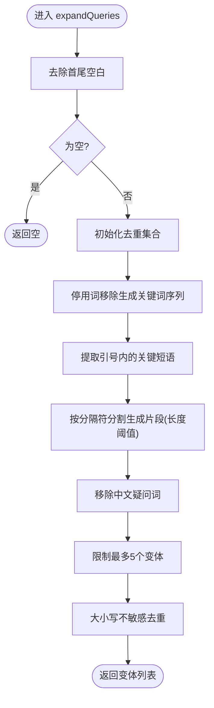
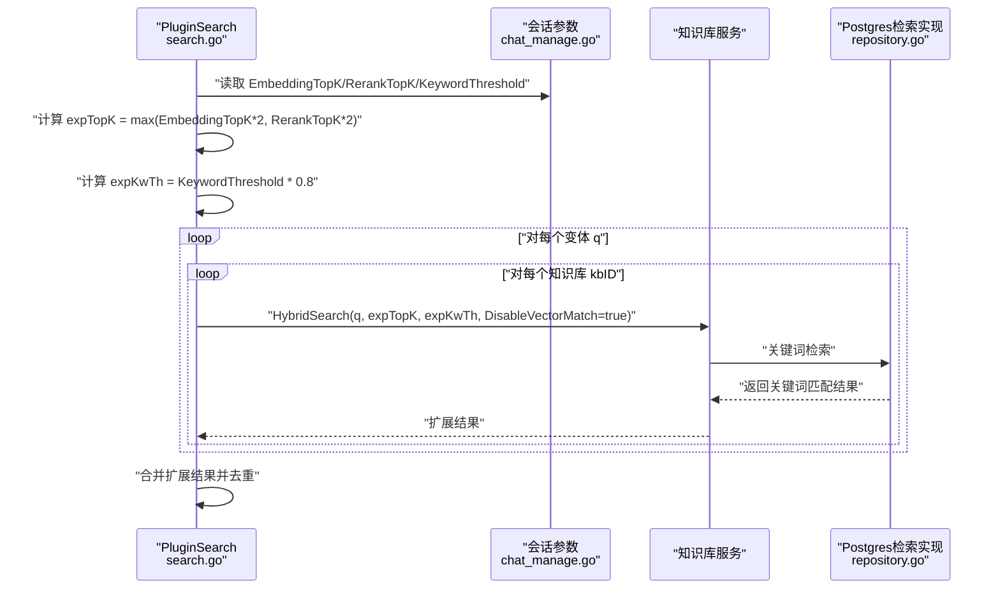
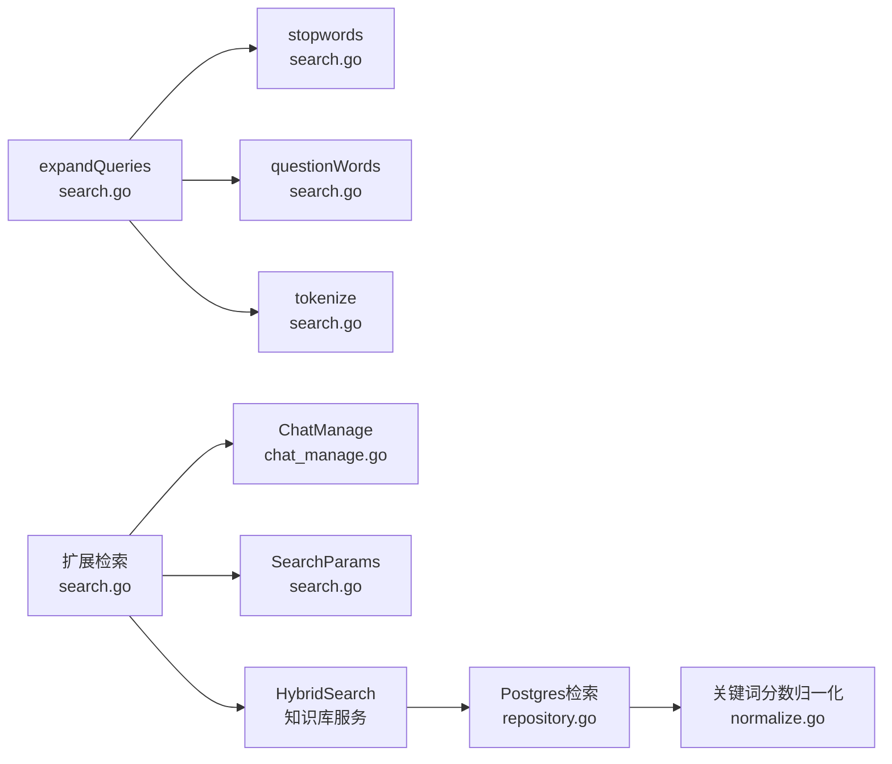

# 查询扩展

<cite>
**本文引用的文件**
- [search.go](file://internal/application/service/chat_pipline/search.go)
- [Weknora.md](file://docs/Weknora.md)
- [chat_manage.go](file://internal/types/chat_manage.go)
- [search.go](file://internal/types/search.go)
- [repository.go](file://internal/application/repository/retriever/postgres/repository.go)
- [normalize.go](file://internal/searchutil/normalize.go)
</cite>

## 目录
1. [简介](#简介)
2. [项目结构](#项目结构)
3. [核心组件](#核心组件)
4. [架构总览](#架构总览)
5. [详细组件分析](#详细组件分析)
6. [依赖分析](#依赖分析)
7. [性能考量](#性能考量)
8. [故障排查指南](#故障排查指南)
9. [结论](#结论)
10. [附录](#附录)

## 简介
本文件围绕查询扩展（Query Expansion）策略展开，重点基于聊天流水线中的 expandQueries 函数，解释系统在初次检索结果不足时（len(chatManage.SearchResult) < max(1, chatManage.EmbeddingTopK/2)），如何通过本地化算法生成查询变体，以提升关键词召回率。文档同时结合 WeKnora.md 中关于“两次混合搜索”的说明，解释为何在扩展查询阶段使用 DisableVectorMatch: true 的参数配置，使扩展检索聚焦于关键词匹配；并给出 expKwTh 和 expTopK 等参数的调优建议。

## 项目结构
与查询扩展直接相关的代码位于聊天流水线服务中，涉及：
- 查询扩展与扩展检索的主流程：internal/application/service/chat_pipline/search.go
- 两次混合搜索的说明与流程背景：docs/Weknora.md
- 会话与搜索参数的数据结构：internal/types/chat_manage.go、internal/types/search.go
- 关键词检索与向量检索的实现细节（用于理解扩展阶段的参数行为）：internal/application/repository/retriever/postgres/repository.go、internal/searchutil/normalize.go

图表来源
- [search.go](file://internal/application/service/chat_pipline/search.go#L131-L206)
- [chat_manage.go](file://internal/types/chat_manage.go#L1-L52)
- [search.go](file://internal/types/search.go#L54-L62)
- [repository.go](file://internal/application/repository/retriever/postgres/repository.go#L162-L286)
- [normalize.go](file://internal/searchutil/normalize.go#L1-L58)

章节来源
- [search.go](file://internal/application/service/chat_pipline/search.go#L131-L206)
- [Weknora.md](file://docs/Weknora.md#L199-L231)

## 核心组件
- PluginSearch.expandQueries：在召回不足时生成查询变体，包含四种扩展技术：停用词移除生成关键词序列、提取引号内的关键短语、按分隔符分割生成片段、移除中文疑问词。
- 扩展检索流程：当存在扩展变体时，系统并发执行扩展检索，使用 DisableVectorMatch: true，聚焦关键词匹配，提升关键词召回。
- 两次混合搜索：Weknora.md 明确说明了两次混合搜索的目的与差异，为理解扩展检索的参数配置提供背景。

章节来源
- [search.go](file://internal/application/service/chat_pipline/search.go#L410-L562)
- [Weknora.md](file://docs/Weknora.md#L199-L231)

## 架构总览
下图展示了“初次检索不足时触发查询扩展”的整体流程，以及扩展检索阶段的关键参数与行为。

图表来源
- [search.go](file://internal/application/service/chat_pipline/search.go#L131-L206)
- [repository.go](file://internal/application/repository/retriever/postgres/repository.go#L162-L286)

## 详细组件分析

### 扩展算法：expandQueries
expandQueries 在召回不足时被触发，通过本地化规则生成最多若干个查询变体，以增强关键词召回。其核心步骤如下：

- 步骤1：停用词移除生成关键词序列
  - 对原始查询进行分词，剔除常见停用词，得到关键词序列；若关键词数≥2，则组成新的查询变体。
- 步骤2：提取引号内的关键短语
  - 使用正则提取引号包裹的关键短语，作为独立变体加入候选。
- 步骤3：按分隔符分割生成片段
  - 使用常见标点与空白作为分隔符，将查询拆分为片段，仅保留较长片段作为变体。
- 步骤4：移除中文疑问词
  - 去除句首的常见中文疑问词，生成新的查询变体。
- 去重与上限
  - 对生成的变体进行大小写不敏感去重，并限制最多5个变体。

图表来源
- [search.go](file://internal/application/service/chat_pipline/search.go#L410-L501)

章节来源
- [search.go](file://internal/application/service/chat_pipline/search.go#L410-L501)

### 扩展检索：参数与并发
当存在扩展变体时，系统并发执行扩展检索，关键参数与行为如下：

- 触发条件
  - 当 EnableQueryExpansion 为真，且初次检索结果数量小于阈值（max(1, EmbeddingTopK/2)）时触发。
- 扩展检索参数
  - QueryText：使用扩展变体逐一检索。
  - VectorThreshold、KeywordThreshold：沿用会话参数，但扩展阶段会将 KeywordThreshold 调低至 KeywordThreshold × 0.8（expKwTh）。
  - MatchCount：扩展阶段扩大为 max(EmbeddingTopK×2, RerankTopK×2)（expTopK），以提升候选规模。
  - DisableVectorMatch：true，禁用向量检索，聚焦关键词匹配。
  - DisableKeywordsMatch：false，启用关键词检索。
- 并发控制
  - 任务数为 变体数 × 知识库数；使用信号量限制并发，避免过度占用资源。
- 结果合并与去重
  - 将扩展结果追加到初次检索结果后，统一进行去重处理。

图表来源
- [search.go](file://internal/application/service/chat_pipline/search.go#L131-L206)
- [chat_manage.go](file://internal/types/chat_manage.go#L1-L52)
- [repository.go](file://internal/application/repository/retriever/postgres/repository.go#L162-L286)

章节来源
- [search.go](file://internal/application/service/chat_pipline/search.go#L131-L206)
- [chat_manage.go](file://internal/types/chat_manage.go#L1-L52)

### 两次混合搜索与扩展检索的关系
Weknora.md 明确指出，系统执行两次混合搜索：
- 第一次：使用改写后的完整问句进行向量与关键词混合检索。
- 第二次：使用预处理后的关键词序列进行同样的混合检索。
- 目的：最大化召回与准确性的平衡，确保不同表达方式都能命中相关知识。

扩展检索与两次混合搜索的关系：
- 两次混合搜索强调“同一查询的不同表达”（完整句 vs. 关键词序列）。
- 扩展检索强调“同一查询的局部变体”（停用词移除、引号短语、分隔片段、疑问词移除）。
- 两者共同提升召回：前者覆盖语义与关键词的互补优势，后者聚焦关键词层面的局部强化。

章节来源
- [Weknora.md](file://docs/Weknora.md#L199-L231)

### 关键词检索与分数归一化
扩展检索使用 DisableVectorMatch=true，意味着：
- 仅执行关键词检索（如 Postgres 全文检索），不进行向量相似度匹配。
- 关键词检索结果在内部会进行分数归一化，以保证不同来源分数的可比性。

章节来源
- [search.go](file://internal/application/service/chat_pipline/search.go#L168-L175)
- [repository.go](file://internal/application/repository/retriever/postgres/repository.go#L162-L286)
- [normalize.go](file://internal/searchutil/normalize.go#L1-L58)

## 依赖分析
- expandQueries 依赖：
  - 停用词集合、中文疑问词正则、分词器（tokenize）。
  - 查询预处理（去除空白、大小写标准化）。
- 扩展检索依赖：
  - 会话参数 ChatManage（EmbeddingTopK、RerankTopK、KeywordThreshold、VectorThreshold）。
  - 知识库服务 HybridSearch（传入 SearchParams，其中 DisableVectorMatch=true）。
  - Postgres 检索实现（关键词检索与向量检索的组合，扩展阶段仅走关键词路径）。

图表来源
- [search.go](file://internal/application/service/chat_pipline/search.go#L410-L562)
- [chat_manage.go](file://internal/types/chat_manage.go#L1-L52)
- [search.go](file://internal/types/search.go#L54-L62)
- [repository.go](file://internal/application/repository/retriever/postgres/repository.go#L162-L286)
- [normalize.go](file://internal/searchutil/normalize.go#L1-L58)

章节来源
- [search.go](file://internal/application/service/chat_pipline/search.go#L410-L562)
- [chat_manage.go](file://internal/types/chat_manage.go#L1-L52)
- [search.go](file://internal/types/search.go#L54-L62)
- [repository.go](file://internal/application/repository/retriever/postgres/repository.go#L162-L286)
- [normalize.go](file://internal/searchutil/normalize.go#L1-L58)

## 性能考量
- 扩展检索并发
  - 任务数为 变体数 × 知识库数，使用固定容量信号量限制并发，避免资源争用。
- 扩展检索规模
  - MatchCount（expTopK）翻倍，有助于在禁用向量匹配的情况下扩大候选池，提升关键词召回。
- 关键词阈值
  - KeywordThreshold（expKwTh）下调至 0.8 倍，降低关键词命中门槛，增加潜在命中。
- 去重与合并
  - 扩展结果与初次检索结果统一去重，避免重复与冗余，减少下游重排序负担。

章节来源
- [search.go](file://internal/application/service/chat_pipline/search.go#L131-L206)

## 故障排查指南
- 扩展未生效
  - 检查 EnableQueryExpansion 是否开启。
  - 检查初次检索结果数量是否低于阈值（max(1, EmbeddingTopK/2)）。
- 扩展变体无效
  - 确认原始查询非空且长度足够；检查停用词移除后是否仍有多于1个关键词。
  - 检查引号短语与分隔符分割是否能提取有效片段。
- 扩展检索报错
  - 查看日志中的扩展错误（expansion_error）字段，定位知识库ID与错误原因。
- 关键词命中过少
  - 适当降低 KeywordThreshold（expKwTh）或增大 MatchCount（expTopK）。
- 结果重复
  - 确认去重逻辑是否正常执行；检查内容签名与ID键是否覆盖父Chunk等维度。

章节来源
- [search.go](file://internal/application/service/chat_pipline/search.go#L131-L206)

## 结论
查询扩展通过本地化规则生成查询变体，在召回不足时以关键词聚焦的方式进行扩展检索，有效提升了关键词层面的召回率。结合两次混合搜索的思路，扩展检索与初次检索形成互补：前者强化关键词局部表达，后者兼顾语义与关键词的整体表达。通过合理设置 expTopK 与 expKwTh，并配合并发与去重策略，可在保证性能的前提下提升整体检索质量。

## 附录

### 参数调优指南
- expTopK（扩展检索的 MatchCount）
  - 建议设置为 max(EmbeddingTopK×2, RerankTopK×2)，以扩大候选池，提升关键词召回。
- expKwTh（扩展检索的 KeywordThreshold）
  - 建议设置为 KeywordThreshold × 0.8，降低关键词命中门槛，增加潜在命中。
- EnableQueryExpansion
  - 建议默认开启，便于在召回不足时自动触发扩展。
- 并发与资源
  - 扩展检索并发受任务数与信号量限制；根据集群资源与延迟目标调整并发度。

章节来源
- [search.go](file://internal/application/service/chat_pipline/search.go#L131-L206)
- [chat_manage.go](file://internal/types/chat_manage.go#L1-L52)