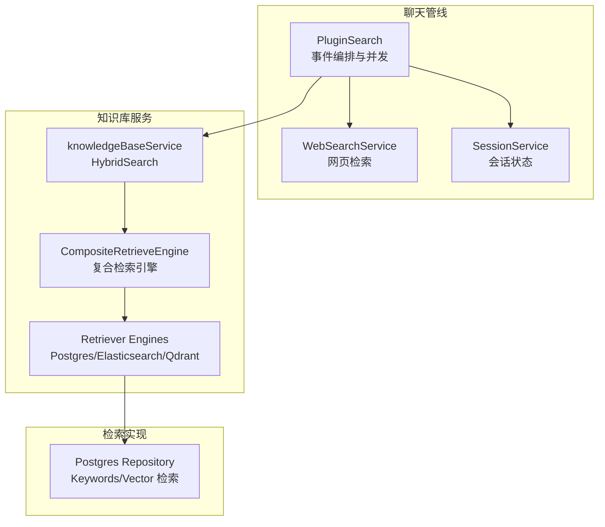
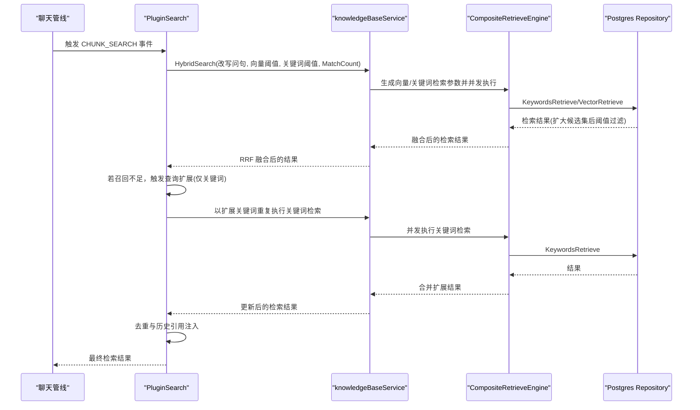
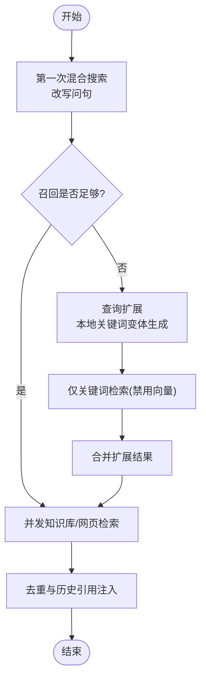
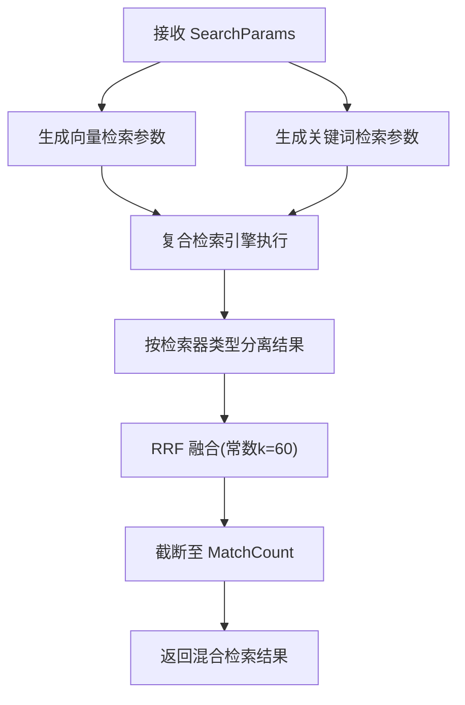
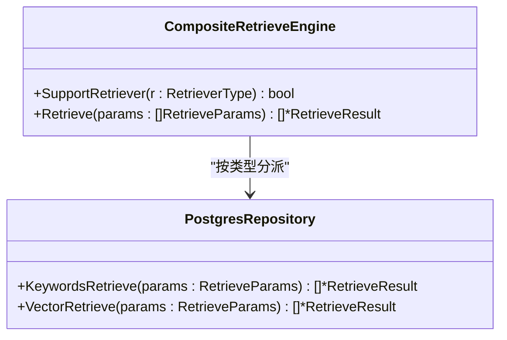
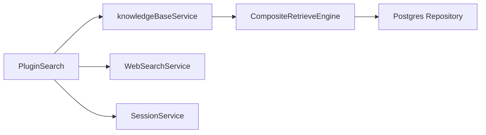

# 检索策略

<cite>
**本文引用的文件**
- [search.go](file://internal/application/service/chat_pipline/search.go)
- [knowledgebase.go](file://internal/application/service/knowledgebase.go)
- [composite.go](file://internal/application/service/retriever/composite.go)
- [repository.go](file://internal/application/repository/retriever/postgres/repository.go)
- [retriever.go](file://internal/types/retriever.go)
- [search.go](file://internal/types/search.go)
- [embedding.go](file://internal/types/embedding.go)
- [Weknora.md](file://docs/Weknora.md)
- [config.yaml](file://config/config.yaml)
- [normalize.go](file://internal/searchutil/normalize.go)
- [web_search.go](file://internal/application/service/web_search.go)
- [knowledge_search.go](file://internal/agent/tools/knowledge_search.go)
</cite>

## 目录
1. [简介](#简介)
2. [项目结构](#项目结构)
3. [核心组件](#核心组件)
4. [架构总览](#架构总览)
5. [详细组件分析](#详细组件分析)
6. [依赖关系分析](#依赖关系分析)
7. [性能考量](#性能考量)
8. [故障排查指南](#故障排查指南)
9. [结论](#结论)
10. [附录](#附录)

## 简介
本技术文档围绕混合检索策略展开，基于 PluginSearch 的实现，系统性解释如何通过 HybridSearch 接口协调关键词检索（BM25）与向量检索（如 bge-m3），实现多路召回。结合 WeKnora.md 中关于两次混合搜索的说明，阐明系统执行两次混合搜索的根本目的：通过查询扩展（Query Expansion）最大化召回率。文档还深入解析 SearchParams 结构体中的 VectorThreshold、KeywordThreshold 和 MatchCount 等参数如何控制检索行为，并提供不同场景下的策略调优建议，帮助在“语义深度”与“关键词广度”之间取得平衡。

## 项目结构
本仓库采用分层与模块化设计，检索链路贯穿“聊天管线插件 -> 知识库服务 -> 复合检索引擎 -> 具体检索实现（Postgres/Elasticsearch/Qdrant 等）”。其中：
- 聊天管线插件负责事件编排、并发检索、查询扩展与结果去重。
- 知识库服务负责参数装配、向量模型加载、调用复合检索引擎、融合与截断。
- 复合检索引擎负责按检索器类型分派到具体实现。
- 具体检索实现（以 Postgres 为例）负责向量与关键词检索的 SQL 构造、阈值过滤与候选集扩展。

图表来源
- [search.go](file://internal/application/service/chat_pipline/search.go#L1-L250)
- [knowledgebase.go](file://internal/application/service/knowledgebase.go#L431-L653)
- [composite.go](file://internal/application/service/retriever/composite.go#L1-L120)
- [repository.go](file://internal/application/repository/retriever/postgres/repository.go#L162-L320)

章节来源
- [search.go](file://internal/application/service/chat_pipline/search.go#L1-L250)
- [knowledgebase.go](file://internal/application/service/knowledgebase.go#L431-L653)
- [composite.go](file://internal/application/service/retriever/composite.go#L1-L120)
- [repository.go](file://internal/application/repository/retriever/postgres/repository.go#L162-L320)

## 核心组件
- PluginSearch：聊天管线中的检索插件，负责并发执行知识库检索与网页检索，二次混合搜索与查询扩展，以及结果去重与历史引用注入。
- knowledgeBaseService.HybridSearch：知识库服务的混合检索入口，组装向量与关键词检索参数，调用复合检索引擎，执行 RRF 融合与截断。
- CompositeRetrieveEngine：复合检索引擎，按检索器类型分派到具体实现，支持并发执行。
- Postgres Repository：具体检索实现，提供关键词检索与向量检索，含候选集扩展与阈值过滤。
- SearchParams：检索参数载体，包含 QueryText、VectorThreshold、KeywordThreshold、MatchCount、禁用开关等。
- MatchType：匹配类型枚举，用于标识结果来源（向量/关键词/历史/图谱等）。

章节来源
- [search.go](file://internal/application/service/chat_pipline/search.go#L1-L250)
- [knowledgebase.go](file://internal/application/service/knowledgebase.go#L431-L653)
- [composite.go](file://internal/application/service/retriever/composite.go#L1-L120)
- [repository.go](file://internal/application/repository/retriever/postgres/repository.go#L162-L320)
- [search.go](file://internal/types/search.go#L54-L62)
- [embedding.go](file://internal/types/embedding.go#L12-L24)

## 架构总览
混合检索的整体流程如下：
1. 聊天管线插件根据改写后的完整问句执行第一次混合搜索（向量 + 关键词）。
2. 若召回不足，系统进行查询扩展（本地关键词变体生成），仅执行关键词检索（禁用向量）以扩大召回。
3. 并发执行知识库检索与网页检索，合并结果并去重。
4. 知识库服务侧，HybridSearch 为向量与关键词分别生成检索参数，调用复合检索引擎，执行 RRF 融合与截断。
5. Postgres 实现中，向量检索通过距离阈值过滤，关键词检索通过全文索引评分排序，均先扩大候选集再截断。

图表来源
- [search.go](file://internal/application/service/chat_pipline/search.go#L131-L206)
- [knowledgebase.go](file://internal/application/service/knowledgebase.go#L431-L653)
- [composite.go](file://internal/application/service/retriever/composite.go#L32-L62)
- [repository.go](file://internal/application/repository/retriever/postgres/repository.go#L162-L320)

## 详细组件分析

### PluginSearch：两次混合搜索与查询扩展
- 第一次混合搜索：使用改写后的完整问句，同时执行向量与关键词检索，合并去重，得到初始候选。
- 查询扩展：当召回不足时，系统生成本地关键词变体（停用词移除、引号短语抽取、最长片段、去疑问词等），仅执行关键词检索（禁用向量），以扩大召回。
- 并发策略：知识库检索与网页检索并行，扩展检索也采用并发与信号量控制，避免过载。
- 去重与历史：基于 chunk ID、父 chunk ID 与内容签名进行去重；从历史中提取相关引用作为额外候选。

图表来源
- [search.go](file://internal/application/service/chat_pipline/search.go#L131-L206)
- [search.go](file://internal/application/service/chat_pipline/search.go#L311-L359)
- [search.go](file://internal/application/service/chat_pipline/search.go#L410-L473)

章节来源
- [search.go](file://internal/application/service/chat_pipline/search.go#L131-L206)
- [search.go](file://internal/application/service/chat_pipline/search.go#L311-L359)
- [search.go](file://internal/application/service/chat_pipline/search.go#L410-L473)

### knowledgeBaseService.HybridSearch：参数装配与 RRF 融合
- 参数装配：根据知识库配置与传入 SearchParams，计算 MatchCount 扩展倍数，生成向量检索参数（嵌入向量、阈值、TopK）与关键词检索参数（阈值、TopK）。
- 引擎选择：通过复合检索引擎装配租户配置的检索器组合，按类型分派执行。
- 融合策略：对向量与关键词检索结果分别建立 rank 映射，使用 RRF（k=60）进行融合，再按分数降序排序，最后截断至 MatchCount。
- FAQ 特例：对 FAQ 类型知识库，在候选不足时采用迭代检索与负向问题过滤，提升唯一性与相关性。

图表来源
- [knowledgebase.go](file://internal/application/service/knowledgebase.go#L431-L653)

章节来源
- [knowledgebase.go](file://internal/application/service/knowledgebase.go#L431-L653)

### 复合检索引擎与 Postgres 实现
- 复合检索引擎：按检索器类型分派到具体实现，支持并发执行与错误聚合。
- Postgres 实现：
  - 关键词检索：使用全文索引匹配，按评分排序，支持知识库 ID 过滤与启用状态过滤。
  - 向量检索：先扩大候选集（TopK 扩展），再以阈值过滤，最终按距离排序并截断。
  - 候选集扩展：最小 100、最大 1000，避免阈值过滤后结果过少。

图表来源
- [composite.go](file://internal/application/service/retriever/composite.go#L1-L120)
- [repository.go](file://internal/application/repository/retriever/postgres/repository.go#L162-L320)

章节来源
- [composite.go](file://internal/application/service/retriever/composite.go#L1-L120)
- [repository.go](file://internal/application/repository/retriever/postgres/repository.go#L162-L320)

### SearchParams 参数详解与调优
- QueryText：检索查询文本，支持改写问句与关键词序列。
- VectorThreshold：向量相似度阈值（0-1），用于 Postgres 向量检索的距离阈值过滤。
- KeywordThreshold：关键词匹配阈值，用于 Postgres 关键词检索的评分阈值过滤。
- MatchCount：期望返回的最终结果数量，服务端会按策略扩展候选集再截断。
- DisableKeywordsMatch / DisableVectorMatch：可按需禁用关键词或向量检索。

调优建议
- 语义优先（深度）：提高 VectorThreshold，降低 KeywordThreshold，减少噪声但可能漏召回。
- 关键词优先（广度）：降低 VectorThreshold，提高 KeywordThreshold，扩大召回但可能引入噪声。
- 平衡策略：在默认阈值基础上微调，结合业务反馈与指标（如召回率、准确率）评估。
- FAQ 场景：适当提高 MatchCount 并启用 FAQ 特例处理（迭代检索与负向问题过滤）。

章节来源
- [search.go](file://internal/types/search.go#L54-L62)
- [knowledgebase.go](file://internal/application/service/knowledgebase.go#L431-L653)
- [repository.go](file://internal/application/repository/retriever/postgres/repository.go#L279-L320)

### 查询扩展与两次混合搜索的目的
- 两次混合搜索：第一次使用改写问句，第二次使用关键词序列，旨在最大化召回，兼顾语义深度与关键词广度。
- 查询扩展：当第一次混合搜索召回不足时，系统生成本地关键词变体，仅执行关键词检索以扩大召回，随后合并、去重与历史引用注入。

章节来源
- [Weknora.md](file://docs/Weknora.md#L199-L233)
- [search.go](file://internal/application/service/chat_pipline/search.go#L131-L206)

## 依赖关系分析
- PluginSearch 依赖知识库服务、网页搜索服务、会话服务与租户配置，负责事件编排与并发控制。
- knowledgeBaseService 依赖复合检索引擎、嵌入模型服务与知识库仓库，负责参数装配与 RRF 融合。
- 复合检索引擎依赖检索引擎注册表与具体实现（如 Postgres），负责按类型分派与并发执行。
- Postgres 实现依赖数据库连接与索引（向量半精度、全文索引），负责候选集扩展与阈值过滤。

图表来源
- [search.go](file://internal/application/service/chat_pipline/search.go#L1-L120)
- [knowledgebase.go](file://internal/application/service/knowledgebase.go#L431-L520)
- [composite.go](file://internal/application/service/retriever/composite.go#L1-L120)
- [repository.go](file://internal/application/repository/retriever/postgres/repository.go#L162-L220)

章节来源
- [search.go](file://internal/application/service/chat_pipline/search.go#L1-L120)
- [knowledgebase.go](file://internal/application/service/knowledgebase.go#L431-L520)
- [composite.go](file://internal/application/service/retriever/composite.go#L1-L120)
- [repository.go](file://internal/application/repository/retriever/postgres/repository.go#L162-L220)

## 性能考量
- 候选集扩展：向量检索在阈值过滤前扩大 TopK，避免阈值过高导致候选过少，提升稳定性。
- 并发控制：PluginSearch 与扩展检索使用信号量与 WaitGroup 控制并发，避免资源争用。
- RRF 融合：在服务端进行融合与截断，减少下游处理成本。
- 去重策略：基于 ID 与内容签名的去重，减少重复结果带来的冗余。

章节来源
- [repository.go](file://internal/application/repository/retriever/postgres/repository.go#L279-L320)
- [search.go](file://internal/application/service/chat_pipline/search.go#L131-L206)
- [knowledgebase.go](file://internal/application/service/knowledgebase.go#L548-L653)

## 故障排查指南
- 召回不足：检查 EnableQueryExpansion 与 EmbeddingTopK 配置，确认是否触发查询扩展；核对 KeywordThreshold 是否过严。
- 结果重复：确认去重逻辑是否生效（ID、父 ID、内容签名），关注去重日志。
- 阈值异常：VectorThreshold 与 KeywordThreshold 设置不当会导致结果过少或过多，结合业务场景逐步调整。
- FAQ 场景：若 FAQ 类型知识库召回不足，检查迭代检索与负向问题过滤逻辑是否启用。

章节来源
- [search.go](file://internal/application/service/chat_pipline/search.go#L131-L206)
- [knowledgebase.go](file://internal/application/service/knowledgebase.go#L626-L653)

## 结论
本系统通过“两次混合搜索 + 查询扩展”的策略，结合向量与关键词检索的优势，最大化召回率并保证结果质量。SearchParams 中的 VectorThreshold、KeywordThreshold 与 MatchCount 是控制召回广度与深度的关键参数。在实际部署中，应结合业务场景与数据分布，通过阈值微调与并发策略优化，实现“语义深度”与“关键词广度”的最佳平衡。

## 附录
- 配置参考：全局配置包含默认 KeywordThreshold、VectorThreshold、EmbeddingTopK 等，可在租户维度覆盖。
- 工具层参数：工具层会从租户配置或全局配置获取阈值与 TopK，并提供默认回退值。

章节来源
- [config.yaml](file://config/config.yaml#L1-L60)
- [knowledge_search.go](file://internal/agent/tools/knowledge_search.go#L201-L248)