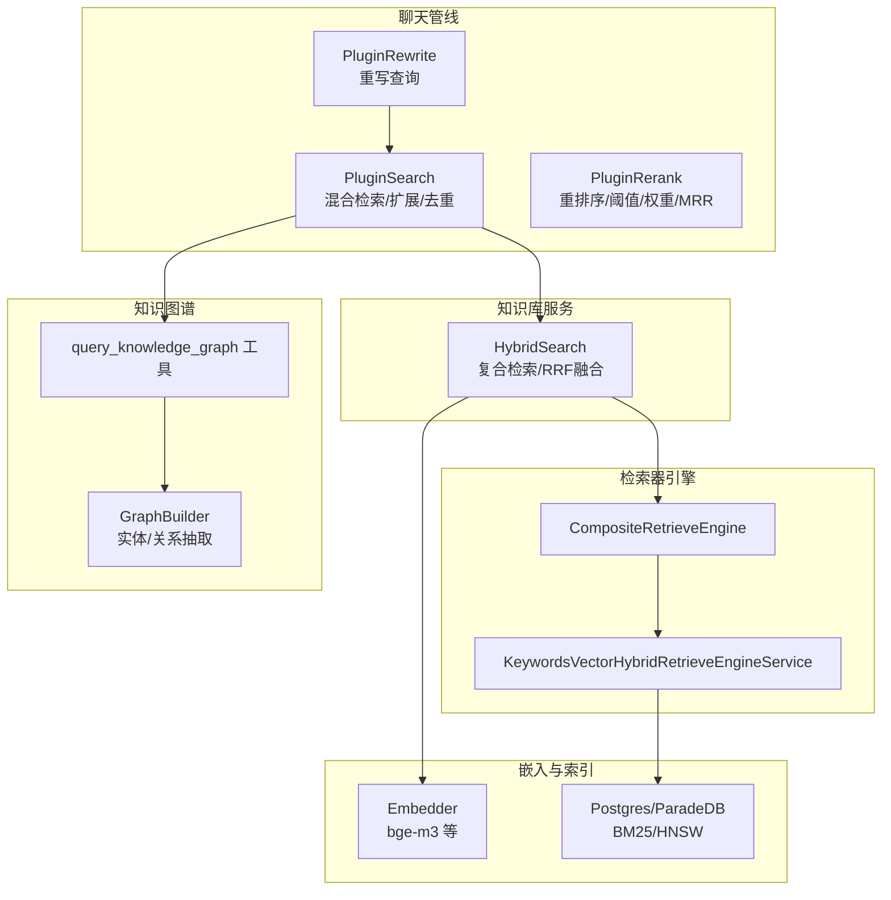
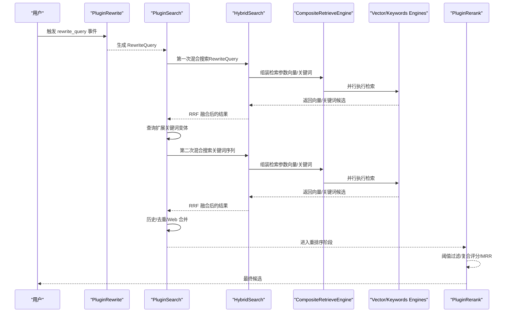
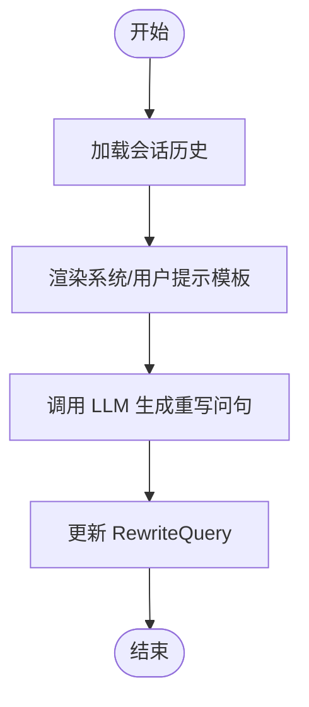
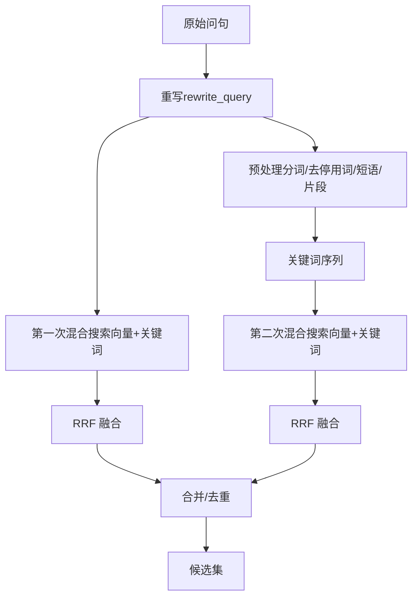
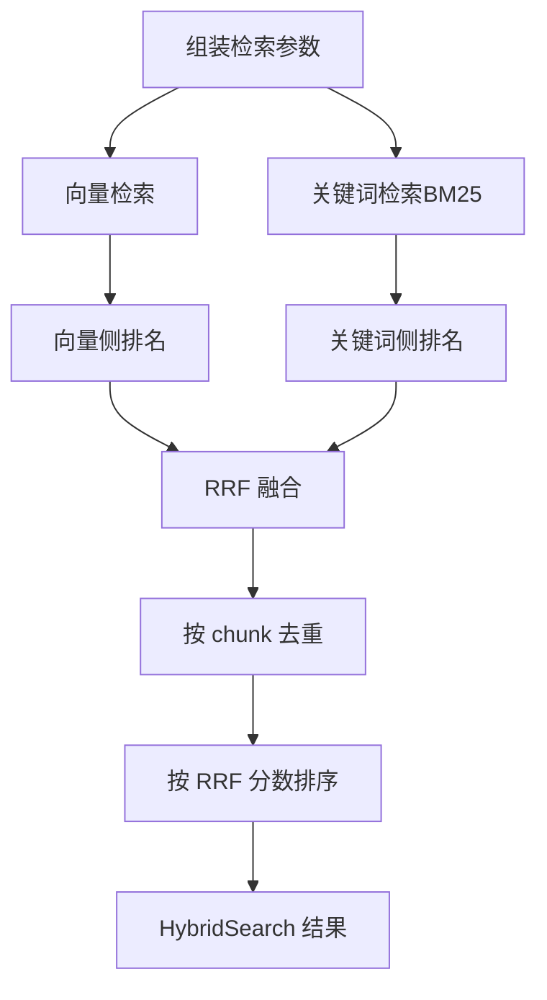
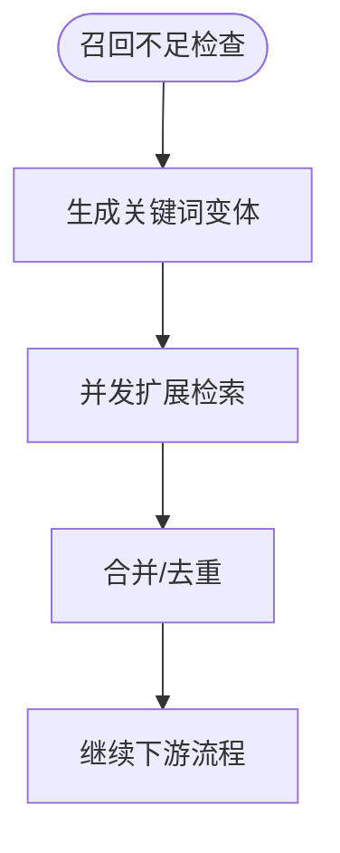
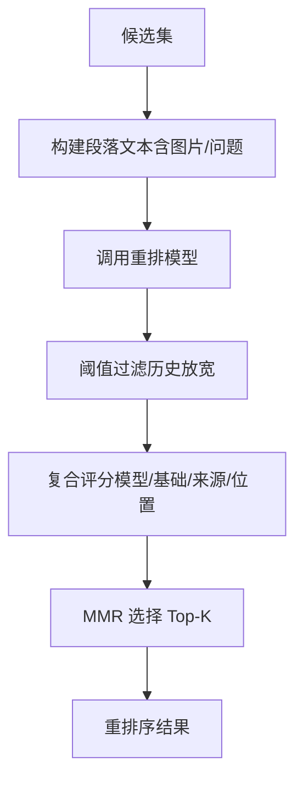
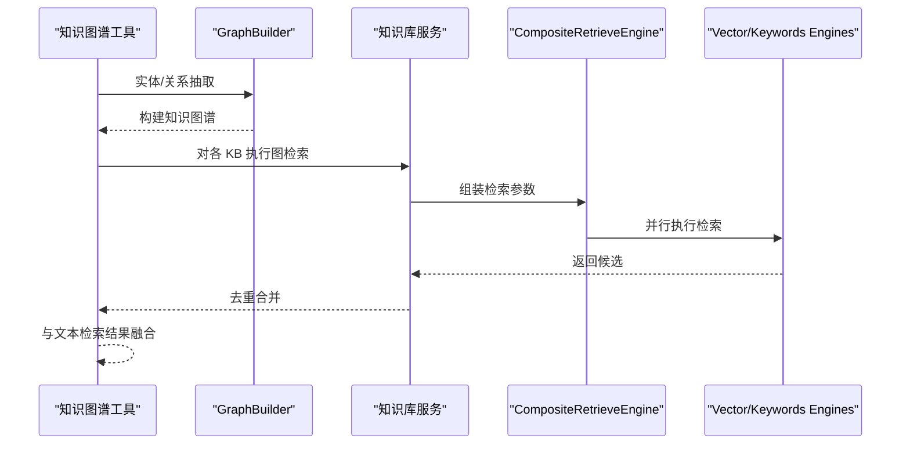
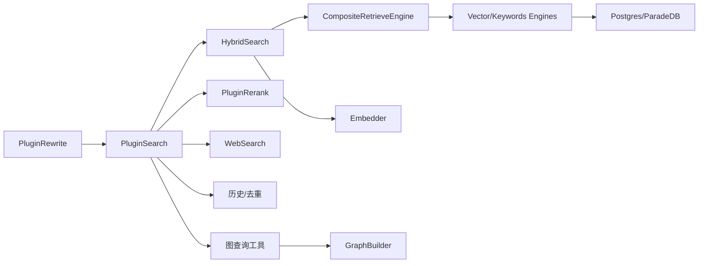

# 混合检索

<cite>
**本文引用的文件**
- [search.go](file://internal/application/service/chat_pipline/search.go)
- [rerank.go](file://internal/application/service/chat_pipline/rerank.go)
- [rewrite.go](file://internal/application/service/chat_pipline/rewrite.go)
- [knowledgebase.go](file://internal/application/service/knowledgebase.go)
- [keywords_vector_hybrid_indexer.go](file://internal/application/service/retriever/keywords_vector_hybrid_indexer.go)
- [composite.go](file://internal/application/service/retriever/composite.go)
- [retriever.go](file://internal/types/retriever.go)
- [embedder.go](file://internal/models/embedding/embedder.go)
- [00-init-db.sql](file://migrations/paradedb/00-init-db.sql)
- [Weknora.md](file://docs/Weknora.md)
- [KnowledgeGraph.md](file://docs/KnowledgeGraph.md)
- [graph.go](file://internal/application/service/graph.go)
- [query_knowledge_graph.go](file://internal/agent/tools/query_knowledge_graph.go)
- [knowledge_search.go](file://internal/agent/tools/knowledge_search.go)
</cite>

## 目录
1. [简介](#简介)
2. [项目结构](#项目结构)
3. [核心组件](#核心组件)
4. [架构总览](#架构总览)
5. [详细组件分析](#详细组件分析)
6. [依赖关系分析](#依赖关系分析)
7. [性能考量](#性能考量)
8. [故障排查指南](#故障排查指南)
9. [结论](#结论)
10. [附录](#附录)

## 简介
本文件围绕 WeKnora 的混合检索能力，系统性梳理“关键词检索（BM25）+ 向量检索（如 bge-m3）+ 知识图谱检索”的多路召回与融合流程。结合 WeKnora 的两次混合搜索说明，深入解释查询重写（rewrite_query）与查询预处理（preprocess_query）如何生成不同形式的查询语句以提升召回率；并详解 rerank.go 中重排序算法的作用、阈值与权重配置方式。最后给出检索策略调优指南，包括阈值设置、权重分配与性能监控要点。

## 项目结构
WeKnora 的检索链路横跨“聊天管线插件层”“知识库服务层”“检索器引擎层”“嵌入与索引层”“知识图谱层”等多个模块。其中：
- 聊天管线插件负责事件编排、查询扩展、Web 搜索、历史召回与去重；
- 知识库服务负责复合检索引擎装配、向量与关键词检索、RRF 融合；
- 检索器引擎层支持多种后端（Postgres/ParadeDB、Elasticsearch、Qdrant 等），并提供关键词（BM25）与向量（HNSW）能力；
- 嵌入模型负责文本向量化（如 bge-m3）；
- 知识图谱层负责实体/关系抽取与检索。

图表来源
- [search.go](file://internal/application/service/chat_pipline/search.go#L1-L240)
- [rerank.go](file://internal/application/service/chat_pipline/rerank.go#L1-L160)
- [rewrite.go](file://internal/application/service/chat_pipline/rewrite.go#L1-L120)
- [knowledgebase.go](file://internal/application/service/knowledgebase.go#L430-L629)
- [keywords_vector_hybrid_indexer.go](file://internal/application/service/retriever/keywords_vector_hybrid_indexer.go#L1-L120)
- [composite.go](file://internal/application/service/retriever/composite.go#L1-L120)
- [embedder.go](file://internal/models/embedding/embedder.go#L1-L49)
- [00-init-db.sql](file://migrations/paradedb/00-init-db.sql#L193-L215)
- [graph.go](file://internal/application/service/graph.go#L1-L120)
- [query_knowledge_graph.go](file://internal/agent/tools/query_knowledge_graph.go#L153-L204)

章节来源
- [search.go](file://internal/application/service/chat_pipline/search.go#L1-L240)
- [knowledgebase.go](file://internal/application/service/knowledgebase.go#L430-L629)
- [composite.go](file://internal/application/service/retriever/composite.go#L1-L120)
- [keywords_vector_hybrid_indexer.go](file://internal/application/service/retriever/keywords_vector_hybrid_indexer.go#L1-L120)
- [embedder.go](file://internal/models/embedding/embedder.go#L1-L49)
- [00-init-db.sql](file://migrations/paradedb/00-init-db.sql#L193-L215)
- [Weknora.md](file://docs/Weknora.md#L200-L231)

## 核心组件
- 查询重写（rewrite_query）：基于会话历史与 LLM，将原始问题改写为更精确的自然语言问句，提升向量与关键词检索的语义一致性。
- 查询预处理（preprocess_query）：将改写后的问句进行分词与清洗，生成关键词序列，用于第二次混合检索，提升关键词召回广度。
- 混合检索（向量+关键词）：同时执行向量相似度与关键词匹配，使用 Reciprocal Rank Fusion（RRF）融合结果，去重并排序。
- 查询扩展（Query Expansion）：在召回不足时，基于本地规则生成关键词变体，扩大关键词检索覆盖面。
- 重排序（Rerank）：使用重排模型对候选结果进行二次排序，结合阈值过滤、复合评分与 MMR，提升多样性与相关性。
- 知识图谱检索：在知识库开启实体/关系抽取后，通过图查询工具与图构建器进行实体/关系检索与融合。

章节来源
- [rewrite.go](file://internal/application/service/chat_pipline/rewrite.go#L1-L120)
- [search.go](file://internal/application/service/chat_pipline/search.go#L410-L561)
- [knowledgebase.go](file://internal/application/service/knowledgebase.go#L430-L629)
- [rerank.go](file://internal/application/service/chat_pipline/rerank.go#L1-L160)
- [query_knowledge_graph.go](file://internal/agent/tools/query_knowledge_graph.go#L153-L204)
- [graph.go](file://internal/application/service/graph.go#L1-L120)

## 架构总览
WeKnora 的检索链路遵循“两次混合搜索”的设计思想：第一次使用重写后的完整问句，第二次使用预处理后的关键词序列。两者均通过复合检索引擎并行执行向量与关键词检索，随后 RRF 融合、去重、合并历史与 Web 结果，最终进入重排序阶段。

图表来源
- [rewrite.go](file://internal/application/service/chat_pipline/rewrite.go#L1-L120)
- [search.go](file://internal/application/service/chat_pipline/search.go#L1-L240)
- [knowledgebase.go](file://internal/application/service/knowledgebase.go#L430-L629)
- [rerank.go](file://internal/application/service/chat_pipline/rerank.go#L1-L160)
- [Weknora.md](file://docs/Weknora.md#L200-L231)

## 详细组件分析

### 组件A：查询重写（rewrite_query）
- 功能：从会话历史中提取对话轮次，渲染系统/用户提示模板，调用 LLM 生成更精确的 RewriteQuery。
- 关键点：
  - 历史消息按时间倒序、截断至最大轮次；
  - 去除思考标记，避免噪声；
  - 温度、最大补全长度等参数可控。
- 输出：更新 ChatManage.RewriteQuery，供后续混合检索使用。

图表来源
- [rewrite.go](file://internal/application/service/chat_pipline/rewrite.go#L1-L120)

章节来源
- [rewrite.go](file://internal/application/service/chat_pipline/rewrite.go#L1-L120)

### 组件B：查询预处理（preprocess_query）与两次混合搜索
- 功能：将重写后的问句进行分词、去停用词、提取短语与片段，生成关键词序列；随后执行两次混合搜索（RewriteQuery 与关键词序列）。
- 关键点：
  - 第一次混合搜索：使用 RewriteQuery；
  - 第二次混合搜索：使用关键词序列；
  - 两次搜索均执行向量与关键词检索，RRF 融合，去重合并。
- 输出：合并后的候选集，供重排序阶段使用。

图表来源
- [search.go](file://internal/application/service/chat_pipline/search.go#L410-L561)
- [knowledgebase.go](file://internal/application/service/knowledgebase.go#L430-L629)
- [Weknora.md](file://docs/Weknora.md#L200-L231)

章节来源
- [search.go](file://internal/application/service/chat_pipline/search.go#L410-L561)
- [knowledgebase.go](file://internal/application/service/knowledgebase.go#L430-L629)
- [Weknora.md](file://docs/Weknora.md#L200-L231)

### 组件C：复合检索与 RRF 融合
- 功能：根据租户配置动态装配复合检索引擎，分别执行向量检索与关键词检索，随后对两组结果进行 RRF 融合，去重并排序。
- 关键点：
  - 向量检索：使用嵌入模型生成查询向量，按阈值与 TopK 返回；
  - 关键词检索：使用 BM25（Postgres/ParadeDB）进行关键词匹配；
  - RRF：对每个 chunk 计算其在向量与关键词侧的排名贡献，合并为最终分数；
  - 去重：按 chunk ID 去重，保留 RRF 后的排序。
- 输出：去重后的候选集，包含向量与关键词的综合得分。

图表来源
- [knowledgebase.go](file://internal/application/service/knowledgebase.go#L430-L629)
- [embedder.go](file://internal/models/embedding/embedder.go#L1-L49)
- [00-init-db.sql](file://migrations/paradedb/00-init-db.sql#L193-L215)

章节来源
- [knowledgebase.go](file://internal/application/service/knowledgebase.go#L430-L629)
- [embedder.go](file://internal/models/embedding/embedder.go#L1-L49)
- [00-init-db.sql](file://migrations/paradedb/00-init-db.sql#L193-L215)

### 组件D：查询扩展（Query Expansion）
- 功能：在召回不足时，基于本地规则生成关键词变体（去停用词、短语、最长片段、去除疑问词等），并以较低关键词阈值与更大 TopK 重新检索。
- 关键点：
  - 并发控制与信号量，限制扩展检索并发；
  - 扩展结果与主结果合并，去重后继续后续流程。
- 输出：扩展后的候选集，提升关键词召回。

图表来源
- [search.go](file://internal/application/service/chat_pipline/search.go#L165-L205)

章节来源
- [search.go](file://internal/application/service/chat_pipline/search.go#L165-L205)

### 组件E：重排序（Rerank）与阈值/权重/MRR
- 功能：对候选集进行重排，结合阈值过滤、复合评分与 MMR，提升最终相关性与多样性。
- 关键点：
  - 阈值降级：若无结果且阈值足够高，则降低阈值重试；
  - 复合评分：加权融合模型分数、基础分数与来源权重，位置优先项做平滑；
  - MMR：最大化相关性与最小冗余，控制 lambda 平衡相关性与多样性；
  - 历史匹配阈值下调：对历史命中放宽阈值，提升上下文利用。
- 输出：Top-K 重排后的最终候选集。

图表来源
- [rerank.go](file://internal/application/service/chat_pipline/rerank.go#L1-L160)
- [rerank.go](file://internal/application/service/chat_pipline/rerank.go#L160-L380)

章节来源
- [rerank.go](file://internal/application/service/chat_pipline/rerank.go#L1-L160)
- [rerank.go](file://internal/application/service/chat_pipline/rerank.go#L160-L380)

### 组件F：知识图谱检索
- 功能：在知识库开启实体/关系抽取后，通过图查询工具对各知识库执行图检索，合并去重后与文本检索结果融合。
- 关键点：
  - 图构建器基于 LLM 抽取实体与关系，计算权重与度数；
  - 图查询工具并发执行，收集结果并去重；
  - 与 HybridSearch 结果合并，提升语义连通性。
- 输出：融合后的候选集，增强跨块检索能力。

图表来源
- [query_knowledge_graph.go](file://internal/agent/tools/query_knowledge_graph.go#L153-L204)
- [graph.go](file://internal/application/service/graph.go#L1-L120)

章节来源
- [query_knowledge_graph.go](file://internal/agent/tools/query_knowledge_graph.go#L153-L204)
- [graph.go](file://internal/application/service/graph.go#L1-L120)
- [KnowledgeGraph.md](file://docs/KnowledgeGraph.md#L1-L29)

## 依赖关系分析
- 插件层依赖：
  - PluginRewrite 依赖模型服务与消息服务；
  - PluginSearch 依赖知识库服务、Web 搜索服务、会话服务；
  - PluginRerank 依赖模型服务与搜索工具。
- 检索层依赖：
  - HybridSearch 依赖复合检索引擎与嵌入模型；
  - 复合检索引擎根据租户配置装配不同后端（Postgres/ParadeDB、Elasticsearch、Qdrant 等）；
  - 关键词检索使用 BM25（Postgres/ParadeDB），向量检索使用 HNSW。
- 知识图谱依赖：
  - 图构建器依赖 LLM 与配置；
  - 图查询工具依赖知识库服务与图构建器。

图表来源
- [rewrite.go](file://internal/application/service/chat_pipline/rewrite.go#L1-L120)
- [search.go](file://internal/application/service/chat_pipline/search.go#L1-L240)
- [rerank.go](file://internal/application/service/chat_pipline/rerank.go#L1-L160)
- [knowledgebase.go](file://internal/application/service/knowledgebase.go#L430-L629)
- [composite.go](file://internal/application/service/retriever/composite.go#L1-L120)
- [embedder.go](file://internal/models/embedding/embedder.go#L1-L49)
- [00-init-db.sql](file://migrations/paradedb/00-init-db.sql#L193-L215)
- [query_knowledge_graph.go](file://internal/agent/tools/query_knowledge_graph.go#L153-L204)
- [graph.go](file://internal/application/service/graph.go#L1-L120)

章节来源
- [composite.go](file://internal/application/service/retriever/composite.go#L1-L120)
- [retriever.go](file://internal/types/retriever.go#L1-L89)
- [00-init-db.sql](file://migrations/paradedb/00-init-db.sql#L193-L215)

## 性能考量
- 并发与限流：
  - 搜索扩展阶段使用信号量限制并发作业数，避免资源争用；
  - 复合检索引擎并行执行向量与关键词检索，缩短总延迟。
- 向量化与索引：
  - Postgres/ParadeDB 的 BM25 索引与 HNSW 向量索引配合，兼顾关键词召回与语义近似；
  - 嵌入模型维度与批量池化有助于吞吐与稳定性。
- 重排与阈值：
  - 阈值降级策略在高阈值导致空结果时自动缓解，提升可用性；
  - MMR 控制冗余，避免重复信息主导 Top-K。
- 去重与合并：
  - 基于 chunk ID 与内容签名的去重策略，减少重复与冗余。

章节来源
- [search.go](file://internal/application/service/chat_pipline/search.go#L165-L205)
- [knowledgebase.go](file://internal/application/service/knowledgebase.go#L430-L629)
- [rerank.go](file://internal/application/service/chat_pipline/rerank.go#L1-L160)
- [embedder.go](file://internal/models/embedding/embedder.go#L1-L49)
- [00-init-db.sql](file://migrations/paradedb/00-init-db.sql#L193-L215)

## 故障排查指南
- 重写失败：
  - 检查历史拉取与模板渲染是否成功；
  - 确认模型服务可用与温度/最大补全参数合理。
- 混合检索无结果：
  - 检查租户配置的检索引擎类型与支持能力；
  - 核对向量与关键词阈值、TopK 设置；
  - 确认嵌入模型可用且维度匹配。
- 重排无结果或过少：
  - 观察阈值降级日志，适当降低阈值；
  - 检查复合评分权重与来源权重配置；
  - 调整 MMR 的 lambda 与 K。
- 知识图谱检索异常：
  - 检查图谱开关与配置；
  - 确认实体/关系抽取提示词与 LLM 输出格式正确；
  - 核对图查询工具的并发与去重逻辑。

章节来源
- [rewrite.go](file://internal/application/service/chat_pipline/rewrite.go#L1-L120)
- [search.go](file://internal/application/service/chat_pipline/search.go#L1-L240)
- [knowledgebase.go](file://internal/application/service/knowledgebase.go#L430-L629)
- [rerank.go](file://internal/application/service/chat_pipline/rerank.go#L1-L160)
- [query_knowledge_graph.go](file://internal/agent/tools/query_knowledge_graph.go#L153-L204)
- [graph.go](file://internal/application/service/graph.go#L1-L120)

## 结论
WeKnora 的混合检索通过“两次混合搜索 + RRF 融合 + 重排 + MMR”的闭环，实现了语义与关键词的互补召回，并在高阈值下具备阈值降级与查询扩展等容错策略。结合知识图谱检索，进一步增强了跨块与语义连通性。实际部署中，建议以阈值与权重为核心调优点，配合并发与索引优化，持续监控重排前后指标，逐步收敛到业务最优配置。

## 附录

### 检索策略调优指南
- 阈值设置
  - 向量阈值：根据嵌入质量与数据分布设定，过高会导致空结果，过低会引入噪声；
  - 关键词阈值：与向量阈值协同，第一次搜索偏保守，第二次搜索可略降；
  - 重排阈值：默认较高，若出现空结果可适度下调，必要时启用阈值降级。
- 权重分配
  - 复合评分中，模型分数、基础分数、来源权重与位置优先需结合业务目标权衡；
  - 历史命中放宽阈值，提升上下文利用。
- 多路召回与融合
  - 保持向量与关键词双通道，RRF 融合系数（k=60）稳定即可；
  - 查询扩展在召回不足时启用，注意并发与阈值调整。
- 性能监控
  - 关注检索耗时、重排耗时、阈值降级次数、去重前后数量变化；
  - 监控向量与关键词命中率、RRF 分数分布、MMR 冗余率。

章节来源
- [search.go](file://internal/application/service/chat_pipline/search.go#L1-L240)
- [rerank.go](file://internal/application/service/chat_pipline/rerank.go#L1-L160)
- [knowledgebase.go](file://internal/application/service/knowledgebase.go#L430-L629)
- [Weknora.md](file://docs/Weknora.md#L200-L231)