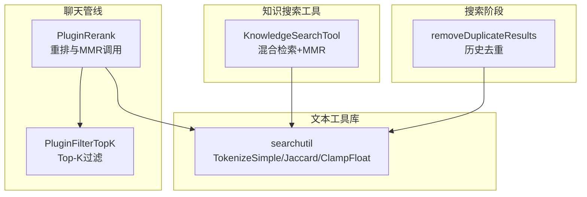
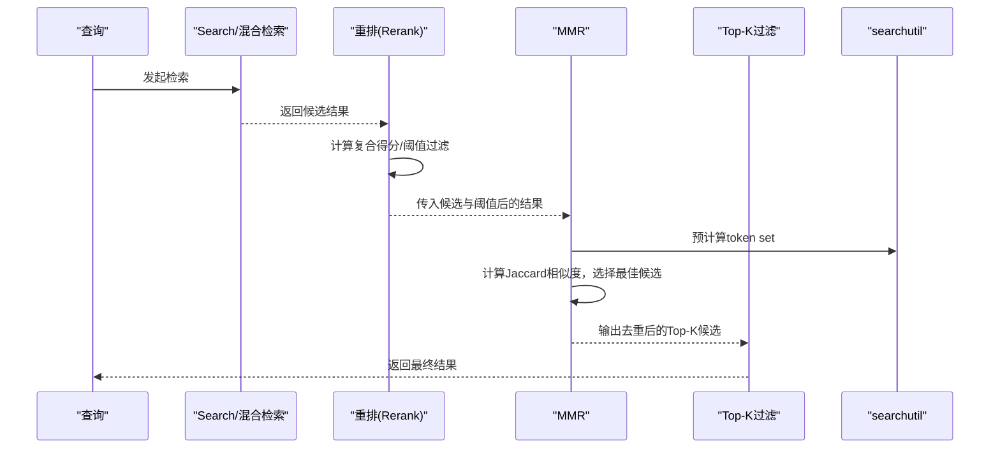
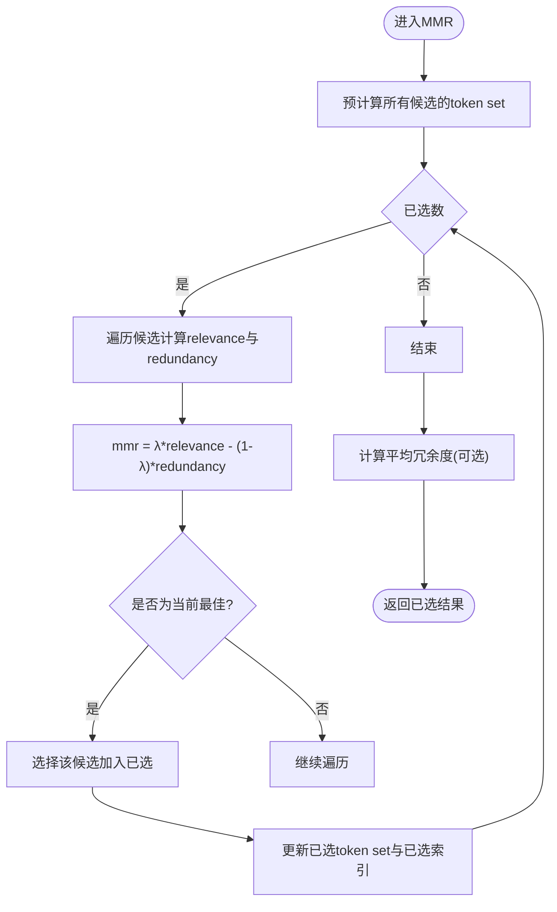
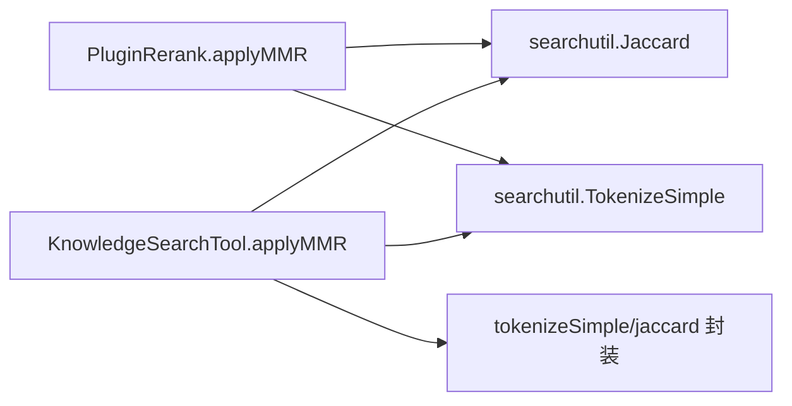

# 去重算法

<cite>
**本文引用的文件**
- [internal/application/service/chat_pipline/rerank.go](file://internal/application/service/chat_pipline/rerank.go)
- [internal/agent/tools/knowledge_search.go](file://internal/agent/tools/knowledge_search.go)
- [internal/searchutil/textutil.go](file://internal/searchutil/textutil.go)
- [internal/application/service/chat_pipline/filter_top_k.go](file://internal/application/service/chat_pipline/filter_top_k.go)
- [internal/application/service/chat_pipline/search.go](file://internal/application/service/chat_pipline/search.go)
</cite>

## 目录
1. [引言](#引言)
2. [项目结构](#项目结构)
3. [核心组件](#核心组件)
4. [架构总览](#架构总览)
5. [详细组件分析](#详细组件分析)
6. [依赖关系分析](#依赖关系分析)
7. [性能考量](#性能考量)
8. [故障排查指南](#故障排查指南)
9. [结论](#结论)
10. [附录](#附录)

## 引言
本技术文档聚焦于系统中的结果去重与多样性控制算法，围绕最大边际相关性（MMR）展开，解释其在重排序阶段如何通过“相关性”与“冗余度”之间的平衡，降低检索结果的重复与近似重复，从而提升最终返回结果的多样性与信息价值。文档将深入解析以下要点：
- MMR 的实现细节与流程
- lambda 参数的作用与调优建议
- 预计算 token set 的优化策略
- Jaccard 相似度在冗余度计算中的角色
- selectedIndices 与 selectedTokenSets 数据结构的设计考量
- 实践中的参数调优与效果评估

## 项目结构
与去重算法直接相关的核心位置包括：
- 检索后重排流水线：在聊天管线中对 rerank 结果执行 MMR
- 知识搜索工具：在工具层对混合检索结果应用 MMR
- 文本工具库：提供分词、Jaccard 相似度与数值裁剪等基础能力
- 过滤 Top-K 插件：在 MMR 后进一步限制输出数量
- 历史去重：在搜索阶段对历史结果进行去重

图表来源
- [internal/application/service/chat_pipline/rerank.go](file://internal/application/service/chat_pipline/rerank.go#L133-L158)
- [internal/application/service/chat_pipline/filter_top_k.go](file://internal/application/service/chat_pipline/filter_top_k.go#L19-L67)
- [internal/agent/tools/knowledge_search.go](file://internal/agent/tools/knowledge_search.go#L323-L348)
- [internal/searchutil/textutil.go](file://internal/searchutil/textutil.go#L23-L59)
- [internal/application/service/chat_pipline/search.go](file://internal/application/service/chat_pipline/search.go#L269-L305)

章节来源
- [internal/application/service/chat_pipline/rerank.go](file://internal/application/service/chat_pipline/rerank.go#L133-L158)
- [internal/application/service/chat_pipline/filter_top_k.go](file://internal/application/service/chat_pipline/filter_top_k.go#L19-L67)
- [internal/agent/tools/knowledge_search.go](file://internal/agent/tools/knowledge_search.go#L323-L348)
- [internal/searchutil/textutil.go](file://internal/searchutil/textutil.go#L23-L59)
- [internal/application/service/chat_pipline/search.go](file://internal/application/service/chat_pipline/search.go#L269-L305)

## 核心组件
- MMR 重排函数
  - 聊天管线版本：在 rerank 完成后调用，预计算所有候选的 token set，按 lambda 平衡相关性与冗余度，记录平均冗余度
  - 知识搜索工具版本：在 rerank 或 LLM rerank 后调用，同样预计算 token set，支持对已选集合的最大冗余度计算
- 文本工具库
  - TokenizeSimple：将文本切分为小写词集合（长度>1）
  - Jaccard：计算两集合的 Jaccard 相似度
  - ClampFloat：数值裁剪
- 历史去重与 Top-K 过滤
  - 历史去重：基于 ID、父块 ID、知识库+索引等键与内容签名去重
  - Top-K 过滤：在合并、重排或原始结果中保留前 K 项

章节来源
- [internal/application/service/chat_pipline/rerank.go](file://internal/application/service/chat_pipline/rerank.go#L239-L321)
- [internal/agent/tools/knowledge_search.go](file://internal/agent/tools/knowledge_search.go#L1237-L1312)
- [internal/searchutil/textutil.go](file://internal/searchutil/textutil.go#L23-L59)
- [internal/application/service/chat_pipline/search.go](file://internal/application/service/chat_pipline/search.go#L269-L305)
- [internal/application/service/chat_pipline/filter_top_k.go](file://internal/application/service/chat_pipline/filter_top_k.go#L19-L67)

## 架构总览
下图展示了从检索到去重的整体流程，以及 MMR 在其中的位置与依赖关系。

图表来源
- [internal/application/service/chat_pipline/rerank.go](file://internal/application/service/chat_pipline/rerank.go#L133-L158)
- [internal/application/service/chat_pipline/rerank.go](file://internal/application/service/chat_pipline/rerank.go#L239-L321)
- [internal/application/service/chat_pipline/filter_top_k.go](file://internal/application/service/chat_pipline/filter_top_k.go#L19-L67)
- [internal/searchutil/textutil.go](file://internal/searchutil/textutil.go#L23-L59)

## 详细组件分析

### MMR 算法实现与流程
- 关键点
  - 预计算：在开始选择前，对所有候选结果计算 token set，避免后续重复计算
  - 评分：对每个候选，计算 relevance（当前候选的得分）与 redundancy（与已选集合的最大 Jaccard 相似度）
  - 选择：最大化 lambda*relevance - (1-lambda)*redundancy 的候选
  - 收敛：当已选数量达到 k 或候选耗尽时停止
  - 冗余度评估：在最终阶段计算已选集合之间的平均 Jaccard 相似度，作为多样性指标

图表来源
- [internal/application/service/chat_pipline/rerank.go](file://internal/application/service/chat_pipline/rerank.go#L239-L321)
- [internal/agent/tools/knowledge_search.go](file://internal/agent/tools/knowledge_search.go#L1237-L1312)
- [internal/searchutil/textutil.go](file://internal/searchutil/textutil.go#L23-L59)

章节来源
- [internal/application/service/chat_pipline/rerank.go](file://internal/application/service/chat_pipline/rerank.go#L239-L321)
- [internal/agent/tools/knowledge_search.go](file://internal/agent/tools/knowledge_search.go#L1237-L1312)

### lambda 参数：相关性与多样性的平衡
- 作用
  - 控制 MMR 评分中“相关性”与“冗余度”的权重
  - 较大 lambda 更偏向高相关性但可能降低多样性；较小 lambda 更偏向多样性但可能牺牲相关性
- 默认值
  - 聊天管线：在调用处固定为 0.7
  - 知识搜索工具：在调用处固定为 0.7
- 调优建议
  - 高相关性优先：lambda 接近 1（如 0.8~0.9），适合问答、事实性检索
  - 多样性优先：lambda 接近 0（如 0.1~0.3），适合综述、主题覆盖
  - 平衡：lambda 0.6~0.8，适合大多数对话场景
  - 可根据下游指标（如平均冗余度、覆盖率、用户满意度）进行 A/B 测试微调

章节来源
- [internal/application/service/chat_pipline/rerank.go](file://internal/application/service/chat_pipline/rerank.go#L133-L158)
- [internal/agent/tools/knowledge_search.go](file://internal/agent/tools/knowledge_search.go#L323-L348)

### 预计算 token set 的优化策略
- 目标
  - 减少重复计算：在循环中多次计算 token set 与 Jaccard 相似度的成本
- 方案
  - 在开始选择前一次性计算所有候选的 token set
  - 在选择过程中仅维护已选集合的 token set，用于增量冗余度计算
- 效果
  - 时间复杂度从 O(k·n^2) 降至 O(k·n)，其中 k 为选择数，n 为候选数
  - 对大规模候选集显著降低延迟

章节来源
- [internal/application/service/chat_pipline/rerank.go](file://internal/application/service/chat_pipline/rerank.go#L256-L300)
- [internal/agent/tools/knowledge_search.go](file://internal/agent/tools/knowledge_search.go#L1255-L1289)

### Jaccard 相似度在冗余度计算中的作用
- 定义
  - Jaccard(A,B) = |A ∩ B| / |A ∪ B|，范围 [0,1]
- 在 MMR 中的应用
  - redundancy = max over已选集合 Jaccard(候选token, 已选token)
  - 通过最大化 mmr = λ*relevance - (1-λ)*redundancy，实现“高相关+低冗余”的选择
- 文本预处理
  - TokenizeSimple 将文本转为小写词集合，过滤短词，减少噪声与大小写影响
- 数值稳定性
  - 当两个集合均为空时返回 0，避免除零

章节来源
- [internal/searchutil/textutil.go](file://internal/searchutil/textutil.go#L23-L59)
- [internal/application/service/chat_pipline/rerank.go](file://internal/application/service/chat_pipline/rerank.go#L278-L284)
- [internal/agent/tools/knowledge_search.go](file://internal/agent/tools/knowledge_search.go#L1268-L1274)

### selectedIndices 与 selectedTokenSets 的设计考量
- selectedIndices
  - 类型：map[int]struct{}
  - 作用：快速判断候选索引是否已被选择，避免重复选择
  - 复杂度：O(1) 查找，整体减少无效遍历
- selectedTokenSets
  - 类型：[]map[string]struct{}
  - 作用：存储已选候选对应的 token set，用于增量冗余度计算
  - 优势：无需每次重新计算已选集合的 token set，降低重复计算
- 设计权衡
  - 空间换时间：额外存储已选 token set 与索引映射
  - 可扩展性：在大规模候选集上收益明显

章节来源
- [internal/application/service/chat_pipline/rerank.go](file://internal/application/service/chat_pipline/rerank.go#L262-L300)
- [internal/agent/tools/knowledge_search.go](file://internal/agent/tools/knowledge_search.go#L1251-L1289)

### 与历史去重及 Top-K 的协同
- 历史去重
  - 在搜索阶段对历史引用进行去重，减少重复来源带来的冗余
- Top-K 过滤
  - 在 MMR 后对结果进行截断，保证输出规模可控
- 协同效果
  - 先去重再 MMR，再 Top-K，形成“去重—多样性—规模”的三层保障

章节来源
- [internal/application/service/chat_pipline/search.go](file://internal/application/service/chat_pipline/search.go#L269-L305)
- [internal/application/service/chat_pipline/filter_top_k.go](file://internal/application/service/chat_pipline/filter_top_k.go#L19-L67)

## 依赖关系分析
- 组件耦合
  - 聊天管线的 MMR 依赖 searchutil 的 TokenizeSimple 与 Jaccard
  - 知识搜索工具的 MMR 同样依赖 searchutil，同时封装了 tokenizeSimple 与 jaccard 方法
- 外部接口
  - 重排模型/LLM 的输入由上游模块提供，MMR 仅做二次筛选与多样性控制
- 潜在风险
  - token set 预计算会增加内存占用，需结合候选规模与可用内存进行权衡
  - Jaccard 相似度对词粒度敏感，过短或过长的词可能影响多样性控制效果

图表来源
- [internal/application/service/chat_pipline/rerank.go](file://internal/application/service/chat_pipline/rerank.go#L239-L321)
- [internal/agent/tools/knowledge_search.go](file://internal/agent/tools/knowledge_search.go#L1237-L1312)
- [internal/searchutil/textutil.go](file://internal/searchutil/textutil.go#L23-L59)

章节来源
- [internal/application/service/chat_pipline/rerank.go](file://internal/application/service/chat_pipline/rerank.go#L239-L321)
- [internal/agent/tools/knowledge_search.go](file://internal/agent/tools/knowledge_search.go#L1237-L1312)
- [internal/searchutil/textutil.go](file://internal/searchutil/textutil.go#L23-L59)

## 性能考量
- 时间复杂度
  - 未优化：每轮选择需对所有候选计算与已选集合的 Jaccard，整体约 O(k·n^2)
  - 预计算优化：预存所有候选 token set，每轮仅比较与已选集合的最大相似度，整体约 O(k·n)
- 空间复杂度
  - 额外存储所有候选 token set 与已选 token set 列表
- 实践建议
  - 候选规模较大时启用预计算
  - 对超大规模候选，可考虑分批或采样策略
  - 合理设置 k，避免过度扩大已选集合导致冗余度计算成本上升

## 故障排查指南
- MMR 无输出或输出为空
  - 检查候选数量与 k 是否合理
  - 检查 lambda 设置是否极端（如接近 0 或 1），导致选择困难
  - 检查阈值过滤是否将结果全部筛掉
- 冗余度过高
  - 适当降低 lambda，提高多样性权重
  - 检查 TokenizeSimple 的词粒度是否合适（过短词易导致相似度偏高）
- 性能异常
  - 候选规模过大时启用预计算
  - 检查是否存在重复 token set 计算或不必要的字符串拼接

章节来源
- [internal/application/service/chat_pipline/rerank.go](file://internal/application/service/chat_pipline/rerank.go#L133-L158)
- [internal/application/service/chat_pipline/rerank.go](file://internal/application/service/chat_pipline/rerank.go#L239-L321)
- [internal/agent/tools/knowledge_search.go](file://internal/agent/tools/knowledge_search.go#L323-L348)

## 结论
MMR 在本系统中承担“在高相关性基础上提升多样性”的关键角色。通过预计算 token set、Jaccard 相似度与合理的 lambda 调优，能够在保持检索质量的同时有效降低冗余，提升最终结果的多样性与用户体验。配合历史去重与 Top-K 过滤，形成了从源头到输出的多层保障机制。

## 附录
- 关键实现路径参考
  - 聊天管线 MMR：[applyMMR](file://internal/application/service/chat_pipline/rerank.go#L239-L321)
  - 知识搜索工具 MMR：[applyMMR](file://internal/agent/tools/knowledge_search.go#L1237-L1312)
  - 文本工具库：[TokenizeSimple/Jaccard](file://internal/searchutil/textutil.go#L23-L59)
  - 历史去重：[removeDuplicateResults](file://internal/application/service/chat_pipline/search.go#L269-L305)
  - Top-K 过滤：[PluginFilterTopK](file://internal/application/service/chat_pipline/filter_top_k.go#L19-L67)