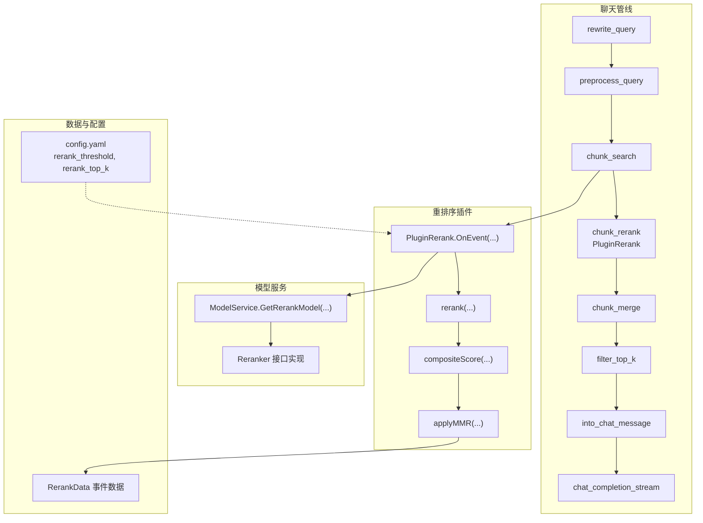
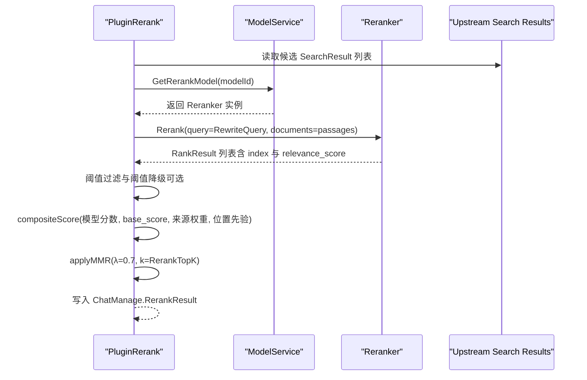
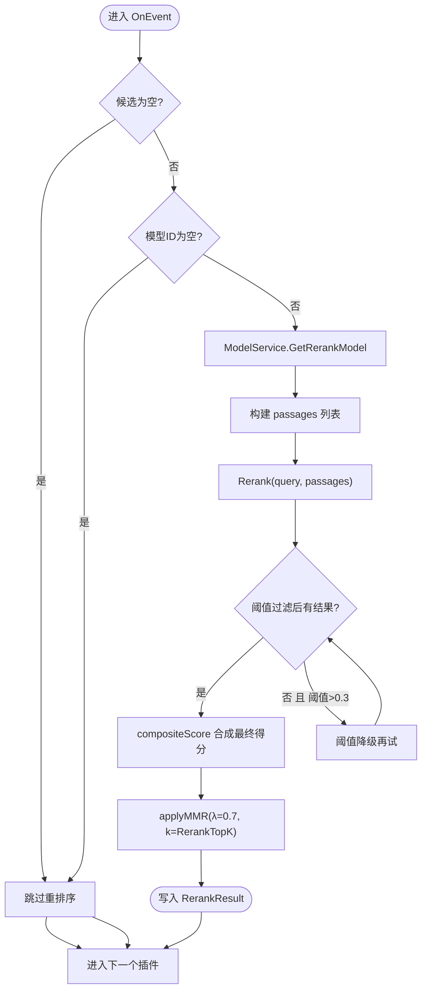
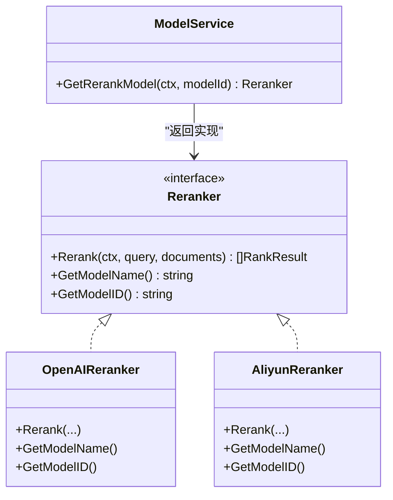
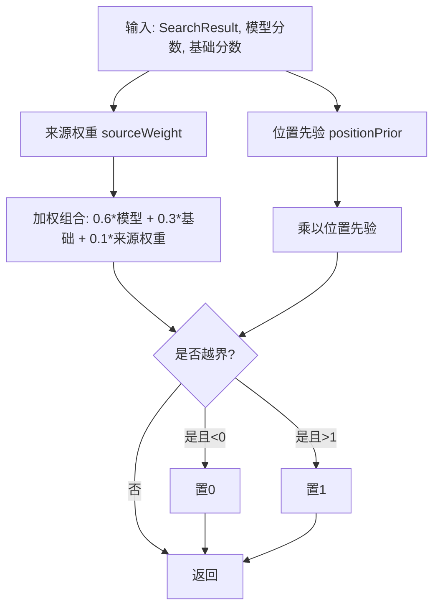
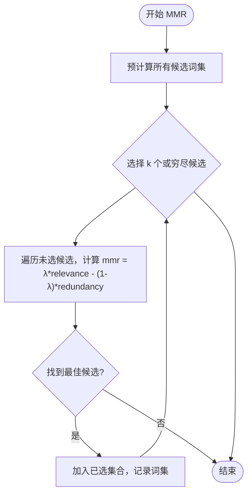
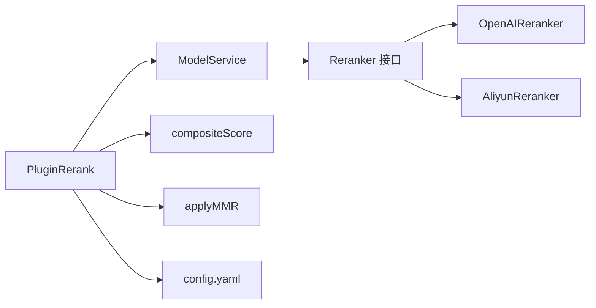

# 结果重排序

<cite>
**本文引用的文件**
- [rerank.go](file://internal/application/service/chat_pipline/rerank.go)
- [model.go](file://internal/application/service/model.go)
- [reranker.go](file://internal/models/rerank/reranker.go)
- [aliyun_reranker.go](file://internal/models/rerank/aliyun_reranker.go)
- [remote_api.go](file://internal/models/rerank/remote_api.go)
- [WeKnora.md](file://docs/Weknora.md)
- [config.yaml](file://config/config.yaml)
- [session.go](file://internal/application/service/session.go)
- [event_data.go](file://internal/event/event_data.go)
- [knowledge_search.go](file://internal/agent/tools/knowledge_search.go)
</cite>

## 目录
1. [简介](#简介)
2. [项目结构](#项目结构)
3. [核心组件](#核心组件)
4. [架构总览](#架构总览)
5. [详细组件分析](#详细组件分析)
6. [依赖关系分析](#依赖关系分析)
7. [性能考量](#性能考量)
8. [故障排查指南](#故障排查指南)
9. [结论](#结论)
10. [附录](#附录)

## 简介
本文件围绕 WeKnora 的结果重排序机制展开，聚焦于插件式重排序组件 PluginRerank 的实现与行为，解释其如何调用 ModelService 获取指定的重排序模型（如 bge-reranker），如何将改写后的查询（RewriteQuery）与候选知识块（passages）送入模型进行相关性重打分；随后阐述 compositeScore 函数如何融合重排序模型分数、原始检索分数（base_score）、来源权重（sourceWeight）与位置先验（positionPrior）生成综合得分；最后说明 applyMMR 算法如何在重排序后进一步降低冗余，提升多样性。文档还结合 WeKnora.md 中对不同 Reranker 类型（常规、基于 LLM、分层）的分析，给出模型选型与 RerankThreshold 参数配置建议。

## 项目结构
重排序机制位于聊天管线的“chunk_rerank”事件阶段，由 PluginRerank 插件负责执行。其上游通过 ModelService 获取重排序模型实例，下游将重排序结果经 MMR 再次筛选，最终进入 Top-K 过滤与生成阶段。

图表来源
- [rerank.go](file://internal/application/service/chat_pipline/rerank.go#L35-L175)
- [model.go](file://internal/application/service/model.go#L268-L300)
- [reranker.go](file://internal/models/rerank/reranker.go#L1-L100)
- [config.yaml](file://config/config.yaml#L1-L649)
- [event_data.go](file://internal/event/event_data.go#L27-L47)

章节来源
- [rerank.go](file://internal/application/service/chat_pipline/rerank.go#L35-L175)
- [model.go](file://internal/application/service/model.go#L268-L300)
- [reranker.go](file://internal/models/rerank/reranker.go#L1-L100)
- [config.yaml](file://config/config.yaml#L1-L649)
- [event_data.go](file://internal/event/event_data.go#L27-L47)

## 核心组件
- PluginRerank：聊天管线的重排序插件，负责拉取重排序模型、准备候选文本、调用模型、阈值过滤、合成最终得分、应用 MMR 并输出结果。
- ModelService：统一的模型服务，按模型 ID 获取重排序模型实例，内部根据 BaseURL 自动选择具体实现（阿里云或远程 API）。
- Reranker 接口与实现：定义统一的重排序接口，提供 OpenAI 风格远程 API 与阿里云 DashScope API 的实现。
- compositeScore：将重排序模型分数、原始检索分数、来源权重与位置先验进行加权融合，得到最终综合得分。
- applyMMR：在重排序后基于最大边际相关性（Maximal Marginal Relevance）减少冗余，提升多样性。

章节来源
- [rerank.go](file://internal/application/service/chat_pipline/rerank.go#L16-L33)
- [model.go](file://internal/application/service/model.go#L268-L300)
- [reranker.go](file://internal/models/rerank/reranker.go#L1-L100)
- [remote_api.go](file://internal/models/rerank/remote_api.go#L1-L122)
- [aliyun_reranker.go](file://internal/models/rerank/aliyun_reranker.go#L1-L164)

## 架构总览
重排序在聊天管线中作为独立事件执行，其核心流程如下：
- 输入：改写后的查询（RewriteQuery）、候选知识块（SearchResult 列表）。
- 模型获取：通过 ModelService.GetRerankModel 根据模型 ID 获取 Reranker 实例。
- 单次调用：将 RewriteQuery 与所有候选文本一次性送入模型，获得相关性分数。
- 阈值过滤：按 RerankThreshold 过滤，必要时进行阈值降级再试。
- 综合评分：compositeScore 融合模型分数与 base_score，并引入来源权重与位置先验。
- 多样性控制：applyMMR 基于 Jaccard 相似度最大化相关性、最小化冗余。
- 输出：写入 ChatManage.RerankResult，供后续 Top-K 与生成使用。

图表来源
- [rerank.go](file://internal/application/service/chat_pipline/rerank.go#L35-L175)
- [model.go](file://internal/application/service/model.go#L268-L300)
- [reranker.go](file://internal/models/rerank/reranker.go#L1-L100)

## 详细组件分析

### PluginRerank 插件
- 事件激活：仅在 CHUNK_RERANK 事件触发。
- 输入校验：空候选或模型 ID 缺失时直接跳过。
- 模型获取：通过 ModelService.GetRerankModel 获取 Reranker 实例。
- 候选准备：将每个 SearchResult 的内容与增强信息（图片描述、OCR、生成问题等）合并为“passage”。
- 单次调用：将 RewriteQuery 与所有 passages 一次性送入模型，避免 N 次独立调用。
- 阈值降级：若首次过滤无结果且阈值较高，则按比例降低阈值再试，再恢复原阈值。
- 评分与输出：记录输入分数、输出复合分数、Top-N 概览；最终写入 RerankResult。

图表来源
- [rerank.go](file://internal/application/service/chat_pipline/rerank.go#L35-L175)

章节来源
- [rerank.go](file://internal/application/service/chat_pipline/rerank.go#L35-L175)

### ModelService 与 Reranker 选择
- ModelService.GetRerankModel：根据模型 ID 获取模型配置，构造 RerankerConfig 并调用 rerank.NewReranker。
- 新建策略：根据 BaseURL 是否包含阿里云 DashScope 的重排服务地址，自动选择 AliyunReranker 或 OpenAIReranker。
- 远程 API：OpenAIReranker 通过 HTTP POST /rerank 发送查询与文档列表，解析标准响应结构。
- 阿里云 API：AliyunReranker 通过 HTTP POST 调用 DashScope 文本重排服务，解析输出并映射为统一 RankResult。

图表来源
- [model.go](file://internal/application/service/model.go#L268-L300)
- [reranker.go](file://internal/models/rerank/reranker.go#L1-L100)
- [remote_api.go](file://internal/models/rerank/remote_api.go#L1-L122)
- [aliyun_reranker.go](file://internal/models/rerank/aliyun_reranker.go#L1-L164)

章节来源
- [model.go](file://internal/application/service/model.go#L268-L300)
- [reranker.go](file://internal/models/rerank/reranker.go#L1-L100)
- [remote_api.go](file://internal/models/rerank/remote_api.go#L1-L122)
- [aliyun_reranker.go](file://internal/models/rerank/aliyun_reranker.go#L1-L164)

### compositeScore 综合评分
- 来源权重（sourceWeight）：对 web_search 来源给予轻微折扣，其他来源默认权重为 1.0。
- 位置先验（positionPrior）：对文档早期片段给予小幅正向偏置，幅度受 clamp 控制，避免过度偏向。
- 加权融合：对模型分数（0.6）、基础检索分数（0.3）、来源权重（0.1）进行加权求和，并乘以位置先验。
- 归一化：最终得分限制在 [0, 1]。

图表来源
- [rerank.go](file://internal/application/service/chat_pipline/rerank.go#L215-L237)

章节来源
- [rerank.go](file://internal/application/service/chat_pipline/rerank.go#L215-L237)

### applyMMR 多样性控制
- 目标：在重排序后的候选中，最大化相关性（relevance）同时最小化冗余（redundancy）。
- 策略：使用 Jaccard 相似度衡量候选与已选集合的最大相似度，以 λ*relevance - (1-λ)*redundancy 作为选择指标。
- 优化：预先计算所有候选的词集，避免重复分词；最终统计平均冗余，便于评估多样性。

图表来源
- [rerank.go](file://internal/application/service/chat_pipline/rerank.go#L239-L321)

章节来源
- [rerank.go](file://internal/application/service/chat_pipline/rerank.go#L239-L321)

### 与知识搜索工具的对比
知识搜索工具（工具模式）实现了类似的 compositeScore 与 applyMMR，但略有差异：
- 来源权重：web_search 来源权重为 0.95。
- 位置先验：clamp 范围与公式一致，但 clampFloat 由工具内部实现。
- MMR：同样基于词集与 Jaccard 相似度，但实现细节略有不同。

章节来源
- [knowledge_search.go](file://internal/agent/tools/knowledge_search.go#L1181-L1230)
- [knowledge_search.go](file://internal/agent/tools/knowledge_search.go#L1221-L1312)

## 依赖关系分析
- PluginRerank 依赖 ModelService 获取 Reranker 实例。
- Reranker 实现依赖 HTTP 客户端与 JSON 解析，统一返回 RankResult。
- compositeScore 与 applyMMR 依赖 searchutil 的分词与相似度计算工具。
- 配置来源于 config.yaml，包括 rerank_threshold 与 rerank_top_k。

图表来源
- [rerank.go](file://internal/application/service/chat_pipline/rerank.go#L35-L175)
- [model.go](file://internal/application/service/model.go#L268-L300)
- [reranker.go](file://internal/models/rerank/reranker.go#L1-L100)
- [config.yaml](file://config/config.yaml#L1-L649)

章节来源
- [rerank.go](file://internal/application/service/chat_pipline/rerank.go#L35-L175)
- [model.go](file://internal/application/service/model.go#L268-L300)
- [reranker.go](file://internal/models/rerank/reranker.go#L1-L100)
- [config.yaml](file://config/config.yaml#L1-L649)

## 性能考量
- 单次调用：PluginRerank 将 RewriteQuery 与所有 passages 一次性送入模型，避免多次往返，显著降低延迟。
- 阈值降级：在无结果且阈值较高时进行比例降级再试，兼顾召回与稳定性。
- MMR 预计算：预先计算所有候选词集，避免重复分词，提升 MMR 选择效率。
- 来源与位置先验：通过轻量级加权与 clamp，避免复杂计算，同时改善排序公平性。

[本节为通用指导，无需列出具体文件来源]

## 故障排查指南
- 模型获取失败：检查模型 ID 是否正确，以及 ModelService.GetRerankModel 的日志错误信息。
- 模型调用异常：查看 rerank 调用阶段的日志，确认 BaseURL 与 API Key 配置是否正确。
- 无结果输出：确认 RerankThreshold 是否过高；可适当提高阈值或启用阈值降级逻辑。
- 事件数据：RerankData 记录了输入候选数、输出结果数、模型 ID、阈值与耗时，可用于定位问题。

章节来源
- [rerank.go](file://internal/application/service/chat_pipline/rerank.go#L35-L175)
- [event_data.go](file://internal/event/event_data.go#L27-L47)

## 结论
PluginRerank 通过“单次调用 + 阈值降级 + 综合评分 + MMR 多样性控制”的组合，实现了高效、稳健且多样化的重排序流程。配合合理的模型选型与阈值配置，可在保证检索质量的同时提升最终答案的准确性与可读性。

[本节为总结性内容，无需列出具体文件来源]

## 附录

### 模型选型与 RerankThreshold 配置建议
- 模型选型（参考 WeKnora.md）：
  - 常规重排器（交叉编码器）：如 BAAI/bge-reranker-v2-m3，速度快、精度高，适合大多数生产场景。
  - 基于 LLM 的重排器：如 BAAI/bge-reranker-v2-gemma，适合需要更强语义推理的复杂查询，但计算成本更高。
  - 基于 LLM 分层信息的重排器：如 BAAI/bge-reranker-v2-minicpm-layerwise，理论上精度更高，但实现复杂、成本最高。
- RerankThreshold 配置：
  - 初始阈值可参考配置文件中的默认值（如 0.5），结合业务召回与精度需求逐步调整。
  - 若出现“无结果”或召回不足，可适度下调阈值；若出现噪声较多，可适当上调。
  - 阈值降级策略已在插件中内置，可减少人工干预。

章节来源
- [WeKnora.md](file://docs/Weknora.md#L234-L299)
- [config.yaml](file://config/config.yaml#L1-L649)
- [rerank.go](file://internal/application/service/chat_pipline/rerank.go#L69-L102)

### 与会话默认配置的衔接
- 会话服务在初始化 ChatManage 时，会从配置中读取 rerank_top_k 与 rerank_threshold，并尝试自动绑定第一个可用的重排模型 ID。

章节来源
- [session.go](file://internal/application/service/session.go#L768-L807)