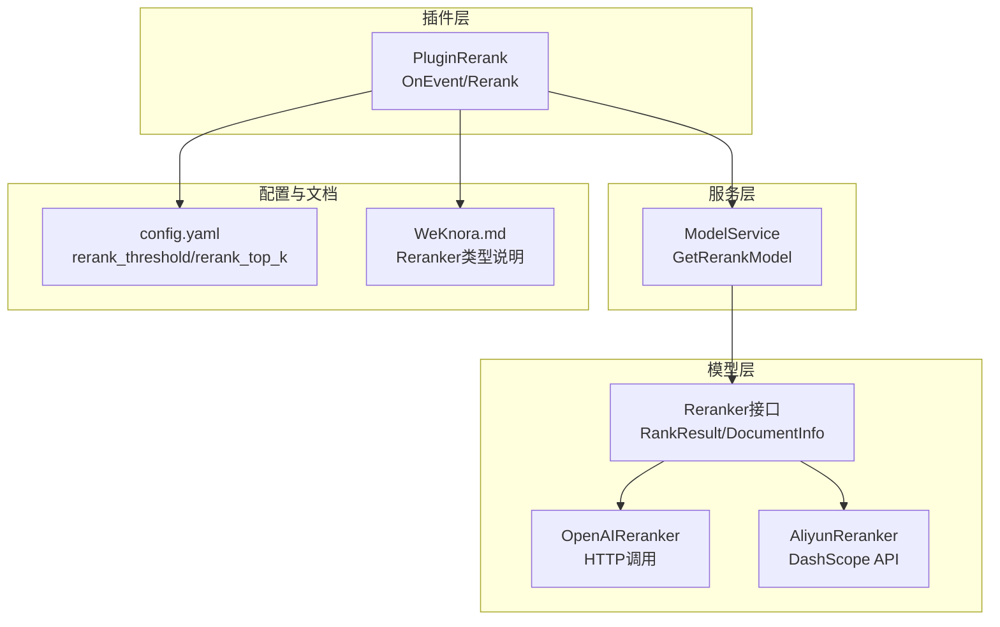
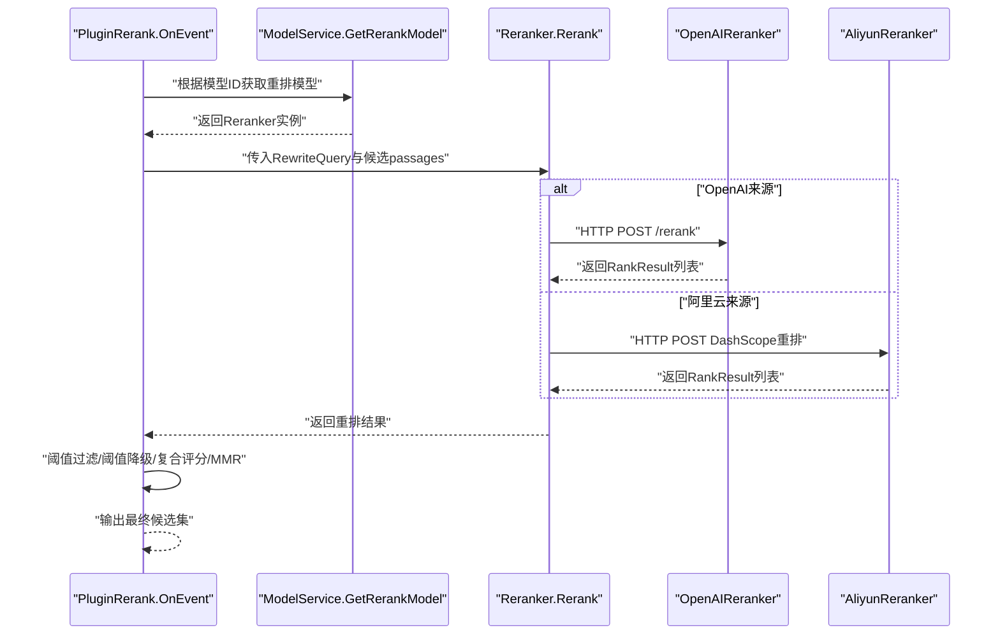
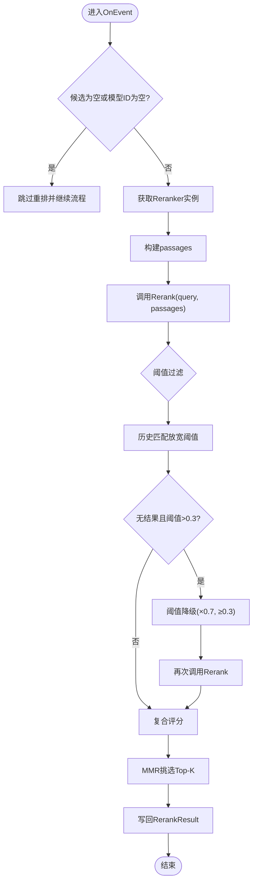
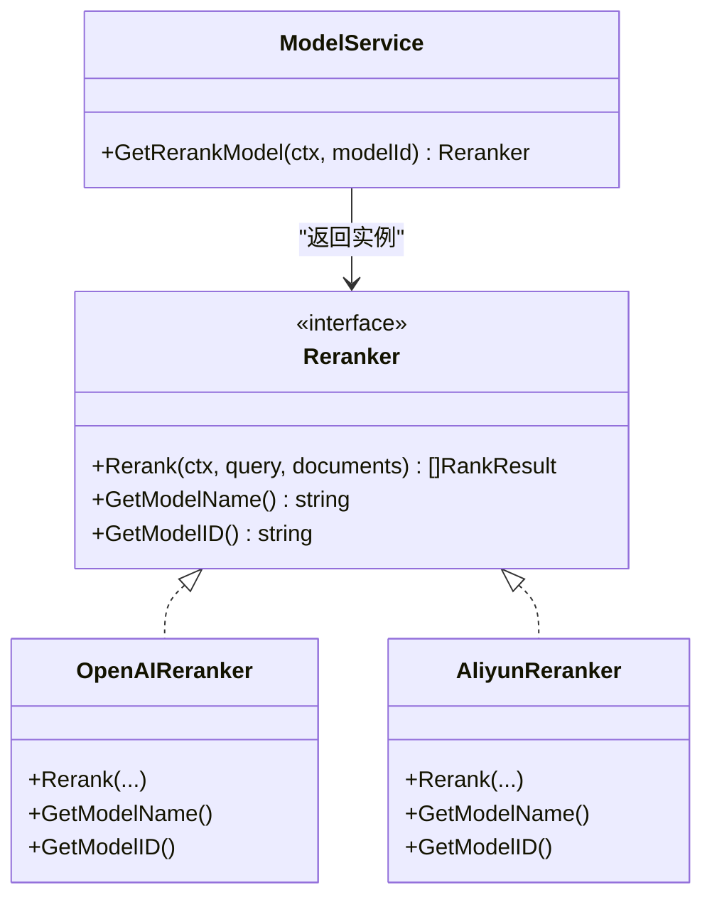
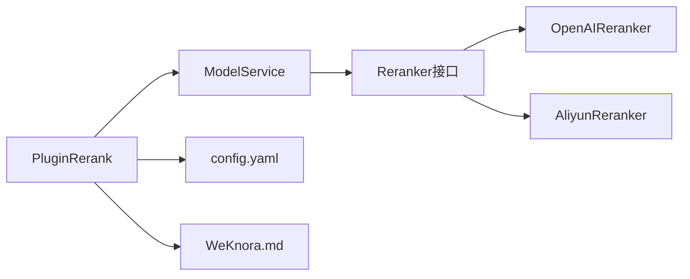

# 重排序模型

<cite>
**本文引用的文件**
- [rerank.go](file://internal/models/rerank/reranker.go)
- [remote_api.go](file://internal/models/rerank/remote_api.go)
- [aliyun_reranker.go](file://internal/models/rerank/aliyun_reranker.go)
- [model.go](file://internal/application/service/model.go)
- [model.go（接口）](file://internal/types/interfaces/model.go)
- [rerank.go（插件）](file://internal/application/service/chat_pipline/rerank.go)
- [event_data.go](file://internal/event/event_data.go)
- [initialization.go](file://internal/handler/initialization.go)
- [config.yaml](file://config/config.yaml)
- [WeKnora.md](file://docs/Weknora.md)
- [rerank_server_demo.py](file://rerank_server_demo.py)
</cite>

## 目录
1. [简介](#简介)
2. [项目结构](#项目结构)
3. [核心组件](#核心组件)
4. [架构总览](#架构总览)
5. [详细组件分析](#详细组件分析)
6. [依赖关系分析](#依赖关系分析)
7. [性能考量](#性能考量)
8. [故障排查指南](#故障排查指南)
9. [结论](#结论)
10. [附录](#附录)

## 简介
本文聚焦于WeKnora系统中的重排序（Rerank）机制，系统通过插件化的方式在检索管线中引入重排序步骤，使用指定的重排序模型对初步检索结果进行精细化打分，随后结合阈值过滤与多样性（MMR）策略，输出最终的候选片段，用于后续的生成与回答。本文将详细解释：
- PluginRerank如何通过ModelService接口获取指定的重排序模型（如bge-reranker），并调用其Rerank方法对候选知识块进行重打分；
- Rerank方法如何将RewriteQuery与所有候选知识块（passages）一同送入模型进行相关性重打分；
- 结合WeKnora.md中对常规、基于LLM、分层三种Reranker类型的分析，说明不同类型模型的工作原理与适用场景；
- 系统如何处理模型调用失败、响应为空等异常情况；
- 模型选型与RerankThreshold参数配置的最佳实践建议。

## 项目结构
围绕重排序的关键代码分布在以下模块：
- 模型接口与实现：定义Reranker接口、标准RankResult结构、OpenAI与阿里云重排实现；
- 模型服务：通过ModelService.GetRerankModel获取并初始化具体Reranker实例；
- 插件管线：PluginRerank在CHAT PIPELINE中消费RewriteQuery与候选片段，调用Rerank并进行阈值过滤与MMR；
- 配置与文档：默认阈值、Top-K、重排开关等配置；WeKnora.md对三类Reranker的说明；
- 初始化校验：提供重排模型连通性检测接口，便于前端配置校验。

图表来源
- [rerank.go](file://internal/models/rerank/reranker.go#L1-L100)
- [remote_api.go](file://internal/models/rerank/remote_api.go#L1-L122)
- [aliyun_reranker.go](file://internal/models/rerank/aliyun_reranker.go#L1-L165)
- [model.go](file://internal/application/service/model.go#L268-L351)
- [rerank.go（插件）](file://internal/application/service/chat_pipline/rerank.go#L1-L380)
- [config.yaml](file://config/config.yaml#L1-L60)
- [WeKnora.md](file://docs/Weknora.md#L234-L299)

章节来源
- [rerank.go](file://internal/models/rerank/reranker.go#L1-L100)
- [model.go](file://internal/application/service/model.go#L268-L351)
- [rerank.go（插件）](file://internal/application/service/chat_pipline/rerank.go#L1-L380)
- [config.yaml](file://config/config.yaml#L1-L60)
- [WeKnora.md](file://docs/Weknora.md#L234-L299)

## 核心组件
- Reranker接口与结果结构
  - Reranker接口定义Rerank(query, documents)与模型标识方法；
  - RankResult包含Index、Document、RelevanceScore，支持兼容旧版score字段；
  - DocumentInfo支持字符串或对象两种序列化格式。
- OpenAI重排实现
  - 通过HTTP POST调用指定BaseURL/rerank，封装请求体与响应解析；
  - 返回标准RankResult列表。
- 阿里云重排实现
  - 通过DashScope文本重排服务，构造AliyunRerankRequest并解析AliyunRerankResponse；
  - 将结果映射为标准RankResult。
- 模型服务
  - ModelService.GetRerankModel根据模型ID获取模型配置，构造Reranker实例；
  - NewReranker根据BaseURL判断来源，选择OpenAI或阿里云实现。
- 插件Rerank
  - 在CHAT PIPELINE中消费RewriteQuery与候选片段，调用Rerank；
  - 进行阈值过滤（含历史匹配特例）、阈值降级重试、复合评分与MMR；
  - 输出最终候选集供后续生成。

章节来源
- [rerank.go](file://internal/models/rerank/reranker.go#L1-L100)
- [remote_api.go](file://internal/models/rerank/remote_api.go#L1-L122)
- [aliyun_reranker.go](file://internal/models/rerank/aliyun_reranker.go#L1-L165)
- [model.go](file://internal/application/service/model.go#L268-L351)
- [rerank.go（插件）](file://internal/application/service/chat_pipline/rerank.go#L1-L380)

## 架构总览
下面的序列图展示了从插件到模型服务再到具体重排实现的调用链路，以及重排后的评分与过滤流程。

图表来源
- [rerank.go（插件）](file://internal/application/service/chat_pipline/rerank.go#L35-L205)
- [model.go](file://internal/application/service/model.go#L268-L351)
- [remote_api.go](file://internal/models/rerank/remote_api.go#L62-L122)
- [aliyun_reranker.go](file://internal/models/rerank/aliyun_reranker.go#L87-L154)

## 详细组件分析

### PluginRerank：重排序插件
- 输入与前置条件
  - 从ChatManage读取RewriteQuery、候选SearchResult、RerankModelID、RerankThreshold、RerankTopK等；
  - 若候选为空或模型ID为空，则跳过重排。
- 获取模型
  - 通过ModelService.GetRerankModel获取Reranker实例。
- 构建passages
  - 将每个SearchResult的Content、ImageInfo、ChunkMetadata中的GeneratedQuestions等信息合并为passage文本。
- 单次重排调用
  - 调用rerankModel.Rerank(query, passages)，记录模型调用日志与Top-N分数。
- 阈值过滤与降级
  - 基于RerankThreshold过滤；
  - 对历史匹配类型放宽阈值；
  - 若无结果且阈值较高，尝试阈值降级（乘以0.7，不低于0.3），再次调用Rerank。
- 复合评分与MMR
  - 为每个候选计算复合分数（融合模型分数、基础检索分数、来源权重、位置优先因子）；
  - 使用MMR在候选集中挑选Top-K，减少冗余。
- 输出
  - 将最终候选集写回ChatManage.RerankResult，若为空则返回“无结果”错误。

图表来源
- [rerank.go（插件）](file://internal/application/service/chat_pipline/rerank.go#L35-L205)
- [rerank.go（插件）](file://internal/application/service/chat_pipline/rerank.go#L215-L321)

章节来源
- [rerank.go（插件）](file://internal/application/service/chat_pipline/rerank.go#L35-L205)
- [rerank.go（插件）](file://internal/application/service/chat_pipline/rerank.go#L215-L321)

### ModelService：模型服务
- GetRerankModel
  - 通过模型ID获取模型配置（含BaseURL、APIKey、Name、Source等）；
  - 调用NewReranker根据BaseURL判断来源，返回OpenAI或阿里云实现；
  - 记录初始化日志与错误。
- NewReranker
  - 若BaseURL包含DashScope重排路径，则创建AliyunReranker；
  - 否则创建OpenAIReranker。

图表来源
- [model.go](file://internal/application/service/model.go#L268-L351)
- [rerank.go](file://internal/models/rerank/reranker.go#L1-L100)
- [remote_api.go](file://internal/models/rerank/remote_api.go#L1-L122)
- [aliyun_reranker.go](file://internal/models/rerank/aliyun_reranker.go#L1-L165)

章节来源
- [model.go](file://internal/application/service/model.go#L268-L351)
- [rerank.go](file://internal/models/rerank/reranker.go#L1-L100)

### Reranker接口与实现
- 接口与结果
  - RankResult支持RelevanceScore与旧版score字段的兼容解析；
  - DocumentInfo支持字符串或对象两种格式。
- OpenAI实现
  - 构造RerankRequest（包含model、query、documents、truncate等），POST到BaseURL/rerank；
  - 解析RerankResponse.Results为RankResult列表。
- 阿里云实现
  - 构造AliyunRerankRequest，调用DashScope重排服务；
  - 解析AliyunRerankResponse.Output.Results为RankResult列表。

章节来源
- [rerank.go](file://internal/models/rerank/reranker.go#L1-L100)
- [remote_api.go](file://internal/models/rerank/remote_api.go#L1-L122)
- [aliyun_reranker.go](file://internal/models/rerank/aliyun_reranker.go#L1-L165)

### 重排类型与适用场景（基于WeKnora.md）
- 常规重排器（交叉编码器）
  - 工作原理：将Query与Passage拼接后送入双向编码器，计算细粒度交互，输出单一分数；
  - 特点：准确度高，但速度较慢（需对每个“Query-Passage”对单独计算）。
- 基于LLM的重排器
  - 工作原理：将排序任务转化为Yes/No预测，利用LLM最后生成“Yes”的概率作为分数；
  - 特点：可利用LLM的推理与世界知识，计算开销较大，依赖Prompt设计。
- 基于LLM分层信息的重排器
  - 工作原理：从LLM多个中间层提取“Yes”的预测Logit，进行组合；
  - 特点：理论上信号更丰富，精度更高，复杂度与计算开销最大。

章节来源
- [WeKnora.md](file://docs/Weknora.md#L234-L299)

### 阈值与Top-K配置
- 默认阈值与Top-K
  - config.yaml中提供默认rerank_threshold与rerank_top_k；
  - 前端界面提供rerank_threshold滑块与rerank_top_k输入框，支持保存。
- 历史匹配放宽
  - 对历史匹配类型的候选，阈值会适当放宽（与历史匹配特例一致）。
- 阈值降级
  - 当无结果且阈值较高时，系统会自动尝试阈值降级（乘以0.7，不低于0.3），再次调用重排。

章节来源
- [config.yaml](file://config/config.yaml#L1-L60)
- [rerank.go（插件）](file://internal/application/service/chat_pipline/rerank.go#L80-L102)
- [rerank.go（插件）](file://internal/application/service/chat_pipline/rerank.go#L192-L205)

### 初始化与连通性检测
- 初始化Handler提供重排模型连通性检测接口，构造Reranker并调用Rerank进行最小化测试，返回是否可用与结果数量。
- 前端提供检查按钮，调用初始化接口进行连通性与功能测试。

章节来源
- [initialization.go](file://internal/handler/initialization.go#L1491-L1537)
- [rerank_server_demo.py](file://rerank_server_demo.py#L1-L102)

## 依赖关系分析
- 插件依赖ModelService获取Reranker实例；
- Reranker接口由OpenAI与阿里云实现共同满足；
- 插件内部依赖阈值过滤、复合评分与MMR算法；
- 配置来源于config.yaml，前端提供可视化配置入口；
- 文档WeKnora.md提供Reranker类型与选型建议。

图表来源
- [rerank.go（插件）](file://internal/application/service/chat_pipline/rerank.go#L1-L380)
- [model.go](file://internal/application/service/model.go#L268-L351)
- [rerank.go](file://internal/models/rerank/reranker.go#L1-L100)
- [config.yaml](file://config/config.yaml#L1-L60)
- [WeKnora.md](file://docs/Weknora.md#L234-L299)

章节来源
- [rerank.go（插件）](file://internal/application/service/chat_pipline/rerank.go#L1-L380)
- [model.go](file://internal/application/service/model.go#L268-L351)
- [rerank.go](file://internal/models/rerank/reranker.go#L1-L100)
- [config.yaml](file://config/config.yaml#L1-L60)
- [WeKnora.md](file://docs/Weknora.md#L234-L299)

## 性能考量
- 重排成本
  - 常规重排器对每个候选均需独立计算，计算量与候选数量线性相关；
  - 基于LLM的重排器计算开销更大，且受Prompt设计影响；
  - 分层重排器需要多层输出，开销最大。
- 优化策略
  - 控制候选规模：通过向量与关键词混合检索后，先做Top-K合并与过滤；
  - 合理设置阈值：避免过高的阈值导致频繁阈值降级；
  - 复合评分与MMR：在重排后进行多样性控制，减少冗余，提升最终回答质量；
  - 选择合适模型：在准确度与延迟间权衡，优先选择适合生产环境的常规重排器。

[本节为通用指导，无需列出具体文件来源]

## 故障排查指南
- 模型获取失败
  - 现象：插件日志记录“get_model”错误；
  - 排查：确认模型ID是否存在、模型配置（BaseURL、APIKey、Name、Source）是否正确；
  - 参考：ModelService.GetRerankModel与NewReranker的错误路径。
- 模型调用失败
  - 现象：插件日志记录“model_call”错误；
  - 排查：检查网络连通性、API密钥、BaseURL是否正确、服务端返回状态码；
  - 参考：OpenAIReranker与AliyunReranker的HTTP请求与错误处理。
- 响应为空或无结果
  - 现象：重排后候选为空；
  - 排查：检查阈值是否过高、是否触发阈值降级、历史匹配放宽是否生效；
  - 参考：阈值过滤与阈值降级逻辑。
- 初始化连通性检测
  - 使用初始化接口对重排模型进行最小化测试，确认可用性与返回结果数量；
  - 参考：初始化Handler的checkRerankModelConnection与前端检查接口。

章节来源
- [rerank.go（插件）](file://internal/application/service/chat_pipline/rerank.go#L35-L205)
- [remote_api.go](file://internal/models/rerank/remote_api.go#L72-L122)
- [aliyun_reranker.go](file://internal/models/rerank/aliyun_reranker.go#L87-L154)
- [initialization.go](file://internal/handler/initialization.go#L1491-L1537)

## 结论
- PluginRerank通过ModelService获取指定的Reranker实例，将RewriteQuery与候选passages送入模型进行相关性重打分；
- 系统在重排后进行阈值过滤、阈值降级、复合评分与MMR，最终输出高质量候选集；
- WeKnora.md提供了三类Reranker的原理与适用场景，有助于在准确度与性能之间做出合理选型；
- 配置层面，建议结合默认阈值与Top-K，结合业务场景逐步调优；
- 出错时，优先检查模型配置、网络连通性与阈值设置，利用初始化检测接口快速定位问题。

[本节为总结性内容，无需列出具体文件来源]

## 附录

### bge-reranker模型的使用建议
- 选型建议
  - 初期优先使用常规重排器（交叉编码器），如BAAI系列，兼顾准确度与性能；
  - 若对复杂推理与语义理解有更高要求，可评估基于LLM的重排器；
  - 追求极限性能时，可评估分层重排器，但需承担更高的复杂度与开销。
- 配置要点
  - 在ModelService中配置BaseURL与APIKey；
  - 在config.yaml中设置合理的rerank_threshold与rerank_top_k；
  - 通过初始化接口进行连通性与功能测试，确保模型可用。

章节来源
- [WeKnora.md](file://docs/Weknora.md#L234-L299)
- [config.yaml](file://config/config.yaml#L1-L60)
- [initialization.go](file://internal/handler/initialization.go#L1491-L1537)