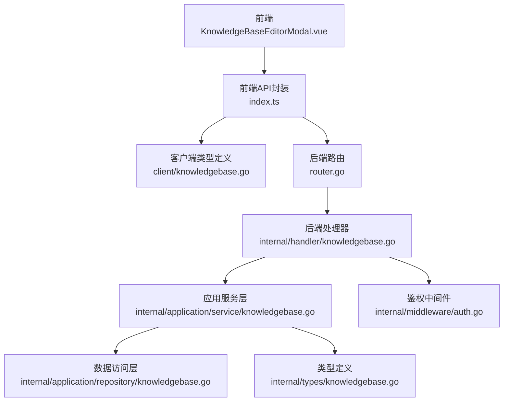
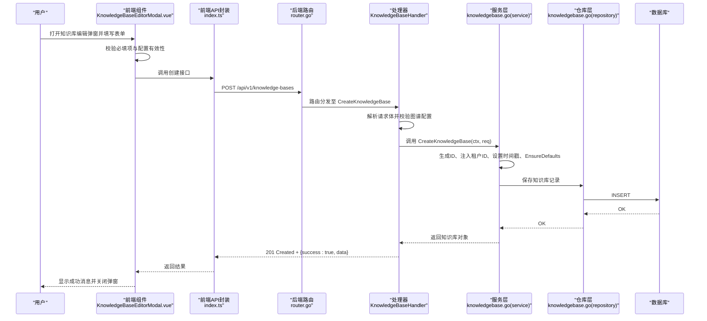
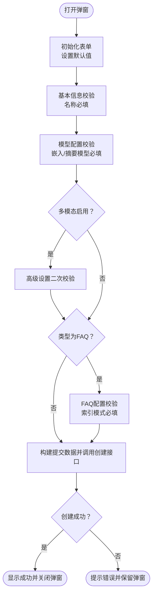
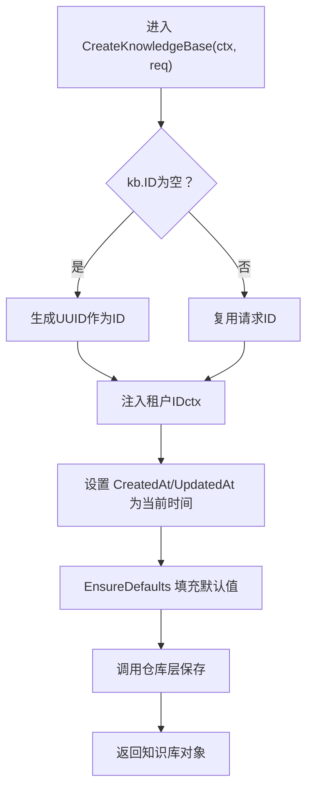
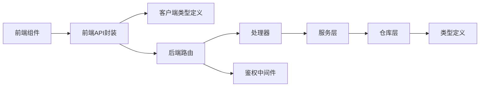

# 知识库创建

<cite>
**本文引用的文件**
- [KnowledgeBaseEditorModal.vue](file://frontend/src/views/knowledge/KnowledgeBaseEditorModal.vue)
- [index.ts](file://frontend/src/api/knowledge-base/index.ts)
- [knowledgebase.go](file://client/knowledgebase.go)
- [knowledgebase.go](file://internal/handler/knowledgebase.go)
- [knowledgebase.go](file://internal/application/service/knowledgebase.go)
- [knowledgebase.go](file://internal/application/repository/knowledgebase.go)
- [knowledgebase.go](file://internal/types/knowledgebase.go)
- [router.go](file://internal/router/router.go)
- [auth.go](file://internal/middleware/auth.go)
</cite>

## 目录
1. [简介](#简介)
2. [项目结构](#项目结构)
3. [核心组件](#核心组件)
4. [架构总览](#架构总览)
5. [详细组件分析](#详细组件分析)
6. [依赖关系分析](#依赖关系分析)
7. [性能考量](#性能考量)
8. [故障排查指南](#故障排查指南)
9. [结论](#结论)

## 简介
本文档面向需要通过前端界面创建“知识库”的用户与开发者，系统性说明：
- 如何在前端界面中创建两种类型的知识库：文档型与FAQ型
- 前端表单字段（名称、描述、类型、模型配置、分块设置、图谱设置、高级设置、FAQ配置等）的填写与校验
- 后端服务在创建过程中的ID生成、租户关联、时间戳设置、默认值填充与错误处理
- API调用与数据验证流程的实际示例路径
- 常见错误场景（空ID、数据库约束冲突、权限不足等）的处理机制

## 项目结构
围绕“知识库创建”的关键文件分布如下：
- 前端：知识库编辑弹窗组件负责收集与校验表单，并调用API完成创建
- 前端API封装：统一暴露创建、查询、更新、删除等接口
- 客户端类型定义：前后端一致的数据结构
- 后端路由：注册知识库相关HTTP路由
- 后端处理器：解析请求、参数校验、调用服务层
- 应用服务层：业务逻辑（ID生成、租户注入、时间戳、默认值、持久化）
- 数据访问层：GORM仓库实现
- 类型定义：知识库实体、配置、枚举等

图表来源
- [KnowledgeBaseEditorModal.vue](file://frontend/src/views/knowledge/KnowledgeBaseEditorModal.vue#L1-L200)
- [index.ts](file://frontend/src/api/knowledge-base/index.ts#L1-L60)
- [knowledgebase.go](file://client/knowledgebase.go#L1-L120)
- [router.go](file://internal/router/router.go#L176-L196)
- [knowledgebase.go](file://internal/handler/knowledgebase.go#L71-L105)
- [knowledgebase.go](file://internal/application/service/knowledgebase.go#L66-L91)
- [knowledgebase.go](file://internal/application/repository/knowledgebase.go#L24-L39)
- [knowledgebase.go](file://internal/types/knowledgebase.go#L38-L84)
- [auth.go](file://internal/middleware/auth.go#L161-L196)

章节来源
- [KnowledgeBaseEditorModal.vue](file://frontend/src/views/knowledge/KnowledgeBaseEditorModal.vue#L1-L200)
- [index.ts](file://frontend/src/api/knowledge-base/index.ts#L1-L60)
- [knowledgebase.go](file://client/knowledgebase.go#L1-L120)
- [router.go](file://internal/router/router.go#L176-L196)

## 核心组件
- 前端知识库编辑弹窗组件：负责收集表单、执行字段校验、构建提交数据、调用API并处理结果
- 前端API封装：统一暴露创建、查询、更新、删除等接口
- 客户端类型定义：前后端一致的知识库结构体与配置
- 后端路由：注册知识库相关HTTP路由
- 后端处理器：解析请求体、参数校验、调用服务层
- 应用服务层：生成ID、注入租户、设置时间戳、填充默认值、持久化
- 数据访问层：GORM仓库实现
- 类型定义：知识库实体、配置、枚举与默认值策略
- 鉴权中间件：从请求头提取租户信息并注入上下文

章节来源
- [KnowledgeBaseEditorModal.vue](file://frontend/src/views/knowledge/KnowledgeBaseEditorModal.vue#L432-L549)
- [index.ts](file://frontend/src/api/knowledge-base/index.ts#L1-L40)
- [knowledgebase.go](file://client/knowledgebase.go#L1-L120)
- [router.go](file://internal/router/router.go#L176-L196)
- [knowledgebase.go](file://internal/handler/knowledgebase.go#L71-L105)
- [knowledgebase.go](file://internal/application/service/knowledgebase.go#L66-L91)
- [knowledgebase.go](file://internal/application/repository/knowledgebase.go#L24-L39)
- [knowledgebase.go](file://internal/types/knowledgebase.go#L304-L348)
- [auth.go](file://internal/middleware/auth.go#L161-L196)

## 架构总览
从前端到后端的完整调用链路如下：

图表来源
- [KnowledgeBaseEditorModal.vue](file://frontend/src/views/knowledge/KnowledgeBaseEditorModal.vue#L552-L644)
- [index.ts](file://frontend/src/api/knowledge-base/index.ts#L1-L40)
- [router.go](file://internal/router/router.go#L176-L196)
- [knowledgebase.go](file://internal/handler/knowledgebase.go#L71-L105)
- [knowledgebase.go](file://internal/application/service/knowledgebase.go#L66-L91)
- [knowledgebase.go](file://internal/application/repository/knowledgebase.go#L24-L39)

## 详细组件分析

### 前端：知识库编辑弹窗（创建流程）
- 支持两种类型：文档型与FAQ型
- 基本信息页：名称、描述、类型（创建时不可更改）、类型说明提示
- 模型配置页：必须配置嵌入模型与摘要模型
- 文档型专属页：分块设置、知识图谱设置、高级设置（多模态、问题生成）
- FAQ型专属页：FAQ索引模式、问题索引模式
- 表单校验：
  - 名称必填
  - 嵌入模型与摘要模型必填
  - 多模态启用时需通过高级设置组件进行二次校验
  - FAQ类型需选择索引模式
- 提交流程：
  - 构建提交数据（包含名称、描述、类型、分块配置、模型ID、多模态配置、图谱配置、问题生成配置、FAQ配置）
  - 调用创建接口，成功后返回知识库ID并触发成功回调

图表来源
- [KnowledgeBaseEditorModal.vue](file://frontend/src/views/knowledge/KnowledgeBaseEditorModal.vue#L432-L549)
- [KnowledgeBaseEditorModal.vue](file://frontend/src/views/knowledge/KnowledgeBaseEditorModal.vue#L552-L644)

章节来源
- [KnowledgeBaseEditorModal.vue](file://frontend/src/views/knowledge/KnowledgeBaseEditorModal.vue#L36-L160)
- [KnowledgeBaseEditorModal.vue](file://frontend/src/views/knowledge/KnowledgeBaseEditorModal.vue#L432-L549)
- [KnowledgeBaseEditorModal.vue](file://frontend/src/views/knowledge/KnowledgeBaseEditorModal.vue#L552-L644)

### 前端API封装与调用
- 创建知识库：POST /api/v1/knowledge-bases
- 查询知识库详情：GET /api/v1/knowledge-bases/{id}
- 更新知识库：PUT /api/v1/knowledge-bases/{id}
- 删除知识库：DELETE /api/v1/knowledge-bases/{id}
- 复制知识库：POST /api/v1/knowledge-bases/copy

章节来源
- [index.ts](file://frontend/src/api/knowledge-base/index.ts#L1-L40)

### 客户端类型定义（前后端一致）
- 知识库结构体：包含ID、名称、类型、描述、租户ID、配置（分块、图像处理、FAQ、嵌入模型ID、摘要模型ID、VLM配置、存储配置、图谱抽取配置、问题生成配置）、时间戳等
- 配置类型：ChunkingConfig、FAQConfig、VLMConfig、StorageConfig、ExtractConfig、QuestionGenerationConfig

章节来源
- [knowledgebase.go](file://client/knowledgebase.go#L1-L120)

### 后端路由与处理器
- 路由注册：/api/v1/knowledge-bases 对应创建、列表、详情、更新、删除、混合搜索、复制
- 处理器职责：
  - 创建：解析请求体、校验图谱配置、调用服务层创建
  - 更新：校验租户权限、解析请求体、调用服务层更新
  - 列表/详情：按租户过滤、返回数据
  - 删除：删除前清理资源（嵌入、分块、文件、图谱）
  - 混合搜索：组合向量与关键词检索
  - 复制：异步克隆知识库

章节来源
- [router.go](file://internal/router/router.go#L176-L196)
- [knowledgebase.go](file://internal/handler/knowledgebase.go#L71-L105)
- [knowledgebase.go](file://internal/handler/knowledgebase.go#L147-L223)
- [knowledgebase.go](file://internal/handler/knowledgebase.go#L225-L253)
- [knowledgebase.go](file://internal/handler/knowledgebase.go#L255-L284)

### 应用服务层：创建逻辑与默认值
- ID生成：若请求未提供ID，则使用UUID生成
- 租户注入：从上下文读取租户ID并写入知识库
- 时间戳：创建与更新均设置当前时间
- 默认值填充：EnsureDefaults确保类型与FAQ配置的默认值
- 持久化：调用仓库层保存

图表来源
- [knowledgebase.go](file://internal/application/service/knowledgebase.go#L66-L91)
- [knowledgebase.go](file://internal/types/knowledgebase.go#L304-L348)

章节来源
- [knowledgebase.go](file://internal/application/service/knowledgebase.go#L66-L91)
- [knowledgebase.go](file://internal/types/knowledgebase.go#L304-L348)

### 数据访问层：仓库实现
- CreateKnowledgeBase：INSERT
- GetKnowledgeBaseByID：WHERE id
- ListKnowledgeBasesByTenantID：按租户过滤
- UpdateKnowledgeBase：SAVE
- DeleteKnowledgeBase：DELETE

章节来源
- [knowledgebase.go](file://internal/application/repository/knowledgebase.go#L24-L71)

### 类型定义与默认值策略
- 知识库实体：ID、名称、类型、描述、租户ID、各配置字段、时间戳
- FAQ配置默认值：当类型为FAQ且配置为空时，自动填充默认索引模式与问题索引模式
- 多模态判断：新旧配置兼容判断

章节来源
- [knowledgebase.go](file://internal/types/knowledgebase.go#L38-L84)
- [knowledgebase.go](file://internal/types/knowledgebase.go#L281-L303)
- [knowledgebase.go](file://internal/types/knowledgebase.go#L304-L348)

### 鉴权与租户上下文
- 鉴权中间件从请求头提取租户信息，校验API Key并注入上下文
- 处理器在更新/删除/查询时从上下文读取租户ID并校验权限

章节来源
- [auth.go](file://internal/middleware/auth.go#L161-L196)
- [knowledgebase.go](file://internal/handler/knowledgebase.go#L107-L145)

## 依赖关系分析
- 前端组件依赖API封装与国际化文案
- API封装依赖客户端类型定义
- 后端路由依赖处理器
- 处理器依赖服务层
- 服务层依赖仓库层与类型定义
- 鉴权中间件贯穿所有知识库相关路由

图表来源
- [KnowledgeBaseEditorModal.vue](file://frontend/src/views/knowledge/KnowledgeBaseEditorModal.vue#L172-L183)
- [index.ts](file://frontend/src/api/knowledge-base/index.ts#L1-L40)
- [knowledgebase.go](file://client/knowledgebase.go#L1-L120)
- [router.go](file://internal/router/router.go#L176-L196)
- [knowledgebase.go](file://internal/handler/knowledgebase.go#L71-L105)
- [knowledgebase.go](file://internal/application/service/knowledgebase.go#L66-L91)
- [knowledgebase.go](file://internal/application/repository/knowledgebase.go#L24-L39)
- [knowledgebase.go](file://internal/types/knowledgebase.go#L38-L84)
- [auth.go](file://internal/middleware/auth.go#L161-L196)

章节来源
- [router.go](file://internal/router/router.go#L176-L196)
- [knowledgebase.go](file://internal/handler/knowledgebase.go#L71-L105)
- [knowledgebase.go](file://internal/application/service/knowledgebase.go#L66-L91)
- [knowledgebase.go](file://internal/application/repository/knowledgebase.go#L24-L39)
- [knowledgebase.go](file://internal/types/knowledgebase.go#L38-L84)
- [auth.go](file://internal/middleware/auth.go#L161-L196)

## 性能考量
- 前端：表单校验在提交前执行，避免无效请求；并发加载模型列表与知识库数据
- 后端：创建流程仅涉及一次持久化操作；更新流程按需更新部分字段
- 搜索与检索：混合检索采用组合检索引擎，FAQ类型支持迭代检索与负向问题过滤，避免重复计算

[本节为通用指导，不直接分析具体文件]

## 故障排查指南
- 前端常见问题
  - 名称为空或模型未配置：前端会提示并定位到对应页签
  - 多模态配置无效：高级设置组件会返回校验结果，需修正后再提交
  - FAQ类型缺少索引模式：前端会提示并定位到FAQ页签
- 后端常见问题
  - 请求参数解析失败：处理器返回400错误
  - 图谱配置校验失败：处理器返回400错误（如文本/标签/节点/关系校验）
  - 权限不足：处理器返回403错误（租户ID不匹配）
  - 服务内部错误：处理器返回500错误
- 鉴权问题
  - 缺少或无效API Key：鉴权中间件返回401错误
  - 上下文缺失租户ID：处理器返回401错误

章节来源
- [KnowledgeBaseEditorModal.vue](file://frontend/src/views/knowledge/KnowledgeBaseEditorModal.vue#L432-L549)
- [knowledgebase.go](file://internal/handler/knowledgebase.go#L71-L105)
- [knowledgebase.go](file://internal/handler/knowledgebase.go#L286-L352)
- [knowledgebase.go](file://internal/handler/knowledgebase.go#L107-L145)
- [auth.go](file://internal/middleware/auth.go#L161-L196)

## 结论
通过前端“知识库编辑弹窗”与后端“知识库创建流程”的协同，系统实现了：
- 两类知识库（文档型与FAQ型）的标准化创建
- 前端严格的表单校验与用户体验优化
- 后端完善的ID生成、租户关联、时间戳与默认值填充
- 清晰的错误处理与鉴权保障
- 可扩展的配置体系（模型、分块、多模态、图谱、问题生成）

建议在实际部署中：
- 在前端对必填字段与配置进行更细粒度的提示
- 在后端对数据库约束冲突进行更友好的错误映射
- 在鉴权中间件中增加速率限制与审计日志