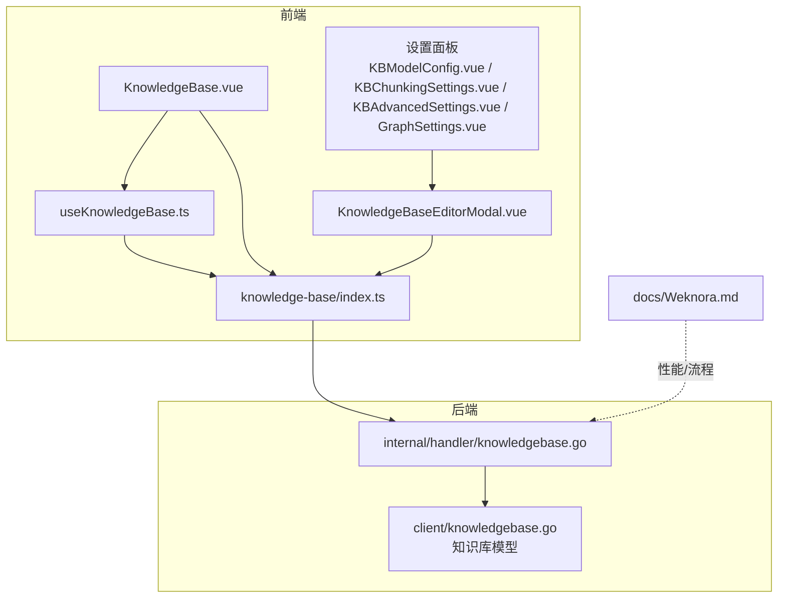
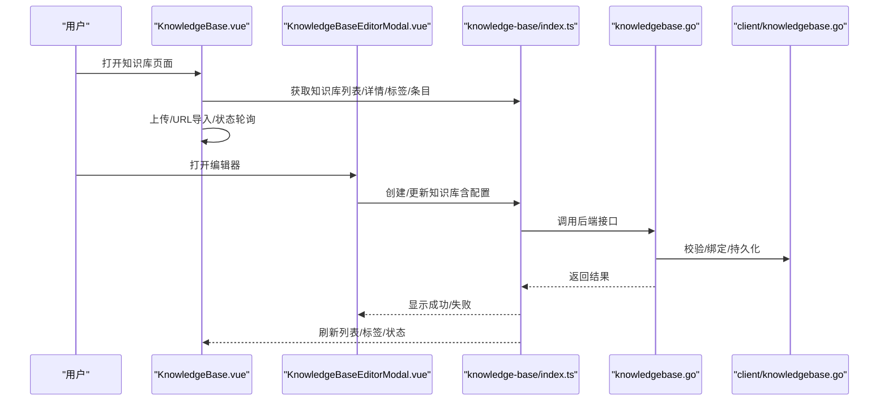
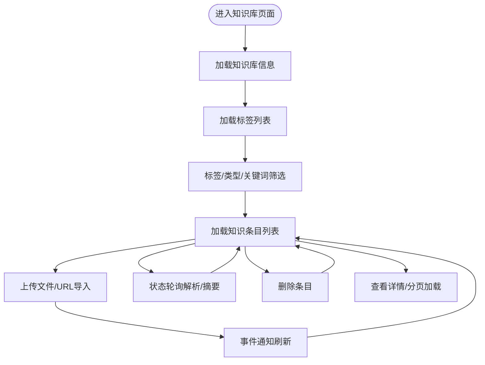
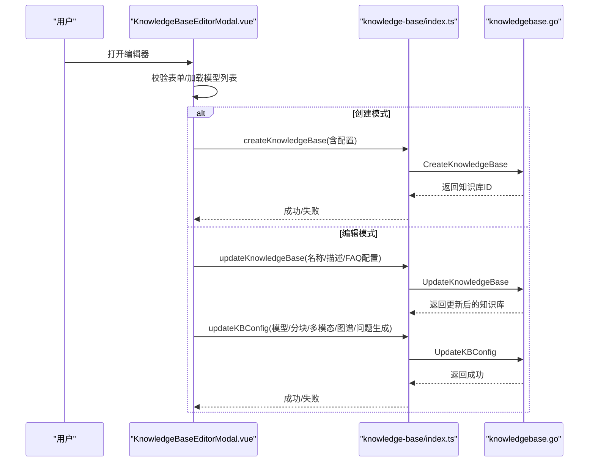
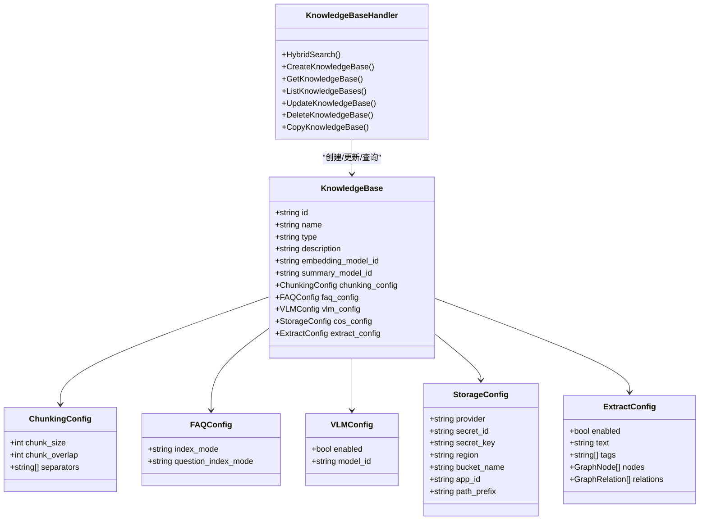

# 知识库管理

<cite>
**本文引用的文件**
- [KnowledgeBase.vue](file://frontend/src/views/knowledge/KnowledgeBase.vue)
- [KnowledgeBaseEditorModal.vue](file://frontend/src/views/knowledge/KnowledgeBaseEditorModal.vue)
- [KBModelConfig.vue](file://frontend/src/views/knowledge/settings/KBModelConfig.vue)
- [KBChunkingSettings.vue](file://frontend/src/views/knowledge/settings/KBChunkingSettings.vue)
- [KBAdvancedSettings.vue](file://frontend/src/views/knowledge/settings/KBAdvancedSettings.vue)
- [GraphSettings.vue](file://frontend/src/views/knowledge/settings/GraphSettings.vue)
- [useKnowledgeBase.ts](file://frontend/src/hooks/useKnowledgeBase.ts)
- [knowledge-base/index.ts](file://frontend/src/api/knowledge-base/index.ts)
- [knowledgebase.go](file://internal/handler/knowledgebase.go)
- [knowledgebase.go（客户端模型）](file://client/knowledgebase.go)
- [Weknora.md](file://docs/Weknora.md)
</cite>

## 目录
1. [简介](#简介)
2. [项目结构](#项目结构)
3. [核心组件](#核心组件)
4. [架构总览](#架构总览)
5. [详细组件分析](#详细组件分析)
6. [依赖分析](#依赖分析)
7. [性能考虑](#性能考虑)
8. [故障排查指南](#故障排查指南)
9. [结论](#结论)
10. [附录](#附录)

## 简介
本文件面向知识库管理的完整生命周期，覆盖从前端创建与编辑、到后端元数据模型、权限控制与状态机、再到高级设置（分块策略、模型配置）对检索效果的影响。文档以前端组件 KnowledgeBase.vue 与 KnowledgeBaseEditorModal.vue 为核心入口，结合后端 handler 与客户端模型，系统阐述多类型知识库（文档型、FAQ型）的创建、配置与使用流程，并引用 WeKnora.md 中的性能说明，给出大规模知识库的优化建议。

## 项目结构
- 前端知识库视图与编辑器
  - 视图：KnowledgeBase.vue（知识库卡片列表、标签筛选、上传/URL导入、状态轮询）
  - 编辑器：KnowledgeBaseEditorModal.vue（基础信息、模型配置、FAQ配置、分块设置、图谱抽取、高级设置）
  - 设置面板：KBModelConfig.vue、KBChunkingSettings.vue、KBAdvancedSettings.vue、GraphSettings.vue
  - 数据钩子：useKnowledgeBase.ts（封装知识条目列表、详情、删除等）
  - API封装：knowledge-base/index.ts（知识库与知识条目相关接口）
- 后端处理层
  - handler：internal/handler/knowledgebase.go（知识库增删改查、权限校验、拷贝、混合检索）
  - 客户端模型：client/knowledgebase.go（知识库与配置的数据结构）
- 文档与性能
  - docs/Weknora.md（流程、性能、重排器说明）

图表来源
- [KnowledgeBase.vue](file://frontend/src/views/knowledge/KnowledgeBase.vue#L1-L200)
- [KnowledgeBaseEditorModal.vue](file://frontend/src/views/knowledge/KnowledgeBaseEditorModal.vue#L1-L200)
- [KBModelConfig.vue](file://frontend/src/views/knowledge/settings/KBModelConfig.vue#L1-L120)
- [KBChunkingSettings.vue](file://frontend/src/views/knowledge/settings/KBChunkingSettings.vue#L1-L120)
- [KBAdvancedSettings.vue](file://frontend/src/views/knowledge/settings/KBAdvancedSettings.vue#L1-L120)
- [GraphSettings.vue](file://frontend/src/views/knowledge/settings/GraphSettings.vue#L1-L120)
- [useKnowledgeBase.ts](file://frontend/src/hooks/useKnowledgeBase.ts#L1-L120)
- [knowledge-base/index.ts](file://frontend/src/api/knowledge-base/index.ts#L1-L120)
- [knowledgebase.go](file://internal/handler/knowledgebase.go#L1-L120)
- [knowledgebase.go（客户端模型）](file://client/knowledgebase.go#L1-L120)
- [Weknora.md](file://docs/Weknora.md#L1-L120)

章节来源
- [KnowledgeBase.vue](file://frontend/src/views/knowledge/KnowledgeBase.vue#L1-L200)
- [KnowledgeBaseEditorModal.vue](file://frontend/src/views/knowledge/KnowledgeBaseEditorModal.vue#L1-L200)
- [knowledge-base/index.ts](file://frontend/src/api/knowledge-base/index.ts#L1-L120)
- [knowledgebase.go](file://internal/handler/knowledgebase.go#L1-L120)
- [knowledgebase.go（客户端模型）](file://client/knowledgebase.go#L1-L120)
- [Weknora.md](file://docs/Weknora.md#L1-L120)

## 核心组件
- 知识库视图（KnowledgeBase.vue）
  - 功能要点：加载知识库信息、列出知识条目、标签筛选、文件类型筛选、搜索关键词、上传文件、URL导入、状态轮询、删除、手动编辑入口。
  - 关键行为：路由参数变化时刷新；标签/类型/关键词变更触发列表刷新；上传/URL导入通过事件通知刷新；文档处理状态轮询。
- 知识库编辑器（KnowledgeBaseEditorModal.vue）
  - 功能要点：基础信息（名称、描述、类型）、模型配置（摘要/嵌入模型）、FAQ配置（索引模式）、分块设置（大小/重叠/分隔符）、图谱抽取（实体/关系）、高级设置（问题生成、多模态、存储配置）。
  - 关键行为：创建/编辑两种模式；表单校验；构建提交数据；调用创建/更新接口。
- 设置面板
  - 模型配置：选择摘要模型与嵌入模型，嵌入模型在已有文件时锁定。
  - 分块设置：滑块调整 chunk_size、chunk_overlap，选择分隔符。
  - 高级设置：问题生成开关与数量；多模态开关与存储类型（MinIO/COS）及密钥配置；VLLM 模型选择。
  - 图谱设置：启用抽取、标签生成、示例文本生成、实体/属性/关系管理、提取按钮。
- 数据钩子（useKnowledgeBase.ts）
  - 封装知识条目列表、详情、删除、分页加载等。
- API封装（knowledge-base/index.ts）
  - 知识库 CRUD、复制、知识条目上传/URL导入/手动创建、分页列表、批量查询、标签管理、FAQ条目管理、FAQ搜索等。

章节来源
- [KnowledgeBase.vue](file://frontend/src/views/knowledge/KnowledgeBase.vue#L1-L200)
- [KnowledgeBaseEditorModal.vue](file://frontend/src/views/knowledge/KnowledgeBaseEditorModal.vue#L1-L200)
- [KBModelConfig.vue](file://frontend/src/views/knowledge/settings/KBModelConfig.vue#L1-L120)
- [KBChunkingSettings.vue](file://frontend/src/views/knowledge/settings/KBChunkingSettings.vue#L1-L120)
- [KBAdvancedSettings.vue](file://frontend/src/views/knowledge/settings/KBAdvancedSettings.vue#L1-L120)
- [GraphSettings.vue](file://frontend/src/views/knowledge/settings/GraphSettings.vue#L1-L120)
- [useKnowledgeBase.ts](file://frontend/src/hooks/useKnowledgeBase.ts#L1-L120)
- [knowledge-base/index.ts](file://frontend/src/api/knowledge-base/index.ts#L1-L120)

## 架构总览
- 前端通过 API 封装调用后端接口，后端 handler 校验租户权限并委托服务层完成业务逻辑。
- 知识库类型区分文档型与 FAQ 型，二者在编辑器中展示不同的配置项与行为。
- 文档型知识库支持上传文件、URL 导入、手动编辑；FAQ 型支持条目管理与搜索。
- 高级设置（分块策略、模型配置、多模态、图谱抽取）直接影响向量化与检索质量。

图表来源
- [KnowledgeBase.vue](file://frontend/src/views/knowledge/KnowledgeBase.vue#L1-L200)
- [KnowledgeBaseEditorModal.vue](file://frontend/src/views/knowledge/KnowledgeBaseEditorModal.vue#L1-L200)
- [knowledge-base/index.ts](file://frontend/src/api/knowledge-base/index.ts#L1-L120)
- [knowledgebase.go](file://internal/handler/knowledgebase.go#L1-L120)
- [knowledgebase.go（客户端模型）](file://client/knowledgebase.go#L1-L120)

## 详细组件分析

### 知识库视图（KnowledgeBase.vue）
- 页面初始化与路由参数
  - 监听路由参数变化，加载知识库信息、知识条目列表、标签列表与总数。
- 列表与筛选
  - 标签筛选：支持“未分类”与已创建标签；分页加载标签；点击标签触发列表刷新。
  - 文件类型筛选：PDF/DOCX/DOC/TXT/MD/URL/手动创建。
  - 关键词搜索：防抖刷新列表。
- 上传与导入
  - 上传文件：批量上传、去重检测、成功/失败提示、事件通知刷新。
  - URL 导入：URL 校验、重复检测、事件通知刷新。
- 状态轮询
  - 对解析/摘要状态处于“进行中”的条目定时轮询，更新卡片状态。
- 删除与详情
  - 删除确认、删除成功提示、刷新列表；详情加载与分页加载。
- 权限与初始化检查
  - 文档型知识库上传/导入前检查：知识库ID、模型配置是否就绪。

图表来源
- [KnowledgeBase.vue](file://frontend/src/views/knowledge/KnowledgeBase.vue#L1-L200)

章节来源
- [KnowledgeBase.vue](file://frontend/src/views/knowledge/KnowledgeBase.vue#L1-L200)

### 知识库编辑器（KnowledgeBaseEditorModal.vue）
- 模式与导航
  - 创建/编辑两种模式；左侧导航根据类型动态显示“基础/模型/FAQ/分块/图谱/高级”。
- 基础信息
  - 类型选择（文档/FAQ，创建后不可更改）；名称/描述必填。
- 模型配置
  - 摘要模型（LLM）与嵌入模型（Embedding）必选；嵌入模型在已有文件时锁定。
- FAQ 配置
  - 索引模式：仅问题/问题+答案；问题索引模式：合并/分离。
- 分块设置
  - chunk_size、chunk_overlap、分隔符（中英文换行、标点等）。
- 图谱设置
  - 启用抽取；标签生成/示例文本生成；实体/属性/关系管理；提取按钮。
- 高级设置
  - 问题生成：开关与生成数量；多模态：开关、VLLM 模型、MinIO/COS 存储配置；MinIO 不可用时自动切换为 COS。
- 提交流程
  - 创建：一次性创建知识库与配置；
  - 编辑：先更新基本信息/FAQ配置，再更新完整配置（模型、分块、多模态、图谱、问题生成）。

图表来源
- [KnowledgeBaseEditorModal.vue](file://frontend/src/views/knowledge/KnowledgeBaseEditorModal.vue#L1-L200)
- [knowledge-base/index.ts](file://frontend/src/api/knowledge-base/index.ts#L1-L120)
- [knowledgebase.go](file://internal/handler/knowledgebase.go#L1-L120)

章节来源
- [KnowledgeBaseEditorModal.vue](file://frontend/src/views/knowledge/KnowledgeBaseEditorModal.vue#L1-L200)
- [knowledge-base/index.ts](file://frontend/src/api/knowledge-base/index.ts#L1-L120)
- [knowledgebase.go](file://internal/handler/knowledgebase.go#L1-L120)

### 设置面板组件
- 模型配置（KBModelConfig.vue）
  - 选择摘要模型与嵌入模型；嵌入模型在已有文件时锁定。
- 分块设置（KBChunkingSettings.vue）
  - 滑块调整 chunk_size、chunk_overlap；多选分隔符。
- 高级设置（KBAdvancedSettings.vue）
  - 问题生成：开关与数量；多模态：开关、VLLM 模型、MinIO/COS 配置；MinIO 不可用时禁用。
- 图谱设置（GraphSettings.vue）
  - 启用抽取；标签生成/示例文本生成；实体/属性/关系管理；提取按钮；图数据库未启用时警告。

章节来源
- [KBModelConfig.vue](file://frontend/src/views/knowledge/settings/KBModelConfig.vue#L1-L120)
- [KBChunkingSettings.vue](file://frontend/src/views/knowledge/settings/KBChunkingSettings.vue#L1-L120)
- [KBAdvancedSettings.vue](file://frontend/src/views/knowledge/settings/KBAdvancedSettings.vue#L1-L120)
- [GraphSettings.vue](file://frontend/src/views/knowledge/settings/GraphSettings.vue#L1-L120)

### 数据钩子与 API
- useKnowledgeBase.ts
  - 封装知识条目列表、详情、删除、分页加载；上传文件时注入知识库ID。
- knowledge-base/index.ts
  - 知识库 CRUD、复制、知识条目上传/URL导入/手动创建、分页列表、批量查询、标签管理、FAQ条目管理、FAQ搜索等。

章节来源
- [useKnowledgeBase.ts](file://frontend/src/hooks/useKnowledgeBase.ts#L1-L120)
- [knowledge-base/index.ts](file://frontend/src/api/knowledge-base/index.ts#L1-L120)

## 依赖分析
- 前端组件耦合
  - KnowledgeBase.vue 依赖 useKnowledgeBase.ts 与 knowledge-base/index.ts；编辑器依赖各设置面板与 API。
- 后端处理
  - knowledgebase.go 负责权限校验（租户ID）、知识库 CRUD、拷贝、混合检索；validateAndGetKnowledgeBase 校验租户所有权。
- 数据模型
  - client/knowledgebase.go 定义知识库与配置结构（嵌入模型ID、摘要模型ID、FAQ配置、分块配置、多模态配置、图谱抽取配置等）。

图表来源
- [knowledgebase.go](file://internal/handler/knowledgebase.go#L1-L120)
- [knowledgebase.go（客户端模型）](file://client/knowledgebase.go#L1-L120)

章节来源
- [knowledgebase.go](file://internal/handler/knowledgebase.go#L1-L120)
- [knowledgebase.go（客户端模型）](file://client/knowledgebase.go#L1-L120)

## 性能考虑
- 检索策略与混合搜索
  - WeKnora.md 指出：系统执行两次混合搜索（完整问句 vs. 关键词序列），通过两种查询方式互补，提升召回与准确率。
- 重排序模型
  - WeKnora.md 提供三种重排器对比：常规交叉编码器、基于LLM的重排器、基于LLM分层信息的重排器；建议从常规重排器起步，再根据需求升级。
- 分块策略
  - chunk_size、chunk_overlap 与分隔符直接影响向量化与检索质量。较大的块有利于上下文完整性，较小的块有利于定位精确性；重叠有助于跨边界信息衔接。
- 多模态与对象存储
  - 启用多模态时，图片上传与处理并发度、对象存储配置（MinIO/COS）会影响吞吐与稳定性。
- 图谱抽取
  - 实体/关系抽取依赖 LLM，需评估模型可用性与系统资源。

章节来源
- [Weknora.md](file://docs/Weknora.md#L190-L331)

## 故障排查指南
- 权限与租户
  - 后端在获取知识库时会校验租户ID，若无权限会返回禁止操作错误。请确认当前登录租户与目标知识库一致。
- 模型配置缺失
  - 文档型知识库上传/导入前需配置摘要模型与嵌入模型；若未配置，前端会提示“未初始化”。
- 上传/URL 导入失败
  - 检查文件类型与大小限制、URL 格式、重复文件/URL 检测；查看事件通知是否正确触发刷新。
- 多模态配置
  - 若 MinIO 未启用，编辑器会自动切换存储类型为 COS；请确认 MinIO 状态或使用 COS。
- 图谱抽取
  - 需要可用的 LLM 模型；若未配置，将无法生成标签/示例文本/提取实体关系。

章节来源
- [knowledgebase.go](file://internal/handler/knowledgebase.go#L100-L180)
- [KnowledgeBase.vue](file://frontend/src/views/knowledge/KnowledgeBase.vue#L580-L720)
- [KBAdvancedSettings.vue](file://frontend/src/views/knowledge/settings/KBAdvancedSettings.vue#L300-L380)
- [GraphSettings.vue](file://frontend/src/views/knowledge/settings/GraphSettings.vue#L330-L420)

## 结论
本文围绕前端知识库视图与编辑器，结合后端 handler 与客户端模型，系统梳理了知识库的创建、配置与使用流程。通过明确权限校验、配置项与高级设置对检索效果的影响，并参考 WeKnora.md 的性能说明，可在不同规模与场景下优化知识库的构建与检索体验。

## 附录
- 常用术语
  - 文档型知识库：支持上传文件、URL 导入、手动编辑。
  - FAQ 型知识库：支持条目管理与搜索。
  - 分块策略：chunk_size、chunk_overlap、分隔符。
  - 多模态：启用图片处理与对象存储。
  - 图谱抽取：实体/关系抽取与可视化。