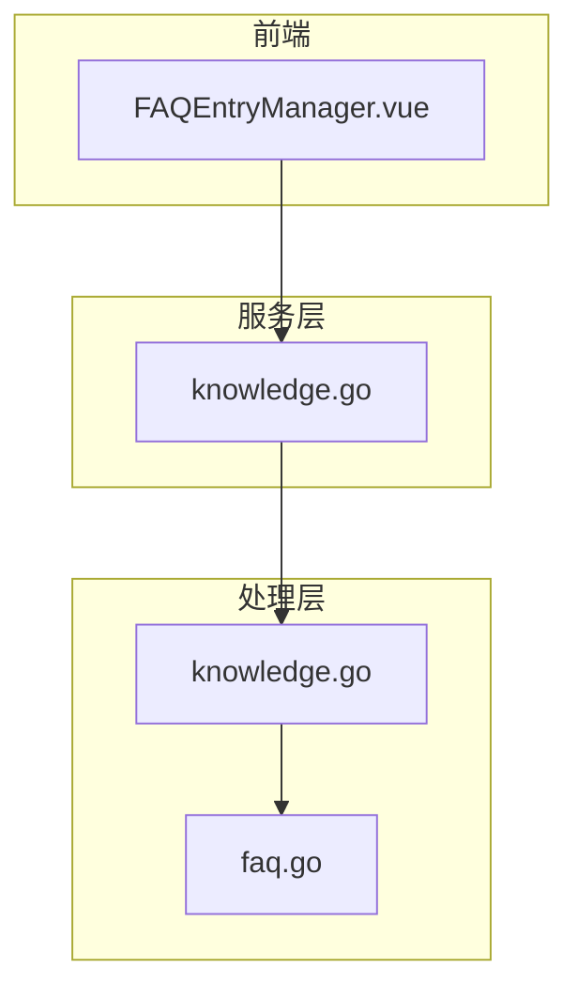

# FAQ管理

<cite>
**本文档引用的文件**
- [FAQEntryManager.vue](file://frontend/src/views/knowledge/components/FAQEntryManager.vue)
- [knowledge.go](file://client/knowledge.go)
- [knowledge.go](file://internal/types/faq.go)
- [knowledge.go](file://internal/application/service/knowledge.go)
- [knowledge.go](file://internal/handler/faq.go)
</cite>

## 目录
1. [简介](#简介)
2. [项目结构](#项目结构)
3. [核心组件](#核心组件)
4. [架构概述](#架构概述)
5. [详细组件分析](#详细组件分析)
6. [依赖分析](#依赖分析)
7. [性能考虑](#性能考虑)
8. [故障排除指南](#故障排除指南)
9. [结论](#结论)

## 简介
本文档详细描述了FAQ类型知识条目的管理功能。基于`FAQEntryManager.vue`组件，说明问答对的增删改查界面操作流程，包括富文本编辑、相似问题扩展等功能。结合`knowledge.go`服务层，解释FAQ数据在数据库中的存储结构（如问题、答案、标签等字段），以及如何参与检索流程。强调其与普通文档知识的处理差异，如无需解析、直接向量化等优化策略，并提供批量导入导出的支持方式。

## 项目结构
项目结构中，`frontend/src/views/knowledge/components/FAQEntryManager.vue`是管理FAQ条目的主要前端组件，负责提供用户界面和交互逻辑。`client/knowledge.go`和`internal/types/faq.go`定义了FAQ相关的数据结构和API接口。`internal/application/service/knowledge.go`和`internal/handler/faq.go`实现了服务层和处理层的逻辑，负责处理FAQ条目的创建、更新、删除和查询等操作。

**Section sources**
- [FAQEntryManager.vue](file://frontend/src/views/knowledge/components/FAQEntryManager.vue)
- [knowledge.go](file://client/knowledge.go)
- [knowledge.go](file://internal/types/faq.go)
- [knowledge.go](file://internal/application/service/knowledge.go)
- [knowledge.go](file://internal/handler/faq.go)

## 核心组件
`FAQEntryManager.vue`组件是管理FAQ条目的核心，提供了增删改查的界面操作流程。用户可以通过该组件创建、编辑、删除FAQ条目，并进行批量操作。组件还支持富文本编辑和相似问题扩展功能，允许用户为每个FAQ条目添加多个相似问题和答案。

**Section sources**
- [FAQEntryManager.vue](file://frontend/src/views/knowledge/components/FAQEntryManager.vue)

## 架构概述
FAQ管理功能的架构分为前端、服务层和处理层。前端组件`FAQEntryManager.vue`负责用户界面和交互逻辑，通过API调用与后端服务通信。服务层`knowledge.go`定义了FAQ相关的数据结构和API接口，处理层`knowledge.go`实现了具体的业务逻辑，如创建、更新、删除和查询FAQ条目。

**Diagram sources**
- [FAQEntryManager.vue](file://frontend/src/views/knowledge/components/FAQEntryManager.vue)
- [knowledge.go](file://client/knowledge.go)
- [knowledge.go](file://internal/application/service/knowledge.go)
- [knowledge.go](file://internal/handler/faq.go)

## 详细组件分析
### FAQEntryManager.vue 分析
`FAQEntryManager.vue`组件提供了管理FAQ条目的完整界面。用户可以通过该组件进行以下操作：
- **创建FAQ条目**：用户可以输入标准问题、相似问题、反例问题和答案，创建新的FAQ条目。
- **编辑FAQ条目**：用户可以修改现有FAQ条目的内容，包括问题、答案和标签。
- **删除FAQ条目**：用户可以删除不需要的FAQ条目。
- **批量操作**：用户可以批量更新标签、启用/禁用状态，或删除多个FAQ条目。

组件还支持富文本编辑和相似问题扩展功能，允许用户为每个FAQ条目添加多个相似问题和答案。用户可以通过搜索功能查找特定的FAQ条目，并进行测试检索。

**Section sources**
- [FAQEntryManager.vue](file://frontend/src/views/knowledge/components/FAQEntryManager.vue)

### 数据结构分析
FAQ条目的数据结构在`internal/types/faq.go`中定义，主要包括以下字段：
- `ID`：FAQ条目的唯一标识符。
- `StandardQuestion`：标准问题。
- `SimilarQuestions`：相似问题列表。
- `NegativeQuestions`：反例问题列表。
- `Answers`：答案列表。
- `TagID`：标签ID，用于分类。
- `IsEnabled`：是否启用。

这些字段在数据库中存储，并通过API进行增删改查操作。

**Section sources**
- [knowledge.go](file://internal/types/faq.go)

### 服务层分析
服务层`internal/application/service/knowledge.go`实现了FAQ条目的业务逻辑。主要功能包括：
- **创建FAQ条目**：通过`CreateFAQEntry`方法创建新的FAQ条目。
- **更新FAQ条目**：通过`UpdateFAQEntry`方法更新现有FAQ条目的内容。
- **删除FAQ条目**：通过`DeleteFAQEntries`方法删除一个或多个FAQ条目。
- **查询FAQ条目**：通过`ListFAQEntries`和`SearchFAQEntries`方法查询FAQ条目。

服务层还处理批量操作，如批量更新标签和启用/禁用状态。

**Section sources**
- [knowledge.go](file://internal/application/service/knowledge.go)

### 处理层分析
处理层`internal/handler/faq.go`负责处理HTTP请求，调用服务层的方法执行具体操作。主要功能包括：
- **创建FAQ条目**：处理POST请求，调用`CreateFAQEntry`方法创建新的FAQ条目。
- **更新FAQ条目**：处理PUT请求，调用`UpdateFAQEntry`方法更新现有FAQ条目的内容。
- **删除FAQ条目**：处理DELETE请求，调用`DeleteFAQEntries`方法删除一个或多个FAQ条目。
- **查询FAQ条目**：处理GET请求，调用`ListFAQEntries`和`SearchFAQEntries`方法查询FAQ条目。

处理层还支持批量操作，如批量更新标签和启用/禁用状态。

**Section sources**
- [knowledge.go](file://internal/handler/faq.go)

## 依赖分析
FAQ管理功能依赖于以下几个组件：
- **前端组件**：`FAQEntryManager.vue`负责用户界面和交互逻辑。
- **服务层**：`knowledge.go`定义了FAQ相关的数据结构和API接口。
- **处理层**：`knowledge.go`和`faq.go`实现了具体的业务逻辑。

这些组件通过API进行通信，确保数据的一致性和完整性。

**Section sources**
- [FAQEntryManager.vue](file://frontend/src/views/knowledge/components/FAQEntryManager.vue)
- [knowledge.go](file://client/knowledge.go)
- [knowledge.go](file://internal/application/service/knowledge.go)
- [knowledge.go](file://internal/handler/faq.go)

## 性能考虑
FAQ管理功能在设计时考虑了性能优化。例如，批量操作通过异步处理，避免阻塞用户界面。此外，查询操作支持分页和搜索，减少数据库查询的负载。

## 故障排除指南
在使用FAQ管理功能时，可能会遇到以下问题：
- **创建FAQ条目失败**：检查输入内容是否符合要求，如标准问题不能为空。
- **更新FAQ条目失败**：检查是否有权限更新该条目。
- **删除FAQ条目失败**：检查是否有权限删除该条目。

如果问题持续存在，建议查看日志文件以获取更多信息。

**Section sources**
- [knowledge.go](file://internal/application/service/knowledge.go)
- [knowledge.go](file://internal/handler/faq.go)

## 结论
本文档详细描述了FAQ类型知识条目的管理功能，包括界面操作流程、数据结构、服务层和处理层的实现。通过`FAQEntryManager.vue`组件，用户可以方便地管理FAQ条目，支持富文本编辑、相似问题扩展和批量操作。结合`knowledge.go`服务层，FAQ数据在数据库中的存储结构和检索流程得到了详细解释。与普通文档知识相比，FAQ条目无需解析，直接向量化，提高了检索效率。批量导入导出功能也提供了便捷的数据管理方式。