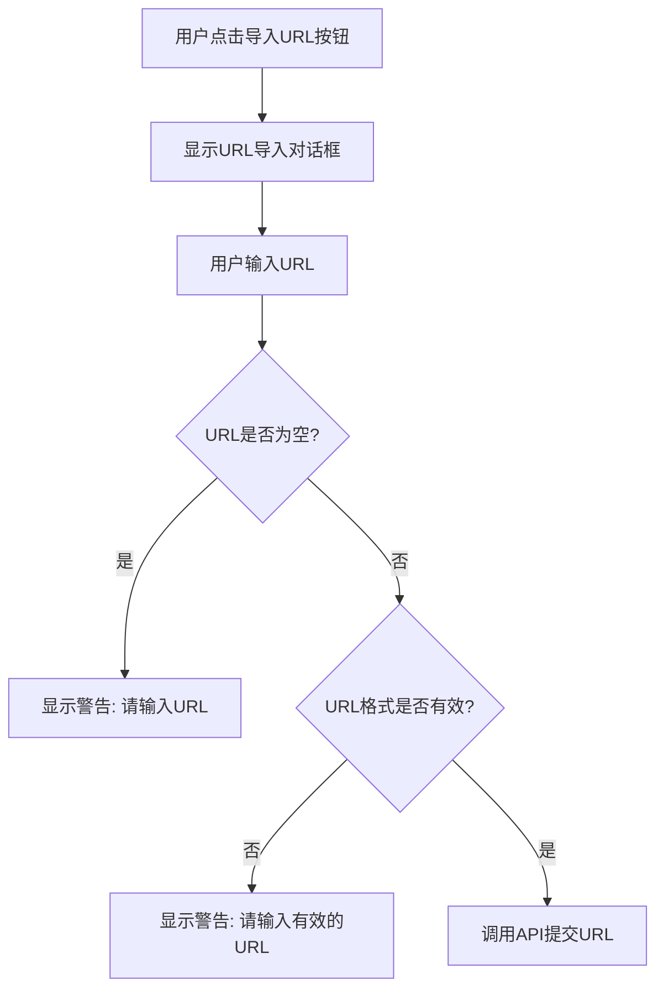
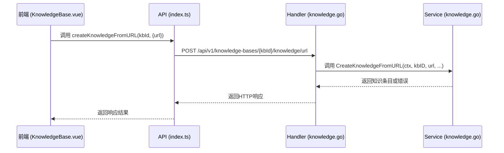
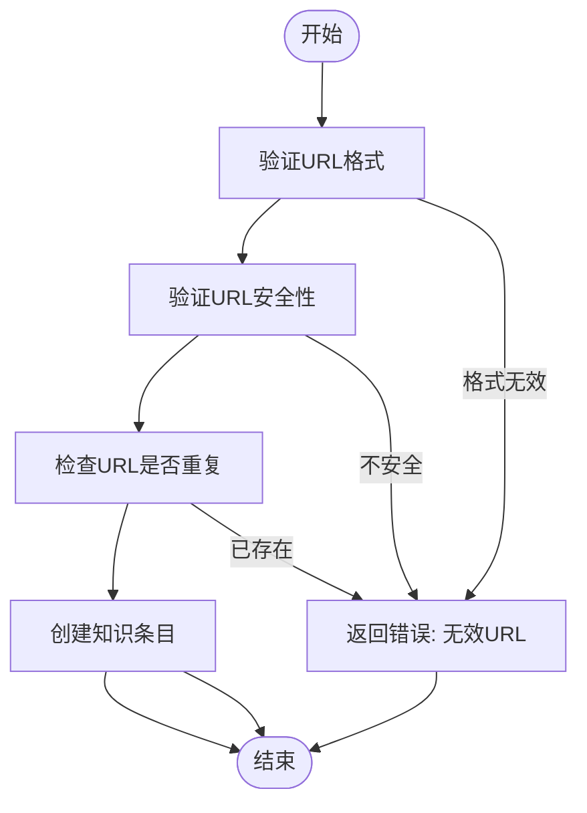
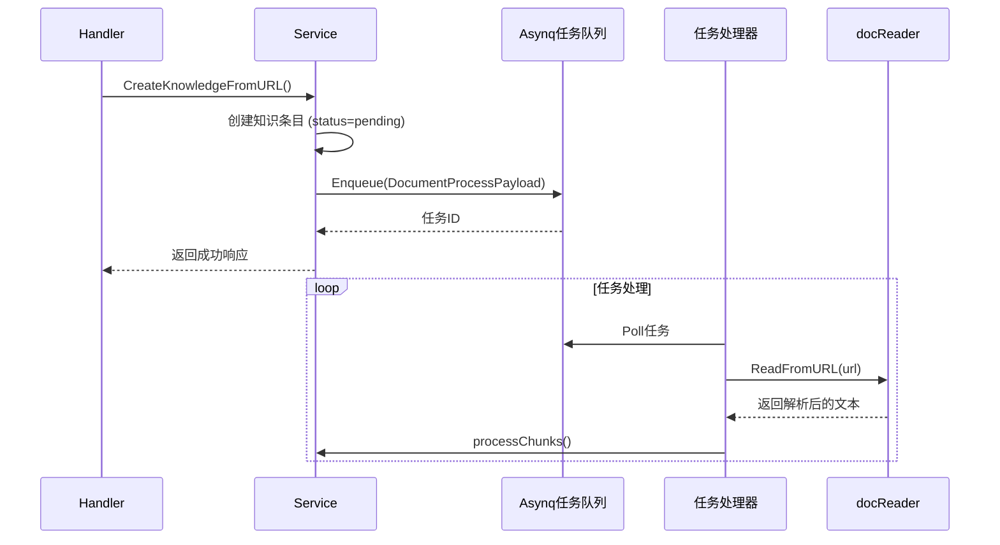
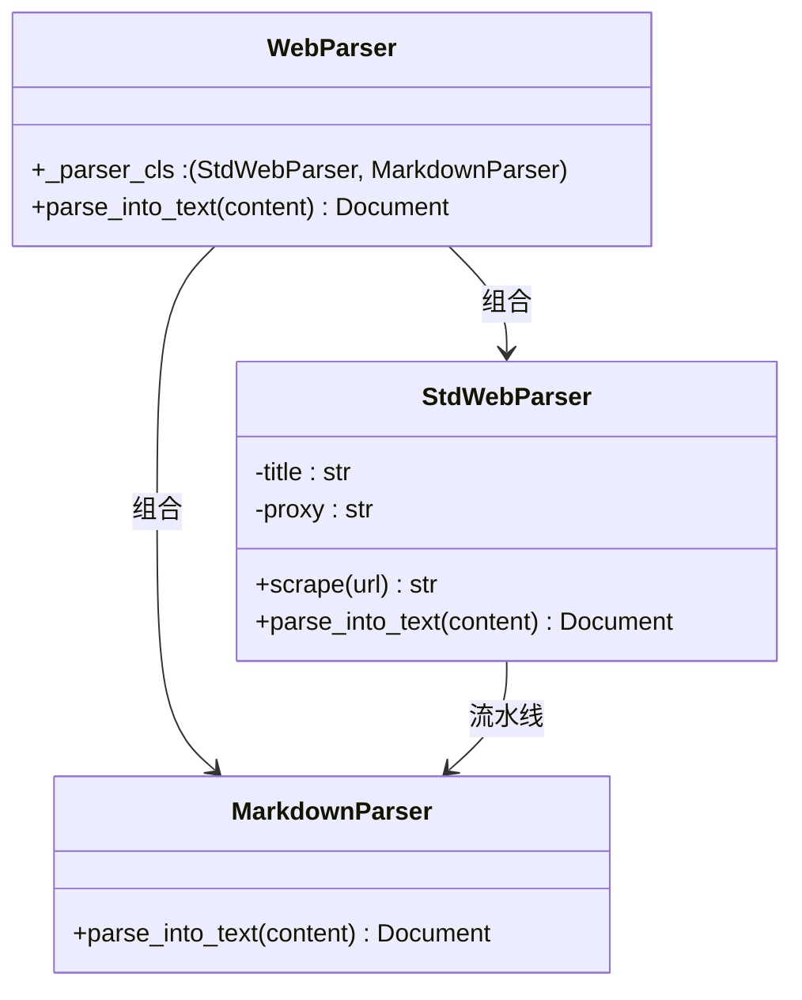
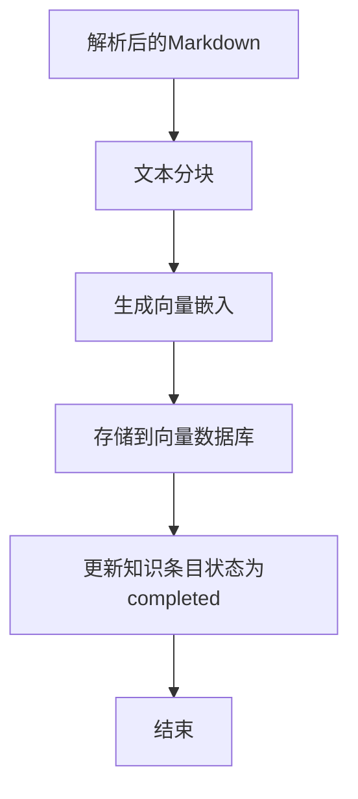
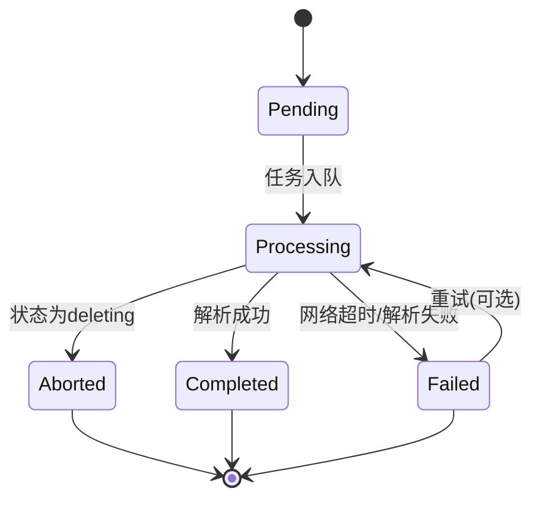

# URL导入

<cite>
**本文档引用的文件**   
- [KnowledgeBase.vue](file://frontend/src/views/knowledge/KnowledgeBase.vue)
- [index.ts](file://frontend/src/api/knowledge-base/index.ts)
- [knowledge.go](file://client/knowledge.go)
- [handler/knowledge.go](file://internal/handler/knowledge.go)
- [service/knowledge.go](file://internal/application/service/knowledge.go)
- [web_parser.py](file://docreader/parser/web_parser.py)
</cite>

## 目录
1. [简介](#简介)
2. [前端URL输入界面](#前端url输入界面)
3. [API提交流程](#api提交流程)
4. [链接合法性校验](#链接合法性校验)
5. [网页抓取任务调度](#网页抓取任务调度)
6. [HTML内容提取与清洗](#html内容提取与清洗)
7. [结构化存储过程](#结构化存储过程)
8. [异常处理机制](#异常处理机制)
9. [状态更新逻辑](#状态更新逻辑)

## 简介
本文档详细说明了URL导入知识内容的功能实现。从前端`KnowledgeBase.vue`的URL输入界面出发，解释如何通过API将链接提交至后端。结合`knowledge.go`和`handler/knowledgebase.go`，描述链接合法性校验、网页抓取任务调度流程，并集成`docreader/parser/web_parser.py`说明HTML内容提取、正文清洗与结构化存储过程。提供异常处理机制，如网络超时、反爬虫响应的应对策略，并给出成功导入后的状态更新逻辑。

## 前端URL输入界面

前端URL导入功能在`KnowledgeBase.vue`组件中实现，提供了一个用户友好的对话框界面，允许用户输入URL并提交导入请求。

该界面通过`handleURLImportClick`方法触发，当用户点击"导入URL"按钮时，会显示一个模态对话框。用户在输入框中填写URL后，点击"确定"按钮触发`handleURLImportConfirm`方法。

在提交前，前端会进行基本的格式校验：
1.  检查URL输入框是否为空。
2.  使用JavaScript的`URL`构造函数验证URL格式的有效性。



**Section sources**
- [KnowledgeBase.vue](file://frontend/src/views/knowledge/KnowledgeBase.vue#L737-L800)

## API提交流程

前端通过`createKnowledgeFromURL` API将URL提交至后端。该API的调用流程如下：

1.  **前端调用**: `KnowledgeBase.vue`组件调用`createKnowledgeFromURL`函数。
2.  **API封装**: 该函数位于`frontend/src/api/knowledge-base/index.ts`，它使用`post`方法向`/api/v1/knowledge-bases/{kbId}/knowledge/url`端点发送POST请求。
3.  **后端路由**: 后端的`internal/router/router.go`文件定义了该路由，它将请求映射到`handler.KnowledgeHandler`的`CreateKnowledgeFromURL`方法。
4.  **服务处理**: `CreateKnowledgeFromURL`方法调用`service.KnowledgeService`的`CreateKnowledgeFromURL`方法来处理业务逻辑。



**Section sources**
- [KnowledgeBase.vue](file://frontend/src/views/knowledge/KnowledgeBase.vue#L753-L799)
- [index.ts](file://frontend/src/api/knowledge-base/index.ts#L47-L49)
- [router.go](file://internal/router/router.go#L129)
- [knowledge.go](file://internal/handler/knowledge.go#L171-L224)

## 链接合法性校验

后端在创建知识条目前，会对URL进行严格的合法性校验，以确保系统的安全性和稳定性。

校验过程在`internal/application/service/knowledge.go`的`CreateKnowledgeFromURL`方法中执行，主要包含以下步骤：

1.  **格式校验**: 使用`isValidURL`函数检查URL的基本格式。
2.  **安全校验**: 使用`secutils.IsValidURL`函数进行更深入的安全检查，包括：
    *   检查URL长度是否超过2048字符。
    *   验证协议是否为`http://`或`https://`。
    *   使用正则表达式模式匹配，防止XSS等攻击。
3.  **重复性校验**: 计算URL的哈希值，并查询数据库，检查该URL是否已在当前知识库中存在。如果存在，则返回`ErrDuplicateURL`错误。



**Section sources**
- [knowledge.go](file://internal/application/service/knowledge.go#L364-L384)
- [security.go](file://internal/utils/security.go#L97-L122)

## 网页抓取任务调度

URL导入采用异步任务调度模式，以避免长时间的网页抓取操作阻塞HTTP请求。

1.  **创建知识条目**: 后端首先在数据库中创建一个状态为`pending`（待处理）的知识条目。
2.  **入队任务**: 将一个包含URL、知识库ID等信息的`DocumentProcessPayload`序列化为JSON，并作为任务提交到`asynq`任务队列中。
3.  **异步处理**: `asynq`任务处理器`ProcessDocument`会从队列中获取任务，并调用`docReader`服务进行实际的网页抓取和解析。

这种设计确保了前端请求能够快速返回，而耗时的解析工作在后台异步完成。



**Section sources**
- [knowledge.go](file://internal/application/service/knowledge.go#L426-L468)
- [knowledge.go](file://internal/application/service/knowledge.go#L4453-L4677)

## HTML内容提取与清洗

HTML内容的提取和清洗由`docreader`服务完成，其核心是`docreader/parser/web_parser.py`中的`WebParser`类。

该过程分为两个主要阶段：

1.  **网页抓取 (Scraping)**:
    *   使用`Playwright`库启动一个无头浏览器（WebKit）。
    *   导航到目标URL，模拟真实用户行为，可以有效绕过一些简单的反爬虫机制。
    *   获取页面的完整HTML内容。

2.  **内容提取与转换 (Parsing)**:
    *   使用`trafilatura`库解析HTML。
    *   提取页面的正文内容，自动去除广告、导航栏等无关信息。
    *   将提取的HTML内容转换为Markdown格式，同时保留图片、表格和链接等元素。
    *   生成包含元数据（如标题、作者、发布日期）的Markdown文档。



**Diagram sources**
- [web_parser.py](file://docreader/parser/web_parser.py#L118-L143)

**Section sources**
- [web_parser.py](file://docreader/parser/web_parser.py#L1-L143)

## 结构化存储过程

解析后的Markdown内容会被进一步处理并结构化存储到数据库中。

1.  **分块 (Chunking)**: 根据知识库的配置（如`chunk_size`和`chunk_overlap`），将长篇的Markdown文本分割成多个较小的文本块（chunks）。
2.  **向量化 (Embedding)**: 为每个文本块调用配置的嵌入模型（Embedding Model），生成向量表示。
3.  **索引存储**: 将文本块及其向量存储到向量数据库（如Elasticsearch或Qdrant）中，以便后续进行语义搜索。
4.  **状态更新**: 当所有文本块处理完毕后，将知识条目的`parse_status`更新为`completed`。



**Section sources**
- [knowledge.go](file://internal/application/service/knowledge.go#L1004-L1200)

## 异常处理机制

系统在URL导入的各个环节都实现了完善的异常处理机制。

1.  **前端异常**:
    *   输入校验失败时，显示相应的警告信息。
    *   API调用失败时，根据返回的错误码（如`duplicate_url`）显示用户友好的提示。

2.  **后端异常**:
    *   **网络超时**: `Playwright`设置了30秒的超时，超时后会捕获异常并返回空内容。
    *   **反爬虫响应**: 如果目标网站返回403等错误，`Playwright`会捕获异常，`trafilatura`会返回空结果。
    *   **解析失败**: 在`StdWebParser.parse_into_text`方法中，任何异常都会被捕获，方法返回一个包含错误信息的`Document`对象。
    *   **任务幂等性**: `ProcessDocument`任务处理器会检查知识条目的状态，如果状态为`deleting`或`completed`，则直接退出，避免重复处理或与删除操作冲突。



**Section sources**
- [web_parser.py](file://docreader/parser/web_parser.py#L63-L84)
- [knowledge.go](file://internal/application/service/knowledge.go#L4483-L4487)

## 状态更新逻辑

为了向用户实时反馈导入进度，系统实现了状态轮询机制。

1.  **初始状态**: 知识条目创建后，状态为`pending`。
2.  **处理中**: 任务开始处理后，状态变为`processing`。
3.  **轮询更新**: 前端会定期（如每1.5秒）调用`batchQueryKnowledge` API，批量查询知识条目的状态。
4.  **完成状态**: 当后端处理完成后，状态变为`completed`，前端收到响应后停止轮询，并刷新文件列表。

```mermaid
sequenceDiagram
participant Frontend
participant Backend
Frontend->>Backend : 创建知识 (status=pending)
Backend-->>Frontend : 成功响应
loop 轮询
Frontend->>Backend : batchQueryKnowledge(ids)
Backend-->>Frontend : 返回状态 (pending/processing)
delay 1.5s
end
Backend->>Backend : 处理完成
Backend->>Backend : 更新状态为 completed
Frontend->>Backend : batchQueryKnowledge(ids)
Backend-->>Frontend : 返回状态 (completed)
Frontend->>Frontend : 停止轮询, 刷新列表
```

**Section sources**
- [KnowledgeBase.vue](file://frontend/src/views/knowledge/KnowledgeBase.vue#L520-L579)