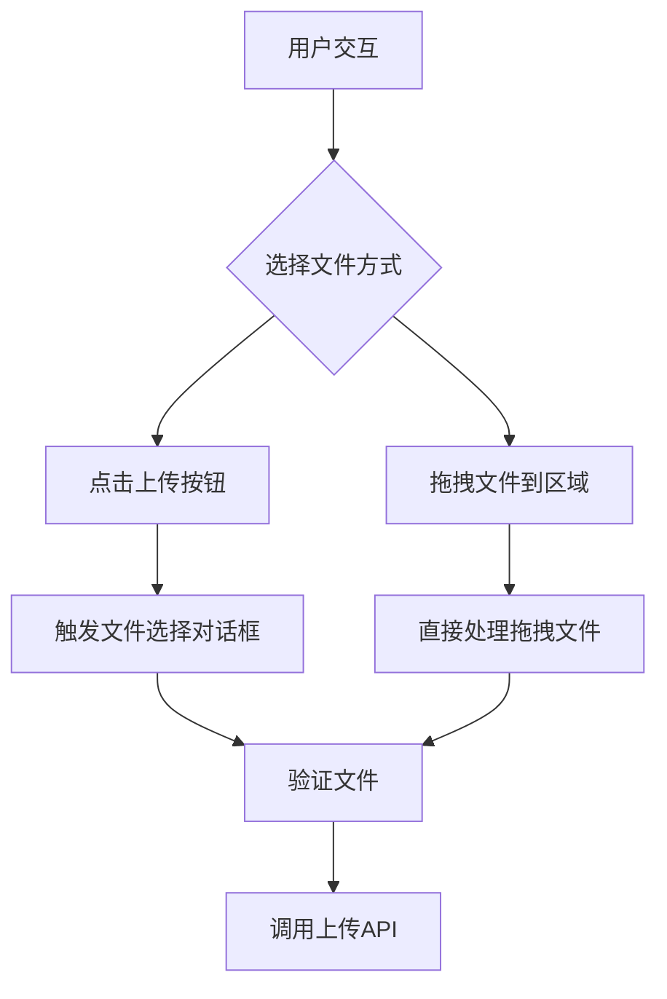
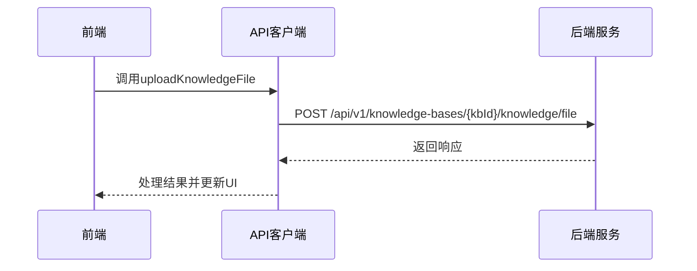
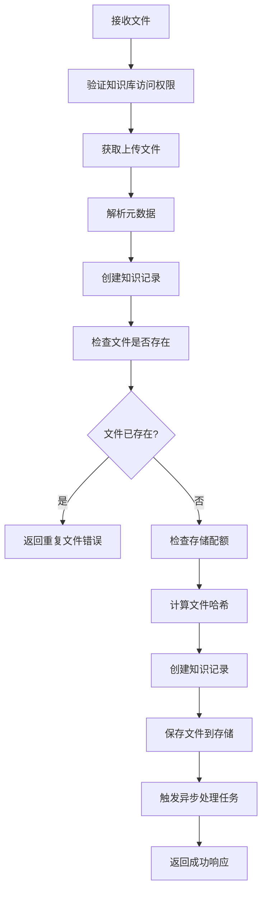
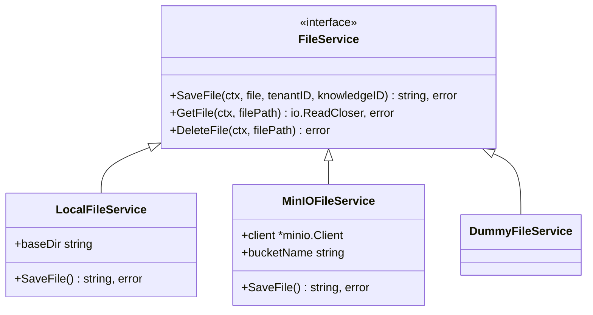
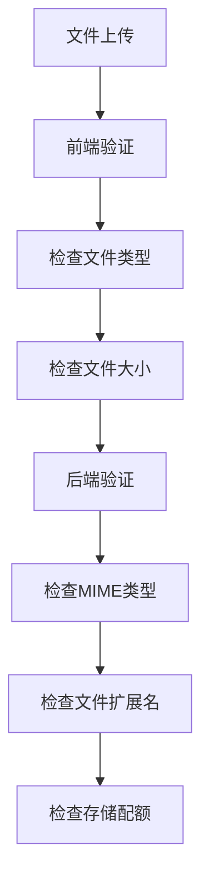
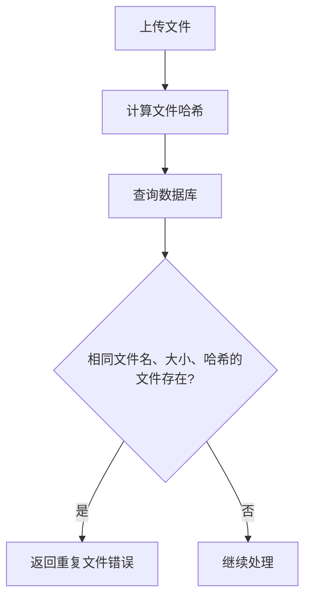
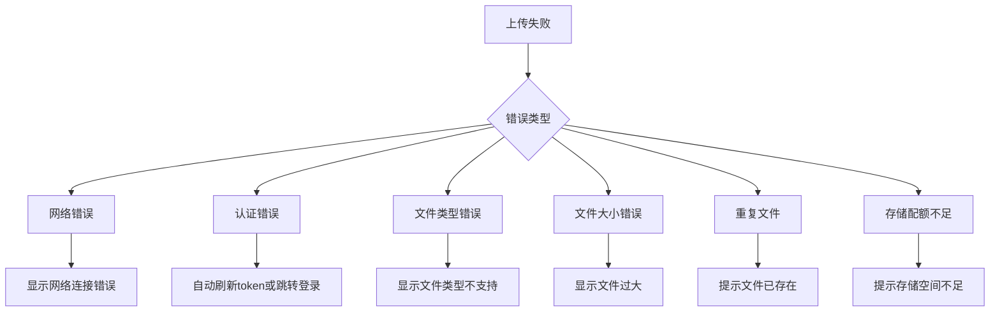

# 文档上传

<cite>
**本文档引用的文件**   
- [KnowledgeBase.vue](file://frontend/src/views/knowledge/KnowledgeBase.vue)
- [index.ts](file://frontend/src/api/knowledge-base/index.ts)
- [knowledge.go](file://internal/handler/knowledge.go)
- [knowledge.go](file://internal/application/service/knowledge.go)
- [local.go](file://internal/application/service/file/local.go)
- [minio.go](file://internal/application/service/file/minio.go)
- [file.go](file://internal/types/interfaces/file.go)
- [index.ts](file://frontend/src/utils/index.ts)
- [request.ts](file://frontend/src/utils/request.ts)
</cite>

## 目录
1. [简介](#简介)
2. [前端交互设计](#前端交互设计)
3. [API调用逻辑](#api调用逻辑)
4. [后端文件处理流程](#后端文件处理流程)
5. [安全策略](#安全策略)
6. [上传进度与错误处理](#上传进度与错误处理)
7. [总结](#总结)

## 简介
本文档详细说明了WeKnora系统中的文档上传功能，涵盖从前端交互到后端处理的完整流程。系统支持多格式文件（PDF、Word、Excel、文本等）的上传，通过拖拽或文件选择的方式实现。上传流程包括前端验证、API调用、后端接收、文件存储和异步处理等环节。文档重点描述了文件大小限制、MIME类型校验、重复文件检测等安全策略，以及前端上传进度条和错误提示的实现机制。

## 前端交互设计
前端文档上传功能主要在`KnowledgeBase.vue`组件中实现，提供了拖拽上传和文件选择两种交互方式。

用户可以通过点击"上传文档"按钮或直接将文件拖拽到指定区域来上传文件。组件通过隐藏的`<input type="file">`元素触发文件选择对话框，并监听`change`事件来处理用户选择的文件。



**交互流程：**
1. 用户点击"上传文档"按钮或拖拽文件
2. 触发文件选择或直接获取文件对象
3. 对文件进行前端验证（类型、大小）
4. 调用API上传文件
5. 显示上传结果和进度

**Section sources**
- [KnowledgeBase.vue](file://frontend/src/views/knowledge/KnowledgeBase.vue#L628-L724)

## API调用逻辑
前端通过`index.ts`中的API函数与后端进行通信，实现文件上传功能。



上传API的核心函数是`uploadKnowledgeFile`，它使用`postUpload`方法发送multipart/form-data格式的请求：

```typescript
export function uploadKnowledgeFile(kbId: string, data = {}, onProgress?: (progressEvent: any) => void) {
  return postUpload(`/api/v1/knowledge-bases/${kbId}/knowledge/file`, data, onProgress);
}
```

该函数支持进度回调，用于实现上传进度条功能。当用户选择文件后，前端会遍历所有有效文件并逐个调用此API进行上传。

**Section sources**
- [index.ts](file://frontend/src/api/knowledge-base/index.ts#L43-L45)
- [request.ts](file://frontend/src/utils/request.ts#L195-L203)

## 后端文件处理流程
后端文件上传处理由`knowledge.go`中的`CreateKnowledgeFromFile`处理器负责，完整的处理流程包括文件接收、验证、存储和异步处理。



具体处理步骤：
1. **权限验证**：检查用户是否有权访问指定的知识库
2. **文件接收**：通过`c.FormFile("file")`获取上传的文件
3. **元数据处理**：解析可能包含的自定义文件名和元数据
4. **存在性检查**：通过文件名、大小和哈希值检查是否为重复文件
5. **配额检查**：验证租户的存储配额是否足够
6. **文件存储**：将文件保存到配置的存储系统（本地或MinIO）
7. **异步处理**：触发文档解析、向量化等后续处理任务

文件存储由`FileService`接口实现，支持多种存储后端：



**Diagram sources**
- [knowledge.go](file://internal/handler/knowledge.go#L85-L156)
- [knowledge.go](file://internal/application/service/knowledge.go#L203-L282)
- [local.go](file://internal/application/service/file/local.go)
- [minio.go](file://internal/application/service/file/minio.go)
- [file.go](file://internal/types/interfaces/file.go)

**Section sources**
- [knowledge.go](file://internal/handler/knowledge.go#L85-L156)
- [knowledge.go](file://internal/application/service/knowledge.go#L203-L282)

## 安全策略
系统实现了多层次的安全策略来确保文件上传的安全性，包括文件类型校验、大小限制、重复文件检测和存储配额控制。

### 文件类型与大小限制
前端和后端都实现了文件类型和大小的验证：



**前端验证规则：**
- 支持的文件类型：PDF、DOCX、DOC、TXT、MD、CSV、XLSX、XLS、JPG、JPEG、PNG
- 文件大小限制：
  - PDF/DOC/DOCX文件：不超过30MB
  - TXT/MD文件：不超过30MB
  - 其他文件：根据系统配置

这些规则在`utils/index.ts`的`kbFileTypeVerification`函数中定义：

```typescript
export function kbFileTypeVerification(file: any, silent = false) {
  let validTypes = ["pdf", "txt", "md", "docx", "doc", "jpg", "jpeg", "png", "csv", "xlsx", "xls"];
  let type = file.name.substring(file.name.lastIndexOf(".") + 1);
  if (!validTypes.includes(type)) {
    if (!silent) {
      MessagePlugin.error("文件类型错误！");
    }
    return true;
  }
  if ((type == "pdf" || type == "docx" || type == "doc") && file.size > 31457280) {
    if (!silent) {
      MessagePlugin.error("pdf/doc文件不能超过30M！");
    }
    return true;
  }
  // ... 其他验证规则
}
```

### 重复文件检测
系统通过文件名、大小和内容哈希值来检测重复文件，避免重复存储和处理：



后端在`CreateKnowledgeFromFile`处理器中执行重复检测：

```go
// Check if file already exists
exists, existingKnowledge, err := s.repo.CheckKnowledgeExists(ctx, tenantID, kbID, &types.KnowledgeCheckParams{
    Type:     "file",
    FileName: fileName,
    FileSize: file.Size,
    FileHash: hash,
})
if exists {
    return existingKnowledge, types.NewDuplicateFileError(existingKnowledge)
}
```

### 存储配额控制
系统为每个租户设置了存储配额，防止资源滥用：

```go
// Check storage quota
tenantInfo := ctx.Value(types.TenantInfoContextKey).(*types.Tenant)
if tenantInfo.StorageQuota > 0 && tenantInfo.StorageUsed >= tenantInfo.StorageQuota {
    logger.Error(ctx, "Storage quota exceeded")
    return nil, types.NewStorageQuotaExceededError()
}
```

**Section sources**
- [index.ts](file://frontend/src/utils/index.ts#L25-L50)
- [knowledge.go](file://internal/application/service/knowledge.go#L203-L223)

## 上传进度与错误处理
系统提供了完善的上传进度显示和错误处理机制，提升用户体验。

### 上传进度实现
前端通过Axios的`onUploadProgress`回调实现上传进度条：

```typescript
await uploadKnowledgeFile(
    kbId, 
    { file },
    (progressEvent: any) => {
        if (progressEvent.total) {
            progress = Math.round((progressEvent.loaded * 100) / progressEvent.total)
            // 发送进度更新事件
            window.dispatchEvent(new CustomEvent('knowledgeFileUploadProgress', {
                detail: { 
                    kbId, 
                    uploadId, 
                    progress 
                }
            }))
        }
    }
)
```

进度信息通过自定义事件广播，由`KnowledgeBaseList.vue`等组件监听并更新UI显示。

### 错误处理机制
系统实现了多层次的错误处理：



前端对不同类型的错误进行分类处理：
- 单文件上传失败：直接显示具体错误信息
- 多文件批量上传：汇总显示成功和失败数量
- 重复文件：提示"文件已存在"
- 网络错误：提示"网络错误，请检查您的网络连接"

错误信息通过全局事件总线传递，确保各个组件能及时响应和更新状态。

**Section sources**
- [menu.vue](file://frontend/src/components/menu.vue#L732-L1069)
- [KnowledgeBaseList.vue](file://frontend/src/views/knowledge/KnowledgeBaseList.vue#L379-L552)
- [request.ts](file://frontend/src/utils/request.ts#L80-L181)

## 总结
WeKnora系统的文档上传功能实现了从前端交互到后端处理的完整闭环。前端提供了直观的拖拽和选择上传方式，并通过验证确保上传文件的合规性。API层负责前后端通信，支持进度回调。后端实现了安全可靠的文件处理流程，包括权限验证、重复检测、配额控制和多存储后端支持。整个系统通过事件机制实现了良好的状态同步和用户体验，确保了文件上传功能的稳定性和安全性。