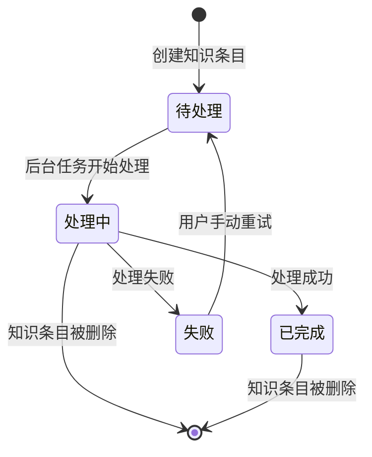

# 知识状态管理

<cite>
**本文档引用的文件**   
- [knowledge.go](file://internal/types/knowledge.go)
- [knowledge.go](file://internal/application/service/knowledge.go)
- [KnowledgeBase.vue](file://frontend/src/views/knowledge/KnowledgeBase.vue)
</cite>

## 目录
1. [引言](#引言)
2. [状态定义与数据库设计](#状态定义与数据库设计)
3. [服务层状态变更机制](#服务层状态变更机制)
4. [前端状态轮询与实时更新](#前端状态轮询与实时更新)
5. [状态迁移图示例](#状态迁移图示例)
6. [错误处理与重试机制](#错误处理与重试机制)

## 引言
本文档深入阐述了知识条目在系统中的全生命周期状态管理机制。基于`types/knowledge.go`中定义的状态枚举（待处理、处理中、已完成、失败），结合`knowledge.go`的服务层逻辑，详细解释了状态变更的触发条件与事务一致性保障。从前端`KnowledgeBase.vue`展示层出发，说明了状态轮询或事件通知机制如何实现实时更新，包括错误状态的提示信息展示与重试操作入口。同时，提供了状态迁移图示例及数据库字段设计依据。

## 状态定义与数据库设计
知识条目的状态管理是其全生命周期的核心。系统通过在数据库中定义特定的状态字段来跟踪和管理知识条目的处理进度。

### 状态枚举定义
在`types/knowledge.go`文件中，定义了知识条目的解析状态（`ParseStatus`）和摘要生成状态（`SummaryStatus`）的常量。这些常量构成了状态机的基础。

```go
// Knowledge parse status constants
const (
    // ParseStatusPending indicates the knowledge is waiting to be processed
    ParseStatusPending = "pending"
    // ParseStatusProcessing indicates the knowledge is being processed
    ParseStatusProcessing = "processing"
    // ParseStatusCompleted indicates the knowledge has been processed successfully
    ParseStatusCompleted = "completed"
    // ParseStatusFailed indicates the knowledge processing failed
    ParseStatusFailed = "failed"
    // ParseStatusDeleting indicates the knowledge is being deleted (used to prevent async task conflicts)
    ParseStatusDeleting = "deleting"
)

// Summary status constants for async summary generation
const (
    // SummaryStatusNone indicates no summary task is needed
    SummaryStatusNone = "none"
    // SummaryStatusPending indicates the summary task is waiting to be processed
    SummaryStatusPending = "pending"
    // SummaryStatusProcessing indicates the summary is being generated
    SummaryStatusProcessing = "processing"
    // SummaryStatusCompleted indicates the summary has been generated successfully
    SummaryStatusCompleted = "completed"
    // SummaryStatusFailed indicates the summary generation failed
    SummaryStatusFailed = "failed"
)
```

### 数据库字段设计
`Knowledge`结构体定义了与状态相关的数据库字段，这些字段直接映射到数据库表的列。

```go
type Knowledge struct {
    // ... 其他字段
    // Parse status of the knowledge
    ParseStatus string `json:"parse_status"`
    // Summary status for async summary generation
    SummaryStatus string `json:"summary_status"     gorm:"type:varchar(32);default:none"`
    // Error message of the knowledge
    ErrorMessage string `json:"error_message"`
    // Processed time of the knowledge
    ProcessedAt *time.Time `json:"processed_at"`
    // ... 其他字段
}
```

**设计依据**:
- `ParseStatus` (解析状态): 用于跟踪知识条目从创建到处理完成的整个流程。其值为`pending`, `processing`, `completed`, `failed`, `deleting`。
- `SummaryStatus` (摘要状态): 用于跟踪异步摘要生成任务的状态。其值为`none`, `pending`, `processing`, `completed`, `failed`。默认值为`none`，表示无需生成摘要。
- `ErrorMessage` (错误信息): 当`ParseStatus`为`failed`时，此字段存储详细的错误信息，用于前端展示。
- `ProcessedAt` (处理完成时间): 记录知识条目处理完成的时间戳，仅在`ParseStatus`变为`completed`时更新。

**Section sources**
- [knowledge.go](file://internal/types/knowledge.go#L19-L45)

## 服务层状态变更机制
服务层是状态变更逻辑的核心，它确保了状态迁移的原子性、一致性和事务性。

### 状态变更的触发条件
状态的变更由特定的业务操作触发，主要发生在知识条目的创建、更新和后台异步处理过程中。

1.  **创建时触发**：
    *   当通过`CreateKnowledgeFromFile`, `CreateKnowledgeFromURL`, 或 `CreateKnowledgeFromManual`等方法创建新的知识条目时，如果其状态为“发布”（publish），则`ParseStatus`会被初始化为`pending`，表示等待处理。
    ```go
    // CreateKnowledgeFromManual 函数片段
    if status == types.ManualKnowledgeStatusPublish {
        knowledge.ParseStatus = "pending"
    }
    ```
    *   如果是“草稿”（draft），则`ParseStatus`被设置为`draft`。

2.  **异步任务触发**：
    *   后台的`ProcessDocument`任务被`Asynq`调度执行时，会将`ParseStatus`从`pending`更新为`processing`。
    ```go
    // processDocumentFromPassage 函数片段
    knowledge.ParseStatus = "processing"
    knowledge.UpdatedAt = time.Now()
    if err := s.repo.UpdateKnowledge(ctx, knowledge); err != nil {
        return
    }
    ```

3.  **处理成功触发**：
    *   当文档处理、分块和向量化全部成功完成后，`ParseStatus`会被更新为`completed`。
    ```go
    // processChunks 函数片段
    knowledge.ParseStatus = types.ParseStatusCompleted
    knowledge.EnableStatus = "enabled"
    now := time.Now()
    knowledge.ProcessedAt = &now
    knowledge.UpdatedAt = now
    if err := s.repo.UpdateKnowledge(ctx, knowledge); err != nil {
        // ...
    }
    ```

4.  **处理失败触发**：
    *   在处理过程中的任何环节发生不可恢复的错误，`ParseStatus`都会被更新为`failed`，并记录`ErrorMessage`。
    ```go
    // processChunks 函数片段
    knowledge.ParseStatus = types.ParseStatusFailed
    knowledge.ErrorMessage = err.Error()
    knowledge.UpdatedAt = time.Now()
    s.repo.UpdateKnowledge(ctx, knowledge)
    ```

5.  **删除操作触发**：
    *   在删除知识条目时，为了防止与后台异步处理任务冲突，会先将`ParseStatus`标记为`deleting`。
    ```go
    // DeleteKnowledge 函数片段
    originalStatus := knowledge.ParseStatus
    knowledge.ParseStatus = types.ParseStatusDeleting
    knowledge.UpdatedAt = time.Now()
    if err := s.repo.UpdateKnowledge(ctx, knowledge); err != nil {
        // ...
    }
    ```

### 事务一致性保障
服务层通过以下机制保障状态变更的事务一致性：

1.  **幂等性检查**：在处理异步任务时，首先会检查知识条目的当前状态。如果状态已经是`completed`，则直接返回，避免重复处理。
    ```go
    // ProcessDocument 函数片段
    if knowledge.ParseStatus == types.ParseStatusCompleted {
        logger.Infof(ctx, "Document already completed, skipping: %s", payload.KnowledgeID)
        return nil 
    }
    ```

2.  **删除冲突预防**：在处理任务开始前和处理过程中，会多次检查`ParseStatus`是否为`deleting`。如果是，则立即终止处理并清理已创建的资源，确保删除操作的优先级。
    ```go
    // processChunks 函数片段
    if s.isKnowledgeDeleting(ctx, knowledge.TenantID, knowledge.ID) {
        logger.Infof(ctx, "Knowledge is being deleted, aborting chunk processing: %s", knowledge.ID)
        return
    }
    ```

3.  **资源清理**：当处理失败或检测到删除操作时，服务层会主动清理已创建的资源（如分块、向量索引），保证数据的一致性。
    ```go
    // processChunks 函数片段
    if err := s.chunkService.DeleteChunksByKnowledgeID(ctx, knowledge.ID); err != nil {
        // ...
    }
    if err := retrieveEngine.DeleteByKnowledgeIDList(ctx, []string{knowledge.ID}, embeddingModel.GetDimensions()); err != nil {
        // ...
    }
    ```

**Section sources**
- [knowledge.go](file://internal/application/service/knowledge.go#L253-L262)
- [knowledge.go](file://internal/application/service/knowledge.go#L970-L972)
- [knowledge.go](file://internal/application/service/knowledge.go#L1330-L1336)
- [knowledge.go](file://internal/application/service/knowledge.go#L1280-L1287)
- [knowledge.go](file://internal/application/service/knowledge.go#L4470-L4505)

## 前端状态轮询与实时更新
前端通过`KnowledgeBase.vue`组件实现对知识条目状态的实时监控和展示。

### 状态轮询机制
前端采用**轮询（Polling）** 的方式来获取知识条目的最新状态，而不是使用WebSocket等推送技术。

1.  **触发条件**：当`cardList`（知识条目列表）发生变化时，会触发一个`watch`监听器。
    ```vue
    watch(() => cardList.value, (newValue) => {
      if (isFAQ.value) return;
      let analyzeList = [];
      // Filter items that need polling: parsing in progress OR summary generation in progress
      analyzeList = newValue.filter(item => {
        const isParsing = item.parse_status == 'pending' || item.parse_status == 'processing';
        const isSummaryPending = item.parse_status == 'completed' && 
          (item.summary_status == 'pending' || item.summary_status == 'processing');
        return isParsing || isSummaryPending;
      })
      // ...
    }, { deep: true })
    ```

2.  **轮询逻辑**：`watch`回调会筛选出状态为`pending`或`processing`（解析中）或`completed`但`summary_status`为`pending`或`processing`（摘要生成中）的知识条目，并调用`updateStatus(analyzeList)`函数。

3.  **轮询执行**：`updateStatus`函数会启动一个`setInterval`定时器，每隔1500毫秒向后端的`batchQueryKnowledge`接口发送一次请求，批量查询这些条目的最新状态。
    ```vue
    const updateStatus = (analyzeList: KnowledgeCard[]) => {
      let query = ``;
      for (let i = 0; i < analyzeList.length; i++) {
        query += `ids=${analyzeList[i].id}&`;
      }
      timeout = setInterval(() => {
        batchQueryKnowledge(query).then((result: any) => {
          if (result.success && result.data) {
            (result.data as KnowledgeCard[]).forEach((item: KnowledgeCard) => {
              const index = cardList.value.findIndex(card => card.id == item.id);
              if (index == -1) return;
              // Always update the card data
              cardList.value[index].parse_status = item.parse_status;
              cardList.value[index].summary_status = item.summary_status;
              cardList.value[index].description = item.description;
            });
          }
        }).catch((_err) => {
          // 错误处理
        });
      }, 1500);
    };
    ```

4.  **状态更新**：当后端返回最新的状态数据后，前端会直接更新`cardList`中对应条目的`parse_status`、`summary_status`和`description`字段，从而实现UI的实时刷新。

### 实时更新的实现
这种轮询机制实现了准实时的更新：
- **优点**：实现简单，兼容性好，不需要维护长连接。
- **缺点**：存在一定的延迟（最多1.5秒），且会产生不必要的网络请求。

**Section sources**
- [KnowledgeBase.vue](file://frontend/src/views/knowledge/KnowledgeBase.vue#L520-L579)

## 状态迁移图示例
下图展示了知识条目核心状态（`ParseStatus`）的迁移过程。



**Diagram sources**
- [knowledge.go](file://internal/types/knowledge.go#L21-L30)
- [knowledge.go](file://internal/application/service/knowledge.go#L253-L262)
- [knowledge.go](file://internal/application/service/knowledge.go#L970-L972)
- [knowledge.go](file://internal/application/service/knowledge.go#L1330-L1336)

## 错误处理与重试机制
系统提供了完善的错误处理和重试机制，以提升用户体验。

### 错误信息展示
当知识条目的`ParseStatus`为`failed`时，前端会根据`parse_status`的值显示相应的错误提示。

```vue
<div v-else-if="item.parse_status === 'failed'" class="card-analyze failure">
  <t-icon name="close-circle" class="card-analyze-loading failure"></t-icon>
  <span class="card-analyze-txt failure">{{ t('knowledgeBase.parsingFailed') }}</span>
</div>
```
同时，`error_message`字段中的详细错误信息可以作为提示，帮助用户了解失败原因。

### 重试操作入口
目前的代码分析显示，系统**没有直接提供一个“重试”按钮**。重试机制主要通过以下方式实现：
1.  **手动重新上传**：对于上传失败的文件，用户需要手动重新执行上传操作。
2.  **修改并发布**：对于手动创建的知识条目，如果处理失败，用户可以编辑内容后再次点击“发布”，这会触发一个新的处理流程。

**Section sources**
- [KnowledgeBase.vue](file://frontend/src/views/knowledge/KnowledgeBase.vue#L1230-L1233)