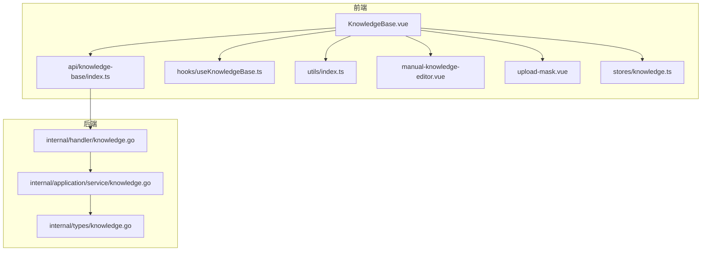
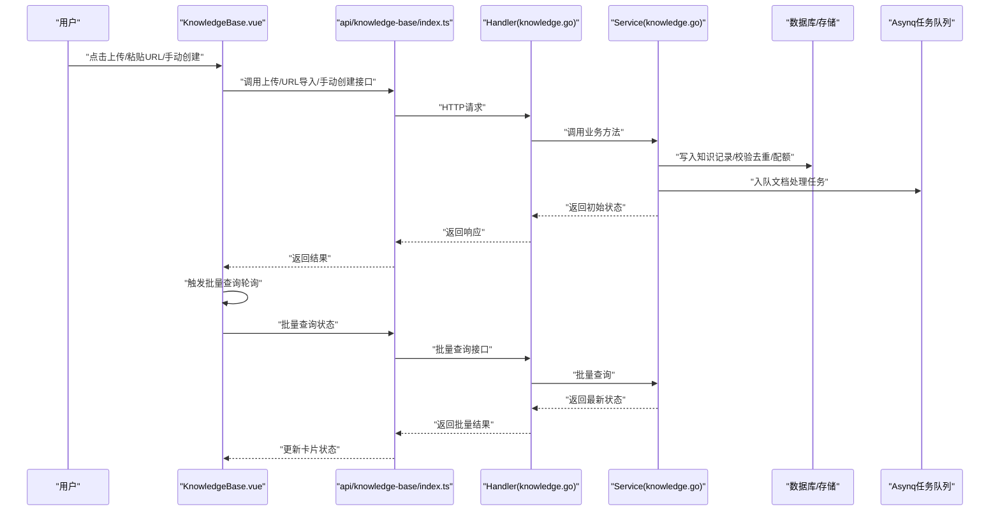
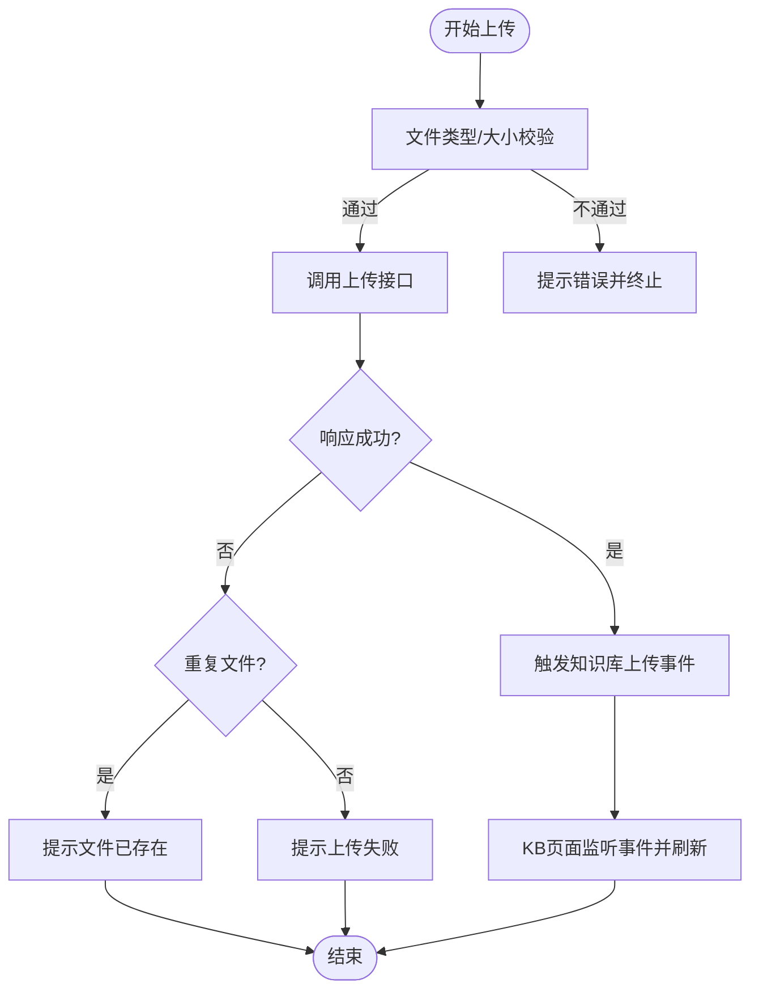
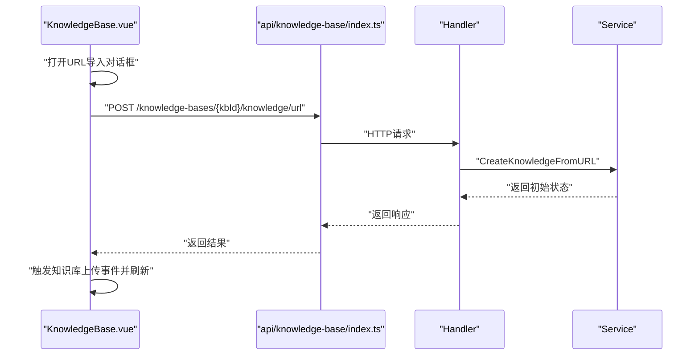
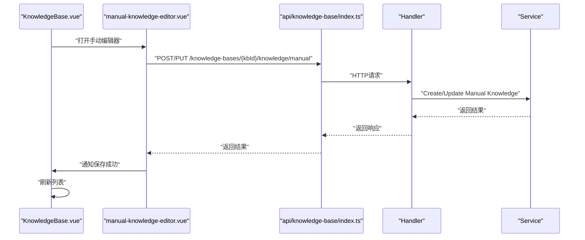
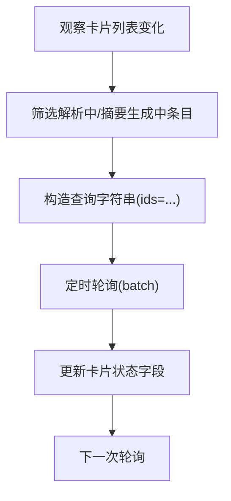
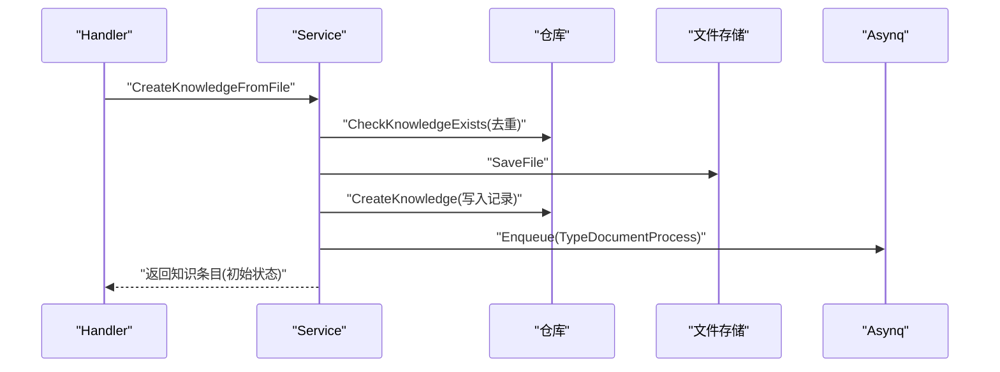
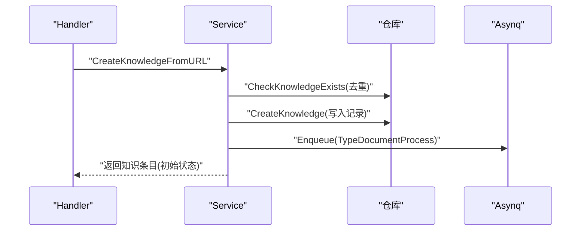
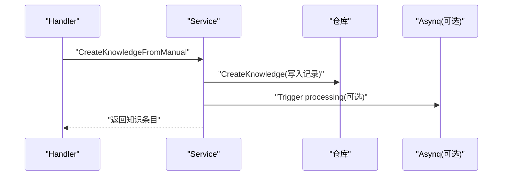
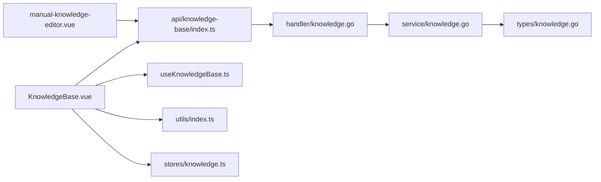

# 知识管理

<cite>
**本文引用的文件**
- [KnowledgeBase.vue](file://frontend/src/views/knowledge/KnowledgeBase.vue)
- [index.ts（知识库API）](file://frontend/src/api/knowledge-base/index.ts)
- [useKnowledgeBase.ts](file://frontend/src/hooks/useKnowledgeBase.ts)
- [utils/index.ts](file://frontend/src/utils/index.ts)
- [knowledge.go（客户端SDK）](file://client/knowledge.go)
- [knowledge.go（处理器）](file://internal/handler/knowledge.go)
- [knowledge.go（应用服务）](file://internal/application/service/knowledge.go)
- [knowledge.go（类型定义）](file://internal/types/knowledge.go)
- [manual-knowledge-editor.vue](file://frontend/src/components/manual-knowledge-editor.vue)
- [upload-mask.vue](file://frontend/src/components/upload-mask.vue)
- [knowledge.ts（Pinia Store）](file://frontend/src/stores/knowledge.ts)
</cite>

## 目录
1. [简介](#简介)
2. [项目结构](#项目结构)
3. [核心组件](#核心组件)
4. [架构总览](#架构总览)
5. [详细组件分析](#详细组件分析)
6. [依赖关系分析](#依赖关系分析)
7. [性能考量](#性能考量)
8. [故障排查指南](#故障排查指南)
9. [结论](#结论)
10. [附录](#附录)

## 简介
本文件围绕前端组件“知识库视图”KnowledgeBase.vue，系统化阐述如何在知识库中管理知识条目，覆盖以下能力：
- 文件上传：支持拖拽与文件选择，包含文件类型与大小校验、进度上报、重复检测与事件通知
- URL 导入：通过输入 URL 创建知识条目，支持重复检测与事件通知
- 手动创建：通过 Markdown 编辑器创建或发布知识条目，并通过事件通知刷新界面
- 状态管理：解析状态（待处理、处理中、已完成、失败、删除中）与摘要生成状态（none/pending/processing/completed/failed）的轮询与展示
- 批量查询：按知识条目 ID 列表批量拉取最新状态，用于前端轮询刷新

上述能力与后端服务协同工作，后端提供文件上传、URL 导入、手动创建、批量查询等接口，以及知识条目的状态流转与持久化。

## 项目结构
前端知识库视图位于 views/knowledge 目录，核心文件如下：
- 视图组件：KnowledgeBase.vue
- API 层：api/knowledge-base/index.ts
- 工具与校验：utils/index.ts
- 钩子：hooks/useKnowledgeBase.ts
- 手动编辑器：components/manual-knowledge-editor.vue
- 上传遮罩：components/upload-mask.vue
- 状态管理：stores/knowledge.ts

后端涉及三层：
- Handler 层：internal/handler/knowledge.go（HTTP 路由与请求处理）
- Service 层：internal/application/service/knowledge.go（业务逻辑与任务调度）
- 类型定义：internal/types/knowledge.go（状态常量与实体）

图表来源
- [KnowledgeBase.vue](file://frontend/src/views/knowledge/KnowledgeBase.vue#L1-L120)
- [index.ts（知识库API）](file://frontend/src/api/knowledge-base/index.ts#L1-L120)
- [useKnowledgeBase.ts](file://frontend/src/hooks/useKnowledgeBase.ts#L1-L120)
- [utils/index.ts](file://frontend/src/utils/index.ts#L1-L51)
- [manual-knowledge-editor.vue](file://frontend/src/components/manual-knowledge-editor.vue#L1-L120)
- [upload-mask.vue](file://frontend/src/components/upload-mask.vue#L1-L43)
- [knowledge.ts（Pinia Store）](file://frontend/src/stores/knowledge.ts#L1-L12)
- [knowledge.go（处理器）](file://internal/handler/knowledge.go#L1-L120)
- [knowledge.go（应用服务）](file://internal/application/service/knowledge.go#L1-L120)
- [knowledge.go（类型定义）](file://internal/types/knowledge.go#L1-L120)

章节来源
- [KnowledgeBase.vue](file://frontend/src/views/knowledge/KnowledgeBase.vue#L1-L120)
- [index.ts（知识库API）](file://frontend/src/api/knowledge-base/index.ts#L1-L120)
- [knowledge.go（处理器）](file://internal/handler/knowledge.go#L1-L120)

## 核心组件
- 知识库视图（KnowledgeBase.vue）
  - 负责渲染知识卡片、标签筛选、文件类型筛选、搜索关键词过滤、文件上传、URL 导入、手动创建入口、状态轮询与事件监听
  - 使用 useKnowledgeBase 钩子统一管理分页列表、详情加载与删除
  - 通过自定义事件与全局事件总线联动，实现上传完成后的自动刷新
- 知识库 API（api/knowledge-base/index.ts）
  - 封装上传文件、URL 导入、手动创建、批量查询、分页列表、标签管理等接口
- 工具与校验（utils/index.ts）
  - 提供文件类型与大小校验、时间格式化等工具方法
- 应用服务（internal/application/service/knowledge.go）
  - 实现文件/URL/手动知识条目的创建、去重检查、存储配额校验、异步任务入队（Asynq）
  - 定义解析状态与摘要状态常量，驱动前端轮询
- 类型定义（internal/types/knowledge.go）
  - 定义知识条目结构、状态常量、手动知识元数据等
- 手动编辑器（manual-knowledge-editor.vue）
  - 提供 Markdown 编辑、预览、草稿/发布状态切换、保存并通知父组件刷新
- 上传遮罩（upload-mask.vue）
  - 提供拖拽上传的视觉提示与格式说明

章节来源
- [KnowledgeBase.vue](file://frontend/src/views/knowledge/KnowledgeBase.vue#L1-L200)
- [index.ts（知识库API）](file://frontend/src/api/knowledge-base/index.ts#L1-L120)
- [utils/index.ts](file://frontend/src/utils/index.ts#L1-L51)
- [knowledge.go（应用服务）](file://internal/application/service/knowledge.go#L1-L200)
- [knowledge.go（类型定义）](file://internal/types/knowledge.go#L1-L120)
- [manual-knowledge-editor.vue](file://frontend/src/components/manual-knowledge-editor.vue#L1-L120)
- [upload-mask.vue](file://frontend/src/components/upload-mask.vue#L1-L43)

## 架构总览
前端通过 API 层调用后端 Handler，Handler 调用 Service 层执行业务逻辑（如文件/URL/手动创建），Service 将处理任务入队到 Asynq 并返回初始状态；前端通过批量查询接口定时轮询最新状态，实现“待处理/处理中/已完成”的实时反馈。

图表来源
- [KnowledgeBase.vue](file://frontend/src/views/knowledge/KnowledgeBase.vue#L520-L620)
- [index.ts（知识库API）](file://frontend/src/api/knowledge-base/index.ts#L40-L100)
- [knowledge.go（处理器）](file://internal/handler/knowledge.go#L85-L224)
- [knowledge.go（应用服务）](file://internal/application/service/knowledge.go#L135-L200)

章节来源
- [KnowledgeBase.vue](file://frontend/src/views/knowledge/KnowledgeBase.vue#L520-L620)
- [knowledge.go（处理器）](file://internal/handler/knowledge.go#L85-L224)
- [knowledge.go（应用服务）](file://internal/application/service/knowledge.go#L135-L200)

## 详细组件分析

### 文件上传（拖拽与文件选择）
- 前端校验与交互
  - 文件类型与大小校验：utils/index.ts 中的 kbFileTypeVerification 对 PDF/DOC/DOCX/TXT/MD/图片等进行类型与大小限制
  - 上传入口：KnowledgeBase.vue 中 handleDocumentUpload 统一处理 input[type=file] 的 change 事件，逐个文件调用 uploadKnowledgeFile 接口
  - 成功/失败提示与重复检测：根据响应中的 success/code/message 字段判断，对 duplicate_file 场景给出“文件已存在”提示
  - 事件通知：上传完成后通过 window.dispatchEvent 触发自定义事件 knowledgeFileUploaded，KB 页面监听该事件并刷新列表
- 后端处理
  - Handler.CreateKnowledgeFromFile 解析 multipart/form-data，读取 fileName/metadata/enable_multimodel 参数，调用 Service 创建知识条目
  - Service 校验文件类型、计算哈希、去重检查、配额校验、保存文件、写入数据库、入队 Asynq 任务
  - 返回初始状态（parse_status=pending），前端随后轮询更新

图表来源
- [KnowledgeBase.vue](file://frontend/src/views/knowledge/KnowledgeBase.vue#L628-L724)
- [utils/index.ts](file://frontend/src/utils/index.ts#L25-L51)
- [index.ts（知识库API）](file://frontend/src/api/knowledge-base/index.ts#L40-L53)
- [knowledge.go（处理器）](file://internal/handler/knowledge.go#L85-L168)
- [knowledge.go（应用服务）](file://internal/application/service/knowledge.go#L135-L200)

章节来源
- [KnowledgeBase.vue](file://frontend/src/views/knowledge/KnowledgeBase.vue#L628-L724)
- [utils/index.ts](file://frontend/src/utils/index.ts#L25-L51)
- [index.ts（知识库API）](file://frontend/src/api/knowledge-base/index.ts#L40-L53)
- [knowledge.go（处理器）](file://internal/handler/knowledge.go#L85-L168)
- [knowledge.go（应用服务）](file://internal/application/service/knowledge.go#L135-L200)

### URL 导入
- 前端交互
  - 打开 URL 导入对话框，输入 URL 并进行基本格式校验（new URL(...)）
  - 调用 createKnowledgeFromURL 接口，成功后触发 knowledgeFileUploaded 事件并刷新
- 后端处理
  - Handler.CreateKnowledgeFromURL 校验请求体，调用 Service 创建 URL 条目
  - Service 校验 URL 格式与安全、去重检查、配额校验、写入数据库、入队 Asynq 任务
  - 返回初始状态（parse_status=pending）

图表来源
- [KnowledgeBase.vue](file://frontend/src/views/knowledge/KnowledgeBase.vue#L737-L800)
- [index.ts（知识库API）](file://frontend/src/api/knowledge-base/index.ts#L47-L53)
- [knowledge.go（处理器）](file://internal/handler/knowledge.go#L170-L224)
- [knowledge.go（应用服务）](file://internal/application/service/knowledge.go#L348-L471)

章节来源
- [KnowledgeBase.vue](file://frontend/src/views/knowledge/KnowledgeBase.vue#L737-L800)
- [index.ts（知识库API）](file://frontend/src/api/knowledge-base/index.ts#L47-L53)
- [knowledge.go（处理器）](file://internal/handler/knowledge.go#L170-L224)
- [knowledge.go（应用服务）](file://internal/application/service/knowledge.go#L348-L471)

### 手动创建知识条目
- 前端交互
  - 打开 manual-knowledge-editor.vue，支持 Markdown 编辑、预览、草稿/发布两种状态
  - 保存成功后通过 UI Store 发出通知，KB 页面监听并刷新列表
- 后端处理
  - Handler.CreateManualKnowledge 校验请求体，调用 Service 创建/发布手动知识条目
  - Service 校验标题/内容长度、状态合法性，必要时触发异步处理流程

图表来源
- [manual-knowledge-editor.vue](file://frontend/src/components/manual-knowledge-editor.vue#L560-L623)
- [index.ts（知识库API）](file://frontend/src/api/knowledge-base/index.ts#L51-L81)
- [knowledge.go（处理器）](file://internal/handler/knowledge.go#L226-L263)
- [knowledge.go（应用服务）](file://internal/application/service/knowledge.go#L488-L570)

章节来源
- [manual-knowledge-editor.vue](file://frontend/src/components/manual-knowledge-editor.vue#L560-L623)
- [index.ts（知识库API）](file://frontend/src/api/knowledge-base/index.ts#L51-L81)
- [knowledge.go（处理器）](file://internal/handler/knowledge.go#L226-L263)
- [knowledge.go（应用服务）](file://internal/application/service/knowledge.go#L488-L570)

### 状态管理与批量查询
- 状态常量
  - 解析状态：pending/processing/completed/failed/deleting
  - 摘要状态：none/pending/processing/completed/failed
- 前端轮询
  - KnowledgeBase.vue 监控卡片列表变化，筛选处于“解析中/摘要生成中”的条目，每 1.5 秒调用 batchQueryKnowledge 拉取最新状态并更新本地卡片
- 后端批量查询
  - Handler.GetKnowledgeBatch 接收 ids 查询参数，调用 Service.GetKnowledgeBatch 返回最新状态集合

图表来源
- [KnowledgeBase.vue](file://frontend/src/views/knowledge/KnowledgeBase.vue#L520-L580)
- [index.ts（知识库API）](file://frontend/src/api/knowledge-base/index.ts#L91-L93)
- [knowledge.go（处理器）](file://internal/handler/knowledge.go#L440-L490)
- [knowledge.go（应用服务）](file://internal/application/service/knowledge.go#L244-L264)

章节来源
- [KnowledgeBase.vue](file://frontend/src/views/knowledge/KnowledgeBase.vue#L520-L580)
- [index.ts（知识库API）](file://frontend/src/api/knowledge-base/index.ts#L91-L93)
- [knowledge.go（处理器）](file://internal/handler/knowledge.go#L440-L490)
- [knowledge.go（应用服务）](file://internal/application/service/knowledge.go#L244-L264)

### 文件上传处理流程（后端）
- Handler.CreateKnowledgeFromFile
  - 校验知识库访问权限、解析 multipart/form-data、读取 fileName/metadata/enable_multimodel
  - 调用 Service 创建知识条目，处理重复与错误
- Service.CreateKnowledgeFromFile
  - 校验文件类型、计算哈希、去重检查、配额校验、保存文件、写入数据库、入队 Asynq 任务
  - 返回初始状态（parse_status=pending）

图表来源
- [knowledge.go（处理器）](file://internal/handler/knowledge.go#L85-L168)
- [knowledge.go（应用服务）](file://internal/application/service/knowledge.go#L135-L200)

章节来源
- [knowledge.go（处理器）](file://internal/handler/knowledge.go#L85-L168)
- [knowledge.go（应用服务）](file://internal/application/service/knowledge.go#L135-L200)

### URL 导入处理流程（后端）
- Handler.CreateKnowledgeFromURL
  - 校验请求体、调用 Service 创建 URL 条目
- Service.CreateKnowledgeFromURL
  - 校验 URL 格式与安全、去重检查、配额校验、写入数据库、入队 Asynq 任务
  - 返回初始状态（parse_status=pending）

图表来源
- [knowledge.go（处理器）](file://internal/handler/knowledge.go#L170-L224)
- [knowledge.go（应用服务）](file://internal/application/service/knowledge.go#L348-L471)

章节来源
- [knowledge.go（处理器）](file://internal/handler/knowledge.go#L170-L224)
- [knowledge.go（应用服务）](file://internal/application/service/knowledge.go#L348-L471)

### 手动创建处理流程（后端）
- Handler.CreateManualKnowledge
  - 校验请求体、调用 Service 创建/发布手动知识条目
- Service.CreateKnowledgeFromManual
  - 校验标题/内容长度与状态合法性，必要时触发异步处理

图表来源
- [knowledge.go（处理器）](file://internal/handler/knowledge.go#L226-L263)
- [knowledge.go（应用服务）](file://internal/application/service/knowledge.go#L488-L570)

章节来源
- [knowledge.go（处理器）](file://internal/handler/knowledge.go#L226-L263)
- [knowledge.go（应用服务）](file://internal/application/service/knowledge.go#L488-L570)

## 依赖关系分析
- 前端
  - KnowledgeBase.vue 依赖 api/knowledge-base/index.ts、hooks/useKnowledgeBase.ts、utils/index.ts、stores/knowledge.ts
  - manual-knowledge-editor.vue 依赖 api/knowledge-base/index.ts 与 UI Store
  - upload-mask.vue 作为上传交互提示组件
- 后端
  - Handler 依赖 Service 与类型定义
  - Service 依赖仓库、文件服务、Asynq 任务队列、检索引擎、模型服务等

图表来源
- [KnowledgeBase.vue](file://frontend/src/views/knowledge/KnowledgeBase.vue#L1-L120)
- [index.ts（知识库API）](file://frontend/src/api/knowledge-base/index.ts#L1-L120)
- [useKnowledgeBase.ts](file://frontend/src/hooks/useKnowledgeBase.ts#L1-L120)
- [utils/index.ts](file://frontend/src/utils/index.ts#L1-L51)
- [knowledge.ts（Pinia Store）](file://frontend/src/stores/knowledge.ts#L1-L12)
- [manual-knowledge-editor.vue](file://frontend/src/components/manual-knowledge-editor.vue#L1-L120)
- [knowledge.go（处理器）](file://internal/handler/knowledge.go#L1-L120)
- [knowledge.go（应用服务）](file://internal/application/service/knowledge.go#L1-L120)
- [knowledge.go（类型定义）](file://internal/types/knowledge.go#L1-L120)

章节来源
- [KnowledgeBase.vue](file://frontend/src/views/knowledge/KnowledgeBase.vue#L1-L120)
- [index.ts（知识库API）](file://frontend/src/api/knowledge-base/index.ts#L1-L120)
- [knowledge.go（处理器）](file://internal/handler/knowledge.go#L1-L120)
- [knowledge.go（应用服务）](file://internal/application/service/knowledge.go#L1-L120)
- [knowledge.go（类型定义）](file://internal/types/knowledge.go#L1-L120)

## 性能考量
- 批量查询轮询频率：前端以 1.5 秒为间隔轮询，建议在卡片数量较多时适当增加间隔或按需轮询（仅对处于“解析中/摘要生成中”的条目）
- 去重策略：后端基于文件哈希与大小进行去重，避免重复入库与重复处理
- 存储配额：后端在创建前检查租户配额，防止超限导致失败
- 异步处理：文档处理与摘要生成通过 Asynq 异步执行，前端无需阻塞等待

[本节为通用指导，不直接分析具体文件]

## 故障排查指南
- 上传失败
  - 检查文件类型与大小限制（utils/index.ts）
  - 查看响应中的 code/message，若为 duplicate_file，表示文件已存在
  - 确认知识库初始化（embedding_model_id/summary_model_id）是否齐全
- URL 导入失败
  - 确认 URL 格式正确且可访问
  - 若返回 duplicate_url，表示该 URL 已存在
- 状态不更新
  - 检查前端轮询逻辑是否生效（batchQueryKnowledge）
  - 确认后端 Handler.GetKnowledgeBatch 能正确接收 ids 参数并返回最新状态
- 删除异常
  - 删除时会标记为 deleting，防止异步任务冲突；确认删除流程是否完成

章节来源
- [utils/index.ts](file://frontend/src/utils/index.ts#L25-L51)
- [index.ts（知识库API）](file://frontend/src/api/knowledge-base/index.ts#L91-L93)
- [knowledge.go（处理器）](file://internal/handler/knowledge.go#L440-L490)
- [knowledge.go（应用服务）](file://internal/application/service/knowledge.go#L120-L140)

## 结论
本文基于前端组件 KnowledgeBase.vue 与后端服务，系统梳理了知识条目的创建、状态管理与批量查询机制。前端负责上传/导入/手动创建与状态轮询，后端负责去重、配额、存储与异步任务调度。通过统一的事件通知与批量查询接口，实现了良好的用户体验与可观测性。

[本节为总结性内容，不直接分析具体文件]

## 附录

### 常用接口与路径（前端）
- 上传文件：POST /api/v1/knowledge-bases/{kbId}/knowledge/file
- URL 导入：POST /api/v1/knowledge-bases/{kbId}/knowledge/url
- 手动创建：POST /api/v1/knowledge-bases/{kbId}/knowledge/manual
- 批量查询：GET /api/v1/knowledge/batch?ids={id1}&ids={id2}...
- 分页列表：GET /api/v1/knowledge-bases/{kbId}/knowledge?page=&page_size=&tag_id=&keyword=&file_type=

章节来源
- [index.ts（知识库API）](file://frontend/src/api/knowledge-base/index.ts#L40-L100)

### 状态常量（后端）
- 解析状态：pending/processing/completed/failed/deleting
- 摘要状态：none/pending/processing/completed/failed

章节来源
- [knowledge.go（类型定义）](file://internal/types/knowledge.go#L19-L46)