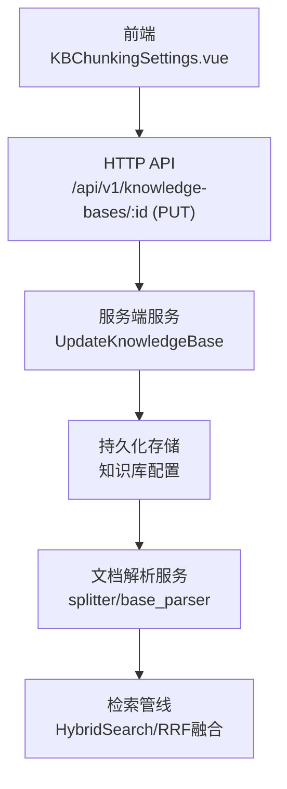
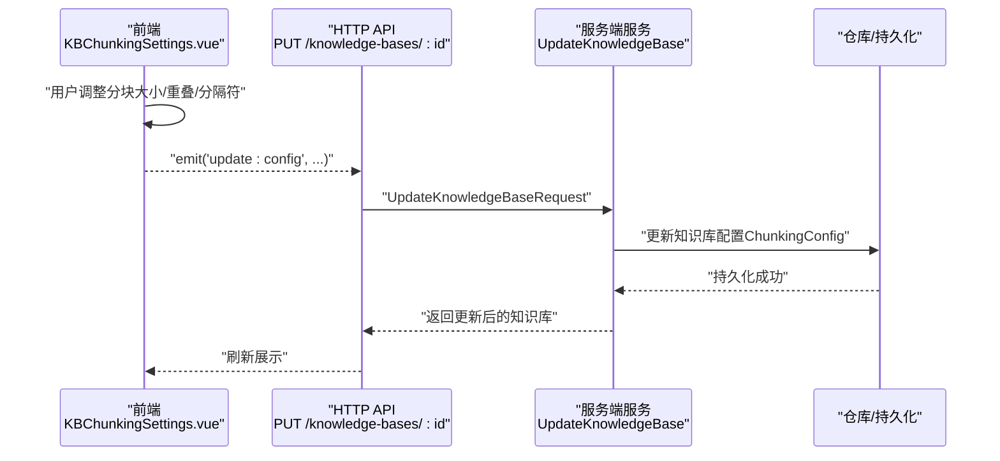
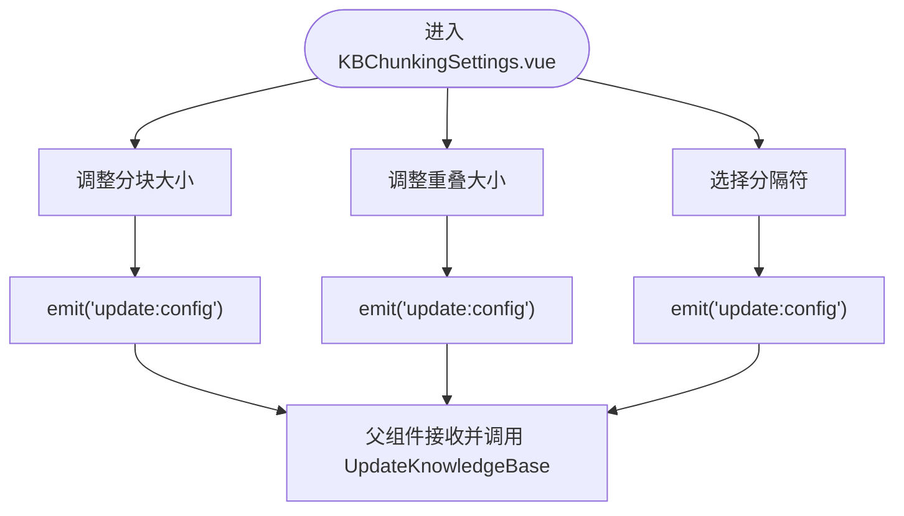
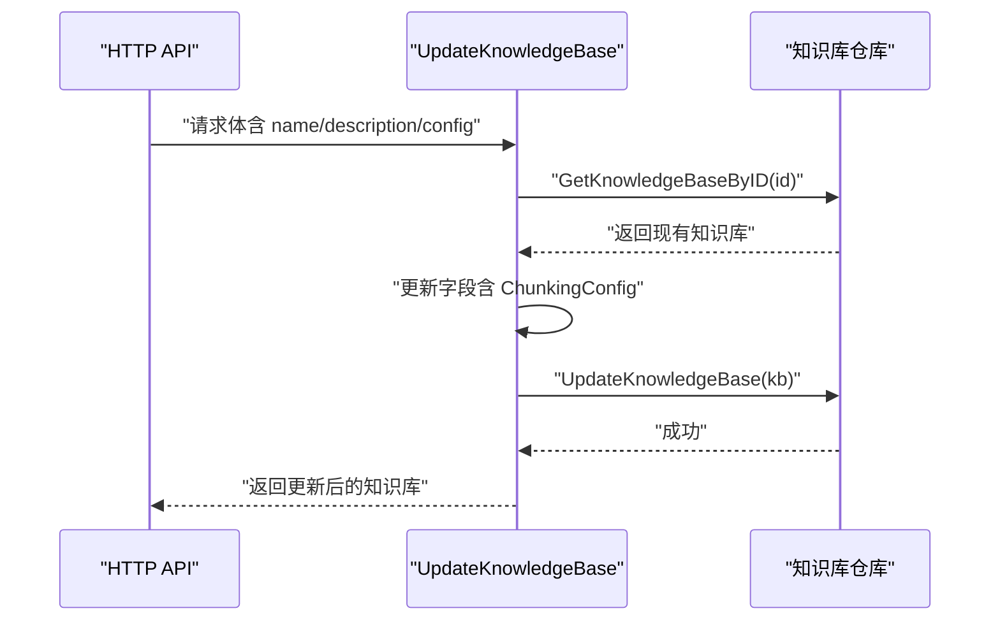
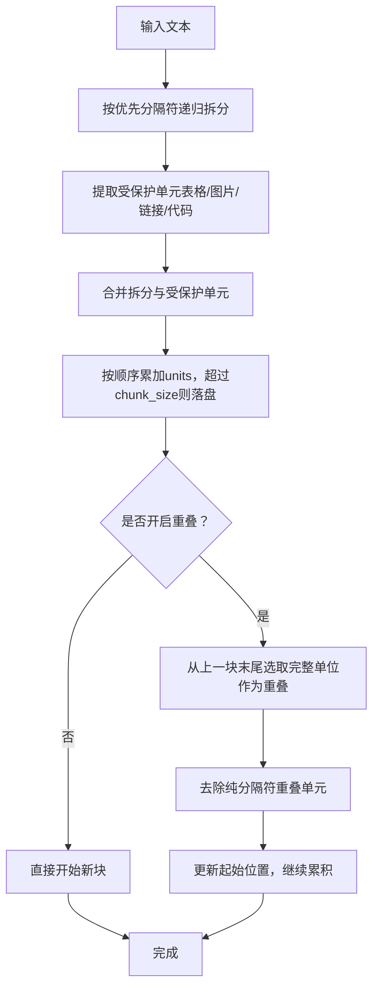
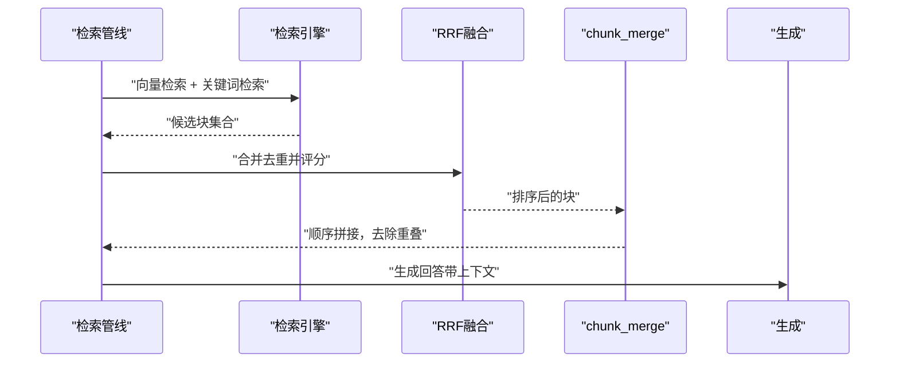
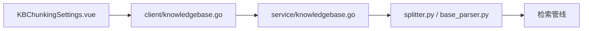

# 分块策略

<cite>
**本文引用的文件**
- [KBChunkingSettings.vue](file://frontend/src/views/knowledge/settings/KBChunkingSettings.vue)
- [knowledgebase.go（客户端）](file://client/knowledgebase.go)
- [knowledgebase.go（服务端）](file://internal/application/service/knowledgebase.go)
- [WeKnora.md](file://docs/Weknora.md)
- [knowledge-base.md（API 文档）](file://docs/api/knowledge-base.md)
- [splitter.py](file://docreader/splitter/splitter.py)
- [base_parser.py](file://docreader/parser/base_parser.py)
- [read_config.py](file://docreader/models/read_config.py)
- [merge.go](file://internal/application/service/chat_pipline/merge.go)
</cite>

## 目录
1. [简介](#简介)
2. [项目结构](#项目结构)
3. [核心组件](#核心组件)
4. [架构总览](#架构总览)
5. [详细组件分析](#详细组件分析)
6. [依赖分析](#依赖分析)
7. [性能考量](#性能考量)
8. [故障排查指南](#故障排查指南)
9. [结论](#结论)
10. [附录](#附录)

## 简介
本文件围绕“分块策略”展开，系统性说明如何通过前端组件 KBChunkingSettings.vue 配置知识库的分块大小（100–4000 字符）、重叠大小（0–500 字符）与分隔符；结合后端服务 UpdateKnowledgeBase 的配置更新流程，解释配置持久化过程；并深入阐述不同分块策略对检索效果的影响，给出面向技术文档、法律合同、学术论文等类型的分块策略最佳实践，强调分隔符选择对文档结构保持的重要性。

## 项目结构
WeKnora 的分块策略贯穿前端配置、API 请求、服务端持久化、文档解析与检索管线等多个环节：
- 前端：KBChunkingSettings.vue 提供滑块与分隔符选择，实时发出配置变更事件。
- 客户端：client/knowledgebase.go 定义 ChunkingConfig 数据结构与 UpdateKnowledgeBase 请求体。
- 服务端：internal/application/service/knowledgebase.go 实现 UpdateKnowledgeBase，将配置写入知识库实体并持久化。
- 文档解析：docreader/splitter/splitter.py 与 docreader/parser/base_parser.py 实现分块算法，尊重分隔符与受保护内容，维持结构完整性。
- 检索管线：docs/Weknora.md 展示检索流程，chunk_merge 等步骤进一步优化上下文连贯性。

图表来源
- [KBChunkingSettings.vue](file://frontend/src/views/knowledge/settings/KBChunkingSettings.vue#L1-L141)
- [knowledgebase.go（客户端）](file://client/knowledgebase.go#L190-L213)
- [knowledgebase.go（服务端）](file://internal/application/service/knowledgebase.go#L168-L213)
- [WeKnora.md](file://docs/Weknora.md#L199-L231)

章节来源
- [KBChunkingSettings.vue](file://frontend/src/views/knowledge/settings/KBChunkingSettings.vue#L1-L141)
- [knowledgebase.go（客户端）](file://client/knowledgebase.go#L190-L213)
- [knowledgebase.go（服务端）](file://internal/application/service/knowledgebase.go#L168-L213)
- [WeKnora.md](file://docs/Weknora.md#L199-L231)

## 核心组件
- 前端配置组件 KBChunkingSettings.vue
  - 提供分块大小（100–4000 字符）、重叠大小（0–500 字符）滑块与分隔符多选（换行、中文标点、英文分号、空格等）。
  - 通过 emit('update:config', ...) 将变更推送到父组件，父组件随后调用 UpdateKnowledgeBase。
- 客户端数据结构与请求
  - ChunkingConfig：包含 chunk_size、chunk_overlap、separators。
  - UpdateKnowledgeBaseRequest：封装 name、description 与 config。
- 服务端更新逻辑
  - UpdateKnowledgeBase：读取现有知识库，更新 ChunkingConfig 并持久化。

章节来源
- [KBChunkingSettings.vue](file://frontend/src/views/knowledge/settings/KBChunkingSettings.vue#L1-L141)
- [knowledgebase.go（客户端）](file://client/knowledgebase.go#L46-L51)
- [knowledgebase.go（客户端）](file://client/knowledgebase.go#L190-L213)
- [knowledgebase.go（服务端）](file://internal/application/service/knowledgebase.go#L168-L213)

## 架构总览
从前端到后端的分块配置更新链路如下：

图表来源
- [KBChunkingSettings.vue](file://frontend/src/views/knowledge/settings/KBChunkingSettings.vue#L118-L141)
- [knowledgebase.go（客户端）](file://client/knowledgebase.go#L190-L213)
- [knowledgebase.go（服务端）](file://internal/application/service/knowledgebase.go#L168-L213)

## 详细组件分析

### 前端组件：KBChunkingSettings.vue
- 功能要点
  - 分块大小滑块：100–4000，步进 50，带刻度标注。
  - 重叠大小滑块：0–500，步进 20，带刻度标注。
  - 分隔符选择：多选，支持双换行、单换行、中文句号/感叹号/问号、中文分号、英文分号、空格。
  - 响应式更新：watch props 变化，emitUpdate 向父组件同步最新配置。
- 交互流程
  - 用户拖动滑块或切换分隔符，触发 handleXxxChange，最终 emitUpdate 触发父组件更新。

图表来源
- [KBChunkingSettings.vue](file://frontend/src/views/knowledge/settings/KBChunkingSettings.vue#L118-L141)

章节来源
- [KBChunkingSettings.vue](file://frontend/src/views/knowledge/settings/KBChunkingSettings.vue#L1-L141)

### 客户端数据结构与请求
- ChunkingConfig
  - 字段：chunk_size、chunk_overlap、separators。
- UpdateKnowledgeBaseRequest
  - 字段：name、description、config（包含 ChunkingConfig）。
- 客户端方法 UpdateKnowledgeBase
  - 发起 PUT 请求至 /api/v1/knowledge-bases/{id}，解析响应并返回知识库对象。

章节来源
- [knowledgebase.go（客户端）](file://client/knowledgebase.go#L46-L51)
- [knowledgebase.go（客户端）](file://client/knowledgebase.go#L190-L213)

### 服务端更新逻辑：UpdateKnowledgeBase
- 业务流程
  - 校验知识库 ID 非空。
  - 读取现有知识库。
  - 更新名称、描述、ChunkingConfig、图像处理配置（如有）、FAQ 配置（如有）。
  - 写回持久化存储。
- 注意事项
  - 更新时间戳与默认值处理。
  - 错误日志记录与返回。

图表来源
- [knowledgebase.go（服务端）](file://internal/application/service/knowledgebase.go#L168-L213)

章节来源
- [knowledgebase.go（服务端）](file://internal/application/service/knowledgebase.go#L168-L213)

### 文档解析与分块算法：splitter.py 与 base_parser.py
- splitter.py
  - TextSplitter：支持 chunk_size、chunk_overlap、separators、受保护正则（公式、图片、链接、表格、代码块）、长度函数。
  - split_text：递归按优先分隔符拆分，保护原子单元，再合并为带重叠的最终块。
- base_parser.py
  - _split_into_units：将最终文本按 Markdown 表格、图片占位符等原子单元切分，保证顺序。
  - chunk_text：按 units 顺序累加，超过 chunk_size 时落盘并保留重叠，重叠单位剔除纯分隔符，确保结构完整性。
  - 重叠计算：从上一块末尾反向选取完整单位，直至满足重叠目标，避免截断表格/图片等。
- read_config.py
  - ChunkingConfig：默认 chunk_size、chunk_overlap、separators（中文常见分隔符优先）。

图表来源
- [splitter.py](file://docreader/splitter/splitter.py#L116-L140)
- [splitter.py](file://docreader/splitter/splitter.py#L142-L177)
- [splitter.py](file://docreader/splitter/splitter.py#L179-L200)
- [base_parser.py](file://docreader/parser/base_parser.py#L500-L615)
- [read_config.py](file://docreader/models/read_config.py#L1-L27)

章节来源
- [splitter.py](file://docreader/splitter/splitter.py#L1-L200)
- [splitter.py](file://docreader/splitter/splitter.py#L116-L140)
- [splitter.py](file://docreader/splitter/splitter.py#L142-L177)
- [splitter.py](file://docreader/splitter/splitter.py#L179-L200)
- [base_parser.py](file://docreader/parser/base_parser.py#L500-L615)
- [read_config.py](file://docreader/models/read_config.py#L1-L27)

### 检索管线与上下文合并：WeKnora.md 与 merge.go
- WeKnora.md 展示检索流程：两次混合搜索（向量+关键词）后进行 RRF 融合，随后 chunk_merge 合并相邻块，提升上下文连贯性。
- merge.go
  - 通过前后相邻块 ID 顺序拼接，避免重叠前缀/后缀重复，必要时扩展上下文，最终裁剪到最大长度。
  - 保证同一知识内的块顺序与上下文完整性。

图表来源
- [WeKnora.md](file://docs/Weknora.md#L199-L231)
- [merge.go](file://internal/application/service/chat_pipline/merge.go#L472-L519)
- [merge.go](file://internal/application/service/chat_pipline/merge.go#L570-L633)

章节来源
- [WeKnora.md](file://docs/Weknora.md#L199-L231)
- [merge.go](file://internal/application/service/chat_pipline/merge.go#L472-L519)
- [merge.go](file://internal/application/service/chat_pipline/merge.go#L570-L633)

## 依赖分析
- 前端依赖
  - KBChunkingSettings.vue 依赖 i18n 与 UI 组件库，通过 emit 事件向上游传递配置。
- 客户端依赖
  - client/knowledgebase.go 定义 ChunkingConfig 与 UpdateKnowledgeBase 请求体，封装 HTTP PUT 调用。
- 服务端依赖
  - knowledgebase.go（服务端）依赖仓库接口、日志、模型服务、检索引擎等，实现 UpdateKnowledgeBase。
- 文档解析依赖
  - splitter.py 与 base_parser.py 依赖正则、长度函数、受保护单元规则，确保结构完整性。
- 检索管线依赖
  - WeKnora.md 与 merge.go 依赖 chunk 顺序与 ID 关系，保障上下文拼接正确。

图表来源
- [KBChunkingSettings.vue](file://frontend/src/views/knowledge/settings/KBChunkingSettings.vue#L1-L141)
- [knowledgebase.go（客户端）](file://client/knowledgebase.go#L190-L213)
- [knowledgebase.go（服务端）](file://internal/application/service/knowledgebase.go#L168-L213)
- [splitter.py](file://docreader/splitter/splitter.py#L1-L200)
- [base_parser.py](file://docreader/parser/base_parser.py#L500-L615)
- [WeKnora.md](file://docs/Weknora.md#L199-L231)

章节来源
- [knowledgebase.go（客户端）](file://client/knowledgebase.go#L190-L213)
- [knowledgebase.go（服务端）](file://internal/application/service/knowledgebase.go#L168-L213)
- [splitter.py](file://docreader/splitter/splitter.py#L1-L200)
- [base_parser.py](file://docreader/parser/base_parser.py#L500-L615)
- [WeKnora.md](file://docs/Weknora.md#L199-L231)

## 性能考量
- 分块大小与重叠
  - 大分块：提升上下文完整性，有利于复杂推理与长段落理解，但可能降低检索精度，增加向量空间稀疏性与检索开销。
  - 小分块：提升检索精度与召回覆盖，便于关键词匹配，但可能丢失上下文，增加 RRF 融合与 chunk_merge 的复杂度。
  - 重叠：保留跨块边界信息，减少检索边界处的语义断裂，但会增加向量维度与存储/索引成本。
- 分隔符选择
  - 优先使用符合文档结构的分隔符（如中文句号、换行、分号），有助于保持段落与标题层级的完整性，减少跨单元截断。
  - 对表格、图片、代码块等受保护单元，需确保不分割，避免破坏结构。
- 检索与生成
  - RRF 融合与 chunk_merge 会增加后处理成本，合理设置 match_count 与 TopK 可平衡性能与质量。
  - 多模态（图片）处理在解析阶段并发执行，对分块策略影响较小，但会增加存储与网络开销。

[本节为通用指导，无需列出具体文件来源]

## 故障排查指南
- 前端配置未生效
  - 确认 KBChunkingSettings.vue 已 emit('update:config')，父组件已调用 UpdateKnowledgeBase。
  - 检查网络面板，确认 PUT /api/v1/knowledge-bases/:id 返回成功。
- 服务端更新失败
  - 查看服务端日志，关注知识库 ID 校验、仓库更新异常、错误字段。
  - 确保请求体包含合法的 chunk_size、chunk_overlap、separators。
- 解析后分块异常
  - 检查分隔符是否覆盖文档结构（如中文句号、换行、分号）。
  - 若表格/图片被截断，确认受保护单元规则是否生效。
- 检索结果上下文不完整
  - 调整 chunk_overlap，确保跨块边界保留足够上下文。
  - 检查 chunk_merge 是否正确拼接相邻块，避免重叠前缀/后缀重复。

章节来源
- [KBChunkingSettings.vue](file://frontend/src/views/knowledge/settings/KBChunkingSettings.vue#L118-L141)
- [knowledgebase.go（客户端）](file://client/knowledgebase.go#L190-L213)
- [knowledgebase.go（服务端）](file://internal/application/service/knowledgebase.go#L168-L213)
- [splitter.py](file://docreader/splitter/splitter.py#L1-L200)
- [base_parser.py](file://docreader/parser/base_parser.py#L500-L615)
- [merge.go](file://internal/application/service/chat_pipline/merge.go#L472-L519)

## 结论
- 分块策略直接影响检索精度与上下文完整性。前端提供直观配置入口，服务端负责持久化，解析阶段严格遵循分隔符与受保护单元规则，确保结构完整性；检索管线通过 RRF 融合与 chunk_merge 进一步优化上下文连贯性。
- 不同文档类型应采用差异化策略：技术文档偏小分块+高重叠；法律合同强调结构完整性与跨段落上下文；学术论文兼顾段落与公式/表格的受保护处理。
- 分隔符选择至关重要，应与文档语言与结构相匹配，避免跨单元截断。

[本节为总结性内容，无需列出具体文件来源]

## 附录

### 不同内容类型的分块策略最佳实践
- 技术文档
  - 建议：较小分块（如 500–1000 字符），适度重叠（10%–20%），分隔符优先换行与中文句号。
  - 目的：提升关键词命中与检索精度，便于代码/公式/表格片段定位。
- 法律合同
  - 建议：中等分块（1000–2000 字符），较高重叠（20%–30%），分隔符优先段落换行与中文标点。
  - 目的：保持条款与上下文的完整性，避免跨条文断句导致歧义。
- 学术论文
  - 建议：较大分块（2000–3000 字符），中等重叠（10%–20%），分隔符优先段落换行与中文句号。
  - 目的：减少跨段落截断，保留公式/图表上下文；同时通过重叠缓解检索边界语义断裂。

[本节为通用指导，无需列出具体文件来源]

### 分隔符选择对文档结构保持的重要性
- 正确的分隔符能有效保留段落、标题、表格、图片、代码块等结构单元的完整性，避免跨单元截断带来的语义损失。
- splitter.py 与 base_parser.py 的受保护单元与原子化切分机制，确保表格、图片、链接、代码块等在分块过程中不被破坏。

章节来源
- [splitter.py](file://docreader/splitter/splitter.py#L1-L200)
- [base_parser.py](file://docreader/parser/base_parser.py#L500-L615)
- [read_config.py](file://docreader/models/read_config.py#L1-L27)