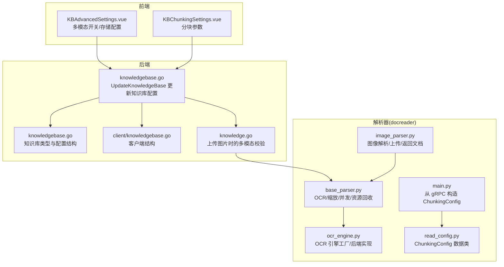
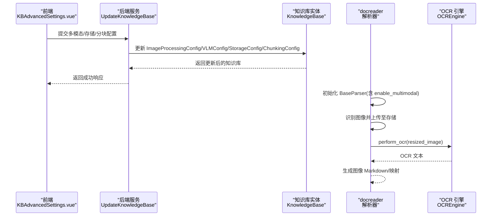
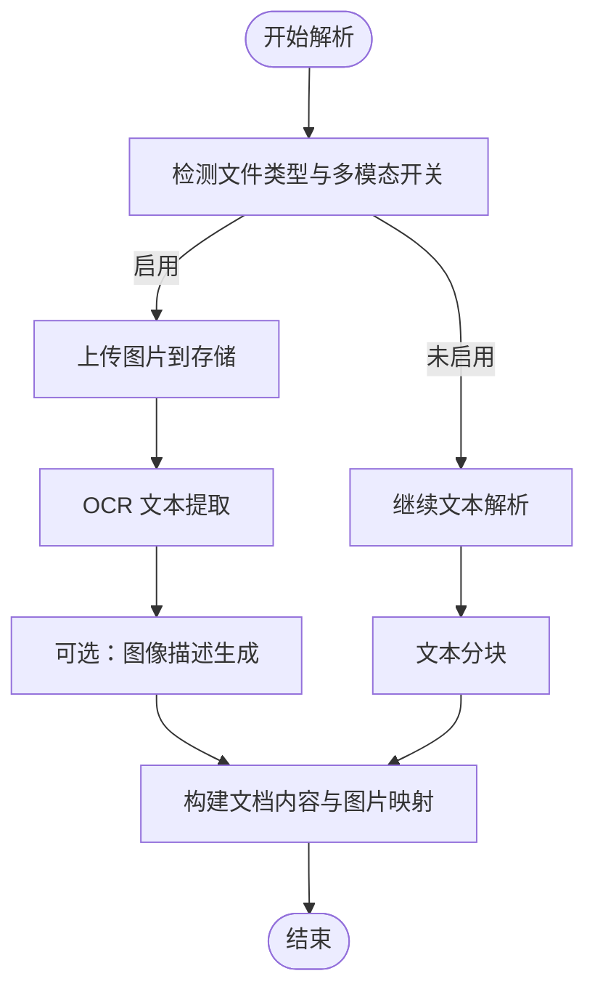
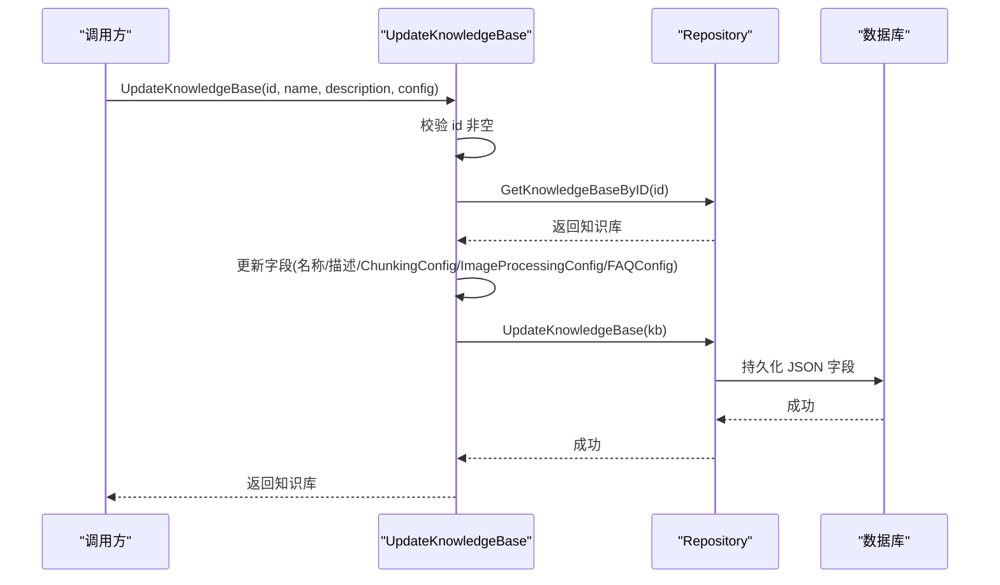
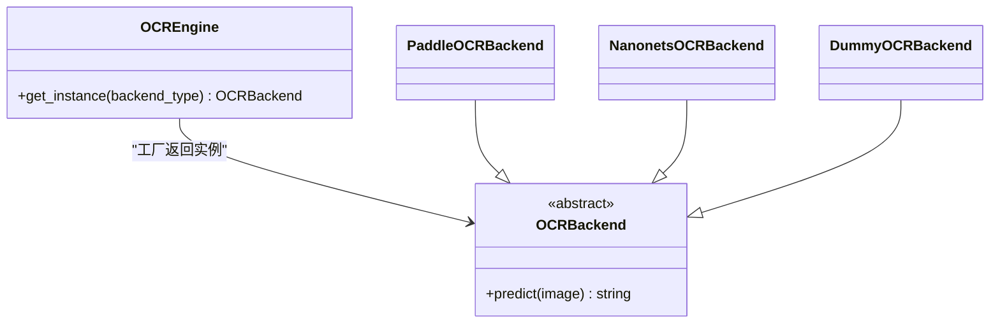
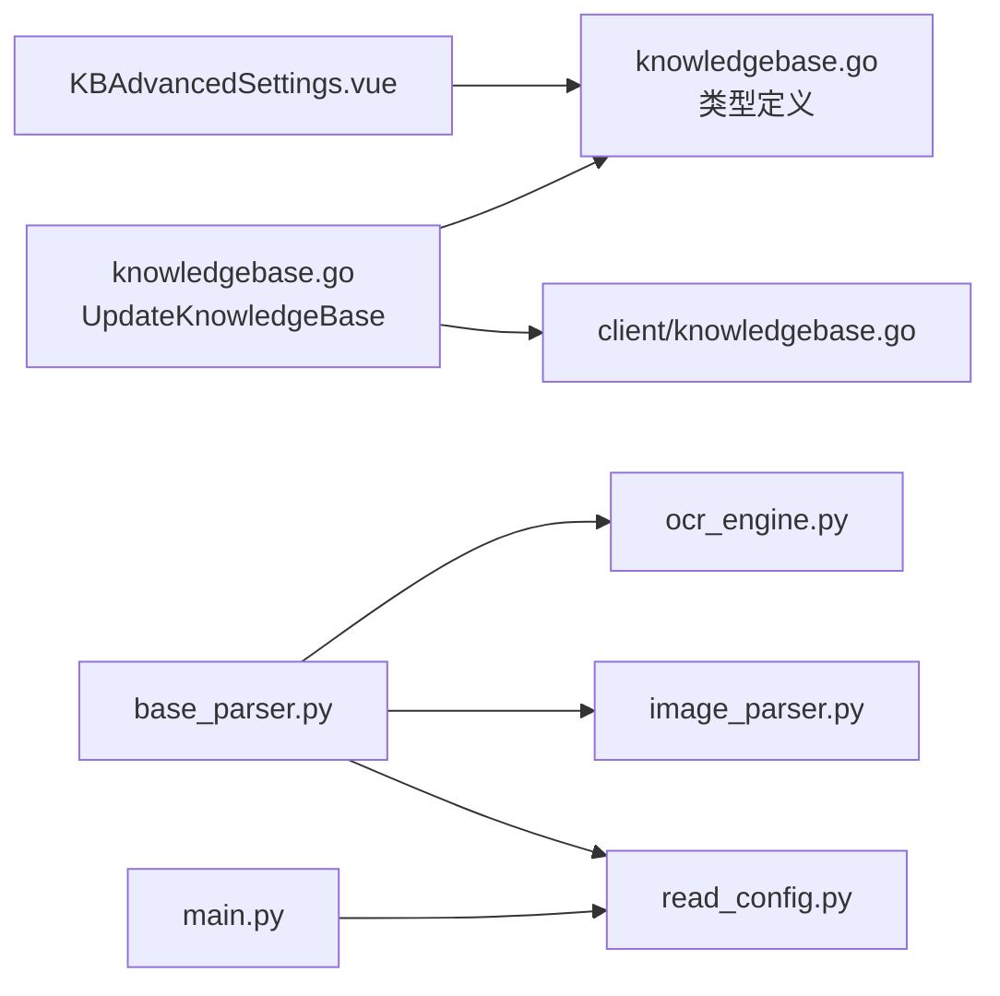

# 图像处理配置

<cite>
**本文引用的文件**
- [knowledgebase.go](file://internal/application/service/knowledgebase.go)
- [knowledgebase.go](file://internal/types/knowledgebase.go)
- [knowledgebase.go](file://client/knowledgebase.go)
- [image_parser.py](file://docreader/parser/image_parser.py)
- [base_parser.py](file://docreader/parser/base_parser.py)
- [ocr_engine.py](file://docreader/parser/ocr_engine.py)
- [read_config.py](file://docreader/models/read_config.py)
- [main.py](file://docreader/main.py)
- [KBAdvancedSettings.vue](file://frontend/src/views/knowledge/settings/KBAdvancedSettings.vue)
- [KBChunkingSettings.vue](file://frontend/src/views/knowledge/settings/KBChunkingSettings.vue)
- [knowledge.go](file://internal/application/service/knowledge.go)
</cite>

## 目录
1. [简介](#简介)
2. [项目结构](#项目结构)
3. [核心组件](#核心组件)
4. [架构总览](#架构总览)
5. [详细组件分析](#详细组件分析)
6. [依赖关系分析](#依赖关系分析)
7. [性能考量](#性能考量)
8. [故障排查指南](#故障排查指南)
9. [结论](#结论)
10. [附录](#附录)

## 简介
本文件面向知识库管理员与开发者，系统性说明如何配置与使用知识库的图像处理能力。重点覆盖：
- ImageProcessingConfig 的参数与含义
- 多模态（图像+文本）处理流程与 OCR 引擎选择
- 配置更新的持久化路径（后端服务 UpdateKnowledgeBase）
- 文档解析流程中图像处理的作用
- 与 docreader 组件（image_parser.py、base_parser.py、ocr_engine.py）的协同方式
- 对处理时间与资源消耗的影响评估及在准确性与效率之间的最佳实践

## 项目结构
围绕“图像处理配置”的关键文件分布如下：
- 后端类型与服务层：知识库实体、配置结构、更新服务
- 前端设置界面：多模态开关、存储配置、模型选择
- 文档解析器：图像解析、OCR 执行、并发控制与资源回收
- 读取请求配置：从 gRPC 请求构造分块与多模态配置

图表来源
- [knowledgebase.go](file://internal/application/service/knowledgebase.go#L168-L213)
- [knowledgebase.go](file://internal/types/knowledgebase.go#L38-L106)
- [client/knowledgebase.go](file://client/knowledgebase.go#L14-L37)
- [image_parser.py](file://docreader/parser/image_parser.py#L1-L45)
- [base_parser.py](file://docreader/parser/base_parser.py#L100-L299)
- [ocr_engine.py](file://docreader/parser/ocr_engine.py#L301-L335)
- [read_config.py](file://docreader/models/read_config.py#L1-L28)
- [main.py](file://docreader/main.py#L67-L127)

章节来源
- [knowledgebase.go](file://internal/application/service/knowledgebase.go#L168-L213)
- [knowledgebase.go](file://internal/types/knowledgebase.go#L38-L106)
- [client/knowledgebase.go](file://client/knowledgebase.go#L14-L37)
- [image_parser.py](file://docreader/parser/image_parser.py#L1-L45)
- [base_parser.py](file://docreader/parser/base_parser.py#L100-L299)
- [ocr_engine.py](file://docreader/parser/ocr_engine.py#L301-L335)
- [read_config.py](file://docreader/models/read_config.py#L1-L28)
- [main.py](file://docreader/main.py#L67-L127)

## 核心组件
- ImageProcessingConfig
  - 字段：ModelID（多模态模型 ID）
  - 用途：标识知识库使用的多模态模型，用于图像描述生成与 OCR 等能力
- ChunkingConfig
  - 字段：chunk_size、chunk_overlap、separators、enable_multimodal、storage_config、vlm_config
  - 用途：控制文本分块策略与多模态处理开关、存储与视觉语言模型配置
- VLMConfig
  - 字段：enabled、model_id、model_name、base_url、api_key、interface_type
  - 用途：多模态（VLM）能力的启用与接口参数
- StorageConfig
  - 字段：secret_id、secret_key、region、bucket_name、app_id、path_prefix、provider
  - 用途：对象存储（COS/MinIO）配置，用于图像上传与访问

章节来源
- [knowledgebase.go](file://internal/types/knowledgebase.go#L141-L145)
- [read_config.py](file://docreader/models/read_config.py#L1-L28)
- [knowledgebase.go](file://internal/types/knowledgebase.go#L181-L195)
- [knowledgebase.go](file://internal/types/knowledgebase.go#L108-L124)

## 架构总览
图像处理在知识库中的位置与调用链如下：
- 前端通过 KBAdvancedSettings.vue 与 KBChunkingSettings.vue 设置多模态开关、存储与分块参数
- 后端服务 UpdateKnowledgeBase 将配置写入知识库实体并持久化
- 文档解析阶段（docreader）根据 ChunkingConfig.enable_multimodal 决定是否启用图像处理
- 图像解析由 image_parser.py 完成，随后 base_parser.py 执行 OCR、缩放、并发控制与资源回收
- OCR 引擎通过 ocr_engine.py 工厂选择具体后端（如 nanonets/paddle/dummy）

图表来源
- [knowledgebase.go](file://internal/application/service/knowledgebase.go#L168-L213)
- [image_parser.py](file://docreader/parser/image_parser.py#L24-L45)
- [base_parser.py](file://docreader/parser/base_parser.py#L134-L181)
- [ocr_engine.py](file://docreader/parser/ocr_engine.py#L301-L335)

## 详细组件分析

### ImageProcessingConfig 参数说明
- ModelID
  - 含义：多模态模型 ID，用于图像描述生成与 OCR 等能力
  - 影响：决定前端多模态开关下的 VLM 模型选择与后端存储配置
- 与 VLMConfig 的关系
  - ImageProcessingConfig 仅包含 ModelID；VLMConfig 提供更完整的启用与接口参数
  - 在前端 KBAdvancedSettings.vue 中，多模态开启时需选择 VLLM 模型并配置存储

章节来源
- [knowledgebase.go](file://internal/types/knowledgebase.go#L141-L145)
- [client/knowledgebase.go](file://client/knowledgebase.go#L59-L61)
- [KBAdvancedSettings.vue](file://frontend/src/views/knowledge/settings/KBAdvancedSettings.vue#L45-L120)

### 多模态与图像处理流程
- 前端设置
  - 多模态开关：KBAdvancedSettings.vue 提供开关与存储类型选择（MinIO/COS）
  - VLLM 模型选择：选择后端可用的多模态模型 ID
- 后端持久化
  - UpdateKnowledgeBase 将 ImageProcessingConfig、VLMConfig、StorageConfig、ChunkingConfig 写入知识库实体并保存
- 解析阶段
  - image_parser.py：对图片文件执行上传、生成 Markdown 图片引用
  - base_parser.py：对支持的文件类型（PDF/DOCX/图片等）启用多模态，执行 OCR、缩放、并发处理与资源回收
  - ocr_engine.py：工厂模式选择 OCR 后端（nanonets/paddle/dummy），并封装调用

图表来源
- [image_parser.py](file://docreader/parser/image_parser.py#L24-L45)
- [base_parser.py](file://docreader/parser/base_parser.py#L134-L181)
- [base_parser.py](file://docreader/parser/base_parser.py#L183-L296)
- [ocr_engine.py](file://docreader/parser/ocr_engine.py#L301-L335)

章节来源
- [image_parser.py](file://docreader/parser/image_parser.py#L1-L45)
- [base_parser.py](file://docreader/parser/base_parser.py#L100-L299)
- [ocr_engine.py](file://docreader/parser/ocr_engine.py#L190-L335)

### 配置更新的持久化过程（UpdateKnowledgeBase）
- 输入：知识库 ID、名称、描述、配置对象（包含 ChunkingConfig、ImageProcessingConfig、FAQConfig 等）
- 步骤：
  - 校验 ID 非空
  - 查询现有知识库
  - 更新名称、描述、ChunkingConfig、ImageProcessingConfig、FAQConfig（若提供）
  - 保存并返回更新后的知识库
- 关键点：
  - ImageProcessingConfig 作为 JSON 字段写入数据库
  - VLMConfig、StorageConfig、ChunkingConfig 同样以 JSON 字段形式持久化

图表来源
- [knowledgebase.go](file://internal/application/service/knowledgebase.go#L168-L213)
- [knowledgebase.go](file://internal/types/knowledgebase.go#L38-L106)

章节来源
- [knowledgebase.go](file://internal/application/service/knowledgebase.go#L168-L213)
- [knowledgebase.go](file://internal/types/knowledgebase.go#L38-L106)

### OCR 引擎选择与图像质量处理
- OCR 引擎选择
  - 工厂类 OCREngine.get_instance 根据 backend_type 返回实例
  - 支持类型：paddle、nanonets、dummy
  - 环境变量：OCR_BACKEND、OCR_API_BASE_URL、OCR_API_KEY、OCR_MODEL
- 图像质量与尺寸控制
  - base_parser.py 在 OCR 前对图像进行缩放，避免过大图片导致内存与耗时问题
  - 并发控制：通过信号量限制同时处理的图像数量，防止资源争用
  - 资源回收：异步处理完成后关闭图像对象，减少内存占用

图表来源
- [ocr_engine.py](file://docreader/parser/ocr_engine.py#L301-L335)

章节来源
- [ocr_engine.py](file://docreader/parser/ocr_engine.py#L190-L335)
- [base_parser.py](file://docreader/parser/base_parser.py#L134-L181)
- [base_parser.py](file://docreader/parser/base_parser.py#L183-L296)

### 文档解析流程中的图像处理作用
- 图像解析
  - image_parser.py：将图片上传到存储，生成 Markdown 图片引用，返回包含图片映射的文档对象
- 文本分块与图像处理
  - base_parser.py：在多模态启用时，对 PDF/DOCX/图片等文件进行图像识别与文本抽取，再进行文本分块
  - 并发处理：对多个图像进行并发 OCR 与描述生成，同时限制最大并发度
- 存储与访问
  - 支持本地存储、Base64 内嵌与对象存储（MinIO/COS），由 create_storage 根据配置创建

章节来源
- [image_parser.py](file://docreader/parser/image_parser.py#L24-L45)
- [base_parser.py](file://docreader/parser/base_parser.py#L361-L386)
- [base_parser.py](file://docreader/parser/base_parser.py#L868-L899)
- [docreader/parser/storage.py](file://docreader/parser/storage.py#L379-L414)

### 与 docreader 的协同
- main.py：从 gRPC 请求读取 chunk_size、chunk_overlap、separators、enable_multimodal、storage_config、vlm_config，构造 ChunkingConfig
- read_config.py：定义 ChunkingConfig 数据类，包含分块参数与多模态开关
- base_parser.py：初始化时读取 ChunkingConfig，决定是否启用 Caption 服务与 OCR 后端

章节来源
- [main.py](file://docreader/main.py#L67-L127)
- [read_config.py](file://docreader/models/read_config.py#L1-L28)
- [base_parser.py](file://docreader/parser/base_parser.py#L100-L121)

## 依赖关系分析
- 前端依赖后端类型结构
  - KBAdvancedSettings.vue 依赖 VLMConfig、StorageConfig、ImageProcessingConfig 的字段
- 后端服务依赖类型定义
  - UpdateKnowledgeBase 依赖 KnowledgeBase、KnowledgeBaseConfig、ImageProcessingConfig
- 解析器依赖配置与存储
  - base_parser.py 依赖 ChunkingConfig、OCR 引擎、存储实现
  - image_parser.py 依赖存储上传能力

图表来源
- [KBAdvancedSettings.vue](file://frontend/src/views/knowledge/settings/KBAdvancedSettings.vue#L45-L120)
- [knowledgebase.go](file://internal/application/service/knowledgebase.go#L168-L213)
- [knowledgebase.go](file://internal/types/knowledgebase.go#L38-L106)
- [client/knowledgebase.go](file://client/knowledgebase.go#L14-L37)
- [base_parser.py](file://docreader/parser/base_parser.py#L100-L121)
- [ocr_engine.py](file://docreader/parser/ocr_engine.py#L301-L335)
- [image_parser.py](file://docreader/parser/image_parser.py#L24-L45)
- [read_config.py](file://docreader/models/read_config.py#L1-L28)
- [main.py](file://docreader/main.py#L67-L127)

章节来源
- [KBAdvancedSettings.vue](file://frontend/src/views/knowledge/settings/KBAdvancedSettings.vue#L45-L120)
- [knowledgebase.go](file://internal/application/service/knowledgebase.go#L168-L213)
- [knowledgebase.go](file://internal/types/knowledgebase.go#L38-L106)
- [client/knowledgebase.go](file://client/knowledgebase.go#L14-L37)
- [base_parser.py](file://docreader/parser/base_parser.py#L100-L121)
- [ocr_engine.py](file://docreader/parser/ocr_engine.py#L301-L335)
- [image_parser.py](file://docreader/parser/image_parser.py#L24-L45)
- [read_config.py](file://docreader/models/read_config.py#L1-L28)
- [main.py](file://docreader/main.py#L67-L127)

## 性能考量
- 处理时间影响因素
  - 图像尺寸：base_parser.py 会对超限图片进行缩放，避免 OCR 与描述生成耗时过长
  - 并发度：通过信号量限制并发，防止 CPU/内存峰值过高
  - OCR 后端：不同后端的响应时间与准确性存在差异，需结合实际部署环境选择
  - 分块大小：较大的 chunk_size 会减少分块数量，但可能降低检索精度；较小的 chunk_size 会提升召回但增加处理量
- 资源消耗
  - 内存：图像解码与 OCR 推理会占用显存/内存，需合理设置并发与最大图像尺寸
  - 存储：图片上传与缓存策略会影响对象存储成本与延迟
- 准确性与效率平衡建议
  - 优先保证 OCR 后端稳定性与准确性，再考虑并发与尺寸优化
  - 对于高分辨率图片，适当缩小尺寸以换取更快响应
  - 控制并发度，避免资源争用导致整体吞吐下降
  - 结合业务场景调整分块大小与重叠，兼顾召回与效率

[本节为通用性能讨论，无需列出具体文件来源]

## 故障排查指南
- 多模态配置不完整
  - 现象：上传图片文件时报错，提示对象存储配置不完整
  - 原因：StorageConfig 缺少必要字段（MinIO/COS）
  - 处理：在前端 KBAdvancedSettings.vue 中补齐存储配置并保存
- OCR 调用失败
  - 现象：OCR 返回空文本或报错
  - 原因：OCR 后端初始化失败、网络异常或超时
  - 处理：检查 OCR_API_BASE_URL、OCR_API_KEY、OCR_MODEL 环境变量；确认后端服务可达
- 图像处理异常
  - 现象：并发处理中出现异常或资源泄漏
  - 原因：图像对象未正确关闭或并发超限
  - 处理：确保 base_parser.py 的资源回收逻辑生效；适当降低并发度

章节来源
- [knowledge.go](file://internal/application/service/knowledge.go#L148-L177)
- [ocr_engine.py](file://docreader/parser/ocr_engine.py#L216-L225)
- [base_parser.py](file://docreader/parser/base_parser.py#L183-L296)

## 结论
- ImageProcessingConfig 的核心是 ModelID，用于标识多模态模型；VLMConfig 与 StorageConfig 提供更完整的运行时参数
- UpdateKnowledgeBase 将配置持久化到知识库实体，前端通过 KBAdvancedSettings.vue 与 KBChunkingSettings.vue 进行可视化配置
- docreader 的 image_parser.py、base_parser.py、ocr_engine.py 协同完成图像上传、OCR、缩放、并发与资源回收
- 在准确性与效率之间取得平衡的关键在于：合理的图像尺寸、并发度与分块策略，以及稳定的 OCR 后端

[本节为总结性内容，无需列出具体文件来源]

## 附录
- 前端设置入口
  - 多模态开关与存储配置：KBAdvancedSettings.vue
  - 分块参数：KBChunkingSettings.vue
- 后端配置入口
  - UpdateKnowledgeBase：更新知识库配置
- 解析器配置入口
  - main.py：从 gRPC 构造 ChunkingConfig
  - read_config.py：ChunkingConfig 数据类

章节来源
- [KBAdvancedSettings.vue](file://frontend/src/views/knowledge/settings/KBAdvancedSettings.vue#L45-L120)
- [KBChunkingSettings.vue](file://frontend/src/views/knowledge/settings/KBChunkingSettings.vue#L1-L230)
- [knowledgebase.go](file://internal/application/service/knowledgebase.go#L168-L213)
- [main.py](file://docreader/main.py#L67-L127)
- [read_config.py](file://docreader/models/read_config.py#L1-L28)