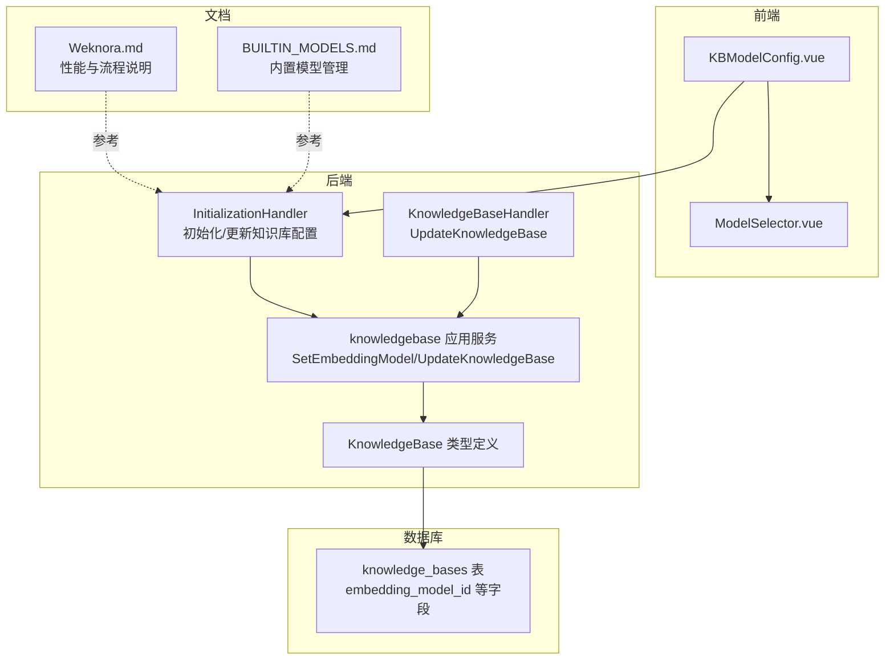
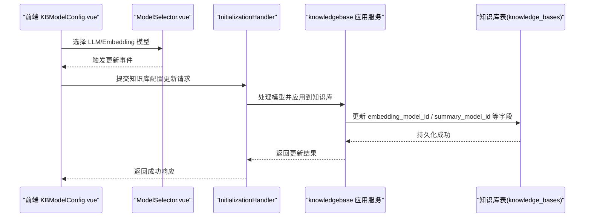
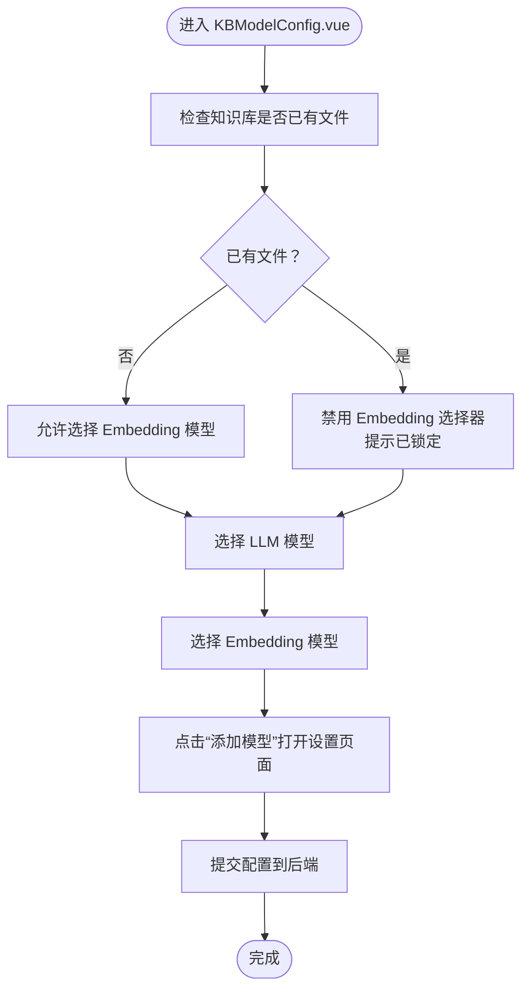
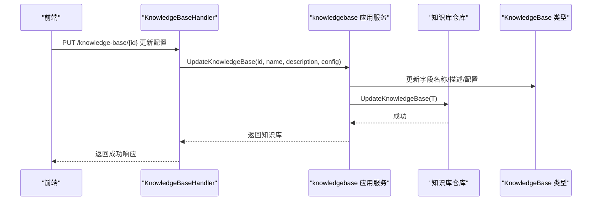
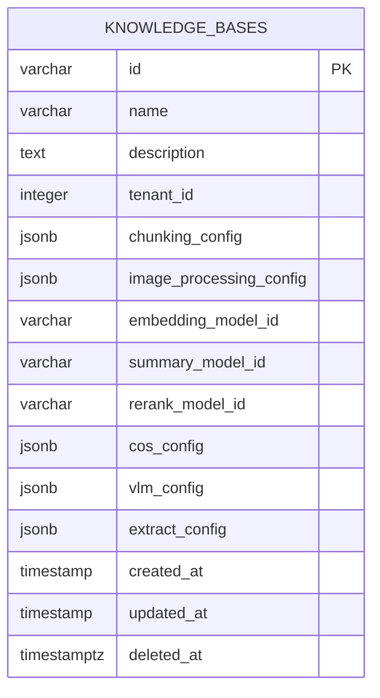
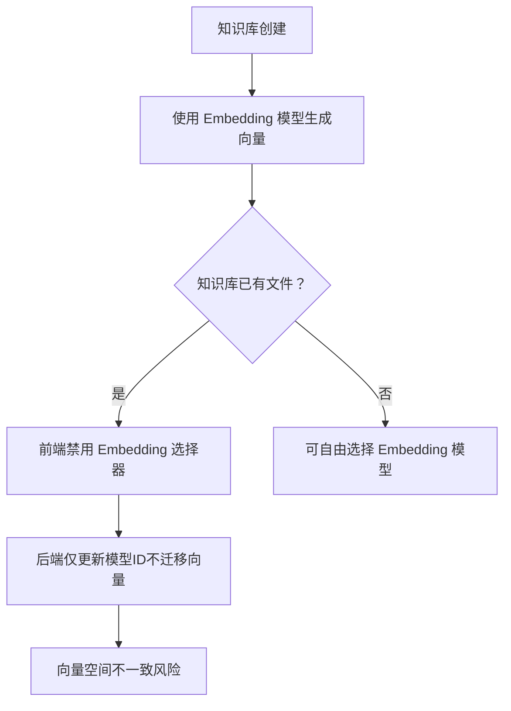
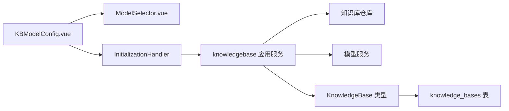

# 模型配置

<cite>
**本文引用的文件**
- [KBModelConfig.vue](file://frontend/src/views/knowledge/settings/KBModelConfig.vue)
- [ModelSelector.vue](file://frontend/src/components/ModelSelector.vue)
- [knowledgebase.go](file://internal/handler/knowledgebase.go)
- [knowledgebase.go](file://internal/application/service/knowledgebase.go)
- [initialization.go](file://internal/handler/initialization.go)
- [knowledgebase.go](file://internal/types/knowledgebase.go)
- [00-init-db.sql](file://migrations/paradedb/00-init-db.sql)
- [Weknora.md](file://docs/Weknora.md)
- [BUILTIN_MODELS.md](file://docs/BUILTIN_MODELS.md)
</cite>

## 目录
1. [简介](#简介)
2. [项目结构](#项目结构)
3. [核心组件](#核心组件)
4. [架构总览](#架构总览)
5. [详细组件分析](#详细组件分析)
6. [依赖关系分析](#依赖关系分析)
7. [性能考量](#性能考量)
8. [故障排查指南](#故障排查指南)
9. [结论](#结论)
10. [附录](#附录)

## 简介
本文件面向知识库运营与开发者，系统性说明如何通过前端组件 KBModelConfig.vue 为知识库配置大语言模型（LLM）与嵌入模型（Embedding），并解释嵌入模型一旦选定在知识库创建后不可更改的原因（避免向量空间不一致）。同时，结合后端服务 UpdateKnowledgeBase 与初始化流程，说明模型配置的持久化过程；并提供模型切换的可行方案（新建知识库）。最后引用 WeKnora.md 的性能说明，给出不同模型（如 Qwen、DeepSeek）在准确性和速度方面的对比建议，帮助用户根据应用场景选择合适的模型组合。

## 项目结构
围绕“模型配置”的关键文件分布如下：
- 前端：KBModelConfig.vue 负责展示与编辑知识库的 LLM 与 Embedding 模型；ModelSelector.vue 提供模型选择器能力。
- 后端：InitializationHandler 与 KnowledgeBaseHandler 负责知识库初始化与更新；knowledgebase 应用服务负责业务逻辑与持久化；KnowledgeBase 类型定义知识库实体字段。
- 数据库：迁移脚本定义知识库表结构，包含 embedding_model_id 等字段。
- 文档：Weknora.md 提供性能与流程说明；BUILTIN_MODELS.md 提供内置模型管理指南。

图表来源
- [KBModelConfig.vue](file://frontend/src/views/knowledge/settings/KBModelConfig.vue#L1-L190)
- [ModelSelector.vue](file://frontend/src/components/ModelSelector.vue#L1-L169)
- [initialization.go](file://internal/handler/initialization.go#L382-L428)
- [knowledgebase.go](file://internal/application/service/knowledgebase.go#L168-L213)
- [knowledgebase.go](file://internal/types/knowledgebase.go#L38-L76)
- [00-init-db.sql](file://migrations/paradedb/00-init-db.sql#L55-L71)
- [Weknora.md](file://docs/Weknora.md#L1-L331)
- [BUILTIN_MODELS.md](file://docs/BUILTIN_MODELS.md#L1-L174)

章节来源
- [KBModelConfig.vue](file://frontend/src/views/knowledge/settings/KBModelConfig.vue#L1-L190)
- [ModelSelector.vue](file://frontend/src/components/ModelSelector.vue#L1-L169)
- [initialization.go](file://internal/handler/initialization.go#L382-L428)
- [knowledgebase.go](file://internal/application/service/knowledgebase.go#L168-L213)
- [knowledgebase.go](file://internal/types/knowledgebase.go#L38-L76)
- [00-init-db.sql](file://migrations/paradedb/00-init-db.sql#L55-L71)
- [Weknora.md](file://docs/Weknora.md#L1-L331)
- [BUILTIN_MODELS.md](file://docs/BUILTIN_MODELS.md#L1-L174)

## 核心组件
- 前端组件 KBModelConfig.vue
  - 展示知识库模型配置区域，包含 LLM 与 Embedding 两个模型选择器。
  - LLM 选择器允许变更；Embedding 选择器在知识库已有文件时被禁用，提示“嵌入模型已锁定”。
  - 通过 ModelSelector.vue 实现模型列表加载、类型过滤与“添加模型”入口。
- 后端 Handler 与 Service
  - InitializationHandler：绑定请求、校验、处理模型并应用到知识库，随后持久化。
  - KnowledgeBaseHandler.UpdateKnowledgeBase：接收前端更新请求，调用服务层更新知识库配置。
  - knowledgebase 应用服务：提供 UpdateKnowledgeBase 与 SetEmbeddingModel 等方法，负责业务规则与持久化。
- 数据模型与数据库
  - KnowledgeBase 类型包含 EmbeddingModelID、SummaryModelID 等字段。
  - knowledge_bases 表包含 embedding_model_id 等字段，用于持久化知识库模型配置。

章节来源
- [KBModelConfig.vue](file://frontend/src/views/knowledge/settings/KBModelConfig.vue#L1-L190)
- [ModelSelector.vue](file://frontend/src/components/ModelSelector.vue#L1-L169)
- [initialization.go](file://internal/handler/initialization.go#L382-L428)
- [knowledgebase.go](file://internal/application/service/knowledgebase.go#L168-L213)
- [knowledgebase.go](file://internal/types/knowledgebase.go#L38-L76)
- [00-init-db.sql](file://migrations/paradedb/00-init-db.sql#L55-L71)

## 架构总览
从前端到后端再到数据库的模型配置流程如下：

图表来源
- [KBModelConfig.vue](file://frontend/src/views/knowledge/settings/KBModelConfig.vue#L1-L190)
- [ModelSelector.vue](file://frontend/src/components/ModelSelector.vue#L1-L169)
- [initialization.go](file://internal/handler/initialization.go#L382-L428)
- [knowledgebase.go](file://internal/application/service/knowledgebase.go#L168-L213)
- [00-init-db.sql](file://migrations/paradedb/00-init-db.sql#L55-L71)

## 详细组件分析

### 前端组件：KBModelConfig.vue
- 功能要点
  - LLM 选择器：用于选择知识库问答使用的 LLM 模型。
  - Embedding 选择器：用于选择知识库向量化使用的嵌入模型；当知识库已有文件时禁用，提示“嵌入模型已锁定”。
  - 通过 ModelSelector.vue 加载模型列表，按类型过滤；点击“添加模型”打开全局设置对话框，导航至对应模型子页面。
- 交互流程
  - 用户在 KBModelConfig.vue 中选择模型，组件通过事件向上抛出，父组件更新 config 并提交到后端。
  - 若点击“添加模型”，通过 UI Store 打开设置页面，便于统一管理模型。

图表来源
- [KBModelConfig.vue](file://frontend/src/views/knowledge/settings/KBModelConfig.vue#L1-L190)
- [ModelSelector.vue](file://frontend/src/components/ModelSelector.vue#L1-L169)

章节来源
- [KBModelConfig.vue](file://frontend/src/views/knowledge/settings/KBModelConfig.vue#L1-L190)
- [ModelSelector.vue](file://frontend/src/components/ModelSelector.vue#L1-L169)

### 后端组件：InitializationHandler 与 KnowledgeBaseHandler
- InitializationHandler
  - 绑定请求、校验、处理模型并应用到知识库，随后持久化。
  - 从请求中提取 LLM 与 Embedding 模型 ID，并写入知识库实体。
- KnowledgeBaseHandler.UpdateKnowledgeBase
  - 接收前端更新请求，调用服务层更新知识库配置（名称、描述、配置等）。
- knowledgebase 应用服务
  - UpdateKnowledgeBase：更新知识库属性（名称、描述、配置等）并持久化。
  - SetEmbeddingModel：仅更新嵌入模型 ID 并持久化。

图表来源
- [knowledgebase.go](file://internal/handler/knowledgebase.go#L186-L223)
- [knowledgebase.go](file://internal/application/service/knowledgebase.go#L168-L213)
- [knowledgebase.go](file://internal/types/knowledgebase.go#L38-L76)

章节来源
- [knowledgebase.go](file://internal/handler/knowledgebase.go#L186-L223)
- [knowledgebase.go](file://internal/application/service/knowledgebase.go#L168-L213)
- [knowledgebase.go](file://internal/types/knowledgebase.go#L38-L76)

### 数据模型与持久化
- KnowledgeBase 类型
  - 包含 EmbeddingModelID、SummaryModelID 等字段，用于记录知识库使用的模型 ID。
- knowledge_bases 表
  - embedding_model_id、summary_model_id 等字段用于持久化知识库模型配置。
- 初始化与更新
  - InitializationHandler 将处理后的模型 ID 写入知识库实体并持久化。
  - KnowledgeBaseHandler.UpdateKnowledgeBase 与应用服务 UpdateKnowledgeBase 负责更新配置。

图表来源
- [00-init-db.sql](file://migrations/paradedb/00-init-db.sql#L55-L71)
- [knowledgebase.go](file://internal/types/knowledgebase.go#L38-L76)

章节来源
- [00-init-db.sql](file://migrations/paradedb/00-init-db.sql#L55-L71)
- [knowledgebase.go](file://internal/types/knowledgebase.go#L38-L76)

### 嵌入模型不可更改的原因与限制
- 原因
  - 嵌入模型决定向量维度与向量空间，知识库创建后若更换嵌入模型，会导致已有文档的向量与新模型不兼容，引发检索不一致与性能退化。
- 前端限制
  - 当知识库已有文件时，KBModelConfig.vue 禁用 Embedding 选择器并提示“嵌入模型已锁定”，防止误操作。
- 后端限制
  - 应用服务提供 SetEmbeddingModel 仅更新嵌入模型 ID；但知识库创建后，已有向量数据仍使用旧模型的向量空间，无法自动迁移。

图表来源
- [KBModelConfig.vue](file://frontend/src/views/knowledge/settings/KBModelConfig.vue#L1-L190)
- [knowledgebase.go](file://internal/application/service/knowledgebase.go#L339-L383)

章节来源
- [KBModelConfig.vue](file://frontend/src/views/knowledge/settings/KBModelConfig.vue#L1-L190)
- [knowledgebase.go](file://internal/application/service/knowledgebase.go#L339-L383)

### 模型切换的解决方案
- 方案：新建知识库
  - 通过 Evaluation 逻辑或手动创建新的知识库，选择新的嵌入模型与 LLM 模型。
  - 将需要迁移的数据导入到新知识库，完成向量空间迁移。
- 参考
  - Evaluation 服务在创建评估用知识库时，会使用默认模型并创建新的知识库 ID，体现“新建知识库”的思路。

章节来源
- [knowledgebase.go](file://internal/application/service/evaluation.go#L155-L191)

## 依赖关系分析
- 前端依赖
  - KBModelConfig.vue 依赖 ModelSelector.vue 提供的模型选择与“添加模型”能力。
- 后端依赖
  - InitializationHandler 依赖模型服务与知识库仓库，将处理后的模型 ID 写入知识库实体并持久化。
  - KnowledgeBaseHandler 依赖应用服务，应用服务依赖仓库与模型服务。
- 数据库依赖
  - knowledge_bases 表的 embedding_model_id、summary_model_id 等字段承载模型配置。

图表来源
- [KBModelConfig.vue](file://frontend/src/views/knowledge/settings/KBModelConfig.vue#L1-L190)
- [ModelSelector.vue](file://frontend/src/components/ModelSelector.vue#L1-L169)
- [initialization.go](file://internal/handler/initialization.go#L382-L428)
- [knowledgebase.go](file://internal/application/service/knowledgebase.go#L168-L213)
- [knowledgebase.go](file://internal/types/knowledgebase.go#L38-L76)
- [00-init-db.sql](file://migrations/paradedb/00-init-db.sql#L55-L71)

章节来源
- [KBModelConfig.vue](file://frontend/src/views/knowledge/settings/KBModelConfig.vue#L1-L190)
- [ModelSelector.vue](file://frontend/src/components/ModelSelector.vue#L1-L169)
- [initialization.go](file://internal/handler/initialization.go#L382-L428)
- [knowledgebase.go](file://internal/application/service/knowledgebase.go#L168-L213)
- [knowledgebase.go](file://internal/types/knowledgebase.go#L38-L76)
- [00-init-db.sql](file://migrations/paradedb/00-init-db.sql#L55-L71)

## 性能考量
- WeKnora.md 提供了关于检索与生成的关键流程与性能说明：
  - 混合检索（向量与关键词）提升召回与准确率。
  - 重排序（Rerank）可进一步提升准确性，但会增加计算开销。
  - 流式生成提升用户体验。
- 不同模型的对比建议（基于文档与常见实践）
  - Qwen 系列：在中文场景下具备良好的问答与总结能力，适合中文知识库的 LLM 与重排序场景。
  - DeepSeek 系列：在推理与问答方面表现良好，适合需要更强推理能力的场景。
  - 选择原则
    - 准确性优先：优先选择更高质量的重排序模型或更大参数规模的 LLM。
    - 速度优先：选择轻量级嵌入模型与较小参数规模的 LLM，减少延迟。
    - 场景适配：中文内容优先考虑中文优化的模型；多模态需求优先考虑具备 VLM 的模型组合。

章节来源
- [Weknora.md](file://docs/Weknora.md#L1-L331)

## 故障排查指南
- 嵌入模型已锁定
  - 现象：知识库已有文件时，Embedding 选择器被禁用并提示“已锁定”。
  - 处理：若需切换嵌入模型，新建知识库并在新知识库中选择目标嵌入模型，再导入数据。
- 更新知识库配置失败
  - 现象：前端更新失败或后端返回错误。
  - 处理：检查请求体字段（名称、描述、配置）是否合法；查看后端日志定位错误原因。
- 模型不可编辑或删除
  - 现象：内置模型不可编辑或删除。
  - 处理：参考 BUILTIN_MODELS.md，将内置模型标记移除后可编辑；或通过统一管理内置模型。

章节来源
- [KBModelConfig.vue](file://frontend/src/views/knowledge/settings/KBModelConfig.vue#L1-L190)
- [knowledgebase.go](file://internal/handler/knowledgebase.go#L186-L223)
- [BUILTIN_MODELS.md](file://docs/BUILTIN_MODELS.md#L1-L174)

## 结论
- KBModelConfig.vue 提供直观的模型配置界面，其中 Embedding 模型在知识库已有文件时被锁定，以避免向量空间不一致。
- 后端通过 InitializationHandler 与应用服务完成模型配置的处理与持久化；UpdateKnowledgeBase 支持更新知识库配置。
- 若需切换嵌入模型，应新建知识库并在新知识库中选择目标模型，再迁移数据。
- 参考 WeKnora.md 的性能说明，结合场景选择合适的模型组合，兼顾准确性和速度。

## 附录
- 内置模型管理
  - 参考 BUILTIN_MODELS.md，了解内置模型的特性、添加与移除流程，便于统一管理与默认模型设置。

章节来源
- [BUILTIN_MODELS.md](file://docs/BUILTIN_MODELS.md#L1-L174)